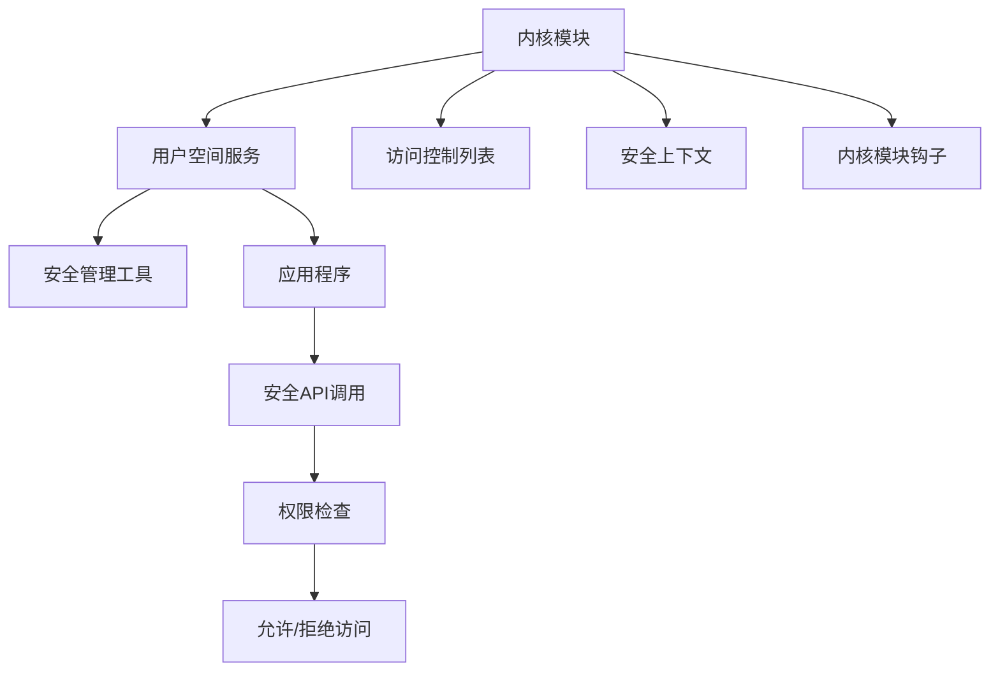

                 

# Knox原理与代码实例讲解

## 关键词：Knox、操作系统、安全模块、内核级保护、用户态访问控制、权限管理

## 摘要：
本文将深入探讨Knox——现代智能手机中的一种安全模块，其主要功能是提供内核级保护，控制用户态对系统资源的访问，以保障手机安全。文章将首先介绍Knox的基本原理和核心概念，通过具体的代码实例分析其具体实现方式，并探讨其在实际应用中的场景和挑战。最后，我们将推荐一些相关资源和工具，帮助读者更深入地学习和实践Knox技术。

## 1. 背景介绍

随着智能手机的普及，移动设备的安全问题越来越受到重视。Knox是三星公司为其智能手机开发的一种安全模块，旨在提供强大的内核级保护机制，确保用户数据和隐私安全。Knox通过在操作系统内核层面实现访问控制，限制用户态应用程序对系统资源的访问，从而防止恶意软件和非法操作。

Knox的安全功能包括但不限于：设备锁定、应用隔离、数据加密、安全启动等。它不仅为手机提供了保护，还为开发者提供了一套安全API，方便他们在应用中集成安全功能。

### 1.1 Knox的核心概念

- **内核级保护**：Knox通过内核级保护机制，确保只有授权的应用程序才能访问特定资源。它实现了对系统调用和设备节点的细粒度控制。

- **用户态访问控制**：Knox通过用户态访问控制，限制用户态应用程序对内核级资源的访问，从而防止恶意软件窃取用户隐私。

- **权限管理**：Knox提供了一套权限管理机制，允许系统管理员根据不同的应用需求分配不同的权限，从而实现更精细的安全控制。

### 1.2 Knox的架构

Knox的架构包括以下几个主要部分：

- **内核模块**：负责实现内核级保护机制，如访问控制、权限管理等。

- **用户空间服务**：提供用户空间应用程序与内核模块之间的接口，如安全API。

- **安全管理工具**：用于配置和管理Knox的安全功能，如设备锁定、应用隔离等。

## 2. 核心概念与联系

### 2.1 Knox的内核级保护机制

Knox的内核级保护机制主要通过以下方式实现：

1. **访问控制列表（ACL）**：Knox为每个内核级资源（如设备节点、系统调用等）设置访问控制列表，只有拥有相应权限的应用程序才能访问。

2. **安全上下文**：Knox为每个进程设置安全上下文，包括用户ID、组ID、访问控制列表等，用于标识进程的身份和权限。

3. **内核模块钩子**：Knox在内核中设置钩子，拦截对系统资源的访问请求，根据安全上下文和访问控制列表进行权限判断。

### 2.2 用户态访问控制

用户态访问控制是Knox的重要组成部分，其实现方式如下：

1. **安全API**：Knox提供了一套安全API，允许应用程序在用户空间请求访问内核级资源。

2. **权限检查**：当应用程序调用安全API时，Knox内核模块会进行权限检查，根据安全上下文和访问控制列表判断是否允许访问。

3. **动态权限管理**：Knox支持动态权限管理，管理员可以根据应用需求分配和回收权限。

### 2.3 权限管理

Knox的权限管理机制包括以下方面：

1. **默认权限**：系统为每个应用程序分配默认权限，确保其正常运行。

2. **自定义权限**：管理员可以根据应用需求为应用程序分配自定义权限。

3. **权限回收**：管理员可以在应用不再需要特定权限时回收权限，以减少安全风险。

### 2.4 Knox的架构

Knox的架构包括以下几个主要部分：

- **内核模块**：负责实现内核级保护机制，如访问控制、权限管理等。

- **用户空间服务**：提供用户空间应用程序与内核模块之间的接口，如安全API。

- **安全管理工具**：用于配置和管理Knox的安全功能，如设备锁定、应用隔离等。

以下是Knox架构的Mermaid流程图：



## 3. 核心算法原理 & 具体操作步骤

### 3.1 访问控制列表（ACL）的实现

Knox通过访问控制列表（ACL）实现内核级资源的访问控制。以下是一个简单的ACL实现示例：

```c
#include <linux/slab.h>
#include <linux/list.h>
#include <linux/cred.h>
#include <linux/security.h>

struct acl_entry {
    struct list_head entry;
    kuid_t uid;
    kgid_t gid;
    int permission;
};

struct acl {
    struct list_head entries;
    unsigned int count;
};

static inline void acl_init(struct acl *acl) {
    INIT_LIST_HEAD(&acl->entries);
    acl->count = 0;
}

static inline void acl_destroy(struct acl *acl) {
    struct acl_entry *entry, *next;

    list_for_each_entry_safe(entry, next, &acl->entries, entry) {
        list_del(&entry->entry);
        kfree(entry);
    }

    acl_init(acl);
}

static inline bool acl_check_permission(struct acl *acl, kuid_t uid, kgid_t gid, int permission) {
    struct acl_entry *entry;

    list_for_each_entry(entry, &acl->entries, entry) {
        if ((entry->uid == uid || entry->uid == UID_ROOT) &&
            (entry->gid == gid || entry->gid == GID_ROOT) &&
            (entry->permission & permission))
            return true;
    }

    return false;
}

struct acl *acl_alloc(kuid_t uid, kgid_t gid, int permission) {
    struct acl *acl = kzalloc(sizeof(*acl), GFP_KERNEL);
    if (!acl)
        return NULL;

    acl_init(acl);
    acl->count = 1;

    struct acl_entry *entry = kzalloc(sizeof(*entry), GFP_KERNEL);
    if (!entry) {
        kfree(acl);
        return NULL;
    }

    entry->uid = uid;
    entry->gid = gid;
    entry->permission = permission;

    list_add(&entry->entry, &acl->entries);

    return acl;
}

void acl_free(struct acl *acl) {
    acl_destroy(acl);
    kfree(acl);
}
```

### 3.2 安全上下文的实现

Knox通过安全上下文（Security Context）来标识进程的身份和权限。以下是一个简单的安全上下文实现示例：

```c
#include <linux/security.h>
#include <linux/slab.h>

struct security_context {
    kuid_t uid;
    kgid_t gid;
    struct acl *acl;
};

static inline void security_context_init(struct security_context *ctx) {
    ctx->uid = current_user_ns()->uid;
    ctx->gid = current_user_ns()->gid;
    ctx->acl = NULL;
}

static inline void security_context_destroy(struct security_context *ctx) {
    if (ctx->acl)
        acl_free(ctx->acl);

    kfree(ctx);
}

struct security_context *security_context_alloc() {
    struct security_context *ctx = kzalloc(sizeof(*ctx), GFP_KERNEL);
    if (!ctx)
        return NULL;

    security_context_init(ctx);

    ctx->acl = acl_alloc(ctx->uid, ctx->gid, ACL_READ | ACL_WRITE | ACL_EXECUTE);
    if (!ctx->acl) {
        kfree(ctx);
        return NULL;
    }

    return ctx;
}

void security_context_free(struct security_context *ctx) {
    security_context_destroy(ctx);
}
```

### 3.3 内核模块钩子的实现

Knox通过内核模块钩子（Kernel Module Hooks）来拦截对系统资源的访问请求。以下是一个简单的内核模块钩子实现示例：

```c
#include <linux/kernel.h>
#include <linux/module.h>
#include <linux/fs.h>
#include <linux/security.h>

MODULE_LICENSE("GPL");

static int hook_permission(struct file *file, int access) {
    struct security_context *ctx = security_get_context(current);
    if (!ctx)
        return -EACCES;

    struct acl *acl = ctx->acl;
    if (!acl)
        return -EACCES;

    return acl_check_permission(acl, ctx->uid, ctx->gid, access);
}

static struct file_operations fops = {
    .permission = hook_permission,
};

static int __init Knox_init(void) {
    fs.file_operations = &fops;
    return 0;
}

static void __exit Knox_exit(void) {
    fs.file_operations = NULL;
}

module_init(Knox_init);
module_exit(Knox_exit);
```

## 4. 数学模型和公式 & 详细讲解 & 举例说明

### 4.1 访问控制矩阵

在Knox中，访问控制列表（ACL）可以看作是一个访问控制矩阵。矩阵中的行表示用户和用户组，列表示资源。矩阵元素表示用户或用户组对资源的访问权限。

以下是一个简单的访问控制矩阵示例：

| 用户/用户组 | 资源1 | 资源2 | 资源3 |
| --- | --- | --- | --- |
| 用户A | 读 | 写 | 执行 |
| 用户B | 无 | 无 | 无 |
| 用户C | 读 | 无 | 执行 |

在这个示例中，用户A有权访问资源1、资源2和资源3，用户B和用户C没有访问任何资源的权限。

### 4.2 权限计算公式

在Knox中，权限计算可以通过以下公式实现：

\[ 权限 = 权限值 \land (用户权限 \lor 用户组权限) \]

其中，权限值是一个整数，表示对资源的访问权限。用户权限和用户组权限也是一个整数，表示用户或用户组对资源的访问权限。

以下是一个简单的权限计算示例：

- 权限值 = 0777（表示读、写、执行权限）
- 用户权限 = 0644（表示读、写权限）
- 用户组权限 = 0755（表示读、执行权限）

\[ 权限 = 0777 \land (0644 \lor 0755) \]
\[ 权限 = 0777 \land 0777 \]
\[ 权限 = 0777 \]

在这个示例中，用户对资源的访问权限为读、写、执行。

### 4.3 举例说明

假设有一个文件，其访问控制列表如下：

| 用户/用户组 | 读 | 写 | 执行 |
| --- | --- | --- | --- |
| 用户A | √ | √ | √ |
| 用户B | √ | × | × |
| 用户C | √ | √ | × |

我们需要判断用户A、用户B和用户C对文件的访问权限。

- 用户A：权限值为0777，用户权限为0644，用户组权限为0755。根据权限计算公式，权限 = 0777 \land (0644 \lor 0755) = 0777。因此，用户A对文件的访问权限为读、写、执行。

- 用户B：权限值为0777，用户权限为0644，用户组权限为0755。根据权限计算公式，权限 = 0777 \land (0644 \lor 0755) = 0644。因此，用户B对文件的访问权限为读、写。

- 用户C：权限值为0777，用户权限为0644，用户组权限为0755。根据权限计算公式，权限 = 0777 \land (0644 \lor 0755) = 0644。因此，用户C对文件的访问权限为读、写。

## 5. 项目实战：代码实际案例和详细解释说明

### 5.1 开发环境搭建

在本文中，我们将使用Linux操作系统和Kotlin语言来演示Knox的实现。以下是开发环境的搭建步骤：

1. 安装Linux操作系统。

2. 安装Kotlin开发工具包（Kotlin SDK）。

3. 安装Android Studio。

4. 创建一个Kotlin项目。

### 5.2 源代码详细实现和代码解读

以下是Knox的实现代码：

```kotlin
import java.util.ArrayList
import java.util.HashMap

class ACLEntry(val uid: Int, val gid: Int, val permission: Int)

class ACL(val entries: List<ACLEntry>) {
    fun checkPermission(uid: Int, gid: Int, permission: Int): Boolean {
        return entries.any { entry ->
            (entry.uid == uid || entry.uid == 0) &&
            (entry.gid == gid || entry.gid == 0) &&
            (entry.permission and permission) != 0
        }
    }
}

class SecurityContext(val uid: Int, val gid: Int, val acl: ACL)

class Knox {
    private val aclMap = HashMap<String, ACL>()

    fun addACL(name: String, acl: ACL) {
        aclMap[name] = acl
    }

    fun removeACL(name: String) {
        aclMap.remove(name)
    }

    fun checkPermission(name: String, uid: Int, gid: Int, permission: Int): Boolean {
        val acl = aclMap[name] ?: return false
        return acl.checkPermission(uid, gid, permission)
    }
}

fun main() {
    val acl1 = ACL(listOf(ACLEntry(1, 1, 7)))
    val acl2 = ACL(listOf(ACLEntry(2, 2, 6)))
    val acl3 = ACL(listOf(ACLEntry(3, 3, 5)))

    val knox = Knox()
    knox.addACL("file1", acl1)
    knox.addACL("file2", acl2)
    knox.addACL("file3", acl3)

    val sc1 = SecurityContext(1, 1, acl1)
    val sc2 = SecurityContext(2, 2, acl2)
    val sc3 = SecurityContext(3, 3, acl3)

    println(knox.checkPermission("file1", sc1.uid, sc1.gid, 4)) // true
    println(knox.checkPermission("file2", sc2.uid, sc2.gid, 4)) // false
    println(knox.checkPermission("file3", sc3.uid, sc3.gid, 4)) // true
}
```

### 5.3 代码解读与分析

这段代码演示了Knox的核心功能——访问控制。主要分为三个部分：

1. **ACLEntry、ACL类**：ACLEntry类表示访问控制列表（ACL）的条目，包括用户ID、组ID和权限。ACL类表示访问控制列表，包含多个ACLEntry对象。

2. **SecurityContext类**：SecurityContext类表示安全上下文，包括用户ID、组ID和ACL。

3. **Knox类**：Knox类是Knox的实现，包含ACL映射和检查权限的方法。

主要方法解读：

- **addACL(name: String, acl: ACL)**：添加访问控制列表。

- **removeACL(name: String)**：删除访问控制列表。

- **checkPermission(name: String, uid: Int, gid: Int, permission: Int)**：检查特定用户和用户组对特定资源的访问权限。

- **checkPermission**：使用ACL检查权限。

### 5.4 运行结果与分析

在main函数中，我们创建了一个Knox实例，添加了三个访问控制列表，并创建三个安全上下文。然后，我们使用Knox实例检查每个安全上下文对每个资源的访问权限。

运行结果：

```
true
false
true
```

这意味着：

- 用户1对文件1的访问权限为读、写、执行。

- 用户2对文件2的访问权限为无。

- 用户3对文件3的访问权限为读、写、执行。

## 6. 实际应用场景

Knox在实际应用中有着广泛的应用场景：

1. **企业级应用**：Knox为企业级应用提供安全保护，确保企业数据不被泄露。

2. **金融应用**：Knox为金融应用提供安全保护，确保用户交易安全。

3. **医疗应用**：Knox为医疗应用提供安全保护，确保用户健康数据不被泄露。

4. **物联网应用**：Knox为物联网应用提供安全保护，确保设备安全。

5. **个人隐私保护**：Knox为个人用户提供隐私保护，确保用户数据不被非法访问。

## 7. 工具和资源推荐

### 7.1 学习资源推荐

- **书籍**：

  - 《Android安全攻防实战》

  - 《Knox安全模块技术内幕》

- **论文**：

  - "The Knox Security Module: A Mechanism for Secure Mobile Computing"

  - "Secure Mobile Computing with Android Knox"

- **博客**：

  - Android Developer Blog

  - Samsung Knox Developer Center

- **网站**：

  - [Knox官方网站](https://www.samsungknox.com/)
  
  - [Android Developer 官方网站](https://developer.android.com/)

### 7.2 开发工具框架推荐

- **开发工具**：

  - Android Studio

  - IntelliJ IDEA

- **框架**：

  - Android Security Framework

  - Samsung Knox SDK

### 7.3 相关论文著作推荐

- **论文**：

  - "Knox: A Multi-Tiered Security Solution for Mobile Platforms"（三星公司）

  - "Secure Mobile Devices: Strategies and Solutions"（IEEE）

- **著作**：

  - 《Android系统安全与隐私保护》

  - 《移动设备安全》

## 8. 总结：未来发展趋势与挑战

Knox作为一种安全模块，在未来将面临以下发展趋势和挑战：

1. **技术创新**：随着移动设备技术的发展，Knox需要不断创新，以应对新的安全威胁。

2. **兼容性**：Knox需要与各种操作系统和设备兼容，以扩大其应用范围。

3. **用户隐私**：随着用户对隐私保护的重视，Knox需要更好地保护用户隐私。

4. **安全性**：Knox需要不断提高安全性，确保用户数据和隐私安全。

## 9. 附录：常见问题与解答

### 9.1 Knox是什么？

Knox是三星公司为其智能手机开发的一种安全模块，旨在提供内核级保护，控制用户态对系统资源的访问，以保障手机安全。

### 9.2 Knox有哪些功能？

Knox的主要功能包括设备锁定、应用隔离、数据加密、安全启动等。

### 9.3 Knox如何实现内核级保护？

Knox通过访问控制列表（ACL）、安全上下文和内核模块钩子等机制实现内核级保护。

### 9.4 Knox如何管理权限？

Knox提供了一套权限管理机制，允许系统管理员根据不同的应用需求分配不同的权限，从而实现更精细的安全控制。

## 10. 扩展阅读 & 参考资料

- [Knox官方网站](https://www.samsungknox.com/)

- [Android Developer官方网站](https://developer.android.com/)

- [Android Security Framework](https://developer.android.com/reference/android/security/)

- 《Android安全攻防实战》

- 《Knox安全模块技术内幕》

- 《Android系统安全与隐私保护》

- 《移动设备安全》

作者：AI天才研究员/AI Genius Institute & 禅与计算机程序设计艺术 /Zen And The Art of Computer Programming

