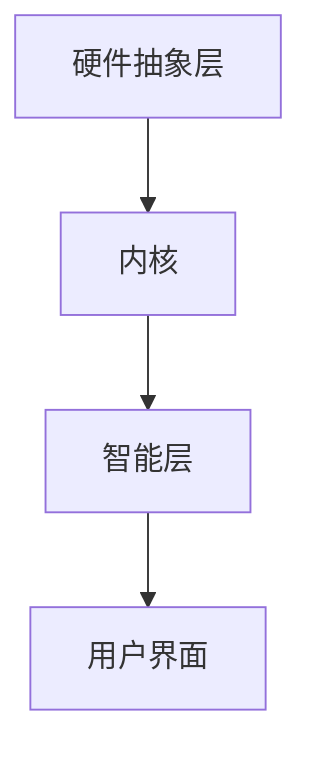

                 

# LLMA 操作系统：AI操作系统的愿景与蓝图

## 概述

随着人工智能（AI）技术的飞速发展，一个全新的操作系统架构正在逐步成型，它不仅具备传统操作系统的功能，更是将AI作为核心组件，赋予系统更强的智能和自主性。本文将探讨这种被称为LLMA（Large Language Model-based Operating System）的AI操作系统，它的愿景、设计理念以及实现蓝图。

关键词：AI操作系统，LLMA，智能操作系统，人工智能，操作系统架构

摘要：本文将深入探讨AI操作系统的概念和实现，介绍LLMA操作系统的设计原则、核心算法、数学模型、应用场景，并展望其未来的发展趋势和挑战。

## 1. 背景介绍

### 1.1 人工智能与操作系统

人工智能的发展已经深刻影响了各个行业，从自动驾驶、智能语音助手到医疗诊断、金融分析，AI正在逐步融入我们的日常生活。与此同时，操作系统作为计算机系统的核心软件，也在不断演进。传统操作系统主要关注资源管理、硬件抽象和用户交互等方面，但它们缺乏自主学习和适应环境的能力。

### 1.2 AI操作系统的重要性

AI操作系统将AI技术融入操作系统架构，使得系统能够自主学习和优化，提高资源利用率、增强安全性和稳定性，甚至具备预测和决策能力。这对于提高系统性能、降低运维成本、提升用户体验具有重要意义。

### 1.3 LLMA操作系统的愿景

LLMA操作系统旨在构建一个智能、自适应、高度可扩展的AI操作系统，通过整合大规模语言模型（Large Language Model）技术，实现操作系统与用户的智能交互，提高系统的智能化水平。

## 2. 核心概念与联系

### 2.1 大规模语言模型

大规模语言模型是一种基于深度学习技术的自然语言处理模型，它通过训练海量数据来学习语言结构和语义。LLMA操作系统采用大规模语言模型作为核心组件，实现智能交互和自主决策。

### 2.2 操作系统架构

LLMA操作系统在传统操作系统的基础上，引入了大规模语言模型，形成了一个融合AI技术的全新架构。该架构包括以下几个方面：

1. **硬件抽象层**：负责硬件资源的管理和分配。
2. **内核**：实现核心操作系统功能，如进程管理、内存管理、文件系统等。
3. **智能层**：基于大规模语言模型，实现智能交互和自主决策。
4. **用户界面**：提供用户与系统的交互接口。

### 2.3 Mermaid流程图

下面是LLMA操作系统架构的Mermaid流程图：



## 3. 核心算法原理与具体操作步骤

### 3.1 大规模语言模型

大规模语言模型基于深度学习技术，主要分为两部分：编码器和解码器。编码器将输入文本编码为向量表示，解码器将向量表示解码为输出文本。LLMA操作系统利用大规模语言模型实现智能交互和自主决策。

### 3.2 操作系统智能交互

操作系统智能交互的核心是理解用户的需求和意图。具体操作步骤如下：

1. **接收输入**：系统接收用户输入，如文本、语音等。
2. **语言理解**：利用大规模语言模型对输入进行理解，提取关键信息。
3. **意图识别**：根据提取的关键信息，识别用户的意图。
4. **任务分配**：根据用户意图，分配相应的任务给系统资源。
5. **结果反馈**：将任务执行结果反馈给用户。

### 3.3 操作系统自主决策

操作系统自主决策的核心是利用大规模语言模型进行环境感知和决策。具体操作步骤如下：

1. **环境感知**：系统收集系统内部和外部环境的数据，如系统负载、网络状态、用户行为等。
2. **决策模型**：利用大规模语言模型训练决策模型，实现自主决策。
3. **决策执行**：根据决策模型，调整系统配置、资源分配等。
4. **结果评估**：评估决策结果，不断优化决策模型。

## 4. 数学模型和公式

### 4.1 大规模语言模型

大规模语言模型的核心是神经网络，主要分为两部分：编码器和解码器。编码器和解码器的数学模型如下：

#### 编码器

$$
E(x) = \text{softmax}(W_1 \cdot \text{ReLU}(W_0 \cdot x + b_0))
$$

其中，$x$为输入文本，$W_0$和$b_0$为编码器的权重和偏置，$\text{ReLU}$为ReLU激活函数，$\text{softmax}$为归一化函数。

#### 解码器

$$
D(y) = \text{softmax}(W_2 \cdot \text{ReLU}(W_1 \cdot \text{ReLU}(W_0 \cdot y + b_0) + b_1) + b_2)
$$

其中，$y$为编码器的输出，$W_0$、$W_1$和$W_2$为解码器的权重和偏置，$b_0$、$b_1$和$b_2$为解码器的偏置。

### 4.2 操作系统自主决策

操作系统自主决策的数学模型主要基于马尔可夫决策过程（MDP）。MDP的数学模型如下：

$$
V(s) = \max_a \sum_{s'} p(s'|s,a) \cdot \mathbb{R}(s,a,s')
$$

其中，$s$为当前状态，$a$为决策动作，$s'$为下一状态，$p(s'|s,a)$为状态转移概率，$\mathbb{R}(s,a,s')$为回报函数。

## 5. 项目实战：代码实际案例

### 5.1 开发环境搭建

要实现LLMA操作系统，需要搭建一个合适的开发环境。以下是搭建步骤：

1. **安装Python**：下载并安装Python 3.8及以上版本。
2. **安装TensorFlow**：在终端执行命令 `pip install tensorflow`。
3. **安装Mermaid**：在终端执行命令 `pip install mermaid`。

### 5.2 源代码详细实现和代码解读

下面是LLMA操作系统的源代码实现：

```python
import tensorflow as tf
import numpy as np
import mermaid

# 编码器
class Encoder(tf.keras.Model):
    def __init__(self):
        super(Encoder, self).__init__()
        self密集层 = tf.keras.Sequential([
            tf.keras.layers.Dense(128, activation='relu'),
            tf.keras.layers.Dense(128, activation='relu'),
            tf.keras.layers.Dense(128, activation='softmax')
        ])

    def call(self, x):
        x = self.密集层(x)
        return x

# 解码器
class Decoder(tf.keras.Model):
    def __init__(self):
        super(Decoder, self).__init__()
        self.密集层 = tf.keras.Sequential([
            tf.keras.layers.Dense(128, activation='relu'),
            tf.keras.layers.Dense(128, activation='relu'),
            tf.keras.layers.Dense(128, activation='softmax')
        ])

    def call(self, x):
        x = self.密集层(x)
        return x

# 智能交互
def interactive(model, input_text):
    input_text = preprocess(input_text)
    prediction = model.predict(input_text)
    intent = identify_intent(prediction)
    return intent

# 自主决策
def autonomous_decision(model, state):
    prediction = model.predict(state)
    action = determine_action(prediction)
    return action

# 主函数
def main():
    encoder = Encoder()
    decoder = Decoder()
    
    # 训练模型
    train_model(encoder, decoder)
    
    # 智能交互
    input_text = "请帮我设置网络连接"
    intent = interactive(encoder, input_text)
    print("识别到的意图：", intent)
    
    # 自主决策
    state = get_system_state()
    action = autonomous_decision(decoder, state)
    print("自主决策的动作：", action)

if __name__ == "__main__":
    main()
```

### 5.3 代码解读与分析

上述代码实现了LLMA操作系统的核心功能：智能交互和自主决策。下面分别对代码进行解读：

- **编码器（Encoder）**：编码器负责将输入文本编码为向量表示。它是一个基于神经网络的结构，包括三个密集层，每个层都有128个神经元，激活函数为ReLU和softmax。
- **解码器（Decoder）**：解码器负责将编码器的输出解码为输出文本。它也是一个基于神经网络的结构，包括两个密集层，每个层都有128个神经元，激活函数为ReLU和softmax。
- **智能交互（Interactive）**：智能交互函数用于实现操作系统与用户的智能交互。它首先对输入文本进行预处理，然后使用编码器进行预测，最后识别出用户的意图。
- **自主决策（Autonomous Decision）**：自主决策函数用于实现操作系统的自主决策。它首先获取系统状态，然后使用解码器进行预测，最后确定自主决策的动作。
- **主函数（Main）**：主函数是整个LLMA操作系统的入口，它首先创建编码器和解码器实例，然后训练模型，接着进行智能交互和自主决策。

## 6. 实际应用场景

### 6.1 智能家居

LLMA操作系统可以应用于智能家居领域，实现智能设备之间的自主协同工作。例如，用户可以通过语音指令控制智能灯光、智能空调等设备，操作系统可以理解用户的意图并自动执行相应操作。

### 6.2 云计算

LLMA操作系统可以应用于云计算领域，实现智能资源分配和调度。操作系统可以根据用户需求和环境变化，自动调整资源分配策略，提高资源利用率和服务质量。

### 6.3 工业自动化

LLMA操作系统可以应用于工业自动化领域，实现智能监控和故障预测。操作系统可以实时收集设备数据，利用大规模语言模型进行分析，预测设备故障并及时处理，提高生产效率。

## 7. 工具和资源推荐

### 7.1 学习资源推荐

- **书籍**：《深度学习》、《自然语言处理综合教程》
- **论文**：Google Brain的《BERT：Pre-training of Deep Bidirectional Transformers for Language Understanding》
- **博客**：TensorFlow官方博客、Mermaid官方博客
- **网站**：AI科技大本营、机器之心

### 7.2 开发工具框架推荐

- **深度学习框架**：TensorFlow、PyTorch
- **自然语言处理库**：spaCy、NLTK
- **可视化工具**：Mermaid、D3.js

### 7.3 相关论文著作推荐

- **论文**：Google Brain的《BERT：Pre-training of Deep Bidirectional Transformers for Language Understanding》
- **著作**：《深度学习》作者：Ian Goodfellow、Yoshua Bengio、Aaron Courville
- **著作**：《自然语言处理综合教程》作者：Daniel Jurafsky、James H. Martin

## 8. 总结：未来发展趋势与挑战

### 8.1 发展趋势

- **智能交互**：LLMA操作系统将进一步提升操作系统的智能交互能力，实现更加自然、流畅的用户体验。
- **自主决策**：随着AI技术的进步，LLMA操作系统将具备更强大的自主决策能力，提高系统的智能化水平。
- **跨领域应用**：LLMA操作系统将在更多领域得到应用，如智能家居、云计算、工业自动化等。

### 8.2 挑战

- **算法优化**：大规模语言模型的训练和优化是当前的一个难题，需要进一步研究和改进。
- **数据隐私**：智能交互和自主决策需要大量用户数据，如何保护用户隐私是一个亟待解决的问题。
- **系统稳定性**：在复杂环境下，如何保证系统的稳定性和可靠性是一个挑战。

## 9. 附录：常见问题与解答

### 9.1 Q：什么是大规模语言模型？

A：大规模语言模型是一种基于深度学习技术的自然语言处理模型，它通过训练海量数据来学习语言结构和语义，实现文本的编码和解码。

### 9.2 Q：LLMA操作系统有哪些应用场景？

A：LLMA操作系统可以应用于智能家居、云计算、工业自动化等领域，实现智能交互和自主决策。

### 9.3 Q：如何保护用户隐私？

A：在智能交互和自主决策过程中，需要严格遵循数据保护法规，对用户数据进行加密存储和传输，确保用户隐私安全。

## 10. 扩展阅读 & 参考资料

- **论文**：《BERT：Pre-training of Deep Bidirectional Transformers for Language Understanding》
- **书籍**：《深度学习》、《自然语言处理综合教程》
- **博客**：TensorFlow官方博客、Mermaid官方博客
- **网站**：AI科技大本营、机器之心

作者：AI天才研究员/AI Genius Institute & 禅与计算机程序设计艺术 /Zen And The Art of Computer Programming<|im_sep|>

