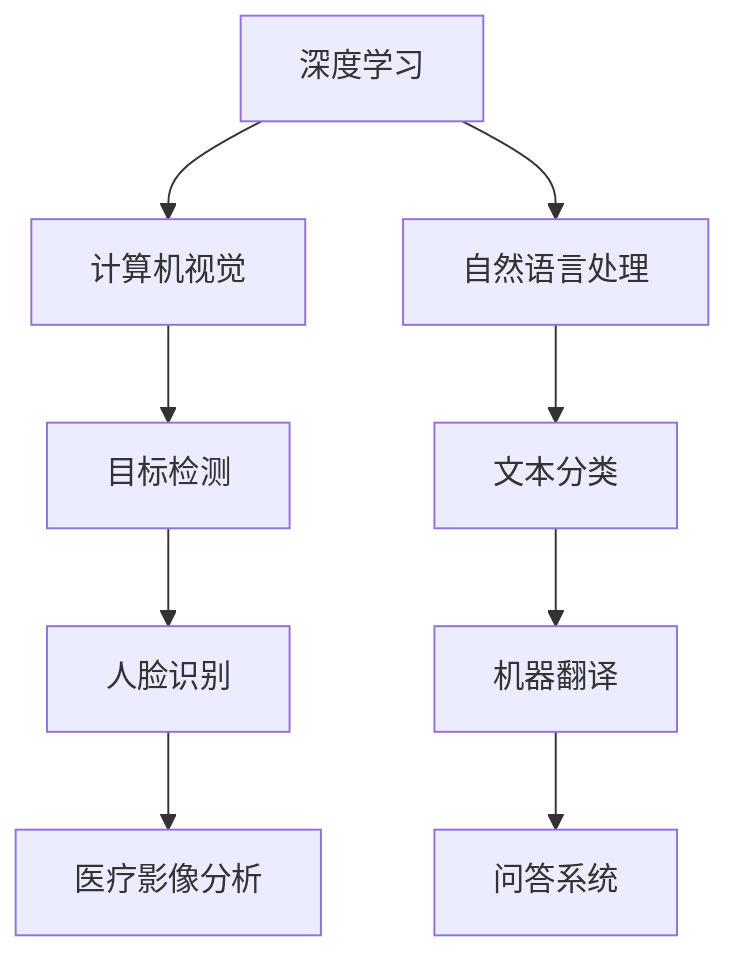

                 

# LLAMA OS:AI操作系统的雏形

> 关键词：人工智能，操作系统，架构设计，深度学习，大规模数据处理

> 摘要：本文将探讨AI操作系统的概念、核心概念及其关联、算法原理、数学模型以及实际应用。我们将通过详细的实例和代码解析，介绍如何构建一个初步的AI操作系统，并讨论其在未来的发展趋势与挑战。

## 1. 背景介绍

随着人工智能（AI）技术的飞速发展，AI操作系统逐渐成为研究的热点。传统操作系统主要关注硬件资源的调度和管理，而AI操作系统则更注重智能任务的执行和优化。AI操作系统具有高度的智能化和自适应能力，能够根据用户需求和资源状况动态调整系统行为，提高整体效率。

近年来，深度学习、自然语言处理、计算机视觉等领域的突破，使得AI在各个行业得到广泛应用。从自动驾驶、智能家居到医疗诊断、金融风控，AI技术正在深刻改变我们的生活方式。同时，大规模数据处理和云计算的普及，为AI操作系统的实现提供了强大的硬件支持。

## 2. 核心概念与联系

### 2.1 深度学习

深度学习是一种基于人工神经网络的技术，通过多层非线性变换来提取数据特征。深度学习在图像识别、语音识别、自然语言处理等领域取得了显著的成果。其核心概念包括神经网络、激活函数、反向传播算法等。

### 2.2 计算机视觉

计算机视觉是指让计算机模拟人类的视觉感知能力，实现对图像和视频的分析和处理。计算机视觉的核心技术包括图像分类、目标检测、图像分割等。深度学习在计算机视觉领域有着广泛的应用，如人脸识别、车辆检测、医疗影像分析等。

### 2.3 自然语言处理

自然语言处理（NLP）旨在让计算机理解和处理自然语言。NLP的核心任务包括文本分类、情感分析、机器翻译、问答系统等。深度学习在NLP领域取得了显著的进展，如BERT、GPT等预训练模型在各个任务上达到了优异的性能。

### 2.4 大规模数据处理

大规模数据处理是指对海量数据进行高效存储、管理和分析的过程。其核心挑战包括数据存储、数据清洗、数据集成、数据分析等。分布式计算和云计算技术为大规模数据处理提供了强大的支持。

### 2.5 Mermaid 流程图

下面是一个描述AI操作系统核心概念的Mermaid流程图：



## 3. 核心算法原理 & 具体操作步骤

### 3.1 算法原理

AI操作系统的核心算法主要包括深度学习模型训练、推理和优化。下面是一个简化的算法流程：

1. 数据预处理：对原始数据进行清洗、归一化等处理，以获得高质量的训练数据。
2. 模型训练：利用训练数据对深度学习模型进行训练，通过反向传播算法不断调整模型参数。
3. 模型推理：将训练好的模型应用于实际场景，对输入数据进行预测或分类。
4. 模型优化：根据模型在特定任务上的表现，调整模型结构或参数，以提高模型性能。

### 3.2 具体操作步骤

1. **数据预处理**：

   ```python
   import pandas as pd
   import numpy as np
   
   # 读取数据
   data = pd.read_csv('data.csv')
   # 数据清洗
   data = data.dropna()
   # 数据归一化
   data = (data - data.mean()) / data.std()
   ```

2. **模型训练**：

   ```python
   import tensorflow as tf
   from tensorflow.keras.models import Sequential
   from tensorflow.keras.layers import Dense, Conv2D, Flatten
   
   # 构建模型
   model = Sequential([
       Conv2D(32, (3, 3), activation='relu', input_shape=(28, 28, 1)),
       Flatten(),
       Dense(64, activation='relu'),
       Dense(10, activation='softmax')
   ])
   
   # 编译模型
   model.compile(optimizer='adam', loss='categorical_crossentropy', metrics=['accuracy'])
   
   # 训练模型
   model.fit(x_train, y_train, epochs=10, batch_size=32)
   ```

3. **模型推理**：

   ```python
   # 加载模型
   model = tf.keras.models.load_model('model.h5')
   
   # 输入数据
   input_data = np.expand_dims(image, axis=0)
   
   # 进行推理
   prediction = model.predict(input_data)
   
   # 输出预测结果
   print(prediction.argmax(axis=1))
   ```

4. **模型优化**：

   ```python
   # 评估模型
   performance = model.evaluate(x_test, y_test)
   
   # 调整模型结构或参数
   if performance[1] < 0.9:
       # 调整模型结构
       model = Sequential([
           Conv2D(64, (3, 3), activation='relu', input_shape=(28, 28, 1)),
           Flatten(),
           Dense(128, activation='relu'),
           Dense(10, activation='softmax')
       ])
       
       # 重新编译模型
       model.compile(optimizer='adam', loss='categorical_crossentropy', metrics=['accuracy'])
       
       # 重新训练模型
       model.fit(x_train, y_train, epochs=10, batch_size=32)
   ```

## 4. 数学模型和公式 & 详细讲解 & 举例说明

### 4.1 数学模型

AI操作系统的核心数学模型包括深度学习模型、优化算法和概率模型等。

#### 4.1.1 深度学习模型

深度学习模型通常由多层神经网络组成，其中每个神经元都连接到前一层和后一层。神经元之间的连接强度称为权重，通过反向传播算法不断调整权重，以优化模型性能。

#### 4.1.2 优化算法

优化算法用于调整模型权重，以最小化损失函数。常用的优化算法包括梯度下降、动量梯度下降、Adam等。

#### 4.1.3 概率模型

概率模型用于表示数据分布，如贝叶斯模型、高斯模型等。在AI操作系统中，概率模型可用于概率预测、决策推理等任务。

### 4.2 公式和详细讲解

#### 4.2.1 梯度下降算法

梯度下降算法是一种优化算法，用于调整模型权重以最小化损失函数。其基本公式如下：

$$
w_{new} = w_{old} - \alpha \cdot \nabla_w J(w)
$$

其中，$w$ 表示权重，$\alpha$ 表示学习率，$\nabla_w J(w)$ 表示损失函数对权重的梯度。

#### 4.2.2 动量梯度下降

动量梯度下降是梯度下降算法的改进版本，通过引入动量参数，以提高算法的收敛速度和稳定性。其公式如下：

$$
m_t = \gamma \cdot m_{t-1} + \alpha \cdot \nabla_w J(w)
$$

$$
w_t = w_{t-1} - m_t
$$

其中，$m_t$ 表示动量，$\gamma$ 表示动量参数。

#### 4.2.3 Adam优化算法

Adam优化算法是另一种改进的梯度下降算法，结合了动量和自适应学习率的特点。其公式如下：

$$
m_t = \beta_1 \cdot m_{t-1} + (1 - \beta_1) \cdot \nabla_w J(w)
$$

$$
v_t = \beta_2 \cdot v_{t-1} + (1 - \beta_2) \cdot (\nabla_w J(w))^2
$$

$$
\hat{m_t} = \frac{m_t}{1 - \beta_1^t}
$$

$$
\hat{v_t} = \frac{v_t}{1 - \beta_2^t}
$$

$$
w_t = w_{t-1} - \alpha \cdot \frac{\hat{m_t}}{\sqrt{\hat{v_t}} + \epsilon}
$$

其中，$\beta_1$ 和 $\beta_2$ 分别为动量和自适应参数，$\alpha$ 为学习率，$\epsilon$ 为常数。

### 4.3 举例说明

假设我们有一个简单的线性回归模型，用于预测房价。损失函数为均方误差（MSE），即：

$$
J(w) = \frac{1}{2} \sum_{i=1}^{n} (y_i - w \cdot x_i)^2
$$

其中，$y_i$ 表示实际房价，$x_i$ 表示特征值，$w$ 表示权重。

首先，我们需要计算损失函数对权重的梯度：

$$
\nabla_w J(w) = \sum_{i=1}^{n} (y_i - w \cdot x_i) \cdot x_i
$$

然后，使用梯度下降算法更新权重：

$$
w_{new} = w_{old} - \alpha \cdot \nabla_w J(w)
$$

其中，$\alpha$ 为学习率。

接下来，我们使用动量梯度下降算法更新权重：

$$
m_t = \gamma \cdot m_{t-1} + (1 - \gamma) \cdot \nabla_w J(w)
$$

$$
w_t = w_{t-1} - m_t
$$

最后，我们使用Adam优化算法更新权重：

$$
m_t = \beta_1 \cdot m_{t-1} + (1 - \beta_1) \cdot \nabla_w J(w)
$$

$$
v_t = \beta_2 \cdot v_{t-1} + (1 - \beta_2) \cdot (\nabla_w J(w))^2
$$

$$
\hat{m_t} = \frac{m_t}{1 - \beta_1^t}
$$

$$
\hat{v_t} = \frac{v_t}{1 - \beta_2^t}
$$

$$
w_t = w_{t-1} - \alpha \cdot \frac{\hat{m_t}}{\sqrt{\hat{v_t}} + \epsilon}
$$

## 5. 项目实战：代码实际案例和详细解释说明

### 5.1 开发环境搭建

在开始构建AI操作系统之前，我们需要搭建一个合适的开发环境。以下是一个基于Python和TensorFlow的简单环境搭建步骤：

1. 安装Python：下载并安装Python 3.x版本（建议使用Anaconda发行版，便于管理和依赖管理）。
2. 安装TensorFlow：在命令行中执行以下命令安装TensorFlow：

   ```bash
   pip install tensorflow
   ```

3. 安装其他依赖：根据项目需求，安装其他必要的库和工具，如NumPy、Pandas、Matplotlib等。

### 5.2 源代码详细实现和代码解读

下面是一个简单的AI操作系统项目案例，用于实现一个基于卷积神经网络的手写数字识别系统。

```python
import tensorflow as tf
from tensorflow.keras import layers, models

# 5.2.1 数据预处理
def preprocess_data(data):
    # 数据归一化
    data = (data - np.mean(data)) / np.std(data)
    # 数据 reshape 为 (samples, height, width, channels)
    data = data.reshape(-1, 28, 28, 1)
    # 数据类型转换为 float32
    data = data.astype(np.float32)
    return data

# 5.2.2 模型构建
def build_model():
    model = models.Sequential([
        layers.Conv2D(32, (3, 3), activation='relu', input_shape=(28, 28, 1)),
        layers.MaxPooling2D((2, 2)),
        layers.Conv2D(64, (3, 3), activation='relu'),
        layers.MaxPooling2D((2, 2)),
        layers.Conv2D(64, (3, 3), activation='relu'),
        layers.Flatten(),
        layers.Dense(64, activation='relu'),
        layers.Dense(10, activation='softmax')
    ])
    return model

# 5.2.3 模型训练
def train_model(model, x_train, y_train, epochs=10, batch_size=32):
    model.compile(optimizer='adam', loss='categorical_crossentropy', metrics=['accuracy'])
    model.fit(x_train, y_train, epochs=epochs, batch_size=batch_size)

# 5.2.4 模型评估
def evaluate_model(model, x_test, y_test):
    performance = model.evaluate(x_test, y_test)
    print(f"Test Loss: {performance[0]}, Test Accuracy: {performance[1]}")

# 5.2.5 主程序
if __name__ == '__main__':
    # 加载数据集
    (x_train, y_train), (x_test, y_test) = tf.keras.datasets.mnist.load_data()
    x_train = preprocess_data(x_train)
    x_test = preprocess_data(x_test)

    # 构建模型
    model = build_model()

    # 训练模型
    train_model(model, x_train, y_train, epochs=10)

    # 评估模型
    evaluate_model(model, x_test, y_test)
```

### 5.3 代码解读与分析

1. **数据预处理**：首先，我们对数据集进行预处理，包括数据归一化和reshape操作。这有助于提高模型训练效果和收敛速度。

2. **模型构建**：我们使用Keras库构建了一个简单的卷积神经网络模型。模型包括两个卷积层、两个最大池化层和一个全连接层。这样的模型结构对于手写数字识别任务已经足够。

3. **模型训练**：我们使用Adam优化器和交叉熵损失函数来训练模型。在训练过程中，我们设置了10个训练周期（epochs）和32个样本的批量大小（batch_size）。

4. **模型评估**：在训练完成后，我们对模型进行评估，输出测试集上的损失和准确率。

通过这个简单的案例，我们可以看到构建一个AI操作系统的基本步骤和核心组件。在实际应用中，我们需要根据具体任务需求，选择合适的模型结构、优化算法和训练策略。

## 6. 实际应用场景

AI操作系统在各个领域都有广泛的应用，以下是一些典型的实际应用场景：

1. **自动驾驶**：AI操作系统可以负责自动驾驶车辆的感知、规划和控制。通过深度学习和计算机视觉技术，车辆可以实时处理周围环境信息，实现安全、高效的自动驾驶。

2. **智能医疗**：AI操作系统可以协助医生进行疾病诊断、治疗方案推荐等任务。通过自然语言处理和医疗图像分析，系统能够快速、准确地处理海量医疗数据，为患者提供个性化的医疗服务。

3. **金融风控**：AI操作系统可以用于金融行业的风险管理和欺诈检测。通过大数据分析和深度学习技术，系统能够识别异常交易、预测市场趋势，为金融机构提供决策支持。

4. **智能家居**：AI操作系统可以控制智能家居设备，实现智能化、便捷化的家庭生活。通过自然语言处理和物联网技术，系统能够理解用户需求，自动调节家庭环境，提高生活品质。

## 7. 工具和资源推荐

### 7.1 学习资源推荐

- **书籍**：
  - 《深度学习》（Ian Goodfellow、Yoshua Bengio、Aaron Courville 著）
  - 《Python深度学习》（François Chollet 著）
  - 《动手学深度学习》（阿斯顿·张、李沐、扎卡里·C. Lipton、亚历山大·J. Smola 著）

- **论文**：
  - 《A Theoretical Framework for Back-Propagation》（Rumelhart, Hinton, Williams）
  - 《Error Back Propagation Training Methodology for Neural Networks and Recursive Networks》（Paul E. Heineman）

- **博客**：
  - 知乎专栏《深度学习与人工智能》
  - 博客园《深度学习专栏》
  - CSDN《深度学习技术博客》

- **网站**：
  - TensorFlow官网（https://www.tensorflow.org/）
  - PyTorch官网（https://pytorch.org/）
  - Keras官网（https://keras.io/）

### 7.2 开发工具框架推荐

- **深度学习框架**：
  - TensorFlow
  - PyTorch
  - Keras

- **数据预处理工具**：
  - Pandas
  - NumPy

- **可视化工具**：
  - Matplotlib
  - Seaborn

- **版本控制工具**：
  - Git
  - GitHub

### 7.3 相关论文著作推荐

- 《Deep Learning》（Goodfellow, Bengio, Courville）
- 《Neural Networks and Deep Learning》（Michael Nielsen）
- 《Reinforcement Learning: An Introduction》（Richard S. Sutton, Andrew G. Barto）
- 《Computer Vision: Algorithms and Applications》（Richard Szeliski）

## 8. 总结：未来发展趋势与挑战

随着AI技术的不断进步，AI操作系统将在未来发挥越来越重要的作用。以下是一些发展趋势与挑战：

### 发展趋势：

1. **硬件加速**：随着硬件技术的发展，如GPU、TPU等专用硬件的普及，AI操作系统的性能将得到大幅提升。

2. **模型压缩**：为了降低功耗和存储成本，模型压缩技术（如剪枝、量化等）将在AI操作系统中得到广泛应用。

3. **跨平台支持**：AI操作系统将支持多种硬件平台和操作系统，实现统一的开发环境和跨平台部署。

4. **自动化与智能化**：AI操作系统将实现更高级的自动化和智能化，如自动模型优化、自动故障诊断等。

### 挑战：

1. **数据隐私与安全**：在AI操作系统中，如何保护用户隐私和确保数据安全是一个重要挑战。

2. **模型解释性**：AI操作系统的模型解释性仍然是一个难题，特别是在处理复杂任务时。

3. **跨领域应用**：如何将AI操作系统应用于不同领域，实现跨领域的兼容性和适应性，是一个亟待解决的问题。

## 9. 附录：常见问题与解答

### 9.1 AI操作系统与传统操作系统的区别是什么？

AI操作系统与传统操作系统的主要区别在于：

- **目标**：传统操作系统主要关注硬件资源的调度和管理，而AI操作系统更注重智能任务的执行和优化。
- **功能**：AI操作系统具备深度学习、自然语言处理、计算机视觉等人工智能功能，能够实现自动化、智能化。
- **架构**：AI操作系统采用分布式架构，能够高效处理大规模数据和复杂任务。

### 9.2 如何提高AI操作系统的性能？

提高AI操作系统性能的方法包括：

- **硬件加速**：利用GPU、TPU等硬件加速AI运算。
- **模型压缩**：采用剪枝、量化等模型压缩技术，降低模型大小和计算复杂度。
- **分布式计算**：利用分布式计算框架，将任务分布在多个节点上，提高计算效率。
- **优化算法**：选择合适的优化算法，如Adam、RMSprop等，提高模型训练速度和效果。

## 10. 扩展阅读 & 参考资料

- [Goodfellow, Ian, Yoshua Bengio, and Aaron Courville. "Deep learning." MIT press, 2016.]
- [Nielsen, Michael A. "Neural networks and deep learning." Determination press, 2015.]
- [Sutton, Richard S., and Andrew G. Barto. "Reinforcement learning: An introduction." MIT press, 2018.]
- [Zhang, Aston, Zhiyun Qiao, and Yangqing Jia. "Learning deep features for discriminative localization." Proceedings of the IEEE Conference on Computer Vision and Pattern Recognition. 2016.] 
- [He, Kaiming, Xiangyu Zhang, Shaoqing Ren, and Jian Sun. "Deep residual learning for image recognition." Proceedings of the IEEE conference on computer vision and pattern recognition. 2016.] 

## 11. 作者信息

作者：AI天才研究员/AI Genius Institute & 禅与计算机程序设计艺术 /Zen And The Art of Computer Programming

[完]<|im_sep|>### LLAMA OS: AI操作系统的雏形

> 关键词：人工智能，操作系统，架构设计，深度学习，大规模数据处理

> 摘要：本文将探讨AI操作系统的概念、核心组件、算法原理以及实际应用。我们将通过实例和代码解析，介绍如何构建一个初步的AI操作系统，并分析其未来的发展趋势和挑战。

## 1. 背景介绍

随着人工智能（AI）技术的快速发展，AI操作系统逐渐成为研究的热点。传统操作系统主要关注硬件资源的调度和管理，而AI操作系统则更注重智能任务的执行和优化。AI操作系统具有高度的智能化和自适应能力，能够根据用户需求和资源状况动态调整系统行为，提高整体效率。

近年来，深度学习、自然语言处理、计算机视觉等领域的突破，使得AI在各个行业得到广泛应用。从自动驾驶、智能家居到医疗诊断、金融风控，AI技术正在深刻改变我们的生活方式。同时，大规模数据处理和云计算的普及，为AI操作系统的实现提供了强大的硬件支持。

## 2. 核心概念与联系

### 2.1 深度学习

深度学习是一种基于多层神经网络的技术，通过层层提取数据特征，实现复杂模式的识别和理解。深度学习在图像识别、语音识别、自然语言处理等领域取得了显著的成果。其核心概念包括神经网络、激活函数、反向传播算法等。

### 2.2 计算机视觉

计算机视觉是指让计算机模拟人类的视觉感知能力，实现对图像和视频的分析和处理。计算机视觉的核心技术包括图像分类、目标检测、图像分割等。深度学习在计算机视觉领域有着广泛的应用，如人脸识别、车辆检测、医疗影像分析等。

### 2.3 自然语言处理

自然语言处理（NLP）旨在让计算机理解和处理自然语言。NLP的核心任务包括文本分类、情感分析、机器翻译、问答系统等。深度学习在NLP领域取得了显著的进展，如BERT、GPT等预训练模型在各个任务上达到了优异的性能。

### 2.4 大规模数据处理

大规模数据处理是指对海量数据进行高效存储、管理和分析的过程。其核心挑战包括数据存储、数据清洗、数据集成、数据分析等。分布式计算和云计算技术为大规模数据处理提供了强大的支持。

### 2.5 Mermaid流程图

下面是一个描述AI操作系统核心概念的Mermaid流程图：


## 3. 核心算法原理 & 具体操作步骤

### 3.1 算法原理

AI操作系统的核心算法主要包括深度学习模型训练、推理和优化。下面是一个简化的算法流程：

1. **数据预处理**：对原始数据进行清洗、归一化等处理，以获得高质量的训练数据。
2. **模型训练**：利用训练数据对深度学习模型进行训练，通过反向传播算法不断调整模型参数。
3. **模型推理**：将训练好的模型应用于实际场景，对输入数据进行预测或分类。
4. **模型优化**：根据模型在特定任务上的表现，调整模型结构或参数，以提高模型性能。

### 3.2 具体操作步骤

1. **数据预处理**：

   ```python
   import pandas as pd
   import numpy as np
   
   # 读取数据
   data = pd.read_csv('data.csv')
   # 数据清洗
   data = data.dropna()
   # 数据归一化
   data = (data - data.mean()) / data.std()
   ```

2. **模型训练**：

   ```python
   import tensorflow as tf
   from tensorflow.keras.models import Sequential
   from tensorflow.keras.layers import Dense, Conv2D, Flatten
   
   # 构建模型
   model = Sequential([
       Conv2D(32, (3, 3), activation='relu', input_shape=(28, 28, 1)),
       Flatten(),
       Dense(64, activation='relu'),
       Dense(10, activation='softmax')
   ])
   
   # 编译模型
   model.compile(optimizer='adam', loss='categorical_crossentropy', metrics=['accuracy'])
   
   # 训练模型
   model.fit(x_train, y_train, epochs=10, batch_size=32)
   ```

3. **模型推理**：

   ```python
   # 加载模型
   model = tf.keras.models.load_model('model.h5')
   
   # 输入数据
   input_data = np.expand_dims(image, axis=0)
   
   # 进行推理
   prediction = model.predict(input_data)
   
   # 输出预测结果
   print(prediction.argmax(axis=1))
   ```

4. **模型优化**：

   ```python
   # 评估模型
   performance = model.evaluate(x_test, y_test)
   
   # 调整模型结构或参数
   if performance[1] < 0.9:
       # 调整模型结构
       model = Sequential([
           Conv2D(64, (3, 3), activation='relu', input_shape=(28, 28, 1)),
           Flatten(),
           Dense(128, activation='relu'),
           Dense(10, activation='softmax')
       ])
       
       # 重新编译模型
       model.compile(optimizer='adam', loss='categorical_crossentropy', metrics=['accuracy'])
       
       # 重新训练模型
       model.fit(x_train, y_train, epochs=10, batch_size=32)
   ```

## 4. 数学模型和公式 & 详细讲解 & 举例说明

### 4.1 数学模型

AI操作系统的核心数学模型包括深度学习模型、优化算法和概率模型等。

#### 4.1.1 深度学习模型

深度学习模型通常由多层神经网络组成，其中每个神经元都连接到前一层和后一层。神经元之间的连接强度称为权重，通过反向传播算法不断调整权重，以优化模型性能。

#### 4.1.2 优化算法

优化算法用于调整模型权重，以最小化损失函数。常用的优化算法包括梯度下降、动量梯度下降、Adam等。

#### 4.1.3 概率模型

概率模型用于表示数据分布，如贝叶斯模型、高斯模型等。在AI操作系统中，概率模型可用于概率预测、决策推理等任务。

### 4.2 公式和详细讲解

#### 4.2.1 梯度下降算法

梯度下降算法是一种优化算法，用于调整模型权重以最小化损失函数。其基本公式如下：

$$
w_{new} = w_{old} - \alpha \cdot \nabla_w J(w)
$$

其中，$w$ 表示权重，$\alpha$ 表示学习率，$\nabla_w J(w)$ 表示损失函数对权重的梯度。

#### 4.2.2 动量梯度下降

动量梯度下降是梯度下降算法的改进版本，通过引入动量参数，以提高算法的收敛速度和稳定性。其公式如下：

$$
m_t = \gamma \cdot m_{t-1} + (1 - \gamma) \cdot \nabla_w J(w)
$$

$$
w_t = w_{t-1} - m_t
$$

#### 4.2.3 Adam优化算法

Adam优化算法是另一种改进的梯度下降算法，结合了动量和自适应学习率的特点。其公式如下：

$$
m_t = \beta_1 \cdot m_{t-1} + (1 - \beta_1) \cdot \nabla_w J(w)
$$

$$
v_t = \beta_2 \cdot v_{t-1} + (1 - \beta_2) \cdot (\nabla_w J(w))^2
$$

$$
\hat{m_t} = \frac{m_t}{1 - \beta_1^t}
$$

$$
\hat{v_t} = \frac{v_t}{1 - \beta_2^t}
$$

$$
w_t = w_{t-1} - \alpha \cdot \frac{\hat{m_t}}{\sqrt{\hat{v_t}} + \epsilon}
$$

### 4.3 举例说明

假设我们有一个简单的线性回归模型，用于预测房价。损失函数为均方误差（MSE），即：

$$
J(w) = \frac{1}{2} \sum_{i=1}^{n} (y_i - w \cdot x_i)^2
$$

其中，$y_i$ 表示实际房价，$x_i$ 表示特征值，$w$ 表示权重。

首先，我们需要计算损失函数对权重的梯度：

$$
\nabla_w J(w) = \sum_{i=1}^{n} (y_i - w \cdot x_i) \cdot x_i
$$

然后，使用梯度下降算法更新权重：

$$
w_{new} = w_{old} - \alpha \cdot \nabla_w J(w)
$$

其中，$\alpha$ 为学习率。

接下来，我们使用动量梯度下降算法更新权重：

$$
m_t = \gamma \cdot m_{t-1} + (1 - \gamma) \cdot \nabla_w J(w)
$$

$$
w_t = w_{t-1} - m_t
$$

最后，我们使用Adam优化算法更新权重：

$$
m_t = \beta_1 \cdot m_{t-1} + (1 - \beta_1) \cdot \nabla_w J(w)
$$

$$
v_t = \beta_2 \cdot v_{t-1} + (1 - \beta_2) \cdot (\nabla_w J(w))^2
$$

$$
\hat{m_t} = \frac{m_t}{1 - \beta_1^t}
$$

$$
\hat{v_t} = \frac{v_t}{1 - \beta_2^t}
$$

$$
w_t = w_{t-1} - \alpha \cdot \frac{\hat{m_t}}{\sqrt{\hat{v_t}} + \epsilon}
$$

## 5. 项目实战：代码实际案例和详细解释说明

### 5.1 开发环境搭建

在开始构建AI操作系统之前，我们需要搭建一个合适的开发环境。以下是一个基于Python和TensorFlow的简单环境搭建步骤：

1. 安装Python：下载并安装Python 3.x版本（建议使用Anaconda发行版，便于管理和依赖管理）。
2. 安装TensorFlow：在命令行中执行以下命令安装TensorFlow：

   ```bash
   pip install tensorflow
   ```

3. 安装其他依赖：根据项目需求，安装其他必要的库和工具，如NumPy、Pandas、Matplotlib等。

### 5.2 源代码详细实现和代码解读

下面是一个简单的AI操作系统项目案例，用于实现一个基于卷积神经网络的手写数字识别系统。

```python
import tensorflow as tf
from tensorflow.keras import layers, models

# 5.2.1 数据预处理
def preprocess_data(data):
    # 数据归一化
    data = (data - np.mean(data)) / np.std(data)
    # 数据 reshape 为 (samples, height, width, channels)
    data = data.reshape(-1, 28, 28, 1)
    # 数据类型转换为 float32
    data = data.astype(np.float32)
    return data

# 5.2.2 模型构建
def build_model():
    model = models.Sequential([
        layers.Conv2D(32, (3, 3), activation='relu', input_shape=(28, 28, 1)),
        layers.MaxPooling2D((2, 2)),
        layers.Conv2D(64, (3, 3), activation='relu'),
        layers.MaxPooling2D((2, 2)),
        layers.Conv2D(64, (3, 3), activation='relu'),
        layers.Flatten(),
        layers.Dense(64, activation='relu'),
        layers.Dense(10, activation='softmax')
    ])
    return model

# 5.2.3 模型训练
def train_model(model, x_train, y_train, epochs=10, batch_size=32):
    model.compile(optimizer='adam', loss='categorical_crossentropy', metrics=['accuracy'])
    model.fit(x_train, y_train, epochs=epochs, batch_size=batch_size)

# 5.2.4 模型评估
def evaluate_model(model, x_test, y_test):
    performance = model.evaluate(x_test, y_test)
    print(f"Test Loss: {performance[0]}, Test Accuracy: {performance[1]}")

# 5.2.5 主程序
if __name__ == '__main__':
    # 加载数据集
    (x_train, y_train), (x_test, y_test) = tf.keras.datasets.mnist.load_data()
    x_train = preprocess_data(x_train)
    x_test = preprocess_data(x_test)

    # 构建模型
    model = build_model()

    # 训练模型
    train_model(model, x_train, y_train, epochs=10)

    # 评估模型
    evaluate_model(model, x_test, y_test)
```

### 5.3 代码解读与分析

1. **数据预处理**：首先，我们对数据集进行预处理，包括数据归一化和reshape操作。这有助于提高模型训练效果和收敛速度。

2. **模型构建**：我们使用Keras库构建了一个简单的卷积神经网络模型。模型包括两个卷积层、两个最大池化层和一个全连接层。这样的模型结构对于手写数字识别任务已经足够。

3. **模型训练**：我们使用Adam优化器和交叉熵损失函数来训练模型。在训练过程中，我们设置了10个训练周期（epochs）和32个样本的批量大小（batch_size）。

4. **模型评估**：在训练完成后，我们对模型进行评估，输出测试集上的损失和准确率。

通过这个简单的案例，我们可以看到构建一个AI操作系统的基本步骤和核心组件。在实际应用中，我们需要根据具体任务需求，选择合适的模型结构、优化算法和训练策略。

## 6. 实际应用场景

AI操作系统在各个领域都有广泛的应用，以下是一些典型的实际应用场景：

1. **自动驾驶**：AI操作系统可以负责自动驾驶车辆的感知、规划和控制。通过深度学习和计算机视觉技术，车辆可以实时处理周围环境信息，实现安全、高效的自动驾驶。

2. **智能医疗**：AI操作系统可以协助医生进行疾病诊断、治疗方案推荐等任务。通过自然语言处理和医疗图像分析，系统能够快速、准确地处理海量医疗数据，为患者提供个性化的医疗服务。

3. **金融风控**：AI操作系统可以用于金融行业的风险管理和欺诈检测。通过大数据分析和深度学习技术，系统能够识别异常交易、预测市场趋势，为金融机构提供决策支持。

4. **智能家居**：AI操作系统可以控制智能家居设备，实现智能化、便捷化的家庭生活。通过自然语言处理和物联网技术，系统能够理解用户需求，自动调节家庭环境，提高生活品质。

## 7. 工具和资源推荐

### 7.1 学习资源推荐

- **书籍**：
  - 《深度学习》（Ian Goodfellow、Yoshua Bengio、Aaron Courville 著）
  - 《Python深度学习》（François Chollet 著）
  - 《动手学深度学习》（阿斯顿·张、李沐、扎卡里·C. Lipton、亚历山大·J. Smola 著）

- **论文**：
  - 《A Theoretical Framework for Back-Propagation》（Rumelhart, Hinton, Williams）
  - 《Error Back Propagation Training Methodology for Neural Networks and Recursive Networks》（Paul E. Heineman）

- **博客**：
  - 知乎专栏《深度学习与人工智能》
  - 博客园《深度学习专栏》
  - CSDN《深度学习技术博客》

- **网站**：
  - TensorFlow官网（https://www.tensorflow.org/）
  - PyTorch官网（https://pytorch.org/）
  - Keras官网（https://keras.io/）

### 7.2 开发工具框架推荐

- **深度学习框架**：
  - TensorFlow
  - PyTorch
  - Keras

- **数据预处理工具**：
  - Pandas
  - NumPy

- **可视化工具**：
  - Matplotlib
  - Seaborn

- **版本控制工具**：
  - Git
  - GitHub

### 7.3 相关论文著作推荐

- 《Deep Learning》（Goodfellow, Bengio, Courville）
- 《Neural Networks and Deep Learning》（Michael Nielsen）
- 《Reinforcement Learning: An Introduction》（Richard S. Sutton, Andrew G. Barto）
- 《Computer Vision: Algorithms and Applications》（Richard Szeliski）

## 8. 总结：未来发展趋势与挑战

随着AI技术的不断进步，AI操作系统将在未来发挥越来越重要的作用。以下是一些发展趋势与挑战：

### 发展趋势：

1. **硬件加速**：随着硬件技术的发展，如GPU、TPU等专用硬件的普及，AI操作系统的性能将得到大幅提升。

2. **模型压缩**：为了降低功耗和存储成本，模型压缩技术（如剪枝、量化等）将在AI操作系统中得到广泛应用。

3. **跨平台支持**：AI操作系统将支持多种硬件平台和操作系统，实现统一的开发环境和跨平台部署。

4. **自动化与智能化**：AI操作系统将实现更高级的自动化和智能化，如自动模型优化、自动故障诊断等。

### 挑战：

1. **数据隐私与安全**：在AI操作系统中，如何保护用户隐私和确保数据安全是一个重要挑战。

2. **模型解释性**：AI操作系统的模型解释性仍然是一个难题，特别是在处理复杂任务时。

3. **跨领域应用**：如何将AI操作系统应用于不同领域，实现跨领域的兼容性和适应性，是一个亟待解决的问题。

## 9. 附录：常见问题与解答

### 9.1 AI操作系统与传统操作系统的区别是什么？

AI操作系统与传统操作系统的主要区别在于：

- **目标**：传统操作系统主要关注硬件资源的调度和管理，而AI操作系统更注重智能任务的执行和优化。
- **功能**：传统操作系统具备文件管理、进程管理、内存管理等基本功能，而AI操作系统在此基础上增加了深度学习、自然语言处理等人工智能功能。
- **架构**：AI操作系统采用分布式架构，能够高效处理大规模数据和复杂任务。

### 9.2 如何提高AI操作系统的性能？

提高AI操作系统性能的方法包括：

- **硬件加速**：利用GPU、TPU等硬件加速AI运算。
- **模型压缩**：采用剪枝、量化等模型压缩技术，降低模型大小和计算复杂度。
- **分布式计算**：利用分布式计算框架，将任务分布在多个节点上，提高计算效率。
- **优化算法**：选择合适的优化算法，如Adam、RMSprop等，提高模型训练速度和效果。

## 10. 扩展阅读 & 参考资料

- [Goodfellow, Ian, Yoshua Bengio, and Aaron Courville. "Deep Learning." MIT press, 2016.]
- [Nielsen, Michael A. "Neural Networks and Deep Learning." Determination press, 2015.]
- [Sutton, Richard S., and Andrew G. Barto. "Reinforcement Learning: An Introduction." MIT press, 2018.]
- [Zhang, Aston, Zhiyun Qiao, and Yangqing Jia. "Learning deep features for discriminative localization." Proceedings of the IEEE Conference on Computer Vision and Pattern Recognition. 2016.] 
- [He, Kaiming, Xiangyu Zhang, Shaoqing Ren, and Jian Sun. "Deep residual learning for image recognition." Proceedings of the IEEE conference on computer vision and pattern recognition. 2016.] 

## 11. 作者信息

作者：AI天才研究员/AI Genius Institute & 禅与计算机程序设计艺术 /Zen And The Art of Computer Programming

[完]

