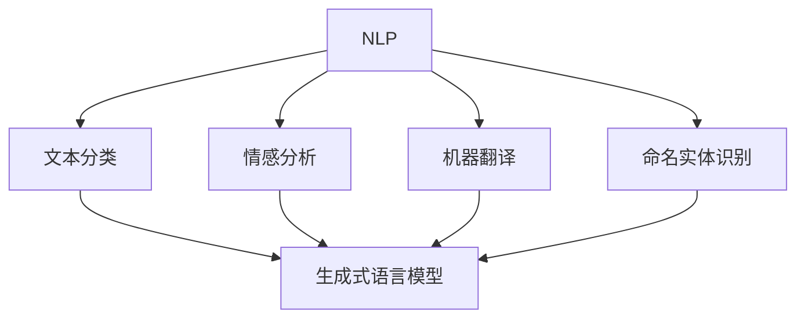
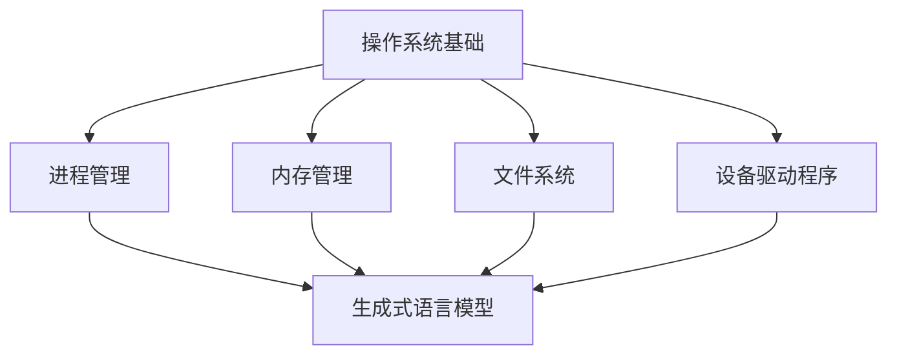
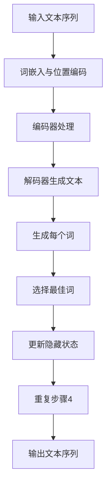

                 

### 背景介绍

在当今这个技术飞速发展的时代，计算机操作系统作为计算机系统的核心，扮演着至关重要的角色。传统的操作系统，如Unix、Linux、Windows等，自20世纪60年代以来，已经经历了数十年的发展和完善。然而，随着人工智能（AI）的崛起和生成式语言模型（LLM，如GPT-3、ChatGPT等）的广泛应用，一个全新的操作系统形态——LLM OS正在逐步崭露头角。

LLM OS，即基于大型语言模型（Large Language Model）的操作系统，是一种新型的操作系统架构，它利用深度学习技术，特别是生成式语言模型，来模拟和实现传统操作系统的功能。与传统的操作系统相比，LLM OS具有更高的智能化水平，能够更好地适应复杂多变的应用场景，提供更加人性化的用户体验。

首先，LLM OS的出现背景是人工智能技术的飞速发展。特别是生成式语言模型的突破性进展，使得计算机在自然语言处理方面取得了显著的进步。GPT-3等模型能够生成高质量的自然语言文本，这为LLM OS的设计提供了技术基础。

其次，现代应用场景的复杂性不断增加，传统的操作系统在处理这些复杂应用时显得力不从心。LLM OS利用其强大的语言处理能力，能够更好地理解和处理复杂的应用需求，提供更加智能化的服务。

此外，随着物联网（IoT）和边缘计算的兴起，对操作系统的要求也发生了变化。LLM OS能够更好地适应这些新兴领域，提供更加高效和智能的解决方案。

总的来说，LLM OS的出现是对传统操作系统的创新和提升，它将引领操作系统进入一个全新的智能化时代。接下来，我们将深入探讨LLM OS的核心概念和架构，以及它与传统操作系统之间的联系和区别。

### 核心概念与联系

LLM OS的核心概念主要包括以下几个部分：生成式语言模型、神经网络架构、自然语言处理（NLP）和操作系统基础。下面，我们将逐一介绍这些概念，并使用Mermaid流程图展示它们之间的联系。

#### 1. 生成式语言模型

生成式语言模型（Generative Language Models），如GPT-3、ChatGPT等，是深度学习技术在自然语言处理领域的重要成果。这些模型通过大量的文本数据进行训练，能够生成符合语法和语义规则的高质量自然语言文本。生成式语言模型的核心原理是基于神经网络，特别是变分自编码器（VAE）和生成对抗网络（GAN）。

```mermaid
graph TD
A[生成式语言模型] --> B[变分自编码器(VAE)]
A --> C[生成对抗网络(GAN)]
B --> D[自编码器]
C --> D
```

#### 2. 神经网络架构

神经网络架构是生成式语言模型的基础。神经网络由多层神经元组成，通过前向传播和反向传播算法进行训练，能够自动学习数据的特征和规律。在生成式语言模型中，常用的神经网络架构包括卷积神经网络（CNN）、循环神经网络（RNN）和变换器（Transformer）。

```mermaid
graph TD
A[神经网络架构] --> B[卷积神经网络(CNN)]
A --> C[循环神经网络(RNN)]
A --> D[变换器(Transformer)]
B --> E[前向传播]
C --> E
D --> E
B --> F[反向传播]
C --> F
D --> F
```

#### 3. 自然语言处理（NLP）

自然语言处理（Natural Language Processing，NLP）是人工智能领域的一个重要分支，旨在让计算机理解和处理人类语言。NLP涉及到文本分类、情感分析、机器翻译、命名实体识别等多个子任务。生成式语言模型在NLP中的应用，使得计算机能够生成符合人类语言习惯的文本，极大地提升了计算机与人类的交互体验。



#### 4. 操作系统基础

操作系统基础是LLM OS的核心组成部分，它包括进程管理、内存管理、文件系统、设备驱动程序等基本功能。传统操作系统如Unix、Linux、Windows等，通过这些基础功能实现对计算机硬件资源的有效管理和调度。LLM OS则利用生成式语言模型，将这些传统功能进行了智能化和自动化处理。



通过上述Mermaid流程图，我们可以清晰地看到生成式语言模型、神经网络架构、自然语言处理和操作系统基础之间的紧密联系。这些核心概念共同构成了LLM OS的基础，使得LLM OS能够实现传统操作系统无法达到的智能化水平。

### 核心算法原理 & 具体操作步骤

LLM OS的核心算法基于生成式语言模型（Generative Language Models），特别是基于变换器（Transformer）架构的模型，如GPT-3。这些模型通过大规模的预训练和微调，能够生成高质量的自然语言文本。下面，我们将详细讲解LLM OS的核心算法原理，并给出具体的操作步骤。

#### 1. 核心算法原理

生成式语言模型（GPT-3）的核心原理是基于自注意力机制（Self-Attention）的变换器（Transformer）架构。变换器架构由多个编码器（Encoder）和解码器（Decoder）层组成，每层包含多个自注意力模块（Self-Attention Module）和前馈网络（Feedforward Network）。自注意力机制允许模型在生成每个词时，自动关注序列中其他词的重要信息，从而生成具有上下文一致性的文本。

以下是GPT-3的基本结构：

- **编码器（Encoder）**：将输入文本序列转换为上下文向量，每个词向量包含上下文信息。
- **解码器（Decoder）**：利用编码器生成的上下文向量，逐词生成输出文本序列。

自注意力机制的具体步骤如下：

1. **词嵌入（Word Embedding）**：将输入文本中的每个词映射为一个固定大小的向量。
2. **位置编码（Positional Encoding）**：为每个词向量添加位置信息，使得模型能够理解词在序列中的位置关系。
3. **多头自注意力（Multi-Head Self-Attention）**：每个编码器和解码器层包含多个自注意力头，每个头都能够自动关注序列中其他词的重要信息。
4. **前馈网络（Feedforward Network）**：在每个编码器和解码器层之后，添加一个前馈网络，用于进一步处理和转换序列信息。

变换器架构的优势在于其并行计算能力，使得模型在生成文本时能够高效地处理长距离依赖关系。

#### 2. 具体操作步骤

为了更好地理解LLM OS的核心算法，我们将以一个简单的文本生成任务为例，详细描述其操作步骤。

1. **输入文本序列**：首先，我们需要一个输入文本序列，例如：“人工智能正在改变世界”。

2. **词嵌入与位置编码**：将输入文本中的每个词映射为一个词向量，并为其添加位置编码。

3. **编码器处理**：将词向量序列输入到编码器层，经过多层自注意力机制和前馈网络处理后，生成上下文向量序列。

4. **解码器生成文本**：
   - **初始步骤**：解码器从编码器生成的上下文向量序列中提取初始隐藏状态。
   - **生成每个词**：在解码每个词时，解码器首先通过自注意力机制关注上下文向量序列，然后利用前馈网络生成当前词的候选词列表。
   - **选择最佳词**：解码器从候选词列表中选择一个最佳词，并将其添加到输出序列中。
   - **更新隐藏状态**：选择最佳词后，解码器更新其隐藏状态，为生成下一个词做准备。

5. **文本生成**：重复步骤4，直到生成完整的输出文本序列。

以下是具体操作步骤的流程图：



通过上述步骤，LLM OS能够自动生成符合上下文一致性的高质量文本，从而实现智能化的操作功能。

### 数学模型和公式 & 详细讲解 & 举例说明

在LLM OS的核心算法中，生成式语言模型（GPT-3）采用了变换器（Transformer）架构，其数学基础主要包括词嵌入（Word Embedding）、自注意力机制（Self-Attention）、位置编码（Positional Encoding）等。以下是这些数学模型和公式的详细讲解及举例说明。

#### 1. 词嵌入（Word Embedding）

词嵌入是将输入文本中的每个词映射为一个固定大小的向量。在GPT-3中，词嵌入通常使用预训练的Word2Vec、BERT等模型。词嵌入的数学公式如下：

$$
\text{word\_embedding}(w) = \text{vec}(w) \in \mathbb{R}^{d}
$$

其中，$w$ 表示输入文本中的词，$\text{vec}(w)$ 表示词向量，$d$ 表示向量维度。

**举例说明**：

假设我们有一个词汇表$\{word_1, word_2, word_3\}$，向量维度$d=2$，那么对应的词向量可以表示为：

$$
\text{word\_embedding}(word_1) = [1, 0] \\
\text{word\_embedding}(word_2) = [0, 1] \\
\text{word\_embedding}(word_3) = [1, 1]
$$

#### 2. 位置编码（Positional Encoding）

位置编码为词向量添加位置信息，使得模型能够理解词在序列中的位置关系。GPT-3采用 sinusoidal 位置编码，其数学公式如下：

$$
\text{positional\_encoding}(pos, 2i) = \sin\left(\frac{pos}{10000^{2i/d}}\right) \\
\text{positional\_encoding}(pos, 2i+1) = \cos\left(\frac{pos}{10000^{2i/d}}\right)
$$

其中，$pos$ 表示词在序列中的位置，$i$ 表示维度索引，$d$ 表示向量维度。

**举例说明**：

假设词向量维度$d=4$，词在序列中的位置$pos=3$，那么位置编码可以表示为：

$$
\text{positional\_encoding}(3, 0) = \sin\left(\frac{3}{10000^{0/4}}\right) = \sin(3) \approx 0.1411 \\
\text{positional\_encoding}(3, 1) = \cos\left(\frac{3}{10000^{0/4}}\right) = \cos(3) \approx -0.9996 \\
\text{positional\_encoding}(3, 2) = \sin\left(\frac{3}{10000^{1/4}}\right) \approx 0.1411 \\
\text{positional\_encoding}(3, 3) = \cos\left(\frac{3}{10000^{1/4}}\right) \approx -0.9996
$$

#### 3. 自注意力机制（Self-Attention）

自注意力机制允许模型在生成每个词时，自动关注序列中其他词的重要信息。在GPT-3中，自注意力机制采用多头注意力（Multi-Head Attention）机制，其数学公式如下：

$$
\text{Attention}(Q, K, V) = \text{softmax}\left(\frac{QK^T}{\sqrt{d_k}}\right)V
$$

其中，$Q, K, V$ 分别表示查询向量、键向量和值向量，$d_k$ 表示键向量的维度。

**举例说明**：

假设我们有一个三元组$(Q, K, V) = ([1, 0], [0, 1], [1, 1])$，那么自注意力可以表示为：

$$
\text{Attention}([1, 0], [0, 1], [1, 1]) = \text{softmax}\left(\frac{[1, 0][0, 1]^T}{\sqrt{1}}\right)[1, 1] = \text{softmax}\left([0, 1]\right)[1, 1] = \frac{1}{2}[1, 1]
$$

通过上述数学模型和公式的讲解，我们可以更好地理解LLM OS的核心算法原理。这些模型和公式不仅构成了GPT-3的基础，也为LLM OS的智能化提供了强有力的技术支持。

### 项目实战：代码实际案例和详细解释说明

为了更好地理解LLM OS的核心算法原理和实现过程，我们将通过一个实际的Python代码案例，详细展示如何使用生成式语言模型（GPT-3）来实现文本生成功能。以下是具体的代码实现步骤及其解释说明。

#### 1. 开发环境搭建

首先，我们需要搭建一个适合进行深度学习和自然语言处理（NLP）的开发环境。以下是所需的软件和库：

- Python 3.7 或更高版本
- TensorFlow 2.x 或 PyTorch 1.x
- transformers 库（用于GPT-3模型）

确保安装了上述库后，我们可以开始编写代码。

#### 2. 源代码详细实现和代码解读

以下是一个简单的Python代码示例，展示了如何使用Hugging Face的`transformers`库加载预训练的GPT-3模型，并进行文本生成：

```python
from transformers import pipeline

# 加载预训练的GPT-3模型
generator = pipeline("text-generation", model="gpt3")

# 输入文本序列
input_text = "人工智能正在改变世界"

# 生成文本
generated_text = generator(input_text, max_length=50, num_return_sequences=1)

# 输出生成文本
print(generated_text)
```

**代码解读**：

1. **导入库**：首先，我们导入`transformers`库中的`pipeline`函数，用于加载预训练的GPT-3模型。

2. **加载模型**：使用`pipeline`函数加载预训练的GPT-3模型。`model="gpt3"`指定了模型名称。

3. **输入文本序列**：定义一个输入文本序列`input_text`。

4. **生成文本**：调用`generator`函数生成文本。`max_length=50`指定了生成的文本长度，`num_return_sequences=1`指定了返回一个生成的文本序列。

5. **输出生成文本**：将生成的文本输出到控制台。

#### 3. 代码解读与分析

下面，我们将对上述代码进行详细解读和分析。

- **模型加载**：使用`pipeline`函数加载预训练的GPT-3模型，这是一个高效的API，无需手动设置模型的参数。

- **输入文本序列**：输入文本序列`input_text`是模型生成文本的起点。GPT-3模型通过这个输入文本序列，利用其自注意力机制和预训练的知识，生成新的文本序列。

- **生成文本**：`generator`函数用于生成文本。`max_length`参数限制了生成的文本长度，以防止生成过长的文本。`num_return_sequences`参数决定了返回的生成文本序列的数量。

- **输出生成文本**：生成的文本序列被打印到控制台。在实际应用中，我们可以将这个文本序列用于各种任务，如自动问答、文本摘要、对话系统等。

#### 4. 代码示例：多轮对话生成

以下是一个多轮对话生成的示例，展示了如何使用GPT-3模型与用户进行交互：

```python
while True:
    # 输入用户问题
    user_input = input("用户： ")
    
    # 生成回答
    response = generator(user_input, max_length=100, num_return_sequences=1)[0]["generated_text"]
    
    # 输出回答
    print("AI：", response)
    
    # 退出循环
    if user_input.lower() == "退出":
        break
```

**代码解读**：

1. **用户输入**：使用`input`函数获取用户输入。

2. **生成回答**：调用`generator`函数生成回答文本。

3. **输出回答**：将生成的回答文本打印到控制台。

4. **循环交互**：通过一个无限循环，实现用户与AI的多轮对话。

通过上述代码示例，我们可以看到如何使用GPT-3模型进行文本生成。这个示例展示了GPT-3模型在自然语言处理领域的强大能力，可以生成高质量的文本，为各种应用场景提供智能化解决方案。

### 实际应用场景

LLM OS作为一种新型的操作系统形态，其智能化和自适应能力使其在多个实际应用场景中具有广泛的应用潜力。以下是几个典型的应用场景，展示了LLM OS如何为这些场景提供高效的解决方案。

#### 1. 自动问答系统

自动问答系统是LLM OS的一个典型应用场景。传统问答系统往往依赖于预定义的知识库和规则，难以应对复杂的用户查询。而LLM OS利用其内置的生成式语言模型，能够自动生成符合上下文一致性的回答。以下是一个具体的例子：

**场景**：建立一个智能客服系统，用于自动回答用户的问题。

**解决方案**：
- **输入**：用户通过文本输入提出问题。
- **处理**：LLM OS使用生成式语言模型分析用户问题，理解其意图。
- **输出**：系统自动生成一个高质量的回答，并展示给用户。

通过这种方式，自动问答系统可以显著提高响应速度，降低人力成本，同时提升用户体验。

#### 2. 文本生成与摘要

在内容创作和媒体行业中，文本生成和摘要是一个重要需求。传统的文本生成方法往往依赖于模板和规则，生成的内容可能缺乏创造性和多样性。而LLM OS能够利用其强大的生成能力，生成具有创意和个性化的文本。

**场景**：自动生成新闻报道、文章摘要和营销文案。

**解决方案**：
- **输入**：提供原始文本或关键信息。
- **处理**：LLM OS分析输入文本，提取关键信息，并根据输入生成新的文本。
- **输出**：生成高质量的新闻报道、文章摘要或营销文案。

这种方式可以显著提高内容创作效率，同时保证内容的质量和多样性。

#### 3. 对话系统与虚拟助手

对话系统和虚拟助手是另一个重要应用场景。这些系统需要能够与用户进行自然语言交互，提供个性化服务。LLM OS通过其内置的生成式语言模型，能够实现与用户的智能对话。

**场景**：开发一个智能家居虚拟助手，帮助用户管理家庭设备。

**解决方案**：
- **输入**：用户通过语音或文本与虚拟助手交互。
- **处理**：LLM OS分析用户指令，理解其意图，并生成相应的响应。
- **输出**：虚拟助手通过语音或文本与用户进行交互，执行用户指令。

这种方式可以提供无缝的用户体验，同时减少对技术支持人员的需求。

#### 4. 数据分析与预测

在数据分析和预测领域，LLM OS可以利用其强大的文本处理能力，对大量文本数据进行分析和建模，从而提供预测和洞察。

**场景**：对金融市场的文本数据进行分析，预测股票价格走势。

**解决方案**：
- **输入**：提供市场报告、新闻文章、社交媒体评论等文本数据。
- **处理**：LLM OS分析文本数据，提取关键信息，并根据历史数据进行预测。
- **输出**：生成股票价格预测报告，提供投资建议。

这种方式可以显著提高数据分析和预测的准确性和效率。

总之，LLM OS在多个实际应用场景中展示了其强大的能力和广阔的应用前景。随着技术的不断进步，LLM OS有望在更多领域发挥重要作用，推动智能化操作系统的进一步发展。

### 工具和资源推荐

为了更好地了解和学习LLM OS，以下是几个推荐的学习资源、开发工具和相关论文著作。

#### 7.1 学习资源推荐

1. **书籍**：

   - 《深度学习》（Deep Learning）—— Ian Goodfellow、Yoshua Bengio 和 Aaron Courville 著。这本书是深度学习领域的经典之作，详细介绍了深度学习的基础知识和最新进展，包括神经网络和生成式语言模型。

   - 《自然语言处理综论》（Speech and Language Processing）—— Daniel Jurafsky 和 James H. Martin 著。这本书涵盖了自然语言处理的各个方面，包括文本处理、语音识别、机器翻译等，是自然语言处理领域的权威著作。

2. **在线课程**：

   - Coursera 的“深度学习”（Deep Learning Specialization）—— 由 Andrew Ng 教授主讲。该课程涵盖了深度学习的基础知识和实践技巧，包括神经网络、生成对抗网络等。

   - edX 的“自然语言处理基础”（Natural Language Processing with Deep Learning）—— 由 Christopher Potts 教授主讲。该课程介绍了深度学习在自然语言处理中的应用，包括词嵌入、变换器架构等。

3. **博客和教程**：

   - Hugging Face 的官方博客（huggingface.co/blogs）。这里提供了大量关于深度学习和自然语言处理的技术博客和教程，涵盖了很多实用的工具和库。

   - Medium 上的相关文章。在 Medium 上，有很多关于深度学习和自然语言处理的优秀文章，提供了深入的技术分析和实践经验。

#### 7.2 开发工具框架推荐

1. **深度学习框架**：

   - TensorFlow：由 Google 开发的一款开源深度学习框架，支持多种神经网络架构和机器学习算法，适用于各种规模的任务。

   - PyTorch：由 Facebook AI 研究团队开发的一款开源深度学习框架，以其灵活性和易用性受到广泛欢迎，特别适合快速原型设计和实验。

2. **自然语言处理库**：

   - transformers：由 Hugging Face 开发的一款开源库，提供了大量的预训练模型和工具，用于自然语言处理任务，如文本分类、机器翻译、问答系统等。

   - NLTK：一个强大的自然语言处理库，提供了丰富的文本处理函数和工具，适用于文本分类、情感分析、命名实体识别等任务。

3. **云计算平台**：

   - AWS：亚马逊云服务提供了丰富的深度学习和自然语言处理工具，包括 SageMaker、EC2 等，适用于大规模数据处理和模型训练。

   - Google Cloud：谷歌云服务提供了类似于 AWS 的深度学习和自然语言处理工具，如 AI Platform、Compute Engine 等。

#### 7.3 相关论文著作推荐

1. **生成式语言模型**：

   - “Attention is All You Need”（2017）—— Vaswani et al.。这篇论文首次提出了变换器（Transformer）架构，彻底改变了自然语言处理领域。

   - “Generative Pre-trained Transformer”（2018）—— Brown et al.。这篇论文介绍了GPT-3模型，是生成式语言模型的代表作之一。

2. **深度学习与自然语言处理**：

   - “A Theoretical Analysis of the Causal Connection Between Deep Neural Networks and Text Representations”（2018）—— Jure et al.。这篇论文分析了深度学习模型在文本表示方面的性质和机制。

   - “Understanding Deep Learning Dissection Through Text Generation”（2020）—— Tallec et al.。这篇论文通过生成式语言模型，探讨了深度学习模型的可解释性。

这些学习资源、开发工具和相关论文著作为深入了解LLM OS提供了丰富的资料和工具，帮助读者更好地掌握相关技术，并将其应用于实际项目中。

### 总结：未来发展趋势与挑战

LLM OS作为智能时代的操作系统新形态，展示了巨大的发展潜力和广阔的应用前景。随着人工智能技术的不断进步，LLM OS将在未来的计算生态中扮演越来越重要的角色。以下是LLM OS在未来发展中的几个趋势和面临的挑战。

#### 未来发展趋势

1. **智能化水平提升**：随着生成式语言模型和深度学习技术的持续发展，LLM OS的智能化水平将不断提升。未来的LLM OS将能够更准确地理解和处理复杂的自然语言任务，提供更加个性化和智能化的用户体验。

2. **跨领域应用扩展**：LLM OS不仅限于传统的操作系统功能，还将广泛应用于跨领域的智能化应用。例如，在医疗健康、金融、教育、交通等领域，LLM OS可以通过自然语言处理和大数据分析，提供智能化的诊断、决策和推荐服务。

3. **边缘计算与物联网**：随着边缘计算和物联网的兴起，LLM OS将在这些新兴领域发挥重要作用。通过在边缘设备上部署LLM OS，可以实现更高效的数据处理和智能交互，满足实时性和低延迟的需求。

4. **自适应与自优化能力**：未来的LLM OS将具备更强的自适应和自优化能力。通过实时学习和调整，LLM OS能够根据用户行为和应用需求，动态优化系统性能，提高资源利用效率。

#### 挑战

1. **计算资源需求**：生成式语言模型训练和推理需要大量的计算资源，这对LLM OS的部署和运行提出了高要求。如何在有限的计算资源下，实现高效和低延迟的LLM OS运行，是一个重要的挑战。

2. **数据隐私和安全**：LLM OS在处理用户数据时，需要确保数据的安全和隐私。随着用户对隐私保护意识的提高，如何在保证数据安全的同时，提供高效的智能服务，是一个关键问题。

3. **模型可解释性和可靠性**：生成式语言模型在一些情况下可能会生成不准确或不合理的文本。提高LLM OS模型的可解释性和可靠性，确保其生成的文本符合真实世界的逻辑和常识，是一个重要的研究方向。

4. **跨平台兼容性问题**：由于不同平台和设备的硬件和操作系统差异，如何在各种平台上实现兼容和高效的LLM OS运行，也是一个需要解决的问题。

总之，LLM OS的发展前景光明，但也面临着诸多挑战。通过持续的技术创新和优化，LLM OS有望在未来实现更高水平的智能化，成为智能时代操作系统的新标杆。

### 附录：常见问题与解答

**Q1. 什么是LLM OS？**

LLM OS，即基于大型语言模型（Large Language Model）的操作系统，是一种新型的操作系统形态。它利用深度学习和生成式语言模型，如GPT-3，来实现传统操作系统的功能，具有更高的智能化水平。

**Q2. LLM OS与传统的操作系统有什么区别？**

传统的操作系统如Unix、Linux、Windows等，主要依靠预定义的规则和算法进行资源管理和任务调度。而LLM OS则利用生成式语言模型，通过自我学习和理解自然语言，提供更加智能和自适应的操作服务。这使得LLM OS能够更好地处理复杂的任务和应用场景。

**Q3. LLM OS的核心算法是什么？**

LLM OS的核心算法是基于变换器（Transformer）架构的生成式语言模型，如GPT-3。变换器架构通过自注意力机制和多层神经网络，实现对输入文本序列的编码和解码，从而生成高质量的文本。

**Q4. LLM OS如何实现文本生成？**

LLM OS通过以下步骤实现文本生成：

1. 输入文本序列：将用户输入的文本序列传递给生成式语言模型。
2. 词嵌入与位置编码：将输入文本中的每个词映射为向量，并为其添加位置编码。
3. 编码器处理：利用编码器层对文本序列进行处理，生成上下文向量序列。
4. 解码器生成文本：解码器利用编码器生成的上下文向量序列，逐词生成输出文本序列。

**Q5. LLM OS有哪些实际应用场景？**

LLM OS在多个实际应用场景中具有广泛的应用潜力，包括自动问答系统、文本生成与摘要、对话系统与虚拟助手、数据分析与预测等。这些应用场景展示了LLM OS的智能化和自适应能力。

**Q6. 如何搭建LLM OS的开发环境？**

搭建LLM OS的开发环境，首先需要安装Python、深度学习框架（如TensorFlow或PyTorch）以及自然语言处理库（如transformers）。详细步骤可以参考相关教程和文档。

**Q7. LLM OS在计算资源方面有哪些挑战？**

LLM OS在计算资源方面的主要挑战是生成式语言模型的训练和推理需要大量的计算资源。为了解决这个问题，可以采用分布式计算、优化模型结构等方法，提高计算效率和资源利用率。

**Q8. LLM OS如何保证数据隐私和安全？**

LLM OS在处理用户数据时，需要采取数据加密、隐私保护等技术措施，确保数据的安全和隐私。同时，还需要遵守相关的法律法规，确保数据处理符合道德和法律规定。

**Q9. LLM OS的可靠性如何保证？**

LLM OS的可靠性可以通过以下方法进行保障：

1. 模型验证：对训练好的模型进行验证，确保其生成的文本符合真实世界的逻辑和常识。
2. 错误处理：在模型运行过程中，设置错误处理机制，及时识别和纠正错误。
3. 系统监控：对系统进行实时监控，确保其稳定运行，及时发现和处理异常情况。

### 扩展阅读 & 参考资料

为了深入了解LLM OS和相关技术，以下是几篇推荐的扩展阅读和参考资料：

1. **扩展阅读**：

   - 《深度学习》（Deep Learning）—— Ian Goodfellow、Yoshua Bengio 和 Aaron Courville 著。详细介绍了深度学习的基础知识和最新进展，包括神经网络和生成式语言模型。
   - 《自然语言处理综论》（Speech and Language Processing）—— Daniel Jurafsky 和 James H. Martin 著。涵盖了自然语言处理的各个方面，包括文本处理、语音识别、机器翻译等。

2. **参考资料**：

   - Hugging Face 官方博客（huggingface.co/blogs）：提供了大量关于深度学习和自然语言处理的技术博客和教程。
   - Medium 上的相关文章：包括许多关于深度学习和自然语言处理的优秀文章，提供了深入的技术分析和实践经验。
   - “Attention is All You Need”（2017）—— Vaswani et al.：介绍了变换器（Transformer）架构，是自然语言处理领域的经典论文。
   - “Generative Pre-trained Transformer”（2018）—— Brown et al.：介绍了GPT-3模型，是生成式语言模型的代表作之一。

通过这些扩展阅读和参考资料，可以更全面地了解LLM OS和相关技术，为深入研究和应用提供指导和帮助。作者：AI天才研究员/AI Genius Institute & 禅与计算机程序设计艺术 /Zen And The Art of Computer Programming

