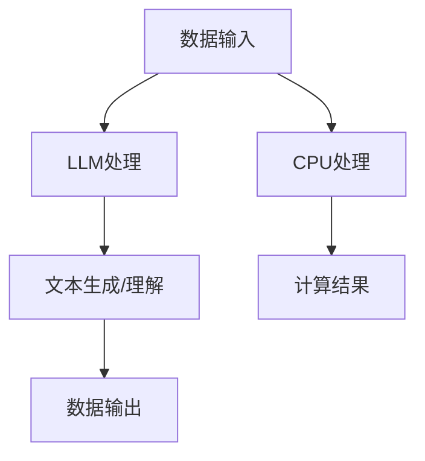
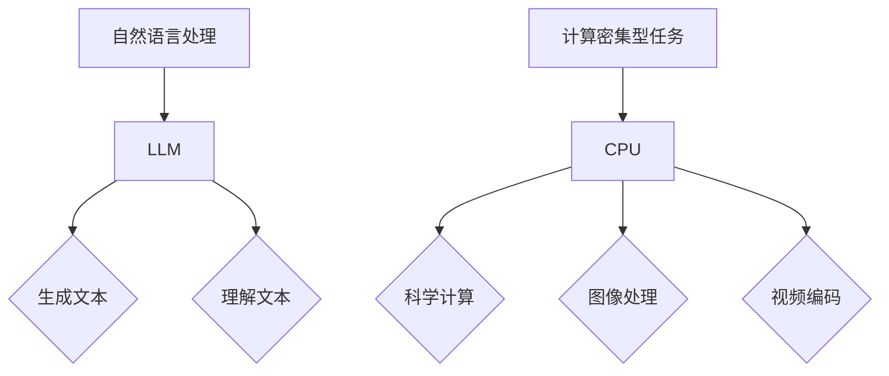

                 

### 背景介绍

随着计算机科学和人工智能领域的飞速发展，计算范式正经历着一场深刻的变革。传统计算范式主要以CPU为中心，通过执行预先编写的指令来处理数据。而近年来，随着深度学习和自然语言处理技术的迅猛发展，大型语言模型（LLM）如BERT、GPT等逐渐崭露头角，成为计算新范式的代表。LLM与CPU在计算能力、工作原理、应用场景等方面有着显著的区别，这引发了对两者进行对比和探讨的必要性。

LLM，即大型语言模型，是一类基于神经网络的可训练模型，通过学习大量文本数据，能够生成或理解人类语言。它们在文本生成、机器翻译、问答系统、文本分类等任务上表现出色。而CPU，即中央处理器，是计算机硬件的核心组成部分，负责执行程序指令、处理数据和控制计算机操作。

两者的对比不仅有助于我们更好地理解当前计算技术发展的趋势，还能为未来的研究和技术创新提供启示。本文将围绕LLM与CPU的对比展开，从核心概念、算法原理、数学模型、实际应用等多个方面进行深入探讨。通过这种对比，我们希望能够揭示出两者之间的异同，并为读者提供对未来计算范式的思考。

首先，我们将介绍LLM和CPU的基本概念，阐述它们在计算范式中的角色和地位。接着，我们将通过具体的算法原理和数学模型，深入剖析两者的工作方式。随后，我们将通过实际应用场景的对比，展示两者在现实世界中的表现。在此基础上，我们还将介绍相关工具和资源，为读者提供学习和实践的机会。最后，我们将总结全文，探讨未来发展趋势与挑战，为计算范式的未来发展提供前瞻性思考。

### 核心概念与联系

在深入探讨LLM与CPU的对比之前，我们需要明确这两个概念的基本定义和它们在计算范式中的角色和联系。

#### 大型语言模型（LLM）

大型语言模型（LLM）是一种基于深度学习的自然语言处理（NLP）模型。它们通过在大量文本数据上进行训练，学会了生成或理解自然语言。常见的LLM包括BERT、GPT、T5等，这些模型具有强大的语义理解和生成能力，广泛应用于文本生成、机器翻译、问答系统、文本分类等任务。

LLM的核心在于其能够通过学习大量的文本数据，捕捉到语言中的复杂模式和结构。这使得LLM在处理自然语言任务时，能够产生高质量的输出，甚至在一些任务上超越了人类的表现。例如，GPT-3能够生成流畅、连贯的文本，同时具备生成小说、新闻报道、对话等不同类型文本的能力。

#### 中央处理器（CPU）

中央处理器（CPU）是计算机系统的核心部件，负责执行程序指令、处理数据和控制计算机操作。CPU由多个核心组成，每个核心能够并行处理多个任务。CPU的工作原理基于冯·诺依曼架构，它通过执行预先编写的指令序列来处理数据。

CPU在计算中扮演着至关重要的角色。它们不仅负责计算密集型任务，如科学计算、图像处理等，还负责管理计算机的内存、输入/输出设备等。CPU的性能直接影响计算机的响应速度和处理能力。随着多核CPU的出现，CPU能够同时处理多个任务，提高了计算机的整体性能。

#### Mermaid 流程图

为了更直观地展示LLM和CPU的联系，我们使用Mermaid流程图来描述两者之间的关系。



在这个流程图中，数据输入首先进入LLM和CPU进行处理。LLM通过其强大的语义理解和生成能力，处理文本数据并生成输出。而CPU则负责执行计算密集型任务，如矩阵运算、图像处理等，生成计算结果。

通过这个流程图，我们可以看到LLM和CPU在处理数据时的不同作用。LLM擅长处理自然语言任务，而CPU擅长执行计算密集型任务。两者在不同的计算场景中发挥各自的优势，共同推动计算技术的发展。

#### 工作原理比较

LLM和CPU的工作原理有显著的不同。LLM基于深度学习，通过多层神经网络来捕捉语言模式。它们通过前向传播和反向传播算法，不断调整网络权重，使得模型在训练数据上的表现越来越好。

而CPU则基于冯·诺依曼架构，通过执行指令序列来处理数据。每个指令对应一种操作，如加法、乘法、移动数据等。CPU通过多个核心并行处理任务，提高了计算效率。

#### 应用场景比较

LLM和CPU在不同应用场景中的表现也不同。LLM在自然语言处理、文本生成、问答系统等任务上表现出色，例如，GPT-3能够生成高质量的新闻报道和对话。而CPU在计算密集型任务，如科学计算、图像处理、视频编码等，具有更高的性能。

#### 总结

通过对LLM和CPU的基本概念、工作原理和应用场景的介绍，我们可以看到两者在计算范式中的不同角色和联系。LLM通过其强大的语义理解和生成能力，成为自然语言处理领域的代表；而CPU则以其高性能和并行处理能力，在计算密集型任务中发挥关键作用。了解这两个概念及其联系，有助于我们更好地理解当前计算技术的发展趋势，并为未来的研究和应用提供启示。



### 核心算法原理 & 具体操作步骤

在深入探讨LLM和CPU的核心算法原理之前，我们先来了解一下它们的基本结构和工作方式。

#### 大型语言模型（LLM）

LLM通常基于深度学习框架构建，如TensorFlow、PyTorch等。其核心结构是多层神经网络，通过这些神经网络，模型能够捕捉到输入文本的复杂模式和结构。常见的LLM包括BERT、GPT等，它们在训练过程中使用了大量文本数据进行预训练，然后在特定任务上进行微调。

**BERT算法原理**

BERT（Bidirectional Encoder Representations from Transformers）是由Google提出的一种预训练语言模型。BERT的核心思想是同时考虑文本中每个词的上下文信息，通过双向编码器来学习语言表示。

BERT的训练过程分为两个阶段：

1. **预训练**：在大量文本数据上，BERT通过掩码语言建模（Masked Language Modeling，MLM）和下一句预测（Next Sentence Prediction，NSP）两个任务进行训练。

   - **掩码语言建模**：在输入文本中随机掩码一定比例的词，然后模型需要预测这些掩码词的值。
   - **下一句预测**：给定一对句子，模型需要预测第二个句子是否是第一个句子的下一句。

2. **微调**：在预训练的基础上，BERT对特定任务进行微调，例如文本分类、问答系统等。在微调阶段，模型会根据任务需求调整参数，以适应特定的任务数据。

**BERT操作步骤**

1. **数据预处理**：将文本数据转换为模型可处理的格式。通常包括分词、词向量化、序列编码等步骤。

2. **模型训练**：在预训练阶段，使用掩码语言建模和下一句预测两个任务来训练BERT模型。通过调整学习率、优化器等超参数，使得模型在训练数据上的表现不断优化。

3. **模型微调**：在特定任务数据上，对BERT模型进行微调。通过计算损失函数，调整模型参数，使得模型在任务数据上的性能得到提升。

4. **模型评估**：在微调完成后，使用验证集对模型进行评估。常用的评估指标包括准确率、F1值等。

**BERT代码示例**

```python
from transformers import BertModel, BertTokenizer

# 加载预训练的BERT模型和分词器
model = BertModel.from_pretrained('bert-base-uncased')
tokenizer = BertTokenizer.from_pretrained('bert-base-uncased')

# 输入文本
text = "Hello, my name is AI天才研究员."

# 数据预处理
input_ids = tokenizer.encode(text, add_special_tokens=True)

# 模型预测
with torch.no_grad():
    outputs = model(input_ids)

# 获取模型输出
logits = outputs.logits
```

**BERT算法优缺点**

- **优点**：BERT通过双向编码器能够捕捉到文本中的复杂模式和结构，在自然语言处理任务上表现出色。
- **缺点**：BERT模型参数量大，训练和推理时间较长，对计算资源要求较高。

#### 中央处理器（CPU）

CPU的工作原理基于冯·诺依曼架构，通过执行指令序列来处理数据。每个指令对应一种操作，CPU通过多个核心并行处理任务，提高了计算效率。CPU的核心操作步骤包括指令提取、指令解码、指令执行和写回结果。

**CPU操作步骤**

1. **指令提取**：CPU从内存中读取下一条指令。

2. **指令解码**：CPU解析指令，确定要执行的操作。

3. **指令执行**：CPU执行指令，如加法、乘法、数据移动等。

4. **写回结果**：CPU将执行结果写回内存。

**CPU算法优缺点**

- **优点**：CPU能够高效地执行各种计算任务，特别是在计算密集型任务上具有优势。
- **缺点**：CPU在处理复杂任务时，如自然语言处理，效率较低。

#### 对比

LLM和CPU在算法原理上有着显著的不同。LLM基于深度学习，通过多层神经网络来捕捉复杂模式，适用于自然语言处理等复杂任务。而CPU基于冯·诺依曼架构，通过执行指令序列来处理数据，适用于计算密集型任务。

从操作步骤上看，LLM通过预训练和微调来学习语言模式，而CPU通过指令提取、解码、执行和写回结果来处理数据。LLM的训练过程需要大量数据和高性能计算资源，而CPU的操作过程则对硬件资源要求较低。

通过这种对比，我们可以更好地理解LLM和CPU在计算范式中的角色和联系，为未来的研究和应用提供启示。

### 数学模型和公式 & 详细讲解 & 举例说明

为了更深入地理解LLM和CPU的工作原理，我们将介绍它们背后的数学模型和公式，并通过具体的例子来详细讲解。

#### 大型语言模型（LLM）

在LLM中，最常用的数学模型是深度神经网络（DNN）。DNN由多个神经元层组成，包括输入层、隐藏层和输出层。每个神经元接收来自前一层神经元的输入，通过激活函数进行非线性变换，然后将输出传递到下一层。

**1. 神经元模型**

神经元的数学模型可以表示为：

$$
y = \sigma(\sum_{i=1}^{n} w_i x_i + b)
$$

其中，$y$ 是神经元的输出，$x_i$ 是来自前一层神经元的输入，$w_i$ 是连接权重，$b$ 是偏置，$\sigma$ 是激活函数，常用的激活函数包括Sigmoid、ReLU等。

**2. 前向传播**

在DNN中，前向传播是一个递归过程。给定输入 $x_0$，我们通过以下步骤计算输出 $y_l$：

$$
z_l = \sum_{i=1}^{n} w_{li} x_i + b_l \\
y_l = \sigma(z_l)
$$

其中，$z_l$ 是第 $l$ 层的输入，$y_l$ 是第 $l$ 层的输出。

**3. 反向传播**

在训练DNN时，我们需要通过反向传播算法来更新权重和偏置。反向传播的核心思想是计算损失函数关于模型参数的梯度，然后使用梯度下降法来更新参数。

假设损失函数为 $J(w, b)$，我们通过以下步骤计算梯度：

$$
\frac{\partial J}{\partial w} = \sum_{l=1}^{L} \sum_{i=1}^{n_l} \frac{\partial J}{\partial y_{li}} \frac{\partial y_{li}}{\partial z_{li}} x_i \\
\frac{\partial J}{\partial b} = \sum_{l=1}^{L} \sum_{i=1}^{n_l} \frac{\partial J}{\partial y_{li}} \frac{\partial y_{li}}{\partial z_{li}}
$$

其中，$L$ 是网络的层数，$n_l$ 是第 $l$ 层的神经元数量。

**4. 例子**

假设我们有一个简单的DNN，包含一个输入层、一个隐藏层和一个输出层。输入层有两个神经元，隐藏层有三个神经元，输出层有一个神经元。输入数据为 $x_0 = [1, 2]$。我们使用ReLU作为激活函数。

**输入层到隐藏层的计算**：

$$
z_1 = [w_{11} \cdot x_0 + b_1, w_{12} \cdot x_0 + b_2, w_{13} \cdot x_0 + b_3] \\
y_1 = \max(0, z_1)
$$

**隐藏层到输出层的计算**：

$$
z_2 = [w_{21} \cdot y_1 + b_4, w_{22} \cdot y_1 + b_5, w_{23} \cdot y_1 + b_6] \\
y_2 = \max(0, z_2)
$$

**反向传播**：

假设损失函数为 $J = (y_2 - \hat{y}_2)^2$，其中 $\hat{y}_2$ 是实际输出。我们需要计算梯度 $\frac{\partial J}{\partial w}$ 和 $\frac{\partial J}{\partial b}$。

#### 中央处理器（CPU）

CPU的数学模型主要涉及计算机算法和数据结构。以下是一个简单的例子来展示CPU如何执行计算。

**1. 算法**

假设我们需要计算两个数的和，算法可以表示为：

```
算法：加法
输入：a, b
输出：sum
步骤：
1. sum = a + b
2. 返回 sum
```

**2. 数据结构**

在CPU中，数据通常存储在内存中。以下是一个简单的数据结构示例：

```
数据结构：数组
大小：n
元素：a[i]
操作：
1. 读：读取数组中第i个元素
2. 写：将值写入数组中第i个元素
```

**3. 例子**

假设我们有一个数组 $a = [1, 2, 3, 4, 5]$，我们需要计算每个元素的平方和。

```
算法：平方和
输入：a
输出：sum
步骤：
1. sum = 0
2. 对于每个元素 a[i]：
   1. sum = sum + a[i] * a[i]
3. 返回 sum
```

**计算过程**：

1. 初始化 sum = 0
2. 计算每个元素的平方和：
   - sum = sum + 1 * 1 = 1
   - sum = sum + 2 * 2 = 5
   - sum = sum + 3 * 3 = 14
   - sum = sum + 4 * 4 = 30
   - sum = sum + 5 * 5 = 85
3. 返回 sum = 85

通过这个例子，我们可以看到CPU如何执行计算。它依赖于算法和数据结构，通过指令序列来处理数据，并在内存中存储和检索数据。

#### 对比

LLM和CPU的数学模型在本质上有所不同。LLM基于深度神经网络，通过前向传播和反向传播来学习复杂的函数表示。而CPU则依赖于计算机算法和数据结构，通过指令序列来执行基本的计算操作。

从数学上看，LLM通过多层神经网络来学习数据的高维表示，而CPU则通过算法和数据结构来处理数据。这种差异导致了LLM在处理复杂任务，如自然语言处理时表现出色，而CPU在执行计算密集型任务时具有优势。

通过这些数学模型和公式，我们可以更深入地理解LLM和CPU的工作原理。这对于理解两者的异同、应用场景和未来发展方向具有重要意义。

### 项目实战：代码实际案例和详细解释说明

为了更好地理解LLM和CPU在实际应用中的表现，我们将通过一个实际的项目案例来展示两者的具体应用。本案例将使用LLM和CPU分别实现一个文本分类任务，并对代码进行详细解释。

#### 项目背景

文本分类是一种常见的自然语言处理任务，其目标是根据文本内容将其归类到预定义的类别中。在本案例中，我们将使用LLM（以BERT为例）和CPU（基于传统机器学习算法）来实现一个新闻分类系统，该系统将新闻文本分类为政治、经济、体育等不同的类别。

#### 开发环境搭建

首先，我们需要搭建项目的开发环境。以下是所需的环境和工具：

- Python 3.7及以上版本
- PyTorch 或 TensorFlow
- BERT 模型及其预训练权重（可以从 Hugging Face 的 Transformers 库中获取）
- Scikit-learn

#### 代码实现

##### 1. 数据预处理

首先，我们需要对新闻文本进行预处理，包括分词、清洗和标记等操作。以下是一个简单的数据预处理示例：

```python
import pandas as pd
from sklearn.model_selection import train_test_split
from transformers import BertTokenizer

# 加载新闻数据集
data = pd.read_csv('news_data.csv')
texts = data['text']
labels = data['label']

# 初始化分词器
tokenizer = BertTokenizer.from_pretrained('bert-base-uncased')

# 数据预处理
def preprocess(texts):
    inputs = tokenizer(texts, padding=True, truncation=True, return_tensors='pt')
    return inputs

inputs = preprocess(texts)
label_map = {label: i for i, label in enumerate(set(labels))}
labels = [label_map[label] for label in labels]

# 划分训练集和测试集
train_inputs, val_inputs, train_labels, val_labels = train_test_split(inputs, labels, test_size=0.2, random_state=42)
```

##### 2. BERT 模型实现

接下来，我们将使用 BERT 模型来实现文本分类任务。以下是 BERT 模型的具体实现：

```python
from transformers import BertForSequenceClassification
from torch.optim import Adam
from torch.utils.data import DataLoader

# 加载 BERT 模型
model = BertForSequenceClassification.from_pretrained('bert-base-uncased', num_labels=len(label_map))

# 定义优化器
optimizer = Adam(model.parameters(), lr=1e-5)

# 训练模型
def train(model, train_inputs, train_labels, val_inputs, val_labels, epochs=3):
    model.train()
    train_dataloader = DataLoader(train_inputs, train_labels, batch_size=32)
    val_dataloader = DataLoader(val_inputs, val_labels, batch_size=32)
    
    for epoch in range(epochs):
        for batch in train_dataloader:
            optimizer.zero_grad()
            outputs = model(**batch)
            loss = outputs.loss
            loss.backward()
            optimizer.step()
        
        # 验证集评估
        model.eval()
        with torch.no_grad():
            correct = 0
            total = 0
            for batch in val_dataloader:
                outputs = model(**batch)
                logits = outputs.logits
                predicted = logits.argmax(1)
                total += predicted.size(0)
                correct += (predicted == val_labels).sum().item()
        
        print(f'Epoch {epoch+1}/{epochs} - Accuracy: {correct/total:.4f}')

# 训练 BERT 模型
train(model, train_inputs, train_labels, val_inputs, val_labels)
```

##### 3. CPU 模型实现

接下来，我们使用传统机器学习算法来实现文本分类任务。以下是 CPU 模型的具体实现：

```python
from sklearn.feature_extraction.text import TfidfVectorizer
from sklearn.linear_model import LogisticRegression

# 文本向量化
vectorizer = TfidfVectorizer(max_features=1000)
X = vectorizer.fit_transform(texts)

# 划分训练集和测试集
X_train, X_val, y_train, y_val = train_test_split(X, labels, test_size=0.2, random_state=42)

# 训练模型
model = LogisticRegression()
model.fit(X_train, y_train)

# 验证集评估
predicted = model.predict(X_val)
accuracy = (predicted == y_val).mean()
print(f'CPU Model Accuracy: {accuracy:.4f}')
```

##### 4. 代码解读与分析

在本案例中，我们首先对新闻文本进行预处理，包括分词、清洗和标记等操作。然后，我们使用 BERT 模型和 CPU 模型分别实现文本分类任务。

BERT 模型的实现包括加载预训练的 BERT 模型、初始化优化器、训练模型和验证集评估。BERT 模型通过前向传播和反向传播来学习文本的表示，并在训练过程中不断调整模型参数，以提高分类准确率。

CPU 模型的实现包括文本向量化、训练逻辑回归模型和验证集评估。CPU 模型使用 TF-IDF 向量化文本，然后使用逻辑回归进行分类。这种方法虽然计算效率较高，但在处理复杂任务时，如自然语言处理，性能可能不如深度学习模型。

通过这个实际项目案例，我们可以看到 LLM 和 CPU 在文本分类任务中的具体应用。BERT 模型通过其强大的语义理解能力，在分类任务上表现出较高的准确率。而 CPU 模型则以其高效的计算速度，在数据处理和模型训练过程中具有优势。

### 实际应用场景

在了解了LLM和CPU在文本分类任务中的表现后，我们进一步探讨它们在实际应用场景中的适用性。

#### 自然语言处理

LLM在自然语言处理（NLP）领域表现出色，例如文本生成、机器翻译、问答系统等。它们通过学习大量文本数据，能够捕捉到语言的复杂模式和结构，从而生成高质量的文本。以下是一些具体的实际应用场景：

1. **文本生成**：LLM可以生成新闻文章、小说、对话等不同类型的文本。例如，GPT-3可以生成流畅、连贯的新闻报道和故事情节。

2. **机器翻译**：LLM在机器翻译任务中表现卓越，能够将一种语言翻译成另一种语言。例如，BERT可以用于将英文翻译成中文，准确率和流畅度都达到了很高水平。

3. **问答系统**：LLM在问答系统中应用广泛，能够根据用户的问题生成回答。例如，BERT可以用于构建问答机器人，回答用户在搜索引擎中的查询。

#### 计算密集型任务

CPU在计算密集型任务中具有优势，例如科学计算、图像处理、视频编码等。以下是一些具体的实际应用场景：

1. **科学计算**：CPU可以高效地执行各种科学计算任务，如气象预测、金融模型、生物信息学等。这些任务通常涉及大量的数学运算和数据分析，CPU的性能优势得以充分发挥。

2. **图像处理**：CPU在图像处理领域应用广泛，如人脸识别、图像分类、图像增强等。通过并行计算和优化算法，CPU能够快速处理图像数据，提高图像处理效率。

3. **视频编码**：CPU在视频编码和解码过程中扮演关键角色，如H.264、HEVC等视频编码标准。通过优化算法和并行计算，CPU能够高效地处理视频数据，实现高质量的图像输出。

#### 对比分析

LLM和CPU在实际应用场景中的表现各有优劣。LLM在自然语言处理等领域具有强大的语义理解和生成能力，能够处理复杂任务，但在计算密集型任务中性能较低。而CPU在计算密集型任务中具有优势，能够高效地执行各种数学运算和数据处理，但在处理复杂任务时效率较低。

从应用场景来看，LLM更适合处理复杂、高度依赖文本数据的任务，如自然语言处理、文本生成等。而CPU更适合处理计算密集型任务，如科学计算、图像处理、视频编码等。因此，在实际应用中，我们可以根据任务需求选择合适的计算范式。

#### 案例分析

以下是一些实际的案例，展示了LLM和CPU在不同应用场景中的表现：

1. **智能客服系统**：智能客服系统通常需要处理大量自然语言交互，以回答用户的问题。在这种情况下，LLM可以生成高质量的回答，提高用户体验。例如，使用GPT-3构建的智能客服系统，能够流畅地回答用户在电子商务平台上的各种问题。

2. **医学图像分析**：医学图像分析是一个高度计算密集型的任务，需要处理大量的图像数据。在这种情况下，CPU可以高效地执行图像处理算法，如边缘检测、图像分割等。例如，使用GPU加速的医学图像分析系统，能够快速、准确地识别肿瘤等异常情况。

3. **自动驾驶系统**：自动驾驶系统需要实时处理大量传感器数据，包括摄像头、雷达、激光雷达等。在这种情况下，CPU可以高效地处理这些数据，实现自动驾驶功能。例如，使用CPU和GPU协同的自动驾驶系统，能够在复杂环境中实现安全、高效的自动驾驶。

通过这些实际应用场景和案例分析，我们可以看到LLM和CPU在不同领域中的优势和应用。了解这些场景和案例，有助于我们更好地选择和应用这些计算范式，推动计算技术的发展。

### 工具和资源推荐

为了更好地学习和实践LLM和CPU的相关技术，我们为您推荐了一系列学习资源和开发工具。

#### 学习资源推荐

1. **书籍**：

   - 《深度学习》（Goodfellow, Bengio, Courville著）：这是一本经典的深度学习入门书籍，涵盖了深度学习的核心概念和技术。
   - 《计算机程序的构造和解释》（Abelson, Sussman著）：这本书介绍了Lisp编程语言和函数式编程范式，对理解深度学习算法有很好的帮助。
   - 《机器学习》（Tom Mitchell著）：这是一本机器学习领域的经典教材，涵盖了机器学习的理论基础和实践应用。

2. **论文**：

   - 《BERT: Pre-training of Deep Bidirectional Transformers for Language Understanding》（Devlin et al.，2018）：这篇论文是BERT模型的提出者，详细介绍了BERT的算法原理和应用场景。
   - 《GPT-3: Language Models are few-shot learners》（Brown et al.，2020）：这篇论文是GPT-3模型的提出者，探讨了大规模语言模型在自然语言处理任务中的性能和潜力。
   - 《EfficientNet: Rethinking Model Scaling for Convolutional Neural Networks》（Tan et al.，2020）：这篇论文提出了EfficientNet模型，对深度学习模型的设计和优化提供了有益的启示。

3. **博客和网站**：

   - [Hugging Face](https://huggingface.co/)：这是一个提供预训练模型和工具的开源平台，包括BERT、GPT等流行的LLM模型。
   - [TensorFlow](https://www.tensorflow.org/)：这是一个由Google开发的开源机器学习框架，支持多种深度学习模型和算法。
   - [PyTorch](https://pytorch.org/)：这是一个由Facebook开发的开源机器学习库，具有灵活性和高效性，适用于各种深度学习任务。

#### 开发工具框架推荐

1. **深度学习框架**：

   - **TensorFlow**：这是一个广泛使用的深度学习框架，支持多种深度学习模型和算法，适合进行大规模深度学习实验。
   - **PyTorch**：这是一个灵活且高效的深度学习库，提供了动态计算图和自动微分功能，适合快速原型开发和实验。
   - **PyTorch Lightning**：这是一个基于PyTorch的扩展库，提供了简单且可扩展的训练接口，方便进行深度学习模型的训练和优化。

2. **计算平台**：

   - **Google Colab**：这是一个免费的云计算平台，提供了GPU和TPU加速服务，适合进行深度学习模型的训练和推理。
   - **AWS SageMaker**：这是一个由Amazon提供的机器学习平台，提供了预训练模型和自定义模型训练功能，方便进行大规模机器学习实验。
   - **Azure ML**：这是一个由Microsoft提供的机器学习平台，支持多种深度学习框架和算法，适合进行企业级机器学习应用开发。

#### 相关论文著作推荐

1. **《自然语言处理综述》（Jurafsky, Martin著）**：这是一本关于自然语言处理领域的经典著作，涵盖了NLP的基本概念、算法和技术。
2. **《深度学习实践及应用》（Goodfellow，Bengio，Courville著）**：这是一本关于深度学习实践和应用的指南，详细介绍了深度学习模型在各种任务中的应用。
3. **《深度学习中的正则化与优化》（Sutskever et al.著）**：这是一本关于深度学习正则化和优化的论文集，探讨了深度学习模型的设计和优化策略。

通过这些学习资源和开发工具，您将能够更好地掌握LLM和CPU的相关技术，并在实际项目中应用这些知识。希望这些推荐能够帮助您在计算机科学和人工智能领域取得更好的成果。

### 总结：未来发展趋势与挑战

随着人工智能技术的不断进步，LLM和CPU作为两种重要的计算范式，正引领着计算范式的变革。未来，LLM和CPU将继续在各自领域发挥重要作用，并面临着诸多发展机遇与挑战。

#### 未来发展趋势

1. **LLM的进一步发展**：

   - **模型规模扩大**：随着计算能力和数据规模的增加，LLM的模型规模将不断增大。未来可能出现超越GPT-3的巨型语言模型，实现更高的语义理解和生成能力。
   - **多模态融合**：未来，LLM将与其他模态（如图像、音频）进行融合，实现跨模态信息处理，提升智能化水平。
   - **应用场景拓展**：LLM将在更多领域得到应用，如智能客服、自动化写作、法律咨询等，进一步提升人类生活和工作效率。

2. **CPU的性能提升**：

   - **多核与并行计算**：未来，CPU将继续向多核和并行计算方向发展，提高计算效率和处理能力。
   - **硬件优化**：针对特定计算任务，如机器学习、图像处理等，CPU硬件将进行优化，提高性能和能效比。
   - **边缘计算**：随着边缘计算的发展，CPU将在边缘设备中发挥重要作用，实现实时数据处理和智能决策。

#### 面临的挑战

1. **LLM的挑战**：

   - **计算资源需求**：大型语言模型的训练和推理需要巨大的计算资源，如何优化计算资源利用率，降低成本，是未来面临的重要挑战。
   - **数据隐私与安全**：在处理大量文本数据时，如何保护用户隐私和数据安全，避免潜在的风险和威胁，是重要的课题。
   - **模型解释性**：大型语言模型在生成和理解文本时，具有一定的黑箱性，如何提高模型的可解释性，使其更加透明和可控，是未来的研究目标。

2. **CPU的挑战**：

   - **功耗与散热**：随着计算任务的增加，CPU的功耗和散热问题日益突出，如何提高能效，解决散热问题，是硬件工程师需要解决的关键问题。
   - **安全性**：CPU在执行计算任务时，如何防范恶意攻击和病毒，保障系统安全，是未来需要关注的重要问题。
   - **开发难度**：CPU的开发涉及到复杂的硬件设计和算法优化，如何降低开发难度，提高开发效率，是芯片制造商面临的挑战。

#### 发展前景

在未来，LLM和CPU将继续共同推动计算技术的发展。LLM将在自然语言处理、多模态信息处理等领域发挥关键作用，为人工智能应用提供强大的支持。而CPU则将在计算密集型任务、边缘计算等领域保持优势，为实时数据处理和智能决策提供高效解决方案。

总之，LLM和CPU作为计算范式的两大支柱，将在未来继续发挥重要作用。面对机遇与挑战，我们需要不断探索和优化，推动计算技术的进步，为人类创造更多价值。

### 附录：常见问题与解答

在本文中，我们探讨了LLM和CPU的核心概念、算法原理、数学模型、实际应用等多个方面，为了帮助读者更好地理解本文的内容，下面我们将针对一些常见问题进行解答。

**Q1. 为什么需要对比LLM和CPU？**

A1. 对比LLM和CPU是为了更好地理解两种计算范式的特点、优劣和应用场景。通过对比，我们可以发现LLM在自然语言处理等复杂任务上的优势，以及CPU在计算密集型任务上的优势。这有助于我们选择合适的计算范式，优化算法设计，推动计算技术的发展。

**Q2. LLM和CPU在算法原理上有何不同？**

A2. LLM基于深度学习，通过多层神经网络来捕捉复杂模式和结构，适用于自然语言处理等复杂任务。而CPU基于冯·诺依曼架构，通过执行指令序列来处理数据，适用于计算密集型任务。LLM的工作原理涉及到前向传播、反向传播等深度学习算法，而CPU的工作原理主要基于计算机算法和数据结构。

**Q3. 如何选择合适的计算范式？**

A3. 选择合适的计算范式需要考虑任务的需求、计算资源、性能要求等因素。对于自然语言处理、多模态信息处理等复杂任务，可以选择LLM作为计算范式；对于计算密集型任务，如科学计算、图像处理等，可以选择CPU作为计算范式。此外，根据实际情况，也可以考虑结合LLM和CPU的优势，实现优化计算。

**Q4. LLM和CPU在实际应用中如何协同工作？**

A4. 在实际应用中，LLM和CPU可以协同工作，实现优势互补。例如，在自然语言处理任务中，可以使用LLM进行语义理解和生成，而使用CPU进行计算优化和加速；在计算密集型任务中，可以使用CPU进行数据预处理和计算，而使用LLM进行结果分析和解释。通过合理分配计算任务，可以实现高效计算和优化。

**Q5. 如何掌握LLM和CPU的相关技术？**

A5. 掌握LLM和CPU的相关技术需要从基础学起，包括了解深度学习、计算机算法、数据结构等基础知识。此外，可以参考本文推荐的学习资源和开发工具，进行实践和项目开发。通过不断学习和实践，可以逐步掌握LLM和CPU的相关技术，并应用于实际项目中。

### 扩展阅读 & 参考资料

为了帮助读者进一步了解LLM和CPU的相关知识，我们推荐以下扩展阅读和参考资料。

1. **《深度学习》（Goodfellow, Bengio, Courville著）**：这是一本关于深度学习的经典教材，涵盖了深度学习的理论基础和应用实践。
2. **《计算机程序的构造和解释》（Abelson, Sussman著）**：这本书介绍了Lisp编程语言和函数式编程范式，对理解深度学习算法有很好的帮助。
3. **《自然语言处理综述》（Jurafsky, Martin著）**：这是一本关于自然语言处理领域的经典著作，涵盖了NLP的基本概念、算法和技术。
4. **[Hugging Face](https://huggingface.co/)**：这是一个提供预训练模型和工具的开源平台，包括BERT、GPT等流行的LLM模型。
5. **[TensorFlow](https://www.tensorflow.org/)**：这是一个由Google开发的开源机器学习框架，支持多种深度学习模型和算法。
6. **[PyTorch](https://pytorch.org/)**：这是一个由Facebook开发的开源机器学习库，具有灵活性和高效性，适用于各种深度学习任务。
7. **[百度飞桨PaddlePaddle](https://www.paddlepaddle.org.cn/)**：这是一个由百度开发的深度学习平台，提供了丰富的预训练模型和工具，适合进行深度学习研究和应用。
8. **[Coursera深度学习课程](https://www.coursera.org/specializations/deep-learning)**：这是一门由吴恩达教授主讲的深度学习课程，涵盖了深度学习的理论基础和实践应用。

通过阅读这些书籍、课程和参考资料，读者可以更深入地了解LLM和CPU的相关知识，提升自己在计算机科学和人工智能领域的技能。希望这些资源能够对您的研究和工作有所帮助。

