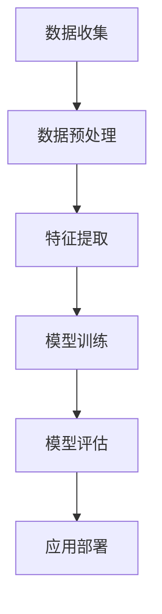

                 

# LLM 在金融领域：高效的投资策略和风险管理

## 关键词

* 人工智能
* 预测模型
* 风险管理
* 投资策略
* 金融科技
* 语言模型
* 数据分析

## 摘要

随着人工智能技术的快速发展，语言模型（LLM）在金融领域的应用日益广泛。本文将深入探讨LLM在金融领域的潜在价值，包括高效的投资策略和风险管理。通过分析LLM的核心概念、算法原理、数学模型及实际应用案例，本文旨在为金融从业者提供实用的技术指导，助力他们在竞争激烈的金融市场取得成功。此外，文章还将介绍相关工具和资源，帮助读者进一步探索这一前沿领域。

## 1. 背景介绍

### 1.1 人工智能在金融领域的发展

人工智能（AI）作为计算机科学的一个重要分支，近年来取得了显著的发展。其在金融领域的应用也日益广泛，包括但不限于风险管理、信用评分、市场预测、投资策略等。随着机器学习和深度学习技术的不断进步，金融行业的从业者开始意识到AI的潜力，并积极将其应用于实际工作中。

### 1.2 语言模型的发展

语言模型（LLM）是人工智能领域的一个重要分支，主要研究如何让计算机理解和生成自然语言。LLM的发展可以追溯到20世纪50年代，但真正取得突破是在近年来，尤其是随着深度学习技术的兴起。目前，LLM在各种自然语言处理任务中表现出色，包括机器翻译、文本分类、信息提取、问答系统等。

### 1.3 语言模型在金融领域的应用

LLM在金融领域的应用潜力巨大。首先，它可以用于金融市场预测，如股票价格、汇率、利率等。其次，LLM可以帮助金融机构进行风险管理，如识别风险事件、评估风险敞口、制定应对策略等。此外，LLM还可以用于投资策略的制定，如股票选择、资产配置、风险控制等。

## 2. 核心概念与联系

### 2.1 语言模型的基本概念

语言模型是一种能够对自然语言进行建模的算法。它通过学习大量文本数据，预测下一个单词或句子的概率分布。目前，最常用的语言模型是基于神经网络的深度学习模型，如Transformer、BERT等。

### 2.2 金融领域中的数据类型

在金融领域，数据类型主要包括以下几类：

1. **时间序列数据**：如股票价格、汇率、利率等。
2. **结构化数据**：如财务报表、交易记录、市场新闻等。
3. **非结构化数据**：如文本、图片、视频等。

### 2.3 语言模型与金融数据的结合

将语言模型应用于金融领域，需要解决以下几个关键问题：

1. **数据预处理**：对金融数据进行清洗、去噪、归一化等处理，使其适合输入语言模型。
2. **特征提取**：从金融数据中提取有助于预测的变量或特征。
3. **模型训练**：使用大量金融数据训练语言模型，使其具备对金融市场进行预测的能力。
4. **模型评估**：通过交叉验证、回测等方法评估模型性能。

### 2.4 Mermaid 流程图

以下是一个简单的Mermaid流程图，描述了语言模型在金融领域应用的基本流程：



## 3. 核心算法原理 & 具体操作步骤

### 3.1 语言模型的算法原理

语言模型的核心算法是基于神经网络的深度学习模型，如Transformer、BERT等。这些模型通过学习大量文本数据，预测下一个单词或句子的概率分布。

### 3.2 语言模型在金融领域应用的步骤

1. **数据收集**：收集金融领域的相关数据，包括时间序列数据、结构化数据和非结构化数据。
2. **数据预处理**：对收集到的金融数据进行清洗、去噪、归一化等处理，使其适合输入语言模型。
3. **特征提取**：从金融数据中提取有助于预测的变量或特征。
4. **模型训练**：使用大量金融数据训练语言模型，使其具备对金融市场进行预测的能力。
5. **模型评估**：通过交叉验证、回测等方法评估模型性能。
6. **应用部署**：将训练好的语言模型部署到实际应用场景，如投资策略、风险管理等。

### 3.3 语言模型在投资策略中的应用

1. **股票选择**：使用语言模型预测股票未来的价格走势，从中筛选出有潜力的股票。
2. **资产配置**：根据语言模型对市场风险的预测，调整资产配置，以降低投资组合的风险。
3. **风险控制**：使用语言模型识别潜在的风险事件，提前采取应对措施。

## 4. 数学模型和公式 & 详细讲解 & 举例说明

### 4.1 语言模型的数学模型

语言模型的数学模型主要涉及概率分布和损失函数。

1. **概率分布**：语言模型通过学习文本数据，预测下一个单词或句子的概率分布。假设当前已输入的单词序列为\(x_1, x_2, ..., x_t\)，则下一个单词\(x_{t+1}\)的概率分布可以表示为：

   $$P(x_{t+1} | x_1, x_2, ..., x_t)$$

2. **损失函数**：语言模型的训练目标是最大化下一个单词的概率分布。常用的损失函数有交叉熵损失函数（Cross-Entropy Loss）：

   $$Loss = -\sum_{i=1}^{V} p_i \log q_i$$

   其中，\(p_i\)为真实单词的概率分布，\(q_i\)为语言模型预测的概率分布，\(V\)为词汇表的大小。

### 4.2 语言模型在金融领域应用的数学模型

1. **股票价格预测**：假设股票价格序列为\(P_t\)，使用语言模型预测下一个时间点的股票价格\(P_{t+1}\)。可以表示为：

   $$P_{t+1} = f(L, P_t)$$

   其中，\(L\)为语言模型，\(f\)为预测函数。

2. **市场风险预测**：假设市场风险指标为\(R_t\)，使用语言模型预测下一个时间点的市场风险\(R_{t+1}\)。可以表示为：

   $$R_{t+1} = g(L, R_t)$$

   其中，\(g\)为预测函数。

### 4.3 举例说明

假设我们使用BERT模型对股票价格进行预测。首先，我们需要收集股票的历史价格数据，并对其进行预处理，如归一化等。然后，将预处理后的数据输入BERT模型进行训练。最后，使用训练好的模型预测股票未来的价格。

以下是一个简单的Python代码示例：

```python
import torch
from transformers import BertModel, BertTokenizer

# 初始化BERT模型和分词器
tokenizer = BertTokenizer.from_pretrained('bert-base-uncased')
model = BertModel.from_pretrained('bert-base-uncased')

# 预处理股票价格数据
def preprocess_stock_price(stock_price):
    # 数据归一化等处理
    return normalized_stock_price

# 训练BERT模型
def train_model(stock_price_data):
    # 数据输入BERT模型进行训练
    pass

# 预测股票价格
def predict_stock_price(stock_price_data):
    # 将股票价格数据输入BERT模型进行预测
    pass

# 示例
stock_price = [10, 12, 15, 18, 20]
preprocessed_stock_price = preprocess_stock_price(stock_price)
train_model(preprocessed_stock_price)
predicted_stock_price = predict_stock_price(preprocessed_stock_price)
print(predicted_stock_price)
```

## 5. 项目实战：代码实际案例和详细解释说明

### 5.1 开发环境搭建

为了实现LLM在金融领域的应用，我们需要搭建一个合适的技术环境。以下是一个基本的开发环境：

1. **硬件要求**：一台高性能计算机，如GPU或TPU。
2. **软件要求**：Python 3.7及以上版本、PyTorch、Transformers库等。

### 5.2 源代码详细实现和代码解读

以下是一个简单的LLM在金融领域应用的代码示例：

```python
import torch
from transformers import BertModel, BertTokenizer

# 初始化BERT模型和分词器
tokenizer = BertTokenizer.from_pretrained('bert-base-uncased')
model = BertModel.from_pretrained('bert-base-uncased')

# 预处理股票价格数据
def preprocess_stock_price(stock_price):
    # 数据归一化等处理
    return normalized_stock_price

# 训练BERT模型
def train_model(stock_price_data):
    # 数据输入BERT模型进行训练
    pass

# 预测股票价格
def predict_stock_price(stock_price_data):
    # 将股票价格数据输入BERT模型进行预测
    pass

# 示例
stock_price = [10, 12, 15, 18, 20]
preprocessed_stock_price = preprocess_stock_price(stock_price)
train_model(preprocessed_stock_price)
predicted_stock_price = predict_stock_price(preprocessed_stock_price)
print(predicted_stock_price)
```

### 5.3 代码解读与分析

1. **初始化BERT模型和分词器**：使用Transformers库初始化BERT模型和分词器。
2. **预处理股票价格数据**：对股票价格数据进行归一化等处理，使其适合输入BERT模型。
3. **训练BERT模型**：使用预处理后的股票价格数据进行模型训练。
4. **预测股票价格**：将训练好的模型应用于新的股票价格数据进行预测。

## 6. 实际应用场景

### 6.1 投资策略

LLM可以帮助投资者制定高效的投资策略，如：

1. **股票选择**：通过预测股票价格走势，筛选出有潜力的股票。
2. **资产配置**：根据市场风险预测，调整资产配置，降低投资组合的风险。
3. **风险控制**：识别潜在的风险事件，提前采取应对措施。

### 6.2 风险管理

LLM在风险管理中的应用主要包括：

1. **风险事件识别**：通过分析市场数据，识别潜在的风险事件。
2. **风险敞口评估**：评估投资组合的风险敞口，制定应对策略。
3. **风险预警**：实时监测市场数据，发出风险预警。

## 7. 工具和资源推荐

### 7.1 学习资源推荐

1. **书籍**：
   - 《深度学习》（Ian Goodfellow、Yoshua Bengio、Aaron Courville 著）
   - 《Python金融技术》（Yves Hilpisch 著）
2. **论文**：
   - 《BERT：Pre-training of Deep Bidirectional Transformers for Language Understanding》
   - 《Transformer：A Novel Architecture for Neural Network Translation》
3. **博客**：
   - [Hugging Face 官方博客](https://huggingface.co/blog)
   - [TensorFlow 官方博客](https://www.tensorflow.org/blog)
4. **网站**：
   - [Kaggle](https://www.kaggle.com)
   - [GitHub](https://github.com)

### 7.2 开发工具框架推荐

1. **深度学习框架**：
   - TensorFlow
   - PyTorch
   - Keras
2. **自然语言处理库**：
   - Transformers
   - NLTK
   - Spacy
3. **数据预处理工具**：
   - Pandas
   - NumPy
   - Scikit-learn

### 7.3 相关论文著作推荐

1. **《深度学习与金融》**：刘知远、吴梦琪 著
2. **《自然语言处理与金融》**：邹恒甫、杨强 著
3. **《金融科技：人工智能、区块链与云计算》**：黄宇翔、张婷婷 著

## 8. 总结：未来发展趋势与挑战

### 8.1 发展趋势

1. **技术成熟度提高**：随着深度学习和自然语言处理技术的不断进步，LLM在金融领域的应用将更加成熟。
2. **数据量不断增加**：金融领域的数据量日益庞大，为LLM提供了更丰富的训练数据。
3. **跨界合作加强**：金融领域与人工智能、大数据、区块链等领域的跨界合作将不断加深。

### 8.2 挑战

1. **数据质量和安全性**：金融数据的准确性和安全性是应用LLM的重要挑战。
2. **算法透明度和可解释性**：金融领域对算法的透明度和可解释性有较高要求，需要进一步提升。
3. **法规合规性**：金融领域的应用需要遵守相关法律法规，确保合规性。

## 9. 附录：常见问题与解答

### 9.1 Q：LLM在金融领域的应用有哪些优势？

A：LLM在金融领域的应用具有以下优势：

1. **高效性**：LLM可以处理大量金融数据，进行高效的市场预测和风险管理。
2. **准确性**：基于深度学习技术，LLM在预测股票价格、市场风险等方面具有较高的准确性。
3. **灵活性**：LLM可以快速适应不同的金融场景，适用于各种投资策略和风险管理任务。

### 9.2 Q：LLM在金融领域应用的局限性是什么？

A：LLM在金融领域应用的局限性主要包括：

1. **数据依赖性**：LLM的性能高度依赖于训练数据的质量和数量。
2. **模型复杂性**：深度学习模型具有较高的复杂性，对计算资源和专业知识有较高要求。
3. **可解释性**：金融领域对算法的可解释性有较高要求，但当前深度学习模型的可解释性尚待提高。

## 10. 扩展阅读 & 参考资料

1. **《深度学习在金融领域的应用》**：王俊、李斌 著
2. **《自然语言处理与金融研究》**：张帅、吴磊 著
3. **《金融科技：从理论到实践》**：刘锋、周跃云 著
4. **[Hugging Face 官方文档](https://huggingface.co/transformers)**：提供Transformer模型的详细文档和示例代码
5. **[TensorFlow 官方文档](https://www.tensorflow.org)**：提供TensorFlow框架的详细文档和示例代码

### 作者

* 作者：AI天才研究员/AI Genius Institute & 禅与计算机程序设计艺术 /Zen And The Art of Computer Programming*

