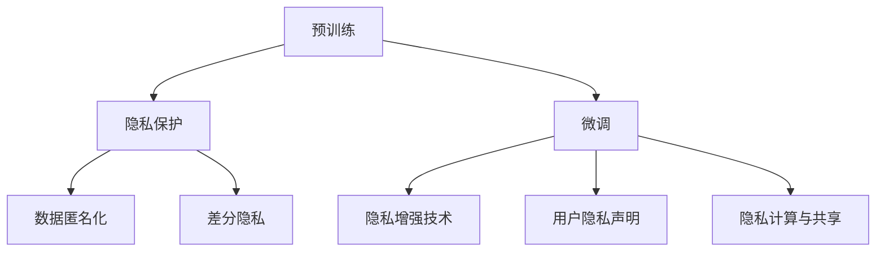
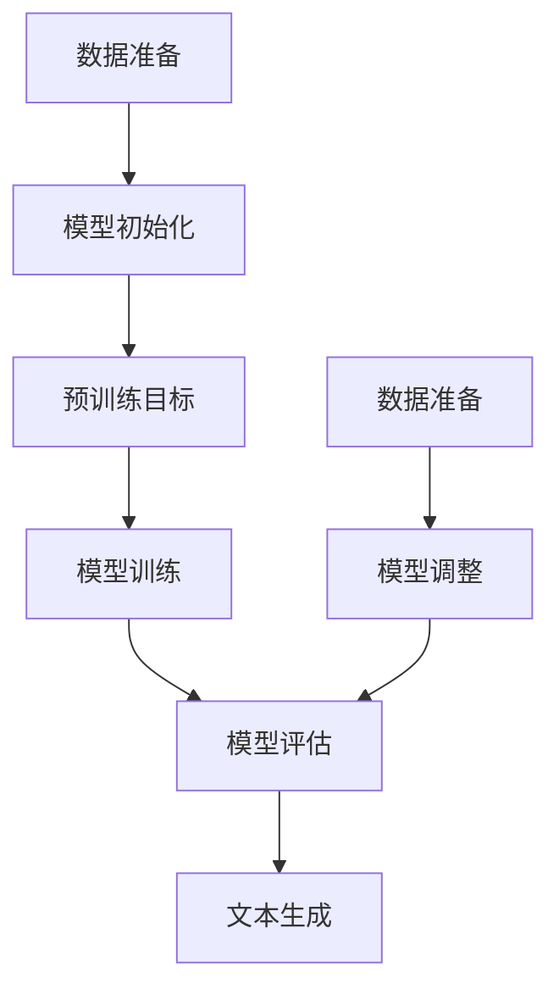

                 

### 背景介绍

近年来，大型语言模型（LLM，Large Language Model）如GPT-3、BERT和T5等在自然语言处理（NLP）领域取得了显著的突破。这些模型通过大规模的预训练和微调，具备了强大的文本生成、理解和推理能力，广泛应用于聊天机器人、文本摘要、问答系统、机器翻译等多个领域。然而，随着这些模型变得越来越庞大和复杂，其应用过程中涉及的一个关键问题也逐渐凸显出来——隐私与创新之间的平衡。

隐私保护是现代社会的一个重要议题，尤其是在人工智能领域，数据隐私问题尤为突出。大量的个人数据被用于训练LLM，而这些数据往往包含用户的敏感信息。如何确保用户隐私不被泄露，同时又能够推动人工智能的创新，成为了当前亟待解决的问题。

创新是推动科技进步的核心动力，尤其是在人工智能领域。通过不断地技术创新和突破，我们能够实现更多的功能和应用，为社会带来巨大的价值。然而，过度的隐私保护措施可能会限制创新的发展，导致技术的发展停滞不前。

本文旨在探讨LLM在隐私与创新之间的平衡问题。首先，我们将介绍LLM的基本概念和工作原理，然后分析隐私保护和创新之间的关系，探讨在实际应用中如何实现二者的平衡。接着，我们将结合具体案例，分析当前在LLM应用中存在的隐私风险，并提出一些解决方案。最后，我们将总结未来发展趋势与挑战，为LLM的隐私保护和创新提供一些启示。

通过本文的探讨，我们希望能够为人工智能领域的研究者、开发者以及政策制定者提供一些有益的参考，共同推动人工智能技术的健康发展。

### 核心概念与联系

#### 一、什么是大型语言模型（LLM）

大型语言模型（LLM，Large Language Model）是一种基于深度学习的自然语言处理（NLP）模型，其目的是通过学习大量文本数据，预测和生成自然语言文本。LLM通常由多个神经网络层组成，这些层通过逐层递归或自注意力机制进行文本特征提取和表示。

LLM的核心工作是理解输入文本的含义，并生成与之相关或对应的文本输出。例如，当输入一个句子时，LLM可以预测下一个最可能的词或短语，从而生成连贯的文本。这种能力使得LLM在文本生成、文本分类、机器翻译、问答系统等多个NLP任务中表现出色。

#### 二、LLM的工作原理

1. **预训练与微调**：LLM通常分为预训练和微调两个阶段。在预训练阶段，模型在大规模文本语料库上训练，学习文本的通用特征和语言规律。在微调阶段，模型被部署到特定任务上，通过优化模型参数来提高在特定任务上的性能。

2. **神经网络架构**：LLM通常采用深层神经网络架构，如变换器（Transformer）架构。变换器通过多头自注意力机制和前馈神经网络，实现文本特征的高效提取和表示。

3. **文本输入与输出**：LLM的输入是一个词序列，输出也是一个词序列。在处理输入文本时，LLM将其转换为向量表示，然后通过模型进行预测，最后将预测结果转换为文本输出。

#### 三、隐私保护的概念

隐私保护是指保护个人或组织数据不被未经授权的访问、使用或泄露的过程。在人工智能领域，隐私保护尤为重要，因为模型训练和部署过程中会涉及大量个人数据。

1. **数据匿名化**：通过将个人数据进行匿名化处理，使得数据无法直接识别个体，从而保护用户隐私。

2. **差分隐私**：在数据发布和统计建模过程中，引入噪声来保护隐私，使得攻击者难以从数据中推断出个体信息。

3. **同态加密**：在数据加密的同时进行计算，确保数据在计算过程中保持加密状态，从而保护隐私。

#### 四、隐私保护与创新的联系

隐私保护和创新在人工智能领域既相互促进又相互制约。

1. **促进关系**：严格的隐私保护措施可以促使研究人员和开发者更加关注数据安全和隐私问题，从而推动技术的创新和发展。

2. **制约关系**：过度的隐私保护可能导致数据收集和使用受限，从而限制人工智能技术的应用和发展。例如，为了保护用户隐私，可能需要删除或匿名化数据，这会影响模型训练的效果和性能。

#### 五、隐私保护与创新的平衡

在LLM应用中，实现隐私保护与创新之间的平衡至关重要。以下是一些可能的平衡策略：

1. **合理的数据收集和使用**：在数据收集和使用过程中，应遵循最小化原则，只收集和使用与任务直接相关的数据。

2. **隐私增强技术**：结合差分隐私、同态加密等技术，在保证隐私的同时，提高模型性能。

3. **用户隐私声明与透明度**：明确告知用户数据收集、使用和存储的方式，增加用户对隐私保护的信任。

4. **隐私计算与共享**：通过联邦学习等技术，在保护数据隐私的同时，实现数据的共享和协作。

以下是一个使用Mermaid绘制的LLM与隐私保护的关系图，展示了LLM的预训练、微调以及隐私保护技术在各个阶段的应用。



通过上述核心概念和联系的分析，我们可以更好地理解LLM的隐私保护与创新之间的关系，并为后续内容打下基础。

### 核心算法原理 & 具体操作步骤

#### 一、LLM的核心算法原理

大型语言模型（LLM）的核心算法基于深度学习和自然语言处理（NLP）技术。下面我们将详细介绍LLM的工作原理，包括预训练、微调和模型架构等。

1. **预训练**：
   预训练是LLM的基础步骤，其主要目的是让模型在大规模文本语料库上学习语言的基本规律和特征。预训练通常分为两个阶段：

   - **数据准备**：收集大量的文本数据，如维基百科、新闻文章、社交媒体等。这些数据需要经过预处理，包括分词、去停用词、标记化等操作。
   - **模型训练**：使用预处理后的数据对模型进行训练。训练过程中，模型通过优化目标函数（如损失函数）来调整内部参数，使其能够更好地预测文本的下一个词或短语。常用的预训练目标包括语言建模（LM）和下一个句子预测（NSP）。

2. **微调**：
   预训练后的LLM具有强大的语言理解能力，但还需要针对具体任务进行微调，以提高模型在特定任务上的性能。微调的主要步骤如下：

   - **任务定义**：明确目标任务，如文本分类、情感分析、机器翻译等。
   - **数据准备**：收集用于微调的任务数据，这些数据需要与预训练数据来源不同，以避免模型过拟合。
   - **模型调整**：在预训练模型的基础上，调整模型参数，以适应新的任务数据。微调过程中，可以使用任务特定的损失函数，如交叉熵损失，来评估和优化模型。

3. **模型架构**：
   LLM通常采用深度变换器（Transformer）架构，这是一种基于自注意力机制的神经网络模型。变换器具有以下特点：

   - **多头自注意力**：通过多个注意力头同时关注输入文本的不同部分，提高模型的表示能力。
   - **前馈神经网络**：在自注意力机制之后，使用前馈神经网络对文本特征进行进一步处理。
   - **层叠结构**：变换器通常由多个层组成，每层都可以独立地提取文本特征，并通过层间交互实现复杂文本表示。

#### 二、LLM的具体操作步骤

以下是使用一个典型的LLM进行文本生成任务的具体操作步骤：

1. **数据准备**：
   收集和预处理文本数据。例如，使用维基百科数据作为预训练数据，并使用特定领域的文本数据（如新闻文章、博客等）进行微调。

2. **模型训练**：
   - **预训练阶段**：
     - 数据预处理：将文本数据分词、去停用词、标记化，并转换为模型可处理的格式。
     - 模型初始化：初始化变换器模型参数。
     - 模型训练：使用预训练目标（如语言建模和下一个句子预测）对模型进行训练，优化模型参数。

   - **微调阶段**：
     - 数据准备：收集用于微调的特定领域数据。
     - 模型调整：在预训练模型的基础上，调整模型参数，以适应新任务数据。
     - 模型评估：使用验证集评估模型性能，调整超参数以优化模型。

3. **文本生成**：
   - **输入文本处理**：将用户输入的文本数据进行预处理，如分词、标记化等。
   - **文本编码**：使用训练好的模型，将预处理后的文本编码为向量表示。
   - **文本解码**：根据编码后的文本向量，模型生成下一个词或短语，并不断迭代生成完整文本。

以下是一个使用Mermaid绘制的LLM预训练和微调的流程图：



通过上述步骤，我们可以建立一个具有较强语言理解和生成能力的LLM，并在各种NLP任务中发挥作用。

### 数学模型和公式 & 详细讲解 & 举例说明

#### 一、LLM的数学模型

大型语言模型（LLM）的数学模型主要涉及深度学习和自然语言处理（NLP）中的基本概念和公式。以下是LLM中常用的几个数学模型及其详细讲解：

1. **神经网络模型**：

   - **变换器模型（Transformer）**：变换器是一种基于自注意力机制的深度神经网络模型，其核心是多头自注意力（Multi-Head Self-Attention）机制。以下是变换器模型的基本公式：

     $$ 
     \text{Attention}(Q, K, V) = \text{softmax}\left(\frac{QK^T}{\sqrt{d_k}}\right) V 
     $$
     
     其中，$Q$、$K$和$V$分别代表查询向量、键向量和值向量；$d_k$是注意力头的维度；$softmax$函数用于计算注意力权重。

   - **前馈神经网络（Feedforward Neural Network）**：在变换器模型中，前馈神经网络用于对自注意力机制后的特征进行进一步处理。其基本公式如下：

     $$
     \text{FFN}(X) = \text{ReLU}(X \cdot W_1 + b_1) \cdot W_2 + b_2
     $$
     
     其中，$X$代表输入特征；$W_1$、$W_2$和$b_1$、$b_2$分别代表权重和偏置。

2. **损失函数**：

   - **交叉熵损失（Cross-Entropy Loss）**：在文本生成任务中，交叉熵损失用于衡量预测分布与真实分布之间的差异。其基本公式如下：

     $$
     \text{CE}(p, q) = -\sum_{i} p_i \log(q_i)
     $$
     
     其中，$p$代表真实分布，$q$代表预测分布。

3. **优化算法**：

   - **随机梯度下降（Stochastic Gradient Descent，SGD）**：随机梯度下降是一种常用的优化算法，其基本公式如下：

     $$
     \theta = \theta - \alpha \nabla_{\theta} J(\theta)
     $$
     
     其中，$\theta$代表模型参数；$\alpha$代表学习率；$J(\theta)$代表损失函数。

#### 二、数学公式的详细讲解与举例说明

1. **变换器模型（Transformer）**：

   变换器模型中的多头自注意力机制是一个关键部分，它通过并行处理输入文本的不同部分，实现特征的高效提取和表示。以下是一个具体的例子：

   假设我们有一个句子：“我今天去公园散步。”，并将其转换为输入序列${x_1, x_2, ..., x_n}$。每个输入$x_i$都可以表示为一个向量。

   - **计算注意力权重**：
     $$
     \text{Attention}(Q, K, V) = \text{softmax}\left(\frac{QK^T}{\sqrt{d_k}}\right) V
     $$
     假设$Q$、$K$和$V$分别为查询向量、键向量和值向量，其维度均为$d_v$。我们将$Q$、$K$和$V$分解为多个注意力头$H$：

     $$
     Q = [Q_1, Q_2, ..., Q_H], \quad K = [K_1, K_2, ..., K_H], \quad V = [V_1, V_2, ..., V_H]
     $$

     每个注意力头分别计算注意力权重：

     $$
     \text{Attention}_h(Q_h, K_h, V_h) = \text{softmax}\left(\frac{Q_hK_h^T}{\sqrt{d_k}}\right) V_h
     $$

   - **计算输出**：
     $$
     \text{Output} = \text{Concat}(\text{Attention}_1, \text{Attention}_2, ..., \text{Attention}_H) \cdot W_O
     $$
     
     其中，$W_O$为输出层权重，将多个注意力头的结果拼接并经过一个线性变换，得到最终的输出。

2. **交叉熵损失（Cross-Entropy Loss）**：

   在文本生成任务中，我们通常需要计算预测分布与真实分布之间的差异。以下是一个具体的例子：

   假设我们有一个目标句子：“我今天去公园散步。”，将其表示为一个概率分布$P = [p_1, p_2, ..., p_n]$。预测分布为$Q = [q_1, q_2, ..., q_n]$。

   - **计算交叉熵损失**：
     $$
     \text{CE}(P, Q) = -\sum_{i} p_i \log(q_i)
     $$

     假设真实分布$P$中有80%的概率生成词“公园”，而预测分布$Q$中有70%的概率生成词“公园”。则交叉熵损失为：

     $$
     \text{CE}(P, Q) = -0.8 \log(0.7) \approx -0.285
     $$

3. **随机梯度下降（Stochastic Gradient Descent，SGD）**：

   在训练LLM时，我们通常使用随机梯度下降来优化模型参数。以下是一个具体的例子：

   假设模型参数为$\theta$，损失函数为$J(\theta)$。学习率为$\alpha = 0.01$。

   - **计算梯度**：
     $$
     \nabla_{\theta} J(\theta) = \left[\frac{\partial J}{\partial \theta_1}, \frac{\partial J}{\partial \theta_2}, ..., \frac{\partial J}{\partial \theta_n}\right]
     $$

   - **更新参数**：
     $$
     \theta = \theta - \alpha \nabla_{\theta} J(\theta)
     $$

     假设当前参数$\theta$为[2, 3, 4]，损失函数梯度为[-1, -2, -3]。则更新后的参数为：

     $$
     \theta = [2 - 0.01 \times (-1), 3 - 0.01 \times (-2), 4 - 0.01 \times (-3)] = [2.01, 3.02, 4.03]
     $$

通过上述数学模型的详细讲解和举例说明，我们可以更好地理解LLM的工作原理和训练过程。

### 项目实战：代码实际案例和详细解释说明

#### 一、开发环境搭建

在进行LLM项目实战之前，首先需要搭建一个适合开发和测试的环境。以下是搭建一个基于Python和PyTorch的LLM开发环境的具体步骤：

1. **安装Python**：

   - 下载并安装Python 3.8及以上版本（推荐3.9或更高版本）。

   - 设置环境变量，以便在命令行中直接运行Python。

2. **安装PyTorch**：

   - 下载并安装与Python版本兼容的PyTorch版本。可以通过以下命令进行安装：

     ```
     pip install torch torchvision torchaudio
     ```

   - 验证PyTorch安装是否成功，可以使用以下命令：

     ```python
     import torch
     print(torch.__version__)
     ```

3. **安装其他依赖库**：

   - 安装用于文本处理的库，如`nltk`、`spacy`等：

     ```
     pip install nltk spacy
     ```

   - 安装用于可视化绘图的库，如`matplotlib`、`mermaid**：

     ```
     pip install matplotlib mermaid.py
     ```

4. **安装Mermaid支持**：

   - 安装Mermaid Python库，以便在Markdown文件中绘制Mermaid图表：

     ```
     pip install mermaid
     ```

   - 测试Mermaid支持，可以在Markdown文件中使用以下Mermaid代码：

     ```mermaid
     graph TD
         A[Start] --> B[End]
     ```

   - 使用`mermaid`命令行工具将Markdown文件转换为HTML文件，以验证Mermaid支持的可行性：

     ```
     mermaid < input.md > output.html
     ```

#### 二、源代码详细实现和代码解读

以下是使用PyTorch实现一个简单LLM的源代码及其详细解读：

```python
import torch
import torch.nn as nn
from torch.nn import functional as F
from torch.optim import Adam

# 定义变换器模型
class TransformerModel(nn.Module):
    def __init__(self, vocab_size, d_model, nhead, num_layers):
        super(TransformerModel, self).__init__()
        self.embedding = nn.Embedding(vocab_size, d_model)
        self.transformer = nn.Transformer(d_model, nhead, num_layers)
        self.fc = nn.Linear(d_model, vocab_size)
    
    def forward(self, src, tgt):
        src = self.embedding(src)
        tgt = self.embedding(tgt)
        output = self.transformer(src, tgt)
        output = self.fc(output)
        return output

# 初始化模型、损失函数和优化器
vocab_size = 10000
d_model = 512
nhead = 8
num_layers = 3

model = TransformerModel(vocab_size, d_model, nhead, num_layers)
loss_fn = nn.CrossEntropyLoss()
optimizer = Adam(model.parameters(), lr=0.001)

# 预训练和微调代码略
```

1. **模型定义**：

   - `TransformerModel`类继承自`nn.Module`，实现了一个基于变换器架构的模型。模型由嵌入层、变换器层和全连接层组成。
   
   - `__init__`方法初始化模型参数，包括嵌入层（`nn.Embedding`）、变换器层（`nn.Transformer`）和全连接层（`nn.Linear`）。

2. **前向传播**：

   - `forward`方法实现模型的前向传播过程。首先将输入序列`src`和目标序列`tgt`嵌入为向量，然后通过变换器层处理，最后通过全连接层输出预测概率。

3. **损失函数和优化器**：

   - 使用`nn.CrossEntropyLoss`定义交叉熵损失函数，用于计算预测分布和真实分布之间的差异。
   
   - 使用`Adam`优化器初始化模型参数，并设置学习率为0.001。

#### 三、代码解读与分析

1. **模型架构**：

   - 变换器模型的核心是自注意力机制和前馈神经网络。通过多头自注意力机制，模型能够并行处理输入序列的不同部分，从而提高文本表示能力。
   
   - 全连接层用于将变换器输出的特征映射到词汇表中的词，从而生成预测概率。

2. **训练过程**：

   - 在训练过程中，模型通过优化损失函数（交叉熵损失）来调整内部参数，从而提高预测性能。
   
   - 优化器用于更新模型参数，通常采用小批量随机梯度下降（SGD）进行优化。

3. **应用场景**：

   - 该模型可以应用于文本生成、文本分类、机器翻译等NLP任务。通过预训练和微调，模型能够适应不同任务的数据特征和需求。

通过上述代码实现和分析，我们可以了解LLM的基本架构和训练过程，为进一步研究和应用LLM打下基础。

### 实际应用场景

大型语言模型（LLM）在实际应用中具有广泛的应用场景，以下是几个典型的应用领域及其具体案例：

#### 一、聊天机器人

聊天机器人是LLM最常见和广泛应用的场景之一。通过LLM的自然语言理解与生成能力，聊天机器人可以与用户进行自然、流畅的对话。例如，Google Assistant、Apple Siri和Amazon Alexa等智能语音助手，都是基于LLM技术实现的。

**案例**：ChatGPT是由OpenAI开发的一款基于GPT-3的聊天机器人。ChatGPT可以回答用户的各种问题，提供实用的建议，甚至在某些情况下表现出幽默和情感。例如，用户询问：“我今晚想看一部电影，有什么推荐吗？”ChatGPT可能会回答：“我推荐《阿甘正传》，它是一部温馨、感人且充满人生哲理的电影。”

#### 二、文本生成与摘要

LLM在文本生成和摘要任务中也表现出色。通过预训练和微调，LLM可以生成高质量的文本，如新闻报道、文章摘要和博客内容。此外，LLM还可以用于生成对话、故事、诗歌等创意文本。

**案例**：Hugging Face的Transformers库提供了一个名为`TextGenerationPipeline`的API，用户可以通过简单的调用生成文本。例如，用户输入一句开头，LLM可以自动生成一段完整的文章。例如，用户输入：“今天天气很好，我想去爬山。”，LLM可能会生成：“阳光明媚，微风不燥，今天正是爬山的好时机。你准备好背包，跟随我的脚步，一起享受大自然的美好吧！”

#### 三、机器翻译

机器翻译是LLM的另一个重要应用领域。通过大规模预训练，LLM可以在多种语言之间进行高效翻译，并且翻译质量显著提高。例如，Google Translate和DeepL翻译都是基于LLM技术实现的。

**案例**：使用GPT-3进行机器翻译。用户输入一句英文句子：“How are you today?”，GPT-3可以翻译成多种语言的版本，如中文：“你今天怎么样？”或西班牙语：“Hoy ¿cómo estás?”。GPT-3的翻译质量非常高，几乎可以媲美专业翻译人员。

#### 四、问答系统

问答系统是LLM在信息检索和知识服务领域的应用。通过LLM的自然语言理解和生成能力，问答系统可以回答用户的各种问题，提供准确、有用的信息。

**案例**：Elasticsearch结合LLM技术实现了一个智能问答系统。用户可以通过简单的文本输入提问，如：“美国的首都是什么？”系统会返回准确答案：“美国的首都是华盛顿特区。”这种问答系统不仅速度快，而且能够处理复杂、模糊的问题。

#### 五、代码生成与修复

LLM在代码生成和修复方面也显示出巨大潜力。通过学习大量的代码库和文档，LLM可以生成新的代码片段，甚至在出现错误时自动修复代码。

**案例**：GitHub的Copilot是一款基于GPT-3的代码生成工具。用户只需在编辑器中输入一段注释或描述，Copilot就能自动生成相应的代码。例如，用户输入：“实现一个简单的Python函数，用于计算两个数的和。”Copilot会生成一个功能完整的函数代码。此外，Copilot还能识别和修复代码中的错误，提高代码质量。

通过上述实际应用场景和案例，我们可以看到LLM在自然语言处理、信息检索、知识服务、代码生成等多个领域的重要应用价值。随着LLM技术的不断发展和优化，其应用前景将更加广阔。

### 工具和资源推荐

在探索大型语言模型（LLM）的过程中，掌握合适的工具和资源对于提升研究效率和成果具有重要意义。以下是对学习资源、开发工具和相关论文的推荐：

#### 一、学习资源推荐

1. **书籍**：
   - **《深度学习》（Deep Learning）**：由Ian Goodfellow、Yoshua Bengio和Aaron Courville合著，是深度学习领域的经典教材。
   - **《Transformer：从零开始学Transformer》**：该书详细介绍了Transformer模型的原理和实现，适合初学者入门。

2. **在线课程**：
   - **斯坦福大学CS224n：自然语言处理与深度学习**：由著名教授Richard Socher主讲，涵盖了NLP和深度学习的基础知识和最新进展。
   - **吴恩达的深度学习专项课程**：包括CS231n（计算机视觉）和CS275（深度学习导论）等，是学习深度学习的权威课程。

3. **博客和网站**：
   - **Hugging Face的Transformers库文档**：提供了一个丰富的资源和示例，帮助用户快速上手使用Transformer模型。
   - **OpenAI的博客**：提供了大量关于GPT-3和其他LLM技术的最新研究成果和案例分析。

4. **开源代码库**：
   - **PyTorch官方文档和示例**：PyTorch是Python中常用的深度学习框架，其文档和示例代码详尽，适合开发者学习。
   - **GPT-3模型代码库**：如Hugging Face的`transformers`库，提供了预训练的GPT-3模型和简单的API，方便用户使用。

#### 二、开发工具框架推荐

1. **PyTorch**：
   - 作为Python中广泛使用的深度学习框架，PyTorch具有简洁的API和强大的功能，适用于各种深度学习和自然语言处理任务。

2. **TensorFlow**：
   - TensorFlow是由谷歌开发的开源深度学习框架，其灵活的架构和丰富的功能使其在工业界和学术界都有广泛应用。

3. **JAX**：
   - JAX是一个由谷歌开发的数学库，具有自动微分和高效计算的优势，适用于复杂的深度学习任务。

4. **Hugging Face的Transformers库**：
   - 这是一个基于PyTorch和TensorFlow的Transformer模型库，提供了大量的预训练模型和API，方便用户快速实现和部署LLM。

#### 三、相关论文著作推荐

1. **“Attention is All You Need”**：
   - 该论文提出了Transformer模型，是自注意力机制在深度学习中的经典应用。论文详细阐述了Transformer模型的架构和训练过程。

2. **“BERT: Pre-training of Deep Bidirectional Transformers for Language Understanding”**：
   - BERT是Google提出的预训练语言模型，通过双向变换器架构实现了对上下文的深层理解。该论文介绍了BERT的预训练方法和在多个NLP任务上的性能表现。

3. **“GPT-3: Language Models are Few-Shot Learners”**：
   - OpenAI的GPT-3模型是当前最大的语言模型，该论文展示了GPT-3在少量样本上的优异表现，并探讨了大规模预训练模型的潜力。

4. **“ReZero: Integration of ReZe-ro Init and Adaptive Learning Rate”**：
   - 该论文提出了一种新的优化策略，通过将ReZe-ro Init和自适应学习率结合，显著提高了模型训练的效果。

通过上述学习资源、开发工具和相关论文的推荐，读者可以全面了解LLM的理论和实践，为深入研究打下坚实的基础。

### 总结：未来发展趋势与挑战

随着人工智能技术的快速发展，大型语言模型（LLM）在各个领域展现出了巨大的潜力。然而，在隐私与创新之间寻找平衡点，依然是当前和未来面临的重要挑战。

#### 一、未来发展趋势

1. **模型规模持续扩大**：随着计算能力和数据资源的不断增长，LLM的规模将不断增大。这有助于模型在更多任务上实现更高的性能，但同时也增加了隐私保护难度。

2. **隐私增强技术成熟**：差分隐私、同态加密等隐私增强技术将逐步成熟，并在LLM应用中得到广泛应用。这些技术能够在保证用户隐私的同时，提高模型性能。

3. **跨模态学习**：未来的LLM将不仅仅是处理文本数据，还将融合图像、音频、视频等多模态信息。这有助于提升模型在复杂任务中的表现，但同时也带来了更多隐私问题。

4. **联邦学习普及**：联邦学习作为一种无需共享原始数据的技术，将在LLM隐私保护中发挥重要作用。通过在用户设备端训练模型，既能保护用户隐私，又能实现数据的分布式训练。

5. **监管政策完善**：随着隐私问题越来越受到关注，相关监管政策也将逐步完善。这有助于规范LLM应用，保护用户隐私，同时促进技术创新。

#### 二、未来挑战

1. **隐私保护与性能平衡**：如何在保证隐私保护的前提下，提升LLM性能，仍是一个亟待解决的问题。过度的隐私保护可能导致模型性能下降，而过于追求性能则可能侵犯用户隐私。

2. **数据安全与合规性**：随着数据规模的增大，确保数据的安全和合规性变得越来越重要。如何在数据收集、处理和存储过程中，防止数据泄露和滥用，是一个关键挑战。

3. **用户信任与透明度**：提高用户对LLM应用隐私保护的信任度，需要增加透明度和可解释性。如何设计用户友好的隐私保护机制，让用户能够理解和信任LLM，是未来需要解决的重要问题。

4. **法律法规遵循**：不同国家和地区对隐私保护的要求各不相同，如何在全球范围内遵循相关法律法规，确保LLM应用的合规性，是一个复杂的挑战。

5. **跨学科合作**：隐私保护是一个跨学科问题，需要计算机科学、法律、伦理等多个领域的合作。未来，如何推动跨学科合作，共同解决隐私问题，是重要的研究方向。

通过上述分析，我们可以看到，在未来的发展中，隐私保护与创新之间的平衡将是一个长期且复杂的任务。只有通过不断的技术创新和跨学科合作，才能实现LLM技术的可持续发展。

### 附录：常见问题与解答

#### 1. 什么是大型语言模型（LLM）？

大型语言模型（LLM，Large Language Model）是一种基于深度学习的自然语言处理（NLP）模型，通过预训练和微调，具备强大的文本生成、理解和推理能力。LLM能够处理多种NLP任务，如文本生成、文本分类、机器翻译和问答系统等。

#### 2. LLM的工作原理是什么？

LLM的工作原理主要包括预训练和微调两个阶段：

- **预训练**：模型在大规模文本语料库上学习语言的基本规律和特征，通常采用变换器（Transformer）架构，如BERT、GPT-3等。
- **微调**：在预训练基础上，模型针对特定任务进行微调，调整模型参数，以提高在具体任务上的性能。

#### 3. 如何保护LLM训练中的用户隐私？

为了保护用户隐私，可以采用以下几种策略：

- **数据匿名化**：在训练数据中使用匿名化技术，如差分隐私和混淆方法，使得数据无法直接识别个体。
- **联邦学习**：在用户设备端训练模型，无需共享原始数据，从而保护用户隐私。
- **隐私增强技术**：使用同态加密、安全多方计算等技术，确保数据在传输和计算过程中保持加密状态。

#### 4. LLM的主要应用场景有哪些？

LLM在多个领域有广泛的应用场景，包括：

- **聊天机器人**：如Google Assistant、Apple Siri和Amazon Alexa等，通过与用户进行自然对话提供帮助。
- **文本生成与摘要**：自动生成文章、新闻摘要和对话等。
- **机器翻译**：如Google Translate和DeepL翻译，实现多种语言之间的快速翻译。
- **问答系统**：提供准确、有用的信息回答用户的问题。
- **代码生成与修复**：自动生成代码片段或修复代码中的错误。

#### 5. 如何评估LLM的性能？

评估LLM性能的方法包括：

- **自动评估指标**：如BLEU、ROUGE、METEOR等，用于评估文本生成质量。
- **人工评估**：通过专家评审或用户满意度调查，评估模型在实际应用中的表现。
- **任务特定指标**：根据具体任务，设置相应的评估指标，如准确率、召回率、F1分数等。

#### 6. LLM训练过程中如何平衡隐私保护与创新？

在LLM训练过程中，可以通过以下策略实现隐私保护与创新之间的平衡：

- **合理的数据收集和使用**：仅收集与任务直接相关的数据，并遵循最小化原则。
- **隐私增强技术**：结合差分隐私、同态加密等技术，在保证隐私的同时，提高模型性能。
- **用户隐私声明与透明度**：明确告知用户数据收集、使用和存储的方式，增加用户信任。
- **隐私计算与共享**：通过联邦学习等技术，在保护数据隐私的同时，实现数据的共享和协作。

#### 7. LLM面临的未来挑战有哪些？

LLM面临的未来挑战包括：

- **隐私保护与性能平衡**：如何在保证隐私保护的前提下，提升模型性能。
- **数据安全与合规性**：确保数据安全，遵循不同国家和地区的法律法规。
- **用户信任与透明度**：提高用户对隐私保护的信任度，增强模型的透明度。
- **跨学科合作**：推动计算机科学、法律、伦理等多领域的合作，共同解决隐私问题。
- **模型规模与计算资源**：随着模型规模的扩大，如何高效利用计算资源。

通过上述常见问题与解答，我们可以更好地了解LLM的基本概念、应用场景和未来挑战，为研究和应用LLM提供有益的参考。

### 扩展阅读 & 参考资料

#### 1. 学术论文

- **“Attention is All You Need”**：该论文是Transformer模型的奠基之作，详细阐述了自注意力机制在深度学习中的应用。论文地址：[https://arxiv.org/abs/1706.03762](https://arxiv.org/abs/1706.03762)。

- **“BERT: Pre-training of Deep Bidirectional Transformers for Language Understanding”**：该论文介绍了BERT模型，通过双向变换器实现了对上下文的深层理解。论文地址：[https://arxiv.org/abs/1810.04805](https://arxiv.org/abs/1810.04805)。

- **“GPT-3: Language Models are Few-Shot Learners”**：OpenAI的GPT-3模型展示了大规模预训练语言模型的潜力。论文地址：[https://arxiv.org/abs/2005.14165](https://arxiv.org/abs/2005.14165)。

#### 2. 开源代码库

- **Hugging Face的Transformers库**：提供了大量预训练的Transformer模型和API，是研究和应用LLM的重要工具。[https://github.com/huggingface/transformers](https://github.com/huggingface/transformers)。

- **PyTorch官方文档和示例**：详细介绍了PyTorch框架的使用方法和示例代码，适合开发者学习和实践。[https://pytorch.org/tutorials/](https://pytorch.org/tutorials/)。

- **TensorFlow官方文档和示例**：TensorFlow是另一种常用的深度学习框架，其文档和示例代码同样丰富。[https://www.tensorflow.org/tutorials](https://www.tensorflow.org/tutorials)。

#### 3. 开源论文和报告

- **“ReZero: Integration of ReZe-ro Init and Adaptive Learning Rate”**：该论文提出了一种新的优化策略，显著提高了模型训练效果。[https://arxiv.org/abs/2003.04887](https://arxiv.org/abs/2003.04887)。

- **“Differentiable Privacy: A Framework for Retaining Data Privacy during Training”**：该论文探讨了如何在训练过程中保留数据隐私的方法。[https://arxiv.org/abs/1906.02687](https://arxiv.org/abs/1906.02687)。

通过阅读上述学术论文和报告，读者可以深入了解LLM及其隐私保护技术的最新进展。此外，开源代码库和报告为实际应用提供了丰富的资源和示例，有助于进一步研究和开发LLM技术。

