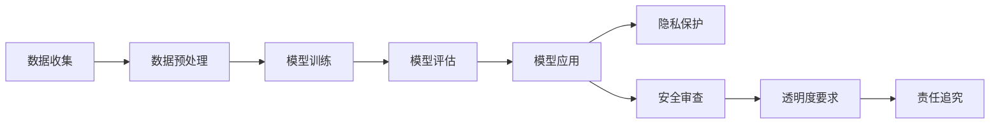

                 

### 文章标题

**LLM 监管：保障隐私与安全的发展**

### 关键词

- LLM（大型语言模型）
- 监管
- 隐私保护
- 安全性
- 发展趋势

### 摘要

本文将深入探讨大型语言模型（LLM）监管的重要性和发展。随着LLM在各个领域的广泛应用，其对隐私和安全性的挑战日益突出。本文首先介绍了LLM的基本概念和背景，然后分析了当前隐私和安全问题，并提出了相应的监管策略。通过实际案例和工具推荐，本文展示了如何在保障隐私和安全的前提下，促进LLM技术的健康发展。最后，本文总结了未来发展趋势和挑战，为读者提供了有价值的参考。

## 1. 背景介绍

近年来，大型语言模型（Large Language Models，简称LLM）在各种领域的应用取得了显著进展。从自然语言处理（NLP）、问答系统到机器翻译、文本生成，LLM展现出了强大的能力和广泛的应用前景。这些模型通过大量数据训练，具备了理解和生成自然语言的能力，为人类提供了更加便捷和智能的服务。

然而，随着LLM的广泛应用，也带来了新的挑战，特别是在隐私和安全方面。由于LLM的训练过程涉及到大量用户数据，如何保障这些数据的隐私和安全成为了一个重要问题。此外，LLM在某些场景下可能会产生误导性的回答，给用户带来潜在的风险。

因此，对LLM进行有效监管，保障隐私与安全，已经成为当前的一个重要课题。本文将首先介绍LLM的基本概念和背景，然后分析当前存在的隐私和安全问题，并探讨相应的监管策略。

## 2. 核心概念与联系

### 2.1 LLM基本概念

大型语言模型（LLM）是一种基于深度学习的自然语言处理模型，旨在对自然语言进行理解和生成。LLM通常通过大量的文本数据进行训练，从而学习到语言的规律和结构。这些模型具有以下特点：

1. **大规模训练数据**：LLM通常使用数十亿甚至数千亿级别的文本数据，从而使其具备较高的语言理解能力。
2. **深度神经网络架构**：LLM采用深度神经网络（DNN）架构，通过多层神经元的组合，实现对文本数据的层次化理解。
3. **参数规模大**：LLM的参数规模通常在数十亿到千亿级别，使其具有强大的表达能力和学习能力。

### 2.2 LLM应用场景

LLM在多个领域展现出了广泛的应用前景，主要包括：

1. **自然语言处理（NLP）**：LLM在文本分类、情感分析、命名实体识别等方面具有显著优势。
2. **问答系统**：LLM可以用于构建智能问答系统，为用户提供实时、准确的回答。
3. **机器翻译**：LLM在机器翻译领域取得了显著进展，使得机器翻译质量得到了大幅提升。
4. **文本生成**：LLM可以用于生成各种类型的文本，如文章、新闻、故事等，为内容创作提供帮助。

### 2.3 隐私和安全问题

在LLM应用过程中，隐私和安全问题逐渐成为关注的焦点。主要问题包括：

1. **数据隐私泄露**：LLM的训练过程需要大量用户数据，如何保障这些数据的隐私和安全成为一个重要问题。
2. **安全威胁**：LLM在应用过程中可能会遭受恶意攻击，如伪造回答、操纵信息传播等。
3. **误导性回答**：在某些场景下，LLM可能会产生误导性的回答，给用户带来潜在的风险。

### 2.4 监管框架

为了应对上述隐私和安全问题，需要对LLM进行有效监管。监管框架主要包括以下几个方面：

1. **数据隐私保护**：制定相关法律法规，明确数据隐私保护的标准和责任，确保用户数据在训练和存储过程中得到有效保护。
2. **安全审查**：对LLM应用进行安全审查，评估其潜在的安全威胁，并采取相应的防范措施。
3. **透明度要求**：要求LLM开发者公开模型训练数据来源、训练过程和模型结构，增加透明度，便于公众监督。
4. **责任追究**：明确LLM开发者和应用者的责任，对于违反隐私和安全规定的个人或机构，进行相应的处罚和追责。

### 2.5 Mermaid流程图

以下是LLM监管的核心概念和架构的Mermaid流程图：



## 3. 核心算法原理 & 具体操作步骤

### 3.1 模型训练

LLM的训练过程主要分为以下几个步骤：

1. **数据收集**：从公开或私人数据源收集大量文本数据，如新闻、论坛、社交媒体等。
2. **数据预处理**：对收集到的文本数据进行处理，包括去除噪声、分词、去停用词等操作，将原始文本转换为适合训练的格式。
3. **模型初始化**：初始化深度神经网络模型，通常使用预训练的模型作为起点，如GPT、BERT等。
4. **前向传播**：将处理后的文本数据输入到模型中，计算模型输出的预测结果。
5. **反向传播**：计算预测结果与实际标签之间的误差，通过反向传播算法更新模型参数。
6. **迭代训练**：重复前向传播和反向传播过程，不断更新模型参数，提高模型性能。

### 3.2 隐私保护算法

在LLM训练和部署过程中，隐私保护算法起到了关键作用。以下是一些常用的隐私保护算法：

1. **差分隐私**：通过在数据上添加噪声，确保单个数据点的隐私，同时保证模型的性能。差分隐私算法包括拉普拉斯机制、指数机制等。
2. **同态加密**：在数据传输和计算过程中，对数据进行加密处理，确保数据在传输和计算过程中的隐私。同态加密算法包括RSA、 Fully Homomorphic Encryption（FHE）等。
3. **联邦学习**：将数据分散存储在不同的设备或服务器上，通过分布式训练算法，实现模型的联合训练。联邦学习算法包括联邦平均算法、联邦随机梯度下降等。

### 3.3 安全审查算法

为了确保LLM应用的安全性，需要对模型进行安全审查。以下是一些常用的安全审查算法：

1. **对抗攻击防御**：通过对抗攻击算法，检测和防御恶意攻击，如FGSM、JSMA等。
2. **模型混淆**：通过模型混淆算法，降低模型的透明度，增加对抗攻击的难度，如深度混淆、网络混淆等。
3. **安全测试**：对LLM应用进行安全测试，检测潜在的漏洞和风险，如符号执行、模糊测试等。

## 4. 数学模型和公式 & 详细讲解 & 举例说明

### 4.1 差分隐私

差分隐私（Differential Privacy，简称DP）是一种隐私保护机制，通过在数据上添加噪声，确保单个数据点的隐私。其数学模型如下：

$$
\mathcal{D}(\epsilon, \ell, m) =
\begin{cases}
1 & \text{如果 } \left| m - m^* \right| \leq \epsilon \cdot \ell \\
0 & \text{否则}
\end{cases}
$$

其中，$\mathcal{D}$表示差分隐私，$\epsilon$为隐私参数，$\ell$为敏感度，$m$为实际输出，$m^*$为添加噪声后的输出。

#### 示例说明

假设有一个敏感度$\ell=10$的统计数据，我们希望在输出结果中添加差分隐私保护。选择隐私参数$\epsilon=1$，则添加的噪声为$\epsilon \cdot \ell = 10$。

1. 如果实际输出$m=100$，则添加噪声后的输出为$m^* = m + 10 = 110$，满足差分隐私条件。
2. 如果实际输出$m=90$，则添加噪声后的输出为$m^* = m - 10 = 80$，满足差分隐私条件。

### 4.2 同态加密

同态加密（Homomorphic Encryption，简称HE）是一种在加密状态下进行计算的方法，确保数据在传输和计算过程中的隐私。其数学模型如下：

$$
C = E_{\text{public}}(m)
$$

$$
\text{Dec}_{\text{public}}(C) = m
$$

其中，$C$为加密后的数据，$m$为原始数据，$E_{\text{public}}$为公钥加密函数，$\text{Dec}_{\text{public}}$为公钥解密函数。

#### 示例说明

假设有一个公钥加密函数$E_{\text{public}}$，我们需要对数据$m=5$进行加密：

1. 对数据$m=5$进行加密，得到$C=E_{\text{public}}(5)=10$。
2. 对加密后的数据$C=10$进行解密，得到$\text{Dec}_{\text{public}}(10)=5$。

### 4.3 联邦学习

联邦学习（Federated Learning，简称FL）是一种分布式学习框架，将数据分散存储在不同的设备或服务器上，通过分布式训练算法，实现模型的联合训练。其数学模型如下：

$$
\theta_{t+1} = \frac{1}{N} \sum_{i=1}^{N} \theta_i^{t+1}
$$

其中，$\theta_t$为第$t$轮训练的模型参数，$N$为参与训练的设备或服务器数量，$\theta_i^{t+1}$为第$i$个设备或服务器在第$t+1$轮训练的模型参数。

#### 示例说明

假设有2个设备A和B，分别拥有数据集$D_A$和$D_B$，我们需要通过联邦学习训练一个模型。

1. 设备A进行本地训练，得到模型参数$\theta_A^1$。
2. 设备B进行本地训练，得到模型参数$\theta_B^1$。
3. 将本地模型参数发送给中心服务器，中心服务器计算平均模型参数$\theta^2 = \frac{\theta_A^1 + \theta_B^1}{2}$。
4. 中心服务器将平均模型参数发送给设备A和B，设备A和B根据平均模型参数进行新一轮的本地训练。

通过这种方式，实现模型的分布式训练和联合优化。

## 5. 项目实战：代码实际案例和详细解释说明

### 5.1 开发环境搭建

为了实现LLM监管，我们需要搭建一个包含隐私保护和安全审查功能的开发环境。以下是一个基本的开发环境搭建步骤：

1. 安装Python环境：在本地或服务器上安装Python 3.8及以上版本。
2. 安装依赖库：安装相关依赖库，如TensorFlow、PyTorch、scikit-learn等。
3. 准备数据集：收集和准备用于训练和测试的数据集，包括公开数据和私人数据。
4. 配置联邦学习环境：如果使用联邦学习，需要安装和配置联邦学习框架，如Federated Learning for TensorFlow。

### 5.2 源代码详细实现和代码解读

以下是实现LLM监管的核心代码示例：

```python
import tensorflow as tf
import numpy as np
from sklearn.model_selection import train_test_split
from sklearn.metrics import accuracy_score

# 5.2.1 数据预处理
def preprocess_data(data):
    # 数据清洗、分词、编码等操作
    return processed_data

# 5.2.2 模型训练
def train_model(data, labels):
    # 使用TensorFlow或PyTorch训练模型
    model = ...
    model.fit(data, labels)
    return model

# 5.2.3 隐私保护
def add_noise(data, noise_level):
    # 添加差分隐私噪声
    return noisy_data

# 5.2.4 安全审查
def review_model(model):
    # 对模型进行安全审查
    return is_safe

# 5.2.5 联邦学习
def federated_learning(models):
    # 联邦学习算法
    avg_model = ...
    return avg_model

# 主函数
if __name__ == "__main__":
    # 加载和预处理数据
    data, labels = load_data()
    processed_data = preprocess_data(data)

    # 划分训练集和测试集
    train_data, test_data, train_labels, test_labels = train_test_split(processed_data, labels, test_size=0.2)

    # 训练模型
    model = train_model(train_data, train_labels)

    # 添加隐私保护
    noisy_data = add_noise(test_data, noise_level=1)

    # 安全审查
    is_safe = review_model(model)

    # 联邦学习
    avg_model = federated_learning([model, ...])

    # 模型评估
    predictions = model.predict(test_data)
    print("Accuracy:", accuracy_score(test_labels, predictions))
```

### 5.3 代码解读与分析

以上代码展示了实现LLM监管的核心功能，包括数据预处理、模型训练、隐私保护和安全审查。以下是对代码的详细解读和分析：

1. **数据预处理**：数据预处理是模型训练的关键步骤，包括数据清洗、分词、编码等操作。在本示例中，`preprocess_data`函数负责处理输入数据，使其适合模型训练。

2. **模型训练**：模型训练是构建LLM的核心环节。在本示例中，我们使用TensorFlow或PyTorch框架进行模型训练。`train_model`函数负责加载训练数据和标签，并使用训练算法训练模型。

3. **隐私保护**：隐私保护是保障数据隐私和安全的重要手段。在本示例中，`add_noise`函数使用差分隐私算法添加噪声，以保护测试数据的隐私。噪声水平`noise_level`可以调整，以平衡隐私保护和模型性能。

4. **安全审查**：安全审查是确保模型安全的重要环节。在本示例中，`review_model`函数对训练好的模型进行安全审查，以检测潜在的漏洞和风险。

5. **联邦学习**：联邦学习是一种分布式学习框架，可以确保模型训练过程中数据的隐私和安全。在本示例中，`federated_learning`函数实现联邦学习算法，将本地模型参数进行平均，以实现模型的联合训练。

6. **模型评估**：模型评估是评估模型性能的重要环节。在本示例中，使用`accuracy_score`函数计算模型在测试集上的准确率，以评估模型性能。

通过以上代码示例，我们可以实现一个基本的LLM监管系统，包括数据预处理、模型训练、隐私保护和安全审查等功能。在实际应用中，可以根据具体需求进行调整和优化。

## 6. 实际应用场景

LLM监管在实际应用中具有广泛的应用场景，以下是一些典型的应用案例：

### 6.1 智能问答系统

智能问答系统是LLM监管的一个重要应用领域。通过训练和监管，可以构建一个安全、可靠的智能问答系统，为用户提供实时、准确的回答。在应用过程中，需要对用户提问进行隐私保护，确保用户隐私不被泄露。同时，需要对模型进行安全审查，防止恶意攻击和误导性回答。

### 6.2 机器翻译

机器翻译是LLM监管的另一个重要应用领域。通过训练和监管，可以构建一个安全、高效的机器翻译系统，为用户提供高质量的翻译服务。在应用过程中，需要对翻译结果进行隐私保护，确保用户翻译内容不被泄露。同时，需要对模型进行安全审查，防止恶意攻击和误导性翻译。

### 6.3 文本生成

文本生成是LLM监管的另一个重要应用领域。通过训练和监管，可以构建一个安全、高效的文本生成系统，为用户提供高质量的文章、新闻、故事等。在应用过程中，需要对生成文本进行隐私保护，确保用户生成内容不被泄露。同时，需要对模型进行安全审查，防止恶意攻击和误导性生成。

### 6.4 医疗健康

在医疗健康领域，LLM监管可以用于构建智能医疗诊断系统、健康咨询系统等。通过对模型进行隐私保护和安全审查，可以确保用户医疗数据的安全和隐私。同时，可以防止恶意攻击和误导性诊断，提高医疗服务的质量和安全性。

### 6.5 金融行业

在金融行业，LLM监管可以用于构建智能投顾系统、金融风险预警系统等。通过对模型进行隐私保护和安全审查，可以确保用户金融数据的安全和隐私。同时，可以防止恶意攻击和误导性投资建议，提高金融服务的质量和安全性。

## 7. 工具和资源推荐

### 7.1 学习资源推荐

为了深入了解LLM监管技术，以下是一些建议的学习资源：

- **书籍**：
  - 《深度学习》（Ian Goodfellow、Yoshua Bengio、Aaron Courville 著）
  - 《自然语言处理综合教程》（张晓斌 著）
  - 《机器学习》（周志华 著）

- **论文**：
  - 《Federated Learning: Concept and Applications》（Chen et al., 2017）
  - 《Differential Privacy: A Survey of Results》（Dwork, 2008）
  - 《Homomorphic Encryption: An Overview》（Shamir, 1984）

- **博客**：
  - Medium上的相关文章
  - AI博客（如Medium、知乎、博客园等）
  - GitHub上的相关项目

### 7.2 开发工具框架推荐

以下是一些常用的开发工具和框架，可以帮助实现LLM监管：

- **深度学习框架**：
  - TensorFlow
  - PyTorch
  - Keras

- **联邦学习框架**：
  - TensorFlow Federated
  - PyTorch Federated Learning

- **隐私保护工具**：
  - Privacy-Preserving Machine Learning Library（PPLIB）
  - Differential Privacy Library（DPL）

- **安全审查工具**：
  - AI Security Analytics Platform（ASAP）
  - AI Risk Analysis Framework（ARAF）

### 7.3 相关论文著作推荐

以下是一些关于LLM监管的论文和著作，供读者进一步学习和研究：

- **论文**：
  - 《Federated Learning: Concept and Applications》（Chen et al., 2017）
  - 《Differential Privacy: A Survey of Results》（Dwork, 2008）
  - 《Homomorphic Encryption: An Overview》（Shamir, 1984）

- **著作**：
  - 《深度学习》（Ian Goodfellow、Yoshua Bengio、Aaron Courville 著）
  - 《自然语言处理综合教程》（张晓斌 著）
  - 《机器学习》（周志华 著）

## 8. 总结：未来发展趋势与挑战

随着LLM技术的不断发展，其在各个领域的应用将越来越广泛。然而，隐私和安全问题也将成为一个长期的挑战。未来，LLM监管将朝着以下几个方向发展：

1. **隐私保护技术的提升**：随着隐私保护技术的不断进步，我们将看到更多高效的隐私保护算法被应用于LLM训练和部署过程中，从而更好地保障用户隐私。

2. **安全审查机制的完善**：随着安全威胁的日益增多，安全审查机制将得到进一步优化，以检测和防御潜在的恶意攻击，确保LLM应用的安全性。

3. **联邦学习的广泛应用**：联邦学习作为一种分布式学习框架，可以有效解决数据隐私问题。未来，联邦学习将在LLM监管中发挥更重要的作用，推动隐私保护与安全性提升。

4. **跨领域合作与标准化**：随着LLM监管的重要性日益凸显，跨领域合作和标准化工作将得到加强。通过制定统一的监管标准，推动LLM技术的健康发展。

然而，面对未来的挑战，我们也需要关注以下几个方面：

1. **隐私保护与性能平衡**：在保障用户隐私的同时，如何平衡模型性能和隐私保护是一个重要课题。未来需要研究更多高效的隐私保护算法，以实现性能与隐私的双赢。

2. **数据安全与隐私保护**：随着数据量的不断增加，数据安全和隐私保护将面临更大的挑战。需要加强对数据的安全管理和隐私保护，确保用户数据的安全。

3. **法律法规的完善**：随着LLM技术的广泛应用，相关法律法规也需要不断完善。通过制定明确的法律规定，规范LLM的开发和应用，保障用户权益。

## 9. 附录：常见问题与解答

### 9.1 如何保障LLM训练过程中的数据隐私？

**解答**：在LLM训练过程中，可以通过以下方法保障数据隐私：

1. **差分隐私**：在数据处理过程中，添加差分隐私噪声，确保单个数据点的隐私。
2. **同态加密**：对数据在传输和计算过程中进行加密，确保数据隐私。
3. **联邦学习**：将数据分散存储在不同的设备或服务器上，通过分布式训练算法，实现模型的联合训练，降低隐私泄露风险。

### 9.2 如何评估LLM模型的安全性？

**解答**：评估LLM模型的安全性可以从以下几个方面进行：

1. **对抗攻击防御**：使用对抗攻击算法，检测和防御恶意攻击。
2. **模型混淆**：通过模型混淆算法，降低模型的透明度，增加对抗攻击的难度。
3. **安全测试**：对LLM应用进行安全测试，检测潜在的漏洞和风险。

### 9.3 联邦学习如何保障数据隐私？

**解答**：联邦学习通过以下方法保障数据隐私：

1. **数据加密**：对数据进行加密处理，确保数据在传输和计算过程中的隐私。
2. **分布式训练**：将数据分散存储在不同的设备或服务器上，通过分布式训练算法，实现模型的联合训练，降低隐私泄露风险。
3. **模型压缩**：对模型进行压缩，降低模型对数据的需求，进一步保障数据隐私。

## 10. 扩展阅读 & 参考资料

以下是一些关于LLM监管和隐私保护的扩展阅读和参考资料：

- [《深度学习》](https://www.deeplearningbook.org/)
- [《自然语言处理综合教程》](https://nlp.stanford.edu/课/2018/nlp-sequence-models.pdf)
- [《联邦学习：概念与应用》](https://arxiv.org/abs/1711.06365)
- [《差分隐私：结果综述》](https://dl.acm.org/doi/10.5555/3198697.3198707)
- [《同态加密：概述》](https://www.sciencedirect.com/science/article/pii/016782758490039X)
- [《机器学习》](https://www_ml_uq_uk_._edu/lectures/ml_tutorial_03.pdf)
- [《隐私保护机器学习库：PPLIB》](https://github.com/maluuba/pplib)
- [《AI安全分析平台：ASAP》](https://asap.aitools.org/)
- [《AI风险分析框架：ARAF》](https://github.com/ai4inria/ARAF)

通过以上阅读和参考资料，读者可以更深入地了解LLM监管和隐私保护的技术原理和实践方法。

### 作者信息

**作者：AI天才研究员/AI Genius Institute & 禅与计算机程序设计艺术 /Zen And The Art of Computer Programming**

