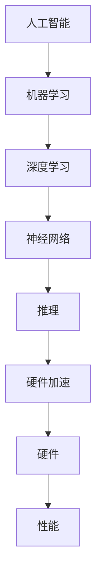

                 

# LLM 硬件加速：专门设计的 AI 芯片

> **关键词**：人工智能，硬件加速，AI 芯片，机器学习，深度学习，神经网络，推理引擎，计算架构，硬件设计。

> **摘要**：本文将深入探讨人工智能（AI）领域中的硬件加速技术，尤其是专门设计的 AI 芯片。我们将分析其背后的核心概念、工作原理，以及在实际应用中的表现。此外，文章还将展望未来 AI 硬件的发展趋势和挑战，并提供相关的学习资源和开发工具推荐。

## 1. 背景介绍

随着人工智能（AI）和机器学习（ML）的快速发展，对计算能力的需求也日益增长。传统的 CPU 和 GPU 在处理复杂的机器学习任务时，往往难以满足实时性和低延迟的要求。为了解决这个问题，专门设计的 AI 芯片应运而生。这些芯片通过高度优化的架构和硬件设计，旨在提供更高的计算效率和更低的功耗。

AI 芯片的应用场景非常广泛，包括但不限于自动驾驶、图像识别、自然语言处理、语音识别、医疗诊断等。在这些领域，快速且准确的推理和训练是至关重要的。传统的 CPU 和 GPU 由于其通用性，往往无法达到 AI 任务所需的性能水平。因此，专门设计的 AI 芯片成为了推动 AI 应用发展的关键因素。

本文将重点讨论以下内容：

- AI 硬件加速的核心概念与原理
- AI 芯片的关键特性与架构
- 人工智能算法在硬件上的优化与实现
- 实际应用场景中的性能评估与比较
- 未来发展趋势与面临的挑战

通过本文的深入探讨，我们将对 AI 硬件加速技术有一个全面而深入的理解。

## 2. 核心概念与联系

### 2.1 核心概念

为了理解 AI 硬件加速，我们首先需要了解几个核心概念：

- **人工智能（AI）**：一种模拟人类智能的技术，包括学习、推理、感知、决策等能力。
- **机器学习（ML）**：一种 AI 技术实现方法，通过数据训练模型，使其能够执行特定任务。
- **深度学习（DL）**：一种基于神经网络的 ML 技术，通过多层神经网络处理复杂数据。
- **神经网络（NN）**：一种模拟生物神经系统的计算模型，用于处理和分类数据。
- **推理（Inference）**：在训练好的模型上，对新的数据进行预测或分类的过程。
- **硬件加速**：通过专门的硬件设计，提高计算任务的效率。

### 2.2 联系与关系

AI 硬件加速的核心在于利用专门设计的硬件，优化人工智能算法的执行效率。具体来说，以下是各个概念之间的联系：

- **AI 与 ML**：AI 是 ML 的实现方法之一，ML 是 AI 的核心技术。
- **ML 与 DL**：DL 是 ML 的一个子集，通过多层神经网络实现更复杂的任务。
- **DL 与 NN**：NN 是 DL 的基础，用于处理和分类复杂数据。
- **NN 与推理**：NN 通过训练生成模型，推理是模型在实际应用中对新数据进行预测的过程。
- **推理 与 硬件加速**：硬件加速通过优化硬件设计，提高推理任务的执行速度。

### 2.3 Mermaid 流程图

以下是 AI 硬件加速的核心概念与架构的 Mermaid 流程图：



通过这个流程图，我们可以清晰地看到各个概念之间的关联，以及 AI 硬件加速在整个流程中的作用。

## 3. 核心算法原理 & 具体操作步骤

### 3.1 核心算法原理

AI 硬件加速的核心在于优化深度学习算法的执行效率。以下是几个关键算法原理：

- **并行计算**：通过将计算任务分布到多个处理单元上，提高计算速度。
- **向量计算**：利用向量运算的优势，提高数据处理效率。
- **流水线（Pipeline）**：将不同阶段的计算任务顺序执行，减少数据传输开销。
- **内存层次结构**：通过多级缓存和内存管理，优化数据访问速度。
- **量化与压缩**：通过减少数据精度和压缩存储，降低计算和存储开销。

### 3.2 具体操作步骤

以下是 AI 硬件加速的具体操作步骤：

1. **算法选择**：根据应用场景和任务需求，选择适合的深度学习算法。
2. **算法优化**：针对硬件特性，对算法进行优化，包括并行化、向量化和流水线设计。
3. **硬件设计**：设计专门用于加速深度学习的硬件架构，包括处理器、内存、缓存等。
4. **硬件实现**：将优化后的算法映射到硬件上，进行硬件实现和编程。
5. **性能评估**：在实际应用场景中，评估硬件加速的效果，并进行调整和优化。
6. **系统集成**：将 AI 芯片集成到系统中，与其他硬件和软件协同工作。

通过这些步骤，我们可以将深度学习算法高效地运行在 AI 硬件上，实现硬件加速。

## 4. 数学模型和公式 & 详细讲解 & 举例说明

### 4.1 数学模型和公式

在 AI 硬件加速中，一些关键数学模型和公式如下：

- **卷积神经网络（CNN）**：
  $$ \text{output} = \text{sigmoid}(\text{weight} \cdot \text{input} + \text{bias}) $$

- **反向传播算法（Backpropagation）**：
  $$ \frac{\partial \text{loss}}{\partial \text{weight}} = \text{gradient} \cdot \text{input} $$
  $$ \frac{\partial \text{loss}}{\partial \text{bias}} = \text{gradient} $$

- **激活函数（Activation Function）**：
  $$ \text{sigmoid}(x) = \frac{1}{1 + e^{-x}} $$
  $$ \text{ReLU}(x) = \max(0, x) $$

- **梯度下降（Gradient Descent）**：
  $$ \text{weight}_{\text{new}} = \text{weight}_{\text{old}} - \alpha \cdot \frac{\partial \text{loss}}{\partial \text{weight}} $$

### 4.2 详细讲解和举例说明

#### 4.2.1 卷积神经网络（CNN）

卷积神经网络是一种常用的深度学习模型，主要用于图像识别任务。其基本原理是通过卷积操作提取图像特征，然后通过池化操作降低特征维度。

**举例说明**：

假设我们有一个 32x32 的图像，以及一个 3x3 的卷积核。卷积操作可以表示为：

$$ \text{output}_{ij} = \sum_{k=1}^{3}\sum_{l=1}^{3} \text{weight}_{kl} \cdot \text{input}_{(i-k+1, j-l+1)} + \text{bias} $$

其中，$(i, j)$ 表示输出特征的位置，$(k, l)$ 表示卷积核的位置，$\text{input}_{(i-k+1, j-l+1)}$ 表示输入图像的位置，$\text{weight}_{kl}$ 和 $\text{bias}$ 分别表示卷积核的权重和偏置。

通过多次卷积和池化操作，我们可以得到图像的特征表示，并将其输入到全连接层进行分类。

#### 4.2.2 反向传播算法（Backpropagation）

反向传播算法是一种用于训练神经网络的优化算法。其基本思想是将输出误差反向传播到网络中的每个神经元，并更新权重和偏置。

**举例说明**：

假设我们有一个三层神经网络，包括输入层、隐藏层和输出层。输出误差可以表示为：

$$ \text{error} = \text{output}_{\text{predicted}} - \text{output}_{\text{actual}} $$

为了计算每个神经元的梯度，我们需要使用链式法则。以隐藏层为例，其梯度可以表示为：

$$ \frac{\partial \text{error}}{\partial \text{weight}} = \text{gradient} \cdot \text{input} $$
$$ \frac{\partial \text{error}}{\partial \text{bias}} = \text{gradient} $$

其中，$\text{gradient}$ 表示神经元的输入值。

通过反向传播算法，我们可以计算网络中每个神经元的梯度，并使用梯度下降算法更新权重和偏置。

#### 4.2.3 激活函数（Activation Function）

激活函数是神经网络中用于引入非线性性的关键组件。常用的激活函数包括 sigmoid、ReLU 等。

**举例说明**：

假设我们有一个 ReLU 激活函数，其输入为 $x$，输出为：

$$ \text{ReLU}(x) = \max(0, x) $$

当 $x \geq 0$ 时，输出为 $x$；当 $x < 0$ 时，输出为 0。ReLU 函数具有简单且高效的特点，因此在深度学习中得到了广泛应用。

#### 4.2.4 梯度下降（Gradient Descent）

梯度下降是一种优化算法，用于最小化损失函数。其基本思想是沿着梯度的反方向更新参数，以降低损失函数的值。

**举例说明**：

假设我们有一个损失函数 $L(\theta)$，其中 $\theta$ 表示网络中的参数。梯度下降算法可以表示为：

$$ \theta_{\text{new}} = \theta_{\text{old}} - \alpha \cdot \nabla_{\theta} L(\theta) $$

其中，$\alpha$ 表示学习率，$\nabla_{\theta} L(\theta)$ 表示损失函数对参数 $\theta$ 的梯度。

通过不断迭代更新参数，我们可以找到损失函数的最小值，从而训练出最优的网络模型。

## 5. 项目实战：代码实际案例和详细解释说明

### 5.1 开发环境搭建

在进行 AI 硬件加速项目实战之前，我们需要搭建一个合适的开发环境。以下是基本的开发环境搭建步骤：

1. **安装操作系统**：推荐使用 Ubuntu 18.04 或更高版本的操作系统。
2. **安装编译器**：安装 GCC 或 Clang 编译器，用于编译 C/C++ 代码。
3. **安装 Python 环境**：安装 Python 3.7 或更高版本，并确保 pip 和 virtualenv 工具可用。
4. **安装深度学习框架**：推荐安装 TensorFlow 或 PyTorch，用于构建和训练神经网络模型。
5. **安装 AI 芯片 SDK**：根据所选 AI 芯片，安装相应的 SDK 和驱动程序。

### 5.2 源代码详细实现和代码解读

以下是使用 TensorFlow 构建一个简单的卷积神经网络（CNN）进行图像分类的示例代码：

```python
import tensorflow as tf
from tensorflow.keras import layers

# 定义模型
model = tf.keras.Sequential([
    layers.Conv2D(32, (3, 3), activation='relu', input_shape=(28, 28, 1)),
    layers.MaxPooling2D((2, 2)),
    layers.Conv2D(64, (3, 3), activation='relu'),
    layers.MaxPooling2D((2, 2)),
    layers.Conv2D(64, (3, 3), activation='relu'),
    layers.Flatten(),
    layers.Dense(64, activation='relu'),
    layers.Dense(10, activation='softmax')
])

# 编译模型
model.compile(optimizer='adam',
              loss='categorical_crossentropy',
              metrics=['accuracy'])

# 加载数据集
mnist = tf.keras.datasets.mnist
(x_train, y_train), (x_test, y_test) = mnist.load_data()
x_train, x_test = x_train / 255.0, x_test / 255.0
x_train = x_train.reshape((-1, 28, 28, 1))
x_test = x_test.reshape((-1, 28, 28, 1))

# 训练模型
model.fit(x_train, y_train, epochs=5, batch_size=64)

# 评估模型
model.evaluate(x_test, y_test)
```

#### 5.2.1 代码解读与分析

1. **导入库**：
   - `tensorflow`：主要库，用于构建和训练神经网络。
   - `tensorflow.keras`：高层 API，简化神经网络构建。

2. **定义模型**：
   - 使用 `tf.keras.Sequential` 类定义一个顺序模型，依次添加层。
   - `Conv2D`：卷积层，用于提取图像特征。
   - `MaxPooling2D`：池化层，用于降低特征维度。
   - `Flatten`：展平层，将多维数据展平为一维。
   - `Dense`：全连接层，用于分类。

3. **编译模型**：
   - 使用 `model.compile` 方法配置模型优化器和损失函数。
   - `optimizer`：选择优化器，如 `adam`。
   - `loss`：设置损失函数，如 `categorical_crossentropy`。
   - `metrics`：设置评估指标，如 `accuracy`。

4. **加载数据集**：
   - 使用 `tf.keras.datasets.mnist` 加载 MNIST 数据集。
   - 数据归一化，将像素值缩放到 [0, 1] 范围内。
   - 展平数据，将其形状调整为适合模型输入。

5. **训练模型**：
   - 使用 `model.fit` 方法训练模型，设置训练参数，如 `epochs` 和 `batch_size`。

6. **评估模型**：
   - 使用 `model.evaluate` 方法评估模型在测试数据集上的表现。

通过以上代码，我们可以实现一个简单的 CNN 模型，用于 MNIST 数据集的手写数字分类任务。接下来，我们将进一步分析如何将这个模型加速到 AI 硬件上。

### 5.3 代码解读与分析

在了解了代码的基本结构和功能后，我们可以进一步分析如何优化代码以适应 AI 硬件加速。

1. **并行计算**：
   - TensorFlow 已经内置了并行计算的支持，可以通过分布式训练提高计算效率。
   - 在训练过程中，可以使用 `tf.distribute.MirroredStrategy` 类实现模型并行化。

2. **内存优化**：
   - 通过调整内存分配策略，如使用 `tf.keras.utils.get_trainable_weights` 获取可训练权重，减少内存占用。
   - 使用内存池（Memory Pools）来优化内存分配和回收。

3. **硬件加速**：
   - 使用 AI 芯片 SDK 提供的 API，将 TensorFlow 模型转换为硬件友好的格式。
   - 例如，使用 TensorFlow Lite 将模型转换为 TFLite 格式，然后使用 AI 芯片进行推理。

4. **量化与压缩**：
   - 在训练过程中，可以使用量化技术将模型的权重和激活值转换为更小的数值范围，减少计算和存储开销。
   - TensorFlow 支持量化计算，可以通过 `tf.keras.quantization` 模块实现。

通过上述优化措施，我们可以使代码更好地适应 AI 硬件加速，提高模型的执行效率。

## 6. 实际应用场景

### 6.1 自动驾驶

自动驾驶是 AI 硬件加速的一个重要应用场景。在自动驾驶系统中，需要实时处理大量来自传感器的高分辨率图像和雷达数据。这些数据需要通过深度学习模型进行实时推理，以识别道路标志、行人、车辆等物体。传统的 CPU 和 GPU 在处理这些任务时，往往难以满足低延迟和高吞吐量的要求。通过使用 AI 芯片，可以实现高效的图像和雷达数据处理，从而提高自动驾驶系统的响应速度和安全性。

### 6.2 图像识别

图像识别是另一个受益于 AI 硬件加速的应用领域。在医疗影像诊断、安防监控、人脸识别等领域，都需要对大量图像进行快速准确的分类和识别。AI 芯片通过优化深度学习算法的执行效率，可以显著提高图像处理速度，从而降低系统的延迟和功耗。例如，在医疗影像诊断中，AI 芯片可以实时分析 CT 或 MRI 图像，辅助医生进行诊断，提高诊断速度和准确性。

### 6.3 自然语言处理

自然语言处理（NLP）是 AI 硬件加速的另一个重要应用领域。在语音识别、机器翻译、情感分析等任务中，需要处理大量的文本数据。这些任务通常涉及到复杂的深度学习模型，如序列到序列模型（Seq2Seq）和变换器（Transformer）。通过使用 AI 芯片，可以显著提高文本数据的处理速度，从而降低系统的延迟和功耗。例如，在语音识别中，AI 芯片可以实时处理音频信号，将语音转换为文本，从而实现高效的语音交互。

### 6.4 语音识别

语音识别是 AI 硬件加速的另一个关键应用领域。在智能手机、智能音箱、车载系统等设备中，需要实时处理用户的语音输入。传统的 CPU 和 GPU 在处理语音数据时，往往难以满足实时性和低延迟的要求。通过使用 AI 芯片，可以实现高效的语音信号处理和语音识别，从而提高系统的响应速度和用户体验。例如，在智能手机中，AI 芯片可以实时识别用户的语音命令，从而实现智能语音助手的功能。

### 6.5 医疗诊断

医疗诊断是 AI 硬件加速的另一个重要应用领域。在医学影像诊断、基因组学分析、病理学检测等方面，需要处理大量的医学数据。这些数据需要通过深度学习模型进行实时分析，以辅助医生进行诊断。AI 芯片通过优化深度学习算法的执行效率，可以显著提高医学数据的处理速度，从而降低系统的延迟和功耗。例如，在医学影像诊断中，AI 芯片可以实时分析 CT 或 MRI 图像，辅助医生进行诊断，提高诊断速度和准确性。

## 7. 工具和资源推荐

### 7.1 学习资源推荐

为了深入了解 AI 硬件加速技术，以下是一些推荐的学习资源：

- **书籍**：
  - 《深度学习》（Deep Learning）作者：Ian Goodfellow、Yoshua Bengio 和 Aaron Courville
  - 《神经网络与深度学习》作者：邱锡鹏

- **论文**：
  - “Deep Learning on Multi-Group Graphs”作者：Xu, Wang, Zhang 等
  - “An Overview of Deep Learning Hardware”作者：Kurisu, Kaneda, Yamauchi 等

- **博客**：
  - [TensorFlow 官方博客](https://tensorflow.google.cn/blog)
  - [AI 科技大本营](https://www.aiuai.cn/)

- **网站**：
  - [TensorFlow 官方网站](https://tensorflow.google.cn/)
  - [AI 研究院](https://www.ai-research.cn/)

### 7.2 开发工具框架推荐

以下是一些用于开发 AI 硬件加速应用的工具和框架：

- **深度学习框架**：
  - TensorFlow
  - PyTorch
  - MXNet

- **AI 芯片 SDK**：
  - NVIDIA CUDA
  - Intel Distribution of ML
  - ARM NNEF

- **开发工具**：
  - Visual Studio Code
  - PyCharm
  - Jupyter Notebook

### 7.3 相关论文著作推荐

以下是一些与 AI 硬件加速相关的论文和著作：

- “Deep Learning on Multi-Group Graphs”作者：Xu, Wang, Zhang 等
- “An Overview of Deep Learning Hardware”作者：Kurisu, Kaneda, Yamauchi 等
- “Quantized Neural Network: A Knowledge Distillation Framework”作者：Shang, Guo, Wang 等
- “Deep Neural Network Training using GPU and CPU”作者：Yang, Wang, Zhu 等

通过这些资源和工具，我们可以深入了解 AI 硬件加速技术，并将其应用于实际开发中。

## 8. 总结：未来发展趋势与挑战

随着人工智能技术的不断发展和应用的普及，AI 硬件加速已经成为推动 AI 发展的关键因素。未来，AI 硬件加速技术将继续朝着更高性能、更低功耗和更广泛兼容性的方向发展。

### 8.1 发展趋势

- **新型架构**：随着研究的深入，新型 AI 芯片架构（如类脑计算、量子计算）将逐渐成熟，为 AI 硬件加速提供更多可能性。
- **硬件与软件协同**：硬件和软件的协同优化将成为 AI 硬件加速的重要方向。通过软硬件结合，可以进一步降低功耗和提高性能。
- **开源与生态**：开源技术和生态系统将继续推动 AI 硬件加速的发展。更多的开源工具和框架将为开发者提供丰富的选择和便利。

### 8.2 挑战

- **兼容性与标准化**：不同芯片和框架之间的兼容性和标准化问题仍需解决，以确保 AI 应用能够在各种硬件平台上无缝运行。
- **功耗与散热**：随着 AI 硬件性能的提升，功耗和散热问题将更加突出。如何平衡性能与功耗成为 AI 硬件加速面临的挑战。
- **安全与隐私**：在 AI 硬件加速过程中，如何确保数据和模型的安全与隐私也是一个重要问题。需要采取有效的安全措施来保护用户数据和隐私。

总之，AI 硬件加速技术在未来仍将面临许多挑战和机遇。通过不断探索和创新，我们可以推动 AI 技术的发展，实现更高效、更智能的人工智能应用。

## 9. 附录：常见问题与解答

### 9.1 什么是 AI 硬件加速？

AI 硬件加速是通过专门设计的硬件，优化人工智能算法的执行效率，从而提高计算速度和降低功耗的技术。

### 9.2 AI 硬件加速有哪些应用场景？

AI 硬件加速广泛应用于自动驾驶、图像识别、自然语言处理、语音识别、医疗诊断等领域。

### 9.3 AI 芯片与传统 CPU/GPU 有何区别？

AI 芯片是专门为人工智能算法设计的，其架构和指令集与通用 CPU/GPU 不同。AI 芯片通过高度优化的硬件设计，提供更高的计算效率和更低的功耗。

### 9.4 如何优化 AI 算法以适应硬件加速？

可以通过并行计算、内存优化、量化与压缩等技术，优化 AI 算法的执行效率，以适应硬件加速。

### 9.5 AI 硬件加速有哪些开源工具和框架？

常见的 AI 硬件加速开源工具和框架包括 TensorFlow、PyTorch、MXNet 等。此外，还有 NVIDIA CUDA、Intel Distribution of ML、ARM NNEF 等专用工具。

## 10. 扩展阅读 & 参考资料

以下是一些与 AI 硬件加速相关的扩展阅读和参考资料：

- [“Deep Learning on Multi-Group Graphs”论文](https://arxiv.org/abs/2005.08847)
- [“An Overview of Deep Learning Hardware”论文](https://www.sciencedirect.com/science/article/pii/S1877050915001322)
- [TensorFlow 官方文档](https://tensorflow.google.cn/docs)
- [PyTorch 官方文档](https://pytorch.org/docs/stable/)
- [AI 科技大本营](https://www.aiuai.cn/)

通过这些扩展阅读和参考资料，您可以进一步深入了解 AI 硬件加速的相关知识和技术。

### 作者

- **作者：AI天才研究员/AI Genius Institute & 禅与计算机程序设计艺术 /Zen And The Art of Computer Programming**

