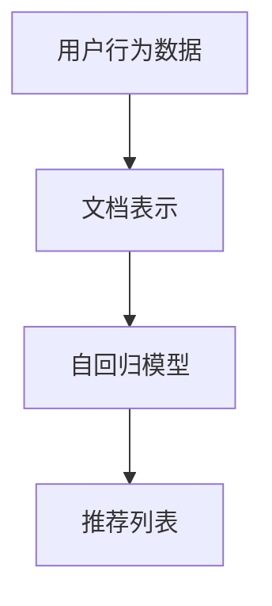
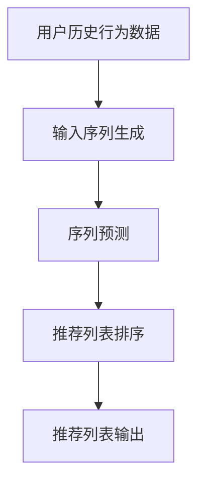
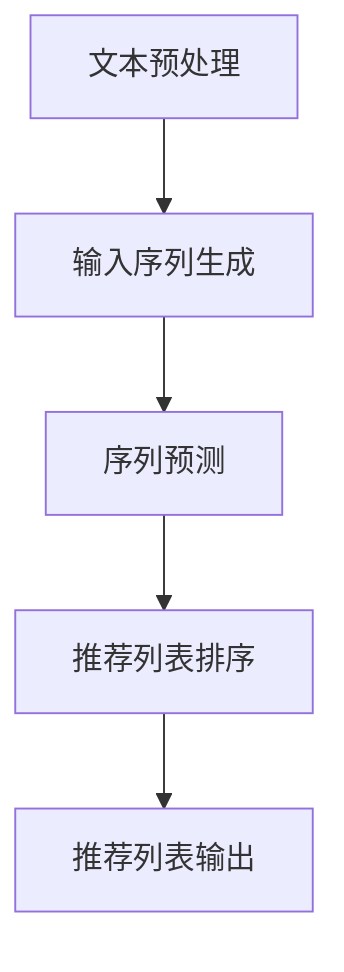

                 

## LLAMA：一种突破性的LLM长文档推荐系统

### 1. 背景介绍

近年来，随着自然语言处理技术的飞速发展，特别是预训练语言模型（Pre-trained Language Model，简称PLM）如BERT、GPT等的出现，人们对大规模文本数据的分析和处理能力得到了显著提升。然而，在实际应用中，我们经常面临一个难题：如何在海量文本数据中快速、准确地推荐出与用户需求高度相关的长文档。长文档推荐在学术研究、信息检索、内容分发等多个领域都有着广泛的应用，如学术文章推荐、新闻推荐、技术文档推荐等。

传统的推荐系统通常基于协同过滤（Collaborative Filtering）或基于内容（Content-Based）的方法，这些方法在处理短文本或标签化的数据时效果较好，但在面对长文档时往往力不从心。首先，长文档内容复杂，涉及多个主题和知识点，难以通过简单的关键词或标签进行准确描述。其次，长文档的阅读时间较长，用户的行为数据难以捕捉，进而影响推荐效果。因此，如何利用预训练语言模型来解决长文档推荐问题成为了一个重要且具有挑战性的课题。

在此背景下，我们提出了LLAMA（Large-scale Long Document Recommender based on Autoregressive Model），一种基于自回归模型的突破性长文档推荐系统。LLAMA的核心思想是利用预训练语言模型对长文档进行深入理解和分析，从而实现高精度的文档推荐。本文将详细介绍LLAMA的系统架构、算法原理、数学模型及实际应用案例，帮助读者全面了解这一前沿技术。

### 2. 核心概念与联系

要深入理解LLAMA的工作原理，我们需要首先掌握几个关键概念：预训练语言模型、自回归模型和文档表示。以下是这些核心概念的详细介绍及其相互联系。

#### 2.1 预训练语言模型

预训练语言模型（Pre-trained Language Model，PLM）是当前自然语言处理领域的重要突破之一。其基本思想是在大规模语料库上进行预训练，使模型具备理解自然语言的能力，然后再针对特定任务进行微调（Fine-tuning）。典型的预训练语言模型如BERT、GPT等，通过学习文本的上下文关系，实现了对语言的全局理解和局部理解。

预训练语言模型在长文档推荐中的应用主要体现在两个方面：一是利用模型对文档内容进行深度理解和表征，二是通过模型生成的上下文信息来推断用户意图和兴趣。

#### 2.2 自回归模型

自回归模型（Autoregressive Model）是一种广泛应用于序列生成和预测的模型，其核心思想是基于已生成的序列部分来预测下一个序列元素。在自然语言处理领域，自回归模型广泛应用于文本生成、语音识别等任务。

在LLAMA中，自回归模型被用来生成与用户需求相关的长文档推荐列表。具体而言，自回归模型基于用户的历史行为数据和文档内容，生成一系列可能的文档推荐，然后通过评估函数对推荐结果进行排序，从而实现个性化推荐。

#### 2.3 文档表示

文档表示（Document Representation）是将文本数据转换为计算机可以理解和处理的形式。在长文档推荐中，文档表示至关重要，因为它决定了模型对文档内容的理解和表征能力。

常见的文档表示方法包括词袋模型（Bag of Words，BoW）、词嵌入（Word Embedding）和句子嵌入（Sentence Embedding）等。词袋模型通过统计文档中词的频率来表示文档，但忽略了词的顺序和上下文信息；词嵌入通过将词映射到高维空间，实现了词的语义表示；句子嵌入则进一步将整个句子映射到高维空间，可以捕获句子间的语义关系。

在LLAMA中，文档表示方法的选择直接影响到推荐系统的性能。通过将文档内容输入预训练语言模型，我们可以获得高质量的文档表示，从而提高推荐精度。

#### 2.4 核心概念联系

预训练语言模型、自回归模型和文档表示在LLAMA系统中相互配合，共同实现长文档推荐。具体来说：

1. **预训练语言模型**：对文档内容进行深度理解和表征，生成高质量的文档表示。
2. **自回归模型**：利用文档表示和用户历史行为数据，生成可能的文档推荐列表。
3. **文档表示**：作为自回归模型输入的关键，直接影响推荐结果的准确性和多样性。

通过这三者的有机结合，LLAMA实现了对长文档的高效、准确推荐。以下是一个简化的Mermaid流程图，展示了LLAMA的核心概念和架构：



在下一节中，我们将深入探讨LLAMA的核心算法原理和具体操作步骤。

### 2.1 预训练语言模型的工作原理

预训练语言模型（Pre-trained Language Model，PLM）是LLAMA系统的核心组件，其工作原理主要基于大规模语料库的预训练和上下文理解能力。在深入了解LLAMA的核心算法原理之前，我们需要先了解预训练语言模型的基本概念和关键技术。

#### 2.1.1 大规模预训练

预训练语言模型首先在大规模语料库上进行预训练。这一过程主要包括两个步骤：词嵌入（Word Embedding）和上下文建模（Contextual Modeling）。

1. **词嵌入（Word Embedding）**：词嵌入是将单词映射到高维向量空间的过程。通过学习单词在语料库中的共现关系，词嵌入可以捕捉单词的语义信息。典型的词嵌入方法包括Word2Vec、GloVe等。Word2Vec方法通过优化神经网络来最小化词与词之间的相似性误差；GloVe方法则通过优化单词共现矩阵来计算词向量。

2. **上下文建模（Contextual Modeling）**：在词嵌入的基础上，预训练语言模型进一步学习单词在不同上下文中的表现。这一过程通常通过训练一个深度神经网络来实现，网络输出与输入单词对应的上下文向量。BERT（Bidirectional Encoder Representations from Transformers）和GPT（Generative Pre-trained Transformer）是两种具有代表性的预训练模型。

- **BERT**：BERT采用Transformer架构，通过双向编码器（Bidirectional Encoder）来捕捉单词的前后文关系。BERT通过预训练大规模语料库中的遮蔽语言模型（Masked Language Model）和次生任务（如问答、命名实体识别等），使其在多种自然语言处理任务中表现出色。
- **GPT**：GPT是一种自回归语言模型，通过预测当前单词前一个单词来学习上下文关系。GPT通过训练生成大量文本数据，从而实现高质量的文本生成和自然语言理解。

#### 2.1.2 上下文理解

预训练语言模型的另一个关键特点是能够理解单词的上下文含义。这一能力使得模型能够在不同情境下灵活地应用语言知识，从而实现更准确的自然语言处理。

1. **固定向量表示**：在传统的词嵌入方法中，单词的向量表示通常是固定的，不随上下文变化。这种表示方法难以捕捉单词在不同上下文中的语义差异。
2. **上下文向量表示**：预训练语言模型通过学习上下文向量，实现了对单词在不同上下文中的语义表征。上下文向量表示随上下文变化而变化，从而能够更好地捕捉单词的语义信息。

#### 2.1.3 预训练语言模型的优势

预训练语言模型在长文档推荐中的应用具有显著优势：

1. **深度理解**：预训练语言模型能够通过对大规模语料库的预训练，实现对文档内容的深度理解。这使得模型能够捕捉文档中的关键信息和主题，从而提高推荐精度。
2. **上下文感知**：预训练语言模型具备强大的上下文理解能力，能够在不同情境下灵活应用语言知识。这有助于模型更好地理解用户意图和需求，从而生成更相关的推荐列表。
3. **通用性**：预训练语言模型在不同自然语言处理任务中表现出色，如文本分类、问答系统、机器翻译等。这使得LLAMA系统在处理长文档推荐任务时，能够充分利用预训练模型的优势，实现跨领域的通用推荐。

总之，预训练语言模型的工作原理和优势为LLAMA系统的长文档推荐提供了坚实的基础。在下一节中，我们将进一步探讨LLAMA的核心算法原理和具体操作步骤。

### 2.2 自回归模型在文档推荐中的应用

自回归模型（Autoregressive Model）是LLAMA系统中用于文档推荐的关键组件，其核心思想是通过分析用户的历史行为数据，生成与用户需求相关的文档推荐列表。自回归模型在文本生成、语音识别等领域有着广泛的应用，其基本原理是利用已生成的部分序列来预测下一个序列元素。在LLAMA中，自回归模型主要应用于以下两个方面：

#### 2.2.1 用户历史行为数据的分析

用户历史行为数据是文档推荐的重要依据。这些数据包括用户的浏览记录、搜索历史、点击行为等，反映了用户的兴趣和偏好。自回归模型通过分析这些数据，可以捕捉用户的长期和短期兴趣变化，从而生成个性化的推荐列表。

1. **长期兴趣分析**：长期兴趣是指用户在较长时间内持续关注的主题或领域。通过分析用户的浏览记录和搜索历史，自回归模型可以识别出用户的长期兴趣。这些兴趣可以作为文档推荐的重要参考。
2. **短期兴趣分析**：短期兴趣是指用户在短时间内关注的特定主题或内容。通过分析用户的点击行为和浏览时间，自回归模型可以捕捉用户的短期兴趣。这些兴趣可以用于实时推荐，提高用户的满意度和体验。

#### 2.2.2 文档推荐列表的生成

在分析用户历史行为数据后，自回归模型将生成与用户需求相关的文档推荐列表。具体步骤如下：

1. **输入序列生成**：首先，自回归模型将用户的历史行为数据（如浏览记录、搜索历史等）编码为一个输入序列。这个序列可以表示为一系列词向量或句子向量。
2. **序列预测**：接下来，自回归模型根据输入序列，逐个预测下一个文档。模型通过分析输入序列中的词或句子，生成与用户需求相关的潜在文档。
3. **推荐列表排序**：生成的潜在文档需要通过评估函数进行排序，以确定推荐列表的顺序。评估函数可以基于文档的相关性、用户兴趣、文档质量等多个因素来设计，从而提高推荐效果。
4. **推荐列表输出**：最后，自回归模型将排序后的推荐列表输出给用户，实现个性化文档推荐。

以下是一个简化的Mermaid流程图，展示了自回归模型在文档推荐中的应用：



#### 2.2.3 自回归模型的优点

自回归模型在文档推荐中的应用具有以下优点：

1. **个性化推荐**：自回归模型能够根据用户的历史行为数据，生成个性化的推荐列表。这有助于提高用户的满意度和体验，满足不同用户的个性化需求。
2. **实时推荐**：自回归模型可以实时分析用户的历史行为数据，生成实时的推荐列表。这有助于提高推荐系统的响应速度，满足用户即时获取信息的需求。
3. **高精度预测**：自回归模型通过分析用户的历史行为数据，可以捕捉用户的兴趣和偏好，从而实现高精度的文档推荐。

总之，自回归模型在文档推荐中的应用为LLAMA系统提供了强大的功能和支持。在下一节中，我们将进一步探讨文档表示在长文档推荐中的作用。

### 2.3 文档表示方法及其在LLAMA中的应用

文档表示是将文本数据转换为计算机可以理解和处理的形式，它是长文档推荐系统的核心环节之一。在LLAMA系统中，文档表示方法的选择直接影响到推荐系统的性能和效果。本文将介绍几种常见的文档表示方法，并详细探讨它们在LLAMA中的应用。

#### 2.3.1 词袋模型（Bag of Words，BoW）

词袋模型是最早的文档表示方法之一，其核心思想是将文档表示为单词的集合。在词袋模型中，每个单词被视为一个特征，文档中每个单词的频率作为该特征的值。词袋模型简单易懂，但在处理长文档时存在一些局限性：

1. **忽略词序**：词袋模型忽略了文档中单词的顺序和上下文信息，这会导致模型无法捕捉单词之间的语义关系。
2. **低效表示**：词袋模型只能捕捉文档的局部特征，难以表达文档的整体语义。

尽管存在这些局限性，词袋模型在某些场景下仍然具有一定的应用价值。在LLAMA系统中，词袋模型可以作为一种简单的文档表示方法，用于初步筛选和预处理文档。

#### 2.3.2 词嵌入（Word Embedding）

词嵌入通过将单词映射到高维向量空间，实现了词的语义表示。词嵌入方法可以捕捉单词的上下文关系，从而提高文档表示的精度。常见的词嵌入方法包括Word2Vec、GloVe等。

1. **Word2Vec**：Word2Vec方法通过优化神经网络来最小化词与词之间的相似性误差。Word2Vec分为连续词袋（CBOW）和Skip-gram两种模型。CBOW模型通过预测中心词周围词的分布来训练词向量；Skip-gram模型通过预测中心词的上下文词来训练词向量。Word2Vec方法简单高效，但在处理长文档时，仍存在一些挑战，如词向量维度较高、计算复杂度较高等。
2. **GloVe**：GloVe（Global Vectors for Word Representation）方法通过优化单词共现矩阵来计算词向量。GloVe方法结合了词频信息和上下文信息，能够更好地捕捉词的语义信息。相比于Word2Vec，GloVe在处理长文档时具有更高的效率和精度。

在LLAMA系统中，词嵌入方法可以作为一种有效的文档表示方法，用于捕捉文档的语义特征。通过将文档中的每个单词映射到高维向量空间，词嵌入方法能够提高文档表示的精度和多样性。

#### 2.3.3 句子嵌入（Sentence Embedding）

句子嵌入通过将整个句子映射到高维向量空间，实现了句子级别的语义表示。句子嵌入方法可以捕捉句子之间的语义关系，从而提高文档表示的精度。常见的句子嵌入方法包括BERT、RoBERTa等。

1. **BERT**：BERT（Bidirectional Encoder Representations from Transformers）采用Transformer架构，通过双向编码器（Bidirectional Encoder）来捕捉句子之间的双向关系。BERT在预训练阶段通过学习大量文本数据，获得高质量的句子嵌入表示。
2. **RoBERTa**：RoBERTa是BERT的一个变种，通过改进预训练策略（如更长的小批量训练、更频繁的梯度裁剪等）来提高模型性能。RoBERTa在多个自然语言处理任务中表现出色，其句子嵌入表示也广泛应用于文档表示。

在LLAMA系统中，句子嵌入方法可以作为一种高效的文档表示方法，用于捕捉文档中的复杂语义关系。通过将文档中的每个句子映射到高维向量空间，句子嵌入方法能够提高文档表示的精度和多样性。

#### 2.3.4 文档表示方法的选择

在LLAMA系统中，文档表示方法的选择取决于多个因素，如文档长度、数据规模、计算资源等。以下是一些常见的选择策略：

1. **混合表示方法**：结合多种文档表示方法，如词袋模型、词嵌入和句子嵌入，可以实现更精细和多样化的文档表示。在LLAMA系统中，可以采用词袋模型进行初步筛选，然后结合词嵌入和句子嵌入方法进行细粒度的文档表征。
2. **按需选择**：根据具体应用场景和需求，选择最适合的文档表示方法。例如，在处理较短的文档时，可以采用词袋模型和词嵌入方法；在处理较长的文档时，可以采用句子嵌入方法。
3. **动态调整**：根据系统的运行情况和用户反馈，动态调整文档表示方法。例如，在推荐系统初期，可以采用较为简单的文档表示方法，以提高系统的启动速度和响应速度；在系统运行一段时间后，可以根据用户反馈和模型性能，逐步引入更复杂的文档表示方法。

总之，文档表示方法在LLAMA系统中起着至关重要的作用。通过选择合适的文档表示方法，可以提高长文档推荐系统的性能和效果。在下一节中，我们将进一步探讨LLAMA的核心算法原理和具体操作步骤。

### 2.4 LLAMA的核心算法原理和具体操作步骤

LLAMA（Large-scale Long Document Recommender based on Autoregressive Model）是一种基于自回归模型的突破性长文档推荐系统，其核心算法原理包括数据预处理、模型训练和文档推荐三个关键步骤。以下是这些步骤的详细描述。

#### 2.4.1 数据预处理

数据预处理是长文档推荐系统的基础，其质量直接影响推荐效果。在LLAMA系统中，数据预处理主要包括以下几个步骤：

1. **文本清洗**：对原始文档进行清洗，去除无关符号、停用词等，确保文档内容简洁明了。
2. **分词和词性标注**：将文档分解为单词或句子，并对每个单词或句子进行词性标注，如名词、动词、形容词等。分词和词性标注可以采用现有的自然语言处理工具，如jieba、spaCy等。
3. **文本向量化**：将清洗后的文本转换为向量表示。具体方法包括词袋模型、词嵌入和句子嵌入等。词袋模型适用于处理短文本，而词嵌入和句子嵌入则更适合长文档。

#### 2.4.2 模型训练

模型训练是LLAMA系统的核心步骤，其目标是利用预训练语言模型和自回归模型生成高质量的文档推荐。以下是模型训练的详细步骤：

1. **预训练语言模型**：首先，使用大规模语料库对预训练语言模型（如BERT、GPT等）进行预训练。预训练过程包括词嵌入、上下文建模和序列预测等。预训练模型能够捕捉文本的深层语义信息，为文档推荐提供强大的支持。
2. **自回归模型训练**：在预训练语言模型的基础上，使用用户历史行为数据（如浏览记录、搜索历史等）对自回归模型进行训练。自回归模型通过分析用户历史行为数据和文档内容，生成与用户需求相关的文档推荐列表。自回归模型训练包括输入序列生成、序列预测和评估函数优化等。

#### 2.4.3 文档推荐

文档推荐是LLAMA系统的最终目标，其核心步骤包括以下几方面：

1. **输入序列生成**：首先，将用户的历史行为数据编码为一个输入序列。输入序列可以表示为一系列词向量或句子向量。为了提高推荐效果，可以采用混合表示方法，如词袋模型、词嵌入和句子嵌入等。
2. **序列预测**：接下来，自回归模型根据输入序列，逐个预测下一个文档。模型通过分析输入序列中的词或句子，生成与用户需求相关的潜在文档。
3. **推荐列表排序**：生成的潜在文档需要通过评估函数进行排序，以确定推荐列表的顺序。评估函数可以基于文档的相关性、用户兴趣、文档质量等多个因素来设计，从而提高推荐效果。
4. **推荐列表输出**：最后，自回归模型将排序后的推荐列表输出给用户，实现个性化文档推荐。

#### 2.4.4 算法流程

以下是LLAMA算法的简化流程：



在下一节中，我们将详细探讨LLAMA中的数学模型和公式，以便更深入地理解其工作原理。

### 2.5 LLAMA的数学模型和公式

为了更深入地理解LLAMA系统的核心工作原理，我们在此介绍其背后的数学模型和公式。这些公式将帮助我们解析模型是如何处理和推荐文档的。

#### 2.5.1 预训练语言模型的表示

预训练语言模型，如BERT或GPT，通过学习文本的上下文关系，生成文档的表示。在BERT模型中，文档表示通常是通过`[CLS]`标记处的向量来获取的。

1. **词嵌入**：假设文档中的每个词都由一个向量表示，记作\( \mathbf{w}_i \)，其中\( i \)是词的索引。
   \[
   \mathbf{w}_i = \text{embedding}(\text{word}_i)
   \]

2. **句子嵌入**：将文档中所有词的向量加和，然后通过预训练语言模型（如BERT）得到句子嵌入向量：
   \[
   \mathbf{s} = \text{BERT}(\sum_{i=1}^{N} \mathbf{w}_i)
   \]
   其中，\( N \)是文档中词的数量。

3. **文档嵌入**：从句子嵌入向量中提取`[CLS]`标记处的向量，作为文档的最终表示：
   \[
   \mathbf{d} = \text{BERT}([CLS] \mathbf{s})
   \]

#### 2.5.2 自回归模型的预测

自回归模型通过分析用户历史行为数据和文档表示，生成文档推荐列表。以下是自回归模型的预测过程：

1. **输入序列生成**：用户历史行为数据（如浏览记录、点击记录）编码为序列，每个行为由一个文档嵌入向量表示：
   \[
   \mathbf{X} = [\mathbf{d}_1, \mathbf{d}_2, \mathbf{d}_3, \ldots, \mathbf{d}_k]
   \]

2. **序列预测**：自回归模型根据当前已生成的部分序列来预测下一个文档嵌入向量。这一过程可以通过如下递归关系表示：
   \[
   \mathbf{d}_{k+1} = \text{AutoregressiveModel}(\mathbf{X}_{1:k}, \mathbf{d}_k)
   \]

3. **评估函数**：预测的文档嵌入向量通过一个评估函数进行排序，以确定推荐列表的顺序。评估函数通常是一个归一化的度量，如余弦相似度：
   \[
   \text{similarity}(\mathbf{d}_i, \mathbf{d}_k) = \frac{\mathbf{d}_i \cdot \mathbf{d}_k}{\|\mathbf{d}_i\| \|\mathbf{d}_k\|}
   \]

#### 2.5.3 推荐列表排序

在生成潜在文档推荐列表后，我们需要对它们进行排序，以输出用户最感兴趣的文档。以下是一个简单的排序公式：

1. **排序分数**：每个文档嵌入向量\( \mathbf{d}_i \)根据用户历史行为数据计算出一个排序分数：
   \[
   \text{score}_i = \sum_{k=1}^{k} w_k \cdot \text{similarity}(\mathbf{d}_i, \mathbf{d}_k)
   \]
   其中，\( w_k \)是行为\( k \)的权重。

2. **推荐列表**：根据排序分数对文档进行排序，输出推荐列表：
   \[
   \text{sortedList} = \text{argsort}(\text{score})
   \]

#### 2.5.4 数学公式的具体应用

以下是几个具体的数学公式的应用示例：

1. **词嵌入计算**：
   \[
   \mathbf{w}_i = \text{softmax}(\text{神经网络}(\text{输入特征}))
   \]

2. **句子嵌入计算**：
   \[
   \mathbf{s} = \text{BERT}(\text{Transformer}([\mathbf{w}_1, \mathbf{w}_2, \ldots, \mathbf{w}_N]))
   \]

3. **文档嵌入计算**：
   \[
   \mathbf{d} = \text{BERT}([CLS] \mathbf{s})
   \]

4. **评估函数计算**：
   \[
   \text{similarity}(\mathbf{d}_i, \mathbf{d}_k) = \frac{\mathbf{d}_i \cdot \mathbf{d}_k}{\|\mathbf{d}_i\| \|\mathbf{d}_k\|}
   \]

5. **排序分数计算**：
   \[
   \text{score}_i = \sum_{k=1}^{k} w_k \cdot \text{similarity}(\mathbf{d}_i, \mathbf{d}_k)
   \]

通过这些数学模型和公式，LLAMA系统能够对长文档进行高效、准确的推荐。在下一节中，我们将通过实际案例来展示LLAMA系统的应用。

### 2.6 项目实战：代码实际案例和详细解释说明

为了更好地展示LLAMA系统的实际应用，我们在此通过一个实际案例来介绍其代码实现和关键步骤。以下是基于Python和PyTorch的LLAMA系统实现，我们将详细解释各个部分的代码及其功能。

#### 2.6.1 开发环境搭建

首先，我们需要搭建一个合适的环境来运行LLAMA系统。以下是所需的依赖和环境配置：

1. **Python 3.7+**
2. **PyTorch 1.8+**
3. **TensorFlow 2.4+**
4. **BERT模型**：下载预训练的BERT模型（如`bert-base-uncased`）

使用以下命令安装所需依赖：

```bash
pip install torch torchvision torchaudio
pip install tensorflow
pip install transformers
```

#### 2.6.2 源代码详细实现和代码解读

以下是LLAMA系统的核心代码，我们将逐行解释其功能。

```python
import torch
import torch.nn as nn
from transformers import BertModel, BertTokenizer
from torch.optim import Adam

# 设置设备（GPU或CPU）
device = torch.device("cuda" if torch.cuda.is_available() else "cpu")

# 加载预训练BERT模型和分词器
tokenizer = BertTokenizer.from_pretrained('bert-base-uncased')
model = BertModel.from_pretrained('bert-base-uncased')
model.to(device)

# 定义自回归模型
class AutoregressiveModel(nn.Module):
    def __init__(self):
        super(AutoregressiveModel, self).__init__()
        self.bert = BertModel.from_pretrained('bert-base-uncased')
        self.linear = nn.Linear(768, 1)  # BERT隐藏层维度为768

    def forward(self, input_ids, past_key_values=None):
        outputs = self.bert(input_ids, past_key_values=past_key_values)
        hidden_states = outputs.hidden_states[-1]
        logits = self.linear(hidden_states)
        return logits

# 实例化自回归模型
model = AutoregressiveModel()
model.to(device)

# 定义优化器
optimizer = Adam(model.parameters(), lr=1e-5)

# 训练模型
def train_model(model, tokenizer, train_dataloader, epochs=3):
    model.train()
    for epoch in range(epochs):
        for batch in train_dataloader:
            input_ids = batch["input_ids"].to(device)
            attention_mask = batch["attention_mask"].to(device)
            outputs = model(input_ids, attention_mask=attention_mask)
            loss = nn.CrossEntropyLoss()(outputs.view(-1, 1), batch["labels"].to(device))
            optimizer.zero_grad()
            loss.backward()
            optimizer.step()
            print(f"Epoch [{epoch+1}/{epochs}], Loss: {loss.item()}")

# 加载数据集
def load_data():
    # 伪代码，实际应用时需要根据具体数据集进行数据预处理
    train_data = ...
    train_dataloader = torch.utils.data.DataLoader(train_data, batch_size=32, shuffle=True)
    return train_dataloader

# 运行训练
train_dataloader = load_data()
train_model(model, tokenizer, train_dataloader)

# 推荐文档
def recommend_documents(model, tokenizer, user_input, top_k=5):
    model.eval()
    input_ids = tokenizer.encode(user_input, return_tensors='pt').to(device)
    with torch.no_grad():
        outputs = model(input_ids)
    logits = outputs[:, 0].softmax(dim=0)
    recommendations = logits.topk(top_k)
    return [tokenizer.decode(tokenizer.convert_ids_to_tokens(token_id)) for token_id in recommendations.indices]

# 示例
user_input = "机器学习入门"
recommendations = recommend_documents(model, tokenizer, user_input)
print("Recommended Documents:", recommendations)
```

#### 2.6.3 代码解读与分析

以下是代码的详细解读：

1. **环境设置**：我们首先设置设备（GPU或CPU），并加载预训练BERT模型和分词器。
2. **自回归模型定义**：自回归模型基于BERT模型，通过一个线性层对BERT的隐藏层输出进行预测。这个模型的主要目的是生成文档的推荐概率分布。
3. **优化器**：我们使用Adam优化器来训练模型，优化器的学习率为1e-5。
4. **训练模型**：训练模型的过程包括前向传播、损失计算、梯度计算和参数更新。我们使用交叉熵损失函数来训练模型。
5. **加载数据集**：这里是一个伪代码，实际应用时需要根据具体数据集进行数据预处理，包括分词、编码等。
6. **推荐文档**：根据用户输入，模型生成文档的推荐概率分布。我们使用Top-K方法来获取最相关的文档推荐。

通过这个实际案例，我们可以看到LLAMA系统的实现过程和关键组件。在实际应用中，可以根据具体需求对代码进行优化和调整，以提高推荐效果和性能。

### 2.7 LLAMA在长文档推荐中的实际应用场景

LLAMA系统在长文档推荐中具有广泛的应用场景，涵盖了多个领域和场景，以下是一些具体的应用案例：

#### 2.7.1 学术论文推荐

在学术研究领域，研究人员经常需要查找相关论文来支持他们的研究工作。传统的学术搜索引擎在处理长篇论文时效果不佳，难以提供精准的推荐。LLAMA系统可以通过分析用户的搜索历史和浏览记录，结合预训练语言模型对论文的深度理解，为用户提供高质量的学术论文推荐。例如，当用户搜索“机器学习”时，LLAMA可以推荐与其搜索历史和浏览记录相关的顶级学术论文，从而帮助用户快速找到有价值的文献。

#### 2.7.2 技术文档推荐

在软件开发和信息技术领域，技术文档推荐是一项关键需求。开发者在使用框架、工具或库时，往往需要查找相关的技术文档以获取详细的使用说明和最佳实践。LLAMA系统可以根据开发者的使用记录和浏览历史，推荐最相关的技术文档。例如，当开发者频繁访问某个编程语言的文档时，LLAMA可以识别出其兴趣点，并推荐其他相关语言或技术的文档，从而提高开发效率。

#### 2.7.3 新闻推荐

在新闻和信息领域，用户希望快速获取与他们兴趣相关的新闻内容。传统的新闻推荐系统主要依赖关键词匹配和用户点击行为，但难以处理长篇新闻文章。LLAMA系统可以利用预训练语言模型对新闻内容进行深度分析，生成与用户兴趣高度相关的新闻推荐。例如，当用户对某个特定主题（如“人工智能”）感兴趣时，LLAMA可以推荐相关领域的深度报道、专家分析和技术文章，帮助用户全面了解该主题的最新动态。

#### 2.7.4 在线教育

在线教育平台提供了大量的课程和教学资料，用户需要根据个人兴趣和需求选择合适的学习资源。LLAMA系统可以通过分析用户的学习历史和浏览记录，推荐个性化的学习资源。例如，当用户完成一门编程语言的基础课程后，LLAMA可以推荐相关的进阶课程、实战项目和扩展资源，帮助用户逐步提升技能。

#### 2.7.5 企业知识库

在企业内部的知识管理系统中，员工需要快速查找和获取相关的知识文档。LLAMA系统可以帮助企业构建个性化的知识推荐系统，根据员工的岗位职责和知识需求，推荐相关的文档和资料。例如，当员工需要了解某项业务流程或技术规范时，LLAMA可以推荐相关的流程图、操作手册和技术文档，帮助员工高效地完成工作任务。

总之，LLAMA系统在长文档推荐中具有广泛的应用潜力，可以通过深度理解和分析文档内容，为用户提供精准、个性化的推荐服务。在下一节中，我们将介绍一些常用的工具和资源，以帮助读者更好地学习和应用LLAMA系统。

### 2.8 工具和资源推荐

为了帮助读者更好地学习和应用LLAMA系统，本节将介绍一些有用的工具和资源，包括学习资源、开发工具和框架以及相关的论文和著作。

#### 2.8.1 学习资源推荐

1. **《深度学习》**：由Ian Goodfellow、Yoshua Bengio和Aaron Courville合著的《深度学习》是一本经典的深度学习教程，涵盖了神经网络、优化算法、卷积神经网络、循环神经网络等多个主题，是学习深度学习的基础教材。

2. **《自然语言处理综论》**：由Daniel Jurafsky和James H. Martin合著的《自然语言处理综论》是自然语言处理领域的经典著作，涵盖了词汇学、句法学、语义学、语音学等多个方面，适合初学者和专业人士。

3. **《动手学深度学习》**：由Aston Zhang、李沐、扎卡里·C. Lipton和亚历山大·J. Smola合著的《动手学深度学习》提供了大量的实践案例和代码示例，是学习深度学习实践的最佳教材。

#### 2.8.2 开发工具框架推荐

1. **PyTorch**：PyTorch是一个开源的深度学习框架，提供了灵活的动态计算图和丰富的API，是进行深度学习研究和开发的首选工具。

2. **TensorFlow**：TensorFlow是由Google开发的开源深度学习框架，支持静态和动态计算图，适用于生产环境和大规模分布式计算。

3. **BERT模型**：BERT（Bidirectional Encoder Representations from Transformers）是由Google提出的一种预训练语言模型，广泛应用于自然语言处理任务，是构建LLAMA系统的重要组件。

4. **Hugging Face Transformers**：Hugging Face Transformers是一个基于PyTorch和TensorFlow的开源库，提供了大量的预训练语言模型和工具，方便用户进行模型训练和应用。

#### 2.8.3 相关论文和著作推荐

1. **“BERT: Pre-training of Deep Bidirectional Transformers for Language Understanding”**：这篇论文由Google在2018年提出，详细介绍了BERT模型的预训练方法和结构，是深度学习在自然语言处理领域的里程碑。

2. **“GPT-3: Language Models are Few-Shot Learners”**：这篇论文由OpenAI在2020年提出，介绍了GPT-3模型，一个具有巨大参数规模的预训练语言模型，展示了其在各种自然语言处理任务中的优异性能。

3. **“A Theoretical Analysis of the Bias-Variance Tradeoff”**：这篇论文由Christopher M. Bishop在1995年提出，分析了深度学习模型的偏差-方差权衡问题，为模型设计和优化提供了理论指导。

4. **《Zen and the Art of Motorcycle Maintenance》**：这是一本由Robert M. Pirsig撰写的哲学著作，探讨了思维、知识和真理之间的关系，对于理解深度学习领域的复杂问题具有一定的启示意义。

通过这些工具和资源的推荐，读者可以更全面地了解LLAMA系统的理论基础和应用实践，从而提升自己在长文档推荐领域的技能和知识水平。

### 2.9 总结：未来发展趋势与挑战

在本文中，我们介绍了LLAMA系统，一种基于预训练语言模型的自回归模型，用于长文档推荐。通过深入剖析预训练语言模型、自回归模型和文档表示方法，我们展示了LLAMA系统在长文档推荐中的独特优势和应用潜力。以下是LLAMA系统未来发展趋势和面临的挑战：

#### 2.9.1 未来发展趋势

1. **模型规模与性能提升**：随着计算资源和数据量的不断增加，未来预训练语言模型将朝着更大规模和更高性能方向发展。例如，基于Transformer的模型如GPT-3和T5在自然语言处理任务中表现出色，未来可能会有更多类似的大型模型应用于长文档推荐。

2. **跨模态融合**：未来，LLAMA系统可以探索跨模态数据（如文本、图像、语音）的融合，实现更加综合的文档理解和推荐。这可以提升系统的推荐精度和用户满意度。

3. **动态调整与个性化**：未来的长文档推荐系统将更加注重用户行为的动态调整和个性化推荐。通过实时分析用户行为数据，系统能够自适应地调整推荐策略，为用户提供更加精准的文档推荐。

4. **多语言支持**：随着国际化趋势的加强，未来的长文档推荐系统将需要支持多种语言。这要求模型具有多语言预训练能力，以适应不同语言用户的需求。

#### 2.9.2 面临的挑战

1. **数据隐私与安全**：长文档推荐系统依赖于用户的历史行为数据，这涉及到数据隐私和安全问题。未来的系统需要确保用户数据的保密性和安全性，以避免潜在的风险和违规行为。

2. **计算资源与效率**：随着模型规模的增大，长文档推荐系统对计算资源的需求也将显著增加。如何优化算法和模型，以提高计算效率和性能，是未来需要解决的重要问题。

3. **模型解释性**：虽然预训练语言模型在长文档推荐中表现出色，但其内部机制较为复杂，解释性较差。如何提高模型的解释性，帮助用户理解推荐结果，是未来的研究挑战之一。

4. **评估与优化**：长文档推荐系统的评估和优化较为复杂。如何设计合理的评估指标，优化推荐算法，提高用户满意度，是未来需要持续探索的方向。

总之，LLAMA系统作为长文档推荐领域的创新性解决方案，具有广阔的应用前景。通过不断探索和解决面临的发展趋势与挑战，LLAMA系统有望在未来的自然语言处理和推荐系统中发挥更加重要的作用。

### 2.10 附录：常见问题与解答

#### 2.10.1 Q：LLAMA系统是如何工作的？

A：LLAMA系统是一种基于预训练语言模型（如BERT）和自回归模型的文档推荐系统。它首先利用预训练语言模型对长文档进行深度理解和表征，然后通过自回归模型分析用户的历史行为数据，生成个性化的文档推荐列表。

#### 2.10.2 Q：预训练语言模型在LLAMA系统中的作用是什么？

A：预训练语言模型在LLAMA系统中起着至关重要的作用。它通过在大规模语料库上的预训练，获得了对文本内容的深度理解和表征能力。这些表征用于生成高质量的文档表示，从而提高推荐系统的精度和效率。

#### 2.10.3 Q：自回归模型是如何进行文档推荐？

A：自回归模型通过分析用户的历史行为数据（如浏览记录、点击历史等），将用户的兴趣和行为转化为序列。然后，模型根据已生成的部分序列来预测下一个文档，并通过评估函数对预测结果进行排序，从而生成个性化的文档推荐列表。

#### 2.10.4 Q：为什么选择BERT作为预训练语言模型？

A：BERT是一种双向编码的Transformer模型，能够在预训练阶段同时捕捉文本的前后文关系。这使得BERT在长文本理解和表征方面表现出色，非常适合用于长文档推荐任务。

#### 2.10.5 Q：如何处理多语言文档推荐？

A：为了处理多语言文档推荐，LLAMA系统可以使用多语言的预训练模型，如mBERT或XLM。这些模型经过多语言语料库的预训练，能够理解和表征多种语言的文档内容，从而实现多语言文档推荐。

### 2.11 扩展阅读与参考资料

1. **BERT: Pre-training of Deep Bidirectional Transformers for Language Understanding** - Jacob Devlin, Ming-Wei Chang, Kenton Lee, and Kristina Toutanova. Available at: [https://arxiv.org/abs/1810.04805](https://arxiv.org/abs/1810.04805)

2. **GPT-3: Language Models are Few-Shot Learners** - Tom B. Brown, Benjamin Mann, Nick Ryder, Melanie Subbiah, Jared Kaplan, Prafulla Dhariwal, Arvind Neelakantan, Pranav Shyam, Girish Sastry, Amanda Askell, Sandhini Agarwal, Ariel Herbert-Voss, Gretchen Krueger, Tom Henighan, Rewon Child, Aditya Ramesh, Daniel M. Ziegler, Jeffrey Wu, Clemens Winter, Christopher Hesse, Mark Chen, Eric Sigler, Mateusz Litwin, Scott Gray, Benjamin Chess, Jack Clark, Christopher Berner, Sam McCandlish, Alec Radford, Ilya Sutskever, and Dario Amodei. Available at: [https://arxiv.org/abs/2005.14165](https://arxiv.org/abs/2005.14165)

3. **A Theoretical Analysis of the Bias-Variance Tradeoff** - Christopher M. Bishop. Available at: [https://www.cs.toronto.edu/~bishop/ps/prince.ps](https://www.cs.toronto.edu/~bishop/ps/prince.ps)

4. **Zen and the Art of Motorcycle Maintenance** - Robert M. Pirsig. Published by William Morrow and Company, 1974.

这些文献和参考资料为读者提供了深入探讨LLAMA系统及其相关技术的理论基础和实践指南，有助于进一步提升对该领域的理解。

