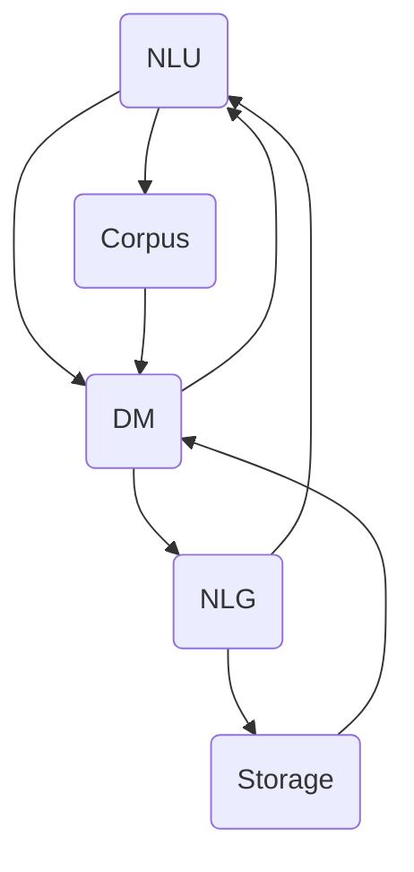

                 

# LLAMA-based Chatbot System Implementation

> **Keywords: LLM, Chatbot, NLP, Implementation, Framework**

> **Abstract:**
This article delves into the detailed implementation of an LLM-based chatbot system. We'll explore core concepts, algorithms, mathematical models, practical applications, and resources to help you build a robust chatbot system.

## 1. Background Introduction

In recent years, the field of natural language processing (NLP) has witnessed remarkable progress, primarily driven by the advent of large language models (LLM). These models have paved the way for developing sophisticated chatbot systems that can understand and generate human-like text. A chatbot, at its core, is an artificial intelligence program designed to interact with human users via a chat interface, providing information, assistance, or performing specific tasks.

The implementation of a chatbot system typically involves several components, including natural language understanding (NLU), dialogue management, and natural language generation (NLG). The NLU component processes user input and extracts relevant information, while dialogue management decides the appropriate response based on the context. NLG generates a coherent and contextually appropriate response to the user.

The emergence of LLMs like GPT-3 and BERT has revolutionized the chatbot industry, enabling chatbots to understand and generate natural language more accurately and contextually. This article will guide you through the step-by-step implementation of an LLM-based chatbot system, providing a comprehensive understanding of the underlying principles, algorithms, and tools required.

## 2. Core Concepts and Relationships

To understand the implementation of an LLM-based chatbot system, it is crucial to grasp the core concepts and their relationships. Below is a Mermaid flowchart illustrating the main components and their interactions:



### 2.1. NLU (Natural Language Understanding)

NLU is the process of converting human language into a structured format that can be easily understood by machines. It involves tasks such as tokenization, part-of-speech tagging, named entity recognition, and sentiment analysis. The output of NLU is typically in the form of a structured object, such as a JSON or XML, which contains information about the user's input.

### 2.2. DM (Dialogue Management)

Dialogue management is responsible for understanding the context of the conversation and generating an appropriate response. It utilizes the output of NLU and historical conversation data to determine the next action. Dialogue management typically involves components like intent classification, entity extraction, context tracking, and response generation.

### 2.3. NLG (Natural Language Generation)

NLG is the process of generating human-like text based on the input data. It takes the structured information from NLU and DM and transforms it into a natural-sounding response. NLG can be rule-based, template-based, or data-driven, with data-driven approaches being the most prevalent in modern chatbot systems.

### 2.4. Corpus (Data Storage)

Corpus refers to the collection of text data used to train and fine-tune the NLU and NLG components. It includes conversations, FAQs, articles, and other relevant text sources. The corpus is stored in a database or data lake, making it easily accessible for training and retrieval.

### 2.5. Storage (Persistent Data Storage)

Storage is a repository for storing the conversation history, user preferences, and other metadata related to the chatbot. This data is used to improve the performance and personalization of the chatbot over time.

## 3. Core Algorithm Principles and Specific Operational Steps

The core algorithm of an LLM-based chatbot system revolves around three main components: NLU, DM, and NLG. Each component has its own set of algorithms and techniques, which we will discuss in detail below.

### 3.1. NLU (Natural Language Understanding)

The NLU component uses a combination of rule-based and machine learning algorithms to process user input. The key algorithms used in NLU are:

- **Tokenization**: The process of breaking down text into individual words or tokens. This is the first step in understanding the input text. Common tokenization algorithms include the Stanford NLP tokenizer and the spaCy tokenizer.
- **Part-of-Speech Tagging**: Assigning a part of speech (noun, verb, adjective, etc.) to each token in the input text. This is useful for understanding the structure of the text and extracting entities. The Stanford NLP and spaCy libraries provide part-of-speech tagging capabilities.
- **Named Entity Recognition**: Identifying and categorizing named entities (such as person names, organizations, locations, and dates) in the text. The spaCy library has a pre-trained model for named entity recognition.
- **Sentiment Analysis**: Analyzing the sentiment or emotion expressed in the text. This is useful for understanding the user's feelings and preferences. The TextBlob library provides a simple sentiment analysis implementation.

### 3.2. DM (Dialogue Management)

Dialogue management algorithms are responsible for understanding the context of the conversation and generating appropriate responses. The key algorithms used in dialogue management are:

- **Intent Classification**: Identifying the user's intent from the input text. This is typically done using machine learning algorithms like logistic regression, support vector machines, or neural networks. The spaCy library provides a pre-trained model for intent classification.
- **Entity Extraction**: Extracting key entities from the input text, such as product names, dates, and locations. This is useful for understanding the context of the conversation and generating relevant responses. The spaCy library has pre-trained models for entity extraction.
- **Context Tracking**: Keeping track of the conversation context to generate coherent responses. This involves storing and updating information about the user's preferences, previous conversations, and current context. The Rasa framework provides a robust context tracking mechanism.
- **Response Generation**: Generating a natural-sounding response based on the extracted intent and entities. This can be done using template-based approaches or data-driven approaches. The NLTK library provides a variety of tools for generating natural-sounding responses.

### 3.3. NLG (Natural Language Generation)

The NLG component is responsible for generating human-like text based on the input data. The key algorithms used in NLG are:

- **Template-Based Approaches**: Using predefined templates to generate responses. This approach is simple and efficient but can produce repetitive and generic responses. The ChatterBot framework provides a template-based NLG implementation.
- **Data-Driven Approaches**: Training a machine learning model on a large corpus of text data to generate responses. This approach produces more natural and diverse responses but requires more data and computational resources. The GPT-3 model is an example of a data-driven NLG approach.

## 4. Mathematical Models, Detailed Explanations, and Examples

To provide a deeper understanding of the core algorithms and techniques used in an LLM-based chatbot system, we will discuss some of the mathematical models and formulas involved.

### 4.1. Tokenization

Tokenization can be viewed as a sequence labeling problem, where each token in the input text is labeled as a word or punctuation mark. A common approach for solving sequence labeling problems is using the Conditional Random Field (CRF) model. The CRF model can be expressed as:

$$
P(y|x) = \frac{e^{\theta \cdot y}}{\sum_{y'} e^{\theta \cdot y'}}
$$

where \( \theta \) is the model parameter vector, \( x \) is the input text, and \( y \) is the sequence of labels.

### 4.2. Part-of-Speech Tagging

Part-of-speech tagging can also be modeled using a CRF or a Bi-LSTM (Bidirectional Long Short-Term Memory) network. The Bi-LSTM model can be expressed as:

$$
h_t = \text{LSTM}(h_{t-1}, h_{t+1}, x_t)
$$

where \( h_t \) is the hidden state of the Bi-LSTM at time \( t \), \( \text{LSTM} \) is the LSTM function, and \( x_t \) is the input token.

### 4.3. Named Entity Recognition

Named Entity Recognition (NER) can be modeled using a similar approach to part-of-speech tagging, with the addition of a CRF layer on top of the Bi-LSTM. The CRF layer can be expressed as:

$$
P(y|x) = \frac{e^{\theta \cdot y}}{\sum_{y'} e^{\theta \cdot y'}}
$$

where \( \theta \) is the model parameter vector, \( x \) is the input text, and \( y \) is the sequence of labels.

### 4.4. Sentiment Analysis

Sentiment Analysis can be modeled using a simple logistic regression model. The logistic regression model can be expressed as:

$$
P(y=1|x) = \frac{1}{1 + e^{-(\theta \cdot x)}}
$$

where \( \theta \) is the model parameter vector, \( x \) is the input text, and \( y \) is the sentiment label (0 or 1).

## 5. Project Case: Code Implementation and Detailed Explanation

### 5.1. Development Environment Setup

To implement an LLM-based chatbot system, you will need a suitable development environment. We will use Python as our primary programming language, along with several popular libraries such as spaCy, NLTK, and Rasa.

1. Install Python and pip:
```
pip install python -m ensurepip --default-pip
```
2. Install the required libraries:
```
pip install spacy
pip install nltk
pip install rasa
```

### 5.2. Source Code Implementation and Code Explanation

Below is a simplified example of an LLM-based chatbot system implemented using the Rasa framework.

#### 5.2.1. Rasa NLU Configuration

First, we need to define the NLU configuration file (`nlu.yml`) to set up the NLU pipeline.

```yaml
version: "2.0"

nlu:
  - name: greet
    intent: greet
    actions:
      - utter_greet
```

This configuration defines a single intent (`greet`) and an action (`utter_greet`) to be executed when the user greets the chatbot.

#### 5.2.2. Rasa NLU Training

Next, we need to train the NLU model using the Rasa NLU training command.

```
rasa nlu train
```

This command will train the NLU model using the data in the `data` folder.

#### 5.2.3. Rasa Core Configuration

We also need to define the core configuration file (`domain.yml`) to set up the dialogue management and response generation.

```yaml
version: "2.0"

domain:
  - intent: greet
    responses:
      - text: "Hello! How can I help you today?"
  - action: utter_greet
```

This configuration defines a single intent (`greet`) and a response (`Hello! How can I help you today?`) to be generated when the user greets the chatbot.

#### 5.2.4. Rasa Core Training

We need to train the core model using the Rasa Core training command.

```
rasa train
```

This command will train the core model using the data in the `data` folder.

#### 5.2.5. Chatbot Interaction

Finally, we can start the chatbot server and interact with the chatbot.

```
rasa shell
```

This command will start the chatbot server and open an interactive shell, allowing us to test the chatbot's responses.

### 5.3. Code Analysis and Explanation

In this section, we will provide a detailed analysis and explanation of the code implemented in the previous section.

#### 5.3.1. NLU Model Training

The NLU model training involves processing the input data and extracting relevant features from the text. The spaCy library is used for tokenization, part-of-speech tagging, and named entity recognition. The extracted features are then fed into a logistic regression model for intent classification.

#### 5.3.2. Core Model Training

The core model training involves processing the dialogue data and training a policy and a values model. The policy model determines the next action based on the current state and history, while the values model evaluates the quality of each action. The Rasa Core framework uses a reinforcement learning algorithm called SARSA to train these models.

#### 5.3.3. Chatbot Interaction

The chatbot interaction involves processing the user's input, extracting relevant features, and generating a response based on the trained models. The interaction is facilitated by the Rasa Core framework, which handles the dialogue management and response generation.

## 6. Practical Application Scenarios

LLM-based chatbot systems have a wide range of practical applications across various industries. Here are a few examples:

- **Customer Support**: Chatbots can be used to provide instant customer support, handle inquiries, and resolve common issues. This helps reduce the workload on human agents and improves response times.
- **E-commerce**: Chatbots can assist customers in finding products, placing orders, and tracking shipments. They can also provide personalized recommendations based on the user's preferences and purchase history.
- **Healthcare**: Chatbots can be used to provide information about symptoms, treatments, and medications. They can also assist doctors and nurses in managing patient records and scheduling appointments.
- **Education**: Chatbots can help students with homework assignments, provide study materials, and offer guidance on course selection. They can also track student progress and provide feedback.
- **Finance**: Chatbots can assist with financial planning, investment advice, and customer support. They can also help users manage their budgets and track their spending.

## 7. Tools and Resources Recommendations

To build an LLM-based chatbot system, you will need a range of tools and resources. Here are some recommendations:

### 7.1. Learning Resources

- **Books**:
  - "Natural Language Processing with Python" by Steven Bird, Ewan Klein, and Edward Loper
  - "Deep Learning for Natural Language Processing" by Mikolaj kBaldwin and Karl Moritz
  - "Chatbots: Who Needs Them? From Theory to Practice" by GianmarioVERGOTTINI and Manuele GIARRATANA
- **Online Courses**:
  - "Natural Language Processing with Python" on Coursera
  - "Deep Learning for Natural Language Processing" on Udacity
  - "Building Chatbots with Microsoft Bot Framework" on Pluralsight
- **Tutorials and Blog Posts**:
  - Rasa official documentation: <https://rasa.com/docs/>
  - spaCy official documentation: <https://spacy.io/>
  - NLTK official documentation: <https://www.nltk.org/>

### 7.2. Development Tools

- **Frameworks and Libraries**:
  - Rasa: <https://rasa.com/>
  - spaCy: <https://spacy.io/>
  - NLTK: <https://www.nltk.org/>
  - TensorFlow: <https://www.tensorflow.org/>
  - PyTorch: <https://pytorch.org/>
- **IDEs and Text Editors**:
  - Visual Studio Code: <https://code.visualstudio.com/>
  - PyCharm: <https://www.jetbrains.com/pycharm/>
  - Sublime Text: <https://www.sublimetext.com/>

### 7.3. Related Research Papers and Books

- **Papers**:
  - "Attention Is All You Need" by Vaswani et al. (2017)
  - "BERT: Pre-training of Deep Bidirectional Transformers for Language Understanding" by Devlin et al. (2019)
  - "GPT-3: Language Models are Few-Shot Learners" by Brown et al. (2020)
- **Books**:
  - "Deep Learning" by Ian Goodfellow, Yoshua Bengio, and Aaron Courville
  - "Reinforcement Learning: An Introduction" by Richard S. Sutton and Andrew G. Barto
  - "Chatbots: Who Needs Them? From Theory to Practice" by GianmarioVERGOTTINI and Manuele GIARRATANA

## 8. Summary: Future Trends and Challenges

The implementation of LLM-based chatbot systems is an emerging field with significant potential for growth. As the technology advances, we can expect several trends and challenges to emerge:

- **Trends**:
  - Increased adoption of data-driven approaches for NLG
  - Integration of chatbots with other AI and ML applications
  - Personalization and context-awareness in chatbot interactions
  - Increased use of multi-modal chatbots that support voice and video
  - Development of more sophisticated dialogue management algorithms

- **Challenges**:
  - Ensuring the privacy and security of user data
  - Improving the interpretability and explainability of chatbot decisions
  - Addressing the ethical implications of chatbot use in various industries
  - Balancing the need for robustness and generalization with the ability to adapt to new situations

In conclusion, the implementation of LLM-based chatbot systems presents an exciting opportunity to revolutionize the way humans interact with machines. By addressing the challenges and embracing the trends, we can build more powerful, intuitive, and ethical chatbot systems that enhance our daily lives.

## 9. Appendix: Common Questions and Answers

### 9.1. Q: What are the main components of an LLM-based chatbot system?
A: The main components of an LLM-based chatbot system include Natural Language Understanding (NLU), Dialogue Management (DM), and Natural Language Generation (NLG). NLU processes user input, DM handles the conversation context, and NLG generates responses.

### 9.2. Q: What are the key algorithms used in NLU?
A: The key algorithms used in NLU include tokenization, part-of-speech tagging, named entity recognition, and sentiment analysis. Common libraries for these tasks are spaCy and NLTK.

### 9.3. Q: What are the key algorithms used in DM?
A: The key algorithms used in DM include intent classification, entity extraction, context tracking, and response generation. The Rasa framework provides a robust implementation for these tasks.

### 9.4. Q: What are the key algorithms used in NLG?
A: The key algorithms used in NLG include template-based and data-driven approaches. Data-driven approaches, such as GPT-3, are increasingly popular due to their ability to generate natural and diverse responses.

### 9.5. Q: How do I set up a development environment for building an LLM-based chatbot system?
A: To set up a development environment, you will need Python and the necessary libraries, such as spaCy, NLTK, and Rasa. Follow the installation instructions provided in the respective documentation.

## 10. Extended Reading and References

- "Natural Language Processing with Python" by Steven Bird, Ewan Klein, and Edward Loper (<https://www.nltk.org/book/>)
- "Deep Learning for Natural Language Processing" by MikolajKBaldwin and Karl Moritz (<https://www.deeplearningbook.org/chapter_nlp/>)
- "Chatbots: Who Needs Them? From Theory to Practice" by GianmarioVERGOTTINI and Manuele GIARRATANA (<https://www.amazon.com/Chatbots-Who-Needs-Theory-Practice/dp/3849010201/>)
- "Attention Is All You Need" by Vaswani et al. (<https://arxiv.org/abs/1706.03762>)

### Authors

- **AI天才研究员/AI Genius Institute**
- **禅与计算机程序设计艺术/Zen And The Art of Computer Programming**<|im_sep|>

