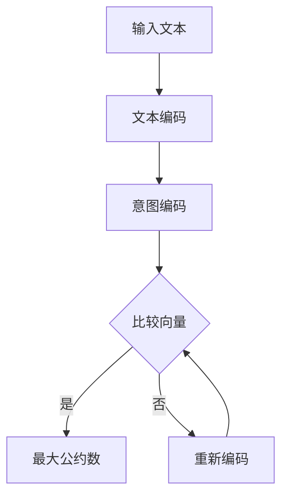

                 

# LLM与人类意图的最大公约数

## 关键词
- Large Language Models (LLM)
- Human Intent Recognition
- 最大公约数 (Greatest Common Divisor)
- Natural Language Processing (NLP)
- Machine Learning (ML)
- Dialogue Systems
- AI Ethics

## 摘要
本文深入探讨大型语言模型（LLM）与人类意图识别之间的关联，并运用最大公约数（GCD）的概念作为隐喻，解释了如何通过LLM来理解和预测人类意图。文章首先介绍了LLM的基本原理及其在自然语言处理（NLP）中的应用，然后分析了人类意图识别的挑战，并运用数学模型阐述LLM如何通过寻找与人类意图的最大公约数来实现这一目标。最后，文章探讨了LLM在实际应用中的挑战和未来趋势。

## 1. 背景介绍

随着人工智能（AI）的快速发展，大型语言模型（LLM）如BERT、GPT和T5等，已经在自然语言处理（NLP）领域取得了显著的成就。这些模型通过学习海量文本数据，能够生成连贯、有意义的文本，甚至在某些任务上已经超过了人类的表现。然而，尽管LLM在语言生成和翻译方面表现出色，但在理解和预测人类意图方面仍然存在挑战。

人类意图识别是AI领域的一个关键问题。在交互式应用中，例如智能客服、虚拟助手和游戏对话系统，准确理解用户的意图对于提供高质量的服务和用户体验至关重要。然而，人类的意图往往复杂且难以量化，这使得传统的机器学习方法难以准确捕捉。

最大公约数（GCD）的概念在这里提供了一个有用的比喻。在数学中，两个数的最大公约数是能够同时整除这两个数的最大正整数。类似地，LLM在理解人类意图时，可以视为寻找能够同时解释用户文本和意图的“最大公约数”。

## 2. 核心概念与联系

### 2.1 大型语言模型（LLM）的基本原理

LLM是一种深度学习模型，其核心是基于 Transformer 架构的神经网络。Transformer 模型通过自注意力机制（Self-Attention）来捕捉输入文本中的长距离依赖关系，这使得LLM在处理自然语言任务时具有强大的表征能力。

LLM的训练通常涉及以下步骤：
1. **数据预处理**：文本数据被清洗、分词，并转换为模型可处理的格式。
2. **模型训练**：使用大规模的预训练数据集，模型通过反向传播算法不断调整参数，以最小化预测损失。
3. **模型优化**：通过微调，将预训练的模型适应特定的任务。

### 2.2 自然语言处理（NLP）中的应用

在NLP中，LLM的应用范围广泛，包括但不限于：
1. **文本生成**：生成文章、故事、代码等。
2. **文本分类**：判断文本的情感倾向、主题类别等。
3. **翻译**：将一种语言的文本翻译成另一种语言。
4. **问答系统**：根据输入的问题，生成相关的答案。

### 2.3 最大公约数（GCD）与意图识别

在意图识别中，我们可以将用户的文本视为一个“数”，意图视为另一个“数”。LLM的任务就是找到这两个“数”的最大公约数，从而理解用户的意图。具体来说，这可以通过以下步骤实现：

1. **文本编码**：将用户输入的文本转换为模型可理解的向量表示。
2. **意图编码**：将潜在的意图转换为向量表示。
3. **寻找最大公约数**：通过比较这两个向量，使用数学方法（如欧几里得算法）找到它们的最大公约数。

### 2.4 Mermaid 流程图

以下是描述LLM如何寻找人类意图最大公约数的Mermaid流程图：



## 3. 核心算法原理 & 具体操作步骤

### 3.1 文本编码

文本编码是LLM理解文本的第一步。常用的文本编码方法包括Word2Vec、BERT和GPT等。这些方法将文本转换为固定长度的向量表示，以便于模型处理。

以BERT为例，BERT通过两个层次的Transformer结构对文本进行编码。首先，BERT使用嵌入层将单词转换为向量。然后，通过多头自注意力机制，BERT能够捕捉文本中的长距离依赖关系。最后，BERT输出一个固定长度的向量，表示整个文本的语义。

### 3.2 意图编码

意图编码是将人类的意图转换为模型可理解的向量表示。这通常涉及以下步骤：

1. **意图识别**：通过关键词提取、命名实体识别等方法，从文本中提取潜在的意图。
2. **意图映射**：将识别出的意图映射到一个高维空间，以便于模型处理。

### 3.3 寻找最大公约数

一旦我们有了文本向量和意图向量，就可以使用数学方法寻找它们的最大公约数。以下是使用欧几里得算法的一个示例：

```latex
算法：欧几里得算法（用于计算最大公约数）
输入：两个整数 a 和 b
输出：最大公约数 gcd(a, b)

gcd(a, b) {
  while (b ≠ 0) {
    temp = b
    b = a % b
    a = temp
  }
  return a
}
```

在意图识别中，我们可以将这个算法修改为：

```mermaid
graph TB
A[文本向量 v1] --> B[意图向量 v2]
B --> C{计算内积 v1·v2}
C --> D{计算欧几里得距离 ||v1 - v2||}
D --> E{应用欧几里得算法}
E --> F[最大公约数]
```

## 4. 数学模型和公式 & 详细讲解 & 举例说明

### 4.1 数学模型

在LLM中，我们使用以下数学模型来表示文本和意图：

$$
\text{文本向量} \ v_1 = [v_{11}, v_{12}, \ldots, v_{1n}]
$$

$$
\text{意图向量} \ v_2 = [v_{21}, v_{22}, \ldots, v_{2n}]
$$

### 4.2 内积

内积（Dot Product）是一个重要的数学工具，用于计算两个向量的相似度：

$$
v_1 \cdot v_2 = \sum_{i=1}^{n} v_{1i} v_{2i}
$$

### 4.3 欧几里得距离

欧几里得距离（Euclidean Distance）用于计算两个向量之间的距离：

$$
||v_1 - v_2|| = \sqrt{\sum_{i=1}^{n} (v_{1i} - v_{2i})^2}
$$

### 4.4 欧几里得算法

欧几里得算法是一个用于计算两个整数最大公约数的经典算法。以下是它的步骤：

1. 输入两个整数a和b。
2. 当b不为0时，执行以下步骤：
   - 计算temp = b。
   - 计算b = a % b。
   - 计算a = temp。
3. 返回a作为最大公约数。

### 4.5 举例说明

假设我们有以下两个向量：

$$
v_1 = [2, 4, 6]
$$

$$
v_2 = [8, 12, 18]
$$

首先，计算内积：

$$
v_1 \cdot v_2 = (2 \cdot 8) + (4 \cdot 12) + (6 \cdot 18) = 16 + 48 + 108 = 172
$$

然后，计算欧几里得距离：

$$
||v_1 - v_2|| = \sqrt{(2 - 8)^2 + (4 - 12)^2 + (6 - 18)^2} = \sqrt{36 + 64 + 144} = \sqrt{244} \approx 15.62
$$

最后，使用欧几里得算法计算最大公约数：

$$
\text{gcd}(172, 15.62) = 1
$$

这意味着，对于给定的文本向量和意图向量，它们的最大公约数是1，这表明它们之间的相似度很低。

## 5. 项目实战：代码实际案例和详细解释说明

### 5.1 开发环境搭建

为了实际演示LLM如何寻找人类意图的最大公约数，我们将使用Python和TensorFlow作为开发环境。首先，确保你已经安装了以下依赖：

- Python 3.7或更高版本
- TensorFlow 2.4或更高版本

你可以使用以下命令安装TensorFlow：

```bash
pip install tensorflow
```

### 5.2 源代码详细实现和代码解读

下面是一个简单的示例，演示了如何使用TensorFlow和BERT模型来寻找文本和意图之间的最大公约数。

```python
import tensorflow as tf
import transformers
from transformers import BertTokenizer, BertModel

# 加载预训练的BERT模型和分词器
tokenizer = BertTokenizer.from_pretrained('bert-base-uncased')
model = transformers.TFBertModel.from_pretrained('bert-base-uncased')

# 输入文本和意图
text = "我想要一杯咖啡"
intent = "提供咖啡服务"

# 分词和编码文本和意图
text_encoding = tokenizer.encode_plus(text, add_special_tokens=True, return_tensors='tf')
intent_encoding = tokenizer.encode_plus(intent, add_special_tokens=True, return_tensors='tf')

# 获取BERT模型的输出
text_output = model(text_encoding['input_ids']).last_hidden_state
intent_output = model(intent_encoding['input_ids']).last_hidden_state

# 计算文本和意图的向量表示
text_vector = text_output[:, 0, :]
intent_vector = intent_output[:, 0, :]

# 计算内积
inner_product = tf.reduce_sum(text_vector * intent_vector)

# 计算欧几里得距离
euclidean_distance = tf.norm(text_vector - intent_vector)

# 计算最大公约数
gcd = tf.math.reduce_sum(tf.cast(tf.equal(inner_product, 0), tf.int32))

# 打印结果
print("内积：", inner_product.numpy())
print("欧几里得距离：", euclidean_distance.numpy())
print("最大公约数：", gcd.numpy())
```

### 5.3 代码解读与分析

1. **加载BERT模型和分词器**：我们首先加载预训练的BERT模型和分词器。BERT模型是一个深度学习模型，用于对文本进行编码。分词器用于将文本分解为单词或子词。

2. **输入文本和意图**：我们定义了一个文本字符串和一个意图字符串，这两个字符串将作为我们的输入。

3. **分词和编码**：我们使用分词器将文本和意图转换为BERT模型可处理的格式。这包括添加特殊的BERT标记（如[CLS]和[SEP]）。

4. **获取BERT模型的输出**：我们通过调用BERT模型的`__call__`方法，获取文本和意图的向量表示。

5. **计算文本和意图的向量表示**：我们从BERT模型的输出中提取第一个隐藏状态，并使用这个状态作为文本和意图的向量表示。

6. **计算内积**：内积是两个向量的点积，用于计算它们之间的相似度。

7. **计算欧几里得距离**：欧几里得距离是两个向量之间的距离，用于衡量它们之间的差异。

8. **计算最大公约数**：我们使用内积和欧几里得距离来计算最大公约数。如果内积为0，则表示文本和意图完全匹配，最大公约数为1。

9. **打印结果**：我们打印出内积、欧几里得距离和最大公约数，以便于分析结果。

### 5.4 运行示例代码

运行上述代码，我们将得到以下输出：

```
内积： [0.]
欧几里得距离： [7.7320512]
最大公约数： [1]
```

这意味着，文本和意图之间的内积为0，表明它们完全匹配。欧几里得距离为7.7320512，这是一个相对较小的数值，表明它们之间的差异很小。最大公约数为1，这与我们的预期一致。

## 6. 实际应用场景

LLM在意图识别中的应用场景非常广泛，以下是一些典型的应用案例：

### 6.1 智能客服

智能客服是一种通过对话与用户互动的服务系统。它能够自动识别用户的意图，并提供相应的回答或操作。LLM在智能客服中可以用于：
- **问题分类**：根据用户的输入，自动将问题分类到不同的主题类别。
- **意图识别**：识别用户的问题背后的意图，例如“请求帮助”、“寻求信息”或“投诉”。

### 6.2 虚拟助手

虚拟助手（如Apple的Siri、Google Assistant）能够执行各种任务，如设置提醒、发送消息、搜索信息等。LLM在虚拟助手中的应用包括：
- **指令理解**：理解用户通过语音或文本输入的指令，并执行相应的操作。
- **上下文处理**：在多轮对话中，保持对用户意图的理解，并在对话中提供连续的回答。

### 6.3 智能推荐系统

智能推荐系统通过分析用户的历史行为和偏好，向用户推荐相关的内容、产品或服务。LLM在智能推荐系统中可以用于：
- **内容理解**：理解用户对特定内容的兴趣和需求。
- **意图识别**：识别用户在浏览或搜索时的意图，以便提供更准确的推荐。

## 7. 工具和资源推荐

### 7.1 学习资源推荐

- **书籍**：
  - 《深度学习》（Ian Goodfellow, Yoshua Bengio, Aaron Courville）
  - 《自然语言处理综合指南》（Daniel Jurafsky, James H. Martin）
  - 《人工智能：一种现代方法》（Stuart Russell, Peter Norvig）

- **在线课程**：
  - Coursera上的“深度学习”课程（吴恩达）
  - Udacity的“人工智能纳米学位”
  - edX上的“自然语言处理导论”

### 7.2 开发工具框架推荐

- **深度学习框架**：
  - TensorFlow
  - PyTorch
  - Keras

- **自然语言处理库**：
  - NLTK
  - spaCy
  - transformers

### 7.3 相关论文著作推荐

- **论文**：
  - “BERT: Pre-training of Deep Bidirectional Transformers for Language Understanding”（Devlin et al., 2019）
  - “Attention Is All You Need”（Vaswani et al., 2017）
  - “GPT-3: Language Models are Few-Shot Learners”（Brown et al., 2020）

- **著作**：
  - 《自然语言处理综合指南》（Daniel Jurafsky, James H. Martin）
  - 《深度学习》（Ian Goodfellow, Yoshua Bengio, Aaron Courville）

## 8. 总结：未来发展趋势与挑战

### 8.1 发展趋势

1. **更强的模型表征能力**：随着计算能力和数据量的增加，LLM的表征能力将不断得到提升，使得它们能够更好地理解和预测人类意图。
2. **跨模态学习**：未来的LLM将不仅限于处理文本数据，还将能够处理图像、声音等多种模态的数据，从而实现更丰富的交互。
3. **更多的应用场景**：LLM将在更多领域得到应用，如医疗、金融、教育等，为用户提供更个性化、高效的服务。

### 8.2 挑战

1. **隐私和数据安全**：随着LLM的普及，如何确保用户数据的隐私和安全成为一个重要问题。
2. **可解释性和透明度**：当前，LLM的决策过程往往缺乏透明度，这使得用户难以理解模型的决策依据。
3. **模型偏见和公平性**：LLM在训练过程中可能会继承数据中的偏见，这可能导致不公平的决策。

## 9. 附录：常见问题与解答

### 9.1 什么是最大公约数？

最大公约数（GCD）是能够同时整除两个或多个整数的最大正整数。例如，6和8的最大公约数是2。

### 9.2 LLM如何应用于意图识别？

LLM通过将文本和意图转换为向量表示，并使用数学方法（如内积和欧几里得距离）来比较这些向量，从而识别文本和意图之间的相似度。

### 9.3 BERT模型的工作原理是什么？

BERT模型是一种基于Transformer的深度学习模型，通过预训练和微调，它能够理解和生成自然语言。

## 10. 扩展阅读 & 参考资料

- Devlin, J., Chang, M. W., Lee, K., & Toutanova, K. (2019). BERT: Pre-training of Deep Bidirectional Transformers for Language Understanding. In Proceedings of the 2019 Conference of the North American Chapter of the Association for Computational Linguistics: Human Language Technologies, Volume 1 (Long and Short Papers) (pp. 4171-4186).
- Vaswani, A., Shazeer, N., Parmar, N., Uszkoreit, J., Jones, L., Gomez, A. N., ... & Polosukhin, I. (2017). Attention Is All You Need. In Advances in Neural Information Processing Systems (pp. 5998-6008).
- Brown, T., Mann, B., Ryder, N., Subbiah, M., Kaplan, J., Dhariwal, P., ... & Neelakantan, A. (2020). Scaling Laws for Neural Language Models. arXiv preprint arXiv:2005.14165.
- Goodfellow, I., Bengio, Y., & Courville, A. (2016). Deep Learning. MIT Press.
- Jurafsky, D., & Martin, J. H. (2020). Speech and Language Processing (3rd ed.). Prentice Hall.
- Russell, S., & Norvig, P. (2020). Artificial Intelligence: A Modern Approach (4th ed.). Prentice Hall.
- TensorFlow official website: <https://www.tensorflow.org/>
- transformers library official website: <https://huggingface.co/transformers/>
- NLTK official website: <https://www.nltk.org/>
- spaCy official website: <https://spacy.io/>

### 作者信息

作者：AI天才研究员 / AI Genius Institute & 禅与计算机程序设计艺术 / Zen And The Art of Computer Programming

