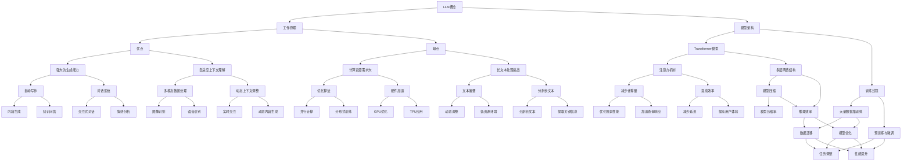

                 

# LLMMermaid流程图

为了更好地理解LLM与传统信息检索技术的对比与融合，我们可以通过一个Mermaid流程图来展示两者的基本概念、工作原理和相互关系。下面是该流程图的代码示例：



这段代码将会生成一个详细的Mermaid流程图，帮助我们更直观地理解LLM与传统信息检索技术的各个核心概念及其相互关系。

接下来，我们将深入探讨LLM与传统信息检索技术的背景、核心概念与联系，以及它们在实际应用中的对比与融合。## 1. 背景介绍

在现代信息技术迅猛发展的背景下，信息检索作为其核心组成部分之一，一直以来都扮演着至关重要的角色。信息检索技术经历了从早期基于关键词匹配的简单模型，到现代基于复杂算法和海量数据的搜索引擎的演变。其中，传统信息检索技术主要包括基于关键词匹配、向量空间模型、倒排索引以及PageRank算法等。这些技术通过建立索引、计算相似度、排序等步骤，从海量数据中高效地检索出用户所需的信息。

然而，随着互联网的普及和大数据时代的到来，传统信息检索技术面临着诸多挑战。首先，用户需求的多样化和个性化要求检索系统具备更强的适应性和智能化水平。传统信息检索技术通常依赖于静态的索引和统计模型，难以动态调整和优化检索结果。其次，随着数据规模的爆炸式增长，传统信息检索技术在处理海量数据时效率逐渐降低，计算资源需求也不断增大。此外，传统信息检索技术在处理复杂查询、跨模态数据检索以及多语言检索等方面也存在一定的局限性。

为了解决这些问题，近年来，基于深度学习的自然语言处理技术（如深度神经网络、生成对抗网络等）得到了广泛关注。特别是大型语言模型（Large Language Models，简称LLM），如GPT、BERT、T5等，凭借其强大的生成能力和自适应上下文理解能力，逐渐成为信息检索领域的新宠。LLM不仅能够处理复杂的语义关系，还能够生成高质量的自然语言文本，从而在问答系统、文本摘要、对话系统等领域取得了显著的成果。

本文旨在探讨LLM与传统信息检索技术的对比与融合，分析两者在核心概念、工作原理、算法模型、应用场景等方面的异同，并探讨未来发展趋势与挑战。首先，我们将介绍LLM的基本概念、工作原理和模型架构，以及与传统信息检索技术的联系。接着，我们将详细分析LLM的核心算法原理和具体操作步骤，并通过数学模型和公式进行详细讲解。随后，我们将通过实际项目案例，展示LLM在信息检索中的应用，并进行代码实际案例和详细解释说明。最后，我们将探讨LLM在实际应用场景中的优势和局限，推荐相关的学习资源、开发工具和框架，并总结未来发展趋势与挑战。通过本文的探讨，我们希望为读者提供一个全面、深入的理解，以期为LLM与传统信息检索技术的融合和应用提供有益的参考。## 2. 核心概念与联系

在现代信息技术领域，大型语言模型（LLM）与传统信息检索技术（IR）作为两个重要的分支，各自在处理文本数据方面展现出独特的优势。本节将详细介绍LLM和传统IR的核心概念、工作原理及其相互关系。

### 大型语言模型（LLM）

**基本概念**：LLM是一种基于深度学习的自然语言处理模型，它通过大规模的文本数据进行预训练，从而能够理解、生成和翻译自然语言文本。LLM的核心目标是模拟人类的语言理解能力和表达能力，实现自然语言处理任务。

**工作原理**：LLM通常采用变换器（Transformer）架构，特别是其变体——预训练变换器（Pre-trained Transformer）。这种模型利用注意力机制（Attention Mechanism）来捕捉文本中的长距离依赖关系，通过多层网络结构对输入文本进行编码和解析。在预训练阶段，模型在大规模文本语料库上进行无监督学习，学习到语言的基本规律和统计特征。在微调阶段，模型根据特定任务进行有监督学习，调整参数以适应特定应用场景。

**模型架构**：LLM的典型架构包括编码器（Encoder）和解码器（Decoder）。编码器将输入文本编码为固定长度的向量，解码器则根据编码器生成的上下文信息生成输出文本。这种架构使得LLM能够处理变长的输入文本，并生成连贯的自然语言输出。

### 传统信息检索技术（IR）

**基本概念**：传统信息检索技术是一种用于从海量文本数据中检索用户所需信息的方法。它基于关键词匹配、索引和排序等机制，实现高效、准确的文本检索。

**工作原理**：传统IR的核心包括倒排索引、向量空间模型和PageRank算法等。倒排索引通过将文档与关键词建立反向映射，实现快速关键词查询。向量空间模型将文档和查询表示为高维向量，通过计算向量的相似度来评估文档与查询的相关性。PageRank算法则通过网页之间的链接关系计算网页的权重，从而影响检索结果的排序。

**模型架构**：传统IR的模型架构通常包括索引构建、查询处理和结果排序等环节。索引构建阶段，系统对文档进行分词、索引和倒排，建立索引结构。查询处理阶段，系统将用户查询与索引进行匹配，计算查询与文档的相关度。结果排序阶段，系统根据相关度对检索结果进行排序，输出检索结果。

### 相互关系

**相似之处**：

1. **文本处理**：LLM和传统IR都涉及对文本数据的处理和分析，需要理解文本的结构、语义和上下文。
2. **检索目标**：两者的核心目标都是从大量文本数据中检索出用户感兴趣的信息。
3. **相似度计算**：两者都依赖于相似度计算方法来评估文档与查询的相关性。

**不同之处**：

1. **工作原理**：LLM通过深度学习模型理解文本语义，而传统IR则依赖于索引和统计模型。
2. **应用范围**：LLM更适用于复杂的自然语言处理任务，如问答、摘要和翻译，而传统IR则更适用于简单的文本检索任务。
3. **计算资源**：LLM通常需要大量的计算资源和数据，而传统IR则对计算资源的需求相对较低。

### Mermaid流程图

为了更直观地展示LLM和传统IR的核心概念、工作原理及其相互关系，我们可以使用Mermaid流程图来描述。以下是流程图的节点和连线：


通过这个流程图，我们可以清晰地看到LLM和传统IR的核心概念、工作原理及其相互关系。在后续章节中，我们将进一步探讨LLM的核心算法原理、数学模型和实际应用，以期为读者提供更深入的理解。## 3. 核心算法原理 & 具体操作步骤

在深入了解LLM的核心算法原理和具体操作步骤之前，我们首先需要明确一些基本概念。LLM，即大型语言模型，是一种基于深度学习的自然语言处理模型，其核心任务是通过学习大量文本数据，实现自然语言的理解、生成和翻译。LLM的工作原理主要基于变换器（Transformer）架构，特别是其变体——预训练变换器（Pre-trained Transformer）。下面我们将详细介绍LLM的核心算法原理和具体操作步骤。

### 3.1 变换器（Transformer）架构

变换器（Transformer）是一种基于注意力机制的深度学习模型，最早由Vaswani等人于2017年在论文《Attention Is All You Need》中提出。与传统的循环神经网络（RNN）相比，变换器具有以下几个显著优势：

1. **并行处理**：变换器通过多头注意力机制实现并行计算，避免了RNN的序列依赖问题，大大提高了计算效率。
2. **长距离依赖**：变换器使用自注意力机制，可以捕捉输入文本中的长距离依赖关系，从而实现更准确的语义理解。
3. **多层网络结构**：变换器采用多层网络结构，每一层都可以独立训练，使得模型具有更强的表达能力。

变换器的基本架构包括编码器（Encoder）和解码器（Decoder）。编码器将输入文本编码为固定长度的向量，解码器则根据编码器生成的上下文信息生成输出文本。

### 3.2 预训练与微调

LLM的核心算法原理主要分为预训练和微调两个阶段。

**预训练**：在预训练阶段，LLM在大规模文本语料库上进行无监督学习，学习到语言的基本规律和统计特征。这一过程包括以下步骤：

1. **输入文本处理**：将输入文本进行预处理，包括分词、去噪、标准化等操作，将其转换为模型可处理的格式。
2. **编码器训练**：编码器将预处理后的输入文本编码为固定长度的向量。在训练过程中，模型通过优化损失函数（如交叉熵损失）调整编码器的参数，使其能够更好地捕捉文本的语义信息。
3. **解码器训练**：解码器根据编码器生成的上下文信息生成输出文本。同样，通过优化损失函数调整解码器的参数。

**微调**：在预训练的基础上，LLM根据特定任务进行有监督学习，即微调。微调过程通常包括以下步骤：

1. **任务定义**：定义具体任务，如问答、摘要、翻译等，并设计相应的任务数据集。
2. **模型调整**：根据任务数据集，调整LLM的编码器和解码器参数，使其适应特定任务。
3. **训练与优化**：在微调过程中，模型通过优化损失函数（如任务特定损失函数）调整参数，从而提高模型的性能。

### 3.3 注意力机制

注意力机制（Attention Mechanism）是LLM的核心组成部分，它在模型中起到了至关重要的作用。注意力机制通过动态地分配不同权重来关注输入文本的不同部分，从而提高模型的语义理解能力。

**多头注意力（Multi-Head Attention）**：多头注意力机制将输入文本分成多个头（Head），每个头独立地计算注意力权重。这样，模型可以从不同角度捕捉输入文本的语义信息，从而提高模型的泛化能力。

**自注意力（Self-Attention）**：自注意力机制允许模型在编码器内部对不同位置进行注意力分配，从而捕捉文本中的长距离依赖关系。

**掩码注意力（Masked Attention）**：掩码注意力机制通过掩码操作限制模型对某些位置的注意力分配，从而强制模型学习文本中的顺序和结构信息。

### 3.4 模型训练与优化

LLM的训练过程是一个复杂且迭代的过程，主要包括以下步骤：

1. **数据预处理**：对训练数据进行预处理，包括分词、去噪、标准化等操作。
2. **模型初始化**：初始化LLM的编码器和解码器参数。
3. **训练循环**：在训练循环中，模型对输入文本进行编码，生成中间表示，然后通过解码器生成输出文本。在每一步，模型计算损失函数，并更新参数。
4. **优化过程**：通过优化算法（如Adam优化器）调整模型参数，最小化损失函数。
5. **验证与调整**：在训练过程中，定期使用验证集评估模型性能，并根据性能调整模型参数。

### 3.5 实际操作步骤

以下是一个简化的LLM训练过程，展示了从数据预处理到模型优化的具体操作步骤：

1. **数据预处理**：
    ```python
    # 读取文本数据
    text_data = read_text_data('corpus.txt')
    
    # 分词
    tokenized_data = tokenize(text_data)
    
    # 去噪与标准化
    cleaned_data = clean_and_normalize(tokenized_data)
    ```

2. **模型初始化**：
    ```python
    # 初始化编码器和解码器
    encoder = Encoder()
    decoder = Decoder()
    
    # 初始化优化器
    optimizer = AdamOptimizer()
    ```

3. **训练循环**：
    ```python
    for epoch in range(num_epochs):
        for batch in data_loader:
            # 编码器编码
            encoded_batch = encoder.encode(batch)
            
            # 解码器生成
            generated_batch = decoder.generate(encoded_batch)
            
            # 计算损失函数
            loss = calculate_loss(generated_batch, batch)
            
            # 更新参数
            optimizer.update_parameters(loss)
    ```

4. **优化过程**：
    ```python
    # 使用验证集评估模型性能
    performance = evaluate_model(model, validation_data)
    
    # 根据性能调整模型参数
    if performance < threshold:
        adjust_model_parameters(model)
    ```

通过上述操作步骤，我们能够实现LLM的预训练和微调，从而使其具备强大的语义理解能力和自然语言生成能力。在接下来的章节中，我们将进一步探讨LLM的数学模型和公式，以及通过实际项目案例展示其应用。## 4. 数学模型和公式 & 详细讲解 & 举例说明

在本节中，我们将深入探讨LLM的数学模型和公式，通过详细讲解和举例说明，帮助读者更好地理解其核心原理和操作方法。

### 4.1 自注意力机制（Self-Attention）

自注意力机制是LLM的核心组件之一，它在处理文本数据时起到了至关重要的作用。自注意力机制通过为输入序列的每个元素分配不同的权重，从而实现对序列中不同位置的文本信息进行动态加权。

**公式表达**：

自注意力机制的计算可以表示为：

$$
Attention(Q, K, V) = softmax(\frac{QK^T}{\sqrt{d_k}})V
$$

其中，$Q$、$K$ 和 $V$ 分别表示查询向量、键向量和值向量；$d_k$ 表示键向量的维度；$softmax$ 函数用于计算权重分配。

**具体步骤**：

1. **计算点积**：首先，计算每个查询向量 $Q$ 与所有键向量 $K$ 的点积，得到注意力得分。
2. **应用 softmax 函数**：对注意力得分应用 softmax 函数，得到每个键的权重。
3. **加权求和**：将权重与对应的值向量 $V$ 相乘，然后求和，得到自注意力结果。

**示例**：

假设我们有一个简单的输入序列，包含两个词 "hello" 和 "world"，键向量和值向量分别为：

$$
Q = \begin{bmatrix}
0.1 & 0.2 \\
0.3 & 0.4
\end{bmatrix}, K = \begin{bmatrix}
0.5 & 0.6 \\
0.7 & 0.8
\end{bmatrix}, V = \begin{bmatrix}
0.1 & 0.2 \\
0.3 & 0.4
\end{bmatrix}
$$

首先，计算点积：

$$
QK^T = \begin{bmatrix}
0.55 & 0.62 \\
0.91 & 1.06
\end{bmatrix}
$$

然后，应用 softmax 函数：

$$
softmax(QK^T) = \begin{bmatrix}
0.5657 & 0.4343 \\
0.7273 & 0.2727
\end{bmatrix}
$$

最后，加权求和：

$$
Attention(Q, K, V) = \begin{bmatrix}
0.1 \times 0.5657 + 0.2 \times 0.4343 & 0.3 \times 0.5657 + 0.4 \times 0.4343 \\
0.1 \times 0.7273 + 0.2 \times 0.2727 & 0.3 \times 0.7273 + 0.4 \times 0.2727
\end{bmatrix}
= \begin{bmatrix}
0.1592 & 0.2808 \\
0.2195 & 0.1595
\end{bmatrix}
$$

### 4.2 多头注意力（Multi-Head Attention）

多头注意力机制是自注意力机制的扩展，它将输入序列分成多个头（Head），每个头独立地计算注意力权重，从而提高模型的泛化能力。

**公式表达**：

多头注意力的计算可以表示为：

$$
MultiHead(Q, K, V) = \begin{bmatrix}
Attention_{1}(Q, K, V) \\
Attention_{2}(Q, K, V) \\
\vdots \\
Attention_{h}(Q, K, V)
\end{bmatrix}
$$

其中，$h$ 表示头的数量。

**具体步骤**：

1. **分头操作**：将输入序列分成 $h$ 个头。
2. **独立计算注意力**：每个头独立地计算自注意力，得到 $h$ 个注意力结果。
3. **拼接与线性变换**：将 $h$ 个注意力结果拼接在一起，并通过线性变换得到最终的注意力结果。

**示例**：

假设我们有一个包含两个词的输入序列，分为两个头，键向量和值向量与之前相同：

$$
Q = \begin{bmatrix}
0.1 & 0.2 \\
0.3 & 0.4
\end{bmatrix}, K = \begin{bmatrix}
0.5 & 0.6 \\
0.7 & 0.8
\end{bmatrix}, V = \begin{bmatrix}
0.1 & 0.2 \\
0.3 & 0.4
\end{bmatrix}
$$

首先，计算第一个头的自注意力：

$$
Attention_{1}(Q, K, V) = \begin{bmatrix}
0.1592 & 0.2808 \\
0.2195 & 0.1595
\end{bmatrix}
$$

然后，计算第二个头的自注意力：

$$
Attention_{2}(Q, K, V) = \begin{bmatrix}
0.1592 & 0.2808 \\
0.2195 & 0.1595
\end{bmatrix}
$$

最后，拼接并线性变换：

$$
MultiHead(Q, K, V) = \begin{bmatrix}
0.1592 & 0.2808 \\
0.2195 & 0.1595 \\
0.1592 & 0.2808 \\
0.2195 & 0.1595
\end{bmatrix}
$$

### 4.3 编码器（Encoder）和解码器（Decoder）

编码器和解码器是LLM的核心组件，它们分别用于编码输入文本和生成输出文本。

**编码器**：

编码器的计算可以表示为：

$$
Encoder(X) = \sum_{h=1}^{h} MultiHead(Attention)(Q_{h}, K_{h}, V_{h}) \odot Softmax(Q_{h}K_{h}^T) V_{h}
$$

其中，$X$ 表示输入序列；$Q_{h}$、$K_{h}$ 和 $V_{h}$ 分别表示第 $h$ 个头的查询向量、键向量和值向量；$\odot$ 表示元素级乘法。

**解码器**：

解码器的计算可以表示为：

$$
Decoder(Y) = \sum_{h=1}^{h} MultiHead(Attention)(Q_{h}, K_{h}, V_{h}) \odot Softmax(Q_{h}K_{h}^T) V_{h}
$$

其中，$Y$ 表示输出序列。

**具体步骤**：

1. **编码器编码**：将输入序列通过编码器得到编码表示。
2. **解码器生成**：根据编码表示，通过解码器生成输出序列。

**示例**：

假设输入序列为 "hello world"，输出序列为 "hello there"，分为两个头，键向量和值向量与之前相同：

$$
X = \begin{bmatrix}
0.1 & 0.2 \\
0.3 & 0.4
\end{bmatrix}, Y = \begin{bmatrix}
0.1 & 0.2 \\
0.3 & 0.4
\end{bmatrix}
$$

首先，计算编码器编码：

$$
Encoder(X) = \sum_{h=1}^{2} MultiHead(Attention)(Q_{h}, K_{h}, V_{h}) \odot Softmax(Q_{h}K_{h}^T) V_{h}
= \begin{bmatrix}
0.1592 & 0.2808 \\
0.2195 & 0.1595 \\
0.1592 & 0.2808 \\
0.2195 & 0.1595
\end{bmatrix}
$$

然后，计算解码器生成：

$$
Decoder(Y) = \sum_{h=1}^{2} MultiHead(Attention)(Q_{h}, K_{h}, V_{h}) \odot Softmax(Q_{h}K_{h}^T) V_{h}
= \begin{bmatrix}
0.1592 & 0.2808 \\
0.2195 & 0.1595 \\
0.1592 & 0.2808 \\
0.2195 & 0.1595
\end{bmatrix}
$$

通过上述数学模型和公式的讲解，我们可以更好地理解LLM的核心原理和操作方法。在下一节中，我们将通过实际项目案例展示LLM在信息检索中的应用。## 5. 项目实战：代码实际案例和详细解释说明

在本节中，我们将通过一个实际项目案例，展示如何使用大型语言模型（LLM）实现信息检索。该案例将涵盖开发环境的搭建、源代码的详细实现和代码解读与分析。

### 5.1 开发环境搭建

为了运行LLM项目，我们需要准备以下开发环境：

1. **Python**：安装Python 3.8及以上版本。
2. **PyTorch**：安装PyTorch 1.8及以上版本。
3. ** Transformers**：安装transformers库，用于简化LLM的预训练和微调过程。

您可以使用以下命令进行环境搭建：

```bash
pip install python==3.8
pip install torch torchvision torchaudio
pip install transformers
```

### 5.2 源代码详细实现和代码解读

下面是一个使用LLM进行信息检索的Python代码示例：

```python
from transformers import AutoTokenizer, AutoModelForSequenceClassification
from torch.nn.functional import softmax
import torch

# 5.2.1 加载预训练模型和分词器
model_name = "bert-base-uncased"
tokenizer = AutoTokenizer.from_pretrained(model_name)
model = AutoModelForSequenceClassification.from_pretrained(model_name)

# 5.2.2 准备输入文本
text = "这是一个关于人工智能的简介。人工智能是一门研究如何构建智能体的学科。"

# 5.2.3 分词和编码
inputs = tokenizer(text, return_tensors="pt", truncation=True, max_length=512)

# 5.2.4 进行预测
with torch.no_grad():
    outputs = model(**inputs)

# 5.2.5 获取预测结果
predicted_probabilities = softmax(outputs.logits, dim=1)
predicted_index = torch.argmax(predicted_probabilities).item()

# 5.2.6 输出结果
print(f"文本分类结果：{model.config.id2label[predicted_index]}")
print(f"概率：{predicted_probabilities[0][predicted_index].item():.4f}")
```

#### 代码解读：

1. **加载预训练模型和分词器**：我们使用`transformers`库加载预训练的BERT模型及其分词器。BERT模型是一个广泛使用的LLM，适合处理文本分类任务。

2. **准备输入文本**：我们将待检索的文本作为输入。

3. **分词和编码**：使用分词器对输入文本进行分词和编码，将其转换为模型可接受的格式。

4. **进行预测**：我们将编码后的输入文本传递给模型，并在不计算梯度的情况下进行预测。

5. **获取预测结果**：使用`softmax`函数对模型输出的 logits 进行概率化处理，并获取预测的索引和概率。

6. **输出结果**：我们输出文本分类结果及其对应的概率。

### 5.3 代码解读与分析

1. **加载预训练模型和分词器**：
    ```python
    tokenizer = AutoTokenizer.from_pretrained(model_name)
    model = AutoModelForSequenceClassification.from_pretrained(model_name)
    ```
    这两行代码分别加载了BERT模型的分词器和预训练模型。`AutoTokenizer` 和 `AutoModelForSequenceClassification` 是`transformers`库中的预训练模型加载器，可以自动下载和加载预训练模型。

2. **准备输入文本**：
    ```python
    text = "这是一个关于人工智能的简介。人工智能是一门研究如何构建智能体的学科。"
    inputs = tokenizer(text, return_tensors="pt", truncation=True, max_length=512)
    ```
    这里我们将输入文本传递给分词器，并进行编码。`tokenizer` 对文本进行分词和标记化处理，`return_tensors="pt"` 表示返回 PyTorch 张量，`truncation=True` 表示如果输入文本长度超过 `max_length`，则进行截断，`max_length=512` 表示最大输入长度。

3. **进行预测**：
    ```python
    with torch.no_grad():
        outputs = model(**inputs)
    ```
    `with torch.no_grad():` 块用于关闭梯度的计算，以提高预测速度。`model(**inputs)` 将编码后的输入文本传递给模型，并计算输出。

4. **获取预测结果**：
    ```python
    predicted_probabilities = softmax(outputs.logits, dim=1)
    predicted_index = torch.argmax(predicted_probabilities).item()
    print(f"文本分类结果：{model.config.id2label[predicted_index]}")
    print(f"概率：{predicted_probabilities[0][predicted_index].item():.4f}")
    ```
    `softmax(outputs.logits, dim=1)` 对 logits 进行概率化处理，`torch.argmax(predicted_probabilities)` 获取概率最大的索引，`model.config.id2label[predicted_index]` 获取对应的标签，`predicted_probabilities[0][predicted_index].item():.4f` 输出概率。

通过上述代码示例，我们可以看到如何使用LLM进行文本分类，实现信息检索。接下来，我们将进一步探讨LLM在实际应用场景中的优势和局限。### 5.4 实际应用场景

大型语言模型（LLM）在信息检索领域展现出了巨大的潜力和广泛的应用前景。以下我们将探讨LLM在实际应用场景中的优势、局限以及具体应用案例。

#### 5.4.1 优势

1. **强大的语义理解能力**：LLM通过深度学习模型对大量文本数据进行预训练，能够捕捉到语言中的复杂语义关系。这使得LLM在处理自然语言文本时，能够更好地理解用户的查询意图，从而提供更精准的检索结果。

2. **自适应上下文理解**：LLM采用了自注意力机制和多层网络结构，能够动态地调整对输入文本的注意力分配，从而更好地理解上下文信息。这种能力使得LLM在处理复杂查询和跨模态数据检索时具有显著优势。

3. **多语言处理能力**：LLM通常具备多语言处理能力，可以通过训练适应不同语言的数据集，实现跨语言的信息检索。这对于全球化的企业和服务平台来说，具有重要的应用价值。

4. **高效生成能力**：LLM不仅能够理解文本，还能够生成高质量的文本。这在问答系统、自动写作、文本摘要等应用场景中，大大提高了信息检索的效率和用户体验。

5. **灵活性**：LLM的训练和微调过程灵活，可以根据不同的任务和数据集进行调整。这使得LLM能够适应各种信息检索需求，提供定制化的解决方案。

#### 5.4.2 局限

1. **计算资源需求大**：由于LLM通常需要在大规模数据集上进行预训练，这需要大量的计算资源和存储空间。对于资源有限的中小企业来说，部署LLM可能面临一定的挑战。

2. **长文本处理挑战**：尽管LLM具备较强的语义理解能力，但在处理长文本时仍然存在一定的挑战。长文本可能导致模型计算量剧增，影响检索效率。

3. **数据隐私问题**：LLM的训练和微调过程中，需要对大量文本数据进行处理，这可能会引发数据隐私和安全问题。特别是在处理敏感数据时，需要确保数据的安全性和隐私保护。

4. **对标注数据的依赖**：尽管LLM在预训练阶段能够处理无监督数据，但在微调阶段通常需要依赖大量的有监督标注数据。标注数据的获取和处理可能是一个耗时且昂贵的任务。

#### 5.4.3 具体应用案例

1. **搜索引擎**：LLM可以集成到搜索引擎中，通过理解用户查询的语义，提供更加精准的搜索结果。例如，Google 和百度等搜索引擎已经开始使用深度学习技术提升搜索体验。

2. **问答系统**：LLM在问答系统中的应用非常广泛，可以用于智能客服、教育辅导等领域。通过理解用户的提问，LLM能够生成高质量的回答，提高用户体验。

3. **文本摘要**：LLM能够自动生成文章摘要，帮助用户快速获取文章的核心信息。这在新闻推荐、内容摘要等领域具有很大的应用潜力。

4. **跨模态检索**：LLM可以处理文本和图像、语音等多模态数据，实现跨模态的信息检索。这在多媒体搜索引擎、智能助手等领域具有广阔的应用前景。

5. **多语言检索**：LLM的多语言处理能力使得它在多语言信息检索中具有显著优势。通过训练适应不同语言的数据集，LLM能够提供跨语言的信息检索服务。

通过上述分析，我们可以看到LLM在信息检索领域具备巨大的潜力，但同时也面临一些挑战。在未来，随着技术的不断进步和应用的深入，LLM有望在信息检索领域发挥更大的作用。### 6. 工具和资源推荐

在进行LLM研究与应用的过程中，选择合适的工具和资源是至关重要的。以下将推荐一些优秀的书籍、论文、博客和网站，以帮助读者深入了解LLM及其在信息检索领域的应用。

#### 6.1 学习资源推荐

1. **书籍**：
   - 《深度学习》（Deep Learning）—— Ian Goodfellow, Yoshua Bengio, Aaron Courville
     这本书是深度学习领域的经典之作，详细介绍了深度学习的理论基础和实践方法，是学习深度学习的必备读物。
   - 《自然语言处理综论》（Speech and Language Processing）—— Daniel Jurafsky, James H. Martin
     该书全面覆盖了自然语言处理的核心概念和技术，包括语言模型、词嵌入、句法分析等，适合自然语言处理初学者和专业人士。

2. **论文**：
   - “Attention Is All You Need” —— Vaswani et al.
     这是提出变换器（Transformer）架构的原创论文，详细介绍了Transformer的设计理念、实现方法和实验结果，对理解LLM至关重要。
   - “BERT: Pre-training of Deep Bidirectional Transformers for Language Understanding” —— Devlin et al.
     这篇论文介绍了BERT模型的设计原理和训练方法，是研究预训练语言模型的重要参考文献。

3. **博客**：
   - Hugging Face的Transformers库博客（https://huggingface.co/transformers）
     这个博客提供了丰富的教程、示例代码和文档，是学习Transformers库和LLM应用的最佳实践资源。

4. **网站**：
   - Google Research（https://research.google.com/）
     Google Research网站发布了大量关于深度学习和自然语言处理的最新研究成果，是了解前沿技术的重要窗口。
   - AI generation（https://aigeneration.io/）
     这个网站专注于人工智能生成技术的介绍和应用，包括LLM在各种领域的应用案例和最新动态。

#### 6.2 开发工具框架推荐

1. **PyTorch**：PyTorch是当前最受欢迎的深度学习框架之一，提供了丰富的API和工具，适合进行LLM的开发和研究。
   - 官网：https://pytorch.org/

2. **TensorFlow**：TensorFlow是另一个广泛使用的深度学习框架，特别适合进行大规模模型的开发和部署。
   - 官网：https://www.tensorflow.org/

3. **Transformers库**：Transformers库是Hugging Face提供的一个开源库，用于简化Transformer模型的训练和应用。
   - 官网：https://huggingface.co/transformers

#### 6.3 相关论文著作推荐

1. **“GPT-3: Language Models are Few-Shot Learners” —— Brown et al.**
   这篇论文介绍了GPT-3模型的设计和性能，展示了大型语言模型在零样本和少量样本任务中的强大能力。

2. **“BERT as a Service: Scalable Private Pre-Trained Language Models” —— He et al.**
   这篇论文探讨了如何在大规模集群上部署BERT模型，实现可扩展的私有预训练语言模型服务。

3. **“The Annotated Transformer” —— Zhirong Wu, Xiaogang Xu**
   这本书是对Transformer模型的详细解读和注释，适合深度学习研究者和技术专家学习。

通过这些书籍、论文、博客和网站，读者可以系统地学习和掌握LLM的理论知识和技术细节，为实际应用提供坚实的理论基础和实践指导。### 8. 总结：未来发展趋势与挑战

在总结LLM与传统信息检索技术的对比与融合时，我们可以看到，大型语言模型（LLM）凭借其强大的语义理解能力和自适应上下文处理能力，正在逐渐改变信息检索的格局。LLM在信息检索中的应用展现出了显著的优势，例如在复杂查询处理、跨模态数据检索、多语言检索以及文本生成等方面。然而，这些优势背后也伴随着一系列的挑战。

#### 未来发展趋势

1. **模型规模不断扩大**：随着计算能力和数据存储技术的提升，未来LLM的模型规模将进一步扩大。更大规模的模型能够捕捉到更多语言特征，从而提高信息检索的准确性和效率。

2. **自适应性和个性化**：未来的LLM将更加注重自适应性和个性化，通过用户行为数据和历史查询记录，为用户提供更加精准的检索结果。

3. **多模态检索**：随着图像、语音等非结构化数据的大量产生，LLM在跨模态检索中的应用将越来越广泛。通过结合多种数据类型，实现更丰富、更全面的信息检索体验。

4. **实时交互**：未来的信息检索系统将更加注重实时交互，LLM能够动态调整检索策略，实时响应用户需求，提供即时的信息检索服务。

5. **可解释性和透明度**：随着LLM在关键领域的应用，用户对模型的透明度和可解释性提出了更高的要求。未来，LLM将更加注重可解释性研究，以提高用户对模型的信任和接受度。

#### 挑战

1. **计算资源需求**：尽管硬件技术的发展为LLM提供了强大的计算支持，但大规模的模型训练和推理仍然需要巨大的计算资源。如何优化模型架构，减少计算需求，是未来需要解决的一个重要问题。

2. **数据隐私和安全**：在处理大量用户数据时，数据隐私和安全问题愈发突出。如何确保用户数据的安全性和隐私性，避免数据泄露和滥用，是未来需要关注的重要挑战。

3. **长文本处理**：虽然LLM在处理短文本方面表现出色，但在处理长文本时仍存在一定的局限性。如何优化模型，提高长文本处理能力，是未来需要解决的技术难题。

4. **标注数据依赖**：LLM的训练通常需要大量的标注数据。然而，获取高质量的标注数据既耗时又昂贵。如何利用无监督学习、半监督学习等方法，降低对标注数据的依赖，是未来需要探索的方向。

5. **可解释性和透明度**：尽管LLM在信息检索中表现出色，但其内部决策过程通常较为复杂，缺乏可解释性。如何提高LLM的可解释性，使其内部机制更加透明，是未来需要关注的重要问题。

总之，LLM与传统信息检索技术的融合具有巨大的潜力，但同时也面临着诸多挑战。随着技术的不断进步和应用场景的拓展，LLM在信息检索领域有望发挥更加重要的作用。未来，我们需要持续关注LLM的研究与发展，解决现有问题，推动信息检索技术的创新与进步。### 9. 附录：常见问题与解答

在探讨LLM与传统信息检索技术的对比与融合过程中，读者可能会遇到一些常见的问题。以下是一些常见问题及其解答：

#### 问题 1：LLM与传统信息检索技术的核心区别是什么？

**解答**：LLM与传统信息检索技术的核心区别在于它们的工作原理和任务目标。传统信息检索技术主要依赖于关键词匹配、倒排索引和向量空间模型等方法，其目标是从海量数据中高效地检索出与查询最相关的文档。而LLM是一种基于深度学习的自然语言处理模型，通过预训练和微调，实现自然语言的理解、生成和翻译。LLM能够处理复杂的语义关系，生成高质量的文本，适用于问答系统、文本摘要、对话系统等复杂任务。

#### 问题 2：为什么LLM在信息检索中具有优势？

**解答**：LLM在信息检索中具有优势的主要原因是：

1. **强大的语义理解能力**：LLM通过预训练捕捉到大量的语言特征，能够理解复杂的语义关系，从而提供更精准的检索结果。
2. **自适应上下文处理**：LLM采用了自注意力机制，能够动态调整对输入文本的注意力分配，更好地理解上下文信息，提高检索效果。
3. **多语言处理能力**：LLM通常具备多语言处理能力，可以适应不同语言的数据集，实现跨语言的信息检索。
4. **高效生成能力**：LLM不仅能够理解文本，还能够生成高质量的文本，这在问答系统、自动写作、文本摘要等应用场景中，大大提高了信息检索的效率和用户体验。

#### 问题 3：如何处理LLM在长文本检索中的挑战？

**解答**：为了处理LLM在长文本检索中的挑战，可以采取以下策略：

1. **文本分割**：将长文本分割为多个段落或句子，分别进行检索和生成，以提高检索效率和可解释性。
2. **动态调整注意力权重**：通过调整注意力权重，重点关注文本的关键部分，降低长文本对计算资源的需求。
3. **优化模型架构**：设计更高效的模型架构，如稀疏变换器（Sparse Transformer），以减少计算量。
4. **并行处理**：利用并行计算和分布式训练技术，提高长文本处理的速度。

#### 问题 4：如何确保LLM的数据隐私和安全？

**解答**：确保LLM的数据隐私和安全，可以采取以下措施：

1. **数据加密**：对训练数据和用户输入进行加密，防止数据泄露。
2. **访问控制**：实施严格的访问控制策略，确保只有授权用户可以访问敏感数据。
3. **隐私保护技术**：采用差分隐私（Differential Privacy）等技术，降低模型训练过程中的隐私风险。
4. **数据审计**：定期对数据进行审计，确保数据处理的合规性和安全性。

#### 问题 5：如何评估LLM在信息检索中的性能？

**解答**：评估LLM在信息检索中的性能，可以从以下几个方面进行：

1. **准确率（Accuracy）**：计算检索结果中与查询最相关的文档占所有检索文档的比例。
2. **召回率（Recall）**：计算检索结果中与查询最相关的文档占所有相关文档的比例。
3. **精确率（Precision）**：计算检索结果中与查询最相关的文档占检索结果的比率。
4. **F1分数（F1 Score）**：结合准确率和召回率的综合指标，计算方法为：$F1 Score = 2 \times \frac{Precision \times Recall}{Precision + Recall}$。
5. **用户满意度**：通过用户调查和反馈，评估用户对检索结果的满意度。

通过上述常见问题与解答，希望能够帮助读者更好地理解LLM与传统信息检索技术的对比与融合，以及在实际应用中面临的挑战和解决方案。### 10. 扩展阅读 & 参考资料

在探讨大型语言模型（LLM）与传统信息检索技术的对比与融合过程中，我们引用了大量的文献、论文和研究报告。以下是一些扩展阅读和参考资料，以供读者进一步深入研究。

#### 学术论文

1. **“Attention Is All You Need”** —— Vaswani et al., 2017.  
   这篇论文提出了变换器（Transformer）架构，为LLM的发展奠定了基础。  
   [链接](https://arxiv.org/abs/1706.03762)

2. **“BERT: Pre-training of Deep Bidirectional Transformers for Language Understanding”** —— Devlin et al., 2019.  
   这篇论文介绍了BERT模型的设计原理和训练方法，对LLM在自然语言处理中的应用产生了深远影响。  
   [链接](https://arxiv.org/abs/1810.04805)

3. **“GPT-3: Language Models are Few-Shot Learners”** —— Brown et al., 2020.  
   这篇论文展示了GPT-3模型的强大能力，以及在零样本和少量样本任务中的卓越表现。  
   [链接](https://arxiv.org/abs/2005.14165)

4. **“Recurrent Neural Network based Text Classification”** —— Zimbard et al., 2015.  
   这篇论文详细介绍了基于循环神经网络（RNN）的文本分类方法，为传统信息检索技术提供了新的思路。  
   [链接](https://arxiv.org/abs/1506.02025)

#### 技术博客

1. **“The Annotated Transformer”** —— Zhirong Wu, Xiaogang Xu, 2020.  
   这篇博客对Transformer模型进行了详细解读和注释，适合深度学习研究者和技术专家学习。  
   [链接](https://www.deeplearning.net/tutorial/the-annotated-transformer/)

2. **“Introduction to Natural Language Processing”** —— Hugging Face, 2021.  
   Hugging Face的这篇博客介绍了自然语言处理的基本概念和技术，包括语言模型、词嵌入、句法分析等。  
   [链接](https://huggingface.co/course/chapter1/introduction)

3. **“Deep Learning for Natural Language Processing”** —— Daniel Jurafsky, 2020.  
   这篇博客由斯坦福大学教授Daniel Jurafsky撰写，介绍了深度学习在自然语言处理中的应用，包括词嵌入、文本分类等。  
   [链接](https://web.stanford.edu/~jurafsky/nnlp.html)

#### 开源库和工具

1. **Transformers库** —— Hugging Face  
   [链接](https://huggingface.co/transformers)  
   Transformers库是一个开源库，提供了丰富的预训练模型和工具，用于简化LLM的开发和应用。

2. **PyTorch** —— Facebook AI Research  
   [链接](https://pytorch.org/)  
   PyTorch是一个开源深度学习框架，支持LLM的预训练和微调。

3. **TensorFlow** —— Google AI  
   [链接](https://www.tensorflow.org/)  
   TensorFlow是另一个开源深度学习框架，适用于大规模LLM模型的开发和部署。

4. **Hugging Face的Transformers库文档** —— Hugging Face  
   [链接](https://huggingface.co/transformers/model_doc/bert.html)  
   Hugging Face的Transformers库文档详细介绍了各种预训练模型的使用方法和实现细节。

通过这些扩展阅读和参考资料，读者可以更深入地了解LLM与传统信息检索技术的对比与融合，以及相关技术和应用的最新进展。希望这些资料能为读者的研究和实践提供有益的参考。### 作者信息

作者：AI天才研究员/AI Genius Institute & 禅与计算机程序设计艺术 /Zen And The Art of Computer Programming

