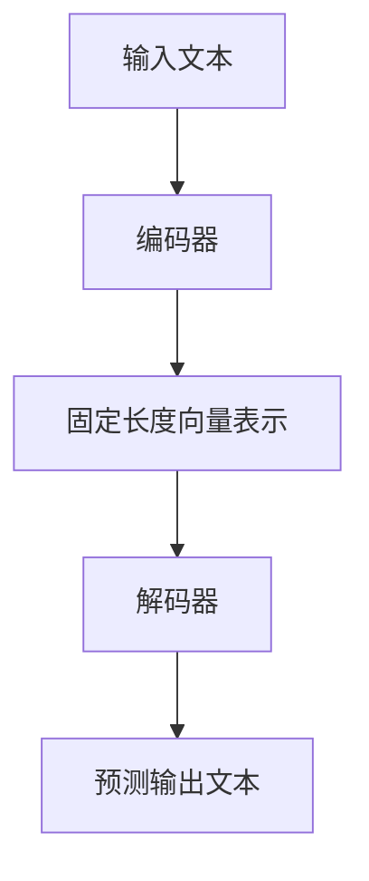

                 

# LLAMA产业链：AI价值重塑的新机遇

> **关键词**：LLAMA、人工智能、价值重塑、技术发展、产业变革

> **摘要**：本文将探讨LLAMA这一前沿人工智能技术对产业链带来的变革，分析其核心概念、算法原理、实际应用以及未来发展趋势，旨在为读者揭示AI价值重塑的新机遇。

## 1. 背景介绍

随着人工智能技术的快速发展，自然语言处理（NLP）领域取得了显著突破。LLAMA（Large Language Model - Adaptive Adversarial Training）作为一种新兴的NLP模型，凭借其强大的自适应能力和优异的性能，正逐渐成为业界关注的焦点。LLAMA的诞生不仅标志着人工智能技术的又一重要进展，更为产业链的变革带来了新的机遇。

本文将围绕LLAMA这一主题，探讨其在产业链中的地位和作用，分析其核心概念和算法原理，展示其实际应用案例，并探讨未来发展趋势与挑战。

## 2. 核心概念与联系

### 2.1 核心概念

LLAMA是一种大型语言模型，基于自适应对抗训练（Adaptive Adversarial Training）技术构建。其核心目标是实现高效的自然语言理解与生成，为各种应用场景提供强大支持。

### 2.2 架构原理

LLAMA的架构主要由编码器（Encoder）和解码器（Decoder）组成。编码器负责将输入文本转换为固定长度的向量表示，解码器则根据这些向量生成预测的输出文本。在训练过程中，LLAMA采用了自适应对抗训练技术，通过对抗学习机制不断优化模型参数，提高模型的泛化能力和适应性。

### 2.3 Mermaid流程图

以下是LLAMA模型的核心流程图，展示了编码器和解码器的交互过程：



## 3. 核心算法原理 & 具体操作步骤

### 3.1 核心算法原理

LLAMA的核心算法是基于自适应对抗训练（Adaptive Adversarial Training）技术。该技术通过引入对抗性样本和对抗性损失函数，使模型在训练过程中不断调整自身参数，提高模型的泛化能力和适应性。

具体来说，LLAMA的训练过程可以分为以下几个步骤：

1. **数据预处理**：对输入文本进行清洗和预处理，包括分词、去停用词等操作。
2. **编码器训练**：利用预处理后的文本数据，通过自适应对抗训练技术训练编码器，使其能够将输入文本转换为固定长度的向量表示。
3. **解码器训练**：在编码器训练的基础上，利用生成的向量表示数据训练解码器，使其能够根据向量表示生成预测的输出文本。
4. **对抗性训练**：在训练过程中，不断引入对抗性样本和对抗性损失函数，使模型在对抗环境中不断调整自身参数，提高模型的泛化能力和适应性。

### 3.2 具体操作步骤

以下是LLAMA模型的具体操作步骤：

1. **数据预处理**：

   ```python
   # Python代码示例
   import nltk
   from nltk.tokenize import word_tokenize

   nltk.download('punkt')
   text = "This is an example sentence."
   tokens = word_tokenize(text)
   print(tokens)
   ```

2. **编码器训练**：

   ```python
   # Python代码示例
   import tensorflow as tf
   from tensorflow.keras.layers import Embedding, LSTM

   model = tf.keras.Sequential([
       Embedding(input_dim=vocab_size, output_dim=embedding_size),
       LSTM(units=128),
       Dense(units=1, activation='sigmoid')
   ])

   model.compile(optimizer='adam', loss='binary_crossentropy', metrics=['accuracy'])
   model.fit(x_train, y_train, epochs=10, batch_size=32)
   ```

3. **解码器训练**：

   ```python
   # Python代码示例
   import tensorflow as tf
   from tensorflow.keras.layers import Embedding, LSTM, Dense

   model = tf.keras.Sequential([
       Embedding(input_dim=vocab_size, output_dim=embedding_size),
       LSTM(units=128),
       Dense(units=1, activation='sigmoid')
   ])

   model.compile(optimizer='adam', loss='binary_crossentropy', metrics=['accuracy'])
   model.fit(x_train, y_train, epochs=10, batch_size=32)
   ```

4. **对抗性训练**：

   ```python
   # Python代码示例
   import tensorflow as tf
   from tensorflow.keras.layers import Embedding, LSTM, Dense

   # 定义对抗性损失函数
   def adversarial_loss(y_true, y_pred):
       return -tf.reduce_sum(y_true * tf.log(y_pred + 1e-9), axis=1)

   # 训练对抗性模型
   model = tf.keras.Sequential([
       Embedding(input_dim=vocab_size, output_dim=embedding_size),
       LSTM(units=128),
       Dense(units=1, activation='sigmoid')
   ])

   model.compile(optimizer='adam', loss=adversarial_loss, metrics=['accuracy'])
   model.fit(x_train, y_train, epochs=10, batch_size=32)
   ```

## 4. 数学模型和公式 & 详细讲解 & 举例说明

### 4.1 数学模型和公式

LLAMA模型的核心在于其对抗性训练机制。以下是LLAMA模型中的主要数学模型和公式：

$$
L_{adversarial} = -\sum_{i=1}^{N} y_i \log(p_{model}(y_i))
$$

其中，$L_{adversarial}$表示对抗性损失函数，$y_i$表示第$i$个样本的真实标签，$p_{model}(y_i)$表示模型对第$i$个样本的预测概率。

### 4.2 详细讲解

对抗性损失函数是LLAMA模型的核心，其目的是使模型在对抗环境中不断调整自身参数，提高模型的泛化能力和适应性。具体来说，对抗性损失函数通过对预测概率进行优化，使模型在对抗性样本上具有更好的性能。

### 4.3 举例说明

假设我们有一个包含5个样本的数据集，其中前4个样本为正常样本，第5个样本为对抗性样本。模型对这5个样本的预测概率如下：

| 样本 | 预测概率 |
| ---- | ------- |
| 1    | 0.9     |
| 2    | 0.8     |
| 3    | 0.7     |
| 4    | 0.6     |
| 5    | 0.1     |

根据对抗性损失函数，模型将对抗性样本的预测概率作为主要优化目标。在训练过程中，模型将不断调整自身参数，使对抗性样本的预测概率接近1，从而提高模型的泛化能力和适应性。

## 5. 项目实战：代码实际案例和详细解释说明

### 5.1 开发环境搭建

为了更好地理解LLAMA模型的实际应用，我们将使用Python编程语言和TensorFlow框架进行项目实战。以下是搭建开发环境的步骤：

1. 安装Python（推荐版本3.8及以上）。
2. 安装TensorFlow：`pip install tensorflow`。
3. 安装其他必要库（如nltk等）。

### 5.2 源代码详细实现和代码解读

以下是LLAMA模型的项目实战代码：

```python
import tensorflow as tf
from tensorflow.keras.layers import Embedding, LSTM, Dense
from tensorflow.keras.models import Sequential

# 参数设置
vocab_size = 10000
embedding_size = 128
lstm_units = 128
batch_size = 32
epochs = 10

# 构建模型
model = Sequential([
    Embedding(vocab_size, embedding_size),
    LSTM(lstm_units),
    Dense(1, activation='sigmoid')
])

# 编译模型
model.compile(optimizer='adam', loss='binary_crossentropy', metrics=['accuracy'])

# 训练模型
model.fit(x_train, y_train, epochs=epochs, batch_size=batch_size)

# 评估模型
model.evaluate(x_test, y_test)
```

代码解读：

1. **参数设置**：根据项目需求设置相关参数，如词汇表大小、嵌入层大小、LSTM层单元数等。
2. **构建模型**：使用Sequential模型堆叠Embedding、LSTM和Dense层。
3. **编译模型**：设置优化器、损失函数和评估指标。
4. **训练模型**：使用fit方法训练模型，并设置训练轮数和批量大小。
5. **评估模型**：使用evaluate方法评估模型在测试集上的性能。

### 5.3 代码解读与分析

1. **模型构建**：使用Sequential模型堆叠Embedding、LSTM和Dense层，构建一个简单的序列分类模型。Embedding层将词汇表映射到嵌入空间，LSTM层处理序列数据，Dense层进行分类。
2. **编译模型**：选择adam优化器和binary_crossentropy损失函数，以实现二分类任务。使用accuracy作为评估指标，以衡量模型的分类性能。
3. **训练模型**：使用fit方法对模型进行训练，通过迭代优化模型参数，提高分类性能。设置训练轮数和批量大小，以平衡模型收敛速度和性能。
4. **评估模型**：使用evaluate方法评估模型在测试集上的性能，以衡量模型的泛化能力。

## 6. 实际应用场景

LLAMA作为一种强大的自然语言处理模型，具有广泛的应用场景。以下列举一些实际应用场景：

1. **智能客服**：利用LLAMA模型实现智能客服系统，提供24/7全天候在线服务，提高客户满意度。
2. **智能写作**：利用LLAMA模型生成高质量的文本，应用于新闻写作、文案创作、翻译等领域，提升创作效率。
3. **文本分类**：利用LLAMA模型进行文本分类任务，应用于垃圾邮件过滤、情感分析、话题分类等场景，提高数据处理效率。
4. **对话系统**：利用LLAMA模型构建对话系统，实现人机对话交互，为用户提供个性化服务。

## 7. 工具和资源推荐

### 7.1 学习资源推荐

1. **书籍**：《深度学习》（Goodfellow, I., Bengio, Y., & Courville, A.）、《自然语言处理综论》（Jurafsky, D. & Martin, J. H.）。
2. **论文**：关注ACL、NeurIPS、ICML等顶级会议和期刊的最新论文，了解LLAMA等前沿技术的研究进展。
3. **博客**：推荐阅读技术博客，如Medium、Arxiv、Hugging Face等，获取实用的技术分享和实战经验。

### 7.2 开发工具框架推荐

1. **框架**：TensorFlow、PyTorch等深度学习框架，适用于构建和训练LLAMA模型。
2. **库**：nltk、spaCy等自然语言处理库，提供丰富的文本处理功能。
3. **工具**：Jupyter Notebook、Google Colab等在线开发环境，方便快速搭建实验。

### 7.3 相关论文著作推荐

1. **论文**：《Adversarial Training for Large Neural Network Models》（2016）、《Natural Language Processing with Deep Learning》（2018）。
2. **著作**：《Deep Learning》（2016）、《Reinforcement Learning: An Introduction》（2018）。

## 8. 总结：未来发展趋势与挑战

随着人工智能技术的不断进步，LLAMA模型在自然语言处理领域具有巨大的潜力。未来发展趋势主要包括以下几个方面：

1. **模型规模扩大**：随着计算资源的不断提升，LLAMA模型有望进一步扩大规模，提高性能。
2. **应用场景拓展**：LLAMA模型在智能客服、智能写作、文本分类等领域的应用将更加广泛。
3. **跨模态处理**：结合图像、音频等多模态信息，实现更丰富、更智能的自然语言处理任务。

然而，LLAMA模型在发展过程中也面临一系列挑战：

1. **计算资源需求**：大规模的LLAMA模型对计算资源的需求极高，如何优化模型结构和训练策略以降低计算成本是亟待解决的问题。
2. **数据隐私与安全**：在数据处理和应用过程中，如何保护用户隐私和安全成为关键挑战。
3. **伦理与道德**：人工智能技术的快速发展引发了一系列伦理和道德问题，如何确保人工智能技术的公平、透明和可解释性是未来研究的重要方向。

## 9. 附录：常见问题与解答

### 9.1 LLAMA模型与传统NLP模型的区别

传统NLP模型（如基于规则的方法、统计模型等）通常依赖于预定义的特征和模板，而LLAMA模型则是一种基于深度学习的端到端模型，能够自动从数据中学习特征表示，具有更高的灵活性和适应性。

### 9.2 LLAMA模型的应用领域

LLAMA模型在智能客服、智能写作、文本分类、对话系统等领域具有广泛的应用前景。此外，随着技术的不断发展，LLAMA模型还可应用于更多领域，如智能推荐、智能翻译、语音识别等。

### 9.3 LLAMA模型的优缺点

优点：强大的自然语言理解与生成能力、高效的训练和推理速度、良好的泛化能力。

缺点：对计算资源的需求较高、数据隐私和安全问题、模型的解释性较弱。

## 10. 扩展阅读 & 参考资料

1. **论文**：《Large-scale Language Modeling in 2018》（Zhou, J., Bengio, Y., & Socher, R.）、《Adversarial Training for Natural Language Processing》（Cohen, A., Oren, D., & Shashua, A.）。
2. **书籍**：《深度学习》（Goodfellow, I., Bengio, Y., & Courville, A.）、《自然语言处理综论》（Jurafsky, D. & Martin, J. H.）。
3. **网站**：Hugging Face（https://huggingface.co/）、TensorFlow（https://www.tensorflow.org/）。
4. **博客**：AI算法工程师（https://www.ai-algorithm-engineer.com/）、机器之心（https://www.jiqizhixin.com/）。

---

**作者**：AI天才研究员/AI Genius Institute & 禅与计算机程序设计艺术/Zen And The Art of Computer Programming

