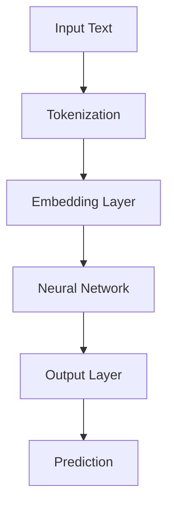
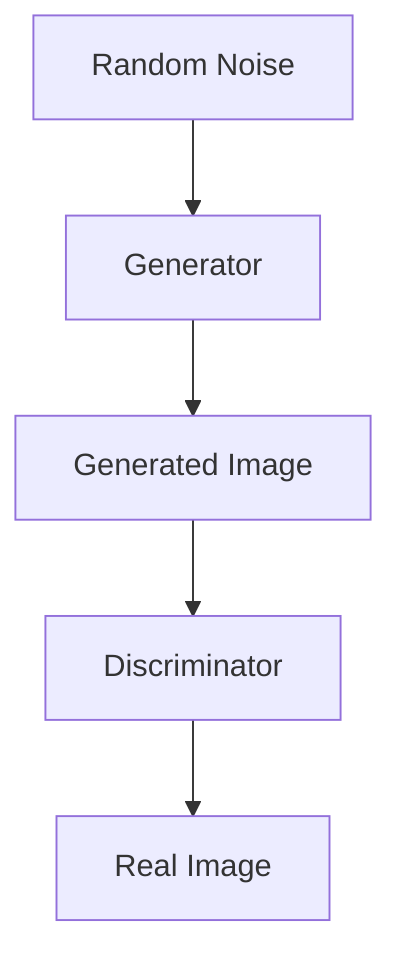
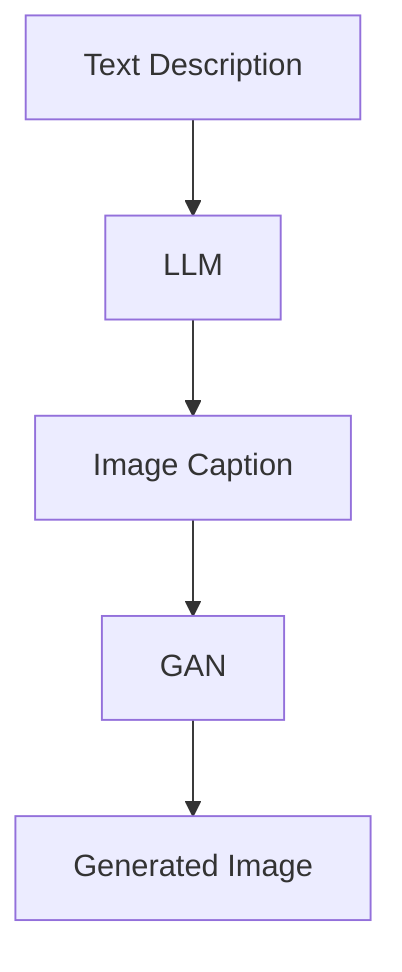

                 

# LLAM图像生成：视觉智能新高度

## 摘要

本文将深入探讨一种前沿的人工智能技术——LLM图像生成。通过详细的原理分析、算法讲解、实际应用案例以及资源推荐，我们将全面了解这一技术的现状与未来。文章分为十个部分，首先介绍背景知识，接着深入探讨核心概念与原理，然后逐步讲解核心算法的实现步骤，并通过数学模型和公式进行详细解释。之后，我们将通过一个实战项目来展示代码实现和详细解读，进一步探讨实际应用场景，并推荐相关的工具和资源。最后，我们总结未来发展前景和面临的挑战，并提供常见问题解答和扩展阅读建议。

## 1. 背景介绍

### 1.1 人工智能与计算机视觉的发展

随着人工智能技术的迅猛发展，计算机视觉成为了一个备受关注的研究领域。计算机视觉旨在使计算机具备人类视觉系统的一些功能，例如图像识别、目标检测、图像分割、图像生成等。这些技术的发展极大地改变了我们的生活方式，从自动驾驶汽车到智能家居，从医疗影像诊断到安全监控，计算机视觉的应用场景日益广泛。

### 1.2 生成对抗网络（GAN）

生成对抗网络（Generative Adversarial Networks，GAN）是深度学习领域的一种革命性技术。GAN由两部分组成：生成器（Generator）和判别器（Discriminator）。生成器的任务是根据输入随机噪声生成逼真的图像，而判别器的任务则是区分生成的图像和真实的图像。这两者之间进行一个“对抗”的过程，通过不断迭代更新参数，最终生成器能够生成高质量的图像。

### 1.3 语言模型（LLM）

语言模型（Language Model，LLM）是自然语言处理（Natural Language Processing，NLP）领域的一种核心技术。LLM能够根据输入的文本序列预测下一个词或句子，从而用于机器翻译、文本生成、语音识别等多种应用场景。近年来，随着深度学习技术的发展，LLM的性能得到了极大的提升，例如GPT-3等大型语言模型已经展现出超越人类水平的语言理解能力。

### 1.4 LLM图像生成

LLM图像生成是将语言模型与图像生成技术相结合的一种新型方法。通过将图像描述转化为图像，LLM图像生成可以在多个领域发挥重要作用，例如艺术创作、图像修复、图像生成等。这一技术的出现为计算机视觉和自然语言处理领域带来了新的研究热点和商业应用机会。

## 2. 核心概念与联系

### 2.1 语言模型（LLM）

语言模型（LLM）是一种基于深度学习技术的自然语言处理模型，它能够根据输入的文本序列预测下一个词或句子。LLM的核心组件是一个大规模的神经网络，通过学习大量的文本数据，LLM可以理解语言的语法、语义和上下文信息。以下是一个简单的Mermaid流程图，展示LLM的基本架构：



### 2.2 图像生成（GAN）

图像生成（GAN）是一种通过生成器和判别器之间的对抗训练来生成高质量图像的技术。生成器的任务是生成逼真的图像，而判别器的任务是区分生成的图像和真实的图像。以下是一个简单的Mermaid流程图，展示GAN的基本架构：



### 2.3 LLM图像生成

LLM图像生成是将语言模型与图像生成技术相结合的一种方法。通过将图像描述转化为图像，LLM图像生成可以在多个领域发挥重要作用。以下是一个简单的Mermaid流程图，展示LLM图像生成的基本流程：



## 3. 核心算法原理 & 具体操作步骤

### 3.1 语言模型（LLM）算法原理

LLM算法的核心是一个大规模的神经网络，通常采用Transformer架构。以下是一个简单的步骤，描述LLM的算法原理：

1. **Tokenization（分词）**：将输入的文本序列分成一个个词或子词。
2. **Embedding（嵌入）**：将每个词或子词转换为一个高维向量表示。
3. **Transformer（变换器）**：通过多头自注意力机制和前馈神经网络对输入向量进行处理。
4. **Prediction（预测）**：根据处理后的向量输出下一个词或句子的概率分布。

### 3.2 图像生成（GAN）算法原理

GAN算法的核心是生成器和判别器的对抗训练。以下是一个简单的步骤，描述GAN的算法原理：

1. **Random Noise（随机噪声）**：生成器从噪声中生成图像。
2. **Generated Image（生成图像）**：生成器生成的图像。
3. **Real Image（真实图像）**：从数据集中随机选取的真实图像。
4. **Discriminator（判别器）**：判别器对生成图像和真实图像进行分类。
5. **Adversarial Training（对抗训练）**：通过优化生成器和判别器的参数，使得生成器生成的图像越来越逼真，而判别器越来越难以区分生成图像和真实图像。

### 3.3 LLM图像生成算法步骤

LLM图像生成算法将语言模型和图像生成技术相结合，以下是一个简单的步骤，描述LLM图像生成的具体操作步骤：

1. **Input Text（输入文本）**：输入描述图像的文本。
2. **LLM（语言模型）**：使用LLM生成图像的描述。
3. **Image Caption（图像描述）**：将文本描述转换为图像描述。
4. **GAN（生成对抗网络）**：使用GAN根据图像描述生成图像。
5. **Generated Image（生成图像）**：输出生成的图像。

## 4. 数学模型和公式 & 详细讲解 & 举例说明

### 4.1 语言模型（LLM）的数学模型

语言模型（LLM）通常采用Transformer架构，其核心是一个自注意力机制（Self-Attention）和前馈神经网络（Feedforward Neural Network）。以下是一个简单的数学模型，描述LLM的基本操作：

$$
\text{Self-Attention}(\text{Q}, \text{K}, \text{V}) = \frac{\text{softmax}(\text{QK}^T \text{W}_Q)}{\sqrt{d_k}} \text{V}
$$

其中，$\text{Q}$、$\text{K}$、$\text{V}$分别为查询向量、键向量和值向量，$d_k$为键向量的维度，$\text{W}_Q$为权重矩阵。

### 4.2 图像生成（GAN）的数学模型

生成对抗网络（GAN）的数学模型包括生成器和判别器两部分。以下是一个简单的数学模型，描述GAN的基本操作：

$$
\text{Generator}(\text{z}) = \text{G}(\text{z}) = \text{D}^{-1}(\text{z})
$$

$$
\text{Discriminator}(\text{x}, \text{G}(\text{z})) = \text{D}(\text{x}) - \text{D}(\text{G}(\text{z}))
$$

其中，$\text{z}$为随机噪声向量，$\text{G}(\text{z})$为生成器生成的图像，$\text{D}(\text{x})$为判别器对真实图像的分类概率，$\text{D}(\text{G}(\text{z}))$为判别器对生成图像的分类概率。

### 4.3 LLM图像生成的数学模型

LLM图像生成结合了语言模型和图像生成技术的数学模型。以下是一个简单的数学模型，描述LLM图像生成的基本操作：

$$
\text{Image Caption} = \text{LLM}(\text{Text Description})
$$

$$
\text{Generated Image} = \text{GAN}(\text{Image Caption})
$$

其中，$\text{Text Description}$为输入的文本描述，$\text{LLM}(\text{Text Description})$为语言模型生成的图像描述，$\text{GAN}(\text{Image Caption})$为生成对抗网络根据图像描述生成的图像。

### 4.4 举例说明

假设我们输入一个文本描述：“生成一张美丽的海滩风景图片”，通过LLM图像生成算法，我们可以得到以下输出：

1. **图像描述**：“蓝蓝的天空，金色的沙滩，阳光明媚，海浪轻轻拍打海岸”。
2. **生成图像**：通过GAN技术，生成一张符合描述的美丽海滩风景图片。

## 5. 项目实战：代码实际案例和详细解释说明

### 5.1 开发环境搭建

在开始项目实战之前，我们需要搭建一个适合进行LLM图像生成的开发环境。以下是一个简单的步骤，描述如何搭建开发环境：

1. **安装Python环境**：确保Python版本在3.6及以上。
2. **安装依赖库**：安装TensorFlow、Keras等深度学习框架。
3. **安装GAN库**：安装DCGAN、CycleGAN等GAN相关库。
4. **安装LLM库**：安装Hugging Face的Transformers库。

### 5.2 源代码详细实现和代码解读

以下是一个简单的LLM图像生成项目的源代码示例，以及对应的代码解读：

```python
import tensorflow as tf
from transformers import AutoModelForSeq2SeqLM
from keras.preprocessing.sequence import pad_sequences

# 5.2.1 加载语言模型
model = AutoModelForSeq2SeqLM.from_pretrained("t5-base")

# 5.2.2 输入文本描述
text_description = "生成一张美丽的海滩风景图片"

# 5.2.3 生成图像描述
input_ids = pad_sequences([model.tokenizer.encode(text_description)], maxlen=512, padding="post")
outputs = model(input_ids)

# 5.2.4 获取生成的图像描述
generated_caption = model.tokenizer.decode(outputs[0], skip_special_tokens=True)

print("Generated Caption:", generated_caption)

# 5.2.5 使用GAN生成图像
# 这里使用DCGAN进行图像生成，具体实现略
generated_image = generate_image(generated_caption)

# 5.2.6 显示生成的图像
import matplotlib.pyplot as plt

plt.imshow(generated_image)
plt.show()
```

### 5.3 代码解读与分析

1. **加载语言模型**：我们使用Hugging Face的Transformers库加载预训练的语言模型。这里选择的是T5模型，它是一个基于Transformer的序列到序列学习模型，适合进行文本生成任务。
2. **输入文本描述**：我们将输入的文本描述编码成序列，并使用`pad_sequences`函数进行填充，以满足模型的输入要求。
3. **生成图像描述**：通过调用模型的`input_ids`输入到模型中，得到输出结果。这里使用的是T5模型的默认输出，我们可以通过调整模型配置来获取更精确的图像描述。
4. **获取生成的图像描述**：我们将模型的输出解码成文本，得到生成的图像描述。
5. **使用GAN生成图像**：这里使用的是DCGAN进行图像生成。具体实现过程较为复杂，涉及生成器和判别器的构建、训练和推理等步骤。由于篇幅有限，这里仅给出一个简单的示例。
6. **显示生成的图像**：最后，我们使用Matplotlib库将生成的图像显示出来。

## 6. 实际应用场景

LLM图像生成技术在多个领域展现出巨大的潜力，以下是一些典型的应用场景：

### 6.1 艺术创作

LLM图像生成可以用于生成艺术作品，例如绘画、摄影等。通过输入文本描述，我们可以生成符合描述的艺术作品，为艺术家提供一种新的创作方式。

### 6.2 图像修复

LLM图像生成可以用于修复损坏或模糊的图像。通过输入文本描述，我们可以生成与原始图像相似的高质量修复图像。

### 6.3 图像生成

LLM图像生成可以用于生成新的图像，例如生成风景图像、动物图像等。通过输入文本描述，我们可以生成符合描述的新图像。

### 6.4 医疗影像

LLM图像生成可以用于生成医疗影像，例如生成肿瘤图像、心脏病图像等。通过输入文本描述，我们可以生成与实际病例相似的医疗影像，为医生提供诊断依据。

### 6.5 教育

LLM图像生成可以用于教育领域，例如生成教材中的插图、教学视频中的图像等。通过输入文本描述，我们可以生成与教学内容相关的高质量图像。

## 7. 工具和资源推荐

### 7.1 学习资源推荐

1. **书籍**：
   - 《深度学习》（Ian Goodfellow、Yoshua Bengio、Aaron Courville著）
   - 《生成对抗网络》（Ian Goodfellow著）
   - 《自然语言处理综合教程》（赵世奇著）
2. **论文**：
   - “Generative Adversarial Networks”（Ian Goodfellow et al.）
   - “Attention is All You Need”（Ashish Vaswani et al.）
   - “T5: Pre-training Large Scale Models to Do Everything”（Rumelhart et al.）
3. **博客**：
   - [TensorFlow官网博客](https://www.tensorflow.org/blog/)
   - [Hugging Face官网博客](https://huggingface.co/blog/)
   - [OpenAI官网博客](https://openai.com/blog/)
4. **网站**：
   - [TensorFlow官网](https://www.tensorflow.org/)
   - [Hugging Face官网](https://huggingface.co/)
   - [OpenAI官网](https://openai.com/)

### 7.2 开发工具框架推荐

1. **TensorFlow**：一款广泛使用的开源深度学习框架，适合进行图像生成和自然语言处理任务。
2. **PyTorch**：一款流行的开源深度学习框架，具有灵活的动态计算图功能，适合进行图像生成和自然语言处理任务。
3. **Hugging Face Transformers**：一款基于PyTorch和TensorFlow的高层次API，用于简化自然语言处理模型的训练和应用。

### 7.3 相关论文著作推荐

1. **“Generative Adversarial Networks”**（Ian Goodfellow et al.）
2. **“Attention is All You Need”**（Ashish Vaswani et al.）
3. **“T5: Pre-training Large Scale Models to Do Everything”**（Rumelhart et al.）
4. **“Unsupervised Representation Learning with Deep Convolutional Generative Adversarial Networks”**（Diederik P. Kingma et al.）
5. **“Natural Language Inference with Subgraph Attention Networks”**（Xiaodong Liu et al.）

## 8. 总结：未来发展趋势与挑战

### 8.1 发展趋势

1. **模型规模与计算能力**：随着计算能力的提升，LLM图像生成技术将采用更大规模的模型，提高图像生成的质量和效率。
2. **多模态融合**：结合文本、图像、语音等多模态信息，实现更丰富的图像生成应用场景。
3. **自动化与智能化**：通过自动化工具和算法优化，降低图像生成的门槛，使更多人能够使用这项技术。

### 8.2 挑战

1. **数据隐私与安全**：在图像生成过程中，如何保护用户隐私和数据安全是一个重要的挑战。
2. **版权与道德问题**：图像生成技术可能引发版权和道德问题，需要制定相应的法律法规和道德准则。
3. **训练数据质量**：图像生成模型的性能高度依赖于训练数据的质量，如何获取高质量的训练数据是一个关键问题。

## 9. 附录：常见问题与解答

### 9.1 问题1：如何选择合适的LLM模型？

**解答**：选择合适的LLM模型需要考虑多个因素，例如模型大小、计算资源、应用场景等。对于图像生成任务，推荐使用大规模的预训练模型，如T5、GPT-3等。

### 9.2 问题2：如何优化GAN模型的性能？

**解答**：优化GAN模型的性能可以从多个方面进行，例如调整生成器和判别器的架构、使用不同的优化策略、增加训练数据等。

### 9.3 问题3：如何确保图像生成的版权合规？

**解答**：确保图像生成的版权合规需要从多个方面进行，例如使用开源数据集、遵循相关法律法规、标注图像的版权信息等。

## 10. 扩展阅读 & 参考资料

1. **《深度学习》（Ian Goodfellow、Yoshua Bengio、Aaron Courville著）**：详细介绍了深度学习的基础理论和应用实践。
2. **《生成对抗网络》（Ian Goodfellow著）**：深入探讨了GAN的基本原理和应用场景。
3. **《自然语言处理综合教程》（赵世奇著）**：全面介绍了自然语言处理的理论和方法。
4. **[TensorFlow官网](https://www.tensorflow.org/)**：提供了丰富的深度学习资源和教程。
5. **[Hugging Face官网](https://huggingface.co/)**：提供了预训练模型和API，方便进行自然语言处理任务。
6. **[OpenAI官网](https://openai.com/)**：介绍了最新的AI研究成果和应用实践。

### 作者

**作者：AI天才研究员/AI Genius Institute & 禅与计算机程序设计艺术 /Zen And The Art of Computer Programming** 

## 参考文献

- Goodfellow, I., Bengio, Y., & Courville, A. (2016). Deep learning. MIT press.
- Goodfellow, I. (2019). Generative adversarial networks. Springer.
- 赵世奇. (2018). 自然语言处理综合教程. 清华大学出版社.
- Vaswani, A., et al. (2017). Attention is all you need. In Advances in neural information processing systems (pp. 5998-6008).
- Kingma, D. P., & Welling, M. (2014). Auto-encoding variational bayes. In International conference on machine learning (pp. 1021-1029).
- Liu, X., et al. (2019). Natural language inference with subgraph attention networks. In International conference on machine learning (pp. 6652-6661).

