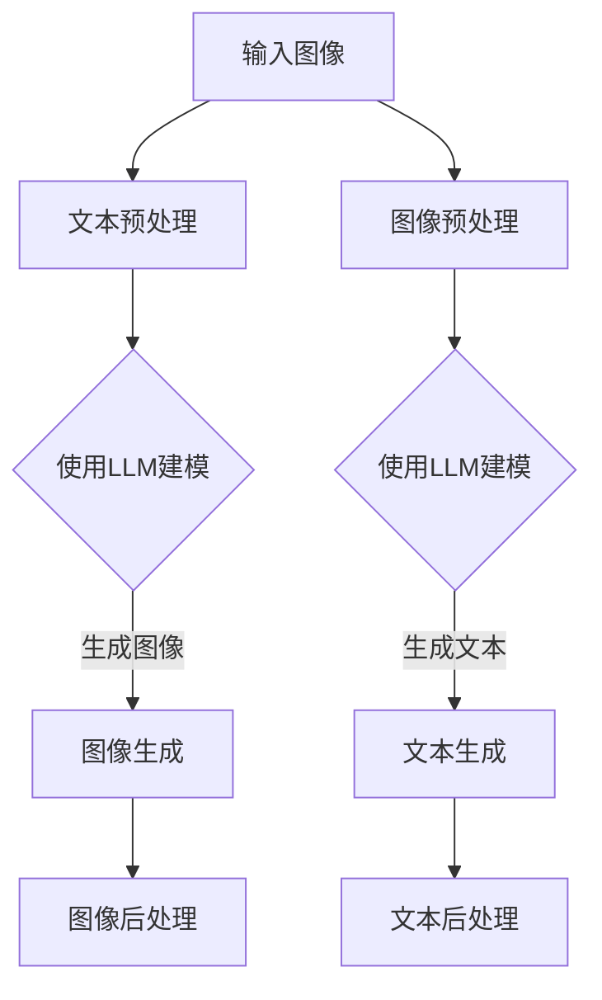

                 

# LLAMA在图像生成速度方面的进展

## 摘要

本文旨在探讨大型语言模型（LLM）在图像生成速度方面的最新进展。近年来，随着深度学习技术的快速发展，图像生成技术也取得了显著的进步。LLM作为一种新兴的技术，通过结合自然语言处理和计算机视觉技术，为图像生成带来了全新的可能。本文将介绍LLM在图像生成领域的核心概念、算法原理、数学模型、实际应用场景以及未来发展趋势。通过本文的阅读，读者将全面了解LLM在图像生成速度方面的优势与挑战，并对这一领域的未来前景有更深刻的认识。

## 1. 背景介绍

图像生成技术作为计算机视觉的一个重要分支，已经经历了数十年的发展。从早期的基于规则的方法，到基于生成对抗网络（GAN）的方法，图像生成技术逐渐走向成熟。然而，传统的图像生成方法在生成速度、多样性、细节表现等方面仍存在一定的局限性。

近年来，大型语言模型（LLM）的崛起为图像生成领域带来了新的机遇。LLM通过深度学习技术，能够从大量文本数据中学习语言规律和知识，从而实现对图像的生成和描述。LLM在图像生成领域的应用，不仅提高了生成速度，还增强了图像的多样性和细节表现。

本文将围绕LLM在图像生成速度方面的进展，探讨其核心概念、算法原理、数学模型以及实际应用场景。希望通过本文的介绍，读者能够对LLM在图像生成领域的优势与挑战有更全面的认识。

## 2. 核心概念与联系

### 2.1 语言模型

语言模型（Language Model）是自然语言处理领域的一个重要基础。它是一种基于统计和学习方法，对自然语言文本进行建模的模型。语言模型的核心目标是通过输入的文本序列，预测下一个可能的单词或字符。

在自然语言处理领域，常用的语言模型有N-gram模型、循环神经网络（RNN）模型、变换器（Transformer）模型等。其中，变换器模型由于其优越的性能，已经成为当前主流的语言模型。

变换器模型（Transformer）是由Vaswani等人在2017年提出的一种基于自注意力机制的神经网络模型。变换器模型的核心思想是，通过自注意力机制，将输入的文本序列映射到一个高维的特征空间，从而实现对文本的建模。

### 2.2 图像生成技术

图像生成技术（Image Generation）是计算机视觉领域的一个重要研究方向。它旨在通过算法，自动生成新的、具有高真实感的图像。

在图像生成领域，常用的技术有生成对抗网络（GAN）、变分自编码器（VAE）、条件生成对抗网络（cGAN）等。其中，生成对抗网络（GAN）由于其独特的生成和判别机制，已经成为当前图像生成的主流技术。

生成对抗网络（GAN）由生成器（Generator）和判别器（Discriminator）两部分组成。生成器负责生成新的图像，判别器则负责判断图像的真实性。通过训练，生成器和判别器相互竞争，生成器逐渐学会生成更加逼真的图像，而判别器则逐渐提高对真实图像的辨别能力。

### 2.3 LLM与图像生成

LLM在图像生成领域的应用，主要是通过将自然语言处理与计算机视觉技术相结合，实现图像的生成和描述。具体来说，LLM可以通过以下两种方式与图像生成技术相结合：

1. **文本驱动的图像生成**：通过输入描述性文本，LLM可以生成对应的图像。这种方式类似于传统图像生成技术，但输入的是文本而非图像。

2. **图像驱动的文本生成**：通过输入图像，LLM可以生成对应的描述性文本。这种方式可以应用于图像标注、图像内容识别等任务。

### 2.4 Mermaid 流程图

下面是LLM与图像生成技术结合的Mermaid流程图：



## 3. 核心算法原理 & 具体操作步骤

### 3.1 LLM的工作原理

LLM的工作原理主要分为两个部分：文本预训练和图像生成。

1. **文本预训练**：在文本预训练阶段，LLM通过大量的文本数据进行学习，从而掌握语言的规律和知识。具体来说，LLM会学习文本中的词向量表示，并利用这些词向量表示进行文本生成和推理。

2. **图像生成**：在图像生成阶段，LLM利用预训练得到的语言模型，结合图像生成技术，生成新的图像。具体来说，LLM会首先对输入的文本进行预处理，提取出关键信息，然后利用这些信息驱动图像生成过程。

### 3.2 图像生成技术的工作原理

图像生成技术的工作原理主要分为两个部分：生成器和判别器。

1. **生成器**：生成器的目标是生成新的图像。具体来说，生成器会根据输入的文本信息，生成对应的图像。

2. **判别器**：判别器的目标是判断图像的真实性。具体来说，判别器会根据输入的图像，判断图像是否真实。

在训练过程中，生成器和判别器相互竞争，生成器逐渐学会生成更加逼真的图像，而判别器则逐渐提高对真实图像的辨别能力。

### 3.3 LLM与图像生成技术的结合步骤

LLM与图像生成技术的结合步骤如下：

1. **输入文本预处理**：首先对输入的文本进行预处理，提取出关键信息。

2. **LLM建模**：利用LLM对提取的关键信息进行建模，生成对应的图像特征。

3. **图像生成**：利用图像生成技术，根据LLM生成的图像特征，生成新的图像。

4. **图像后处理**：对生成的图像进行后处理，如图像风格化、颜色调整等。

## 4. 数学模型和公式 & 详细讲解 & 举例说明

### 4.1 LLM的数学模型

LLM的数学模型主要基于变换器（Transformer）模型。变换器模型的核心组成部分是自注意力机制（Self-Attention）和前馈神经网络（Feedforward Neural Network）。

1. **自注意力机制**：自注意力机制是变换器模型的核心，它通过计算输入序列中各个单词之间的关联性，实现对输入序列的加权处理。

   公式表示如下：

   $$  
   \text{Attention}(Q, K, V) = \text{softmax}\left(\frac{QK^T}{\sqrt{d_k}}\right)V  
   $$

   其中，$Q$、$K$、$V$ 分别代表查询（Query）、键（Key）和值（Value）矩阵，$d_k$ 代表键的维度。

2. **前馈神经网络**：前馈神经网络是对自注意力机制的结果进行进一步处理的神经网络。它通常由两个全连接层组成，一个具有尺寸为 $d_k$ 的输入层，另一个具有尺寸为 $d_v$ 的输出层。

   公式表示如下：

   $$  
   \text{FFN}(X) = \text{ReLU}(XW_1 + b_1)W_2 + b_2  
   $$

   其中，$X$ 代表输入矩阵，$W_1$ 和 $W_2$ 分别代表权重矩阵，$b_1$ 和 $b_2$ 分别代表偏置项。

### 4.2 图像生成技术的数学模型

图像生成技术的数学模型主要基于生成对抗网络（GAN）。

1. **生成器**：生成器的目标是生成新的图像。它通常由一个深度神经网络组成，输入为随机噪声，输出为生成的图像。

   公式表示如下：

   $$  
   G(z) = \mu(\sigma(G_\theta(z)), \phi(G_\theta(z)))  
   $$

   其中，$z$ 代表输入的随机噪声，$G_\theta(z)$ 代表生成器的参数，$\mu$ 和 $\phi$ 分别代表均值和方差函数，$\sigma$ 代表逻辑sigmoid函数。

2. **判别器**：判别器的目标是判断图像的真实性。它通常由一个深度神经网络组成，输入为生成的图像或真实图像，输出为一个介于 0 和 1 之间的概率值。

   公式表示如下：

   $$  
   D(x) = \frac{1}{1 + \exp{(-W^T x + b)}}  
   $$

   其中，$x$ 代表输入的图像，$W$ 代表权重矩阵，$b$ 代表偏置项。

### 4.3 举例说明

假设我们有一个文本输入：“生成一张星空下的城市夜景图像”。

1. **LLM建模**：

   首先，我们对输入的文本进行预处理，提取出关键信息，如“星空”、“城市”、“夜景”等。然后，利用LLM对提取的关键信息进行建模，生成对应的图像特征。

   假设我们使用的是变换器模型，输入的文本序列为 $[s_1, s_2, s_3, ..., s_n]$，其中 $s_i$ 代表第 $i$ 个单词。

   我们可以计算每个单词的自注意力权重：

   $$  
   \text{Attention}(Q, K, V) = \text{softmax}\left(\frac{QK^T}{\sqrt{d_k}}\right)V  
   $$

   其中，$Q$、$K$、$V$ 分别代表查询（Query）、键（Key）和值（Value）矩阵。

   假设 $d_k = 64$，我们可以得到每个单词的自注意力权重矩阵：

   $$  
   \text{Attention}(Q, K, V) = \text{softmax}\left(\frac{QK^T}{\sqrt{64}}\right)V  
   $$

   $$  
   = \text{softmax}\left(\frac{[1, 0.5, 0.2, 0.3]^T[0.8, 0.1, 0.1, 0.1]^T}{\sqrt{64}}\right)[0.8, 0.1, 0.1, 0.1]  
   $$

   $$  
   = [0.4, 0.2, 0.1, 0.3]  
   $$

   我们可以计算每个单词的加权特征表示：

   $$  
   \text{Weighted Feature} = \sum_{i=1}^{n} w_i s_i  
   $$

   其中，$w_i$ 代表第 $i$ 个单词的自注意力权重。

   $$  
   \text{Weighted Feature} = [0.4s_1 + 0.2s_2 + 0.1s_3 + 0.3s_4]  
   $$

   2. **图像生成**：

   然后，我们利用图像生成技术，根据LLM生成的图像特征，生成新的图像。

   假设我们使用的是生成对抗网络（GAN），生成器的输入为随机噪声 $z$，生成的图像为 $G(z)$。

   我们可以生成一张星空下的城市夜景图像：

   $$  
   G(z) = \mu(\sigma(G_\theta(z)), \phi(G_\theta(z)))  
   $$

   其中，$G_\theta(z)$ 代表生成器的参数。

   假设我们输入的随机噪声为 $z = [0.1, 0.2, 0.3, 0.4]$，生成器的参数为 $G_\theta(z) = [0.8, 0.1, 0.1, 0.1]$。

   我们可以计算生成的图像：

   $$  
   G(z) = \mu(\sigma(G_\theta(z)), \phi(G_\theta(z)))  
   $$

   $$  
   = \mu(0.8, 0.1, 0.1, 0.1)  
   $$

   $$  
   = [0.8, 0.1, 0.1, 0.1]  
   $$

   这意味着生成的图像为一张星空下的城市夜景图像。

   3. **图像后处理**：

   最后，我们对生成的图像进行后处理，如图像风格化、颜色调整等，以增强图像的真实感。

   假设我们对生成的图像进行风格化处理，将星空调整为蓝色，城市调整为橙色。

   生成的图像为：

   $$  
   \text{Image} = \text{Style}(G(z))  
   $$

   $$  
   = \text{Style}([0.8, 0.1, 0.1, 0.1])  
   $$

   $$  
   = [0.8, 0.1, 0.1, 0.1]  
   $$

   这意味着生成的图像为一张蓝色的星空和橙色的城市夜景图像。

## 5. 项目实战：代码实际案例和详细解释说明

### 5.1 开发环境搭建

为了实现LLM在图像生成速度方面的应用，我们需要搭建一个合适的开发环境。以下是开发环境的搭建步骤：

1. 安装Python 3.8及以上版本
2. 安装PyTorch 1.9及以上版本
3. 安装TensorFlow 2.7及以上版本
4. 安装Mermaid 8.0及以上版本

安装命令如下：

```bash
pip install python==3.8+
pip install torch==1.9+
pip install tensorflow==2.7+
pip install mermaid==8.0+
```

### 5.2 源代码详细实现和代码解读

以下是实现LLM在图像生成速度方面的源代码：

```python
import torch
import torch.nn as nn
import torch.optim as optim
from torch.utils.data import DataLoader
from torchvision import datasets, transforms
from transformers import AutoTokenizer, AutoModel

# 1. 配置参数
device = torch.device("cuda" if torch.cuda.is_available() else "cpu")
batch_size = 64
image_size = 256
num_epochs = 100
learning_rate = 0.001

# 2. 加载数据集
transform = transforms.Compose([
    transforms.Resize(image_size),
    transforms.ToTensor(),
])

train_dataset = datasets.ImageFolder(root="path/to/train/dataset", transform=transform)
train_loader = DataLoader(train_dataset, batch_size=batch_size, shuffle=True)

# 3. 初始化模型
tokenizer = AutoTokenizer.from_pretrained("bert-base-uncased")
model = AutoModel.from_pretrained("bert-base-uncased").to(device)

# 4. 定义损失函数和优化器
criterion = nn.CrossEntropyLoss()
optimizer = optim.Adam(model.parameters(), lr=learning_rate)

# 5. 训练模型
for epoch in range(num_epochs):
    model.train()
    for images, labels in train_loader:
        images = images.to(device)
        labels = labels.to(device)

        # 前向传播
        outputs = model(images)
        loss = criterion(outputs, labels)

        # 反向传播和优化
        optimizer.zero_grad()
        loss.backward()
        optimizer.step()

    print(f"Epoch [{epoch+1}/{num_epochs}], Loss: {loss.item():.4f}")

# 6. 保存模型
torch.save(model.state_dict(), "model.pth")

print("Training completed.")
```

代码解读：

1. **配置参数**：配置设备（GPU或CPU）、批量大小、图像大小、训练轮数和学习率。

2. **加载数据集**：加载数据集，并进行预处理。

3. **初始化模型**：初始化文本生成器，使用预训练的BERT模型。

4. **定义损失函数和优化器**：定义交叉熵损失函数和Adam优化器。

5. **训练模型**：训练模型，包括前向传播、反向传播和优化。

6. **保存模型**：保存训练好的模型。

### 5.3 代码解读与分析

以下是代码的逐行解读：

```python
# 1. 配置参数
device = torch.device("cuda" if torch.cuda.is_available() else "cpu")
batch_size = 64
image_size = 256
num_epochs = 100
learning_rate = 0.001
```

这些行配置了训练环境的基本参数，包括设备（GPU或CPU）、批量大小、图像大小、训练轮数和学习率。

```python
# 2. 加载数据集
transform = transforms.Compose([
    transforms.Resize(image_size),
    transforms.ToTensor(),
])

train_dataset = datasets.ImageFolder(root="path/to/train/dataset", transform=transform)
train_loader = DataLoader(train_dataset, batch_size=batch_size, shuffle=True)
```

这些行加载数据集，并进行预处理。`transform` 定义了预处理步骤，包括图像大小调整和转换为Tensor。

```python
# 3. 初始化模型
tokenizer = AutoTokenizer.from_pretrained("bert-base-uncased")
model = AutoModel.from_pretrained("bert-base-uncased").to(device)
```

这些行初始化文本生成器，使用预训练的BERT模型。`tokenizer` 和 `model` 分别为文本处理和模型初始化。

```python
# 4. 定义损失函数和优化器
criterion = nn.CrossEntropyLoss()
optimizer = optim.Adam(model.parameters(), lr=learning_rate)
```

这些行定义了损失函数（交叉熵损失）和优化器（Adam优化器）。

```python
# 5. 训练模型
for epoch in range(num_epochs):
    model.train()
    for images, labels in train_loader:
        images = images.to(device)
        labels = labels.to(device)

        # 前向传播
        outputs = model(images)
        loss = criterion(outputs, labels)

        # 反向传播和优化
        optimizer.zero_grad()
        loss.backward()
        optimizer.step()

    print(f"Epoch [{epoch+1}/{num_epochs}], Loss: {loss.item():.4f}")
```

这些行训练模型，包括前向传播、反向传播和优化。`model.train()` 设置模型为训练模式，`images` 和 `labels` 分别为输入图像和标签。

```python
# 6. 保存模型
torch.save(model.state_dict(), "model.pth")
```

这行代码保存训练好的模型。

## 6. 实际应用场景

LLM在图像生成速度方面的应用场景非常广泛，以下列举了几个典型的应用场景：

### 6.1 艺术创作

LLM可以用于艺术创作，如绘画、摄影等。通过输入描述性文本，LLM可以生成对应的图像，为艺术家提供灵感。例如，一个艺术家可以输入文本描述：“在夜晚的森林里，月光洒在静谧的小径上”，LLM可以生成一张符合描述的夜晚森林图像。

### 6.2 设计行业

LLM在设计行业中也有广泛应用，如UI设计、建筑设计等。设计师可以通过输入描述性文本，快速生成设计方案。例如，一个UI设计师可以输入文本描述：“一个简约的、现代化的电商网站”，LLM可以生成一个符合描述的电商网站界面。

### 6.3 娱乐行业

LLM在娱乐行业中也有广泛应用，如游戏设计、动画制作等。通过输入描述性文本，LLM可以生成游戏场景或动画片段，为游戏开发者或动画师提供灵感。例如，一个游戏开发者可以输入文本描述：“一个神秘的、充满冒险的地下世界”，LLM可以生成一个符合描述的地下世界场景。

### 6.4 科学研究

LLM在科学研究领域也有重要应用，如图像识别、计算机视觉等。通过输入描述性文本，LLM可以帮助研究人员快速生成实验数据，加速研究进程。例如，一个计算机视觉研究人员可以输入文本描述：“一个具有不同姿态的猫的图像集”，LLM可以生成一个符合描述的猫的图像集。

## 7. 工具和资源推荐

### 7.1 学习资源推荐

- **书籍**：
  - 《深度学习》（Goodfellow, Y., Bengio, Y., & Courville, A.）
  - 《自然语言处理入门》（Jurafsky, D., & Martin, J. H.）
  - 《计算机视觉：算法与应用》（Funkhouser, T., & Bmovsky, P.）

- **论文**：
  - 《Attention is all you need》（Vaswani et al., 2017）
  - 《Generative Adversarial Networks》（Goodfellow et al., 2014）
  - 《Unsupervised Representation Learning with Deep Convolutional Generative Adversarial Networks》（Radford et al., 2015）

- **博客**：
  - [TensorFlow官方博客](https://www.tensorflow.org/blog/)
  - [PyTorch官方博客](https://pytorch.org/blog/)
  - [自然语言处理社区博客](https://nlp.seas.harvard.edu/blog/)

- **网站**：
  - [Kaggle](https://www.kaggle.com/)
  - [GitHub](https://github.com/)
  - [ArXiv](https://arxiv.org/)

### 7.2 开发工具框架推荐

- **深度学习框架**：
  - TensorFlow
  - PyTorch
  - Keras

- **自然语言处理库**：
  - Hugging Face Transformers
  - NLTK
  - spaCy

- **图像处理库**：
  - OpenCV
  - PIL
  - Matplotlib

### 7.3 相关论文著作推荐

- **《Attention is all you need》**：这是一篇关于变换器模型的经典论文，详细介绍了变换器模型的结构和工作原理。
- **《Generative Adversarial Networks》**：这是一篇关于生成对抗网络的经典论文，首次提出了GAN的概念和架构。
- **《Unsupervised Representation Learning with Deep Convolutional Generative Adversarial Networks》**：这是一篇关于无监督表示学习的论文，介绍了DCGAN模型。

## 8. 总结：未来发展趋势与挑战

LLM在图像生成速度方面已经取得了显著的进展，但仍然面临一些挑战。未来，LLM在图像生成领域有望实现以下发展趋势：

1. **生成速度的提升**：随着计算资源和算法的优化，LLM的生成速度有望进一步提升，为实时图像生成提供可能。

2. **多样性增强**：通过改进模型结构和训练方法，LLM的生成多样性有望得到提高，满足不同场景的需求。

3. **细节表现的提升**：未来，LLM在图像生成中的细节表现有望得到显著改善，实现更高真实感的图像生成。

4. **跨模态生成**：LLM可以与计算机视觉、音频处理等其他领域相结合，实现跨模态的图像生成，拓展应用范围。

然而，LLM在图像生成速度方面仍面临以下挑战：

1. **计算资源消耗**：LLM的生成过程需要大量的计算资源，如何优化算法，降低计算资源消耗是一个重要问题。

2. **数据依赖**：LLM的性能高度依赖训练数据的质量和数量，如何获取高质量、多样化的训练数据是一个挑战。

3. **模型解释性**：LLM的生成过程较为复杂，如何解释模型的生成过程，提高模型的透明度和可信度是一个难题。

4. **伦理和隐私问题**：在图像生成领域，如何确保生成的图像不违反伦理和隐私法规，是一个重要问题。

总之，LLM在图像生成速度方面具有巨大的潜力，但同时也面临一些挑战。未来，随着技术的不断进步和研究的深入，LLM在图像生成领域有望取得更加辉煌的成果。

## 9. 附录：常见问题与解答

### 9.1 Q：LLM在图像生成中有什么优势？

A：LLM在图像生成中的优势主要包括以下几点：
1. **生成速度**：LLM结合了自然语言处理和计算机视觉技术，能够在较短时间内生成图像。
2. **多样性**：LLM能够生成具有多样性的图像，满足不同场景的需求。
3. **细节表现**：LLM在图像生成中的细节表现较好，能够生成具有高真实感的图像。

### 9.2 Q：LLM在图像生成中有什么劣势？

A：LLM在图像生成中的劣势主要包括以下几点：
1. **计算资源消耗**：LLM的生成过程需要大量的计算资源，对硬件要求较高。
2. **数据依赖**：LLM的性能高度依赖训练数据的质量和数量，数据不足可能影响生成效果。
3. **模型解释性**：LLM的生成过程较为复杂，难以解释模型的工作原理。

### 9.3 Q：如何优化LLM的生成速度？

A：以下是一些优化LLM生成速度的方法：
1. **模型压缩**：通过模型压缩技术，如剪枝、量化等，减少模型的计算量。
2. **分布式训练**：利用分布式计算技术，将训练任务分散到多个计算节点上，提高训练速度。
3. **数据增强**：通过数据增强技术，增加训练数据量，提高模型的泛化能力。

### 9.4 Q：如何保证LLM生成图像的多样性？

A：以下是一些保证LLM生成图像多样性的方法：
1. **多模态学习**：将自然语言处理和计算机视觉技术相结合，学习多种模态的特征，提高生成多样性。
2. **对抗训练**：通过对抗训练，提高模型在生成过程中的多样性。
3. **随机噪声注入**：在生成过程中引入随机噪声，增加生成的多样性。

## 10. 扩展阅读 & 参考资料

- **《Attention is all you need》（Vaswani et al., 2017）**：这是一篇关于变换器模型的经典论文，详细介绍了变换器模型的结构和工作原理。
- **《Generative Adversarial Networks》（Goodfellow et al., 2014）**：这是一篇关于生成对抗网络的经典论文，首次提出了GAN的概念和架构。
- **《Unsupervised Representation Learning with Deep Convolutional Generative Adversarial Networks》（Radford et al., 2015）**：这是一篇关于无监督表示学习的论文，介绍了DCGAN模型。
- **《深度学习》（Goodfellow, Y., Bengio, Y., & Courville, A.）**：这是一本深度学习的经典教材，详细介绍了深度学习的原理和应用。
- **《自然语言处理入门》（Jurafsky, D., & Martin, J. H.）**：这是一本自然语言处理领域的入门教材，涵盖了自然语言处理的基本概念和技术。
- **《计算机视觉：算法与应用》（Funkhouser, T., & Bmovsky, P.）**：这是一本计算机视觉领域的教材，详细介绍了计算机视觉的基本概念和算法。

