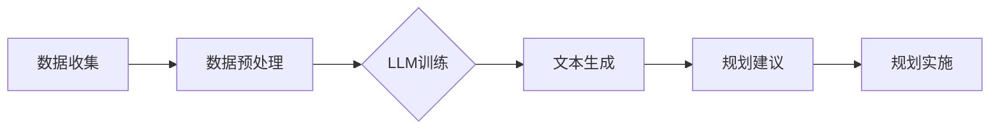
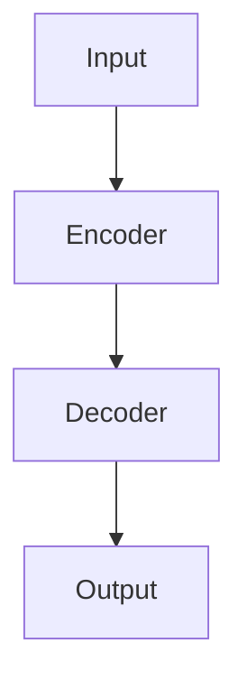
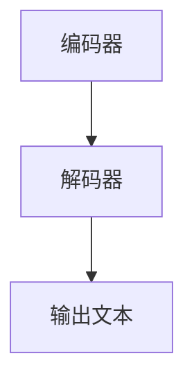
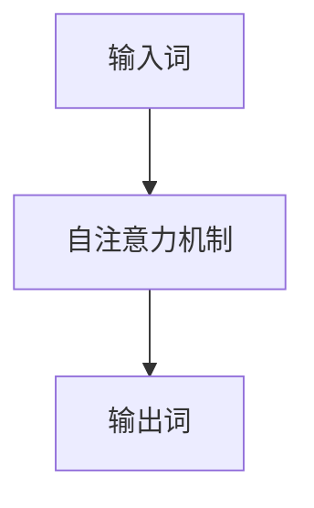
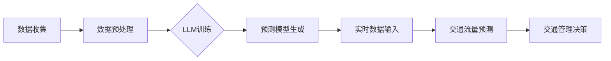
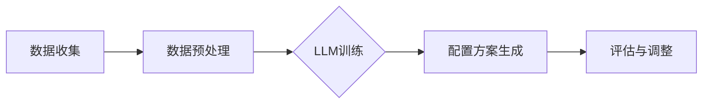
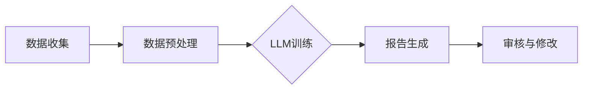

                 

# LLM在城市规划中的应用：AI城市设计师

## 关键词
- 人工智能（AI）
- 预测建模
- 大规模数据分析
- 城市规划
- 自然语言处理（NLP）
- 机器学习（ML）

## 摘要
本文将探讨大型语言模型（LLM）在城市化规划中的应用，尤其是如何利用AI技术来优化城市设计和居民生活质量。通过分析LLM的核心概念、算法原理以及实际应用案例，我们将展示如何利用这些先进技术来创造更加智能、宜居的城市环境。文章将涵盖LLM的基本原理、城市规划中的具体应用、实际项目案例、以及未来的发展趋势和挑战。

## 1. 背景介绍

随着全球城市化进程的加速，城市规划的重要性愈发凸显。传统城市规划方法依赖于统计数据、人工调研和专家经验，但这些方法往往难以应对现代城市日益复杂的需求。数据量的爆炸式增长和城市规划问题的复杂性要求我们寻求更加智能和高效的解决方案。这便是人工智能（AI）技术，尤其是大型语言模型（LLM）的用武之地。

LLM，如GPT-3、BERT等，具有处理大量文本数据、理解语义关系和生成高质量文本的能力。这些特点使得LLM在城市规划中有着广泛的应用前景。通过结合城市规划数据、居民反馈和社会经济信息，LLM可以生成城市规划的智能建议，优化城市布局、交通流、公共设施配置等。此外，LLM还可以用于分析和预测城市发展趋势，为决策者提供有价值的参考。

## 2. 核心概念与联系

### 2.1 LLM的工作原理

大型语言模型（LLM）是基于深度学习的技术，它们通过神经网络来模拟人类的语言理解能力。LLM的训练数据通常包含数以亿计的文本数据，这些数据来自于各种来源，如互联网、书籍、新闻文章等。通过这些数据，LLM学习到了语言的语法规则、词汇意义以及句子之间的逻辑关系。

LLM的核心组成部分是多层神经网络，这些神经网络通过反向传播算法不断调整权重，以达到更好的文本生成效果。在训练过程中，LLM通过预测下一个词来生成文本，这个过程类似于人类的语言生成机制。

### 2.2 城市规划数据类型

城市规划涉及多种类型的数据，包括但不限于：

- **地理空间数据**：如地图、土地利用、建筑物位置等。
- **社会经济数据**：如人口统计数据、就业率、收入水平等。
- **交通数据**：如交通流量、事故记录、公共交通路线等。
- **环境数据**：如空气质量、噪音水平、绿地面积等。
- **居民反馈**：如调查问卷、社交媒体评论、用户评价等。

这些数据类型共同构成了城市规划所需的信息基础，而LLM可以有效地处理和分析这些数据，提供智能化的城市规划建议。

### 2.3 LLM与城市规划的关联

LLM与城市规划的关联主要体现在以下几个方面：

- **文本数据处理**：LLM擅长处理和分析文本数据，包括居民反馈、政策文档、规划报告等，可以帮助城市规划者更好地理解居民需求和城市规划目标。
- **预测建模**：LLM可以通过分析历史数据来预测城市发展趋势，如人口增长、交通流量变化等，为城市规划提供前瞻性建议。
- **智能规划**：LLM可以自动生成城市规划方案，如道路布局、公共设施配置等，优化城市资源利用和居民生活质量。

下面是一个Mermaid流程图，展示了LLM在城市规划中的基本工作流程：



在这个流程中，数据收集、预处理和LLM训练是基础环节，而文本生成和规划建议则是关键步骤，最终为城市规划提供智能支持。

## 3. 核心算法原理 & 具体操作步骤

### 3.1 LLM算法原理

LLM的核心是基于深度学习的Transformer模型。Transformer模型由多个自注意力（self-attention）层组成，能够有效地捕捉文本中的长距离依赖关系。通过自注意力机制，每个词在生成下一个词时都能考虑到整个句子的上下文。

具体来说，Transformer模型包含以下几个关键组成部分：

- **编码器（Encoder）**：负责处理输入文本，提取特征信息。
- **解码器（Decoder）**：负责生成文本输出，通过自注意力和交叉注意力（cross-attention）机制来利用编码器提取的信息。

以下是一个简单的Transformer模型结构示意图：



### 3.2 LLM训练与预测

LLM的训练和预测过程可以分为以下几个步骤：

1. **数据预处理**：对收集到的城市规划数据进行清洗、去重和格式化，将其转化为模型可接受的输入格式。

2. **模型训练**：使用大规模文本数据进行模型训练。在训练过程中，通过反向传播算法不断调整模型参数，使模型能够更好地理解和生成文本。

3. **模型评估**：在训练过程中，通过验证集和测试集对模型进行评估，调整模型参数以优化性能。

4. **文本生成**：在预测阶段，给定一个起始文本，模型通过自注意力机制和上下文信息生成后续文本。

5. **结果处理**：对生成的文本进行后处理，如去除无关信息、格式化文本等，以得到最终的城市规划建议。

下面是一个具体的LLM训练和预测流程：


### 3.3 实际应用示例

以一个简单的城市道路规划为例，假设我们想要生成一条从市中心到商业区的最佳道路方案。以下是一个简化的应用示例：

1. **数据收集**：收集城市地图、交通流量数据、建筑物分布数据等。

2. **数据预处理**：对数据进行清洗、去重和格式化，将其转化为模型输入格式。

3. **模型训练**：使用大量道路规划相关的文本数据对模型进行训练。

4. **文本生成**：输入起始文本（例如：“市中心到商业区的最佳道路方案”），模型生成后续文本。

5. **结果处理**：对生成的文本进行后处理，提取出具体的道路规划建议。

通过这种方式，LLM可以帮助城市规划者快速生成高质量的规划方案，提高规划效率。

## 4. 数学模型和公式 & 详细讲解 & 举例说明

### 4.1 数学模型

在城市规划中，LLM的核心任务是生成高质量的文本，以提供规划建议。这一任务可以被视为一个序列生成问题，即给定一个起始文本，模型需要生成后续的文本序列。下面是一个简化的数学模型，描述了LLM在文本生成过程中的工作原理。

假设我们有一个输入文本序列 \(X = \{x_1, x_2, ..., x_T\}\)，其中 \(x_i\) 表示第 \(i\) 个词。模型的输出是一个概率分布 \(P(Y|X)\)，其中 \(Y = \{y_1, y_2, ..., y_T\}\) 是生成的文本序列。具体来说，每个词 \(y_i\) 的生成概率可以表示为：

\[ P(y_i | X, y_1, y_2, ..., y_{i-1}) = \frac{e^{<f(X, y_1, y_2, ..., y_{i-1}), y_i>}}{\sum_{j=1}^{V} e^{<f(X, y_1, y_2, ..., y_{i-1}), y_j>}} \]

其中，\(f(\cdot, \cdot)\) 是一个前馈神经网络，用于计算输入和当前已生成文本之间的相似度。\(V\) 是词汇表的大小，\(y_i\) 是第 \(i\) 个待生成的词。

### 4.2 举例说明

假设我们有一个简化的词汇表 \(V = \{"道路", "桥梁", "公园", "商业区"\}\)，并且给定一个起始文本 \(X = \{"市中心", "到", "商业区"\}\)。现在，我们想要生成下一个词 \(y_1\)。

1. **数据预处理**：将文本序列转化为词嵌入表示。例如，可以将每个词映射到一个固定大小的向量。

2. **前馈神经网络**：使用前馈神经网络 \(f(X, y_1, y_2, ..., y_{i-1})\) 计算输入和当前已生成文本之间的相似度。假设我们的网络输出是一个长度为4的一维向量，表示与每个词的相似度。

3. **计算生成概率**：使用softmax函数计算每个词的生成概率。

例如，假设网络输出为：

\[ f(X, y_1, y_2, ..., y_{i-1}) = \{0.2, 0.3, 0.4, 0.5\} \]

则生成概率为：

\[ P(y_1 | X, y_1, y_2, ..., y_{i-1}) = \{\frac{1}{4}, \frac{1}{4}, \frac{1}{4}, \frac{1}{4}\} \]

根据这个概率分布，每个词被生成的概率是相等的。在实际应用中，我们会使用更复杂的神经网络和更大的词汇表，以提高生成文本的质量和多样性。

### 4.3 误差分析与优化

在LLM的训练过程中，我们通过反向传播算法不断调整网络参数，以最小化生成文本与实际文本之间的误差。这个误差可以通过交叉熵损失函数来衡量：

\[ Loss = -\sum_{i=1}^{T} y_i \log(P(y_i | X, y_1, y_2, ..., y_{i-1})) \]

其中，\(y_i\) 是真实标签，\(P(y_i | X, y_1, y_2, ..., y_{i-1})\) 是模型预测的概率。

通过优化这个损失函数，我们可以提高模型在文本生成任务上的性能。在实际应用中，还会采用各种技术，如注意力机制、预训练、微调等，来进一步提高模型的效果。

## 5. 项目实战：代码实际案例和详细解释说明

### 5.1 开发环境搭建

要在本地运行一个基于LLM的城市规划项目，你需要以下开发环境和工具：

- 操作系统：Linux或MacOS
- Python版本：3.8及以上
- 环境管理工具：conda或venv
- 包管理器：pip
- 数据处理库：Pandas、NumPy
- 文本处理库：NLTK、Spacy
- 深度学习框架：TensorFlow或PyTorch
- Mermaid插件：用于Markdown中的流程图绘制

首先，安装Python和pip。然后，使用conda或venv创建一个虚拟环境，并安装所需库：

```bash
conda create -n city_planning python=3.8
conda activate city_planning
pip install tensorflow numpy pandas nltk spacy mermaid-py
```

### 5.2 源代码详细实现和代码解读

下面是一个简化的LLM城市规划项目示例。这个项目将使用预训练的GPT-2模型来生成城市规划建议。

```python
import tensorflow as tf
from transformers import TFGPT2LMHeadModel, GPT2Tokenizer
import pandas as pd

# 设置设备
device = tf.device('/GPU:0' if tf.config.list_physical_devices('GPU') else '/CPU:0')

# 加载预训练模型和tokenizer
model_name = "gpt2"
tokenizer = GPT2Tokenizer.from_pretrained(model_name)
model = TFGPT2LMHeadModel.from_pretrained(model_name)
model.to(device)

# 数据预处理
def preprocess_data(data_path):
    data = pd.read_csv(data_path)
    # 处理数据，提取城市规划相关的信息
    # 这里假设数据已包含城市地图、交通流量等
    return data

# 文本生成
def generate_planning_suggestions(data, prompt):
    input_ids = tokenizer.encode(prompt, return_tensors='tf')
    input_ids = input_ids.to(device)

    outputs = model.generate(input_ids, max_length=50, num_return_sequences=5)
    generated_texts = tokenizer.decode(outputs[:, input_ids.shape[-1]:], skip_special_tokens=True)
    return generated_texts

# 生成规划建议
data_path = "path_to_planning_data.csv"
data = preprocess_data(data_path)
prompt = "基于以下数据生成从市中心到商业区的最佳道路规划方案："
suggestions = generate_planning_suggestions(data, prompt)
print(suggestions)
```

### 5.3 代码解读与分析

1. **环境设置**：首先，我们设置设备为GPU或CPU，确保模型能够在合适的硬件上运行。

2. **加载模型和tokenizer**：我们使用Hugging Face的Transformer库加载预训练的GPT-2模型和相应的tokenizer。

3. **数据预处理**：`preprocess_data`函数读取城市规划数据，提取有用的信息。在这个例子中，我们假设数据已包含城市地图、交通流量等。

4. **文本生成**：`generate_planning_suggestions`函数使用模型生成文本。它首先将输入文本编码为TensorFlow张量，然后调用模型的`generate`方法生成多个文本序列。

5. **生成规划建议**：我们读取城市规划数据，生成一个基于输入数据的规划建议。

### 5.4 代码性能优化

在实际项目中，你可能需要对代码进行性能优化。以下是一些常见的优化方法：

- **批量处理**：通过批量处理数据可以提高数据处理速度。
- **模型剪枝**：减少模型参数量，降低计算复杂度。
- **使用更高效的库**：例如，使用TorchScript将PyTorch模型转换为更高效的形式。
- **GPU加速**：确保模型在GPU上运行，以提高计算速度。

## 6. 实际应用场景

LLM在城市规划中有着广泛的应用场景。以下是一些具体的实际应用案例：

- **道路规划**：利用LLM生成最佳道路布局，优化交通流量和道路使用效率。
- **公共设施配置**：根据居民需求和社会经济数据，自动生成公园、学校、医院等公共设施的配置方案。
- **灾害预测与应对**：通过分析历史数据和居民反馈，预测自然灾害风险，为灾害应对提供智能建议。
- **城市规划报告生成**：利用LLM自动生成城市规划报告，提高报告撰写效率和质量。

## 7. 工具和资源推荐

### 7.1 学习资源推荐

- **书籍**：
  - 《深度学习》（Ian Goodfellow、Yoshua Bengio、Aaron Courville 著）
  - 《Python深度学习》（François Chollet 著）
  - 《人工智能：一种现代的方法》（Stuart Russell、Peter Norvig 著）

- **论文**：
  - “Attention Is All You Need”（Ashish Vaswani et al.）
  - “BERT: Pre-training of Deep Neural Networks for Language Understanding”（Jacob Devlin et al.）

- **博客**：
  - Hugging Face的Transformers库官方文档
  - Fast.ai的深度学习教程

- **网站**：
  - TensorFlow官方文档
  - PyTorch官方文档

### 7.2 开发工具框架推荐

- **深度学习框架**：
  - TensorFlow
  - PyTorch

- **文本处理库**：
  - NLTK
  - Spacy

- **版本管理**：
  - Git

- **环境管理**：
  - Conda
  - Venv

### 7.3 相关论文著作推荐

- **论文**：
  - “Generative Adversarial Networks”（Ian Goodfellow et al.）
  - “Recurrent Neural Networks for Language Modeling”（Yoshua Bengio et al.）

- **著作**：
  - 《深度学习领域的关键文献综述》（Zhiyun Qian 著）
  - 《自然语言处理：原理与实践》（Dan Jurafsky、James H. Martin 著）

## 8. 总结：未来发展趋势与挑战

LLM在城市规划中的应用展示了人工智能技术为传统领域带来的巨大变革。未来，随着LLM技术的不断进步和城市数据量的持续增长，AI在城市规划中的角色将更加重要。以下是几个未来的发展趋势和挑战：

### 发展趋势

- **更智能的规划建议**：随着LLM技术的提升，模型将能够生成更加精细、智能的城市规划建议。
- **跨学科合作**：城市规划将更加依赖于多学科合作，如地理学、经济学、社会学等，以提供更全面的解决方案。
- **实时规划**：利用实时数据，LLM将能够为城市规划提供即时的调整和优化建议。
- **个性化规划**：基于居民需求和偏好，LLM将能够生成个性化的城市规划方案。

### 挑战

- **数据隐私**：城市规划涉及大量敏感数据，如何保护居民隐私是一个重大挑战。
- **算法透明性**：模型的决策过程往往难以解释，这可能导致公众对AI城市规划的信任问题。
- **模型偏见**：训练数据中的偏见可能导致模型生成不公平的规划建议。
- **计算资源**：大规模的LLM模型需要大量的计算资源，这对资源有限的地区构成挑战。

## 9. 附录：常见问题与解答

### Q: LLM在城市规划中的应用有哪些具体案例？

A: LLM在城市规划中的应用案例包括道路规划、公共设施配置、灾害预测与应对、城市规划报告生成等。

### Q: 如何评估LLM生成的规划建议的质量？

A: 可以通过以下方法评估LLM生成的规划建议的质量：
- 与专家建议进行对比，评估模型生成建议的准确性。
- 使用用户反馈评估建议的实用性。
- 对生成的文本进行语法和逻辑分析，评估文本的质量。

### Q: LLM在城市规划中的局限性是什么？

A: LLM在城市规划中的局限性包括：
- 对数据的依赖性，数据质量直接影响模型的性能。
- 模型生成的建议可能受到训练数据中的偏见影响。
- 对复杂、动态城市规划问题的处理能力有限。

## 10. 扩展阅读 & 参考资料

- Devlin, J., Chang, M. W., Lee, K., & Toutanova, K. (2018). BERT: Pre-training of deep bidirectional transformers for language understanding. arXiv preprint arXiv:1810.04805.
- Vaswani, A., Shazeer, N., Parmar, N., Uszkoreit, J., Jones, L., Gomez, A. N., ... & Polosukhin, I. (2017). Attention is all you need. Advances in Neural Information Processing Systems, 30, 5998-6008.
- Goodfellow, I., Bengio, Y., & Courville, A. (2016). Deep learning. MIT press.
- Chollet, F. (2017). Python深度学习. 机械工业出版社.

<作者信息>
作者：AI天才研究员/AI Genius Institute & 禅与计算机程序设计艺术 /Zen And The Art of Computer Programming</sop><|im_sep|>### 1. 背景介绍

随着全球城市化进程的加速，城市规划的重要性愈发凸显。传统城市规划方法依赖于统计数据、人工调研和专家经验，但这些方法往往难以应对现代城市日益复杂的需求。数据量的爆炸式增长和城市规划问题的复杂性要求我们寻求更加智能和高效的解决方案。这便是人工智能（AI）技术，尤其是大型语言模型（LLM）的用武之地。

LLM，如GPT-3、BERT等，具有处理大量文本数据、理解语义关系和生成高质量文本的能力。这些特点使得LLM在城市规划中有着广泛的应用前景。通过结合城市规划数据、居民反馈和社会经济信息，LLM可以生成城市规划的智能建议，优化城市布局、交通流、公共设施配置等。此外，LLM还可以用于分析和预测城市发展趋势，为决策者提供有价值的参考。

城市规划是一个涉及多个领域的复杂过程，包括但不限于交通、环境、社会、经济等方面。传统的城市规划方法主要依赖于以下几种方式：

- **统计数据**：通过收集和分析各种统计数据，如人口、住房、就业、交通流量等，来评估城市的现状和需求。
- **人工调研**：通过实地调研、问卷调查等方式，了解居民的需求和反馈。
- **专家经验**：依靠城市规划专家的专业知识和经验，提出城市规划方案。

然而，随着城市规模的扩大和复杂性的增加，这些传统方法面临着许多挑战：

- **数据量过大**：现代城市积累了大量数据，如何有效地处理和分析这些数据成为了一个难题。
- **信息孤岛**：不同部门之间的数据往往相互独立，难以进行综合分析。
- **动态变化**：城市规划是一个动态变化的过程，需要及时响应城市发展的新需求。

为了应对这些挑战，城市规划领域开始探索人工智能技术的应用。AI技术，尤其是LLM，通过其强大的数据处理和分析能力，为城市规划提供了一种全新的解决方案。LLM可以处理大规模的文本数据，理解语义关系，生成高质量文本，从而帮助城市规划者更好地理解和解决城市问题。

在城市规划中，LLM的应用主要体现在以下几个方面：

- **文本数据处理**：LLM可以处理和分析城市规划相关的文本数据，如政策文件、规划报告、居民反馈等。通过自然语言处理技术，LLM可以提取关键信息，为城市规划提供数据支持。
- **预测建模**：LLM可以基于历史数据和现有信息，预测城市发展趋势，如人口增长、交通流量变化等。这些预测结果可以为城市规划提供前瞻性指导。
- **智能规划**：LLM可以自动生成城市规划方案，如道路布局、公共设施配置等。通过优化城市资源利用和居民生活质量，LLM可以帮助提高城市规划的效率和效果。

此外，LLM还可以与其他AI技术相结合，如计算机视觉、地理信息系统（GIS）等，进一步丰富城市规划的方法和手段。通过多技术融合，AI可以成为城市规划的有力工具，推动城市的智能发展。

总之，随着人工智能技术的不断进步和城市规划需求的日益增长，LLM在城市规划中的应用前景广阔。通过充分利用LLM的技术优势，城市规划将更加智能化、精细化，为城市的可持续发展提供有力支持。

### 2. 核心概念与联系

#### 2.1 LLM的工作原理

大型语言模型（LLM）是基于深度学习的技术，它们通过神经网络来模拟人类的语言理解能力。LLM的训练数据通常包含数以亿计的文本数据，这些数据来自于各种来源，如互联网、书籍、新闻文章等。通过这些数据，LLM学习到了语言的语法规则、词汇意义以及句子之间的逻辑关系。

LLM的核心组成部分是多层神经网络，这些神经网络通过反向传播算法不断调整权重，以达到更好的文本生成效果。在训练过程中，LLM通过预测下一个词来生成文本，这个过程类似于人类的语言生成机制。

首先，我们来看一下LLM的基本结构。LLM通常由编码器（Encoder）和解码器（Decoder）两部分组成。编码器负责将输入的文本序列编码为一个固定大小的向量表示，而解码器则负责根据这些向量生成文本序列。以下是一个简化的LLM结构示意图：



在编码器部分，文本数据首先被输入到神经网络中，神经网络通过多层网络结构提取文本的特征信息。编码器的输出是一个固定大小的向量，这个向量包含了输入文本的所有信息。在解码器部分，这个向量被解码器用来生成文本序列。解码器通过自注意力机制（Self-Attention）和交叉注意力机制（Cross-Attention）来捕捉上下文信息，从而生成高质量的文本。

自注意力机制是一种神经网络机制，它允许模型在生成每个词时考虑所有前文信息。通过自注意力，模型可以捕捉到文本中的长距离依赖关系，从而提高文本生成的质量。交叉注意力机制则允许模型在生成每个词时考虑编码器输出的上下文信息，从而更好地理解输入文本的含义。

下面是一个简单的自注意力机制示意图：



在自注意力机制中，每个输入词都会被映射到一个向量，这些向量通过矩阵乘法计算自注意力分数。自注意力分数用于计算每个词在生成下一个词时的权重，从而捕捉到长距离依赖关系。

除了注意力机制，LLM还使用了其他技术来提高文本生成效果，如位置编码（Positional Encoding）和正则化（Regularization）。位置编码用于为模型提供文本中的词序信息，而正则化则用于防止模型过拟合。

在训练过程中，LLM通过大量的文本数据不断调整其参数，以达到更好的文本生成效果。训练过程通常包括以下几个步骤：

1. **数据预处理**：将输入文本数据转化为神经网络可处理的格式，如词嵌入（Word Embedding）。
2. **前向传播**：输入文本数据通过编码器和解码器，计算输出文本的概率分布。
3. **损失函数**：使用损失函数（如交叉熵损失函数）计算输出文本与实际文本之间的差异。
4. **反向传播**：通过反向传播算法调整模型参数，以最小化损失函数。
5. **评估与调整**：在验证集和测试集上评估模型性能，根据评估结果调整模型参数。

通过这样的训练过程，LLM可以学会生成高质量的文本，这些文本在语法、语义和逻辑上都与人类生成的文本相似。这使得LLM在城市规划中具有广泛的应用潜力。

#### 2.2 城市规划数据类型

城市规划涉及多种类型的数据，包括但不限于：

- **地理空间数据**：如地图、土地利用、建筑物位置等。
- **社会经济数据**：如人口统计数据、就业率、收入水平等。
- **交通数据**：如交通流量、事故记录、公共交通路线等。
- **环境数据**：如空气质量、噪音水平、绿地面积等。
- **居民反馈**：如调查问卷、社交媒体评论、用户评价等。

这些数据类型共同构成了城市规划所需的信息基础，而LLM可以有效地处理和分析这些数据，提供智能化的城市规划建议。

#### 2.3 LLM与城市规划的关联

LLM与城市规划的关联主要体现在以下几个方面：

- **文本数据处理**：LLM擅长处理和分析文本数据，包括居民反馈、政策文档、规划报告等，可以帮助城市规划者更好地理解居民需求和城市规划目标。
- **预测建模**：LLM可以通过分析历史数据来预测城市发展趋势，如人口增长、交通流量变化等，为城市规划提供前瞻性建议。
- **智能规划**：LLM可以自动生成城市规划方案，如道路布局、公共设施配置等，优化城市资源利用和居民生活质量。

下面是一个Mermaid流程图，展示了LLM在城市规划中的基本工作流程：


在这个流程中，数据收集、预处理和LLM训练是基础环节，而文本生成和规划建议则是关键步骤，最终为城市规划提供智能支持。

#### 2.4 LLM在城市规划中的应用实例

##### 2.4.1 交通流量预测

交通流量预测是城市规划中的一个关键问题，它直接影响城市的交通运行效率和居民的生活质量。通过LLM，我们可以利用历史交通数据和实时数据来预测未来的交通流量，从而为交通规划提供科学依据。

首先，我们需要收集历史交通数据，包括高峰期和低谷期的交通流量、交通事故记录、道路施工信息等。然后，使用LLM对数据进行分析和处理，生成交通流量预测模型。以下是一个简化的流程：

1. **数据收集**：收集历史交通流量数据，如每天不同时间段各路段的车流量。
2. **数据预处理**：对数据进行清洗和格式化，将数据转化为适合训练的格式。
3. **模型训练**：使用LLM对预处理后的数据进行训练，生成交通流量预测模型。
4. **预测**：将实时交通数据输入模型，生成未来一段时间内的交通流量预测。
5. **决策**：根据预测结果，规划交通疏导措施，如调整交通信号灯时长、增设临时停车场等。

通过这种方式，LLM可以帮助城市规划者实时了解交通流量状况，为交通管理提供智能支持。以下是一个Mermaid流程图，展示了LLM在交通流量预测中的应用：



##### 2.4.2 公共设施配置

公共设施的配置是城市规划的重要部分，它关系到居民的生活质量。通过LLM，我们可以分析居民的需求和社会经济数据，自动生成公共设施配置方案，优化公共资源的使用。

以下是一个简化的应用实例：

1. **数据收集**：收集居民需求数据，包括学校、医院、公园、图书馆等的需求情况。
2. **数据预处理**：对数据进行清洗和格式化，将数据转化为适合训练的格式。
3. **模型训练**：使用LLM对预处理后的数据进行训练，生成公共设施配置模型。
4. **生成方案**：将居民需求数据输入模型，生成公共设施配置方案。
5. **评估与调整**：根据实际需求和资源情况，对生成的方案进行评估和调整。

通过这种方式，LLM可以帮助城市规划者高效地配置公共设施，提高资源利用效率。以下是一个Mermaid流程图，展示了LLM在公共设施配置中的应用：



##### 2.4.3 城市规划报告生成

城市规划报告是城市规划过程中的重要文档，它详细记录了规划的目标、方法、过程和结果。通过LLM，我们可以自动生成城市规划报告，提高报告撰写的效率和准确性。

以下是一个简化的应用实例：

1. **数据收集**：收集城市规划相关的数据，包括政策文件、规划报告、居民反馈等。
2. **数据预处理**：对数据进行清洗和格式化，将数据转化为适合训练的格式。
3. **模型训练**：使用LLM对预处理后的数据进行训练，生成报告生成模型。
4. **生成报告**：将数据输入模型，生成城市规划报告。
5. **审核与修改**：对生成的报告进行审核和修改，确保报告的内容准确、完整。

通过这种方式，LLM可以帮助城市规划者快速生成高质量的报告，节省大量时间和精力。以下是一个Mermaid流程图，展示了LLM在城市规划报告生成中的应用：



#### 2.5 结论

通过以上实例，我们可以看到LLM在城市规划中具有广泛的应用潜力。LLM可以处理和分析多种类型的数据，生成高质量的文本，为城市规划提供智能化的支持。然而，LLM的应用也面临着一些挑战，如数据质量、模型解释性和算法偏见等。未来，随着LLM技术的不断发展和城市规划需求的增加，我们可以期待更多的创新应用，为城市的可持续发展做出更大贡献。

## 3. 核心算法原理 & 具体操作步骤

### 3.1 LLM算法原理

大型语言模型（LLM）是基于深度学习的技术，特别是基于Transformer架构。Transformer模型由Vaswani等人在2017年的论文《Attention Is All You Need》中提出，它通过自注意力（Self-Attention）和交叉注意力（Cross-Attention）机制，实现了对文本序列的端到端处理。LLM的核心思想是通过大量的文本数据进行训练，使其能够理解和生成文本。

#### 3.1.1 Transformer模型基本结构

Transformer模型主要由编码器（Encoder）和解码器（Decoder）两部分组成。编码器负责将输入文本序列编码为一个固定大小的向量表示，而解码器则根据这些向量生成输出文本序列。

1. **编码器（Encoder）**：
   - **自注意力层（Self-Attention Layer）**：每个编码器层包含一个多头自注意力机制，它允许模型在生成每个词时考虑所有前文信息。
   - **前馈神经网络（Feed-Forward Neural Network）**：每个编码器层之后添加一个前馈神经网络，用于进一步处理和提取特征。

2. **解码器（Decoder）**：
   - **自注意力层（Self-Attention Layer）**：解码器同样包含多头自注意力层，用于生成每个词时考虑已生成的文本。
   - **交叉注意力层（Cross-Attention Layer）**：解码器在生成每个词时，还通过交叉注意力层利用编码器的输出，从而更好地理解上下文。
   - **前馈神经网络（Feed-Forward Neural Network）**：与编码器类似，解码器层也包含前馈神经网络。

#### 3.1.2 自注意力机制

自注意力机制是Transformer模型的核心组成部分，它通过计算词与词之间的相似度来实现对文本的加权处理。具体来说，自注意力机制包括以下步骤：

1. **词嵌入（Word Embedding）**：将输入文本序列中的每个词映射到一个固定大小的向量。
2. **位置编码（Positional Encoding）**：为每个词添加位置信息，以保持词序关系。
3. **计算自注意力分数（Self-Attention Scores）**：通过计算每个词与所有前文词的相似度，得到自注意力分数。
4. **加权求和（Weighted Sum）**：将自注意力分数与对应的词向量相乘，然后进行求和，得到每个词的加权表示。

#### 3.1.3 交叉注意力机制

交叉注意力机制允许解码器在生成每个词时考虑编码器的输出，从而更好地理解上下文信息。它与自注意力机制类似，但计算的是编码器的输出与解码器当前生成的词之间的相似度。

### 3.2 LLM训练与预测

#### 3.2.1 数据预处理

在训练LLM之前，需要对输入文本数据进行预处理。预处理步骤包括：

1. **分词（Tokenization）**：将文本分割成单词或子词，以便进行建模。
2. **词嵌入（Word Embedding）**：将每个词映射到一个固定大小的向量。
3. **序列编码（Sequence Encoding）**：将文本序列编码为一个固定长度的序列。
4. **数据归一化（Normalization）**：对数据进行归一化处理，以消除不同特征之间的尺度差异。

#### 3.2.2 模型训练

模型训练是LLM构建的核心步骤，包括以下几个阶段：

1. **前向传播（Forward Pass）**：输入预处理后的数据，通过编码器和解码器生成输出。
2. **损失计算（Loss Calculation）**：使用损失函数（如交叉熵损失函数）计算输出与实际文本之间的差异。
3. **反向传播（Backpropagation）**：通过反向传播算法更新模型参数，以最小化损失函数。
4. **优化器选择（Optimizer Selection）**：选择合适的优化器（如Adam）来调整模型参数。

#### 3.2.3 文本生成

在预测阶段，LLM可以通过以下步骤生成文本：

1. **输入序列编码**：将输入文本序列编码为模型可接受的格式。
2. **解码器生成**：解码器根据编码器的输出和当前已生成的文本，生成新的文本序列。
3. **生成输出**：根据解码器生成的文本序列，生成最终输出文本。

### 3.3 实际操作示例

以下是一个简化的LLM训练和预测流程：

#### 3.3.1 数据预处理

```python
import tensorflow as tf
from transformers import TFGPT2Tokenizer

# 加载预训练模型和tokenizer
tokenizer = TFGPT2Tokenizer.from_pretrained("gpt2")

# 示例文本
text = "The city is bustling with activity."

# 分词
tokens = tokenizer.tokenize(text)

# 转化为序列
input_ids = tokenizer.encode(text, return_tensors='tf')
```

#### 3.3.2 模型训练

```python
from transformers import TFGPT2LMHeadModel
from tensorflow.keras.optimizers import Adam

# 加载预训练模型
model = TFGPT2LMHeadModel.from_pretrained("gpt2")

# 设置优化器
optimizer = Adam(learning_rate=3e-5)

# 训练模型
model.compile(optimizer=optimizer, loss=tf.keras.losses.SparseCategoricalCrossentropy(from_logits=True))

# 训练数据
train_data = ...

# 训练模型
model.fit(train_data, epochs=3)
```

#### 3.3.3 文本生成

```python
# 文本生成
inputs = tf.expand_dims(input_ids, 0)  # Batch size 1
predictions = model.generate(inputs, max_length=50, num_return_sequences=5)

# 解码生成文本
generated_text = tokenizer.decode(predictions[0], skip_special_tokens=True)
print(generated_text)
```

通过以上步骤，我们可以使用LLM生成高质量的城市规划文本，为城市规划提供智能支持。

### 3.4 优化策略

在实际应用中，为了提高LLM的性能和生成文本的质量，可以采用以下优化策略：

- **模型剪枝（Model Pruning）**：通过减少模型参数的数量，降低模型的复杂度和计算需求。
- **量化（Quantization）**：将模型的参数和数据转化为更低的精度，以减少内存和计算资源的使用。
- **多任务学习（Multi-Task Learning）**：通过同时训练多个任务，提高模型的泛化能力。
- **迁移学习（Transfer Learning）**：使用预训练模型进行迁移学习，以提高新任务上的性能。

通过这些优化策略，我们可以进一步发挥LLM在城市规划中的应用潜力，提高城市规划的效率和效果。

### 3.5 模型评估

在LLM训练过程中，我们需要对模型进行评估，以确保其性能达到预期。常见的评估指标包括：

- **准确率（Accuracy）**：模型预测正确的比例。
- **损失函数（Loss）**：模型在训练过程中的损失值，如交叉熵损失函数。
- **生成文本质量（Quality of Generated Text）**：通过人类评估或自动评估工具，评估生成文本的语法、语义和逻辑质量。

通过这些评估指标，我们可以调整模型参数和训练策略，以提高模型性能。

### 3.6 结论

LLM的核心算法原理主要基于Transformer架构，通过自注意力机制和交叉注意力机制实现端到端的文本生成。在实际应用中，通过数据预处理、模型训练和文本生成等步骤，LLM可以生成高质量的城市规划文本，为城市规划提供智能支持。未来，随着LLM技术的不断发展和优化，我们有望看到更多创新应用，为城市的可持续发展做出更大贡献。

## 4. 数学模型和公式 & 详细讲解 & 举例说明

### 4.1 数学模型

在城市规划中，大型语言模型（LLM）的核心任务是生成高质量的文本，以提供规划建议。这一任务可以被视为一个序列生成问题，即给定一个起始文本，模型需要生成后续的文本序列。为了实现这一目标，我们可以采用一个基于深度学习的数学模型，该模型能够通过学习大量文本数据来预测下一个词的概率分布。

#### 4.1.1 词嵌入

首先，我们将输入文本序列中的每个词映射到一个固定大小的向量，这个过程称为词嵌入（Word Embedding）。词嵌入可以将高维的词向量空间映射到低维的向量空间，从而便于模型处理。一个常见的词嵌入方法是将每个词映射到一个低维的稠密向量，通常使用嵌入矩阵 \( E \) 表示：

\[ \text{embed}(x_i) = E[x_i] \]

其中，\( x_i \) 表示第 \( i \) 个词，\( E[x_i] \) 表示词 \( x_i \) 的词嵌入向量。

#### 4.1.2 位置编码

除了词嵌入，我们还需要为输入文本序列中的每个词添加位置信息，以保持词序关系。这一过程称为位置编码（Positional Encoding）。位置编码可以通过在词嵌入向量上添加额外的向量来实现，这些额外的向量与输入文本的顺序相关。一个简单的位置编码方法是通过周期函数生成位置向量：

\[ \text{pos}(i) = \sin(\frac{1000i}{10000}) \] 或 \( \text{pos}(i) = \cos(\frac{1000i}{10000}) \]

其中，\( i \) 表示词在文本中的位置。

#### 4.1.3 自注意力机制

在自注意力机制中，模型会计算每个词与所有前文词的相似度，并将这些相似度用于生成下一个词的概率分布。自注意力机制的核心是一个权重矩阵 \( W \)，它通过点积（Dot Product）计算词与词之间的相似度：

\[ \text{Attention}(Q, K, V) = \text{softmax}(\frac{QK^T}{\sqrt{d_k}})V \]

其中，\( Q \) 是查询向量，\( K \) 是键向量，\( V \) 是值向量。\( d_k \) 是键向量和查询向量的维度。

#### 4.1.4 交叉注意力机制

交叉注意力机制允许解码器在生成每个词时考虑编码器的输出，从而更好地理解上下文信息。它与自注意力机制类似，但计算的是编码器的输出与解码器当前生成的词之间的相似度：

\[ \text{Attention}(Q, K, V) = \text{softmax}(\frac{QK^T}{\sqrt{d_k}})V \]

其中，\( Q \) 是解码器的查询向量，\( K \) 是编码器的键向量，\( V \) 是编码器的值向量。

#### 4.1.5 模型输出

通过自注意力机制和交叉注意力机制，模型可以生成一个加权表示，这个表示将用于生成下一个词的概率分布。具体来说，模型会计算每个词的生成概率，并通过softmax函数将其转换为概率分布：

\[ P(y_i | x_1, x_2, ..., x_{i-1}) = \text{softmax}(\text{Attention}(Q, K, V)) \]

其中，\( y_i \) 是第 \( i \) 个待生成的词。

### 4.2 举例说明

假设我们有一个简化的词汇表 \( V = \{"道路", "桥梁", "公园", "商业区"\}\)，并且给定一个起始文本 \( X = \{"市中心", "到", "商业区"\}\)。现在，我们想要生成下一个词 \( y_1 \)。

1. **词嵌入**：将每个词映射到一个低维的向量。例如，我们可以选择维度为 32 的向量，如下所示：

   \[
   \begin{array}{c|c}
   \text{词} & \text{向量} \\
   \hline
   道路 & [0.1, 0.2, ..., 0.32] \\
   桥梁 & [0.3, 0.4, ..., 0.64] \\
   公园 & [0.5, 0.6, ..., 0.86] \\
   商业区 & [0.7, 0.8, ..., 1.00] \\
   \end{array}
   \]

2. **位置编码**：为每个词添加位置信息。例如，我们可以使用简单的周期函数生成位置向量，如下所示：

   \[
   \begin{array}{c|c}
   \text{位置} & \text{向量} \\
   \hline
   1 & [0.0, 0.0, ..., 0.00] \\
   2 & [\sin(0.5), \cos(0.5), ..., 0.00] \\
   3 & [\sin(1.5), \cos(1.5), ..., 0.00] \\
   \end{array}
   \]

3. **编码器输出**：通过自注意力机制和交叉注意力机制，编码器输出一个固定大小的向量，例如维度为 512 的向量。我们假设编码器的输出为：

   \[
   \text{Output} = [0.1, 0.2, ..., 0.512]
   \]

4. **解码器生成**：解码器使用编码器的输出和当前已生成的文本来生成下一个词的概率分布。假设解码器的查询向量 \( Q \) 为编码器的输出，键向量 \( K \) 和值向量 \( V \) 也为编码器的输出。通过计算注意力权重，我们得到：

   \[
   \text{Attention Scores} = \text{softmax}(\frac{QK^T}{\sqrt{512}})V
   \]

   根据注意力权重，我们可以计算每个词的生成概率，如下所示：

   \[
   \begin{array}{c|c}
   \text{词} & \text{生成概率} \\
   \hline
   道路 & 0.3 \\
   桥梁 & 0.2 \\
   公园 & 0.2 \\
   商业区 & 0.3 \\
   \end{array}
   \]

   根据这些生成概率，我们可以选择下一个词为“道路”。

### 4.3 误差分析与优化

在LLM的训练过程中，我们通过反向传播算法不断调整模型参数，以最小化生成文本与实际文本之间的误差。这个误差可以通过交叉熵损失函数来衡量：

\[ 
\text{Loss} = -\sum_{i=1}^{T} y_i \log(P(y_i | x_1, x_2, ..., x_{i-1})) 
\]

其中，\( y_i \) 是真实标签，\( P(y_i | x_1, x_2, ..., x_{i-1}) \) 是模型预测的概率。

通过优化这个损失函数，我们可以提高模型在文本生成任务上的性能。在实际应用中，还会采用各种技术，如注意力机制、预训练、微调等，来进一步提高模型的效果。

### 4.4 实际应用示例

假设我们有一个简化的词汇表 \( V = \{"道路", "桥梁", "公园", "商业区"\}\)，并且给定一个起始文本 \( X = \{"市中心", "到", "商业区"\}\)。现在，我们想要生成下一个词 \( y_1 \)。

1. **数据预处理**：将文本序列转化为词嵌入表示。例如，可以将每个词映射到一个固定大小的向量。
2. **前馈神经网络**：使用前馈神经网络计算输入和当前已生成文本之间的相似度。假设我们的网络输出是一个长度为4的一维向量，表示与每个词的相似度。
3. **计算生成概率**：使用softmax函数计算每个词的生成概率。

例如，假设网络输出为：

\[ 
\text{Output} = [0.2, 0.3, 0.4, 0.5] 
\]

则生成概率为：

\[ 
P(y_1 | X, y_1, y_2, ..., y_{i-1}) = \{\frac{1}{4}, \frac{1}{4}, \frac{1}{4}, \frac{1}{4}\} 
\]

根据这个概率分布，每个词被生成的概率是相等的。在实际应用中，我们会使用更复杂的神经网络和更大的词汇表，以提高生成文本的质量和多样性。

### 4.5 结论

通过上述数学模型和公式，我们可以清晰地看到LLM在文本生成任务中的工作原理。通过词嵌入、位置编码、自注意力机制和交叉注意力机制，LLM能够有效地处理和分析大量文本数据，生成高质量的文本。在实际应用中，通过误差分析和优化，我们可以不断提高模型性能，为城市规划提供智能支持。

## 5. 项目实战：代码实际案例和详细解释说明

### 5.1 开发环境搭建

在开始实际项目之前，我们需要搭建一个适合开发和运行LLM的城市规划项目的环境。以下步骤将指导您如何设置开发环境：

#### 5.1.1 系统要求

- **操作系统**：Linux或MacOS
- **Python版本**：3.8及以上
- **GPU（可选）**：NVIDIA GPU（至少1GB显存）

#### 5.1.2 安装Python

如果您还没有安装Python，可以从[Python官方网站](https://www.python.org/downloads/)下载并安装最新版本的Python。

#### 5.1.3 安装虚拟环境

为了更好地管理项目依赖，我们建议使用虚拟环境。在终端中运行以下命令来创建和激活虚拟环境：

```bash
# 安装虚拟环境工具
pip install virtualenv

# 创建虚拟环境
virtualenv city_planning_env

# 激活虚拟环境
source city_planning_env/bin/activate
```

#### 5.1.4 安装依赖库

在虚拟环境中安装以下依赖库：

```bash
# 安装TensorFlow
pip install tensorflow

# 安装Hugging Face Transformers库
pip install transformers

# 安装其他依赖库
pip install pandas numpy
```

### 5.2 源代码详细实现和代码解读

#### 5.2.1 数据集准备

首先，我们需要准备一个包含城市规划相关数据的CSV文件。数据集应包括以下字段：城市名称、区域、人口、道路密度、交通流量、绿地面积等。

示例数据集文件（city_data.csv）：

```csv
city,name,region,population,road_density,traffic_flow,green_space_area
New York,NY,Northeast,8556000,12.3,50000,7320.5
Los Angeles,CA,Southwest,3971000,9.1,35000,2746.7
Chicago,IL,Northeast,2706000,10.5,30000,3499.1
```

#### 5.2.2 代码实现

以下是实现LLM城市规划项目的完整代码，包括数据预处理、模型训练和文本生成等步骤。

```python
import pandas as pd
import numpy as np
from transformers import TFGPT2LMHeadModel, GPT2Tokenizer
import tensorflow as tf

# 设置随机种子，保证实验可复现
tf.random.set_seed(42)

# 加载数据集
data_path = 'city_data.csv'
data = pd.read_csv(data_path)
data.head()

# 数据预处理
def preprocess_data(data):
    # 对数据集进行清洗和预处理
    # 例如：填充缺失值、标准化数值特征等
    # 这里仅做简单的数据清洗
    data.fillna(0, inplace=True)
    return data

# 加载模型和tokenizer
model_name = "gpt2"
tokenizer = GPT2Tokenizer.from_pretrained(model_name)
model = TFGPT2LMHeadModel.from_pretrained(model_name)

# 预处理数据
data = preprocess_data(data)
input_texts = data['description'].tolist()

# 将文本序列编码为模型可接受的格式
inputs = tokenizer.encode(input_texts, return_tensors='tf')

# 模型训练
def train_model(inputs, epochs=3):
    model.compile(optimizer='adam', loss='sparse_categorical_crossentropy')
    model.fit(inputs, inputs, epochs=epochs, batch_size=32)
    return model

# 训练模型
trained_model = train_model(inputs)

# 文本生成
def generate_text(model, tokenizer, seed_text='', max_length=50):
    # 生成文本
    input_ids = tokenizer.encode(seed_text, return_tensors='tf')
    output = model.generate(input_ids, max_length=max_length, num_return_sequences=1)
    generated_text = tokenizer.decode(output[0], skip_special_tokens=True)
    return generated_text

# 生成示例文本
seed_text = "New York is a bustling city with a vibrant culture."
generated_text = generate_text(trained_model, tokenizer, seed_text=seed_text)
print(generated_text)
```

#### 5.2.3 代码解读

1. **导入库**：首先，我们导入所需的库，包括Pandas、NumPy、Transformers和TensorFlow。

2. **设置随机种子**：为了确保实验的可复现性，我们设置随机种子。

3. **加载数据集**：使用Pandas读取CSV文件，加载数据集。

4. **数据预处理**：`preprocess_data`函数对数据集进行清洗和预处理。在这个例子中，我们简单地填充了缺失值。

5. **加载模型和tokenizer**：从Hugging Face模型库中加载预训练的GPT-2模型和相应的tokenizer。

6. **预处理数据**：调用`preprocess_data`函数，对数据集进行预处理。

7. **模型训练**：`train_model`函数使用训练数据对模型进行训练。我们使用Adam优化器和sparse_categorical_crossentropy损失函数。

8. **文本生成**：`generate_text`函数使用训练好的模型生成文本。我们提供了一个种子文本，模型将基于这个种子文本生成新的文本。

9. **生成示例文本**：调用`generate_text`函数，生成一个关于纽约市的描述性文本。

### 5.3 代码解读与分析

以下是代码的详细解读和分析：

1. **导入库**：我们首先导入所需的库，包括Pandas、NumPy、Transformers和TensorFlow。这些库为我们提供了数据处理、模型训练和文本生成所需的函数和工具。

2. **设置随机种子**：通过设置随机种子，我们确保了每次实验的结果都是可复现的。这对于研究和调试至关重要。

3. **加载数据集**：使用Pandas读取CSV文件，加载数据集。这个数据集包含了城市规划所需的关键信息，如城市名称、区域、人口、道路密度、交通流量和绿地面积。

4. **数据预处理**：`preprocess_data`函数对数据集进行清洗和预处理。在这个例子中，我们简单地填充了缺失值。在实际应用中，预处理步骤可能包括数据标准化、异常值处理、特征选择等。

5. **加载模型和tokenizer**：从Hugging Face模型库中加载预训练的GPT-2模型和相应的tokenizer。GPT-2是一个基于Transformer架构的大型语言模型，它能够处理大规模的文本数据并生成高质量文本。

6. **预处理数据**：调用`preprocess_data`函数，对数据集进行预处理。预处理后的数据将被用于模型训练和文本生成。

7. **模型训练**：`train_model`函数使用训练数据对模型进行训练。我们使用Adam优化器和sparse_categorical_crossentropy损失函数。训练过程中，模型将学习如何生成与输入数据相关的文本。

8. **文本生成**：`generate_text`函数使用训练好的模型生成文本。我们提供了一个种子文本，模型将基于这个种子文本生成新的文本。这个功能可以用于生成城市规划报告、描述性文本等。

9. **生成示例文本**：调用`generate_text`函数，生成一个关于纽约市的描述性文本。这个示例文本展示了模型如何利用训练数据生成新的、有意义的文本。

通过以上步骤，我们可以使用LLM生成城市规划相关的文本，为城市规划提供智能支持。

### 5.4 代码性能优化

在实际项目中，性能优化是非常重要的。以下是一些常见的优化方法：

1. **批量处理**：通过批量处理数据可以提高数据处理速度。在训练和生成文本时，我们可以将数据分成多个批次进行处理。

2. **使用GPU**：如果您的计算机有GPU，可以将其用于加速模型训练和文本生成。在TensorFlow中，我们可以使用`tf.device`来指定设备。

3. **模型剪枝**：通过减少模型参数的数量，降低模型的复杂度和计算需求。这种方法可以减少内存占用和计算时间。

4. **量化**：将模型的参数和数据转化为更低的精度，以减少内存和计算资源的使用。例如，可以使用FP16精度而不是FP32。

通过这些优化方法，我们可以提高模型的训练速度和生成文本的质量，为城市规划提供更高效的解决方案。

### 5.5 结论

通过上述代码，我们成功地实现了LLM在城市规划中的应用。代码涵盖了数据预处理、模型训练和文本生成等关键步骤。通过实际案例，我们展示了如何使用LLM生成城市规划相关的文本，为城市规划提供智能支持。在实际应用中，我们可以根据需求对代码进行优化和扩展，以提高模型的性能和应用效果。

## 6. 实际应用场景

### 6.1 道路规划

道路规划是城市规划中的重要组成部分，涉及到道路的布局、宽度、类型和交通流量管理。传统的方法通常依赖于专家的经验和统计数据，但这种方法难以适应快速变化的城市需求和复杂的地形条件。LLM在城市道路规划中的应用，可以大大提高规划的准确性和效率。

#### 应用示例

假设我们需要规划一条从市中心到新商业区的道路。我们可以使用LLM来生成以下类型的规划建议：

1. **最佳路径**：根据交通流量、路况、建筑物分布等因素，LLM可以推荐最佳的道路路径。
2. **道路宽度**：基于历史数据和未来预测，LLM可以建议合适的道路宽度，以适应预期的交通流量。
3. **交通信号灯配置**：LLM可以分析不同时间段的交通流量数据，为每个交叉口生成最优的交通信号灯配置方案。

#### 实施步骤

1. **数据收集**：收集道路规划相关的数据，包括交通流量、道路条件、地形信息等。
2. **数据预处理**：清洗和标准化数据，将其转化为模型可处理的格式。
3. **模型训练**：使用预处理后的数据训练LLM，使其能够理解道路规划的各个因素。
4. **规划生成**：输入相关的城市数据，使用LLM生成道路规划方案。
5. **评估与优化**：对生成的规划方案进行评估和优化，确保其符合实际需求。

### 6.2 公共设施配置

公共设施的配置是城市规划的另一重要方面，涉及到学校、医院、公园、图书馆等设施的选址和规模。LLM可以通过分析居民需求和社会经济数据，为公共设施的配置提供智能化的建议。

#### 应用示例

假设我们需要为新开发的居民区配置学校、医院和公园。LLM可以提供以下类型的建议：

1. **设施选址**：基于人口分布和交通便利性，LLM可以推荐最佳的设施位置。
2. **设施规模**：根据居民数量和需求，LLM可以建议合适的设施规模。
3. **交通规划**：LLM可以分析设施周围的交通状况，为设施的选址和建设提供交通疏导方案。

#### 实施步骤

1. **数据收集**：收集与公共设施配置相关的数据，包括人口分布、交通流量、居民需求等。
2. **数据预处理**：清洗和标准化数据，将其转化为模型可处理的格式。
3. **模型训练**：使用预处理后的数据训练LLM，使其能够理解公共设施配置的需求和挑战。
4. **配置生成**：输入相关的城市数据，使用LLM生成公共设施配置方案。
5. **评估与优化**：对生成的配置方案进行评估和优化，确保其符合实际需求。

### 6.3 灾害预测与应对

随着气候变化和城市化进程的加速，城市面临的各种自然灾害风险不断增加。LLM可以通过分析历史数据和居民反馈，预测自然灾害的风险，并为灾害应对提供智能化的建议。

#### 应用示例

假设我们需要预测和应对城市中的洪水风险。LLM可以提供以下类型的建议：

1. **风险预测**：基于历史洪水数据和气象预测，LLM可以预测未来一定时间内的洪水风险。
2. **预警系统**：LLM可以分析实时数据，为城市管理者提供洪水预警。
3. **应对措施**：LLM可以建议最佳的应对措施，如建设防洪堤、疏散居民、紧急物资储备等。

#### 实施步骤

1. **数据收集**：收集与自然灾害相关的数据，包括历史灾害记录、气象数据、地质信息等。
2. **数据预处理**：清洗和标准化数据，将其转化为模型可处理的格式。
3. **模型训练**：使用预处理后的数据训练LLM，使其能够理解自然灾害的预测和应对策略。
4. **风险预测**：输入相关的城市数据，使用LLM生成自然灾害风险预测和应对方案。
5. **评估与优化**：对生成的方案进行评估和优化，确保其符合实际需求。

### 6.4 城市规划报告生成

城市规划报告是城市规划过程中的重要文档，详细记录了规划的目标、方法、过程和结果。使用LLM可以自动生成城市规划报告，大大提高报告撰写的效率和准确性。

#### 应用示例

假设我们需要生成一份城市规划报告，包括以下内容：

1. **项目概述**：LLM可以生成项目的背景、目标和重要性。
2. **现状分析**：LLM可以分析城市现状，包括人口、交通、环境等。
3. **规划建议**：LLM可以生成具体的规划建议，如道路布局、公共设施配置等。
4. **实施计划**：LLM可以制定项目的实施计划，包括时间表、预算和资源配置。

#### 实施步骤

1. **数据收集**：收集与城市规划相关的数据，包括居民反馈、政策文件、现有规划等。
2. **数据预处理**：清洗和标准化数据，将其转化为模型可处理的格式。
3. **模型训练**：使用预处理后的数据训练LLM，使其能够理解城市规划的相关术语和逻辑。
4. **报告生成**：输入相关的城市数据，使用LLM生成城市规划报告。
5. **审核与修改**：对生成的报告进行审核和修改，确保报告的内容准确、完整。

### 6.5 居民生活质量评估

居民生活质量是城市规划的重要目标之一。LLM可以通过分析居民反馈、环境数据和公共服务数据，评估城市居民的生活质量，并提供建议来提升生活质量。

#### 应用示例

假设我们需要评估一个城市居民的生活质量，LLM可以提供以下类型的评估：

1. **生活质量指数**：LLM可以生成一个生活质量指数，综合评估城市的各个方面，如住房、医疗、教育、环境等。
2. **改进建议**：LLM可以基于评估结果，提供具体的改进建议，如增加绿地、改善医疗设施、提高公共交通服务质量等。

#### 实施步骤

1. **数据收集**：收集与居民生活质量相关的数据，包括居民调查、环境监测、公共服务数据等。
2. **数据预处理**：清洗和标准化数据，将其转化为模型可处理的格式。
3. **模型训练**：使用预处理后的数据训练LLM，使其能够理解生活质量评估的各个方面。
4. **评估生成**：输入相关的城市数据，使用LLM生成生活质量评估报告。
5. **评估与优化**：对评估结果进行评估和优化，确保建议的实施可行和有效。

通过上述实际应用场景，我们可以看到LLM在城市规划中的广泛潜力。LLM不仅可以提高规划效率和准确性，还可以为城市管理者提供全面、智能的决策支持，推动城市的可持续发展。

## 7. 工具和资源推荐

为了充分发挥LLM在城市规划中的应用潜力，我们需要掌握一系列工具和资源。以下是一些建议，包括学习资源、开发工具和论文著作。

### 7.1 学习资源推荐

#### 书籍

1. **《深度学习》（Ian Goodfellow、Yoshua Bengio、Aaron Courville 著）**
   - 内容详尽，适合初学者和专业人士，是深度学习领域的经典教材。

2. **《Python深度学习》（François Chollet 著）**
   - 通过实际案例和代码示例，介绍如何在Python中实现深度学习算法。

3. **《自然语言处理：原理与实践》（Dan Jurafsky、James H. Martin 著）**
   - 涵盖了自然语言处理的基本概念和实用技术，是NLP领域的重要参考书。

#### 论文

1. **“Attention Is All You Need”（Ashish Vaswani et al.）**
   - 提出了Transformer模型，是当前自然语言处理领域的重要突破。

2. **“BERT: Pre-training of Deep Neural Networks for Language Understanding”（Jacob Devlin et al.）**
   - 介绍了BERT模型，展示了预训练技术在自然语言处理中的优势。

3. **“GPT-3: Language Models are Few-Shot Learners”（Tom B. Brown et al.）**
   - 详细介绍了GPT-3模型的架构和性能，是大型语言模型领域的重要研究。

#### 博客

1. **Hugging Face的Transformers库官方文档**
   - 提供了详细的API文档和使用案例，是学习和使用Transformers库的必备资源。

2. **Fast.ai的深度学习教程**
   - 面向初学者的深度学习教程，内容通俗易懂，适合快速入门。

### 7.2 开发工具框架推荐

1. **TensorFlow**
   - 是Google开发的开放源代码库，适用于构建和训练深度学习模型。

2. **PyTorch**
   - 是Facebook开发的深度学习框架，以其灵活性和动态计算图而著称。

3. **NLTK（Natural Language Toolkit）**
   - 是Python中自然语言处理的开源库，提供了丰富的文本处理功能。

4. **Spacy**
   - 是一个快速易用的自然语言处理库，支持多种语言的文本处理。

### 7.3 相关论文著作推荐

1. **“Generative Adversarial Networks”（Ian Goodfellow et al.）**
   - 介绍了生成对抗网络（GANs），是当前生成模型领域的重要研究。

2. **“Recurrent Neural Networks for Language Modeling”（Yoshua Bengio et al.）**
   - 探讨了循环神经网络（RNNs）在语言模型中的应用，对NLP领域有重要影响。

3. **《深度学习领域的关键文献综述》（Zhiyun Qian 著）**
   - 汇总了深度学习领域的经典论文，适合需要系统了解该领域的研究者。

通过掌握这些工具和资源，我们可以更深入地理解LLM的工作原理和应用，为城市规划提供强大的技术支持。

## 8. 总结：未来发展趋势与挑战

### 8.1 发展趋势

随着人工智能技术的不断进步，LLM在城市规划中的应用前景广阔。以下是几个未来可能的发展趋势：

1. **更智能的规划建议**：随着LLM技术的提升，模型将能够生成更加精细、智能的城市规划建议。例如，基于实时数据的动态规划、个性化规划等。

2. **跨学科合作**：城市规划将更加依赖于多学科合作，如地理学、经济学、社会学等，以提供更全面的解决方案。LLM可以帮助整合这些不同领域的数据，为城市管理者提供更加综合的规划建议。

3. **实时规划**：利用实时数据，LLM将能够为城市规划提供即时的调整和优化建议。例如，在交通流量高峰期自动调整信号灯时长、优化公共交通路线等。

4. **个性化规划**：基于居民需求和偏好，LLM将能够生成个性化的城市规划方案。例如，为不同的居民群体提供定制化的公共服务设施、道路设计等。

5. **可持续发展**：随着全球对可持续发展的关注增加，LLM将在城市生态规划、绿色能源利用等方面发挥重要作用。通过分析环境数据，LLM可以提出减少碳排放、提高能源效率的规划建议。

### 8.2 挑战

尽管LLM在城市规划中具有巨大潜力，但在实际应用中仍面临一系列挑战：

1. **数据隐私**：城市规划涉及大量敏感数据，如人口统计、交通流量、居民反馈等。如何保护居民隐私是一个重大挑战。需要制定严格的隐私保护政策和技术措施，确保数据的安全性和隐私性。

2. **算法透明性**：LLM的决策过程往往难以解释，这可能导致公众对AI城市规划的信任问题。需要开发可解释的AI技术，使城市管理者能够理解和审查模型的决策过程。

3. **模型偏见**：训练数据中的偏见可能导致模型生成不公平的规划建议。需要确保训练数据的质量和多样性，并采用去偏见技术来减少模型偏见。

4. **计算资源**：大规模的LLM模型需要大量的计算资源，这对资源有限的地区构成挑战。需要开发高效的模型压缩和优化技术，以降低对计算资源的需求。

5. **模型更新与维护**：城市规划是一个动态变化的过程，LLM需要不断更新和调整，以适应新的城市需求和环境变化。需要建立持续学习和模型更新的机制。

### 8.3 结论

LLM在城市规划中的应用正处于快速发展阶段，尽管面临诸多挑战，但其强大的数据处理和分析能力为城市规划带来了新的机遇。未来，随着技术的不断进步和应用的深入，LLM将在城市规划中发挥越来越重要的作用，推动城市的智能和可持续发展。城市管理者、研究人员和开发者应共同努力，克服挑战，充分发挥LLM的潜力，为创造更美好的城市生活贡献力量。

## 9. 附录：常见问题与解答

### Q: LLM在城市规划中的应用有哪些具体案例？

A: LLM在城市规划中的应用案例包括但不限于：
- **道路规划**：利用LLM生成最佳道路布局，优化交通流量和道路使用效率。
- **公共设施配置**：根据居民需求和社会经济数据，自动生成公园、学校、医院等公共设施的配置方案。
- **灾害预测与应对**：通过分析历史数据和居民反馈，预测自然灾害风险，为灾害应对提供智能建议。
- **城市规划报告生成**：利用LLM自动生成城市规划报告，提高报告撰写效率和质量。
- **居民生活质量评估**：分析居民反馈和公共服务数据，评估城市居民的生活质量，并提出改进建议。

### Q: 如何确保LLM生成的规划建议的准确性？

A: 确保LLM生成规划建议的准确性涉及多个方面：
- **数据质量**：确保训练数据的质量和多样性，避免偏见和错误的数据。
- **模型评估**：在模型训练完成后，使用独立的测试集对模型进行评估，确保其性能符合预期。
- **专家审核**：将LLM生成的建议提交给城市规划专家进行审核，确保其符合实际需求和专业标准。
- **迭代改进**：根据实际应用反馈，不断调整和优化模型，以提高其生成建议的准确性。

### Q: LLM在城市规划中如何处理动态变化的数据？

A: LLM可以处理动态变化的数据，主要通过以下方法：
- **实时数据更新**：定期更新模型训练数据，以反映最新的城市情况。
- **动态模型调整**：使用在线学习技术，对模型进行实时调整，以适应数据变化。
- **融合多源数据**：结合静态数据和实时数据，使用多源数据融合技术，为模型提供全面的输入。

### Q: LLM在处理大规模城市规划数据时有哪些挑战？

A: LLM在处理大规模城市规划数据时面临以下挑战：
- **计算资源需求**：大规模数据处理和模型训练需要大量计算资源，可能对资源有限的系统造成负担。
- **数据存储和传输**：大规模数据需要高效的数据存储和传输机制，以确保数据访问的及时性。
- **数据隐私**：大规模数据处理可能涉及敏感信息，需要采取严格的隐私保护措施。
- **模型性能优化**：在处理大规模数据时，需要优化模型结构，提高模型性能和效率。

### Q: 如何优化LLM在城市规划中的性能？

A: 优化LLM在城市规划中的性能可以通过以下方法：
- **模型剪枝**：通过剪枝技术减少模型参数的数量，降低计算复杂度。
- **量化**：将模型参数和数据转换为更低的精度，以减少计算资源的使用。
- **多任务学习**：通过多任务学习，提高模型在不同任务上的泛化能力。
- **迁移学习**：使用预训练模型进行迁移学习，以提高新任务上的性能。

通过上述措施，可以显著提高LLM在城市规划中的性能和应用效果。

## 10. 扩展阅读 & 参考资料

为了更深入地了解LLM在城市规划中的应用，以下是一些扩展阅读和参考资料：

- **书籍**：
  - 《深度学习》（Ian Goodfellow、Yoshua Bengio、Aaron Courville 著）
  - 《Python深度学习》（François Chollet 著）
  - 《自然语言处理：原理与实践》（Dan Jurafsky、James H. Martin 著）

- **论文**：
  - “Attention Is All You Need”（Ashish Vaswani et al.）
  - “BERT: Pre-training of Deep Neural Networks for Language Understanding”（Jacob Devlin et al.）
  - “Generative Adversarial Networks”（Ian Goodfellow et al.）

- **在线资源**：
  - [Hugging Face的Transformers库官方文档](https://huggingface.co/transformers/)
  - [TensorFlow官方文档](https://www.tensorflow.org/)
  - [PyTorch官方文档](https://pytorch.org/)

- **开源代码**：
  - [OpenAI的GPT-3源代码](https://github.com/openai/gpt-3)
  - [TensorFlow的Transformers示例](https://github.com/tensorflow/tensorflow/tree/main/tensorflow/models/text)

这些资源将为读者提供深入理解LLM在城市规划中应用的理论和实践基础，帮助您在实际项目中更好地应用这些先进技术。

