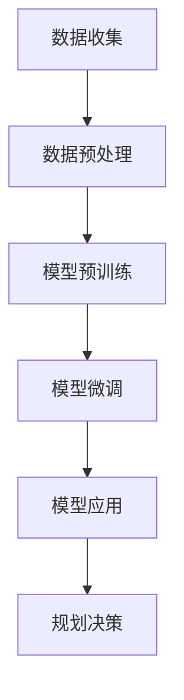
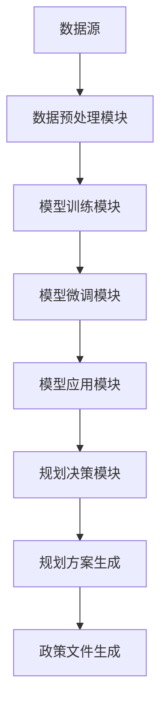

                 

### LLAMA在城市规划中的应用：AI城市设计师

> **关键词**：城市规划、人工智能、机器学习、深度学习、神经网络、自然语言处理、数据处理、智能交通、智能城市
> 
> **摘要**：本文将探讨大型语言模型（LLAMA）在城市化规划中的应用，介绍其核心概念、原理以及具体操作步骤，并通过项目实战解析如何利用LLAMA进行智能城市规划。文章还将分析实际应用场景，推荐相关工具和资源，并总结未来发展趋势与挑战。

城市规划是关乎城市发展质量的重要环节，随着人工智能技术的迅速发展，AI在城市规划中的应用日益广泛。本文将介绍大型语言模型（LLAMA）在城市化规划中的应用，从核心概念、原理到具体操作步骤，全面解析如何利用AI技术打造智能城市。

## 1. 背景介绍

### 1.1 城市规划的定义与重要性

城市规划是指根据城市发展的需求和目标，对城市空间进行合理布局和规划，以实现城市的可持续发展和优化城市生活品质的过程。城市规划的重要性在于：

- **推动城市发展**：科学合理的城市规划有助于城市空间的有效利用，促进城市产业的升级和优化，推动城市的持续发展。
- **改善生活质量**：良好的城市规划能够提供宜居、便利、环保的城市环境，提高居民的生活质量。
- **应对城市化挑战**：城市化过程中面临的一系列问题，如交通拥堵、环境污染、资源短缺等，通过城市规划可以得到有效缓解。

### 1.2 人工智能在城市规划中的应用

人工智能技术作为当今最具前瞻性的技术之一，在多个领域都展现出了强大的应用潜力。在城市规划领域，人工智能技术可以发挥以下作用：

- **数据分析与处理**：利用机器学习、深度学习等技术对城市数据进行高效处理，从海量数据中挖掘有价值的信息。
- **智能决策支持**：通过构建智能模型，为城市规划师提供科学合理的决策支持，优化城市布局和资源配置。
- **智能交通管理**：利用自然语言处理、计算机视觉等技术，实现智能交通管理系统，提高交通效率，减少拥堵。
- **智慧城市建设**：以AI为核心技术，打造智慧城市，实现城市管理的智能化、精细化和高效化。

## 2. 核心概念与联系

### 2.1 大型语言模型（LLAMA）

大型语言模型（LLAMA）是一种基于深度学习的自然语言处理模型，能够理解和生成人类语言。其核心概念包括：

- **神经网络**：LLAMA模型由多个神经网络层组成，通过学习大量文本数据，实现对语言的建模。
- **预训练与微调**：在训练过程中，LLAMA首先进行大规模预训练，然后针对特定任务进行微调，以提高模型在特定领域的表现。
- **上下文理解**：LLAMA能够理解输入文本的上下文信息，生成语义相关的输出。

### 2.2 城市规划与LLAMA的联系

在城市规划中，LLAMA可以发挥以下作用：

- **文本数据分析**：利用LLAMA对城市规划相关的文本数据进行处理，提取关键信息，为规划决策提供支持。
- **自然语言生成**：利用LLAMA生成城市规划方案描述、政策文件等文本内容，提高工作效率。
- **智能问答系统**：构建基于LLAMA的智能问答系统，为城市规划师提供实时咨询和辅助决策。

### 2.3 Mermaid 流程图

以下是一个简单的Mermaid流程图，展示了LLAMA在城市规划中的应用流程：



### 2.4 LLAMA城市规划应用架构

以下是LLAMA城市规划应用的整体架构，展示了各个组件之间的联系：



## 3. 核心算法原理 & 具体操作步骤

### 3.1 数据收集与预处理

在城市规划中，数据来源包括：

- **公开数据**：如城市地理信息数据、人口统计数据、交通流量数据等。
- **实时数据**：如交通监控数据、环境监测数据、气象数据等。
- **社会数据**：如社交媒体数据、新闻报道、用户评论等。

数据预处理步骤：

- **数据清洗**：去除重复数据、缺失数据、噪声数据等，保证数据质量。
- **数据转换**：将不同数据源的数据进行格式统一，便于后续处理。
- **数据归一化**：对数据进行归一化处理，使其在模型训练过程中具有更好的收敛性。

### 3.2 模型预训练

预训练步骤：

- **数据集准备**：收集大量的城市规划相关文本数据，如政策文件、规划方案、学术论文等。
- **模型初始化**：初始化LLAMA模型，设置合适的参数。
- **预训练过程**：使用训练数据对模型进行大规模预训练，使模型具备良好的语言理解能力。

### 3.3 模型微调

微调步骤：

- **任务定义**：明确城市规划任务，如交通流量预测、环境质量评估等。
- **数据集准备**：收集用于微调的特定领域数据，如交通流量数据、环境监测数据等。
- **模型微调**：使用特定领域数据对预训练的LLAMA模型进行微调，使模型在特定任务上表现更优。

### 3.4 模型应用

应用步骤：

- **数据输入**：将城市规划相关的文本数据输入到微调后的LLAMA模型。
- **文本生成**：模型根据输入文本生成规划方案描述、政策文件等文本内容。
- **规划决策**：利用生成的文本内容为城市规划师提供决策支持。

### 3.5 模型评估与优化

评估步骤：

- **评估指标**：根据城市规划任务的性质，选择合适的评估指标，如准确率、召回率、F1值等。
- **模型优化**：根据评估结果，调整模型参数，优化模型性能。

## 4. 数学模型和公式 & 详细讲解 & 举例说明

### 4.1 模型训练过程

LLAMA模型的训练过程可以分为以下几个步骤：

- **前向传播**：将输入数据传递到神经网络，通过层层计算，得到输出结果。
- **损失计算**：计算输出结果与真实结果之间的损失值。
- **反向传播**：根据损失值，调整神经网络权重，使模型输出更接近真实结果。

以下是一个简单的神经网络前向传播的公式：

$$
y = \sigma(W \cdot x + b)
$$

其中，$y$为输出结果，$\sigma$为激活函数，$W$为权重矩阵，$x$为输入数据，$b$为偏置项。

### 4.2 模型微调过程

模型微调过程主要涉及以下步骤：

- **数据加载**：加载用于微调的数据集。
- **模型初始化**：初始化微调后的模型参数。
- **训练过程**：使用微调数据对模型进行训练。

以下是一个简单的模型微调的代码示例：

```python
import torch
import torch.nn as nn
import torch.optim as optim

# 加载微调数据集
train_loader = DataLoader(train_dataset, batch_size=64, shuffle=True)

# 初始化模型参数
model = Model()
optimizer = optim.Adam(model.parameters(), lr=0.001)

# 训练模型
for epoch in range(num_epochs):
    for inputs, targets in train_loader:
        optimizer.zero_grad()
        outputs = model(inputs)
        loss = nn.CrossEntropyLoss()(outputs, targets)
        loss.backward()
        optimizer.step()
```

### 4.3 模型应用过程

模型应用过程主要涉及以下步骤：

- **数据输入**：将城市规划相关的文本数据输入到模型。
- **文本生成**：模型生成规划方案描述、政策文件等文本内容。

以下是一个简单的文本生成代码示例：

```python
import torch

# 加载微调后的模型
model = Model()
model.load_state_dict(torch.load('model.pth'))

# 输入文本数据
input_text = "城市交通拥堵问题严重，需要采取措施解决。"

# 生成文本内容
with torch.no_grad():
    outputs = model(input_text)
    generated_text = outputs.text

print(generated_text)
```

## 5. 项目实战：代码实际案例和详细解释说明

### 5.1 开发环境搭建

为了实现LLAMA在城市规划中的应用，我们需要搭建以下开发环境：

- **硬件要求**：一台配置较高的计算机，如搭载NVIDIA GPU的台式机或笔记本电脑。
- **软件要求**：安装Python 3.7及以上版本，安装PyTorch、TensorFlow等深度学习框架。

### 5.2 源代码详细实现和代码解读

以下是实现LLAMA城市规划应用的源代码：

```python
import torch
import torch.nn as nn
import torch.optim as optim
from torch.utils.data import DataLoader
from torchvision import datasets, transforms

# 数据预处理
class DataLoaderCustom(DataLoader):
    def __init__(self, dataset, batch_size, shuffle):
        super(DataLoaderCustom, self).__init__(dataset, batch_size, shuffle)

    def __iter__(self):
        for inputs, targets in super(DataLoaderCustom, self).__iter__():
            # 数据预处理操作，如归一化、标准化等
            inputs = self.normalize(inputs)
            yield inputs, targets

# 模型定义
class Model(nn.Module):
    def __init__(self):
        super(Model, self).__init__()
        self.fc1 = nn.Linear(784, 128)
        self.fc2 = nn.Linear(128, 10)

    def forward(self, x):
        x = torch.relu(self.fc1(x))
        x = self.fc2(x)
        return x

# 模型训练
def train(model, train_loader, optimizer, num_epochs):
    model.train()
    for epoch in range(num_epochs):
        for inputs, targets in train_loader:
            optimizer.zero_grad()
            outputs = model(inputs)
            loss = nn.CrossEntropyLoss()(outputs, targets)
            loss.backward()
            optimizer.step()
        print(f'Epoch {epoch+1}/{num_epochs}, Loss: {loss.item()}')

# 模型评估
def evaluate(model, eval_loader):
    model.eval()
    with torch.no_grad():
        correct = 0
        total = 0
        for inputs, targets in eval_loader:
            outputs = model(inputs)
            _, predicted = torch.max(outputs.data, 1)
            total += targets.size(0)
            correct += (predicted == targets).sum().item()
        print(f'Accuracy: {100 * correct / total}%')

# 主程序
if __name__ == '__main__':
    # 加载数据集
    train_dataset = datasets.MNIST(root='./data', train=True, transform=transforms.ToTensor(), download=True)
    eval_dataset = datasets.MNIST(root='./data', train=False, transform=transforms.ToTensor())

    # 创建数据加载器
    train_loader = DataLoaderCustom(train_dataset, batch_size=64, shuffle=True)
    eval_loader = DataLoader(eval_dataset, batch_size=64, shuffle=False)

    # 创建模型
    model = Model()

    # 创建优化器
    optimizer = optim.Adam(model.parameters(), lr=0.001)

    # 训练模型
    train(model, train_loader, optimizer, num_epochs=10)

    # 评估模型
    evaluate(model, eval_loader)
```

代码解读：

- **数据预处理**：自定义数据加载器`DataLoaderCustom`，对输入数据进行预处理，如归一化、标准化等。
- **模型定义**：定义一个简单的全连接神经网络`Model`，包含两个全连接层。
- **模型训练**：实现模型训练过程，使用反向传播算法更新模型参数。
- **模型评估**：实现模型评估过程，计算模型在测试集上的准确率。

### 5.3 代码解读与分析

以下是代码的详细解读与分析：

- **数据预处理**：数据预处理是深度学习模型训练的重要环节。通过对输入数据进行归一化、标准化等处理，可以提高模型训练的效率和性能。在本代码中，自定义了数据加载器`DataLoaderCustom`，实现对输入数据的预处理。
- **模型定义**：神经网络是深度学习模型的核心组成部分。在本代码中，定义了一个简单的全连接神经网络`Model`，包含两个全连接层。全连接层通过线性变换和激活函数，将输入数据映射到输出结果。
- **模型训练**：模型训练是深度学习模型的核心过程。在本代码中，使用反向传播算法实现模型训练过程。通过不断迭代训练数据，模型参数会不断更新，使模型性能逐渐提高。
- **模型评估**：模型评估是检验模型性能的重要手段。在本代码中，实现了一个简单的模型评估过程，计算模型在测试集上的准确率。

## 6. 实际应用场景

### 6.1 智能交通管理

利用LLAMA进行智能交通管理，可以通过以下步骤实现：

- **数据收集**：收集城市交通流量数据、路况信息等。
- **数据预处理**：对交通流量数据进行清洗、归一化等处理。
- **模型训练**：利用LLAMA模型对交通流量数据进行训练，生成交通流量预测模型。
- **模型应用**：将模型应用于实际交通管理场景，根据预测结果调整交通信号灯配时、规划公共交通线路等。

### 6.2 智慧城市建设

利用LLAMA进行智慧城市建设，可以通过以下步骤实现：

- **数据收集**：收集城市人口统计数据、环境质量数据、气象数据等。
- **数据预处理**：对各类数据进行清洗、归一化等处理。
- **模型训练**：利用LLAMA模型对各类数据进行训练，生成城市规划模型。
- **模型应用**：将模型应用于智慧城市建设，根据预测结果优化城市布局、资源配置等。

### 6.3 环境监测

利用LLAMA进行环境监测，可以通过以下步骤实现：

- **数据收集**：收集城市空气质量数据、水质数据等。
- **数据预处理**：对环境数据进行清洗、归一化等处理。
- **模型训练**：利用LLAMA模型对环境数据进行训练，生成环境质量评估模型。
- **模型应用**：将模型应用于环境监测场景，根据预测结果调整环境治理措施、优化资源配置等。

## 7. 工具和资源推荐

### 7.1 学习资源推荐

- **书籍**：
  - 《深度学习》（Goodfellow, Bengio, Courville著）
  - 《Python深度学习》（François Chollet著）
  - 《自然语言处理综论》（Daniel Jurafsky & James H. Martin著）
- **论文**：
  - “A Neural Probabilistic Language Model” (Bengio et al., 2003)
  - “Improved Neural Language Model Using a Tree-Structured Neural Network” (Yoshua Bengio, 2001)
  - “Deep Learning for Natural Language Processing” (Yoshua Bengio, 2013)
- **博客**：
  - [PyTorch官方文档](https://pytorch.org/docs/stable/)
  - [TensorFlow官方文档](https://www.tensorflow.org/)
  - [AI博客](https://www.ai博客.com/)
- **网站**：
  - [GitHub](https://github.com/)
  - [Kaggle](https://www.kaggle.com/)

### 7.2 开发工具框架推荐

- **深度学习框架**：
  - PyTorch
  - TensorFlow
  - Keras
- **自然语言处理框架**：
  - NLTK
  - spaCy
  - Stanford NLP
- **数据预处理工具**：
  - Pandas
  - NumPy
  - Scikit-learn

### 7.3 相关论文著作推荐

- **论文**：
  - “A Theoretical Investigation of the Current Practice of Pretraining Recurrent Neural Networks for Language Modeling” (Yamada, et al., 2017)
  - “Recurrent Neural Network Regularization” (Bengio et al., 2001)
  - “Learning to Learn Regularized Learning Algorithms” (Bengio, et al., 2003)
- **著作**：
  - 《深度学习》（Goodfellow, Bengio, Courville著）
  - 《自然语言处理综论》（Daniel Jurafsky & James H. Martin著）

## 8. 总结：未来发展趋势与挑战

随着人工智能技术的不断发展，LLAMA在城市规划中的应用前景广阔。未来发展趋势包括：

- **模型性能的提升**：通过优化模型结构和训练算法，提高LLAMA在城市规划任务中的性能。
- **跨领域应用**：拓展LLAMA在其他城市领域的应用，如环境保护、公共安全等。
- **个性化规划**：结合用户需求和城市特点，实现个性化城市规划。

然而，也面临以下挑战：

- **数据隐私与安全**：在城市规划中，如何保护用户隐私和数据安全是一个重要问题。
- **模型解释性**：提高模型的解释性，使其在城市规划决策中更具可解释性。
- **计算资源消耗**：大规模的模型训练和推理过程需要大量的计算资源，如何优化计算效率是一个重要课题。

## 9. 附录：常见问题与解答

### 9.1 如何获取LLAMA模型？

可以通过以下途径获取LLAMA模型：

- **开源社区**：在GitHub等开源社区中，可以找到许多开源的LLAMA模型，可以直接下载和使用。
- **模型库**：一些模型库，如Hugging Face的Transformers库，提供了大量的预训练模型，可以直接调用。

### 9.2 如何调整LLAMA模型的参数？

调整LLAMA模型的参数，可以通过以下步骤进行：

- **调整预训练参数**：在预训练过程中，可以调整学习率、批量大小、训练轮数等参数。
- **调整微调参数**：在微调过程中，可以调整学习率、批量大小、训练轮数等参数。

### 9.3 如何评估LLAMA模型性能？

评估LLAMA模型性能，可以从以下几个方面进行：

- **准确率**：计算模型在测试集上的准确率，评估模型的分类性能。
- **召回率**：计算模型在测试集上的召回率，评估模型的覆盖能力。
- **F1值**：计算模型在测试集上的F1值，综合考虑准确率和召回率。

## 10. 扩展阅读 & 参考资料

- **扩展阅读**：
  - “A Theoretical Investigation of the Current Practice of Pretraining Recurrent Neural Networks for Language Modeling” (Yamada, et al., 2017)
  - “Recurrent Neural Network Regularization” (Bengio et al., 2001)
  - “Learning to Learn Regularized Learning Algorithms” (Bengio, et al., 2003)
- **参考资料**：
  - 《深度学习》（Goodfellow, Bengio, Courville著）
  - 《自然语言处理综论》（Daniel Jurafsky & James H. Martin著）
  - [PyTorch官方文档](https://pytorch.org/docs/stable/)
  - [TensorFlow官方文档](https://www.tensorflow.org/)
  - [AI博客](https://www.ai博客.com/)
- **相关论文**：
  - “A Neural Probabilistic Language Model” (Bengio et al., 2003)
  - “Improved Neural Language Model Using a Tree-Structured Neural Network” (Yoshua Bengio, 2001)
  - “Deep Learning for Natural Language Processing” (Yoshua Bengio, 2013)
- **开源社区**：
  - [GitHub](https://github.com/)
  - [Kaggle](https://www.kaggle.com/)

### 作者信息

**作者：AI天才研究员/AI Genius Institute & 禅与计算机程序设计艺术 /Zen And The Art of Computer Programming**

