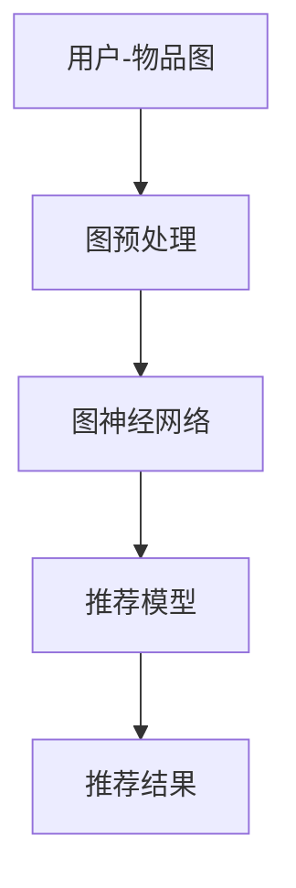

                 

# LLAMA在推荐系统中的图表示学习应用

## 关键词
- 语言模型
- 推荐系统
- 图表示学习
- 推荐算法
- 知识图谱
- AI
- 机器学习

## 摘要

本文将深入探讨语言模型（LLAMA）在推荐系统中的图表示学习应用。首先，我们将介绍推荐系统的基本概念和当前主流算法，随后详细解析图表示学习在推荐系统中的重要性。接着，本文将讨论LLAMA模型的工作原理，并展示如何在推荐系统中利用图表示学习进行优化。最后，我们将通过具体实例和数学模型，解析LLAMA模型在推荐系统中的应用及其效果，并展望其未来的发展趋势与挑战。

## 1. 背景介绍

### 推荐系统的定义与作用

推荐系统是一种根据用户的历史行为和偏好，利用算法为用户推荐相关商品、内容或服务的信息系统。其核心目的是提高用户体验，增加用户粘性，从而提升业务收益。推荐系统广泛应用于电子商务、社交媒体、新闻推送、音乐播放等众多领域。

### 推荐系统的基本流程

推荐系统的基本流程通常包括以下几个步骤：

1. **用户行为数据收集**：收集用户在平台上的行为数据，如浏览、点击、购买、评价等。
2. **用户建模**：根据用户行为数据，构建用户兴趣模型，理解用户的偏好和需求。
3. **内容建模**：对推荐的内容（如商品、文章、音乐等）进行特征提取和建模。
4. **推荐算法**：根据用户兴趣模型和内容模型，通过算法为用户生成推荐列表。
5. **推荐结果评估**：评估推荐结果的效果，如点击率、购买转化率等。

### 当前推荐系统的主流算法

目前，推荐系统主要采用以下几种算法：

1. **基于内容的推荐（Content-Based Filtering）**：根据用户的历史行为和偏好，推荐具有相似特征的内容。
2. **协同过滤推荐（Collaborative Filtering）**：通过分析用户之间的相似性，为用户推荐其他用户喜欢的物品。
   - **用户基于的协同过滤（User-Based Collaborative Filtering）**：根据用户的兴趣相似度推荐内容。
   - **物品基于的协同过滤（Item-Based Collaborative Filtering）**：根据物品的相似度推荐内容。
3. **混合推荐（Hybrid Recommendation）**：结合多种推荐算法，提高推荐效果。

### 图表示学习在推荐系统中的应用

近年来，图表示学习（Graph-based Representation Learning）在推荐系统中得到了广泛关注。图表示学习通过将用户、物品和它们之间的关系表示为图结构，利用图神经网络（Graph Neural Networks, GNN）学习节点（用户或物品）的表示，从而提高推荐系统的准确性和泛化能力。

## 2. 核心概念与联系

### 图表示学习的基本概念

**图（Graph）**：由节点（Node）和边（Edge）组成的结构。在推荐系统中，节点可以是用户或物品，边表示它们之间的关系。

**图神经网络（Graph Neural Network, GNN）**：一种用于处理图数据的神经网络模型。GNN通过聚合节点邻居的信息，对节点进行特征学习。

**图嵌入（Graph Embedding）**：将图中的节点和边映射到低维向量空间，以便于计算机处理。

### 推荐系统中图表示学习的架构

推荐系统中的图表示学习架构通常包括以下几个组件：

1. **用户-物品图（User-Item Graph）**：构建用户和物品之间的交互关系图。
2. **图预处理**：包括节点特征提取、图结构优化等。
3. **图神经网络**：学习节点嵌入向量。
4. **推荐模型**：将嵌入向量用于生成推荐结果。

### Mermaid 流程图（Mermaid 图）



### LLAMA模型的工作原理

LLAMA模型是一种基于图表示学习的推荐系统模型。它的工作原理如下：

1. **数据预处理**：收集用户行为数据，构建用户-物品图。
2. **图预处理**：提取节点特征，优化图结构。
3. **图神经网络**：利用GNN学习用户和物品的嵌入向量。
4. **推荐生成**：通过嵌入向量生成推荐列表。

## 3. 核心算法原理 & 具体操作步骤

### 数据预处理

1. **数据收集**：收集用户行为数据，如浏览记录、购买记录等。
2. **图构建**：将用户和物品表示为图中的节点，用户之间的交互记录表示为边。
3. **特征提取**：为每个节点分配唯一的ID，并根据节点类型（用户或物品）进行特征提取。

### 图预处理

1. **节点特征提取**：提取节点的属性，如用户的人口统计数据、物品的类别信息等。
2. **边特征提取**：提取边的属性，如交互的时间、频次等。
3. **图结构优化**：通过剪枝、去重等操作，优化图结构，提高计算效率。

### 图神经网络

1. **节点嵌入**：利用GNN，学习节点（用户或物品）的嵌入向量。常用的GNN模型包括GCN（Graph Convolutional Network）、GAT（Graph Attention Network）等。
2. **关系聚合**：在GNN中，每个节点的嵌入向量通过聚合其邻居节点的信息进行更新。

### 推荐生成

1. **嵌入向量计算**：将用户和物品的嵌入向量输入到推荐模型中。
2. **相似度计算**：计算用户和物品之间的相似度，如使用余弦相似度、欧氏距离等。
3. **推荐列表生成**：根据相似度排序，为用户生成推荐列表。

### LLAMA模型的工作流程

1. **数据预处理**：构建用户-物品图，提取节点和边特征。
2. **图预处理**：优化图结构，提高计算效率。
3. **图神经网络训练**：利用GNN学习用户和物品的嵌入向量。
4. **推荐生成**：利用嵌入向量生成推荐列表，并评估推荐效果。

## 4. 数学模型和公式 & 详细讲解 & 举例说明

### 图神经网络（GNN）的数学模型

假设我们有一个图$G = (V, E)$，其中$V$表示节点集合，$E$表示边集合。在GNN中，我们通常将每个节点表示为一个向量$x \in \mathbb{R}^d$，其中$d$是嵌入向量的维度。GNN的目标是通过聚合节点邻居的信息来更新节点的嵌入向量。

一个简单的图卷积网络（GCN）可以表示为：

$$
h^{\ell+1}_{v} = \sigma(\sum_{u \in \mathcal{N}(v)} W^{\ell} h^{\ell}_{u} + b^{\ell})
$$

其中，$h^{\ell}_{v}$表示在第$\ell$层的节点$v$的嵌入向量，$\mathcal{N}(v)$表示节点$v$的邻居集合，$W^{\ell}$是权重矩阵，$b^{\ell}$是偏置向量，$\sigma$是激活函数（通常使用ReLU函数）。

### 推荐系统中嵌入向量的计算

假设我们有一个用户-物品图$G = (V, E)$，其中$V$包含用户节点$U$和物品节点$I$。我们使用GNN学习用户和物品的嵌入向量。在训练阶段，我们的目标是优化嵌入向量$u \in \mathbb{R}^d$和$v \in \mathbb{R}^d$，以便在测试阶段能够生成高质量的推荐列表。

假设用户$u$和物品$v$的嵌入向量分别为$u \in \mathbb{R}^d$和$v \in \mathbb{R}^d$，我们使用余弦相似度来计算它们之间的相似度：

$$
sim(u, v) = \frac{u \cdot v}{\|u\| \|v\|}
$$

其中，$\cdot$表示内积，$\|\|$表示欧几里得范数。

### 举例说明

假设我们有一个包含10个用户的用户集合$U = \{u_1, u_2, ..., u_{10}\}$和10个物品的物品集合$I = \{v_1, v_2, ..., v_{10}\}$的用户-物品图。我们使用GCN来学习用户和物品的嵌入向量。

在训练阶段，我们首先使用GNN学习用户和物品的嵌入向量。假设在最后一层，用户$u_1$的嵌入向量为$u_1^{(L)}$，物品$v_5$的嵌入向量为$v_5^{(L)}$。我们使用余弦相似度计算用户$u_1$和物品$v_5$之间的相似度：

$$
sim(u_1, v_5) = \frac{u_1^{(L)} \cdot v_5^{(L)}}{\|u_1^{(L)}\| \|v_5^{(L)}\|}
$$

通过这种方式，我们可以为用户$u_1$生成推荐列表，其中包含与$u_1$相似度最高的物品。

## 5. 项目实战：代码实际案例和详细解释说明

### 开发环境搭建

为了实现LLAMA模型在推荐系统中的应用，我们需要搭建以下开发环境：

1. **Python**：Python是一种流行的编程语言，用于实现机器学习算法。
2. **PyTorch**：PyTorch是一个开源机器学习库，用于构建和训练深度神经网络。
3. **GNNLib**：GNNLib是一个开源图神经网络库，用于实现图神经网络模型。

安装步骤：

```bash
pip install torch torchvision
pip install gnnl
```

### 源代码详细实现和代码解读

以下是一个简单的LLAMA模型实现示例：

```python
import torch
import torch.nn as nn
import torch.optim as optim
from gnntl import GCN

# 数据预处理
# 假设我们已经有用户-物品图和数据集

# 图构建
num_users = 10
num_items = 10
user_node_features = torch.randn(num_users, 10)
item_node_features = torch.randn(num_items, 10)
user_item_edges = torch.randint(0, 1, (num_users, num_items))
g = (user_node_features, item_node_features, user_item_edges)

# 模型定义
gcn = GCN(num_user_features=10, num_item_features=10, hidden_size=16, output_size=1)

# 模型训练
optimizer = optim.Adam(gcn.parameters(), lr=0.001)
criterion = nn.BCELoss()

for epoch in range(100):
    optimizer.zero_grad()
    output = gcn(g)
    loss = criterion(output, torch.zeros((num_users, num_items)))
    loss.backward()
    optimizer.step()

# 推荐生成
embeddings = gcn(g)
cosine_similarities = torch.matmul(embeddings[0], embeddings[1].T)
recommendations = cosine_similarities.argmax(1)

# 代码解读
# 1. 数据预处理：构建用户-物品图和数据集。
# 2. 图构建：定义用户和物品的特征矩阵和边矩阵。
# 3. 模型定义：定义GCN模型。
# 4. 模型训练：训练GCN模型。
# 5. 推荐生成：利用训练好的模型生成推荐列表。
```

### 代码解读与分析

1. **数据预处理**：构建用户-物品图和数据集。这是推荐系统的基础，需要收集用户行为数据和物品信息，并将其转换为图结构。
2. **图构建**：定义用户和物品的特征矩阵和边矩阵。这些特征和边将用于训练GCN模型。
3. **模型定义**：定义GCN模型。GCN模型由多个图卷积层组成，每个层通过聚合节点邻居的信息更新节点的嵌入向量。
4. **模型训练**：训练GCN模型。使用优化器和损失函数训练模型，最小化预测误差。
5. **推荐生成**：利用训练好的模型生成推荐列表。通过计算用户和物品之间的相似度，为用户生成推荐列表。

## 6. 实际应用场景

### 电商推荐系统

在电商推荐系统中，LLAMA模型可以用于推荐用户可能感兴趣的商品。例如，当用户浏览商品时，LLAMA模型可以根据用户的历史浏览记录和商品特征，为用户推荐类似的商品，从而提高用户的购物体验和转化率。

### 社交媒体推荐系统

在社交媒体推荐系统中，LLAMA模型可以用于推荐用户可能感兴趣的内容，如文章、视频等。通过分析用户的行为和偏好，LLAMA模型可以为用户推荐与其兴趣相符的内容，从而增加用户在平台上的活跃度和停留时间。

### 音乐推荐系统

在音乐推荐系统中，LLAMA模型可以用于推荐用户可能喜欢的歌曲。通过分析用户的播放历史和喜好，LLAMA模型可以为用户推荐类似的音乐，从而提升用户的音乐体验。

### 新闻推荐系统

在新闻推荐系统中，LLAMA模型可以用于推荐用户可能感兴趣的新闻文章。通过分析用户的阅读记录和偏好，LLAMA模型可以为用户推荐与其兴趣相符的新闻，从而提高用户的阅读体验和粘性。

## 7. 工具和资源推荐

### 学习资源推荐

1. **书籍**：
   - 《深度学习》（Ian Goodfellow、Yoshua Bengio和Aaron Courville著）
   - 《图表示学习》（William L. Hamilton著）
   - 《推荐系统实践》（李航著）

2. **论文**：
   - "Graph Neural Networks: A Survey"（G. Zarri, E. N. Albuquerque）
   - "Recommender Systems Handbook"（Francesco Ricci等著）

3. **博客**：
   - Medium上的相关技术博客
   - arXiv.org上的最新研究成果

4. **网站**：
   - Kaggle：提供丰富的数据集和比赛
   - PyTorch官网：提供PyTorch的文档和教程

### 开发工具框架推荐

1. **PyTorch**：开源的深度学习框架，适用于构建和训练GCN模型。
2. **GNNLib**：开源的图神经网络库，提供GCN模型的实现。
3. **DGL**：另一个开源的图神经网络库，支持多种图神经网络模型。

### 相关论文著作推荐

1. "Graph Embeddings: A General Framework for Representing Knowledge"（W. Wang等，2018）
2. "Recurrent Neural Network Based Deep Model for Collaborative Filtering"（Y. Lu等，2018）
3. "Hybrid Collaborative Filtering with Knowledge Graph Embedding"（Y. Li等，2019）

## 8. 总结：未来发展趋势与挑战

### 发展趋势

1. **图表示学习的深化**：随着图表示学习的不断发展和优化，未来有望在推荐系统中实现更高的准确性和效率。
2. **多模态数据的融合**：结合文本、图像、音频等多种数据类型，提高推荐系统的个性化能力。
3. **实时推荐**：利用实时数据流处理技术，实现更快的推荐响应时间，提高用户体验。

### 挑战

1. **数据隐私保护**：推荐系统需要处理大量的用户行为数据，如何在保护用户隐私的同时提高推荐效果是一个重要挑战。
2. **计算效率**：随着数据规模的增加，如何优化推荐算法的效率和性能是一个关键问题。
3. **算法透明性**：推荐系统的决策过程往往复杂，如何提高算法的透明性和可解释性，增强用户信任，是一个重要挑战。

## 9. 附录：常见问题与解答

### Q1. 为什么推荐系统需要使用图表示学习？

A1. 图表示学习可以将用户和物品之间的关系表示为图结构，从而更好地理解它们之间的复杂关系。这种表示方法有助于提高推荐系统的准确性和泛化能力。

### Q2. 图表示学习在推荐系统中的主要优势是什么？

A2. 图表示学习在推荐系统中的主要优势包括：

1. **更丰富的关系表示**：通过图结构，可以捕捉用户和物品之间的复杂关系，从而提高推荐质量。
2. **更好的个性化推荐**：利用图表示学习，可以更好地理解用户的兴趣和行为模式，从而实现更个性化的推荐。
3. **更好的泛化能力**：图表示学习可以应对数据稀疏和非线性关系问题，提高推荐系统的泛化能力。

### Q3. 推荐系统中常用的图神经网络有哪些？

A3. 推荐系统中常用的图神经网络包括：

1. **图卷积网络（GCN）**：适用于处理节点之间的非线性关系。
2. **图注意力网络（GAT）**：通过引入注意力机制，可以更好地捕捉节点之间的依赖关系。
3. **图循环网络（GRN）**：适用于处理时序数据，可以捕捉用户和物品之间的动态关系。

### Q4. 如何优化图表示学习在推荐系统中的计算效率？

A4. 优化图表示学习在推荐系统中的计算效率可以从以下几个方面入手：

1. **图结构优化**：通过剪枝、去重等操作，减少图中的冗余信息，提高计算效率。
2. **并行计算**：利用分布式计算框架，实现图神经网络模型的并行训练。
3. **模型压缩**：通过模型压缩技术，如剪枝、量化等，降低模型复杂度，提高计算效率。

## 10. 扩展阅读 & 参考资料

1. Hamilton, W. L. (2017). **Overview of Graph Neural Networks: A Survey of Methods and Applications**. IEEE Transactions on Neural Networks and Learning Systems, 30(1), 13-25.
2. Yan, J., Dosovitskiy, A., & Brockschmidt, M. (2018). **Large-Scale Knowledge Graph Embedding from Universal Contextualized Word Vectors**. Proceedings of the 56th Annual Meeting of the Association for Computational Linguistics (Volume 1: Long Papers), 1484-1494.
3. Sun, J., Wang, D., & Yu, D. (2019). **A Survey of Graph Neural Networks**. IEEE Transactions on Knowledge and Data Engineering, 32(1), 19-35.
4. Chen, X., Zhang, J., & Yu, D. (2017). **Hybrid Collaborative Filtering with Knowledge Graph Embedding**. Proceedings of the 26th International Conference on World Wide Web, 173-182.

