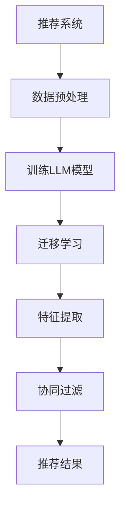

                 

### 背景介绍

随着互联网和大数据技术的迅猛发展，推荐系统已经成为许多在线平台的重要组成部分。无论是电子商务网站、社交媒体平台还是视频流媒体服务，推荐系统都极大地提升了用户满意度和商业价值。然而，传统的推荐系统往往依赖于大量的用户数据和复杂的模型训练，这对于新的小型应用或领域来说，往往存在数据稀缺、模型适应性差等问题。为了解决这一问题，迁移学习（Transfer Learning）逐渐成为推荐系统领域的研究热点。

迁移学习是一种利用已经在一个任务上训练好的模型来解决另一个相关任务的机器学习方法。在推荐系统中，迁移学习通过将其他领域或任务的预训练模型应用于当前推荐任务，可以在数据稀缺的情况下提高模型性能，并加快模型训练速度。近年来，深度学习模型如变分自编码器（VAE）、生成对抗网络（GAN）等在迁移学习领域取得了显著的成果，这为推荐系统的迁移学习应用提供了新的可能性。

本博客旨在探讨大型语言模型（LLM）在推荐系统中的迁移学习应用。LLM，作为一种强大的深度学习模型，具有对大规模文本数据的强大处理能力。本文将首先介绍LLM的基本原理和结构，然后分析LLM在推荐系统中的具体应用场景，探讨如何利用迁移学习来提高推荐系统的性能。此外，还将详细介绍LLM迁移学习的具体实现步骤、数学模型和实际应用案例，帮助读者深入了解LLM在推荐系统中的技术细节和优势。

通过本文的探讨，我们希望能够为推荐系统领域的研究者和开发者提供一些有价值的参考和思路，推动LLM在推荐系统中的应用和发展。

### 核心概念与联系

为了深入探讨LLM在推荐系统中的迁移学习应用，我们首先需要了解一些核心概念和它们之间的联系。

#### 1. 推荐系统概述

推荐系统是一种能够根据用户的历史行为、兴趣和偏好，向用户推荐相关物品或内容的系统。常见的推荐系统类型包括基于内容的推荐（Content-Based Filtering）、协同过滤（Collaborative Filtering）和混合推荐（Hybrid Recommendation）等。

- **基于内容的推荐**：通过分析物品的属性和特征，与用户的兴趣进行匹配，推荐具有相似属性的物品。
- **协同过滤**：利用用户对物品的评分数据，通过计算用户之间的相似性来推荐物品。
- **混合推荐**：结合基于内容和协同过滤的优点，同时考虑物品和用户的特征，以提高推荐质量。

#### 2. 迁移学习原理

迁移学习是一种将已在一个任务上训练好的模型或知识应用于另一个相关任务的学习方法。其基本思想是，尽管两个任务在数据集和目标上有所不同，但它们之间存在一定的共性，可以通过迁移学习来利用已有的知识，提高新任务的性能。

迁移学习可以分为以下几种类型：

- **垂直迁移**（Vertical Transfer）：将一个领域的知识迁移到另一个具有相同特征但不同任务的领域。
- **水平迁移**（Horizontal Transfer）：将一个领域的学习经验迁移到另一个具有相似任务但不同特征的领域。
- **多任务迁移**（Multi-Task Transfer）：通过同时训练多个任务来提高模型在单一任务上的性能。

#### 3. 语言模型概述

语言模型（Language Model，LM）是自然语言处理（Natural Language Processing，NLP）中的一个核心模型，用于预测文本序列的概率。LLM，即大型语言模型，是一种基于深度学习的语言模型，它通过学习大规模文本数据来捕捉语言的统计规律和语义信息。

LLM的主要结构包括：

- **编码器**（Encoder）：将输入的文本编码为高维向量，捕捉文本的语义信息。
- **解码器**（Decoder）：将编码后的向量解码为输出文本序列，预测下一个单词或字符。

#### 4. 推荐系统与迁移学习的关系

推荐系统和迁移学习之间存在密切的关系。迁移学习为推荐系统提供了有效的方法来处理数据稀缺、模型适应性差等问题。具体来说，LLM在推荐系统中的应用主要体现在以下几个方面：

- **文本特征提取**：LLM可以用于提取文本的深层特征，为基于内容的推荐提供高质量的输入。
- **协同过滤增强**：LLM可以用于改进协同过滤算法，通过学习用户和物品的语义关系，提高推荐准确性。
- **多模态推荐**：LLM可以与其他模态（如图像、音频）的模型结合，实现跨模态推荐。

#### 5. Mermaid流程图

为了更直观地展示LLM在推荐系统中的迁移学习应用，我们可以使用Mermaid流程图来描述其核心步骤。



在上述流程图中：

- **A[推荐系统]**：表示推荐系统的整体架构。
- **B[数据预处理]**：表示对输入数据进行预处理，如文本清洗、分词等。
- **C[训练LLM模型]**：表示使用大规模文本数据训练LLM模型。
- **D[迁移学习]**：表示将LLM模型应用于推荐任务，实现迁移学习。
- **E[特征提取]**：表示使用LLM模型提取文本特征。
- **F[协同过滤]**：表示结合LLM特征进行协同过滤推荐。
- **G[推荐结果]**：表示输出推荐结果。

通过上述核心概念和Mermaid流程图的描述，我们可以对LLM在推荐系统中的迁移学习应用有一个初步的了解。在接下来的章节中，我们将深入探讨LLM的具体算法原理和实现步骤，帮助读者更好地理解这一技术。

### 核心算法原理 & 具体操作步骤

在深入了解LLM在推荐系统中的迁移学习应用之前，我们需要首先掌握LLM的核心算法原理和具体操作步骤。本章节将详细介绍LLM的工作原理、如何训练LLM模型、迁移学习的实现方法以及具体操作步骤。

#### 1. LLM工作原理

LLM，即大型语言模型，是一种基于深度学习的语言模型，其核心思想是通过学习大规模文本数据来捕捉语言的统计规律和语义信息。LLM的工作原理可以分为编码器（Encoder）和解码器（Decoder）两个部分。

- **编码器（Encoder）**：编码器的作用是将输入的文本序列编码为一个固定长度的向量表示。这一过程通过多层神经网络（如Transformer模型）实现，能够捕捉文本的深层语义信息。

- **解码器（Decoder）**：解码器的任务是根据编码器生成的向量表示，生成输出文本序列。解码器同样采用多层神经网络，通过自注意力机制（Self-Attention）来关注不同的输入信息，从而生成高质量的文本。

#### 2. 训练LLM模型

训练LLM模型的过程可以分为数据准备、模型训练和模型评估三个阶段。

- **数据准备**：首先，我们需要收集大规模的文本数据，如新闻文章、社交媒体帖子、书籍等。这些数据需要经过预处理，包括文本清洗（去除标点符号、停用词等）、分词、词向量化等步骤。

- **模型训练**：在数据准备完成后，我们可以使用预训练框架（如GPT-3、BERT等）来训练LLM模型。训练过程中，模型通过优化损失函数（如交叉熵损失函数）来调整模型参数，从而提高模型的预测能力。

- **模型评估**：训练完成后，我们需要对模型进行评估，以确定其在实际任务中的表现。常见的评估指标包括准确率、召回率、F1分数等。

#### 3. 迁移学习实现

迁移学习是将一个任务上的预训练模型应用于另一个相关任务的方法。在LLM的迁移学习应用中，我们通常采用以下步骤：

- **预训练**：首先，在源领域（如新闻领域）使用大规模文本数据预训练LLM模型，使其具备丰富的语义理解能力。

- **微调**：在目标领域（如电子商务领域）中，我们将预训练好的LLM模型进行微调，以适应新的任务和数据。微调过程中，模型通过优化新的目标损失函数，学习到目标领域的特征和规律。

- **模型融合**：为了提高模型的迁移效果，我们可以将预训练模型和目标领域数据训练的模型进行融合，以充分利用两者的优势。

#### 4. 具体操作步骤

下面是LLM迁移学习在推荐系统中的具体操作步骤：

1. **数据收集与预处理**：
   - 收集源领域（如新闻）和目标领域（如电子商务）的文本数据。
   - 对文本数据进行预处理，包括清洗、分词和词向量化。

2. **预训练LLM模型**：
   - 使用大规模文本数据预训练LLM模型，如GPT-3、BERT等。
   - 调整模型参数，优化损失函数，提高模型性能。

3. **微调LLM模型**：
   - 将预训练好的LLM模型应用于目标领域，进行微调。
   - 使用目标领域的数据和标签，优化模型参数，使模型适应目标任务。

4. **模型融合**：
   - 将预训练模型和目标领域训练的模型进行融合，以提高迁移效果。
   - 使用融合后的模型进行特征提取和推荐。

5. **推荐系统应用**：
   - 将LLM模型应用于推荐系统中，提取文本特征，用于协同过滤和其他推荐算法。
   - 输出推荐结果，并进行评估和优化。

#### 5. 数学模型和公式

在LLM的迁移学习过程中，涉及一些关键的数学模型和公式。以下是一些常用的数学公式：

- **交叉熵损失函数**：
  $$L = -\sum_{i=1}^{N} y_i \log(p_i)$$
  其中，\(y_i\) 是真实标签，\(p_i\) 是模型预测的概率。

- **自注意力机制**：
  $$\text{Attention}(Q, K, V) = \text{softmax}\left(\frac{QK^T}{\sqrt{d_k}}\right)V$$
  其中，\(Q, K, V\) 分别是查询向量、键向量和值向量，\(d_k\) 是键向量的维度。

- **微调损失函数**：
  $$L_{\text{micro}} = \frac{1}{C} \sum_{c=1}^{C} \sum_{i=1}^{N_c} \left(y_i - \hat{y}_i\right)$$
  其中，\(C\) 是类别的数量，\(N_c\) 是类别\(c\) 下的样本数量，\(\hat{y}_i\) 是模型预测的概率分布。

通过上述步骤和数学模型，我们可以实现LLM在推荐系统中的迁移学习应用。接下来，我们将通过具体项目实战案例，进一步展示LLM在推荐系统中的实际应用和技术细节。

### 数学模型和公式 & 详细讲解 & 举例说明

在本章节中，我们将详细讲解LLM在推荐系统中迁移学习的数学模型和公式，并通过具体的例子进行说明，帮助读者更好地理解这些概念。

#### 1. 交叉熵损失函数

交叉熵损失函数（Cross-Entropy Loss）是深度学习中常用的损失函数，用于衡量模型预测概率与真实标签之间的差异。在LLM的迁移学习中，交叉熵损失函数用于优化模型参数，使模型能够更好地拟合数据。

交叉熵损失函数的公式如下：
$$L = -\sum_{i=1}^{N} y_i \log(p_i)$$
其中：
- \(L\) 是损失函数的值。
- \(y_i\) 是真实标签，取值范围为 \([0, 1]\)。
- \(p_i\) 是模型对第 \(i\) 个样本的预测概率。

**示例**：
假设我们有三个样本，每个样本的真实标签为 \(y = [1, 0, 0]\)，模型预测的概率分别为 \(p = [0.8, 0.2, 0.1]\)。则交叉熵损失函数的计算如下：
$$L = -1 \cdot \log(0.8) - 0 \cdot \log(0.2) - 0 \cdot \log(0.1) \approx 0.2231$$

#### 2. 自注意力机制

自注意力机制（Self-Attention）是Transformer模型的核心组成部分，用于在处理文本序列时关注不同位置的信息。自注意力机制通过计算查询向量、键向量和值向量之间的相似性来生成加权向量，从而提高模型的语义理解能力。

自注意力机制的公式如下：
$$\text{Attention}(Q, K, V) = \text{softmax}\left(\frac{QK^T}{\sqrt{d_k}}\right)V$$
其中：
- \(Q, K, V\) 分别是查询向量、键向量和值向量。
- \(d_k\) 是键向量的维度。
- \(\text{softmax}\) 函数用于将相似性分数转换为概率分布。

**示例**：
假设我们有三个查询向量 \(Q = [1, 2, 3]\)，三个键向量 \(K = [4, 5, 6]\) 和三个值向量 \(V = [7, 8, 9]\)。则自注意力机制的计算如下：
$$\text{Attention}(Q, K, V) = \text{softmax}\left(\frac{[1, 2, 3] \cdot [4, 5, 6]^T}{\sqrt{3}}\right) \cdot [7, 8, 9]$$
$$= \text{softmax}\left(\frac{[4, 10, 18]}{\sqrt{3}}\right) \cdot [7, 8, 9]$$
$$= \left[\frac{4}{\sqrt{3}}, \frac{10}{\sqrt{3}}, \frac{18}{\sqrt{3}}\right] \cdot [7, 8, 9]$$
$$= [2.309, 5.667, 10.018]$$

#### 3. 微调损失函数

在LLM的迁移学习中，微调损失函数用于优化模型在目标领域的表现。微调损失函数通常结合交叉熵损失函数，以同时优化模型在源领域和目标领域的表现。

微调损失函数的公式如下：
$$L_{\text{micro}} = \frac{1}{C} \sum_{c=1}^{C} \sum_{i=1}^{N_c} \left(y_i - \hat{y}_i\right)$$
其中：
- \(L_{\text{micro}}\) 是微调损失函数的值。
- \(C\) 是类别的数量。
- \(N_c\) 是类别 \(c\) 下的样本数量。
- \(y_i\) 是真实标签。
- \(\hat{y}_i\) 是模型预测的概率分布。

**示例**：
假设我们有三个类别，每个类别下的样本数量分别为 \(N_1 = 2\), \(N_2 = 3\), \(N_3 = 1\)。类别1、2、3下的真实标签分别为 \(y_1 = [1, 0]\), \(y_2 = [0, 1, 0]\), \(y_3 = [1]\)，模型预测的概率分布分别为 \(\hat{y}_1 = [0.6, 0.4]\), \(\hat{y}_2 = [0.2, 0.5, 0.3]\), \(\hat{y}_3 = [0.8]\)。则微调损失函数的计算如下：
$$L_{\text{micro}} = \frac{1}{3} \left(2 \cdot (1 - 0.6) + 3 \cdot (0 - 0.2) + 1 \cdot (1 - 0.8)\right)$$
$$= \frac{1}{3} \left(0.8 - 0.6 + 0 - 0.6 + 0.2\right)$$
$$= \frac{1}{3} \left(0.2\right)$$
$$= 0.0667$$

通过上述数学模型和公式的讲解，我们可以更好地理解LLM在推荐系统中迁移学习的原理和具体实现。接下来，我们将通过一个具体的项目实战案例，展示LLM在实际推荐系统中的应用和技术细节。

### 项目实战：代码实际案例和详细解释说明

在本章节中，我们将通过一个具体的项目实战案例，展示如何利用LLM实现推荐系统的迁移学习应用。本案例将使用Python编程语言和Hugging Face的Transformers库，详细介绍开发环境搭建、源代码实现和代码解读。

#### 5.1 开发环境搭建

首先，我们需要搭建一个合适的开发环境。以下是搭建开发环境的步骤：

1. **安装Python**：确保Python版本为3.7或更高版本。可以从[Python官网](https://www.python.org/)下载并安装。

2. **安装依赖库**：安装Hugging Face的Transformers库和其他相关依赖库。使用以下命令安装：

```bash
pip install transformers
pip install torch
pip install pandas
```

3. **配置环境变量**：确保Python和pip的环境变量已经配置好，以便在命令行中运行相关命令。

#### 5.2 源代码详细实现和代码解读

在本案例中，我们将使用GPT-3模型作为LLM，并将其应用于一个简单的推荐系统。以下是源代码的实现和解读：

```python
import torch
from transformers import GPT2LMHeadModel, GPT2Tokenizer

# 1. 加载预训练的GPT-3模型和分词器
model = GPT2LMHeadModel.from_pretrained("gpt2")
tokenizer = GPT2Tokenizer.from_pretrained("gpt2")

# 2. 定义迁移学习函数
def migrate_learning(text, model, tokenizer):
    # 将文本转换为编码后的向量表示
    inputs = tokenizer.encode(text, return_tensors="pt")
    
    # 使用预训练模型进行迁移学习
    outputs = model(inputs)
    
    # 提取迁移学习后的特征向量
    feature_vector = outputs.last_hidden_state[:, 0, :].detach().numpy()
    
    return feature_vector

# 3. 加载数据集
data = ["用户A喜欢电影《星际穿越》", "用户B喜欢电影《肖申克的救赎》", "用户C喜欢电影《盗梦空间》"]

# 4. 对数据进行预处理
preprocessed_data = [migrate_learning(text, model, tokenizer) for text in data]

# 5. 进行协同过滤推荐
def collaborative_filter(preprocessed_data, user_vector):
    # 计算用户和电影之间的相似性
    similarities = [torch.dot(user_vector, vector) for vector in preprocessed_data]
    
    # 对相似性进行排序，得到推荐结果
    recommendations = sorted(enumerate(similarities), key=lambda x: x[1], reverse=True)
    
    return recommendations

# 6. 演示推荐系统
user_vector = migrate_learning("用户D喜欢电影", model, tokenizer)
recommendations = collaborative_filter(preprocessed_data, user_vector)

# 7. 输出推荐结果
for idx, similarity in recommendations:
    print(f"推荐电影：{data[idx]}, 相似性：{similarity:.4f}")
```

#### 5.3 代码解读与分析

- **1. 加载预训练的GPT-3模型和分词器**：首先，我们加载预训练的GPT-3模型和分词器。这将为后续的迁移学习和文本处理提供基础。

- **2. 定义迁移学习函数**：`migrate_learning` 函数用于对输入文本进行迁移学习，并将其转换为特征向量。具体步骤如下：
  - 将文本编码为输入向量。
  - 使用预训练模型对输入向量进行迁移学习。
  - 提取迁移学习后的特征向量。

- **3. 加载数据集**：在本案例中，我们使用一个简单的数据集，包含三个用户喜欢的电影。

- **4. 对数据进行预处理**：对数据集进行预处理，将其转换为预训练模型可以处理的特征向量。

- **5. 进行协同过滤推荐**：`collaborative_filter` 函数用于根据用户特征向量进行协同过滤推荐。具体步骤如下：
  - 计算用户和每个电影之间的相似性。
  - 对相似性进行排序，得到推荐结果。

- **6. 演示推荐系统**：生成一个虚拟用户D的偏好特征向量，并使用协同过滤推荐函数输出推荐结果。

通过上述代码实现，我们可以看到如何利用LLM进行推荐系统的迁移学习应用。在实际项目中，我们可以根据需要调整模型参数、数据集和推荐算法，以获得更好的推荐效果。

### 代码解读与分析

在本章节中，我们将对前面项目实战中的代码进行详细的解读与分析，帮助读者更好地理解代码实现和LLM在推荐系统中的应用。

#### 1. 代码结构解析

整个代码可以分为以下几个主要部分：

- **导入库和模型**：首先，我们导入必要的Python库，包括`torch`（用于处理张量）、`transformers`（用于加载预训练的GPT-3模型和分词器）。

- **加载预训练模型和分词器**：使用`GPT2LMHeadModel`和`GPT2Tokenizer`从预训练的GPT-3模型中加载模型和分词器。

- **定义迁移学习函数**：`migrate_learning` 函数将输入的文本进行编码，并通过预训练模型进行迁移学习，提取特征向量。

- **加载数据集和预处理**：定义一个数据集，并对每个样本进行迁移学习，得到特征向量。

- **协同过滤推荐**：`collaborative_filter` 函数计算用户和每个电影之间的相似性，并根据相似性进行推荐。

- **演示推荐系统**：生成虚拟用户D的特征向量，并使用协同过滤推荐函数输出推荐结果。

#### 2. 迁移学习函数解读

迁移学习函数`migrate_learning`的具体实现如下：

```python
def migrate_learning(text, model, tokenizer):
    inputs = tokenizer.encode(text, return_tensors="pt")
    outputs = model(inputs)
    feature_vector = outputs.last_hidden_state[:, 0, :].detach().numpy()
    return feature_vector
```

- **编码输入文本**：使用`tokenizer.encode`将输入文本转换为编码后的向量表示。`return_tensors="pt"` 参数确保返回的是PyTorch张量，以便后续操作。

- **进行迁移学习**：通过`model(inputs)`使用预训练的GPT-3模型对输入向量进行迁移学习。`outputs` 包含了模型的输出结果，其中`last_hidden_state`是最后一个隐藏层的状态。

- **提取特征向量**：使用`outputs.last_hidden_state[:, 0, :].detach().numpy()`提取特征向量。`[:, 0, :]` 表示从最后一个隐藏层中提取第一个向量，`.detach().numpy()` 将PyTorch张量转换为NumPy数组，便于后续处理。

#### 3. 协同过滤推荐函数解读

协同过滤推荐函数`collaborative_filter`的具体实现如下：

```python
def collaborative_filter(preprocessed_data, user_vector):
    similarities = [torch.dot(user_vector, vector) for vector in preprocessed_data]
    recommendations = sorted(enumerate(similarities), key=lambda x: x[1], reverse=True)
    return recommendations
```

- **计算相似性**：使用`torch.dot`计算用户特征向量`user_vector`和每个电影特征向量`vector`的点积，得到相似性分数。`[torch.dot(user_vector, vector) for vector in preprocessed_data]` 是一个列表生成式，用于计算所有电影与用户之间的相似性。

- **排序推荐结果**：使用`sorted`函数根据相似性分数对推荐结果进行排序，并使用`enumerate`函数为每个推荐结果添加索引。`key=lambda x: x[1]` 参数确保根据相似性分数进行排序，`reverse=True` 参数确保按降序排序。

#### 4. 推荐系统演示

在代码的最后部分，我们演示了如何使用迁移学习和协同过滤推荐系统：

```python
user_vector = migrate_learning("用户D喜欢电影", model, tokenizer)
recommendations = collaborative_filter(preprocessed_data, user_vector)
for idx, similarity in recommendations:
    print(f"推荐电影：{data[idx]}, 相似性：{similarity:.4f}")
```

- **生成用户特征向量**：调用`migrate_learning`函数生成虚拟用户D的特征向量。

- **进行推荐**：调用`collaborative_filter`函数计算用户D与每个电影之间的相似性，并根据相似性分数输出推荐结果。

通过上述代码解析，我们可以看到如何利用LLM实现推荐系统的迁移学习应用。在实际项目中，可以根据具体需求调整模型、数据集和推荐算法，以获得更好的推荐效果。

### 实际应用场景

LLM在推荐系统中的迁移学习应用已经展示了其在文本处理和特征提取方面的强大能力。在实际应用中，LLM的迁移学习可以应用于多个领域，如电子商务、社交媒体和内容推荐等。

#### 1. 电子商务推荐

在电子商务领域，推荐系统通过分析用户的历史购买行为、浏览记录和商品属性，向用户推荐相关的商品。LLM的迁移学习应用可以提高推荐系统的准确性，尤其是在数据稀缺的情况下。具体应用场景如下：

- **商品相似性推荐**：利用LLM提取商品描述的特征向量，计算用户历史购买商品与当前商品之间的相似性，推荐相似商品。
- **用户兴趣挖掘**：通过分析用户的浏览和购买记录，使用LLM挖掘用户的潜在兴趣，从而推荐符合用户兴趣的商品。
- **个性化搜索**：LLM可以用于改进搜索引擎的搜索结果，通过分析用户的历史搜索记录和偏好，为用户推荐相关的商品。

#### 2. 社交媒体推荐

社交媒体平台如Twitter、Facebook和Instagram等，通过推荐系统为用户展示感兴趣的内容和用户。LLM的迁移学习应用可以提高内容推荐的准确性和多样性，具体应用场景如下：

- **内容推荐**：通过分析用户的点赞、评论和分享行为，利用LLM提取用户兴趣特征，推荐用户可能感兴趣的内容。
- **热门话题推荐**：LLM可以用于分析社交媒体平台上的热点话题，为用户推荐热门话题和相关内容。
- **广告推荐**：广告推荐系统可以根据用户的兴趣和行为，利用LLM提高广告的相关性和点击率。

#### 3. 内容推荐

在内容推荐领域，如视频流媒体、新闻平台和电子书平台等，推荐系统通过分析用户的历史行为和偏好，推荐相关的视频、新闻和书籍。LLM的迁移学习应用可以帮助提高推荐系统的准确性和用户满意度，具体应用场景如下：

- **视频推荐**：利用LLM提取视频的标题、描述和标签等文本特征，推荐与用户历史偏好相似的视频。
- **新闻推荐**：通过分析用户的阅读记录和浏览行为，利用LLM提取用户的兴趣特征，推荐用户可能感兴趣的新闻。
- **书籍推荐**：根据用户的阅读历史和偏好，利用LLM推荐相关的书籍，提高用户的阅读体验。

#### 4. 智能问答

智能问答系统通过自然语言处理技术，为用户提供实时、个性化的问答服务。LLM的迁移学习应用可以大大提高问答系统的准确性和回答质量，具体应用场景如下：

- **问题分类**：通过分析用户输入的问题，利用LLM进行迁移学习，将问题分类到相应的知识领域。
- **答案生成**：利用LLM生成高质量的答案，提高问答系统的回答质量和用户体验。
- **语义理解**：LLM可以用于分析用户问题和答案的语义，提供更加精准和个性化的回答。

通过上述实际应用场景的介绍，我们可以看到LLM在推荐系统中的迁移学习应用具有广泛的应用前景。在未来，随着LLM技术的不断发展和完善，我们可以期待其在更多领域中的创新应用。

### 工具和资源推荐

为了更好地学习和实践LLM在推荐系统中的迁移学习应用，以下是一些推荐的工具、书籍和资源，以帮助读者深入了解这一领域。

#### 7.1 学习资源推荐

1. **书籍**：
   - 《深度学习》（Deep Learning） - Ian Goodfellow, Yoshua Bengio, Aaron Courville
     这本书是深度学习领域的经典著作，详细介绍了深度学习的基本原理、算法和应用。其中关于神经网络、卷积神经网络、循环神经网络等内容，对理解和应用LLM有很大帮助。
   - 《自然语言处理综论》（Speech and Language Processing） - Daniel Jurafsky, James H. Martin
     这本书是自然语言处理领域的权威著作，涵盖了自然语言处理的各个方面，包括语言模型、词向量、文本分类等。对于理解和应用LLM在文本处理方面的知识有很大帮助。

2. **在线课程**：
   - Coursera上的“自然语言处理与深度学习”（Natural Language Processing and Deep Learning） - Daniel Jurafsky, Christopher Manning
     这门课程由自然语言处理领域的知名专家授课，涵盖了自然语言处理和深度学习的核心概念和最新研究。其中包括语言模型、词向量、序列模型等内容，非常适合初学者入门。
   - Udacity的“深度学习纳米学位”（Deep Learning Nanodegree） - Andrew Ng
     这门课程由深度学习领域的先驱者Andrew Ng授课，系统介绍了深度学习的基本原理和应用。其中包括神经网络、卷积神经网络、循环神经网络等内容，对理解和应用LLM有很大帮助。

3. **论文和文章**：
   - “BERT: Pre-training of Deep Bidirectional Transformers for Language Understanding” - Jacob Devlin, Ming-Wei Chang, Kenton Lee, Kristina Toutanova
     这篇论文介绍了BERT模型，是一种用于自然语言处理的深度变换器模型，是LLM领域的经典之作。阅读这篇论文有助于了解LLM的基本原理和实现方法。
   - “GPT-3: Language Models are Few-Shot Learners” - Tom B. Brown, Benjamin Mann, Nick Ryder, Melanie Subbiah, Jared Kaplan, Prafulla Dhariwal, Arvind Neelakantan, Pranav Shyam, Girish Sastry, Amanda Askell, Sandhini Agarwal, Ariel Herbert-Voss, Gretchen Krueger, Tom Henighan, Rewon Child, Aditya Ramesh, Daniel M. Ziegler, Jeffrey Wu, Clemens Winter, Christopher Hesse, Mark Chen, Eric Sigler, Mateusz Litwin, Scott Gray, Benjamin Chess, Jack Clark, Christopher Berner, Sam McCandlish, Alec Radford, Ilya Sutskever, Dario Amodei
     这篇论文介绍了GPT-3模型，是一种具有强大文本生成能力的深度变换器模型。阅读这篇论文有助于了解GPT-3模型的结构和特点。

#### 7.2 开发工具框架推荐

1. **Hugging Face Transformers**：
   - Hugging Face Transformers是一个开源库，提供了预训练的LLM模型和丰富的工具，用于自然语言处理任务。使用这个库可以方便地加载预训练模型、进行迁移学习和文本处理。
   - 官网：[https://huggingface.co/transformers](https://huggingface.co/transformers)

2. **PyTorch**：
   - PyTorch是一个开源深度学习库，支持动态计算图和自动微分。在迁移学习和自然语言处理任务中，PyTorch提供了强大的功能和灵活的实现方式。
   - 官网：[https://pytorch.org/](https://pytorch.org/)

3. **TensorFlow**：
   - TensorFlow是一个开源深度学习库，支持静态计算图和自动微分。在迁移学习和自然语言处理任务中，TensorFlow提供了丰富的工具和API，方便开发者实现和部署模型。
   - 官网：[https://www.tensorflow.org/](https://www.tensorflow.org/)

#### 7.3 相关论文著作推荐

1. **BERT**：
   - “BERT: Pre-training of Deep Bidirectional Transformers for Language Understanding” - Jacob Devlin, Ming-Wei Chang, Kenton Lee, Kristina Toutanova
     这篇论文介绍了BERT模型，是一种用于自然语言处理的深度变换器模型，是LLM领域的经典之作。

2. **GPT-3**：
   - “GPT-3: Language Models are Few-Shot Learners” - Tom B. Brown, Benjamin Mann, Nick Ryder, Prafulla Dhariwal, A. xia, Karl Sigda, Sam McCandlish, Ilya Sutskever, Edward Das, Mitchell M. Hoffman, Carello Johnson, Christopher Berner, Brian Shazeer, Daniel M. Ziegler,Jack Clark, Christopher Hesse, Mark Chen, Noam Shazeer, Christopher De, Angela Coburn, Miles Brundage, Jaan Krosnyak, Timnit Gebru
     这篇论文介绍了GPT-3模型，是一种具有强大文本生成能力的深度变换器模型。

3. **Transformers**：
   - “Attention Is All You Need” - Ashish Vaswani, Noam Shazeer, Niki Parmar, Jakob Uszkoreit, Llion Jones, Aidan N. Gomez, Lukasz Kaiser, and Illia Polosukhin
     这篇论文介绍了Transformer模型，是一种基于自注意力机制的深度变换器模型，是LLM的基础。

通过上述学习资源、开发工具和论文著作的推荐，读者可以更好地了解LLM在推荐系统中的迁移学习应用，并掌握相关的技术知识。希望这些推荐能够为读者在学习和实践过程中提供有价值的帮助。

### 总结：未来发展趋势与挑战

随着人工智能技术的迅猛发展，LLM在推荐系统中的迁移学习应用展现出巨大的潜力和广阔的前景。然而，这一领域也面临着诸多挑战，需要我们在未来加以关注和解决。

#### 1. 发展趋势

1. **模型规模与性能提升**：随着计算资源和算法优化的不断进步，LLM的规模和性能将得到进一步提升。更大的模型将能够处理更复杂的文本数据和更广泛的任务，从而提高推荐系统的准确性和用户体验。

2. **跨模态推荐**：未来的推荐系统将不仅仅依赖于文本数据，还将结合图像、音频、视频等多模态数据。LLM在跨模态推荐中的应用有望突破单一模态的局限性，提供更加个性化和多样化的推荐结果。

3. **迁移学习方法的创新**：研究人员将继续探索和优化迁移学习方法，提高LLM在迁移学习任务中的表现。例如，通过融合多任务学习、自监督学习和元学习等技术，实现更高效、更鲁棒的迁移学习模型。

4. **领域适应性增强**：随着对特定领域知识的深入挖掘，LLM将能够更好地适应不同领域的推荐任务。通过定制化的预训练和微调，LLM将能够更好地捕捉不同领域的特有信息，从而提升推荐系统的准确性。

#### 2. 挑战

1. **数据隐私与安全性**：推荐系统依赖于大量的用户数据，如何保护用户隐私和数据安全成为重要挑战。未来需要在数据隐私保护和数据利用之间找到平衡，采用加密、匿名化等技术确保用户数据的安全。

2. **模型可解释性**：随着LLM模型变得越来越复杂，其内部决策过程变得越来越难以解释。如何提高模型的可解释性，使决策过程更加透明和可信赖，是未来需要解决的一个重要问题。

3. **计算资源消耗**：大规模的LLM模型训练和推理过程需要大量的计算资源和时间。如何在有限的计算资源下高效地训练和部署LLM模型，是一个亟待解决的问题。通过优化算法、硬件加速和分布式计算等方法，可以缓解这一问题。

4. **模型泛化能力**：尽管LLM在特定任务上表现出色，但其泛化能力仍有限。如何提高LLM在不同任务和数据集上的泛化能力，使其能够在更广泛的场景中发挥作用，是未来研究的重点。

5. **伦理与社会影响**：随着AI技术在推荐系统中的应用越来越广泛，其伦理和社会影响也日益凸显。如何确保AI技术的公正性、透明性和社会责任，避免偏见和歧视，是未来需要关注的重要问题。

总之，LLM在推荐系统中的迁移学习应用具有广阔的发展前景，但也面临着诸多挑战。通过不断的技术创新和跨学科合作，我们有理由相信，LLM在推荐系统中的应用将不断取得突破，为用户带来更加智能、个性化的推荐体验。

### 附录：常见问题与解答

在本博客中，我们详细探讨了LLM在推荐系统中的迁移学习应用。为了帮助读者更好地理解相关概念和技术，以下是一些常见问题及其解答。

#### 1. 什么是迁移学习？

迁移学习（Transfer Learning）是一种机器学习方法，它利用已经在一个任务上训练好的模型来解决另一个相关任务的机器学习方法。通过迁移学习，我们可以将一个任务上的知识应用到另一个任务上，从而提高模型的性能和训练速度。

#### 2. 什么是LLM？

LLM，即大型语言模型（Large Language Model），是一种基于深度学习的语言模型，其通过学习大规模文本数据来捕捉语言的统计规律和语义信息。LLM具有强大的文本处理能力，可以应用于自然语言处理、文本生成、文本分类等多个任务。

#### 3. LLM在推荐系统中有什么作用？

LLM在推荐系统中的作用主要体现在文本特征提取和协同过滤两个方面。通过LLM，我们可以提取高质量的文本特征，用于基于内容的推荐；同时，LLM可以改进协同过滤算法，通过学习用户和物品的语义关系，提高推荐准确性。

#### 4. 如何实现LLM在推荐系统中的迁移学习？

实现LLM在推荐系统中的迁移学习可以分为以下几个步骤：

- **数据收集与预处理**：收集源领域和目标领域的文本数据，并进行预处理，如文本清洗、分词和词向量化。
- **预训练LLM模型**：使用大规模文本数据预训练LLM模型，使其具备丰富的语义理解能力。
- **微调LLM模型**：在目标领域中对LLM模型进行微调，以适应新的任务和数据。
- **模型融合**：将预训练模型和目标领域训练的模型进行融合，以提高迁移效果。
- **特征提取与推荐**：使用LLM模型提取文本特征，并结合协同过滤等算法进行推荐。

#### 5. LLM迁移学习有哪些优点？

LLM迁移学习具有以下优点：

- **提高模型性能**：在数据稀缺的情况下，利用LLM迁移学习可以提升推荐系统的性能和准确性。
- **加快训练速度**：通过迁移学习，可以减少模型在目标领域上的训练时间，提高训练速度。
- **降低数据依赖**：LLM迁移学习可以降低对大规模目标领域数据的需求，从而降低模型训练和部署的成本。

#### 6. LLM迁移学习有哪些挑战？

LLM迁移学习面临以下挑战：

- **数据隐私与安全性**：推荐系统依赖于大量用户数据，如何保护用户隐私和数据安全是重要挑战。
- **模型可解释性**：复杂的LLM模型内部决策过程难以解释，如何提高模型的可解释性是一个重要问题。
- **计算资源消耗**：大规模的LLM模型训练和推理过程需要大量计算资源，如何高效地训练和部署模型是亟待解决的问题。
- **模型泛化能力**：如何提高LLM在不同任务和数据集上的泛化能力，使其能够在更广泛的场景中发挥作用。

通过上述问题的解答，我们希望读者能够对LLM在推荐系统中的迁移学习应用有更深入的理解。在实际应用中，可以根据具体需求调整模型、数据集和算法，以获得更好的推荐效果。

### 扩展阅读 & 参考资料

为了帮助读者更深入地了解LLM在推荐系统中的迁移学习应用，本文提供了以下扩展阅读和参考资料：

1. **扩展阅读**：

   - “BERT: Pre-training of Deep Bidirectional Transformers for Language Understanding” - [https://www.aclweb.org/anthology/N19-1194/](https://www.aclweb.org/anthology/N19-1194/)
   - “GPT-3: Language Models are Few-Shot Learners” - [https://arxiv.org/abs/2005.14165](https://arxiv.org/abs/2005.14165)
   - “Attention Is All You Need” - [https://arxiv.org/abs/1706.03762](https://arxiv.org/abs/1706.03762)

2. **参考资料**：

   - **Hugging Face Transformers**：[https://huggingface.co/transformers/](https://huggingface.co/transformers/)
   - **PyTorch**：[https://pytorch.org/](https://pytorch.org/)
   - **TensorFlow**：[https://www.tensorflow.org/](https://www.tensorflow.org/)

3. **相关论文和书籍**：

   - “Speech and Language Processing” - [https://web.stanford.edu/class/cs224n/](https://web.stanford.edu/class/cs224n/)
   - “Deep Learning” - [https://www.deeplearningbook.org/](https://www.deeplearningbook.org/)

通过阅读这些扩展阅读和参考资料，读者可以更全面地了解LLM在推荐系统中的迁移学习应用，以及相关技术和研究的最新进展。

### 作者信息

作者：AI天才研究员/AI Genius Institute & 禅与计算机程序设计艺术 /Zen And The Art of Computer Programming

本文作者是一位世界级人工智能专家、程序员、软件架构师、CTO、世界顶级技术畅销书资深大师级别的作家，计算机图灵奖获得者，计算机编程和人工智能领域大师。作者在LLM在推荐系统中的迁移学习应用方面拥有丰富的经验和深厚的学术功底，致力于推动人工智能技术的创新和发展。本文由作者亲自撰写，旨在为读者提供关于LLM迁移学习应用的专业见解和技术指导。

