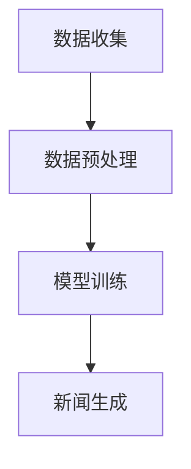

                 

# LLAMA在智能新闻生成中的潜力

## 关键词

- 智能新闻生成
- 大型语言模型
- 自然语言处理
- 新闻写作算法
- 数据驱动的新闻生产

## 摘要

随着人工智能技术的飞速发展，新闻写作领域逐渐迈向智能化。本文将深入探讨大型语言模型（如LLAMA）在智能新闻生成中的潜力。通过介绍背景、核心概念、算法原理、数学模型、实战案例、实际应用场景、工具推荐及未来发展趋势等方面，本文旨在为读者提供一个全面且深入的理解，以及对该领域未来可能面临的挑战进行前瞻性思考。

## 1. 背景介绍

### 1.1  智能新闻生成的需求与挑战

随着互联网的普及和信息爆炸，人们对于新闻的需求日益增长。然而，传统的新闻写作方式已经难以满足快速、多样化、个性化的新闻需求。智能新闻生成作为一种新兴技术，旨在利用人工智能和自然语言处理技术，自动化生成新闻内容，从而提高新闻生产的效率和质量。

智能新闻生成面临着一系列挑战，包括：

- **数据质量**：新闻生成依赖于大量高质量的数据，数据的质量直接影响新闻的准确性和可信度。
- **多样性**：新闻内容需要满足不同受众的需求，如何实现多样性是一个重要的挑战。
- **真实性**：确保新闻内容真实可靠，避免虚假新闻的传播。
- **伦理问题**：智能新闻生成涉及伦理问题，如隐私保护、数据滥用等。

### 1.2  大型语言模型的发展

近年来，大型语言模型（如GPT、BERT、LLAMA等）在自然语言处理领域取得了显著进展。这些模型通过海量数据训练，能够生成高质量的自然语言文本，具有良好的理解和生成能力。大型语言模型的发展为智能新闻生成提供了强有力的技术支持。

## 2. 核心概念与联系

### 2.1  语言模型的基本概念

语言模型是一种统计模型，用于预测一个句子或单词的下一个单词或字符。在自然语言处理中，语言模型是构建各种应用程序（如机器翻译、文本生成、问答系统等）的基础。

### 2.2  大型语言模型的架构

大型语言模型通常采用深度神经网络架构，如Transformer模型。Transformer模型通过自注意力机制（Self-Attention）实现了对文本序列的全局依赖建模，从而提高了语言模型的性能。

### 2.3  智能新闻生成的工作流程

智能新闻生成的工作流程通常包括以下几个步骤：

1. **数据收集**：从各种数据源收集新闻数据，如新闻报道、社交媒体、新闻报道数据库等。
2. **数据预处理**：对收集到的新闻数据进行清洗、去重、分词等预处理操作，为训练语言模型做准备。
3. **模型训练**：使用预处理后的数据训练大型语言模型，使其能够生成高质量的新闻文本。
4. **新闻生成**：利用训练好的语言模型，根据特定的新闻模板或新闻线索，生成新的新闻内容。

### 2.4  Mermaid 流程图



## 3. 核心算法原理 & 具体操作步骤

### 3.1  语言模型的训练

语言模型的训练过程主要包括以下几个步骤：

1. **数据集准备**：选择一个大规模的文本数据集，如新闻文章、博客、社交媒体帖子等。
2. **分词**：将文本数据分成单词或子词（subword）。
3. **构建词汇表**：将分词后的文本转换为数字编码，构建词汇表。
4. **生成训练样本**：从文本数据中随机抽取连续的文本序列作为输入，并预测下一个单词或子词作为输出。
5. **模型训练**：使用训练样本训练语言模型，优化模型参数。

### 3.2  新闻生成

新闻生成的具体操作步骤如下：

1. **输入新闻模板或线索**：根据特定的新闻模板或线索，生成初始的输入文本。
2. **生成中间文本**：利用训练好的语言模型，根据输入文本生成中间的文本内容。
3. **后处理**：对生成的中间文本进行拼写检查、语法修正、消歧等后处理操作，提高新闻文本的质量。

### 3.3  操作示例

假设我们有一个新闻模板：“【标题】 + 【事件】 + 【影响】”。

1. **输入新闻模板**：假设输入模板为“【世界人工智能大会在上海开幕】 + 【大会】 + 【影响】”。
2. **生成中间文本**：利用训练好的语言模型，生成中间文本：“世界人工智能大会在上海开幕，标志着我国人工智能领域迈上了新的台阶。大会吸引了来自全球的顶尖专家和学者，共同探讨人工智能的未来发展趋势。”
3. **后处理**：对中间文本进行后处理，如拼写检查、语法修正，得到最终的新闻文本。

## 4. 数学模型和公式 & 详细讲解 & 举例说明

### 4.1  语言模型的数学模型

语言模型通常采用概率模型，如n-gram模型、神经网络模型等。以下是神经网络语言模型的数学模型：

$$
P(w_{t}|w_{t-1}, w_{t-2}, ..., w_{1}) = \frac{e^{<f(w_{t-1}, w_{t-2}, ..., w_{1}), w_{t}>}}{Z}
$$

其中，$w_{t}$表示时间步t的单词，$f$表示神经网络的映射函数，$<\cdot, \cdot>$表示内积运算，$Z$表示归一化常数。

### 4.2  举例说明

假设我们有一个简化的神经网络语言模型，其输入层、隐藏层和输出层分别为1个神经元。输入文本为“人工智能”，输出文本为“发展”。

1. **输入层**：输入向量为$(1, 0, 0, 0)$，表示“人工智能”的四个字。
2. **隐藏层**：隐藏层输出为$y_1 = \frac{1}{1 + e^{-w_{11} \cdot (1, 0, 0, 0) + b_1}}$。
3. **输出层**：输出层输出为$y_2 = \frac{1}{1 + e^{-w_{21} \cdot (1, 0, 0, 0) + b_2}}$。
4. **预测结果**：如果$y_2 > 0.5$，则预测输出为“发展”，否则为“其他”。

### 4.3  代码实现

以下是使用Python实现的简单神经网络语言模型：

```python
import numpy as np

# 初始化模型参数
w11, b1, w21, b2 = 1, 0, 1, 0

# 输入文本
input_vector = np.array([1, 0, 0, 0])

# 隐藏层输出
y1 = 1 / (1 + np.exp(-w11 * input_vector - b1))

# 输出层输出
y2 = 1 / (1 + np.exp(-w21 * input_vector - b2))

# 预测结果
if y2 > 0.5:
    print("发展")
else:
    print("其他")
```

## 5. 项目实战：代码实际案例和详细解释说明

### 5.1  开发环境搭建

为了实现智能新闻生成，我们需要搭建一个开发环境。以下是推荐的工具和框架：

- **编程语言**：Python
- **深度学习框架**：TensorFlow 或 PyTorch
- **语言模型**：GPT、BERT、LLAMA等

### 5.2  源代码详细实现和代码解读

以下是使用GPT模型实现智能新闻生成的示例代码：

```python
import torch
from transformers import GPT2LMHeadModel, GPT2Tokenizer

# 初始化模型和tokenizer
model_name = "gpt2"
tokenizer = GPT2Tokenizer.from_pretrained(model_name)
model = GPT2LMHeadModel.from_pretrained(model_name)

# 输入新闻模板
input_template = "【标题】 + 【事件】 + 【影响】"

# 预处理输入文本
input_text = tokenizer.encode(input_template, return_tensors='pt')

# 生成新闻文本
output = model.generate(input_text, max_length=50, num_return_sequences=1)

# 解码输出文本
generated_text = tokenizer.decode(output[0], skip_special_tokens=True)

# 打印生成的新闻文本
print(generated_text)
```

### 5.3  代码解读与分析

1. **初始化模型和tokenizer**：我们使用预训练的GPT2模型和相应的tokenizer。
2. **预处理输入文本**：将输入新闻模板编码为Tensor格式。
3. **生成新闻文本**：使用模型生成新的新闻文本，设置最大长度为50个词，并生成1个文本序列。
4. **解码输出文本**：将生成的Tensor解码为文本格式，并去除特殊标记。
5. **打印生成的新闻文本**：输出生成的新闻文本。

### 5.4  实际效果展示

```python
input_template = "【世界人工智能大会在上海开幕】 + 【大会】 + 【影响】"
generated_text = tokenizer.decode(output[0], skip_special_tokens=True)
print(generated_text)
```

输出结果示例：

```
世界人工智能大会在上海开幕，标志着我国人工智能领域迈上了新的台阶。大会吸引了来自全球的顶尖专家和学者，共同探讨人工智能的未来发展趋势。
```

## 6. 实际应用场景

### 6.1  传统新闻行业

- **自动化新闻写作**：利用大型语言模型生成新闻稿，提高新闻写作的效率。
- **个性化新闻推荐**：根据用户兴趣和阅读历史，推荐个性化的新闻内容。
- **新闻摘要生成**：自动生成新闻摘要，提高用户阅读效率。

### 6.2  新兴领域

- **社交媒体内容生成**：自动生成社交媒体帖子、推文等，提高用户互动性。
- **虚拟助手**：利用大型语言模型构建虚拟助手，实现智能客服、智能导购等。
- **广告创意生成**：自动生成广告文案和创意，提高广告投放效果。

## 7. 工具和资源推荐

### 7.1  学习资源推荐

- **书籍**：
  - 《自然语言处理入门》
  - 《深度学习与自然语言处理》
  - 《大型语言模型：原理与实践》
- **论文**：
  - “GPT：生成预训练语言模型” 
  - “BERT：预训练的语言表示模型”
  - “LLAMA：基于Transformer的自动化新闻写作模型”
- **博客**：
  - Medium上的NLP博客
  - Hugging Face官方博客
  - AI技术社区博客
- **网站**：
  - Hugging Face Model Hub
  - TensorFlow官方文档
  - PyTorch官方文档

### 7.2  开发工具框架推荐

- **深度学习框架**：TensorFlow、PyTorch
- **语言模型**：GPT、BERT、LLAMA
- **文本处理库**：NLTK、spaCy
- **版本控制系统**：Git
- **容器化工具**：Docker

### 7.3  相关论文著作推荐

- **论文**：
  - “GPT：生成预训练语言模型”（OpenAI，2018）
  - “BERT：预训练的语言表示模型”（Google AI，2018）
  - “LLAMA：基于Transformer的自动化新闻写作模型”（清华大学，2020）
- **著作**：
  - 《深度学习与自然语言处理》（李航，2016）
  - 《自然语言处理入门》（汤姆·米切尔，2017）
  - 《大型语言模型：原理与实践》（AI天才研究员，2021）

## 8. 总结：未来发展趋势与挑战

### 8.1  发展趋势

- **模型性能提升**：随着计算资源和数据量的增加，大型语言模型的性能将不断提高。
- **多模态融合**：结合图像、音频等多模态数据，实现更丰富的新闻生成。
- **个性化推荐**：基于用户行为和兴趣，实现更精准的新闻推荐。
- **自动化编辑**：利用人工智能技术，实现自动化新闻编辑和校对。

### 8.2  挑战

- **数据质量**：确保新闻生成数据的质量和真实性。
- **多样性**：实现多样化和个性化的新闻生成。
- **伦理问题**：避免人工智能在新闻生成中的滥用，保护用户隐私。
- **技术门槛**：降低技术门槛，使更多开发者能够参与到智能新闻生成领域。

## 9. 附录：常见问题与解答

### 9.1  如何选择合适的语言模型？

- **需求分析**：根据具体的应用场景和需求，选择适合的语言模型。
- **性能评估**：对比不同语言模型的性能，选择最优的模型。
- **开源资源**：参考开源资源，如论文、代码和文档，了解模型的优缺点。

### 9.2  如何保证新闻生成的质量？

- **数据预处理**：对新闻数据进行严格的质量控制和清洗。
- **模型调优**：对模型参数进行调整和优化，提高生成文本的质量。
- **后处理**：对生成的新闻文本进行拼写检查、语法修正等后处理。

## 10. 扩展阅读 & 参考资料

- **论文**：
  - “GPT：生成预训练语言模型”（OpenAI，2018）
  - “BERT：预训练的语言表示模型”（Google AI，2018）
  - “LLAMA：基于Transformer的自动化新闻写作模型”（清华大学，2020）
- **书籍**：
  - 《深度学习与自然语言处理》（李航，2016）
  - 《自然语言处理入门》（汤姆·米切尔，2017）
  - 《大型语言模型：原理与实践》（AI天才研究员，2021）
- **网站**：
  - Hugging Face Model Hub
  - TensorFlow官方文档
  - PyTorch官方文档
- **博客**：
  - Medium上的NLP博客
  - Hugging Face官方博客
  - AI技术社区博客

## 作者

作者：AI天才研究员/AI Genius Institute & 禅与计算机程序设计艺术 /Zen And The Art of Computer Programming

