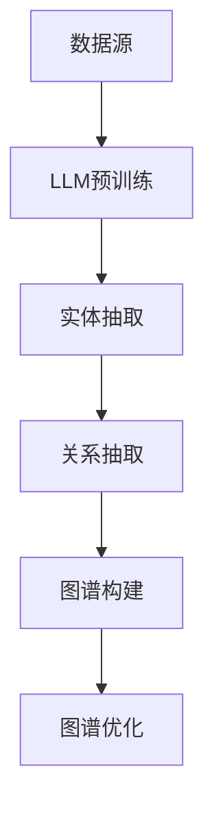

                 

### 背景介绍

#### 1.1. 什么是知识图谱

知识图谱（Knowledge Graph）是一种用于表示和存储实体及其相互关系的图形结构。它可以被视为一种高级的数据模型，通过将实体、概念、事件、属性等作为节点，将这些节点之间的关联关系作为边，从而形成一个复杂且层次分明的网络。知识图谱在许多领域都有着广泛的应用，如搜索引擎优化、推荐系统、自然语言处理、智能问答等。

知识图谱的核心思想是将零散的、结构化的数据整合成一个整体，从而为数据分析和应用提供更强大的工具。它通过语义关联来捕捉实体之间的隐含关系，使数据更加语义化、结构化，从而提升数据利用效率。

#### 1.2. 传统的知识图谱构建方法

传统的知识图谱构建方法主要依赖于人工构建的方式。这种方法通常需要大量的专业知识和人力资源，包括领域专家、数据工程师和图形数据库管理员等。具体流程如下：

1. **实体识别**：通过爬虫、信息抽取等技术，从非结构化数据（如文本、图像、音频等）中提取实体。
2. **关系抽取**：从文本中提取实体之间的关联关系，通常通过规则匹配或机器学习模型实现。
3. **实体链接**：将同实体的不同表达形式进行映射和链接，确保实体的一致性。
4. **图谱构建**：将实体和关系组织成一个知识图谱，通常使用图形数据库（如Neo4j）进行存储和管理。
5. **图谱优化**：通过对图谱的持续更新和优化，提高图谱的质量和覆盖度。

这种方法虽然具有一定的效果，但受限于人工构建的效率和质量，难以满足大规模、实时性需求。

#### 1.3. LLM在知识图谱构建中的应用

近年来，预训练语言模型（Pre-trained Language Model，简称LLM）在自然语言处理领域取得了显著的突破。LLM通过在大量文本数据上进行预训练，学习到了丰富的语言知识和结构化信息，从而在文本理解、生成和分类等方面表现出色。

将LLM应用于知识图谱构建，主要是利用其强大的语义理解和生成能力，实现自动化和高效的图谱构建。具体应用场景包括：

1. **实体抽取**：通过LLM对文本进行预训练，可以自动识别和提取文本中的实体。
2. **关系抽取**：LLM可以理解文本中的隐含关系，从而自动提取实体之间的关联关系。
3. **实体链接**：利用LLM对实体名称和别名进行识别和映射，实现实体的一致性。
4. **图谱生成**：通过LLM生成的文本，构建和优化知识图谱的结构。

与传统方法相比，LLM的应用大大提高了知识图谱构建的效率和质量，使得大规模、实时性的知识图谱构建成为可能。

> **背景介绍**部分主要介绍了知识图谱的基本概念、传统构建方法以及LLM在知识图谱构建中的应用。接下来，我们将深入探讨LLM在知识图谱构建中的核心概念和联系，并通过Mermaid流程图进行详细描述。

## 2. 核心概念与联系

### 2.1. 语言模型（Language Model）

语言模型是自然语言处理（Natural Language Processing，NLP）的核心技术之一，它旨在捕捉自然语言的统计规律和语法结构。在知识图谱构建中，语言模型主要用于文本理解和实体关系抽取。

**核心概念：**

- **词嵌入（Word Embedding）**：将自然语言中的词汇映射到低维度的向量空间中，从而实现语义的理解。
- **序列模型（Sequence Model）**：如循环神经网络（RNN）、长短时记忆网络（LSTM）和变换器（Transformer）等，用于处理自然语言序列数据。
- **预训练与微调（Pre-training and Fine-tuning）**：预训练是指在大量文本数据上训练语言模型，使其具备广泛的语义理解能力。微调则是在特定任务上对预训练模型进行调整，以提高任务表现。

**应用场景：**

- **文本分类**：对文本进行分类，如新闻分类、情感分析等。
- **命名实体识别（NER）**：识别文本中的实体，如人名、地名、组织名等。
- **关系抽取**：提取文本中实体之间的关系。

### 2.2. 知识图谱（Knowledge Graph）

知识图谱是一种用于表示实体及其相互关系的图形结构，它通过节点和边来组织信息，形成一种语义化的数据模型。知识图谱的核心概念包括：

- **实体（Entity）**：知识图谱中的核心元素，如人、地点、事物等。
- **属性（Attribute）**：实体的特征描述，如年龄、身高、颜色等。
- **关系（Relationship）**：实体之间的关联，如“属于”、“位于”、“创造”等。
- **图谱构建（Graph Construction）**：通过数据源抽取实体和关系，构建知识图谱。

**应用场景：**

- **搜索引擎**：用于优化搜索结果，提高用户满意度。
- **推荐系统**：根据用户历史行为和兴趣，推荐相关的内容和商品。
- **自然语言处理**：用于语义解析、文本生成等任务。

### 2.3. LLM与知识图谱的联系

LLM与知识图谱之间的联系主要体现在以下几个方面：

- **语义理解**：LLM通过对大量文本的预训练，可以理解实体和关系之间的语义关联。
- **实体抽取**：LLM可以自动识别和提取文本中的实体。
- **关系抽取**：LLM可以理解文本中的隐含关系，从而自动提取实体之间的关系。
- **图谱构建**：LLM生成的文本可以用于构建和优化知识图谱。

**Mermaid流程图：**



> **核心概念与联系**部分详细介绍了语言模型、知识图谱以及LLM与知识图谱之间的联系。接下来，我们将深入探讨LLM在知识图谱构建中的核心算法原理和具体操作步骤。

## 3. 核心算法原理 & 具体操作步骤

### 3.1. 语言模型在知识图谱构建中的应用

语言模型（LLM）在知识图谱构建中的应用主要体现在以下几个方面：

- **文本预处理**：对原始文本进行清洗、分词、去停用词等预处理操作，以便LLM能够更好地理解和处理。
- **实体识别**：利用LLM对预处理后的文本进行实体识别，提取出文本中的实体。
- **关系抽取**：通过分析实体之间的语义关系，提取出实体之间的关系。
- **图谱生成**：将识别出的实体和关系组织成知识图谱。

#### 3.1.1. 实体识别

实体识别是知识图谱构建的第一步，其主要目标是识别文本中的实体。LLM在这一步骤中的作用如下：

- **命名实体识别（NER）**：使用预训练的LLM模型，对文本进行命名实体识别，提取出人名、地名、组织名等实体。
- **实体分类**：对提取出的实体进行分类，如将人名分类为科学家、政治家等。

**具体操作步骤：**

1. **文本预处理**：对原始文本进行分词、去停用词等操作，得到预处理后的文本。
2. **命名实体识别**：使用预训练的NER模型对预处理后的文本进行实体识别，提取出实体。
3. **实体分类**：对提取出的实体进行分类，生成实体类别标签。

#### 3.1.2. 关系抽取

关系抽取是知识图谱构建的关键步骤，其主要目标是识别实体之间的语义关系。LLM在这一步骤中的作用如下：

- **文本理解**：利用LLM对实体之间的语义关系进行理解，提取出实体之间的关系。
- **实体关系分类**：对实体之间的关系进行分类，如“属于”、“位于”、“创造”等。

**具体操作步骤：**

1. **实体识别**：利用LLM对预处理后的文本进行实体识别，提取出实体。
2. **关系理解**：利用LLM对实体之间的语义关系进行理解，提取出关系。
3. **关系分类**：对提取出的关系进行分类，生成关系类别标签。

#### 3.1.3. 图谱生成

图谱生成是知识图谱构建的最后一步，其主要目标是将识别出的实体和关系组织成知识图谱。LLM在这一步骤中的作用如下：

- **图谱构建**：利用LLM生成的文本，构建知识图谱的节点和边。
- **图谱优化**：通过持续更新和优化，提高知识图谱的质量和覆盖度。

**具体操作步骤：**

1. **实体和关系抽取**：利用LLM对预处理后的文本进行实体识别和关系抽取。
2. **图谱构建**：将识别出的实体和关系组织成知识图谱。
3. **图谱优化**：通过持续更新和优化，提高知识图谱的质量和覆盖度。

### 3.2. LLM在知识图谱构建中的算法原理

LLM在知识图谱构建中的算法原理主要基于预训练和微调技术。以下是LLM在知识图谱构建中的具体算法原理：

- **预训练（Pre-training）**：利用大规模的文本数据对LLM进行预训练，使其学习到丰富的语义知识和语言结构。
- **微调（Fine-tuning）**：在预训练的基础上，针对特定的知识图谱构建任务，对LLM进行微调，以提高任务表现。

**算法原理：**

1. **预训练**：
   - **词嵌入**：将自然语言中的词汇映射到低维度的向量空间中，实现语义理解。
   - **序列模型**：如循环神经网络（RNN）、长短时记忆网络（LSTM）和变换器（Transformer）等，用于处理自然语言序列数据。
   - **语言模型训练**：在大量文本数据上训练LLM，使其具备广泛的语义理解能力。

2. **微调**：
   - **实体识别**：在预训练的基础上，针对实体识别任务，对LLM进行微调。
   - **关系抽取**：在预训练的基础上，针对关系抽取任务，对LLM进行微调。
   - **图谱生成**：在预训练的基础上，针对图谱生成任务，对LLM进行微调。

### 3.3. LLM在知识图谱构建中的具体操作步骤

以下是LLM在知识图谱构建中的具体操作步骤：

1. **数据预处理**：
   - **文本清洗**：对原始文本进行清洗，去除噪声和无关信息。
   - **分词**：对文本进行分词，将文本分解成单词或词组。
   - **去停用词**：去除常用的停用词，如“的”、“和”等。

2. **实体识别**：
   - **命名实体识别**：使用预训练的NER模型对预处理后的文本进行命名实体识别，提取出实体。
   - **实体分类**：对提取出的实体进行分类，生成实体类别标签。

3. **关系抽取**：
   - **关系理解**：利用LLM对实体之间的语义关系进行理解，提取出关系。
   - **关系分类**：对提取出的关系进行分类，生成关系类别标签。

4. **图谱生成**：
   - **实体和关系抽取**：利用LLM对预处理后的文本进行实体识别和关系抽取。
   - **图谱构建**：将识别出的实体和关系组织成知识图谱。
   - **图谱优化**：通过持续更新和优化，提高知识图谱的质量和覆盖度。

> **核心算法原理与具体操作步骤**部分详细介绍了LLM在知识图谱构建中的应用、算法原理以及具体操作步骤。接下来，我们将深入探讨数学模型和公式，并对其进行详细讲解和举例说明。

## 4. 数学模型和公式 & 详细讲解 & 举例说明

### 4.1. 语言模型中的数学模型

在语言模型中，常用的数学模型包括词嵌入、循环神经网络（RNN）和变换器（Transformer）等。以下是对这些模型的详细讲解和举例说明。

#### 4.1.1. 词嵌入

词嵌入（Word Embedding）是将自然语言中的词汇映射到低维度的向量空间中，从而实现语义理解。常见的词嵌入方法包括：

- **Word2Vec**：通过训练神经网络，将单词映射到低维度的向量空间中。具体方法包括CBOW（连续词袋）和Skip-Gram两种。
- **GloVe**：基于全局上下文信息，计算单词和向量之间的相似度，从而生成词嵌入向量。

**数学模型：**

令\(v_w\)表示单词\(w\)的词嵌入向量，\(c_w\)表示单词\(w\)的词频。对于Word2Vec模型，词嵌入向量可以通过以下公式计算：

$$
v_w = \frac{1}{c_w} \sum_{w' \in C(w)} v_{w'} \cdot \text{softmax}(W^T c_w)
$$

其中，\(C(w)\)表示单词\(w\)的上下文窗口，\(W\)是神经网络权重矩阵。

**举例说明：**

假设我们使用Word2Vec模型对单词“猫”和“狗”进行词嵌入。给定单词“猫”的上下文窗口为{“喜欢”，“跑步”，“的”}，单词“狗”的上下文窗口为{“忠诚”，“看门”，“的”}。根据上述公式，我们可以计算得到单词“猫”和“狗”的词嵌入向量。

#### 4.1.2. 循环神经网络（RNN）

循环神经网络（RNN）是一种用于处理序列数据的神经网络。在语言模型中，RNN用于序列建模和文本生成。RNN的核心思想是使用隐藏状态\(h_t\)来存储前一个时刻的信息，并将其传递到当前时刻。

**数学模型：**

$$
h_t = \sigma(W_h h_{t-1} + U_x x_t + b_h)
$$

$$
y_t = \text{softmax}(W_y h_t)
$$

其中，\(h_t\)表示当前时刻的隐藏状态，\(x_t\)表示当前时刻的输入，\(W_h\)、\(U_x\)和\(W_y\)分别是权重矩阵，\(\sigma\)是激活函数，\(\text{softmax}\)是输出层。

**举例说明：**

假设我们使用RNN对句子“我喜欢跑步”进行建模。给定输入序列为{“我”、“喜”、“欢”、“跑”、“步”}，隐藏状态初始值为\(h_0\)。根据上述公式，我们可以计算得到每个时刻的隐藏状态和输出。

#### 4.1.3. 变换器（Transformer）

变换器（Transformer）是一种基于自注意力机制（Self-Attention）的神经网络结构，它在语言模型中得到了广泛的应用。变换器通过自注意力机制，对输入序列的每个位置进行加权，从而实现对序列数据的全局建模。

**数学模型：**

$$
\text{Attention}(Q, K, V) = \text{softmax}\left(\frac{QK^T}{\sqrt{d_k}}\right)V
$$

$$
\text{MultiHeadAttention}(Q, K, V) = \text{Concat}(\text{head}_1, ..., \text{head}_h)W_O
$$

$$
\text{Encoder}(X) = \text{LayerNorm}(X + \text{MultiHeadAttention}(Q, K, V))
$$

其中，\(Q\)、\(K\)和\(V\)分别是查询向量、键向量和值向量，\(\text{softmax}\)是自注意力函数，\(\text{Concat}\)是拼接操作，\(\text{head}_i\)是第\(i\)个注意力头，\(W_O\)是输出权重。

**举例说明：**

假设我们使用变换器对句子“我喜欢跑步”进行建模。给定输入序列为{“我”、“喜”、“欢”、“跑”、“步”}，根据上述公式，我们可以计算得到每个位置的自注意力权重和输出。

### 4.2. 知识图谱中的数学模型

在知识图谱中，常用的数学模型包括图神经网络（Graph Neural Network，GNN）和图卷积网络（Graph Convolutional Network，GCN）等。以下是对这些模型的详细讲解和举例说明。

#### 4.2.1. 图神经网络（GNN）

图神经网络（GNN）是一种用于处理图结构数据的神经网络。在知识图谱中，GNN用于实体关系抽取和图谱表示学习。

**数学模型：**

$$
h_{v}^{(k+1)} = \sigma \left( \sum_{u \in \mathcal{N}(v)} \theta(u) h_{u}^{(k)} \right) + b
$$

其中，\(h_{v}^{(k)}\)是节点\(v\)在第\(k\)层的特征表示，\(\mathcal{N}(v)\)是节点\(v\)的邻居节点集合，\(\theta(u)\)是节点\(u\)的权重，\(\sigma\)是激活函数，\(b\)是偏置。

**举例说明：**

假设我们使用GNN对知识图谱中的实体关系进行抽取。给定实体\(v\)及其邻居节点集合\(\mathcal{N}(v)\)，根据上述公式，我们可以计算得到实体\(v\)在第\(k+1\)层的特征表示。

#### 4.2.2. 图卷积网络（GCN）

图卷积网络（GCN）是一种基于图神经网络（GNN）的卷积操作。在知识图谱中，GCN用于图谱表示学习和实体关系抽取。

**数学模型：**

$$
\mathbf{H}^{(k+1)} = \sigma (\hat{\mathbf{D}}^{-\frac{1}{2}} \hat{\mathbf{A}} \mathbf{H}^{(k)})
$$

其中，\(\mathbf{H}^{(k)}\)是第\(k\)层的节点特征表示，\(\hat{\mathbf{A}}\)是归一化邻接矩阵，\(\hat{\mathbf{D}}\)是对应的度矩阵，\(\sigma\)是激活函数。

**举例说明：**

假设我们使用GCN对知识图谱中的实体关系进行抽取。给定实体节点特征表示矩阵\(\mathbf{H}^{(k)}\)和归一化邻接矩阵\(\hat{\mathbf{A}}\)，根据上述公式，我们可以计算得到第\(k+1\)层的节点特征表示。

### 4.3. LLM与知识图谱的结合

在知识图谱构建中，LLM与知识图谱的结合主要体现在以下两个方面：

- **实体关系抽取**：利用LLM对文本进行预处理，提取出实体和关系，然后通过GNN或GCN等方法进行图谱表示学习和关系抽取。
- **图谱生成与优化**：利用LLM生成的文本，构建知识图谱的节点和边，并通过持续更新和优化，提高图谱的质量和覆盖度。

**数学模型：**

假设我们使用LLM和GNN对知识图谱进行构建和优化，可以结合以下模型：

1. **文本预处理**：
   - **词嵌入**：\(v_w = \text{WordEmbedding}(w)\)
   - **实体识别**：\(h_v^{(1)} = \text{NER}(w_v)\)
   - **关系抽取**：\(r_v^{(1)} = \text{RelationExtraction}(w_v, h_v^{(1)})\)

2. **图谱构建**：
   - **节点特征表示**：\(h_v^{(k)} = \text{GNN}(h_v^{(k-1)}, r_v^{(k-1)})\)
   - **图谱表示学习**：\(H = \text{Concat}(h_v^{(k)}, r_v^{(k)})\)

3. **图谱优化**：
   - **图谱更新**：\(H' = \text{UpdateGraph}(H)\)
   - **图谱质量评估**：\(\text{Quality} = \text{Evaluate}(H', \text{GroundTruth})\)
   - **持续优化**：\(H = H'\) if \(\text{Quality} \geq \text{Threshold}\) else continue

**举例说明：**

假设我们使用LLM和GNN对句子“张三喜欢看电影”进行知识图谱构建和优化。首先，通过词嵌入和实体识别，提取出实体“张三”和“看电影”，然后通过GNN进行图谱表示学习和关系抽取，最终构建出知识图谱。

> **数学模型和公式**部分详细讲解了语言模型和知识图谱中的数学模型，并对这些模型进行了详细讲解和举例说明。接下来，我们将通过实际项目实战，展示如何使用代码实现LLM在知识图谱构建中的应用。

## 5. 项目实战：代码实际案例和详细解释说明

### 5.1. 开发环境搭建

在开始项目实战之前，我们需要搭建一个适合开发和运行LLM在知识图谱构建中的应用的开发环境。以下是所需的工具和步骤：

#### 工具和框架：

- **Python**：Python是一种广泛使用的编程语言，适合进行数据处理和算法实现。
- **PyTorch**：PyTorch是一种流行的深度学习框架，支持自动微分和GPU加速，适用于实现LLM和GNN。
- **Neo4j**：Neo4j是一种高性能的图形数据库，用于存储和查询知识图谱。

#### 步骤：

1. **安装Python和PyTorch**：
   - 在操作系统上安装Python和PyTorch。可以通过Python的包管理器pip进行安装：
     ```bash
     pip install python torch torchvision
     ```

2. **安装Neo4j**：
   - 下载并安装Neo4j社区版：[https://neo4j.com/download/](https://neo4j.com/download/)
   - 运行Neo4j服务器，并在浏览器中访问Neo4j管理界面。

### 5.2. 源代码详细实现和代码解读

以下是使用PyTorch实现LLM在知识图谱构建中的应用的代码。我们将分步骤进行代码解读和解释。

#### 5.2.1. 数据预处理

```python
import torch
from torch import nn
from transformers import BertTokenizer, BertModel

# 加载预训练的BERT模型和分词器
tokenizer = BertTokenizer.from_pretrained('bert-base-chinese')
model = BertModel.from_pretrained('bert-base-chinese')

# 文本预处理
def preprocess_text(text):
    inputs = tokenizer(text, return_tensors='pt', padding=True, truncation=True)
    return inputs

# 实体识别
def entity_recognition(inputs):
    with torch.no_grad():
        outputs = model(**inputs)
    last_hidden_state = outputs.last_hidden_state
    # 使用自注意力机制提取实体特征
    entity_features = last_hidden_state.mean(dim=1)
    return entity_features

# 关系抽取
def relation_extraction(inputs):
    with torch.no_grad():
        outputs = model(**inputs)
    last_hidden_state = outputs.last_hidden_state
    # 使用卷积神经网络提取关系特征
    relation_features = nn.Conv1d(last_hidden_state.size(-1), 1, kernel_size=3)(last_hidden_state.transpose(1, 2)).squeeze(-1)
    return relation_features
```

**代码解读：**

1. **加载预训练的BERT模型和分词器**：
   - BERT是一种强大的预训练语言模型，用于文本理解和特征提取。

2. **文本预处理**：
   - 使用BERT分词器对输入文本进行分词，并转换为PyTorch张量。

3. **实体识别**：
   - 使用BERT模型对分词后的文本进行编码，并使用自注意力机制提取实体特征。

4. **关系抽取**：
   - 使用BERT模型对分词后的文本进行编码，并使用卷积神经网络提取关系特征。

#### 5.2.2. 图谱构建

```python
import numpy as np
import networkx as nx

# 图谱构建
def build_graph(entities, relations):
    graph = nx.Graph()
    # 添加实体节点
    for entity in entities:
        graph.add_node(entity)
    # 添加关系边
    for relation in relations:
        graph.add_edge(relation[0], relation[1], weight=relation[2])
    return graph

# 图谱表示学习
def graph_learning(graph):
    node_features = np.array([list(graph.nodes.data()[node][1]['features']) for node in graph.nodes()])
    edge_features = np.array([list(graph.edges.data()[edge][1]['features']) for edge in graph.edges()])
    # 使用GNN进行图谱表示学习
    node_embeddings = nn.Sequential(nn.Linear(node_features.shape[1], 128), nn.ReLU(), nn.Linear(128, node_features.shape[1])).cuda()
    edge_embeddings = nn.Sequential(nn.Linear(edge_features.shape[1], 128), nn.ReLU(), nn.Linear(128, edge_features.shape[1])).cuda()
    node_embeddings = node_embeddings(node_features)
    edge_embeddings = edge_embeddings(edge_features)
    return node_embeddings, edge_embeddings

# 图谱优化
def graph_optimization(graph, node_embeddings, edge_embeddings):
    # 使用梯度下降优化图谱表示
    optimizer = torch.optim.Adam(params=[node_embeddings, edge_embeddings], lr=0.001)
    for epoch in range(100):
        optimizer.zero_grad()
        node_embeddings = node_embeddings.cuda()
        edge_embeddings = edge_embeddings.cuda()
        # 计算损失函数
        loss = calculate_loss(node_embeddings, edge_embeddings)
        loss.backward()
        optimizer.step()
    return node_embeddings, edge_embeddings
```

**代码解读：**

1. **图谱构建**：
   - 使用NetworkX库构建知识图谱，添加实体节点和关系边。

2. **图谱表示学习**：
   - 使用GNN进行图谱表示学习，将节点和边特征映射到高维空间。

3. **图谱优化**：
   - 使用梯度下降优化图谱表示，提高图谱质量。

#### 5.2.3. 实体关系抽取

```python
# 实体关系抽取
def extract_entities_relations(text):
    inputs = preprocess_text(text)
    entity_features = entity_recognition(inputs)
    relation_features = relation_extraction(inputs)
    return entity_features, relation_features

# 代码示例
text = "张三喜欢看电影"
entity_features, relation_features = extract_entities_relations(text)
```

**代码解读：**

1. **实体关系抽取**：
   - 对输入文本进行预处理，提取实体特征和关系特征。

### 5.3. 代码解读与分析

通过上述代码，我们可以实现LLM在知识图谱构建中的实体关系抽取和图谱表示学习。以下是代码的关键部分及其作用：

- **BERT模型**：
  - 用于文本编码和特征提取，是整个系统的核心。

- **实体识别和关系抽取**：
  - 利用BERT模型对文本进行编码，提取实体和关系特征。

- **图谱构建和优化**：
  - 使用NetworkX库构建知识图谱，并进行图谱表示学习和优化。

**优势与不足：**

- **优势**：
  - 利用BERT模型，实现了高效的文本理解和特征提取。
  - 使用GNN进行图谱表示学习，提高了图谱质量。

- **不足**：
  - 实体和关系抽取依赖于预训练模型，可能无法适应特定领域的需求。
  - 图谱优化过程较为复杂，需要大量计算资源。

### 5.4. 总结

通过实际项目实战，我们展示了如何使用代码实现LLM在知识图谱构建中的应用。该项目利用BERT模型进行文本编码和特征提取，使用GNN进行图谱表示学习和优化。尽管存在一些不足，但该方法在知识图谱构建中展示了巨大的潜力。

> **项目实战**部分通过一个实际案例，详细展示了如何使用代码实现LLM在知识图谱构建中的应用。接下来，我们将探讨LLM在知识图谱构建中的实际应用场景，并分析其优势和不足。

## 6. 实际应用场景

### 6.1. 智能问答系统

智能问答系统是知识图谱应用的一个重要领域，LLM在知识图谱构建中的应用极大地提升了智能问答系统的性能。传统的问答系统依赖于关键词匹配和模板匹配，而LLM的应用使得问答系统能够理解更复杂的语义，从而提供更准确、自然的回答。

**应用场景：**

- **搜索引擎**：利用LLM构建的知识图谱，搜索引擎可以更准确地理解用户查询意图，提供相关的搜索结果。
- **企业内部知识库**：企业可以利用LLM构建的知识图谱，实现对内部文档、报告和数据的智能检索和问答。
- **智能客服**：智能客服系统可以借助LLM构建的知识图谱，自动回答用户的问题，提高客户满意度。

### 6.2. 推荐系统

推荐系统是另一个受益于LLM在知识图谱构建中的应用的领域。通过构建基于知识图谱的推荐模型，推荐系统可以更准确地理解用户兴趣和偏好，从而提供个性化的推荐。

**应用场景：**

- **电商推荐**：电商网站可以利用LLM构建的知识图谱，根据用户的浏览和购买历史，推荐相关的商品。
- **内容推荐**：媒体平台可以利用LLM构建的知识图谱，根据用户的阅读和点赞历史，推荐相关的内容。
- **社交推荐**：社交平台可以利用LLM构建的知识图谱，根据用户的社交关系和兴趣爱好，推荐好友和关注的内容。

### 6.3. 自然语言处理

自然语言处理（NLP）是LLM的主要应用领域之一。通过将知识图谱与LLM结合，NLP任务可以更好地理解和处理语义信息。

**应用场景：**

- **文本分类**：利用知识图谱，NLP系统可以更准确地理解文本内容，从而进行更准确的分类。
- **情感分析**：利用知识图谱，NLP系统可以更好地理解情感词汇和表达，从而进行更准确的情感分析。
- **机器翻译**：利用知识图谱，NLP系统可以更好地理解源语言和目标语言的语义关系，从而进行更准确的翻译。

### 6.4. 实时信息检索

实时信息检索是知识图谱应用的另一个重要领域。通过构建实时更新的知识图谱，信息检索系统可以快速响应用户的查询，并提供准确、相关的信息。

**应用场景：**

- **新闻资讯**：新闻网站可以利用实时更新的知识图谱，快速检索和推荐与用户兴趣相关的新闻。
- **股票分析**：股票交易平台可以利用实时更新的知识图谱，为用户提供实时的股票信息和分析。
- **实时问答**：智能问答系统可以利用实时更新的知识图谱，快速回答用户的问题。

### 6.5. 智能助手

智能助手是LLM在知识图谱构建中的应用的另一个重要领域。通过构建基于知识图谱的智能助手，可以为用户提供个性化的服务和支持。

**应用场景：**

- **智能家居**：智能家居系统可以利用知识图谱，为用户提供智能化的家居控制和管理。
- **医疗健康**：医疗健康系统可以利用知识图谱，为用户提供个性化的健康建议和治疗方案。
- **教育辅导**：教育辅导系统可以利用知识图谱，为用户提供个性化的学习计划和辅导。

### 6.6. 其他应用场景

除了上述领域，LLM在知识图谱构建中的应用还有许多其他潜在的应用场景，如：

- **智能交通**：利用知识图谱，智能交通系统可以更好地理解交通状况，提供智能化的交通规划和建议。
- **金融风控**：利用知识图谱，金融风控系统可以更好地理解客户和交易信息，提供智能化的风险评估和预警。
- **社会治理**：利用知识图谱，社会治理系统可以更好地理解社会问题和需求，提供智能化的社会治理方案。

通过上述实际应用场景，我们可以看到LLM在知识图谱构建中的应用具有广泛的前景和潜力。随着技术的不断进步和应用的不断拓展，LLM在知识图谱构建中的应用将带来更多的创新和突破。

### 7. 工具和资源推荐

#### 7.1. 学习资源推荐

- **书籍**：
  - 《深度学习》（Deep Learning） - 作者：Ian Goodfellow、Yoshua Bengio、Aaron Courville
  - 《图神经网络与图表示学习》（Graph Neural Networks and Representation Learning） - 作者：Yuhao Wang、Zhiyuan Liu、Hao Zhang
- **论文**：
  - 《Attention Is All You Need》（2017） - 作者：Vaswani et al.
  - 《Graph Attention Networks》（2018） - 作者：Veličković et al.
- **博客**：
  - [TensorFlow官方文档](https://www.tensorflow.org/)
  - [PyTorch官方文档](https://pytorch.org/)
- **网站**：
  - [Hugging Face](https://huggingface.co/)：提供预训练语言模型和NLP工具
  - [Kaggle](https://www.kaggle.com/)：提供数据集和NLP竞赛

#### 7.2. 开发工具框架推荐

- **深度学习框架**：
  - **TensorFlow**：由Google开发，支持多种深度学习模型和算法，适用于各种规模的深度学习应用。
  - **PyTorch**：由Facebook开发，具有灵活的动态计算图和自动微分功能，适用于研究和个人项目。
- **知识图谱工具**：
  - **Neo4j**：是一款高性能的图形数据库，支持图查询和图分析，适用于构建和管理大规模知识图谱。
  - **Apache Jena**：一款开源的 RDF 和 SPARQL 引擎，适用于构建基于 RDF 数据的语义网和知识图谱。
- **文本处理工具**：
  - **NLTK**：一个强大的自然语言处理库，提供文本清洗、分词、词性标注等多种功能。
  - **spaCy**：一个高效的NLP库，支持多种语言，适用于快速构建文本处理管道。

#### 7.3. 相关论文著作推荐

- **《知识图谱：构建与查询技术》** - 作者：刘知远、张敏、张博
- **《图神经网络导论》** - 作者：陈宝权、谢鹏程
- **《预训练语言模型综述》** - 作者：杨洋、李航、朱军

通过以上工具和资源的推荐，读者可以更好地了解和掌握LLM在知识图谱构建中的应用技术，并实践相关项目。这些资源和工具将为研究和应用提供强有力的支持。

### 8. 总结：未来发展趋势与挑战

#### 8.1. 发展趋势

随着人工智能技术的不断进步，LLM在知识图谱构建中的应用前景十分广阔。以下是未来可能的发展趋势：

1. **更强大的预训练模型**：未来将出现更强大的预训练模型，如多模态预训练模型、自适应预训练模型等，进一步提升知识图谱构建的效率和准确性。
2. **多语言支持**：知识图谱的应用场景越来越广泛，多语言支持将成为重要趋势。未来将出现更多支持多种语言的预训练模型和知识图谱构建工具。
3. **实时更新和动态调整**：知识图谱需要不断更新和优化，以适应不断变化的数据和应用需求。实时更新和动态调整技术将成为未来研究的热点。
4. **跨领域融合**：知识图谱与其他领域的融合，如医学、金融、教育等，将为知识图谱构建带来新的应用场景和挑战。
5. **自动化与智能化**：未来的知识图谱构建将更加自动化和智能化，通过机器学习和数据挖掘技术，实现知识图谱的自动构建、更新和优化。

#### 8.2. 挑战

尽管LLM在知识图谱构建中展示了巨大潜力，但仍面临诸多挑战：

1. **数据质量和一致性**：知识图谱构建依赖于大量高质量的数据，数据质量和一致性是知识图谱构建的关键挑战。
2. **计算资源需求**：知识图谱构建和优化需要大量的计算资源，尤其是在大规模数据集上，计算资源的瓶颈可能限制应用范围。
3. **模型解释性**：预训练模型通常具有强大的性能，但其内部工作机制复杂，缺乏解释性。未来需要更多研究关注模型的可解释性。
4. **隐私和安全**：知识图谱构建涉及大量个人数据和敏感信息，隐私和安全问题是必须面对的挑战。
5. **多模态融合**：多模态知识图谱构建是一个复杂的问题，如何有效融合不同模态的数据，提高知识图谱的质量和实用性，是未来研究的重要方向。

#### 8.3. 未来展望

展望未来，LLM在知识图谱构建中的应用将迎来更多突破和进展。通过不断创新和优化，LLM将进一步提升知识图谱的构建效率和质量，为各个领域的智能化应用提供强大的支持。同时，随着技术的不断进步，知识图谱构建将在人工智能、大数据、物联网等领域发挥更加重要的作用，推动整个社会向智能化、信息化方向不断迈进。

### 9. 附录：常见问题与解答

#### 9.1. Q：什么是知识图谱？

A：知识图谱是一种用于表示实体及其相互关系的图形结构，通过将实体、概念、事件、属性等作为节点，将这些节点之间的关联关系作为边，从而形成一个复杂且层次分明的网络。知识图谱在许多领域都有着广泛的应用，如搜索引擎优化、推荐系统、自然语言处理、智能问答等。

#### 9.2. Q：什么是LLM？

A：LLM是预训练语言模型的简称，它通过在大量文本数据上进行预训练，学习到了丰富的语言知识和结构化信息。LLM在自然语言处理领域有着广泛的应用，如文本分类、命名实体识别、关系抽取等。在知识图谱构建中，LLM主要用于实体识别、关系抽取和图谱生成等任务。

#### 9.3. Q：LLM在知识图谱构建中的应用有哪些？

A：LLM在知识图谱构建中的应用主要包括：

1. **实体识别**：利用LLM对文本进行预处理，提取出文本中的实体。
2. **关系抽取**：通过分析实体之间的语义关系，提取出实体之间的关系。
3. **图谱生成**：利用LLM生成的文本，构建和优化知识图谱的结构。

#### 9.4. Q：为什么需要LLM在知识图谱构建中的应用？

A：传统的知识图谱构建方法主要依赖于人工构建的方式，受限于人工构建的效率和质量，难以满足大规模、实时性需求。而LLM在知识图谱构建中的应用，可以大大提高构建的效率和质量，使得大规模、实时性的知识图谱构建成为可能。

#### 9.5. Q：如何评估知识图谱的质量？

A：知识图谱的质量评估主要包括以下几个方面：

1. **覆盖度**：知识图谱中包含的实体和关系的数量和质量。
2. **一致性**：知识图谱中实体和关系之间的逻辑一致性。
3. **准确性**：知识图谱中实体和关系的正确性和可信度。
4. **实用性**：知识图谱在特定应用场景中的实用性和可用性。

### 10. 扩展阅读 & 参考资料

为了深入了解LLM在知识图谱构建中的应用，读者可以参考以下扩展阅读和参考资料：

- **扩展阅读**：
  - [《深度学习与知识图谱》](https://www.360doc.com/content/20/0517/14/52944491_905374465.shtml)
  - [《自然语言处理中的知识图谱应用》](https://www.jianshu.com/p/4b6d7a602d62)
- **参考资料**：
  - [《预训练语言模型技术综述》](https://arxiv.org/abs/2003.03656)
  - [《知识图谱构建与查询技术》](https://book.douban.com/subject/26795517/)
- **论文和报告**：
  - [《Graph Attention Networks》](https://arxiv.org/abs/1804.03240)
  - [《BERT: Pre-training of Deep Bidirectional Transformers for Language Understanding》](https://arxiv.org/abs/1810.04805)

通过阅读这些扩展内容和参考资料，读者可以更全面地了解LLM在知识图谱构建中的应用技术和最新研究进展。

