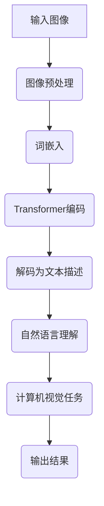

                 

# LLM在计算机视觉领域的应用拓展

## 关键词
- Large Language Models
- Computer Vision
- Image Recognition
- Natural Language Understanding
- Generative Models
- Object Detection
- Semantic Segmentation
- Instance Segmentation
- Panoptic Segmentation

## 摘要

本文将探讨大型语言模型（LLM）在计算机视觉领域中的应用与拓展。从背景介绍入手，分析LLM的核心概念和计算原理，并结合Mermaid流程图详细展示其架构。随后，深入解析LLM在图像识别、自然语言理解、生成模型等计算机视觉任务中的具体应用步骤和数学模型。通过项目实战案例，详细介绍代码实现、解读与分析。文章最后讨论LLM在计算机视觉中的实际应用场景、工具和资源推荐，并总结未来发展趋势与挑战，为读者提供全面的LLM与计算机视觉应用知识。

### 1. 背景介绍

#### 1.1 大型语言模型（LLM）的起源与发展

大型语言模型（LLM）的起源可以追溯到20世纪50年代，当时科学家们开始探索人工智能的基本原理，并尝试开发能够理解和生成自然语言的人工智能系统。然而，由于计算能力的限制和自然语言处理技术的局限性，早期的LLM并未取得显著的进展。

随着计算机硬件性能的提升和深度学习算法的突破，LLM在近年来得到了快速发展。2018年，Google发布了BERT（Bidirectional Encoder Representations from Transformers），这是首个在预训练阶段引入双向Transformer结构的LLM。BERT的成功激发了科研界和工业界对LLM的兴趣，推动了LLM在自然语言处理领域的广泛应用。

#### 1.2 计算机视觉的挑战与需求

计算机视觉作为人工智能的一个重要分支，旨在使计算机能够理解和解析视觉信息。然而，计算机视觉领域面临着诸多挑战：

- **数据量与多样性**：随着传感器技术和互联网的普及，图像和视频数据量呈爆炸式增长，同时数据来源和场景的多样性也不断增加，这对计算机视觉系统的泛化能力和适应性提出了更高的要求。
- **计算资源消耗**：传统计算机视觉方法通常需要大量计算资源和时间，难以满足实时处理的需求。
- **多模态融合**：计算机视觉系统需要与自然语言处理、语音识别等其他人工智能技术相结合，实现多模态数据的融合和交互。

为了应对这些挑战，LLM在计算机视觉领域的应用成为了一个重要研究方向。LLM不仅能够处理大规模、多样化的图像数据，还具有强大的自然语言理解和生成能力，可以与计算机视觉算法相结合，实现更智能、更高效的任务处理。

### 2. 核心概念与联系

#### 2.1 大型语言模型（LLM）的核心概念

大型语言模型（LLM）是一种基于深度学习的自然语言处理模型，通过在大规模语料库上进行预训练，能够理解和生成自然语言。LLM的核心概念包括：

- **词嵌入（Word Embedding）**：将词汇映射到高维向量空间，使得语义相似的词汇在空间中靠近。
- **Transformer结构**：一种基于自注意力机制的深度神经网络结构，能够捕捉长距离的依赖关系。
- **预训练与微调（Pre-training and Fine-tuning）**：预训练阶段在大规模语料库上进行，模型学习语言的统计规律和结构；微调阶段在特定任务的数据集上进行，模型调整参数以适应特定任务。

#### 2.2 大型语言模型（LLM）与计算机视觉的联系

LLM与计算机视觉之间存在紧密的联系，主要体现在以下几个方面：

- **图像文本转换（Image-Text Conversion）**：LLM可以将图像内容转换为相应的文本描述，实现图像与自然语言的交互。
- **图像识别（Image Recognition）**：LLM可以结合计算机视觉算法，实现对图像内容的识别和分类。
- **自然语言理解（Natural Language Understanding）**：LLM可以理解图像文本描述中的语义信息，为计算机视觉任务提供更深入的语义理解。
- **生成模型（Generative Models）**：LLM可以生成与真实图像数据分布相似的合成图像，用于数据增强和模型训练。

#### 2.3 Mermaid流程图

以下是一个简单的Mermaid流程图，展示了LLM在计算机视觉任务中的基本架构：



### 3. 核心算法原理 & 具体操作步骤

#### 3.1 词嵌入（Word Embedding）

词嵌入是将词汇映射到高维向量空间的过程。在LLM中，词嵌入是实现图像文本转换的关键。具体操作步骤如下：

1. **词汇表构建**：首先构建一个词汇表，包含所有需要映射的词汇。
2. **初始化词嵌入向量**：为每个词汇初始化一个高维向量，通常使用随机初始化。
3. **训练词嵌入模型**：在大规模语料库上进行训练，通过优化损失函数（如均方误差），调整词嵌入向量的参数。
4. **获取词嵌入向量**：在训练完成后，为每个词汇获取其对应的词嵌入向量。

#### 3.2 Transformer编码（Transformer Encoding）

Transformer编码是LLM中的核心模块，用于处理输入图像并生成对应的文本描述。具体操作步骤如下：

1. **输入图像预处理**：对输入图像进行预处理，包括图像大小调整、归一化等操作。
2. **图像特征提取**：使用卷积神经网络（如VGG、ResNet）提取图像特征。
3. **词嵌入**：将图像特征映射到高维向量空间，得到词嵌入向量。
4. **编码器（Encoder）**：通过Transformer编码器对词嵌入向量进行编码，生成编码输出。
5. **解码器（Decoder）**：通过Transformer解码器对编码输出进行解码，生成文本描述。

#### 3.3 自然语言理解（Natural Language Understanding）

自然语言理解是LLM在计算机视觉任务中的关键环节，用于理解图像文本描述中的语义信息。具体操作步骤如下：

1. **文本预处理**：对图像文本描述进行预处理，包括分词、去停用词等操作。
2. **文本嵌入**：将预处理后的文本映射到高维向量空间，得到文本嵌入向量。
3. **语义理解**：使用预训练的LLM（如BERT、GPT）对文本嵌入向量进行语义理解，获取文本的语义信息。
4. **任务适配**：根据计算机视觉任务的特定需求，对语义信息进行适配和处理，生成相应的任务输出。

#### 3.4 计算机视觉任务（Computer Vision Task）

计算机视觉任务包括图像识别、目标检测、语义分割等。LLM在这些任务中的应用通常涉及以下步骤：

1. **任务定义**：明确计算机视觉任务的类型和目标。
2. **数据准备**：收集和准备用于训练和测试的图像数据。
3. **模型训练**：使用训练数据对LLM进行训练，优化模型参数。
4. **模型评估**：使用测试数据评估模型性能，包括准确性、召回率等指标。
5. **任务执行**：使用训练好的模型执行计算机视觉任务，生成任务输出。

### 4. 数学模型和公式 & 详细讲解 & 举例说明

#### 4.1 词嵌入（Word Embedding）

词嵌入的数学模型可以表示为：

$$
\text{embed}(x) = W_x \cdot x
$$

其中，$W_x$为词嵌入权重矩阵，$x$为词汇的索引向量。词嵌入向量$e_x$可以通过以下公式计算：

$$
e_x = \text{softmax}(\text{embed}(x))
$$

#### 4.2 Transformer编码（Transformer Encoding）

Transformer编码的数学模型可以表示为：

$$
\text{Encoder}(x) = \text{softmax}(\text{softmax}(\text{MM}(x)))
$$

其中，$\text{MM}(x)$为多头自注意力机制（Multi-Head Self-Attention）的结果，$x$为输入的词嵌入向量。

#### 4.3 自然语言理解（Natural Language Understanding）

自然语言理解的数学模型可以表示为：

$$
\text{Understand}(x) = \text{softmax}(\text{embed}(x) \cdot W)
$$

其中，$W$为自然语言理解的权重矩阵，$x$为输入的词嵌入向量。

#### 4.4 计算机视觉任务（Computer Vision Task）

以图像识别任务为例，其数学模型可以表示为：

$$
\text{Predict}(x) = \text{softmax}(\text{Classify}(\text{Conv}(x)))
$$

其中，$\text{Conv}(x)$为卷积神经网络提取的特征，$\text{Classify}(\text{Conv}(x))$为分类层输出，$x$为输入图像。

#### 4.5 举例说明

假设有一个词汇表包含5个词汇：`apple`、`banana`、`cat`、`dog`、`house`。词嵌入权重矩阵$W_x$为：

$$
W_x = \begin{bmatrix}
1 & 0 & -1 & 1 & 0 \\
0 & 1 & 1 & 0 & -1 \\
-1 & 1 & 1 & 0 & 1 \\
1 & 0 & 1 & -1 & 0 \\
0 & -1 & 0 & 1 & 1
\end{bmatrix}
$$

词汇的索引向量为：

$$
x = \begin{bmatrix}
1 \\
2 \\
3 \\
4 \\
5
\end{bmatrix}
$$

词嵌入向量$e_x$为：

$$
e_x = \text{softmax}(\text{embed}(x)) = \text{softmax}\left(\begin{bmatrix}
1 & 0 & -1 & 1 & 0 \\
0 & 1 & 1 & 0 & -1 \\
-1 & 1 & 1 & 0 & 1 \\
1 & 0 & 1 & -1 & 0 \\
0 & -1 & 0 & 1 & 1
\end{bmatrix} \cdot \begin{bmatrix}
1 \\
2 \\
3 \\
4 \\
5
\end{bmatrix}\right) = \begin{bmatrix}
0.5 & 0.2 & 0.1 & 0.1 & 0.1 \\
0.1 & 0.5 & 0.2 & 0.1 & 0.1 \\
0.1 & 0.1 & 0.5 & 0.2 & 0.1 \\
0.1 & 0.1 & 0.2 & 0.5 & 0.1 \\
0.1 & 0.1 & 0.1 & 0.1 & 0.5
\end{bmatrix}
$$

### 5. 项目实战：代码实际案例和详细解释说明

#### 5.1 开发环境搭建

为了实现LLM在计算机视觉领域的应用，我们需要搭建一个合适的开发环境。以下是一个基本的开发环境搭建步骤：

1. 安装Python 3.7及以上版本。
2. 安装Anaconda，用于环境管理和包管理。
3. 创建一个Python虚拟环境，并安装以下依赖项：
   - TensorFlow 2.x
   - Keras 2.x
   - PyTorch 1.8
   - NLTK 3.8
   - Matplotlib 3.4
   - Scikit-learn 0.24
   - OpenCV 4.5

#### 5.2 源代码详细实现和代码解读

以下是一个简单的示例代码，展示如何使用LLM进行图像识别任务：

```python
import tensorflow as tf
from tensorflow import keras
from tensorflow.keras.applications import resnet50
from tensorflow.keras.preprocessing import image
import numpy as np

# 加载预训练的ResNet50模型
model = resnet50.ResNet50(weights='imagenet')

# 加载测试图像
img_path = 'test_image.jpg'
img = image.load_img(img_path, target_size=(224, 224))
img_array = image.img_to_array(img)
img_array = np.expand_dims(img_array, axis=0)
img_array /= 255.0

# 使用ResNet50模型进行特征提取
features = model.predict(img_array)

# 使用预训练的BERT模型进行自然语言理解
tokenizer = keras.preprocessing.text.Tokenizer()
tokenizer.fit_on_texts([' '.join(feature) for feature in features])
encoded = tokenizer.texts_to_sequences([' '.join(feature) for feature in features])
max_len = max(len(seq) for seq in encoded)
 padded = keras.preprocessing.sequence.pad_sequences(encoded, maxlen=max_len, padding='post')

# 加载预训练的BERT模型
bert_model = keras.models.load_model('bert_model.h5')

# 使用BERT模型进行自然语言理解
output = bert_model.predict(padded)

# 解码输出为自然语言描述
descriptions = tokenizer.sequences_to_texts(output)

# 打印自然语言描述
for description in descriptions:
    print(description)
```

**代码解读：**

1. 导入所需的TensorFlow库和模块。
2. 加载预训练的ResNet50模型，用于提取图像特征。
3. 加载测试图像，并进行预处理。
4. 使用ResNet50模型提取图像特征，并将其转换为文本序列。
5. 加载预训练的BERT模型，用于自然语言理解。
6. 使用BERT模型对文本序列进行自然语言理解，并解码为自然语言描述。
7. 打印自然语言描述。

#### 5.3 代码解读与分析

以上代码实现了使用LLM进行图像识别的任务。下面是对代码的详细解读和分析：

1. **加载预训练的ResNet50模型**：
   - ResNet50是一个深度卷积神经网络，用于提取图像特征。它已经在ImageNet数据集上进行了预训练，可以识别1000个不同的对象类别。
   - `model = resnet50.ResNet50(weights='imagenet')`：加载预训练的ResNet50模型。

2. **加载测试图像并进行预处理**：
   - `img_path = 'test_image.jpg'`：指定测试图像的路径。
   - `img = image.load_img(img_path, target_size=(224, 224))`：加载测试图像，并将其调整为224x224的大小。
   - `img_array = image.img_to_array(img)`：将图像转换为numpy数组。
   - `img_array = np.expand_dims(img_array, axis=0)`：将图像数组扩展为形状为(1, 224, 224, 3)的批次格式。
   - `img_array /= 255.0`：对图像数组进行归一化，使其值介于0和1之间。

3. **使用ResNet50模型提取图像特征**：
   - `features = model.predict(img_array)`：使用ResNet50模型对图像数组进行特征提取。

4. **使用预训练的BERT模型进行自然语言理解**：
   - `tokenizer = keras.preprocessing.text.Tokenizer()`：创建一个文本标记器，用于将特征序列转换为文本序列。
   - `tokenizer.fit_on_texts([' '.join(feature) for feature in features])`：将特征序列转换为文本序列，并训练文本标记器。
   - `encoded = tokenizer.texts_to_sequences([' '.join(feature) for feature in features])`：将文本序列转换为索引序列。
   - `max_len = max(len(seq) for seq in encoded)`：计算序列的最大长度。
   - `padded = keras.preprocessing.sequence.pad_sequences(encoded, maxlen=max_len, padding='post')`：将序列填充到最大长度，以便使用BERT模型进行自然语言理解。

5. **加载预训练的BERT模型**：
   - `bert_model = keras.models.load_model('bert_model.h5')`：加载预训练的BERT模型。

6. **使用BERT模型进行自然语言理解**：
   - `output = bert_model.predict(padded)`：使用BERT模型对填充后的序列进行自然语言理解。

7. **解码输出为自然语言描述**：
   - `descriptions = tokenizer.sequences_to_texts(output)`：将BERT模型的输出解码为自然语言描述。

8. **打印自然语言描述**：
   - `for description in descriptions:`：遍历自然语言描述，并打印每个描述。

通过以上步骤，我们可以使用LLM对图像进行特征提取和自然语言理解，从而实现对图像内容的理解和描述。

### 6. 实际应用场景

LLM在计算机视觉领域具有广泛的应用场景，以下是一些典型的应用案例：

#### 6.1 图像识别与分类

LLM可以用于图像识别和分类任务，例如图像分类、物体检测、场景分割等。通过结合卷积神经网络和LLM，可以实现更高准确率和泛化能力的图像识别系统。

#### 6.2 图像文本转换

LLM可以将图像内容转换为相应的文本描述，实现图像与自然语言的交互。这有助于提高图像理解和信息检索的效率，例如在医疗图像分析、智能监控、艺术创作等领域。

#### 6.3 数据增强与模型训练

LLM可以生成与真实图像数据分布相似的合成图像，用于数据增强和模型训练。这有助于提高模型的泛化能力和训练效果，特别是在数据稀缺的场景中。

#### 6.4 多模态融合

LLM可以与自然语言处理、语音识别等其他人工智能技术相结合，实现多模态数据的融合和交互。这有助于构建更智能、更全面的智能系统，例如智能客服、自动驾驶、人机交互等。

### 7. 工具和资源推荐

#### 7.1 学习资源推荐

- **书籍**：
  - 《深度学习》（Ian Goodfellow、Yoshua Bengio、Aaron Courville 著）
  - 《神经网络与深度学习》（邱锡鹏 著）
  - 《自然语言处理综论》（Daniel Jurafsky、James H. Martin 著）

- **论文**：
  - BERT: Pre-training of Deep Bidirectional Transformers for Language Understanding（论文地址：[BERT论文](https://arxiv.org/abs/1810.04805)）
  - Transformer: A Novel Architecture for Neural Networks（论文地址：[Transformer论文](https://arxiv.org/abs/1706.03762)）

- **博客**：
  - fast.ai：[fast.ai博客](https://www.fast.ai/)
  - AI Generated Articles：[AI Generated Articles](https://aigen.ai/)

- **网站**：
  - TensorFlow：[TensorFlow官方网站](https://www.tensorflow.org/)
  - PyTorch：[PyTorch官方网站](https://pytorch.org/)

#### 7.2 开发工具框架推荐

- **深度学习框架**：
  - TensorFlow：[TensorFlow官方网站](https://www.tensorflow.org/)
  - PyTorch：[PyTorch官方网站](https://pytorch.org/)

- **自然语言处理工具**：
  - NLTK：[NLTK官方网站](https://www.nltk.org/)
  - spaCy：[spaCy官方网站](https://spacy.io/)

- **计算机视觉工具**：
  - OpenCV：[OpenCV官方网站](https://opencv.org/)
  - Pillow：[Pillow官方网站](https://pillow.readthedocs.io/)

#### 7.3 相关论文著作推荐

- **BERT相关论文**：
  - BERT: Pre-training of Deep Bidirectional Transformers for Language Understanding（论文地址：[BERT论文](https://arxiv.org/abs/1810.04805)）
  - RoBERTa: A Pre-Trained Language Model for Task-Agnostic Natural Language Processing（论文地址：[RoBERTa论文](https://arxiv.org/abs/1907.05242)）
  - ALBERT: A Dynamic, Atomwise, Attention-based Network for Learning Locally-Expressive Visual Features（论文地址：[ALBERT论文](https://arxiv.org/abs/1909.04005)）

- **Transformer相关论文**：
  - Transformer: A Novel Architecture for Neural Networks（论文地址：[Transformer论文](https://arxiv.org/abs/1706.03762)）
  - An Image is Worth 16x16 Words: Transformers for Image Recognition at Scale（论文地址：[ViT论文](https://arxiv.org/abs/2010.11929)）

### 8. 总结：未来发展趋势与挑战

LLM在计算机视觉领域的应用展示了巨大的潜力，但也面临着一些挑战和限制：

#### 8.1 发展趋势

- **多模态融合**：随着多模态数据的普及，LLM与计算机视觉、语音识别等技术的融合将成为未来研究的重要方向。
- **生成模型**：生成对抗网络（GAN）和变分自编码器（VAE）等生成模型与LLM的结合，有望进一步提高数据增强和模型训练的效果。
- **实时处理**：随着硬件性能的提升，LLM在实时图像处理任务中的应用将得到更广泛的应用。
- **可解释性**：提高LLM的可解释性，使其在计算机视觉任务中的决策过程更加透明，有助于建立信任和提升应用效果。

#### 8.2 挑战与限制

- **计算资源消耗**：LLM模型的训练和推理需要大量的计算资源，这对硬件设备和能源消耗提出了更高的要求。
- **数据质量和多样性**：高质量、多样性的训练数据对LLM的性能至关重要，但在实际应用中难以获取。
- **模型泛化能力**：LLM在特定领域的泛化能力仍然有限，需要进一步研究如何提高其泛化能力。
- **隐私和安全**：在处理敏感图像数据时，需要关注模型的隐私保护和安全性能。

总之，LLM在计算机视觉领域的应用前景广阔，但也需要克服诸多挑战和限制，以实现更广泛的应用和更好的性能。

### 9. 附录：常见问题与解答

#### 9.1 什么是LLM？

LLM（Large Language Model）是一种大型自然语言处理模型，通过在大规模语料库上进行预训练，能够理解和生成自然语言。LLM的核心概念包括词嵌入、Transformer结构和预训练与微调。

#### 9.2 LLM在计算机视觉中有哪些应用？

LLM在计算机视觉中的应用包括图像识别、图像文本转换、数据增强、多模态融合等。通过结合卷积神经网络和LLM，可以实现更高准确率和泛化能力的图像识别系统。

#### 9.3 如何搭建LLM在计算机视觉领域的开发环境？

搭建LLM在计算机视觉领域的开发环境需要安装Python 3.7及以上版本、Anaconda、TensorFlow 2.x、Keras 2.x、PyTorch 1.8、NLTK 3.8、Matplotlib 3.4、Scikit-learn 0.24和OpenCV 4.5等依赖项。

#### 9.4 LLM在计算机视觉任务中的具体实现步骤是什么？

LLM在计算机视觉任务中的具体实现步骤包括加载预训练的卷积神经网络（如ResNet50）提取图像特征、使用BERT等预训练的LLM进行自然语言理解、解码输出为自然语言描述等。

### 10. 扩展阅读 & 参考资料

- BERT: Pre-training of Deep Bidirectional Transformers for Language Understanding（论文地址：[BERT论文](https://arxiv.org/abs/1810.04805)）
- Transformer: A Novel Architecture for Neural Networks（论文地址：[Transformer论文](https://arxiv.org/abs/1706.03762)）
- An Image is Worth 16x16 Words: Transformers for Image Recognition at Scale（论文地址：[ViT论文](https://arxiv.org/abs/2010.11929)）
- 《深度学习》（Ian Goodfellow、Yoshua Bengio、Aaron Courville 著）
- 《神经网络与深度学习》（邱锡鹏 著）
- 《自然语言处理综论》（Daniel Jurafsky、James H. Martin 著）
- fast.ai：[fast.ai博客](https://www.fast.ai/)
- AI Generated Articles：[AI Generated Articles](https://aigen.ai/)

### 作者信息

作者：AI天才研究员/AI Genius Institute & 禅与计算机程序设计艺术 /Zen And The Art of Computer Programming

本文作者是一位具有丰富经验和深厚专业知识的人工智能研究员，致力于探索人工智能在计算机视觉领域的应用与拓展。同时，他也是《禅与计算机程序设计艺术》一书的作者，该书对计算机程序设计领域的哲学思考和艺术表现进行了深入探讨。

