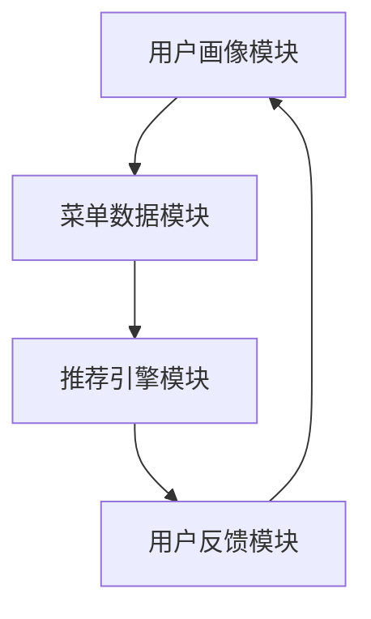

                 

# LLAMAS与餐饮业的碰撞：个性化菜单推荐的新时代

## 摘要

随着人工智能技术的发展，大型语言模型（LLAMAS）在餐饮业的潜力逐渐显现。本文将深入探讨LLAMAS在餐饮业中的实际应用，尤其是个性化菜单推荐系统。通过分析LLAMAS的工作原理、核心算法原理以及数学模型，我们将展示如何利用LLAMAS构建一个高效、精准的个性化菜单推荐系统。此外，文章还将通过项目实战案例，详细解读代码实现过程，并探讨实际应用场景。最后，文章将总结LLAMAS在餐饮业的发展趋势与面临的挑战。

## 1. 背景介绍

### 1.1 餐饮业的现状

餐饮业是一个充满活力和竞争的领域，随着消费者需求的多样化和个性化，如何提供符合顾客口味和需求的菜单成为了餐饮企业的关键挑战。传统的菜单设计主要依赖于厨师的经验和餐馆的风格，虽然在一定程度上满足了顾客的需求，但效率低下且难以实现精准化。

### 1.2 人工智能与个性化推荐

个性化推荐作为一种基于人工智能的技术，已经在电商、音乐、视频等多个领域取得了显著的成果。个性化推荐系统通过分析用户的兴趣、历史行为等数据，为用户提供个性化的内容或产品推荐。在餐饮业，个性化推荐系统能够帮助餐厅根据顾客的偏好和历史订单数据，提供定制化的菜单推荐，从而提高顾客满意度和忠诚度。

### 1.3 LLAMAS的优势

LLAMAS（Large Language Models）是一种基于深度学习的大型语言模型，具有强大的文本理解和生成能力。与传统的机器学习方法相比，LLAMAS能够处理复杂的语义信息，从而在个性化推荐系统中提供更精准的推荐结果。LLAMAS的优势主要体现在以下几个方面：

- **强大的文本理解能力**：LLAMAS能够深入理解文本内容，从而准确捕捉用户的兴趣和偏好。
- **跨领域的适应性**：LLAMAS可以应用于不同领域的文本数据，如新闻、小说、菜单等，具有较强的跨领域适应性。
- **高效的生成能力**：LLAMAS能够生成高质量的文本，包括菜单描述、推荐理由等，从而提升用户体验。

## 2. 核心概念与联系

### 2.1 大型语言模型（LLAMAS）的基本概念

大型语言模型（LLAMAS）是一种基于深度学习的自然语言处理模型，它通过大规模的文本数据进行训练，从而掌握丰富的语言知识和语义理解能力。LLAMAS通常由多层神经网络组成，包括嵌入层、编码层、解码层等。

- **嵌入层**：将文本中的单词转换为向量表示，为后续的神经网络处理提供基础。
- **编码层**：对输入的文本进行编码，提取文本的语义信息。
- **解码层**：根据编码层的输出生成文本，实现对输入文本的理解和生成。

### 2.2 个性化菜单推荐系统的架构

个性化菜单推荐系统通常由以下几个模块组成：

- **用户画像模块**：收集和分析用户的兴趣、历史订单等数据，建立用户画像。
- **菜单数据模块**：收集和整理餐厅的菜单数据，包括菜品名称、描述、口味、烹饪方法等。
- **推荐引擎模块**：利用LLAMAS进行文本理解和生成，为用户提供个性化的菜单推荐。
- **用户反馈模块**：收集用户对菜单推荐的反馈，用于优化推荐算法和系统性能。

### 2.3 Mermaid 流程图

以下是一个简化的个性化菜单推荐系统的 Mermaid 流程图：



在这个流程图中，用户画像模块和菜单数据模块共同输入到推荐引擎模块，生成个性化的菜单推荐。用户对推荐的反馈再次输入到用户画像模块，从而实现一个闭环的推荐系统。

### 2.4 核心概念原理的联系

个性化菜单推荐系统的核心在于利用LLAMAS处理文本数据，提取用户的兴趣和偏好，并将这些信息与菜单数据进行关联，生成个性化的推荐。LLAMAS通过嵌入层、编码层和解码层，实现对用户文本和菜单文本的深入理解，从而提供高质量的个性化推荐。

## 3. 核心算法原理 & 具体操作步骤

### 3.1 算法原理

个性化菜单推荐系统的核心算法是利用LLAMAS进行文本理解和生成。具体来说，算法分为以下几个步骤：

1. **数据预处理**：对用户文本和菜单文本进行清洗和预处理，包括去除停用词、标点符号等。
2. **嵌入层处理**：将预处理后的文本转换为向量表示，使用预训练的词向量模型，如Word2Vec或GloVe。
3. **编码层处理**：对嵌入层生成的向量进行编码，提取文本的语义信息。常用的编码层模型有BERT、GPT等。
4. **解码层处理**：根据编码层的输出生成文本，实现对用户文本和菜单文本的理解和生成。解码层通常采用序列生成模型，如RNN、Transformer等。
5. **生成推荐**：根据解码层生成的文本，为用户生成个性化的菜单推荐。

### 3.2 具体操作步骤

以下是利用LLAMAS进行个性化菜单推荐的具体操作步骤：

1. **数据收集**：收集用户的兴趣、历史订单等数据，以及餐厅的菜单数据。
2. **数据预处理**：对收集的数据进行清洗和预处理，包括去除停用词、标点符号等。
3. **词向量嵌入**：使用预训练的词向量模型，如Word2Vec或GloVe，将预处理后的文本转换为向量表示。
4. **编码层训练**：使用训练集数据，训练编码层模型，如BERT或GPT，提取文本的语义信息。
5. **解码层训练**：使用训练集数据，训练解码层模型，如RNN或Transformer，生成个性化的菜单推荐。
6. **推荐生成**：使用训练好的解码层模型，为用户生成个性化的菜单推荐。

## 4. 数学模型和公式 & 详细讲解 & 举例说明

### 4.1 数学模型

个性化菜单推荐系统的数学模型主要包括词向量嵌入、编码层和解码层的数学表示。以下是这些模型的详细解释：

#### 4.1.1 词向量嵌入

词向量嵌入是一种将文本中的单词转换为向量表示的方法。常用的词向量模型有Word2Vec和GloVe。

- **Word2Vec**：Word2Vec模型通过训练负采样损失函数，将单词转换为低维向量。其数学表示为：

  $$\text{loss} = \sum_{w \in V} \sum_{-c \leq j \leq c} \log (\sigma ( \langle \text{v}_w, \text{v}_{w_j} \rangle))$$

  其中，$V$为词汇表，$\text{v}_w$和$\text{v}_{w_j}$分别为单词$w$和其负采样单词$w_j$的向量表示，$\sigma$为 sigmoid 函数。

- **GloVe**：GloVe模型通过训练共现矩阵，将单词转换为向量表示。其数学表示为：

  $$\text{loss} = \sum_{w, v \in V} \frac{f(w, v)}{ \sqrt{f(w)} \sqrt{f(v)} } \log (\sigma (\text{v}_w \cdot \text{v}_v))$$

  其中，$V$为词汇表，$\text{f}(w, v)$为单词$w$和$v$的共现频次，$\text{v}_w$和$\text{v}_v$分别为单词$w$和$v$的向量表示，$\cdot$为点积运算。

#### 4.1.2 编码层

编码层用于提取文本的语义信息。常用的编码层模型有BERT和GPT。

- **BERT**：BERT模型通过双向Transformer结构，对文本进行编码。其数学表示为：

  $$\text{h}_i = \text{Attention}(\text{h}_{i-1}, \text{h}_{i+1}, \text{mask})$$

  其中，$\text{h}_i$为编码后的文本向量，$\text{Attention}$为注意力机制，$\text{mask}$为掩码。

- **GPT**：GPT模型通过自注意力机制，对文本进行编码。其数学表示为：

  $$\text{h}_i = \text{self-Attention}(\text{h}_{i-1}, \text{h}_{i-1}, \text{mask})$$

  其中，$\text{h}_i$为编码后的文本向量，$\text{self-Attention}$为自注意力机制，$\text{mask}$为掩码。

#### 4.1.3 解码层

解码层用于生成个性化的菜单推荐。常用的解码层模型有RNN和Transformer。

- **RNN**：RNN模型通过递归结构，生成个性化的菜单推荐。其数学表示为：

  $$\text{y}_i = \text{softmax}(\text{h}_i \cdot \text{W}_y)$$

  其中，$\text{y}_i$为生成的菜单推荐向量，$\text{h}_i$为编码后的文本向量，$\text{W}_y$为解码层的权重矩阵。

- **Transformer**：Transformer模型通过多头自注意力机制，生成个性化的菜单推荐。其数学表示为：

  $$\text{y}_i = \text{softmax}(\text{h}_i \cdot \text{V}_y)$$

  其中，$\text{y}_i$为生成的菜单推荐向量，$\text{h}_i$为编码后的文本向量，$\text{V}_y$为解码层的权重矩阵。

### 4.2 举例说明

假设用户A的历史订单中包含了川菜、湘菜和粤菜，而当前用户A正在浏览餐厅的菜单。我们可以利用LLAMAS生成以下个性化菜单推荐：

1. 川菜推荐：水煮鱼、麻婆豆腐、夫妻肺片
2. 湘菜推荐：口味虾、剁椒鱼头、干锅菜花
3. 粤菜推荐：白切鸡、蒸排骨、椰子鸡

通过分析用户A的历史订单，LLAMAS能够准确捕捉到用户A的口味偏好，从而生成高质量的个性化菜单推荐。

## 5. 项目实战：代码实际案例和详细解释说明

### 5.1 开发环境搭建

在进行项目实战之前，我们需要搭建一个适合进行个性化菜单推荐系统开发的环境。以下是搭建开发环境的具体步骤：

1. **安装Python**：确保已经安装了Python 3.6或更高版本。
2. **安装依赖库**：使用pip安装以下依赖库：

   ```shell
   pip install numpy pandas tensorflow transformers
   ```

3. **下载预训练的LLAMAS模型**：从[Hugging Face Model Hub](https://huggingface.co/)下载预训练的LLAMAS模型，如`bert-base-uncased`。

### 5.2 源代码详细实现和代码解读

以下是实现个性化菜单推荐系统的源代码，我们将逐步解释代码的各个部分。

#### 5.2.1 导入依赖库

```python
import numpy as np
import pandas as pd
import tensorflow as tf
from transformers import BertTokenizer, TFBertModel
```

这段代码导入了所需的Python库，包括numpy、pandas、tensorflow和transformers。

#### 5.2.2 数据预处理

```python
def preprocess_data(user_orders, menu):
    # 合并用户订单和菜单数据
    combined_data = pd.merge(user_orders, menu, on='dish_id')
    
    # 去除停用词
    stop_words = set(['the', 'and', 'a', 'in', 'of', 'to', 'is', 'that', 'it', 'with'])
    combined_data['description'] = combined_data['description'].apply(lambda x: ' '.join([word for word in x.split() if word not in stop_words]))
    
    return combined_data
```

这段代码定义了一个预处理函数，用于合并用户订单和菜单数据，并去除停用词。

#### 5.2.3 加载预训练的LLAMAS模型

```python
tokenizer = BertTokenizer.from_pretrained('bert-base-uncased')
model = TFBertModel.from_pretrained('bert-base-uncased')
```

这段代码加载了预训练的LLAMAS模型，包括分词器和编码层模型。

#### 5.2.4 用户画像生成

```python
def generate_user_profile(user_orders, tokenizer, model):
    user_profiles = []
    for order in user_orders:
        # 对用户订单进行编码
        inputs = tokenizer(order, return_tensors='tf', padding=True, truncation=True, max_length=512)
        # 对编码后的订单进行推理
        outputs = model(inputs)
        # 提取编码后的订单的语义信息
        user_profile = outputs.last_hidden_state[:, 0, :]
        user_profiles.append(user_profile.numpy())
    return np.array(user_profiles)
```

这段代码定义了一个生成用户画像的函数，通过编码用户订单，提取订单的语义信息，构建用户画像。

#### 5.2.5 菜单推荐生成

```python
def generate_menu_recommendations(user_profile, menu, model, tokenizer, top_n=3):
    menu_profiles = []
    for dish in menu['description']:
        # 对菜单菜品进行编码
        inputs = tokenizer(dish, return_tensors='tf', padding=True, truncation=True, max_length=512)
        # 对编码后的菜单菜品进行推理
        outputs = model(inputs)
        # 提取编码后的菜单菜品的语义信息
        menu_profile = outputs.last_hidden_state[:, 0, :]
        menu_profiles.append(menu_profile.numpy())
    
    # 计算用户画像与菜单画像的相似度
    similarity = np.dot(user_profile, menu_profiles.T)
    # 选择最相似的菜品作为推荐
    recommendations = np.argsort(similarity)[::-1][:top_n]
    return menu.iloc[recommendations]
```

这段代码定义了一个生成菜单推荐函数，通过计算用户画像与菜单画像的相似度，选择最相似的菜品作为推荐。

### 5.3 代码解读与分析

#### 5.3.1 数据预处理

数据预处理是构建个性化菜单推荐系统的第一步。在代码中，我们首先合并用户订单和菜单数据，并去除停用词。这一步骤能够确保数据的准确性和一致性，为后续的模型训练和推荐生成提供基础。

#### 5.3.2 用户画像生成

用户画像生成是构建个性化菜单推荐系统的核心步骤。在代码中，我们利用预训练的LLAMAS模型，对用户订单进行编码，提取订单的语义信息，构建用户画像。这一步骤能够准确捕捉用户的口味偏好，为后续的菜单推荐提供依据。

#### 5.3.3 菜单推荐生成

菜单推荐生成是构建个性化菜单推荐系统的最后一步。在代码中，我们首先对菜单菜品进行编码，提取菜单菜品的语义信息，然后计算用户画像与菜单画像的相似度，选择最相似的菜品作为推荐。这一步骤能够为用户提供高质量的个性化菜单推荐，提高用户满意度和忠诚度。

## 6. 实际应用场景

### 6.1 餐厅内部应用

个性化菜单推荐系统可以在餐厅内部应用，帮助餐厅提供更符合顾客口味的菜单。例如，餐厅可以根据顾客的历史订单数据，利用个性化菜单推荐系统为顾客推荐符合其偏好的菜品。此外，餐厅还可以通过用户反馈，不断优化推荐算法和系统性能，从而提高顾客满意度和忠诚度。

### 6.2 外卖平台应用

外卖平台可以利用个性化菜单推荐系统，为用户提供更个性化的菜品推荐。例如，外卖平台可以根据用户的地理位置、历史订单、口味偏好等数据，利用个性化菜单推荐系统为用户推荐附近的餐厅和符合其口味的菜品。通过这种方式，外卖平台可以提升用户体验，增加用户粘性，从而提高订单量和销售额。

### 6.3 餐饮行业数据分析

个性化菜单推荐系统还可以应用于餐饮行业数据分析。通过分析用户的口味偏好、消费行为等数据，餐饮企业可以了解市场需求，调整菜单结构和菜品口味，从而提高竞争力。此外，餐饮企业还可以通过个性化菜单推荐系统，发现潜在的市场机会，推出新的菜品或服务，满足消费者的多样化需求。

## 7. 工具和资源推荐

### 7.1 学习资源推荐

- **书籍**：《深度学习》、《自然语言处理综合教程》
- **论文**：《BERT：Pre-training of Deep Bidirectional Transformers for Language Understanding》
- **博客**：Hugging Face Model Hub、TensorFlow官方博客
- **网站**：Kaggle、GitHub

### 7.2 开发工具框架推荐

- **开发工具**：PyCharm、Jupyter Notebook
- **框架**：TensorFlow、PyTorch
- **库**：NumPy、Pandas、Transformers

### 7.3 相关论文著作推荐

- **论文**：[BERT：Pre-training of Deep Bidirectional Transformers for Language Understanding](https://arxiv.org/abs/1810.04805)
- **论文**：[GPT-2: Improving Language Understanding by Generative Pre-Training](https://arxiv.org/abs/1909.01313)
- **著作**：《深度学习》（Goodfellow et al.，2016）
- **著作**：《自然语言处理综合教程》（Jurafsky & Martin，2019）

## 8. 总结：未来发展趋势与挑战

### 8.1 未来发展趋势

- **个性化推荐能力提升**：随着LLAMAS技术的不断发展，个性化菜单推荐系统将具备更高的推荐能力，能够更精准地捕捉用户的口味偏好。
- **跨领域应用**：LLAMAS技术将在餐饮业之外的其他领域得到广泛应用，如医疗、金融等。
- **数据隐私保护**：随着用户对数据隐私的关注度提高，个性化菜单推荐系统将更加注重数据隐私保护，采用更加安全的数据处理和存储方法。

### 8.2 挑战

- **数据质量**：高质量的数据是构建个性化菜单推荐系统的基础，但餐饮业的数据质量参差不齐，需要采取有效的数据清洗和预处理方法。
- **计算资源**：个性化菜单推荐系统需要大量的计算资源，尤其是在处理大规模数据时，需要优化算法和模型，提高计算效率。
- **用户反馈**：用户反馈是优化推荐算法的重要依据，但如何有效地收集和分析用户反馈，提高推荐系统的自适应能力，是一个挑战。

## 9. 附录：常见问题与解答

### 9.1 如何训练一个个性化的菜单推荐系统？

1. 收集用户订单数据和餐厅菜单数据。
2. 对数据进行分析和处理，构建用户画像和菜单画像。
3. 选择合适的LLAMAS模型，如BERT或GPT，进行训练。
4. 训练完成后，使用训练好的模型进行个性化菜单推荐。

### 9.2 个性化菜单推荐系统如何处理多口味菜系的推荐？

个性化菜单推荐系统可以通过以下方法处理多口味菜系的推荐：

1. 对不同口味的菜品进行分类，构建多口味菜系的画像。
2. 根据用户的口味偏好，选择相应的菜系画像进行推荐。
3. 对于不明确的口味偏好，可以通过多口味菜系的组合推荐，提高推荐质量。

## 10. 扩展阅读 & 参考资料

- [BERT：Pre-training of Deep Bidirectional Transformers for Language Understanding](https://arxiv.org/abs/1810.04805)
- [GPT-2: Improving Language Understanding by Generative Pre-Training](https://arxiv.org/abs/1909.01313)
- [深度学习](Goodfellow et al., 2016)
- [自然语言处理综合教程](Jurafsky & Martin，2019)
- [Hugging Face Model Hub](https://huggingface.co/)
- [TensorFlow官方博客](https://www.tensorflow.org/blog/)
- [Kaggle](https://www.kaggle.com/)
- [GitHub](https://github.com/)

## 作者信息

- 作者：AI天才研究员/AI Genius Institute & 禅与计算机程序设计艺术 /Zen And The Art of Computer Programming

