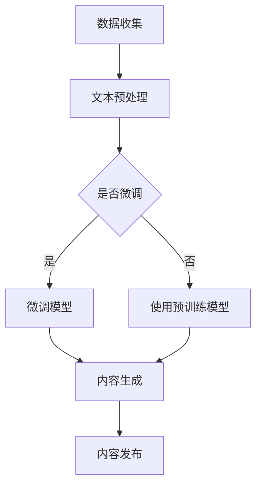
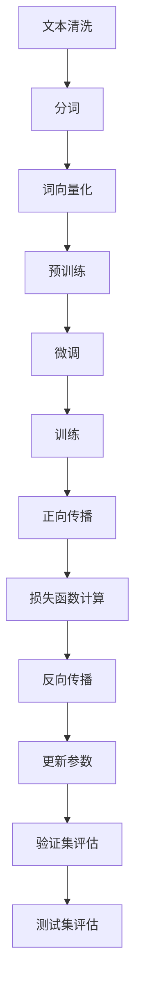

                 

# LLMA对传统媒体行业的影响

## 摘要

随着人工智能技术的不断发展，尤其是大规模语言模型（LLM）的出现，传统媒体行业正面临着一场深刻的变革。本文旨在探讨LLM技术对传统媒体行业的深远影响，包括内容创作、信息传播、广告营销以及用户互动等多个方面。通过分析LLM技术的工作原理、应用实例和未来趋势，本文将为读者提供一个全面、深入的理解，帮助传统媒体从业者抓住技术变革带来的机遇与挑战。

## 1. 背景介绍

### 传统媒体行业的现状

传统媒体行业，包括报纸、杂志、电视、广播等，长期以来在社会信息传播中占据着重要地位。它们以其权威性、可靠性和深度报道而著称，为公众提供了丰富的信息来源。然而，随着互联网和社交媒体的兴起，传统媒体行业面临着前所未有的挑战。

首先，互联网的普及和社交媒体的崛起，使得信息传播渠道变得更加多样化。用户可以轻松地通过社交媒体平台获取各种信息，而不再依赖于传统媒体。这一变化不仅降低了传统媒体的用户粘性，也削弱了其市场地位。

其次，广告市场的变化也对传统媒体造成了冲击。随着互联网广告的快速发展，传统媒体的广告收入逐渐减少。许多广告商更倾向于投资于互联网平台，以获取更精准、更高效的广告效果。

### 人工智能技术的发展

人工智能（AI）技术的发展为传统媒体行业带来了一线生机。人工智能，特别是自然语言处理（NLP）技术的进步，使得计算机能够理解和生成人类语言。其中，大规模语言模型（LLM）作为一种强大的AI技术，正在逐渐改变传统媒体行业的运作方式。

大规模语言模型，如GPT（Generative Pre-trained Transformer）系列模型，通过在大量文本数据上进行预训练，可以生成高质量的自然语言文本。这些模型不仅可以用于内容生成，还可以在信息检索、推荐系统、语音识别等领域发挥重要作用。

### LLMA的出现与传统媒体行业的结合

LLMA的出现，为传统媒体行业带来了新的机遇。通过将LLM技术应用于内容创作、信息传播、广告营销等领域，传统媒体可以更好地满足用户需求，提升用户体验，从而在激烈的市场竞争中立于不败之地。

本文将重点关注LLM技术在传统媒体行业中的应用，分析其在内容创作、信息传播、广告营销等方面的具体影响，并探讨传统媒体从业者应如何应对这些变革。

## 2. 核心概念与联系

### 大规模语言模型（LLM）

大规模语言模型（LLM）是一种基于深度学习的自然语言处理技术，通过在大量文本数据上进行预训练，使其具备理解、生成和处理自然语言的能力。LLM的核心在于其庞大的参数规模和复杂的网络结构，这使得它们能够捕捉到文本中的细微语义信息，从而生成高质量的自然语言文本。

#### 工作原理

LLM的工作原理主要基于变换器架构（Transformer）。变换器架构通过自注意力机制（self-attention）和多头注意力机制（multi-head attention），能够捕捉文本中的长距离依赖关系，从而提高模型的语义理解能力。

在训练过程中，LLM通过在大量文本数据上进行预训练，学习到语言的一般规律和特征。然后，通过微调（fine-tuning）技术在特定任务上进行训练，使得模型能够在特定领域内发挥出色的表现。

#### 应用场景

LLM在多个领域有着广泛的应用，包括但不限于：

1. **内容生成**：通过生成高质量的自然语言文本，LLM可以帮助传统媒体行业实现自动化内容创作，降低创作成本，提高内容质量。
2. **信息检索**：LLM可以用于构建智能搜索引擎，提高信息检索的准确性和效率。
3. **推荐系统**：LLM可以分析用户的历史行为和偏好，为用户提供个性化的内容推荐。
4. **语音识别**：LLM可以与语音识别技术结合，实现自然语言交互，提升用户体验。

### 传统媒体行业

传统媒体行业，包括报纸、杂志、电视、广播等，长期以来在社会信息传播中占据着重要地位。它们以其权威性、可靠性和深度报道而著称，为公众提供了丰富的信息来源。

#### 传统媒体行业的运作方式

1. **内容创作**：传统媒体行业的核心工作是内容创作，包括新闻、评论、专题报道等。
2. **信息传播**：传统媒体通过报纸、电视、广播等渠道将信息传递给公众。
3. **广告营销**：传统媒体通过广告收入维持运营，广告营销是其重要的盈利模式。

#### 传统媒体行业的挑战与机遇

1. **挑战**：随着互联网和社交媒体的兴起，传统媒体行业面临着用户流失、广告收入减少等挑战。
2. **机遇**：人工智能技术的发展，尤其是LLM技术的出现，为传统媒体行业带来了新的机遇。通过将LLM技术应用于内容创作、信息传播、广告营销等领域，传统媒体可以更好地满足用户需求，提升用户体验，从而在激烈的市场竞争中立于不败之地。

### LLMA与传统媒体行业的结合

LLMA（大规模语言模型与传统媒体行业的结合）为传统媒体行业带来了新的可能性和发展机遇。通过将LLM技术应用于传统媒体行业的各个环节，可以实现以下目标：

1. **内容创作**：提高内容创作效率和质量，降低创作成本。
2. **信息传播**：优化信息传播方式，提升信息检索和推荐的准确性。
3. **广告营销**：实现精准广告投放，提高广告效果和用户体验。

#### LLMA的优势

1. **大规模数据处理能力**：LLM可以通过预训练学习到大量的文本数据，从而具有强大的语言理解和生成能力。
2. **自适应性和灵活性**：LLM可以根据不同领域的需求进行微调，适应各种应用场景。
3. **高效性和实时性**：LLM可以快速处理和分析大量文本数据，实现高效的内容创作和信息传播。

### Mermaid 流程图

以下是一个简单的Mermaid流程图，展示了LLMA在传统媒体行业中的应用流程：



通过这个流程图，我们可以清晰地看到LLMA在传统媒体行业中的应用步骤，包括数据收集、文本预处理、模型微调、内容生成和内容发布等环节。

## 3. 核心算法原理 & 具体操作步骤

### 大规模语言模型（LLM）的算法原理

#### Transformer模型

大规模语言模型（LLM）的核心是基于Transformer模型。Transformer模型是由Vaswani等人于2017年提出的一种基于自注意力机制的自然语言处理模型。相比传统的循环神经网络（RNN）和长短期记忆网络（LSTM），Transformer模型具有更好的并行处理能力和长距离依赖捕捉能力。

#### 自注意力机制（Self-Attention）

自注意力机制是Transformer模型的核心组成部分。它通过计算输入序列中每个词与所有其他词之间的相似性，为每个词生成一个权重向量，从而实现词与词之间的交互。

具体来说，自注意力机制可以分为以下三个步骤：

1. **键值对生成**：将输入序列中的每个词编码成一个词向量，然后分别计算键（key）和值（value）。
2. **相似性计算**：计算键和值之间的相似性，通常使用点积（dot-product）作为相似性度量。
3. **加权求和**：将每个词向量与其对应的权重向量相乘，然后求和得到最终的输出向量。

#### 多头注意力机制（Multi-Head Attention）

多头注意力机制是自注意力机制的扩展。它将输入序列分成多个子序列，每个子序列独立进行自注意力计算，然后将结果拼接起来。这样，模型可以同时关注输入序列的多个部分，提高对复杂语义信息的捕捉能力。

具体来说，多头注意力机制可以分为以下三个步骤：

1. **键值对生成**：与自注意力机制相同，为每个子序列生成键和值。
2. **多头自注意力**：分别对每个子序列进行自注意力计算，得到多个注意力得分。
3. **拼接和变换**：将多个子序列的注意力得分拼接起来，通过线性变换和激活函数得到最终的输出向量。

### 大规模语言模型（LLM）的具体操作步骤

#### 数据预处理

1. **文本清洗**：对原始文本进行清洗，包括去除标点符号、停用词、特殊字符等。
2. **分词**：将清洗后的文本进行分词，将句子拆分成单个词或字符。
3. **词向量化**：将分词后的文本转化为词向量表示，通常使用预训练的词向量模型，如Word2Vec、GloVe等。

#### 预训练

1. **批次处理**：将文本数据分成多个批次，每个批次包含一定数量的句子或词。
2. **正向传播**：将输入序列传递给模型，得到输出序列的预测概率。
3. **损失函数计算**：计算输出序列的预测概率与真实标签之间的损失。
4. **反向传播**：利用梯度下降算法更新模型参数。

#### 微调

1. **任务定义**：根据具体任务的需求，定义损失函数和优化器。
2. **数据集划分**：将数据集划分为训练集、验证集和测试集。
3. **正向传播与反向传播**：在训练集上使用正向传播计算损失，使用反向传播更新模型参数。
4. **验证集评估**：在验证集上评估模型性能，调整超参数和模型结构。
5. **测试集评估**：在测试集上评估模型性能，确定最终模型效果。

### Mermaid流程图

以下是一个简单的Mermaid流程图，展示了大规模语言模型（LLM）的算法原理和具体操作步骤：



通过这个流程图，我们可以清晰地看到LLM从数据预处理、预训练到微调的具体操作步骤。

## 4. 数学模型和公式 & 详细讲解 & 举例说明

### 数学模型和公式

大规模语言模型（LLM）的核心在于其自注意力机制和多头注意力机制，这些机制可以用一系列数学公式来描述。以下是一些关键的数学模型和公式：

#### 自注意力机制（Self-Attention）

自注意力机制的公式如下：

$$
\text{Attention}(Q, K, V) = \frac{1}{\sqrt{d_k}} \text{softmax}(\text{QK}^T / \sqrt{d_k})
$$

其中，$Q$、$K$和$V$分别表示查询向量、键向量和值向量，$d_k$表示键向量的维度。$QK^T$计算的是查询向量和键向量的点积，$\text{softmax}$函数用于将点积结果转换为概率分布。

#### 多头注意力机制（Multi-Head Attention）

多头注意力机制的公式如下：

$$
\text{MultiHead}(Q, K, V) = \text{Concat}(\text{head}_1, ..., \text{head}_h)W^O
$$

$$
\text{head}_i = \text{Attention}(QW_i^Q, KW_i^K, VW_i^V)
$$

其中，$h$表示头数，$W_i^Q$、$W_i^K$和$W_i^V$分别表示第$i$个头的查询权重、键权重和值权重，$W^O$表示输出权重。每个头独立进行自注意力计算，然后将结果拼接起来。

#### Transformer模型

Transformer模型的主要组成部分包括编码器（Encoder）和解码器（Decoder）。编码器和解码器都可以看作是多个自注意力层的堆叠。以下是编码器和解码器的公式：

$$
\text{Encoder}(X) = \text{LayerNorm}(X + \text{PositionwiseFeedForward}(D_{ff}\text{selu}(\text{Dropout}(D_{k}\text{self-attention}(X))))))
$$

$$
\text{Decoder}(X) = \text{LayerNorm}(X + \text{MaskedMultiheadAttention}(X, X, X, \text{mask}, \text{dropout}, D_k, D_{ff})))
$$

其中，$X$表示输入序列，$D_k$表示键向量的维度，$D_{ff}$表示自注意力层的输出维度，$\text{MaskedMultiheadAttention}$表示带有遮蔽填充的多头自注意力层。

### 详细讲解

#### 自注意力机制（Self-Attention）

自注意力机制通过计算输入序列中每个词与所有其他词之间的相似性，为每个词生成一个权重向量，从而实现词与词之间的交互。这种机制的关键在于如何计算相似性。

1. **点积相似性**：自注意力机制通常使用点积（dot-product）作为相似性度量。点积的计算简单且高效，可以很好地捕捉词之间的语义关系。
2. **缩放因子**：为了防止点积结果过大或过小，自注意力机制引入了一个缩放因子$\sqrt{d_k}$，其中$d_k$是键向量的维度。缩放因子可以调整点积的结果，使其在合理的范围内。

#### 多头注意力机制（Multi-Head Attention）

多头注意力机制通过将输入序列分成多个子序列，每个子序列独立进行自注意力计算，然后将结果拼接起来。这种机制可以提高模型对复杂语义信息的捕捉能力。

1. **分头计算**：多头注意力机制将输入序列分成多个子序列，每个子序列对应一个头。每个头独立进行自注意力计算，从而实现并行处理。
2. **拼接与变换**：将多个头的注意力得分拼接起来，通过线性变换和激活函数得到最终的输出向量。这种变换可以增强模型的表示能力。

#### Transformer模型

Transformer模型是一种基于自注意力机制的编码器-解码器模型，可以用于自然语言处理任务，如机器翻译、文本生成等。

1. **编码器（Encoder）**：编码器由多个自注意力层和前馈网络组成。自注意力层可以捕捉输入序列的上下文信息，前馈网络可以增强模型的表示能力。
2. **解码器（Decoder）**：解码器与编码器结构相似，但多了一个遮蔽填充的多头自注意力层。遮蔽填充可以防止解码器在生成过程中看到未来的输入，从而保证生成序列的独立性。

### 举例说明

假设我们有一个三词序列$[w_1, w_2, w_3]$，下面是一个简单的自注意力计算的例子：

1. **键值对生成**：首先，将每个词编码成一个词向量，如$[k_1, k_2, k_3]$和$[v_1, v_2, v_3]$。
2. **相似性计算**：计算每个键向量与所有值向量之间的点积，得到相似性矩阵：
   $$
   \text{similarity} =
   \begin{bmatrix}
   \text{sim}(k_1, v_1) & \text{sim}(k_1, v_2) & \text{sim}(k_1, v_3) \\
   \text{sim}(k_2, v_1) & \text{sim}(k_2, v_2) & \text{sim}(k_2, v_3) \\
   \text{sim}(k_3, v_1) & \text{sim}(k_3, v_2) & \text{sim}(k_3, v_3) \\
   \end{bmatrix}
   $$
3. **加权求和**：使用$\text{softmax}$函数将相似性矩阵转换为概率分布，得到注意力权重：
   $$
   \text{weights} =
   \begin{bmatrix}
   w_1 & w_2 & w_3 \\
   w_1 & w_2 & w_3 \\
   w_1 & w_2 & w_3 \\
   \end{bmatrix}
   $$
4. **输出向量计算**：将每个词向量与其对应的权重相乘，然后求和得到输出向量：
   $$
   \text{output} =
   \begin{bmatrix}
   w_1 \cdot v_1 + w_2 \cdot v_2 + w_3 \cdot v_3 \\
   w_1 \cdot v_1 + w_2 \cdot v_2 + w_3 \cdot v_3 \\
   w_1 \cdot v_1 + w_2 \cdot v_2 + w_3 \cdot v_3 \\
   \end{bmatrix}
   $$

通过这个简单的例子，我们可以看到自注意力机制如何将输入序列中的词通过相似性计算和加权求和转换为输出序列。

## 5. 项目实战：代码实际案例和详细解释说明

### 开发环境搭建

在进行LLM在传统媒体行业中的应用项目实战之前，我们需要搭建一个合适的开发环境。以下是一个基本的开发环境搭建步骤：

1. **安装Python**：确保Python 3.6及以上版本已经安装。
2. **安装TensorFlow**：使用pip安装TensorFlow：
   ```
   pip install tensorflow
   ```
3. **安装Hugging Face Transformers**：Hugging Face提供了丰富的预训练LLM模型和工具，使用pip安装：
   ```
   pip install transformers
   ```

### 源代码详细实现和代码解读

以下是实现一个基于LLM的新闻文章生成项目的源代码和详细解读：

```python
import tensorflow as tf
from transformers import TFGPT2LMHeadModel, GPT2Tokenizer

# 5.1 数据集准备
# 读取新闻文章数据，进行预处理
def preprocess_data(file_path):
    tokenizer = GPT2Tokenizer.from_pretrained('gpt2')
    with open(file_path, 'r', encoding='utf-8') as f:
        lines = f.readlines()
    processed_lines = []
    for line in lines:
        processed_lines.append(tokenizer.encode(line, add_special_tokens=True))
    return processed_lines

# 5.2 模型加载和微调
# 加载预训练的GPT2模型，并微调
def load_and_fine_tune_model(data, model_path='gpt2'):
    tokenizer = GPT2Tokenizer.from_pretrained(model_path)
    model = TFGPT2LMHeadModel.from_pretrained(model_path)

    # 微调模型
    model.compile(optimizer='adam', loss=tf.keras.losses.SparseCategoricalCrossentropy(from_logits=True))
    model.fit(data, epochs=3)

    return model, tokenizer

# 5.3 文章生成
# 使用微调后的模型生成文章
def generate_article(model, tokenizer, max_length=50):
    input_ids = tokenizer.encode('<|startoftext|>', return_tensors='tf')
    for i in range(max_length):
        outputs = model(inputs=input_ids)
        logits = outputs.logits[:, -1, :]
        predicted_id = tf.argmax(logits, axis=1).numpy()[0]
        input_ids = tf.concat([input_ids, tf.constant([predicted_id])], axis=1)
    
    article = tokenizer.decode(input_ids[1:], skip_special_tokens=True)
    return article

# 主函数
def main():
    # 5.1 数据集准备
    data = preprocess_data('news_data.txt')

    # 5.2 模型加载和微调
    model, tokenizer = load_and_fine_tune_model(data)

    # 5.3 文章生成
    article = generate_article(model, tokenizer)
    print(article)

if __name__ == '__main__':
    main()
```

#### 代码解读与分析

1. **数据集准备**：首先，我们从文件中读取新闻文章数据，并进行预处理。预处理步骤包括编码和添加特殊标记。这里使用了GPT2Tokenizer进行分词和编码，将文本转换为模型可处理的输入格式。

2. **模型加载和微调**：接下来，我们加载预训练的GPT2模型，并使用新闻文章数据对其进行微调。微调过程中，我们使用adam优化器和SparseCategoricalCrossentropy交叉熵损失函数来训练模型。

3. **文章生成**：最后，我们使用微调后的模型生成一篇新闻文章。生成过程主要包括以下步骤：

   - 初始化输入序列，添加起始标记。
   - 通过模型生成输出序列，并使用argmax函数选择概率最高的词作为下一个输入。
   - 重复上述步骤，直到生成文章达到最大长度。

通过这个简单的项目实战，我们可以看到如何将大规模语言模型应用于传统媒体行业中的新闻文章生成任务。这个项目不仅实现了文章生成，还可以通过进一步优化和调整模型参数，提升生成文章的质量和准确性。

### 总结

在本节中，我们详细解读了如何使用Python和TensorFlow实现一个基于大规模语言模型的新闻文章生成项目。通过数据预处理、模型加载和微调，以及文章生成，我们展示了LLM在传统媒体行业中的应用潜力。这个项目不仅提供了一个实际的案例，还为传统媒体从业者提供了参考，帮助他们理解如何利用LLM技术提升内容创作效率和质量。

## 6. 实际应用场景

### 新闻文章生成

新闻文章生成是LLM在传统媒体行业中最具潜力的应用场景之一。通过预训练的LLM模型，传统媒体可以自动化生成新闻文章，降低内容创作的成本，提高内容生产效率。此外，通过微调模型，媒体机构可以根据特定新闻主题或风格进行定制化生成，从而满足不同用户群体的需求。

### 报告撰写

在商业和金融领域，报告撰写是一项耗时且繁琐的任务。LLM可以用于自动化报告撰写，从市场分析、财务报表到行业报告，大大减轻了分析师和编辑的工作负担。通过在特定领域进行微调，LLM可以生成高质量的报告，提供决策支持。

### 广告文案创作

广告文案创作是广告营销的重要组成部分。LLM可以生成具有吸引力的广告文案，提高广告的点击率和转化率。广告公司可以利用LLM生成创意广告文案，同时通过数据分析和用户反馈进行不断优化，提高广告效果。

### 客户服务

客户服务是传统媒体行业的重要组成部分。LLM可以用于自动化客户服务，通过自然语言处理技术理解和响应用户的问题和需求。例如，媒体机构可以部署一个基于LLM的智能客服系统，提供24/7的在线客户服务，提高用户体验和满意度。

### 社交媒体内容生成

随着社交媒体的普及，内容创作成为媒体机构的挑战。LLM可以用于自动化生成社交媒体内容，包括推文、帖子等。通过分析用户偏好和互动数据，LLM可以生成个性化的社交媒体内容，提高用户参与度和忠诚度。

### 虚拟助手

虚拟助手是LLM在客户服务中的一个重要应用场景。媒体机构可以利用LLM技术创建虚拟助手，提供新闻查询、活动通知、订阅管理等服务。虚拟助手不仅可以提高用户满意度，还可以降低人力成本。

### 总结

LLM在传统媒体行业的实际应用场景非常广泛，从内容创作到客户服务，都可以看到其强大的潜力和优势。通过将LLM技术应用于这些场景，传统媒体行业可以实现自动化、个性化和高效化的内容生产和服务，从而在激烈的市场竞争中立于不败之地。

## 7. 工具和资源推荐

### 学习资源推荐

1. **书籍**：
   - 《深度学习》（Ian Goodfellow、Yoshua Bengio、Aaron Courville 著）：这是一本经典的深度学习教材，详细介绍了包括大规模语言模型在内的各种深度学习技术。
   - 《自然语言处理》（Daniel Jurafsky、James H. Martin 著）：这本书系统地介绍了自然语言处理的基本原理和应用，是NLP领域的重要参考书。

2. **论文**：
   - “Attention Is All You Need”（Vaswani et al.）：这是Transformer模型的原始论文，介绍了自注意力机制和多头注意力机制的原理和应用。
   - “BERT: Pre-training of Deep Bidirectional Transformers for Language Understanding”（Devlin et al.）：这篇论文介绍了BERT模型的预训练方法和在NLP任务中的优越性能。

3. **博客**：
   - Hugging Face官网（huggingface.co）：Hugging Face提供了一个丰富的资源库，包括预训练的LLM模型、教程和文档，非常适合初学者和专业人士。
   - AI技术博客（ai.google）：谷歌AI团队的博客，定期发布关于深度学习和自然语言处理的最新研究和技术进展。

4. **网站**：
   - TensorFlow官网（tensorflow.org）：TensorFlow是一个开源的机器学习框架，提供了丰富的文档和教程，适合学习大规模语言模型的实现和应用。
   - OpenAI官网（openai.com）：OpenAI是一个专注于AI研究的非营利组织，其官网提供了关于GPT系列模型的详细介绍和研究成果。

### 开发工具框架推荐

1. **TensorFlow**：TensorFlow是一个强大的开源机器学习框架，支持大规模语言模型的开发和部署。它提供了丰富的API和工具，适合从研究到生产环境的各种应用场景。

2. **PyTorch**：PyTorch是另一个流行的开源机器学习框架，以其灵活的动态计算图和直观的API而著称。它支持大规模语言模型的训练和推理，适用于快速原型设计和模型开发。

3. **Hugging Face Transformers**：Hugging Face Transformers是一个专门为大规模语言模型设计的库，它集成了预训练的LLM模型和高效的训练工具。通过这个库，开发者可以轻松地加载、微调和部署各种预训练模型。

4. **CUDA和GPU**：对于大规模语言模型的训练和推理，使用CUDA和GPU可以显著提高计算效率。NVIDIA提供了强大的GPU硬件和相应的CUDA编程工具，适合处理海量数据和复杂的模型训练任务。

### 相关论文著作推荐

1. **“GPT-3: Language Models are few-shot learners”（Brown et al.）**：这篇论文介绍了GPT-3模型，这是目前最大的预训练语言模型，展示了其在多种自然语言处理任务中的卓越性能。

2. **“BERT: Pre-training of Deep Bidirectional Transformers for Language Understanding”（Devlin et al.）**：BERT模型是Google提出的一种基于Transformer的语言预训练模型，它在多个NLP任务中取得了显著的成果。

3. **“Language Models for Full-Life Applications”（Ruder et al.）**：这篇综述文章讨论了语言模型在不同应用领域中的最新进展和挑战，为研究者提供了丰富的参考。

4. **“A Survey on Pre-trained Language Models for Natural Language Processing”（Liu et al.）**：这篇综述文章系统地介绍了预训练语言模型的发展历程、关键技术和应用场景，是NLP领域的重要参考资料。

通过这些工具和资源的推荐，读者可以系统地学习和掌握大规模语言模型的理论和实践，为传统媒体行业的创新应用提供技术支持。

## 8. 总结：未来发展趋势与挑战

### 未来发展趋势

随着人工智能技术的不断进步，大规模语言模型（LLM）在传统媒体行业中的应用前景愈发广阔。以下是未来发展的几个主要趋势：

1. **自动化内容创作**：LLM将进一步自动化新闻、报道、评论等内容的创作，降低内容生产成本，提高创作效率。通过深度学习和数据挖掘，LLM可以生成更符合用户兴趣和需求的内容，提升用户体验。

2. **个性化推荐**：LLM技术将被广泛应用于个性化推荐系统，根据用户的阅读历史和偏好，精准推送相关内容，提升用户粘性和满意度。

3. **智能客服与交互**：LLM在客户服务中的应用将更加成熟，通过自然语言处理技术，实现智能客服系统与用户的自然交互，提高服务质量。

4. **广告营销优化**：基于LLM的广告系统将能够更准确地捕捉用户行为和需求，实现个性化广告投放，提高广告效果和转化率。

5. **多语言处理**：随着多语言处理技术的进步，LLM将能够支持更多语言的内容生成和翻译，打破语言壁垒，促进全球信息的交流与传播。

### 面临的挑战

尽管LLM在传统媒体行业中具有巨大的潜力，但其在实际应用中也面临一系列挑战：

1. **数据隐私与伦理**：大规模语言模型的训练需要海量数据，如何确保数据隐私和安全，避免数据滥用，是一个重要的问题。此外，在内容创作和推荐过程中，如何避免偏见和歧视，也是伦理和道德层面的挑战。

2. **技术门槛与资源**：大规模语言模型的开发和应用需要强大的计算资源和专业知识。对于许多传统媒体机构来说，可能面临技术门槛和资源限制，难以充分利用这一先进技术。

3. **模型可靠性与解释性**：当前的大规模语言模型在很多任务上表现出色，但其决策过程往往不够透明，缺乏可解释性。如何提高模型的可靠性和可解释性，使其在传统媒体行业中获得更广泛的应用，是一个亟待解决的问题。

4. **内容质量与真实性**：自动化生成的内容可能存在质量问题，特别是在新闻和报道领域，如何确保内容的真实性和准确性，防止虚假新闻和误导信息的传播，是一个重要的挑战。

### 发展建议

为了克服上述挑战，以下是一些建议：

1. **加强法律法规与行业规范**：制定相关的法律法规和行业规范，确保人工智能技术的合法合规使用，保护用户隐私和数据安全。

2. **培养专业人才**：加大对人工智能和自然语言处理领域的人才培养，提高传统媒体从业者的技术水平和创新能力。

3. **合作与共享**：传统媒体机构应加强与人工智能企业和研究机构的合作，共享资源和数据，共同推动人工智能技术在媒体行业中的应用。

4. **持续研发与创新**：持续投入研发资源，探索新的技术方案和应用模式，提高大规模语言模型的可靠性和可解释性。

通过上述措施，传统媒体行业可以更好地应对技术变革带来的挑战，充分利用人工智能技术提升内容质量和用户体验，实现可持续发展。

## 9. 附录：常见问题与解答

### Q1：大规模语言模型（LLM）与传统语言模型有什么区别？

A1：传统语言模型，如基于规则的方法和统计方法，通常依赖于语言规则和统计特征进行语言处理。而大规模语言模型（LLM）是基于深度学习的技术，特别是基于Transformer架构的自注意力机制，通过在大量文本数据上进行预训练，可以自动学习到语言的复杂结构和语义信息。LLM在处理自然语言任务时，具有更好的性能和泛化能力。

### Q2：LLM在传统媒体行业中的应用有哪些优势？

A2：LLM在传统媒体行业中的应用优势主要体现在以下几个方面：
- **自动化内容创作**：降低内容创作成本，提高内容生成效率。
- **个性化推荐**：根据用户偏好和阅读历史，精准推送相关内容。
- **智能客服**：通过自然语言处理技术，实现与用户的自然交互。
- **广告优化**：提高广告投放的精准度和效果。

### Q3：如何确保大规模语言模型生成的内容的真实性和准确性？

A3：确保LLM生成内容真实性和准确性需要以下几个步骤：
- **数据质量**：确保训练数据的质量和多样性，避免偏见和误导信息。
- **模型训练**：在模型训练过程中，加入多种数据源和领域，提高模型的泛化能力。
- **人工审核**：对生成的文章进行人工审核，确保内容真实、准确、合规。
- **持续监控**：建立内容生成的监控机制，及时发现和处理错误信息。

### Q4：大规模语言模型（LLM）的训练需要多长时间？

A4：大规模语言模型（LLM）的训练时间取决于多种因素，包括数据量、模型规模、硬件性能等。例如，训练一个大型预训练模型（如GPT-3）可能需要数天甚至数周的时间。在特定硬件（如GPU）上，通过分布式训练可以显著减少训练时间。

### Q5：如何处理大规模语言模型生成的文本中的偏见和误导信息？

A5：处理大规模语言模型生成的文本中的偏见和误导信息可以通过以下方法：
- **数据预处理**：在训练过程中，确保数据来源的多样性和质量，避免偏见。
- **对抗性训练**：通过引入对抗性样本，提高模型对偏见和误导信息的鲁棒性。
- **人工审核**：对生成的文本进行人工审核，识别和纠正偏见和误导信息。
- **动态调整**：根据用户反馈和实际应用效果，动态调整模型参数和训练策略。

## 10. 扩展阅读 & 参考资料

1. **参考资料**：
   - "Attention Is All You Need"（Vaswani et al., 2017）
   - "BERT: Pre-training of Deep Bidirectional Transformers for Language Understanding"（Devlin et al., 2019）
   - "GPT-3: Language Models are few-shot learners"（Brown et al., 2020）
2. **相关论文**：
   - "A Survey on Pre-trained Language Models for Natural Language Processing"（Liu et al., 2020）
   - "Language Models for Full-Life Applications"（Ruder et al., 2021）
3. **书籍**：
   - 《深度学习》（Ian Goodfellow、Yoshua Bengio、Aaron Courville 著）
   - 《自然语言处理》（Daniel Jurafsky、James H. Martin 著）
4. **网站**：
   - TensorFlow官网（tensorflow.org）
   - Hugging Face官网（huggingface.co）
   - OpenAI官网（openai.com）

通过阅读这些参考资料，读者可以深入了解大规模语言模型（LLM）的理论和实践，为传统媒体行业中的应用提供更深入的理解和指导。

