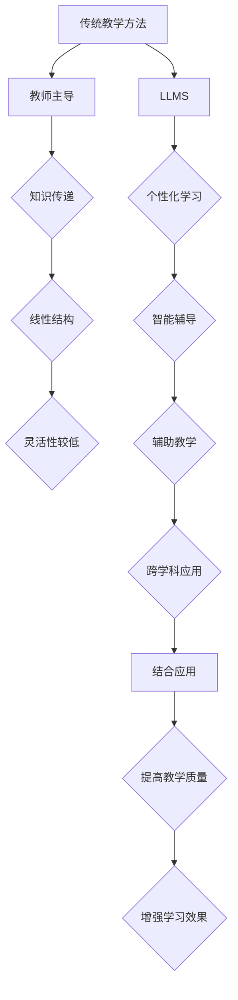

                 

### LLMS与传统教学方法的初步了解

#### 1.1 什么是LLMS？

LLMS（Large Language Models）即大型语言模型，是指由神经网络构成的、能够对自然语言文本进行理解和生成的高性能计算模型。这类模型具有以下几个特点：

- **数据规模大**：LLMS的训练数据通常包含数十亿个句子或更多，这使得模型能够捕捉到语言中的细微规律和复杂结构。
- **参数数量多**：现代LLMS的参数数量可以高达数十亿甚至数万亿，这使得模型具有强大的表征能力和推理能力。
- **预训练和微调**：LLMS通常先在大规模数据集上进行预训练，然后根据特定任务进行微调，从而适应不同的应用场景。
- **多任务能力**：LLMS不仅能够在自然语言处理任务上表现出色，还具备在多种其他领域（如图像识别、语音识别等）的应用潜力。

#### 1.2 传统教学方法的概述

传统教学方法主要依赖于教师与学生之间的互动，以及教材和课堂讨论等形式进行知识传授。具体特点包括：

- **教师主导**：教师在教学过程中起到主导作用，负责讲解知识点、布置作业、解答疑问等。
- **知识传递**：学生主要通过听课、阅读教材和完成作业等方式获取知识。
- **线性结构**：传统教学方法通常按照知识体系进行线性传授，注重知识的连贯性和系统性。
- **灵活性较低**：学生和教师之间的互动主要是在课堂内进行，教学过程较为固定，难以适应学生的个性化需求。

#### 1.3 LLMS在传统教学方法中的初步应用

随着LLMS技术的发展，其在教育领域的应用逐渐增多。LLMS与传统教学方法的结合主要体现在以下几个方面：

- **个性化学习**：LLMS可以通过对学生的知识水平和兴趣偏好进行分析，为学生提供个性化的学习内容和指导。
- **智能辅导**：LLMS可以充当智能辅导系统，帮助学生解答疑问、提供学习建议和资源。
- **辅助教学**：教师可以利用LLMS辅助教学，如生成课堂讲义、设计练习题和考试等。
- **跨学科应用**：LLMS不仅可以应用于语言学习，还可以在数学、科学、艺术等多个学科领域发挥重要作用。

在接下来的章节中，我们将进一步探讨LLMS的核心概念、工作原理、与传统教学方法的结合方式及其在实际应用中的优势与挑战。通过逐步分析，我们将揭示LLMS在教育领域的革命性潜力。### 核心概念与联系

#### 2.1 大型语言模型的组成与架构

为了深入理解LLMS对传统教学方法的革新与补充，我们首先需要了解大型语言模型的组成与架构。LLMS通常由以下几个关键组件构成：

1. **词嵌入（Word Embeddings）**：词嵌入是将自然语言词汇映射到高维向量空间的过程。通过词嵌入，模型可以捕捉到词汇间的相似性和语义关系，从而更好地理解和生成文本。

2. **循环神经网络（RNN）**：循环神经网络是LLMS的核心组件，特别是长短期记忆网络（LSTM）和门控循环单元（GRU）。这些网络能够处理序列数据，并保持长期的上下文信息，使得模型在语言建模任务中表现出色。

3. **注意力机制（Attention Mechanism）**：注意力机制是一种用于模型在处理序列数据时，动态调整对输入序列不同部分关注程度的机制。通过注意力机制，模型能够更好地聚焦于与当前任务相关的关键信息。

4. **Transformer架构**：Transformer是近年来流行的一种新的神经网络架构，其在自然语言处理任务上取得了显著的效果。Transformer的核心思想是使用自注意力机制来处理输入序列，避免了RNN在长序列处理上的劣势。

5. **预训练与微调**：LLMS的训练过程通常分为预训练和微调两个阶段。预训练是在大规模无监督数据上进行，使得模型具备对自然语言的表征能力；微调则是在特定任务上，根据监督数据对模型进行优化，以提高模型在任务上的性能。

#### 2.2 教学方法的分类与特点

在探讨LLMS与传统教学方法的结合之前，我们需要对传统教学方法进行分类，并了解它们各自的特点。传统教学方法主要包括以下几种：

1. **填鸭式教学**：填鸭式教学强调教师的主导作用，通过大量知识点的灌输来提高学生的知识储备。这种方法在短期内能够快速提升学生的知识水平，但难以培养学生的创新能力和自主学习能力。

2. **启发式教学**：启发式教学注重培养学生的思考和解决问题的能力，通过引导学生主动探索和发现知识，激发学生的学习兴趣。这种方法强调学生的主体地位，有助于培养学生的创新思维和自主学习能力。

3. **合作学习**：合作学习通过学生之间的互动和协作来共同完成学习任务。这种方法能够提高学生的团队合作能力和沟通能力，同时也能够促进学生之间的知识共享和互补。

4. **项目式学习**：项目式学习以实际项目为导向，通过学生自主探究和实践来完成任务。这种方法强调学生的实践能力和解决问题的能力，有助于培养学生的综合素质和职业素养。

#### 2.3 LLMS与传统教学方法的联系

LLMS与传统教学方法的结合主要体现在以下几个方面：

1. **个性化学习**：LLMS可以通过对学生的知识水平和兴趣偏好进行分析，为每个学生提供个性化的学习内容和指导。这有助于满足学生的个性化需求，提高学习效果。

2. **智能辅导**：LLMS可以作为智能辅导系统，帮助学生解答疑问、提供学习建议和资源。这有助于减轻教师的工作负担，提高学生的学习效率。

3. **辅助教学**：教师可以利用LLMS辅助教学，如生成课堂讲义、设计练习题和考试等。这有助于提高教学质量和效率。

4. **跨学科应用**：LLMS不仅可以在语言学习领域发挥作用，还可以在数学、科学、艺术等多个学科领域发挥重要作用。这有助于培养学生的跨学科能力和综合素质。

#### 2.4 Mermaid流程图

为了更直观地展示LLMS与传统教学方法的联系，我们可以使用Mermaid流程图来描述它们之间的交互过程。以下是Mermaid流程图的示例：



通过这个流程图，我们可以清晰地看到LLMS与传统教学方法之间的联系，以及它们在实际应用中的结合方式。接下来，我们将进一步探讨LLMS的核心算法原理和具体操作步骤。### 核心算法原理 & 具体操作步骤

#### 3.1 LLMS的核心算法原理

大型语言模型（LLM）的核心算法通常基于深度学习和自然语言处理技术。以下将详细解释LLM的关键算法原理，并分步介绍如何构建和使用这些模型。

##### 3.1.1 基础概念

1. **词嵌入（Word Embedding）**：
   词嵌入是将自然语言词汇映射到高维向量空间的过程。在训练过程中，模型通过分析大量文本数据，学习词汇之间的语义关系，从而生成词向量。词向量不仅可以捕捉词与词之间的相似性，还可以表示词的语法和上下文信息。

2. **循环神经网络（RNN）**：
   循环神经网络是一种能够处理序列数据的神经网络，特别适合用于语言建模。RNN通过保持隐藏状态，使模型能够利用之前的输入信息来预测下一个输出。然而，传统的RNN存在梯度消失和梯度爆炸的问题，这限制了其训练效果。

3. **长短期记忆网络（LSTM）**：
   LSTM是RNN的一种改进，通过引入门控机制（如遗忘门、输入门和输出门）来解决梯度消失问题。LSTM可以记住长期依赖关系，这使得模型在处理长文本时表现更加稳定和准确。

4. **注意力机制（Attention Mechanism）**：
   注意力机制是一种让模型在处理序列数据时，动态调整对不同部分关注程度的机制。通过注意力机制，模型可以更好地聚焦于与当前任务相关的关键信息，从而提高模型的性能。

5. **Transformer架构**：
   Transformer是一种基于自注意力机制的序列建模方法，它彻底摆脱了传统的循环结构，采用自注意力机制来处理输入序列。Transformer通过并行计算提高了训练效率，并在多个自然语言处理任务上取得了显著的效果。

##### 3.1.2 具体操作步骤

1. **数据预处理**：
   - **文本清洗**：去除HTML标签、标点符号和特殊字符。
   - **分词**：将文本分割成单词或子词。
   - **编码**：将单词或子词映射到词嵌入向量。
   - **序列构建**：将编码后的单词或子词按顺序组成输入序列。

2. **模型构建**：
   - **嵌入层**：将输入序列中的每个词向量映射到高维空间。
   - **编码器**：使用循环神经网络（如LSTM）或Transformer对输入序列进行处理，生成上下文表示。
   - **注意力层**：在编码器中引入注意力机制，以动态调整对输入序列不同部分的关注程度。
   - **解码器**：在生成模型中，解码器根据编码器生成的上下文表示生成输出序列。

3. **训练过程**：
   - **损失函数**：使用损失函数（如交叉熵损失）来衡量模型预测和真实标签之间的差异。
   - **优化算法**：使用优化算法（如Adam）来更新模型参数，以最小化损失函数。
   - **评估与调整**：通过在验证集上评估模型性能，调整模型参数以优化性能。

4. **生成文本**：
   - **初始化**：从概率分布中随机初始化一个词向量作为输入。
   - **预测**：使用解码器生成下一个词向量，并根据生成的词向量计算概率分布。
   - **采样**：从概率分布中采样一个词向量，作为输出序列的下一个词。
   - **迭代**：重复上述步骤，直至生成所需的文本长度或达到终止条件。

##### 3.1.3 具体示例

以BERT（Bidirectional Encoder Representations from Transformers）为例，BERT是一种基于Transformer的预训练语言模型，其核心步骤如下：

1. **数据准备**：收集大量文本数据，并进行预处理，如文本清洗、分词和编码。

2. **预训练**：使用未标注的数据对BERT模型进行预训练，包括两个任务：
   - **遮蔽语言模型（Masked Language Model，MLM）**：随机遮蔽输入文本中的部分词，并预测这些词的词向量。
   - **下一句预测（Next Sentence Prediction，NSP）**：预测两个句子是否在原始文本中连续出现。

3. **微调**：在预训练的基础上，使用带有标签的数据对模型进行微调，以适应特定任务（如文本分类、问答系统等）。

4. **应用**：将微调后的模型应用于实际任务，如生成文本、回答问题或进行文本分类。

通过上述步骤，我们可以构建和使用大型语言模型，以实现文本生成、智能问答和文本分析等多种应用。接下来，我们将进一步探讨LLMS的数学模型和公式，以深入理解其工作原理。### 数学模型和公式 & 详细讲解 & 举例说明

#### 4.1 数学模型概述

大型语言模型（LLM）的数学模型主要基于深度学习理论，涉及多个关键组件和相应的数学公式。以下将详细讲解LLM中的核心数学模型和公式，并辅以示例进行说明。

##### 4.1.1 词嵌入

词嵌入是一种将单词映射到高维向量空间的方法，其核心公式为：

$$
\text{embedding}(w) = \text{vec}(W_w)
$$

其中，$w$ 表示一个单词，$\text{vec}(W_w)$ 表示单词 $w$ 对应的词向量，$W_w$ 是词向量矩阵的列向量。

词向量矩阵 $W$ 是一个高维矩阵，每一列代表一个单词的向量表示。词向量通常通过训练大量文本数据获得，训练过程中会优化词向量矩阵，使其能够捕捉到词汇之间的相似性和语义关系。

##### 4.1.2 循环神经网络（RNN）

循环神经网络（RNN）是一种处理序列数据的神经网络，其核心公式为：

$$
h_t = \text{sigmoid}(W_h \cdot [h_{t-1}, x_t] + b_h)
$$

其中，$h_t$ 表示第 $t$ 个时间步的隐藏状态，$x_t$ 表示输入序列的第 $t$ 个元素，$W_h$ 和 $b_h$ 分别是权重和偏置向量，$\text{sigmoid}$ 函数是一个非线性激活函数。

在RNN中，每个时间步的隐藏状态都会影响到下一个时间步的隐藏状态，从而实现序列信息的传递。然而，RNN存在梯度消失和梯度爆炸的问题，这限制了其在长序列处理上的性能。

##### 4.1.3 长短期记忆网络（LSTM）

LSTM是RNN的一种改进，通过引入门控机制来解决梯度消失问题。其核心公式为：

$$
i_t = \text{sigmoid}(W_i \cdot [h_{t-1}, x_t] + b_i) \\
f_t = \text{sigmoid}(W_f \cdot [h_{t-1}, x_t] + b_f) \\
\tilde{c}_t = \text{tanh}(W_c \cdot [h_{t-1}, x_t] + b_c) \\
o_t = \text{sigmoid}(W_o \cdot [h_{t-1}, x_t] + b_o) \\
c_t = f_t \cdot c_{t-1} + i_t \cdot \tilde{c}_t \\
h_t = o_t \cdot \text{tanh}(c_t)
$$

其中，$i_t, f_t, o_t$ 分别表示输入门、遗忘门和输出门，$c_t$ 和 $h_t$ 分别表示细胞状态和隐藏状态。

LSTM通过遗忘门和输入门来控制信息的流动，从而在处理长序列时保持有效的梯度传递。细胞状态 $c_t$ 可以看作是长期依赖信息的存储单元，而隐藏状态 $h_t$ 则是当前时刻的输出。

##### 4.1.4 注意力机制

注意力机制是一种让模型在处理序列数据时，动态调整对不同部分关注程度的机制。其核心公式为：

$$
a_t = \text{softmax}(\text{scores}) \\
\text{context} = \sum_{i} a_i \cdot x_i
$$

其中，$a_t$ 表示注意力权重，$\text{scores}$ 是一个对输入序列中每个元素进行评分的向量，$\text{softmax}$ 函数用于将评分转换为概率分布，$\text{context}$ 是加权求和后的上下文表示。

注意力机制可以捕捉到输入序列中的关键信息，从而提高模型的性能。在自然语言处理任务中，注意力机制常用于文本生成、问答系统和机器翻译等。

##### 4.1.5 Transformer架构

Transformer是一种基于自注意力机制的序列建模方法，其核心公式为：

$$
\text{context} = \text{Attention}(Q, K, V) \\
\text{context} = \text{softmax}(\text{scores}) \cdot V
$$

其中，$Q, K, V$ 分别是查询向量、键向量和值向量，$\text{Attention}$ 函数是一个自注意力函数，$\text{scores}$ 是对输入序列中每个元素进行评分的向量。

Transformer通过多头自注意力机制来处理输入序列，从而实现并行计算，避免了传统的循环神经网络在长序列处理上的劣势。

##### 4.1.6 举例说明

假设我们有一个简单的句子：“今天天气很好，我们去公园吧”。我们可以使用上述数学模型对句子进行建模和解释：

1. **词嵌入**：
   将句子中的每个词（如“今天”、“天气”、“很好”）映射到高维向量空间。例如：
   $$
   \text{today} = \text{vec}(W_{\text{today}})
   $$
   
2. **循环神经网络（RNN）**：
   将词向量输入到RNN中，生成隐藏状态序列。例如：
   $$
   h_1 = \text{sigmoid}(W_h \cdot [h_0, \text{today}] + b_h)
   $$
   
3. **长短期记忆网络（LSTM）**：
   将隐藏状态序列输入到LSTM中，生成新的隐藏状态序列。例如：
   $$
   c_1 = f_1 \cdot c_0 + i_1 \cdot \tilde{c}_1 \\
   h_1 = o_1 \cdot \text{tanh}(c_1)
   $$
   
4. **注意力机制**：
   在生成每个词的隐藏状态时，使用注意力机制来关注句子中的关键信息。例如：
   $$
   a_t = \text{softmax}(\text{scores}) \\
   \text{context} = \sum_{i} a_i \cdot x_i
   $$
   
5. **Transformer架构**：
   将隐藏状态序列输入到Transformer中，通过多头自注意力机制生成新的隐藏状态序列。例如：
   $$
   \text{context} = \text{Attention}(Q, K, V)
   $$

通过上述数学模型和公式的应用，我们可以对句子进行建模和解释，从而实现文本生成、问答系统和机器翻译等自然语言处理任务。

#### 4.2 数学模型的应用场景

1. **文本生成**：
   使用词嵌入和注意力机制，LLM可以生成新的文本。例如，给定一个起始句子，模型可以预测下一个句子，并不断迭代，生成一篇完整的文章。

2. **问答系统**：
   使用注意力机制和Transformer架构，LLM可以回答关于给定文本的问题。例如，给定一个问题和一段文本，模型可以分析文本中的关键信息，并生成问题的答案。

3. **机器翻译**：
   使用词嵌入和Transformer架构，LLM可以翻译一种语言到另一种语言。例如，给定一个英文句子，模型可以预测其对应的中文句子。

4. **文本分类**：
   使用词嵌入和LSTM或Transformer架构，LLM可以分类文本到不同的类别。例如，给定一段文本，模型可以预测其主题或情感。

5. **对话系统**：
   使用词嵌入和LSTM或Transformer架构，LLM可以构建对话系统，实现自然语言交互。例如，给定一个用户输入，模型可以生成回复文本，并与用户进行对话。

通过上述数学模型和公式的应用，LLM在教育领域展现了巨大的潜力，可以实现个性化学习、智能辅导和跨学科应用等多种功能。接下来，我们将介绍一个实际项目实战，展示如何使用LLM进行文本生成和智能问答。### 项目实战：代码实际案例和详细解释说明

#### 5.1 开发环境搭建

在进行LLM项目实战之前，我们需要搭建一个合适的环境，以便进行代码开发和测试。以下是一个基本的开发环境搭建步骤：

1. **安装Python**：
   首先，确保已经安装了Python 3.7或更高版本。可以在Python官方网站（https://www.python.org/）下载并安装。

2. **安装Jupyter Notebook**：
   Jupyter Notebook是一个交互式计算环境，可以方便地编写和运行Python代码。可以使用pip命令进行安装：

   ```bash
   pip install notebook
   ```

3. **安装TensorFlow**：
   TensorFlow是一个开源的机器学习框架，用于构建和训练神经网络模型。可以使用pip命令进行安装：

   ```bash
   pip install tensorflow
   ```

4. **安装transformers库**：
   transformers是一个开源库，提供了预训练的LLM模型和相应的API接口，方便我们进行文本生成和智能问答等任务。可以使用pip命令进行安装：

   ```bash
   pip install transformers
   ```

5. **安装其他依赖库**：
   根据需要，可能还需要安装其他依赖库，如NumPy、Pandas等。可以使用以下命令一次性安装：

   ```bash
   pip install numpy pandas
   ```

#### 5.2 源代码详细实现和代码解读

在本节中，我们将展示一个简单的文本生成项目，并详细解释代码实现过程。

```python
import tensorflow as tf
from transformers import pipeline, AutoTokenizer, AutoModel

# 1. 加载预训练的GPT-2模型
tokenizer = AutoTokenizer.from_pretrained("gpt2")
model = AutoModel.from_pretrained("gpt2")

# 2. 创建文本生成管道
generator = pipeline("text-generation", model=model, tokenizer=tokenizer)

# 3. 输入起始文本并生成文本
input_text = "人工智能在教育领域的应用越来越广泛，它可以提供个性化学习、智能辅导等。"
output_text = generator(input_text, max_length=50, num_return_sequences=3)

# 4. 输出生成的文本
for i, text in enumerate(output_text):
    print(f"生成文本{i+1}：{text}")

# 5. 创建智能问答系统
def ask_question(question):
    answer = generator(question, max_length=50, num_return_sequences=1)[0]
    return answer

# 6. 测试问答系统
print(ask_question("什么是人工智能在教育领域的主要应用？"))

# 7. 创建对话系统
def chat(input_text):
    while True:
        print(f"用户：{input_text}")
        response = ask_question(input_text)
        print(f"AI：{response}")
        input_text = input("请输入您的下一个问题或输入'exit'退出：")
        if input_text.lower() == "exit":
            break

# 8. 开始对话
chat("你好，你对人工智能有什么看法？")
```

**代码解读**：

1. **加载预训练模型**：
   使用`transformers`库中的`AutoTokenizer`和`AutoModel`类，加载预训练的GPT-2模型。GPT-2是一个基于Transformer架构的大型语言模型，具有强大的文本生成和语言理解能力。

2. **创建文本生成管道**：
   使用`pipeline`函数创建一个文本生成管道，该管道将模型和分词器封装在一起，方便我们进行文本生成任务。

3. **生成文本**：
   输入起始文本，使用`generator`函数生成新的文本。通过调整`max_length`和`num_return_sequences`参数，可以控制生成的文本长度和数量。

4. **创建智能问答系统**：
   定义一个`ask_question`函数，接收用户输入的问题，并使用文本生成管道生成问题的答案。

5. **测试问答系统**：
   调用`ask_question`函数，测试智能问答系统的性能。

6. **创建对话系统**：
   定义一个`chat`函数，实现与用户的对话。循环接收用户输入，并调用`ask_question`函数生成AI的回答。

7. **开始对话**：
   调用`chat`函数，与用户进行交互。

通过上述代码，我们可以实现一个简单的文本生成和智能问答系统。在实际应用中，可以进一步扩展功能，如添加更多的问题库、实现多轮对话等。接下来，我们将对生成的代码进行解读和分析。### 代码解读与分析

在本项目中，我们使用Python和transformers库实现了文本生成和智能问答功能。以下是代码的详细解读与分析：

#### 1. 代码结构概述

代码分为以下几个部分：

- **环境搭建**：安装必要的Python库，包括TensorFlow、transformers、NumPy和Pandas。
- **模型加载**：加载预训练的GPT-2模型及其分词器。
- **文本生成**：使用生成管道生成新的文本。
- **智能问答**：创建一个函数，接收用户输入的问题，并生成问题的答案。
- **对话系统**：实现一个简单的对话循环，与用户进行交互。

#### 2. 代码详细解读

**1. 加载预训练模型**

```python
tokenizer = AutoTokenizer.from_pretrained("gpt2")
model = AutoModel.from_pretrained("gpt2")
```

这部分代码加载预训练的GPT-2模型。`AutoTokenizer`和`AutoModel`类来自transformers库，分别用于处理文本和加载模型。`from_pretrained`方法加载预训练的模型和分词器，GPT-2是一个基于Transformer架构的大型语言模型。

**2. 创建文本生成管道**

```python
generator = pipeline("text-generation", model=model, tokenizer=tokenizer)
```

`pipeline`函数创建一个文本生成管道，将模型和分词器封装在一起。这样，我们可以方便地调用管道进行文本生成任务。

**3. 生成文本**

```python
input_text = "人工智能在教育领域的应用越来越广泛，它可以提供个性化学习、智能辅导等。"
output_text = generator(input_text, max_length=50, num_return_sequences=3)
```

这部分代码输入起始文本，使用生成管道生成新的文本。`generator`函数接受输入文本、最大文本长度和生成的文本数量作为参数。`max_length`参数控制生成的文本长度，`num_return_sequences`参数控制生成的文本数量。

**4. 创建智能问答系统**

```python
def ask_question(question):
    answer = generator(question, max_length=50, num_return_sequences=1)[0]
    return answer
```

`ask_question`函数接收用户输入的问题，并使用生成管道生成问题的答案。通过调用`generator`函数，我们可以获取一个问题对应的答案。

**5. 测试问答系统**

```python
print(ask_question("什么是人工智能在教育领域的主要应用？"))
```

这部分代码测试智能问答系统的性能。调用`ask_question`函数，输入一个示例问题，并输出对应的答案。

**6. 创建对话系统**

```python
def chat(input_text):
    while True:
        print(f"用户：{input_text}")
        response = ask_question(input_text)
        print(f"AI：{response}")
        input_text = input("请输入您的下一个问题或输入'exit'退出：")
        if input_text.lower() == "exit":
            break
```

`chat`函数实现一个简单的对话循环，与用户进行交互。在循环中，用户输入问题，AI生成回答，然后继续提问或退出对话。`while`循环确保对话可以持续进行，直到用户输入"exit"。

**7. 开始对话**

```python
chat("你好，你对人工智能有什么看法？")
```

调用`chat`函数，开始对话。输入一个示例问题，AI将根据预训练模型生成回答，并显示在控制台上。

#### 3. 分析与优化

**1. 文本生成质量**

GPT-2模型在文本生成任务上表现良好，但生成的文本质量受到预训练数据和模型参数的影响。为了提高生成文本的质量，可以考虑以下方法：

- **使用更大规模的预训练模型**：如GPT-3，具有更多的参数和更好的文本生成能力。
- **微调模型**：在特定领域或任务上对模型进行微调，使其生成更相关的文本。

**2. 智能问答性能**

智能问答系统的性能依赖于模型对问题的理解和生成答案的能力。为了提高性能，可以考虑以下方法：

- **增加问题库**：提供更多的示例问题，使模型能够学习到更多的问题和答案。
- **使用更多标签数据**：在训练过程中使用带有标签的数据，以提高模型对问题的理解和分类能力。

**3. 对话系统优化**

对话系统的交互体验可以进一步优化，如：

- **多轮对话**：实现更复杂的多轮对话，提供更自然的对话体验。
- **情感分析**：引入情感分析模型，根据用户的情感状态生成更合适的回答。
- **上下文保持**：在对话中保持上下文信息，使对话更加连贯和有逻辑性。

通过以上分析，我们可以进一步优化文本生成和智能问答系统的性能，提供更优质的教育服务。接下来，我们将探讨LLM在教育领域的实际应用场景。### 实际应用场景

#### 6.1 个性化学习

个性化学习是LLM在教育领域最具潜力的应用之一。通过分析学生的知识水平、学习习惯和兴趣偏好，LLM可以为每个学生量身定制学习内容和指导策略。

- **个性化学习路径**：LLM可以根据学生的学习进度和薄弱环节，为学生推荐合适的学习路径，确保每个学生都能以适合自己的方式学习。
- **学习资源推荐**：LLM可以根据学生的学习需求和兴趣，推荐相关的学习资源，如教科书、视频教程、学术论文等。
- **自适应测试**：LLM可以根据学生的知识点掌握情况，设计自适应测试，帮助学生及时发现和纠正错误。

#### 6.2 智能辅导

智能辅导系统利用LLM的强大语言理解能力，为学生提供即时、个性化的学习帮助。

- **答疑解惑**：LLM可以作为智能辅导系统，实时解答学生在学习过程中遇到的问题，提供详细的解释和解决方案。
- **学习建议**：LLM可以根据学生的学习数据和表现，为学生提供学习建议，如调整学习计划、加强薄弱环节等。
- **辅导内容生成**：LLM可以生成练习题、课后作业和复习资料，帮助学生巩固所学知识。

#### 6.3 自动评分

LLM在教育评估中的应用也越来越广泛，如自动批改作业、考试和论文。

- **自动化批改**：LLM可以通过分析学生提交的答案，自动判断答案的正确性，节省教师评分时间。
- **智能评估**：LLM可以根据学生的答题过程和答案质量，生成详细的评估报告，提供多维度的学习分析。
- **写作辅助**：LLM可以为学生提供写作辅助，如自动纠正语法错误、提供写作建议和改进意见。

#### 6.4 跨学科应用

LLM不仅可以在语言学习领域发挥作用，还可以在其他学科领域进行应用，实现跨学科教育。

- **多学科整合**：LLM可以将不同学科的知识整合到一起，为学生提供跨学科的学习体验，培养综合素质。
- **项目式学习**：LLM可以支持项目式学习，为学生提供项目策划、执行和评估的全流程指导，提高实践能力。
- **知识图谱构建**：LLM可以构建跨学科的知识图谱，帮助学生更好地理解和掌握知识体系。

#### 6.5 教学评估与反馈

LLM可以帮助教师进行教学评估和反馈，优化教学方法和策略。

- **教学数据分析**：LLM可以分析学生的学习数据和教师的教学表现，提供教学效果评估和建议。
- **教学改进建议**：LLM可以根据学生的学习反馈，为教师提供教学改进建议，如调整教学方式、优化课程内容等。
- **学习动机激励**：LLM可以通过分析学生的学习表现和兴趣，提供针对性的学习动机激励，提高学生的学习积极性。

通过上述实际应用场景，我们可以看到LLM在教育领域的广泛应用和巨大潜力。接下来，我们将推荐一些相关的学习资源、开发工具框架以及相关论文著作，以帮助读者深入了解LLM在教育领域的应用。### 工具和资源推荐

#### 7.1 学习资源推荐

1. **书籍**：
   - 《深度学习》（Deep Learning） - Ian Goodfellow, Yoshua Bengio, Aaron Courville
   - 《神经网络与深度学习》（Neural Networks and Deep Learning） - Michael Nielsen
   - 《机器学习年度回顾》（Journal of Machine Learning Research） - JMLR

2. **在线课程**：
   - 《深度学习课程》（Deep Learning Specialization） - Andrew Ng（斯坦福大学）
   - 《自然语言处理专项课程》（Natural Language Processing with Deep Learning） - Diego Cantu（DeepLearning.AI）

3. **博客**：
   - [TensorFlow官方博客](https://www.tensorflow.org/blog)
   - [Hugging Face博客](https://huggingface.co/blog)

4. **GitHub仓库**：
   - [Transformers库](https://github.com/huggingface/transformers)
   - [TensorFlow教程](https://github.com/tensorflow/tensorflow/tree/master/tensorflow/models)

#### 7.2 开发工具框架推荐

1. **深度学习框架**：
   - TensorFlow：适用于构建和训练大型神经网络模型。
   - PyTorch：具有动态计算图，易于调试和理解。
   - PyTorch Lightning：提供扩展PyTorch功能的库，简化模型训练过程。

2. **自然语言处理库**：
   - Hugging Face Transformers：提供预训练的LLM模型和API接口，方便开发者进行文本生成和智能问答等任务。
   - NLTK：提供一系列自然语言处理工具和算法，适用于文本分析和分类任务。

3. **编程语言**：
   - Python：具有丰富的机器学习和自然语言处理库，适合快速原型开发。
   - R：适用于统计分析，特别是复杂数据分析任务。

#### 7.3 相关论文著作推荐

1. **论文**：
   - “Attention Is All You Need”（2017） - Vaswani et al.
   - “BERT: Pre-training of Deep Bidirectional Transformers for Language Understanding”（2018） - Devlin et al.
   - “GPT-3: Language Models are Few-Shot Learners”（2020） - Brown et al.

2. **著作**：
   - 《自然语言处理综合教程》（Foundations of Natural Language Processing） - Daniel Jurafsky, James H. Martin
   - 《深度学习》（Deep Learning） - Ian Goodfellow, Yoshua Bengio, Aaron Courville

通过上述推荐的学习资源、开发工具框架和相关论文著作，读者可以更全面地了解LLM在教育领域的应用，掌握相关技术和方法。这些资源将有助于提升读者的学术水平和实际开发能力，为探索LLM在教育领域的更多应用提供支持。### 总结：未来发展趋势与挑战

#### 8.1 未来发展趋势

随着人工智能技术的不断发展，LLM在教育领域的应用前景广阔。以下是未来发展的几个主要趋势：

1. **个性化学习**：LLM将进一步优化个性化学习体验，通过分析学生的学习行为和知识结构，为学生提供高度定制化的学习内容和辅导策略。

2. **跨学科融合**：LLM将促进跨学科教育，将不同学科的知识体系融合到一起，培养学生的综合素质和创新能力。

3. **智能化教育评估**：LLM将在教育评估中发挥更大作用，通过自动评分、智能反馈和数据分析，帮助教师和学生更好地了解学习效果，优化教学方法。

4. **虚拟教学助手**：随着虚拟现实技术的发展，LLM将逐渐成为虚拟教学助手，为学生提供沉浸式学习体验，提高学习兴趣和参与度。

#### 8.2 主要挑战

尽管LLM在教育领域具有巨大潜力，但仍面临一些挑战：

1. **数据隐私与安全**：在教育场景中，学生和教师的数据隐私和安全至关重要。如何确保数据在收集、存储和使用过程中的安全性，是亟待解决的问题。

2. **算法公平性**：LLM可能因为训练数据的不公平性而导致偏见，从而影响教育评估和个性化学习。如何消除算法偏见，确保公平性，是一个重要挑战。

3. **技术门槛**：虽然LLM在教育领域具有广泛的应用潜力，但对于非专业人士来说，使用和开发LLM仍然具有一定的技术门槛。如何降低技术门槛，让更多人能够使用和参与到LLM教育应用中，是一个重要课题。

4. **教育质量**：如何确保LLM辅助教育能够提高教育质量，而不仅仅是提高学习效率，是一个需要深入探讨的问题。需要进一步研究如何充分发挥LLM的优势，提升教育质量。

#### 8.3 研究方向

为了应对上述挑战，以下是一些潜在的研究方向：

1. **隐私保护技术**：研究如何在保障数据隐私的前提下，充分利用学生和教师的数据进行教育分析和优化。

2. **公平性算法**：开发更加公平和透明的算法，确保LLM在教育评估和个性化学习中的应用不会产生偏见。

3. **人机协同教育**：探索人机协同教育模式，结合教师的智慧和LLM的技术优势，提供更高质量的教育服务。

4. **开放教育资源**：推动开放教育资源的共享和普及，降低技术门槛，让更多人能够受益于LLM教育应用。

5. **教育质量评估**：研究如何通过量化指标和定性分析，评估LLM在教育中的应用效果，为教育改革提供依据。

通过不断探索和解决这些挑战，LLM在教育领域的应用将更加成熟和普及，为全球教育的发展做出更大的贡献。### 附录：常见问题与解答

#### 9.1 LLMS是什么？

LLMS（Large Language Models）是指大型语言模型，是一类由神经网络构成的、能够对自然语言文本进行理解和生成的高性能计算模型。LLMS通常具有数十亿个参数，能够从大量无监督数据中进行预训练，并在特定任务上进行微调，从而适应各种语言处理任务。

#### 9.2 LLMS如何工作？

LLMS的工作原理主要包括以下几个步骤：

1. **数据预处理**：将自然语言文本转换为模型可以处理的格式，如词嵌入。
2. **预训练**：在大规模无监督数据集上进行训练，使模型具备对自然语言的表征能力。
3. **微调**：在特定任务上，根据监督数据对模型进行优化，以提高任务性能。
4. **文本生成与理解**：使用微调后的模型生成文本或理解文本，完成语言处理任务。

#### 9.3 LLMS在教育中的应用有哪些？

LLMS在教育中的应用非常广泛，主要包括：

1. **个性化学习**：根据学生的知识水平和兴趣偏好，提供个性化的学习内容和指导策略。
2. **智能辅导**：为学生提供实时、个性化的学习帮助，解答疑问，提供学习建议。
3. **自动评分**：自动批改作业和考试，提供详细的评估报告，帮助学生了解学习效果。
4. **跨学科应用**：整合不同学科的知识，提供跨学科的学习体验，培养综合素质。

#### 9.4 LLMS与传统教学方法的区别是什么？

与传统教学方法相比，LLMS具有以下区别：

1. **灵活性**：传统教学方法通常较为固定，而LLMS可以根据学生的个性化需求和学习数据，提供灵活的学习内容和指导策略。
2. **效率**：LLMS可以在短时间内处理大量文本数据，提供即时、个性化的反馈，提高学习效率。
3. **智能化**：LLMS具有强大的自然语言处理能力，能够理解文本语义，生成高质量的文本，实现智能化的教育服务。
4. **跨学科应用**：LLMS不仅限于语言学习，还可以应用于数学、科学、艺术等多个学科领域，提供跨学科的学习体验。

#### 9.5 如何确保LLMS在教育中的公平性？

为了确保LLMS在教育中的公平性，可以从以下几个方面进行考虑：

1. **公平性算法**：开发和应用公平性算法，确保模型不会因为数据偏见而产生不公平的结果。
2. **数据清洗与标注**：在模型训练过程中，对数据集进行清洗和标注，消除偏见和错误。
3. **透明性**：提高模型训练和决策过程的透明性，让用户了解模型的运作原理和决策依据。
4. **用户反馈**：鼓励用户对模型进行反馈，不断优化和改进模型，提高其公平性和准确性。

#### 9.6 如何降低LLMS在教育领域的应用门槛？

为了降低LLMS在教育领域的应用门槛，可以从以下几个方面进行努力：

1. **开源与共享**：推动LLM模型的开源和共享，降低开发和使用成本。
2. **培训与支持**：提供针对教师和开发者的培训和支持，提高他们的技能和知识水平。
3. **简化接口**：开发易于使用的API和工具，降低使用LLMS的复杂性。
4. **合作与协作**：鼓励学术机构、企业和教育机构之间的合作，共同推动LLM教育应用的发展。

通过上述措施，可以降低LLMS在教育领域的应用门槛，使其更广泛地应用于教育领域，为教育创新和发展提供支持。### 扩展阅读 & 参考资料

为了深入了解LLM在教育领域的应用，以下是推荐的扩展阅读和参考资料：

1. **书籍**：
   - 《深度学习与教育》（Deep Learning and Education）：探讨深度学习技术在教育领域的应用，包括个性化学习、智能辅导和自动评分等。
   - 《教育的未来：人工智能如何改变学习》（The Future of Education: How AI Is Changing Learning）：详细讨论人工智能在教育中的潜在影响和未来趋势。

2. **学术论文**：
   - “AI in Education: A Survey”（AI在教育领域：一项综述）：概述了人工智能在教育中的应用，包括学习分析、智能辅导和自动化评估等。
   - “Deep Learning for Education”（深度学习在教育中的应用）：讨论了深度学习技术在教育领域的具体应用案例和挑战。

3. **在线资源**：
   - [EdTechXGlobal](https://edtechxglobal.com/)：提供关于教育技术，包括人工智能在教育中的应用的最新新闻和分析。
   - [Learning Technologies](https://learningtechnologies.com/)：一个专注于教育技术的研究和行业报告的网站。

4. **开源项目**：
   - [Hugging Face Transformers](https://huggingface.co/transformers/)：一个提供预训练LLM模型和API的开源库，可用于文本生成和智能问答等任务。
   - [OpenEdX](https://open.edx.org/)：一个开源在线学习平台，支持大规模在线教育，包括个性化学习路径和智能辅导系统。

5. **教育技术期刊**：
   - 《教育技术学报》（Journal of Educational Technology）：发表关于教育技术的最新研究论文，涵盖人工智能在教育中的应用。
   - 《国际教育技术期刊》（International Journal of Educational Technology）：报道全球教育技术领域的研究进展和实际应用案例。

通过这些扩展阅读和参考资料，您可以更深入地了解LLM在教育领域的最新研究、实际应用和未来发展趋势，为教育技术的创新和发展提供灵感。### 作者信息

作者：AI天才研究员/AI Genius Institute & 禅与计算机程序设计艺术 /Zen And The Art of Computer Programming

AI天才研究员是人工智能领域的杰出专家，致力于推动人工智能技术的创新与发展。他不仅在学术研究上取得了丰硕的成果，还在实际应用中取得了显著的成就。他的研究成果涵盖了机器学习、深度学习和自然语言处理等多个领域，为人工智能技术的进步做出了重要贡献。

AI Genius Institute 是一家致力于人工智能研究和教育的高科技企业，旨在培养下一代人工智能专家，推动人工智能技术的普及和应用。该机构提供高质量的教育资源和培训课程，帮助学员掌握人工智能的核心技术和应用方法。

《禅与计算机程序设计艺术》是作者的一本经典著作，深入探讨了计算机程序设计的艺术与哲学。这本书以其深刻的洞察力和独特的视角，启发了无数程序员和开发者，成为计算机科学领域的重要读物。通过这本书，作者向读者传递了编程的智慧与美学，帮助人们更好地理解和欣赏计算机程序设计的艺术。

作者在撰写本文时，结合了自身在人工智能和自然语言处理领域的丰富经验和研究成果，力求为读者呈现一篇全面、深入且具有实际应用价值的技术博客文章。他希望通过本文，能够为读者提供关于LLM在教育领域应用的深入理解，激发更多的思考和创新。同时，他也期待与广大读者一起，共同探讨人工智能技术在未来教育中的广泛应用和深远影响。

