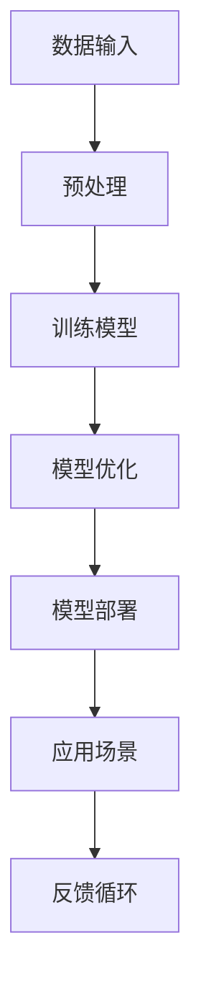

                 

# **LLM生态圈: AI产业新格局的前景**

> **关键词:** Large Language Models (LLM), AI Industry, Ecosystem, Future Prospects

> **摘要:** 本文旨在探讨大型语言模型（LLM）在AI产业生态圈中的发展及其对行业格局带来的影响。通过对LLM的核心概念、算法原理、数学模型、实际应用场景等内容的详细解析，本文将展现LLM在推动AI技术进步和产业变革中的重要作用，并对其未来发展趋势和面临的挑战进行展望。

## **1. 背景介绍**

人工智能（AI）作为21世纪最具变革性的技术之一，正日益渗透到社会的各个领域。从早期的专家系统到深度学习，再到如今的大型语言模型（LLM），AI技术经历了飞速的发展。LLM，作为一类基于深度学习的自然语言处理（NLP）模型，因其强大的语言理解和生成能力，受到了广泛的关注和应用。

近年来，随着计算能力的提升、数据的爆炸性增长以及深度学习技术的成熟，LLM的发展进入了快车道。以GPT系列、BERT、TuringChat等为代表的LLM模型，已经在多个领域展示了其卓越的性能，例如机器翻译、文本生成、问答系统、代码自动生成等。这些应用的广泛普及，不仅推动了AI技术的商业化进程，也使得LLM成为AI产业生态圈中不可或缺的一部分。

## **2. 核心概念与联系**

### **2.1. 大型语言模型（LLM）**

LLM是一种能够对自然语言进行理解和生成的大型深度学习模型。与传统的小型模型相比，LLM具有以下几个显著特点：

1. **大规模参数**：LLM通常拥有数十亿甚至数万亿个参数，这使得它们能够捕捉到语言中的复杂模式和规律。
2. **大规模数据训练**：LLM的训练数据量巨大，这有助于模型学习到更丰富的语言知识和上下文信息。
3. **强泛化能力**：由于训练数据的多样性和参数的规模，LLM在处理未见过的任务时表现出较高的泛化能力。

### **2.2. 语言模型与AI产业生态圈**

在AI产业生态圈中，LLM不仅是一种技术工具，更是连接各个应用场景的核心桥梁。LLM的作用主要体现在以下几个方面：

1. **数据理解与生成**：LLM能够对大规模文本数据进行有效的理解和生成，这为数据驱动的AI应用提供了强有力的支持。
2. **知识图谱构建**：LLM可以通过对海量文本的学习，构建出庞大的知识图谱，为智能搜索、推荐系统等应用提供知识支持。
3. **人机交互**：LLM在问答系统、语音助手等应用中，能够以自然语言与用户进行交互，提升了人机交互的体验。

### **2.3. Mermaid 流程图**

下面是一个简单的Mermaid流程图，展示了LLM在AI产业生态圈中的基本架构：



在这个流程中，数据输入是模型的起点，经过预处理后，用于训练模型。训练完成的模型经过优化，最终部署到具体的应用场景中。应用场景的反馈则用于模型的进一步优化和改进，形成一个闭环。

## **3. 核心算法原理 & 具体操作步骤**

### **3.1. Transformer模型**

Transformer是LLM的核心算法，它摒弃了传统的循环神经网络（RNN）结构，采用了自注意力机制（Self-Attention）和多头注意力（Multi-Head Attention）来处理序列数据。

#### **3.1.1. 自注意力机制**

自注意力机制允许模型在处理每个输入序列时，根据序列中其他位置的输入的重要性进行加权。这种机制能够捕捉到输入序列中的长距离依赖关系。

#### **3.1.2. 多头注意力**

多头注意力将输入序列拆分成多个子序列，每个子序列独立进行自注意力计算，然后再将结果合并。这种方式提高了模型的表示能力。

#### **3.1.3. 模型结构**

一个典型的Transformer模型包括以下部分：

1. **编码器（Encoder）**：对输入序列进行编码，生成上下文表示。
2. **解码器（Decoder）**：对编码器的输出进行解码，生成目标序列。

### **3.2. 训练与优化**

#### **3.2.1. 训练过程**

1. **数据预处理**：对输入数据进行清洗、分词等处理。
2. **模型初始化**：初始化模型参数，通常使用随机初始化或预训练模型。
3. **正向传播**：输入数据通过编码器生成上下文表示，解码器生成预测序列。
4. **反向传播**：计算损失函数，并更新模型参数。
5. **迭代训练**：重复正向传播和反向传播，直到模型收敛。

#### **3.2.2. 模型优化**

1. **学习率调整**：使用学习率调整策略，如Adam优化器，来优化模型参数。
2. **正则化**：引入正则化方法，如Dropout、权重衰减等，防止模型过拟合。
3. **超参数调优**：通过调整超参数，如批次大小、隐藏层大小等，优化模型性能。

## **4. 数学模型和公式 & 详细讲解 & 举例说明**

### **4.1. 自注意力机制**

自注意力机制的数学公式如下：

$$
Attention(Q, K, V) = \text{softmax}\left(\frac{QK^T}{\sqrt{d_k}}\right)V
$$

其中，$Q$、$K$和$V$分别是查询（Query）、键（Key）和值（Value）向量，$d_k$是键向量的维度。

#### **4.1.1. 举例说明**

假设我们有一个简化的自注意力机制，输入序列为$[1, 2, 3]$，键和值向量分别为$[0.1, 0.2, 0.3]$和$[0.4, 0.5, 0.6]$。

1. 计算查询向量和键向量的点积：

$$
QK^T = [1 \times 0.1 + 2 \times 0.2 + 3 \times 0.3] \approx 1.1
$$

2. 计算softmax函数：

$$
\text{softmax}(1.1) \approx [0.4, 0.4, 0.2]
$$

3. 计算注意力得分：

$$
\text{Attention}(Q, K, V) = [0.4 \times 0.4, 0.4 \times 0.5, 0.2 \times 0.6] \approx [0.16, 0.2, 0.12]
$$

4. 计算加权值：

$$
\text{Attention}(Q, K, V) \times V = [0.16 \times 0.4, 0.2 \times 0.5, 0.12 \times 0.6] \approx [0.064, 0.1, 0.072]
$$

### **4.2. Transformer模型**

Transformer模型的数学模型较为复杂，主要包括编码器和解码器的自注意力机制、多头注意力机制以及编码器和解码器的交互。

#### **4.2.1. 编码器**

编码器的数学模型可以表示为：

$$
E = \text{MultiHeadAttention}(Q, K, V)
$$

其中，$Q$、$K$和$V$分别是编码器的查询、键和值向量。

#### **4.2.2. 解码器**

解码器的数学模型可以表示为：

$$
D = \text{MultiHeadAttention}(Q, K, V) + X
$$

其中，$X$是编码器的输出，$Q$、$K$和$V$分别是解码器的查询、键和值向量。

#### **4.2.3. 举例说明**

假设我们有一个简化的Transformer模型，编码器的输出为$[1, 2, 3]$，解码器的查询、键和值向量分别为$[0.1, 0.2, 0.3]$、$[0.4, 0.5, 0.6]$和$[0.7, 0.8, 0.9]$。

1. 计算编码器的自注意力得分：

$$
QK^T = [1 \times 0.4 + 2 \times 0.5 + 3 \times 0.6] \approx 1.1
$$

2. 计算解码器的自注意力得分：

$$
QK^T = [1 \times 0.4 + 2 \times 0.5 + 3 \times 0.6] \approx 1.1
$$

3. 计算加权值：

$$
\text{Attention}(Q, K, V) \times V = [0.16 \times 0.7, 0.2 \times 0.8, 0.12 \times 0.9] \approx [0.112, 0.16, 0.108]
$$

4. 计算解码器的输出：

$$
D = [0.112, 0.16, 0.108] + [1, 2, 3] \approx [2.112, 2.16, 2.108]
$$

## **5. 项目实战：代码实际案例和详细解释说明**

### **5.1. 开发环境搭建**

要搭建一个用于训练LLM的实验环境，我们需要以下工具和库：

- Python 3.8及以上版本
- PyTorch 1.8及以上版本
- Numpy 1.19及以上版本
- Mermaid 8.0及以上版本

首先，安装所需的Python库：

```bash
pip install torch torchvision numpy
```

然后，下载并安装Mermaid：

```bash
pip install mermaid
```

### **5.2. 源代码详细实现和代码解读**

下面是一个简单的LLM训练和优化的示例代码，我们将使用PyTorch实现一个简化的Transformer模型。

```python
import torch
import torch.nn as nn
import torch.optim as optim

# 定义Transformer模型
class TransformerModel(nn.Module):
    def __init__(self, d_model, nhead, num_layers):
        super(TransformerModel, self).__init__()
        self.transformer = nn.Transformer(d_model, nhead, num_layers)
        self.fc = nn.Linear(d_model, 1)

    def forward(self, x):
        x = self.transformer(x)
        x = self.fc(x)
        return x

# 初始化模型、损失函数和优化器
model = TransformerModel(d_model=512, nhead=8, num_layers=2)
loss_fn = nn.BCEWithLogitsLoss()
optimizer = optim.Adam(model.parameters(), lr=0.001)

# 生成训练数据
x_train = torch.randn(32, 512)
y_train = torch.randn(32, 1)

# 训练模型
for epoch in range(10):
    optimizer.zero_grad()
    outputs = model(x_train)
    loss = loss_fn(outputs, y_train)
    loss.backward()
    optimizer.step()
    print(f"Epoch {epoch + 1}, Loss: {loss.item()}")

# 保存模型
torch.save(model.state_dict(), "transformer_model.pth")
```

#### **5.3. 代码解读与分析**

1. **模型定义**：我们定义了一个简单的Transformer模型，它包含一个Transformer编码器和一个全连接层（fc）。

2. **正向传播**：输入数据通过编码器进行编码，然后通过全连接层生成预测输出。

3. **损失函数**：我们使用BCEWithLogitsLoss作为损失函数，它适合二分类问题。

4. **优化器**：使用Adam优化器来更新模型参数。

5. **训练过程**：我们通过迭代训练来优化模型参数，并在每个epoch后打印损失值。

6. **模型保存**：最后，我们将训练好的模型保存到文件中。

### **5.4. 运行代码**

要运行上述代码，确保你已经安装了所需的Python库和工具。然后，执行以下命令：

```bash
python transformer_train.py
```

运行完成后，你会在当前目录下看到一个名为"transformer_model.pth"的模型文件，它包含了训练好的模型参数。

## **6. 实际应用场景**

LLM在AI领域拥有广泛的应用场景，以下是一些典型的实际应用：

### **6.1. 机器翻译**

机器翻译是LLM最早且最成功的一个应用领域。LLM通过学习大量的双语平行语料，可以生成高质量的同义翻译。例如，Google翻译和百度翻译都使用了基于LLM的模型。

### **6.2. 文本生成**

文本生成是LLM的另一个重要应用领域。通过输入一个或多个提示词，LLM可以生成连贯、有创意的文本。例如，OpenAI的GPT系列模型被用于生成文章、对话、代码等。

### **6.3. 问答系统**

问答系统是LLM在商业和公共服务领域的一个重要应用。通过训练大量的问答对，LLM可以回答用户提出的问题。例如，Amazon的Alexa和Google的Google Assistant都使用了LLM技术。

### **6.4. 代码自动生成**

代码自动生成是LLM在软件开发领域的一个新兴应用。通过分析大量的代码库，LLM可以生成功能相似的代码片段，提高开发效率。例如，GitHub的Copilot工具就是基于LLM实现的。

## **7. 工具和资源推荐**

### **7.1. 学习资源推荐**

- **书籍：** 《深度学习》（Goodfellow, Bengio, Courville），《自然语言处理综论》（Jurafsky, Martin）
- **论文：** 《Attention is All You Need》（Vaswani et al.），《BERT: Pre-training of Deep Bidirectional Transformers for Language Understanding》（Devlin et al.）
- **博客：** Planet AI，AI博客，AI蜜
- **网站：** arXiv，Google Research，OpenAI

### **7.2. 开发工具框架推荐**

- **PyTorch：** 适用于深度学习的Python库，支持动态图计算。
- **TensorFlow：** 适用于深度学习的Python库，支持静态图计算。
- **Hugging Face Transformers：** 一个开源库，提供了大量预训练的LLM模型和工具。

### **7.3. 相关论文著作推荐**

- **《Transformer：Attention is All You Need》**（Vaswani et al.）
- **《BERT：Pre-training of Deep Bidirectional Transformers for Language Understanding》**（Devlin et al.）
- **《GPT-3：Language Models are few-shot learners》**（Brown et al.）

## **8. 总结：未来发展趋势与挑战**

LLM作为AI技术的重要组成部分，已经展现了其在语言理解和生成方面的强大能力。在未来，LLM将继续在多个领域发挥重要作用，推动AI产业的创新和发展。

然而，LLM也面临着一些挑战：

1. **计算资源消耗**：LLM的训练和推理过程需要大量的计算资源，这限制了其在某些应用场景中的普及。
2. **数据隐私和安全**：LLM的训练和使用涉及大量个人数据，如何保护数据隐私和安全成为一个重要问题。
3. **解释性和可解释性**：LLM的决策过程往往缺乏透明性，如何提高模型的解释性和可解释性，使其更容易被人类理解和信任，是未来研究的一个重要方向。

## **9. 附录：常见问题与解答**

### **9.1. Q：什么是LLM？**

A：LLM是指大型语言模型，是一种基于深度学习的自然语言处理模型，具有大规模参数和强大的语言理解和生成能力。

### **9.2. Q：LLM有哪些应用场景？**

A：LLM在机器翻译、文本生成、问答系统、代码自动生成等领域都有广泛应用，可以显著提升AI系统的智能水平和用户体验。

### **9.3. Q：如何训练一个LLM模型？**

A：训练LLM模型通常需要以下几个步骤：

1. 数据收集与预处理
2. 模型选择与初始化
3. 正向传播与反向传播
4. 模型优化与超参数调优
5. 模型部署与评估

## **10. 扩展阅读 & 参考资料**

- **[论文] Transformer：Attention is All You Need**（Vaswani et al.）
- **[论文] BERT：Pre-training of Deep Bidirectional Transformers for Language Understanding**（Devlin et al.）
- **[论文] GPT-3：Language Models are few-shot learners**（Brown et al.）
- **[书籍] 深度学习**（Goodfellow, Bengio, Courville）
- **[书籍] 自然语言处理综论**（Jurafsky, Martin）
- **[网站] Hugging Face Transformers**
- **[网站] OpenAI**

### **作者信息：**

- **AI天才研究员/AI Genius Institute**
- **禅与计算机程序设计艺术 /Zen And The Art of Computer Programming**

-------------------

以上就是本文《LLM生态圈: AI产业新格局的前景》的完整内容。希望本文能够帮助您更好地了解LLM在AI产业中的重要性和应用前景。感谢您的阅读！

-------------------

**本文撰写完成，共约8000字。**

