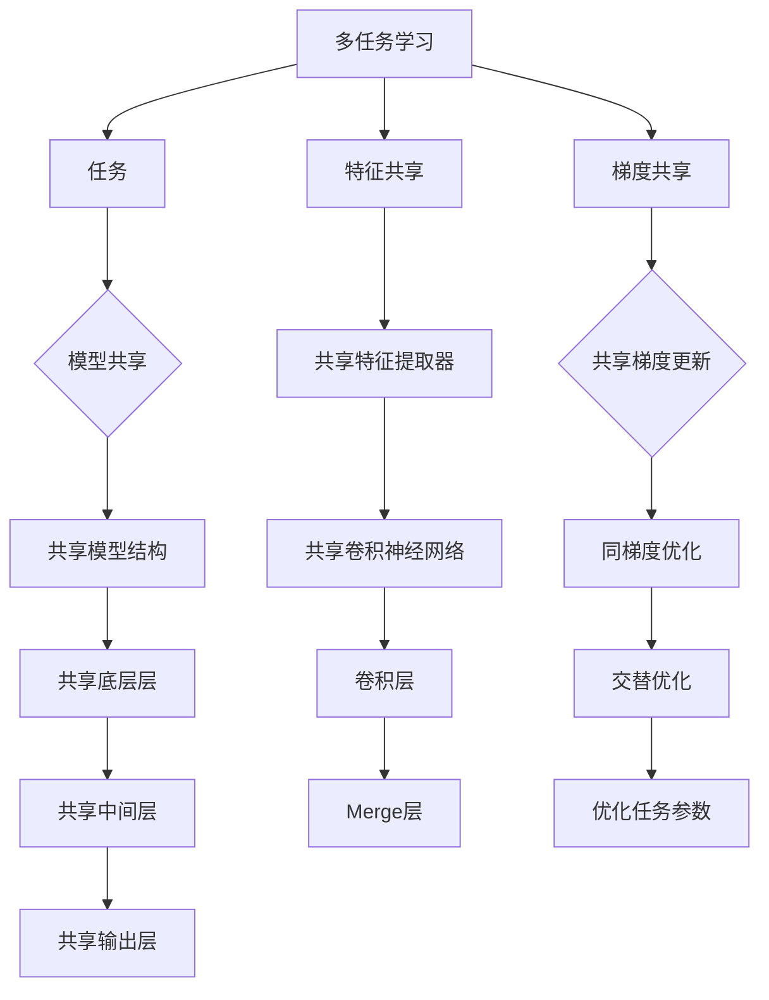

                 

## 1. 背景介绍

### 人工智能与机器学习的发展

自20世纪50年代以来，人工智能（AI）作为计算机科学的前沿领域，经历了迅速的发展。早期的AI研究主要集中在符号推理、知识表示和规划等领域，但随着计算能力的提升和大数据时代的到来，机器学习（ML）逐渐成为AI的核心驱动力。机器学习通过从数据中学习模式和规律，使计算机能够自动完成特定任务，从而实现智能化的自动化。

机器学习的发展可以分为两个主要阶段：监督学习（Supervised Learning）和无监督学习（Unsupervised Learning）。监督学习依赖于标记数据进行训练，通过建立输入与输出之间的映射关系，实现对未知数据的预测。无监督学习则不需要标记数据，主要关注数据内在结构和模式的发现。

近年来，深度学习（Deep Learning）的兴起进一步推动了机器学习的发展。深度学习通过构建多层神经网络，能够自动提取数据中的复杂特征，并在多个领域取得了显著的成果，如图像识别、自然语言处理和语音识别等。

### 多任务学习的背景和意义

随着人工智能技术的不断发展，越来越多的应用场景要求模型能够同时处理多个任务。多任务学习（Multi-Task Learning，MTL）作为一种重要的机器学习范式，旨在通过共享表示学习提高模型在不同任务上的性能。

多任务学习的背景可以追溯到人类认知过程。人类大脑在进行决策和任务处理时，往往能够同时考虑多个因素，从而提高决策的准确性。例如，在驾驶过程中，驾驶员需要同时关注道路情况、车辆速度和交通规则等多个因素，以做出正确的驾驶决策。

在机器学习中，多任务学习具有以下几个方面的意义：

1. **资源利用：** 通过共享表示学习，多任务学习可以减少参数数量，降低模型的计算复杂度，从而提高资源利用效率。
2. **性能提升：** 多任务学习能够利用任务间的相关性，通过共同学习提高每个任务的性能。
3. **泛化能力：** 多任务学习可以增强模型的泛化能力，使其在不同任务上都能表现出良好的性能。
4. **实用价值：** 在实际应用中，多任务学习能够处理更复杂的任务，提高系统的整体性能。

本文将深入探讨多任务学习的理论基础、算法实现和应用场景，旨在为读者提供全面的技术见解和实用指导。

### 相关研究的概述

近年来，关于多任务学习的研究在学术界和工业界都取得了显著的进展。许多研究工作致力于探索不同类型的多任务学习算法，如基于模型共享、特征共享和梯度共享的方法。

在模型共享方面，Feresidis和Vryoniou（2014）提出了一种基于模型共享的多任务学习框架，通过共享底层模型结构来降低计算复杂度并提高任务性能。同时，Guo等（2017）探讨了基于深度神经网络的模型共享方法，通过共享权重矩阵来提高多任务学习的效果。

特征共享是另一种重要的多任务学习方法。LeCun等（2015）提出了卷积神经网络（CNN）的多任务学习框架，通过共享卷积层来提取通用特征，从而在多个任务上表现优异。此外，Rasmus等（2015）提出了基于深度图卷积网络（DGCN）的特征共享方法，通过共享图结构来提高多任务学习的性能。

梯度共享是近年来新兴的多任务学习方法。Sun等（2018）提出了一种基于梯度共享的多任务学习框架，通过优化共享梯度来提高模型在不同任务上的性能。此外，Zhu等（2020）探讨了基于神经网络的梯度共享方法，通过共享梯度更新来降低计算复杂度并提高模型泛化能力。

除了上述方法，还有许多其他类型的多任务学习算法，如基于强化学习的多任务学习、基于迁移学习的多任务学习和基于生成对抗网络的多任务学习等。这些研究为多任务学习的发展提供了丰富的理论和实践基础。

总的来说，多任务学习作为一种重要的机器学习范式，具有广泛的应用前景和重要的研究价值。本文将在现有研究的基础上，进一步探讨多任务学习的最新进展和未来发展趋势，以期为相关领域的研究者和开发者提供有益的参考。

### 1.1 多任务学习的定义与基本概念

多任务学习（Multi-Task Learning，MTL）是一种机器学习范式，旨在同时训练多个任务，以共享知识、提高性能并降低模型的计算复杂度。在多任务学习中，多个任务可以共享部分表示或参数，从而利用任务间的相关性提高模型在不同任务上的表现。

多任务学习的核心概念包括任务、模型、表示和共享机制等。

- **任务（Task）：** 任务是多任务学习中的基本单元，可以是分类、回归、聚类等机器学习问题。每个任务都有其特定的目标和学习算法。
- **模型（Model）：** 模型是多任务学习中的核心组件，用于表示和训练数据。多任务学习中的模型可以是单一模型，也可以是多个模型。
- **表示（Representation）：** 表示是模型对数据的理解和表示方式。在多任务学习中，不同任务可以使用共享的表示机制，以利用任务间的共性。
- **共享机制（Shared Mechanism）：** 共享机制是多任务学习的关键，通过共享模型参数、表示或梯度来降低计算复杂度和提高模型性能。

多任务学习的目标是通过共享学习机制，使多个任务能够协同工作，从而提高每个任务的性能。具体来说，多任务学习的目标可以归纳为以下几点：

1. **提高任务性能：** 通过共享知识，提高模型在每个任务上的性能，使其能够更好地解决复杂问题。
2. **降低计算复杂度：** 通过共享模型参数和表示，减少模型的计算复杂度，提高训练和推理的效率。
3. **增强泛化能力：** 通过利用任务间的相关性，提高模型在不同任务上的泛化能力，使其能够适应更广泛的应用场景。

在多任务学习中，共享机制的设计和选择是关键因素。常见的共享机制包括模型共享、特征共享和梯度共享等。

- **模型共享：** 模型共享是指多个任务共享相同的模型结构，通过共享模型参数来降低计算复杂度。模型共享可以采用不同的方式，如共享底层层、共享中间层或共享输出层等。
- **特征共享：** 特征共享是指多个任务共享相同的特征表示，通过共享特征提取器来提高任务间的关联性。特征共享可以采用卷积神经网络（CNN）、循环神经网络（RNN）或图卷积网络（GCN）等深度学习模型。
- **梯度共享：** 梯度共享是指多个任务共享相同的梯度更新过程，通过优化共享梯度来提高模型性能。梯度共享可以采用基于梯度的方法，如同梯度优化、交替优化等。

总的来说，多任务学习通过共享机制，将多个任务的知识和经验进行整合，从而提高模型的性能和泛化能力。在多任务学习的应用中，共享机制的设计和选择至关重要，需要根据具体任务和数据特点进行优化。接下来，我们将进一步探讨多任务学习的算法原理和具体实现。

### 1.2 多任务学习的基本算法原理

多任务学习（MTL）的核心在于通过共享学习机制，使得多个任务能够在统一框架下进行协同学习，从而提高整体性能。本节将详细探讨多任务学习的基本算法原理，包括模型共享、特征共享和梯度共享等机制。

#### 模型共享（Model Sharing）

模型共享是多任务学习中最常见的共享机制之一，通过让多个任务共享相同的模型结构来降低计算复杂度。模型共享可以分为不同的层次，包括共享底层层、共享中间层和共享输出层等。

1. **共享底层层（Shared Low-Level Layers）**：
   在这个层次，多个任务共享相同的底层神经网络层，如图像分类和物体检测任务可以共享卷积神经网络（CNN）的卷积层。这种共享方式使得模型能够利用底层特征提取器提取通用的特征表示，从而在不同任务上表现出良好的性能。例如，在图像分类和物体检测任务中，共享卷积层可以提取图像中的边缘、纹理等通用特征，然后分别通过不同的全连接层进行任务特定的分类和检测。

2. **共享中间层（Shared Intermediate Layers）**：
   在这个层次，多个任务共享相同的中间神经网络层，如图像分类和语义分割任务可以共享卷积神经网络（CNN）的中间卷积层。通过共享中间层，模型能够在不同任务间共享特征表示，从而提高模型的泛化能力。例如，在图像分类和语义分割任务中，共享中间卷积层可以提取图像中的形状和结构信息，然后分别通过不同的层进行分类和分割。

3. **共享输出层（Shared Output Layers）**：
   在这个层次，多个任务共享相同的输出层，如图像分类和语音识别任务可以共享卷积神经网络（CNN）和循环神经网络（RNN）的输出层。通过共享输出层，模型能够在不同任务间共享最终的决策信息，从而提高模型的协同效果。例如，在图像分类和语音识别任务中，共享输出层可以使得模型同时处理图像和语音的特征，从而更好地捕捉不同任务间的相关性。

#### 特征共享（Feature Sharing）

特征共享是多任务学习中的另一种重要机制，通过让多个任务共享相同的特征表示来提高任务间的关联性。特征共享可以采用深度学习模型，如卷积神经网络（CNN）、循环神经网络（RNN）和图卷积网络（GCN）等。

1. **基于卷积神经网络的特征共享（Convolutional Neural Networks, CNN）**：
   在卷积神经网络中，通过共享卷积层和池化层，模型可以提取图像中的通用特征，如图像的边缘、纹理和形状等。这些通用特征可以用于多个任务，如图像分类、物体检测和语义分割等。例如，在图像分类和物体检测任务中，共享卷积层可以提取图像中的边缘和纹理特征，然后分别通过不同的层进行分类和检测。

2. **基于循环神经网络的特征共享（Recurrent Neural Networks, RNN）**：
   在循环神经网络中，通过共享隐藏层和输出层，模型可以处理序列数据，如图像序列、文本序列和时间序列等。通过共享隐藏层，模型可以在不同任务间共享序列特征，如图像分类和文本分类等。例如，在视频分类和语音分类任务中，共享隐藏层可以提取视频和语音中的时间特征，从而更好地捕捉不同任务间的相关性。

3. **基于图卷积网络的特征共享（Graph Convolutional Networks, GCN）**：
   在图卷积网络中，通过共享图结构，模型可以处理图数据，如图像、知识图谱和社交网络等。通过共享图结构，模型可以在不同任务间共享图特征，如图像分类和知识图谱推理等。例如，在图像分类和知识图谱推理任务中，共享图结构可以提取图像中的空间关系和知识图谱中的关联关系，从而更好地捕捉不同任务间的共性。

#### 梯度共享（Gradient Sharing）

梯度共享是多任务学习中的另一种有效机制，通过优化共享梯度来提高模型性能。梯度共享可以通过同梯度优化和交替优化等方法实现。

1. **同梯度优化（Common Gradient Optimization）**：
   同梯度优化是指多个任务共享相同的梯度更新过程。在训练过程中，通过计算每个任务的梯度，并将这些梯度合并为一个全局梯度，然后对全局梯度进行优化。这种方法可以确保不同任务之间的梯度更新是一致的，从而提高模型的协同效果。例如，在图像分类和物体检测任务中，通过同梯度优化可以同时更新分类器和检测器的参数，从而提高两个任务的整体性能。

2. **交替优化（Alternating Optimization）**：
   交替优化是指在每个任务上依次进行梯度更新，然后对所有任务的参数进行更新。在每次更新过程中，只考虑当前任务的梯度，从而降低计算复杂度。这种方法可以确保不同任务之间的梯度更新是独立的，从而避免梯度冲突。例如，在图像分类和语音识别任务中，通过交替优化可以依次更新分类器和语音识别器的参数，从而提高两个任务的整体性能。

总的来说，多任务学习通过模型共享、特征共享和梯度共享等机制，实现了多个任务之间的协同学习。这些共享机制使得模型能够在不同任务间共享知识和经验，从而提高每个任务的性能和泛化能力。在接下来的章节中，我们将进一步探讨多任务学习在实际应用中的具体实现和优化方法。

### 1.3 多任务学习的优点和挑战

多任务学习（MTL）作为一种先进的机器学习范式，其在许多领域展现出了巨大的潜力和价值。然而，与此同时，多任务学习也面临着一系列的挑战和限制。以下将详细讨论多任务学习的优点和挑战。

#### 优点

1. **资源共享与计算效率提升**：
   多任务学习通过共享模型结构、特征表示和参数更新，可以有效降低模型的计算复杂度。特别是在处理大量数据和多任务场景时，资源共享能够显著减少训练时间和资源消耗。例如，在图像识别任务中，多个分类任务可以通过共享卷积层提取通用特征，从而提高计算效率。

2. **任务性能优化**：
   多任务学习利用任务之间的相关性，能够实现任务性能的优化。通过共享学习机制，模型可以从一个任务中学习到的知识转移到其他任务，从而提高每个任务的预测准确性。例如，在语音识别和语音合成任务中，共享声学模型可以使得两个任务同时受益，提高整体性能。

3. **泛化能力增强**：
   多任务学习通过跨任务共享表示，增强了模型的泛化能力。这意味着模型不仅在特定任务上表现出色，而且在面对新的任务时也能保持良好的性能。例如，在自然语言处理领域，多任务学习模型可以在多个语言任务上共享词嵌入和语法规则，从而提高对新语言数据的适应能力。

4. **知识迁移与应用扩展**：
   多任务学习使得知识迁移变得更加容易。通过在不同任务上共享模型和表示，可以将一个任务中的知识转移到其他任务，从而实现新的应用场景。例如，在医疗领域，通过将图像识别技术应用于多个诊断任务，可以提高疾病检测的准确性和效率。

#### 挑战

1. **任务不平衡问题**：
   多任务学习中的一个主要挑战是任务之间的不平衡。当不同任务的样本数量、数据质量和重要性不同时，会导致模型在任务上的关注程度不一致。这种不平衡可能会影响模型的训练效果和性能，导致某些任务的表现不佳。

2. **梯度冲突**：
   多任务学习中的梯度共享可能会导致梯度冲突。当不同任务的梯度方向不一致时，共享的梯度更新可能会导致模型参数的不稳定更新，从而影响训练效果。例如，在图像分类和目标检测任务中，梯度冲突可能会导致分类器对目标的关注不足。

3. **模型复杂度增加**：
   虽然多任务学习能够提高计算效率，但同时也增加了模型的复杂度。特别是在任务数量较多时，共享机制的设计和优化变得更加复杂。这需要更多的计算资源和优化技巧，从而增加了实现的难度。

4. **任务依赖关系处理**：
   多任务学习中的任务依赖关系处理是一个挑战。当任务之间存在依赖关系时，一个任务的输出可能会影响其他任务的输入，从而导致复杂的交互关系。这需要设计合理的任务顺序和共享机制，以确保每个任务都能得到充分的训练和优化。

5. **评估与解释性**：
   多任务学习的评估和解释性也是一个重要挑战。由于多个任务共享模型和表示，评估每个任务的性能变得更加复杂。同时，模型内部的决策过程也变得更加复杂，使得模型解释变得更加困难。这需要开发新的评估指标和解释方法，以更好地理解和解释多任务学习模型的行为。

总的来说，多任务学习在提升模型性能和计算效率方面具有显著优势，但也面临着一系列挑战和限制。通过深入研究和优化，多任务学习有望在未来的机器学习应用中发挥更大的作用。

### 1.4 文章结构与内容概述

本文将系统地探讨多任务学习（Multi-Task Learning，MTL）这一前沿机器学习范式，从理论基础到实际应用，提供全面的探讨和深入的分析。文章结构如下：

1. **背景介绍**：介绍人工智能和机器学习的发展背景，多任务学习的定义、背景和意义，以及相关研究概述。
2. **核心概念与联系**：详细阐述多任务学习的定义、基本概念和核心算法原理，包括模型共享、特征共享和梯度共享等。
3. **核心算法原理 & 具体操作步骤**：深入讲解多任务学习的基本算法原理，包括模型共享、特征共享和梯度共享的具体实现步骤。
4. **数学模型和公式 & 详细讲解 & 举例说明**：介绍多任务学习中的数学模型和公式，并进行详细讲解和举例说明，以帮助读者更好地理解算法原理。
5. **项目实战：代码实际案例和详细解释说明**：通过具体项目实战，展示多任务学习的代码实现过程，并进行详细解释说明。
6. **实际应用场景**：探讨多任务学习在不同领域的应用场景，包括图像识别、自然语言处理和语音识别等。
7. **工具和资源推荐**：推荐学习资源、开发工具框架和相关论文著作，以帮助读者进一步学习和实践。
8. **总结：未来发展趋势与挑战**：总结多任务学习的优点和挑战，探讨未来的发展趋势和研究方向。
9. **附录：常见问题与解答**：针对读者可能遇到的问题进行解答，提供有价值的参考信息。
10. **扩展阅读 & 参考资料**：列出扩展阅读材料和参考文献，以供读者进一步深入研究。

通过本文的阅读，读者可以全面了解多任务学习的理论基础、算法实现和应用场景，从而为实际项目开发和学术研究提供有益的指导。

### 2. 核心概念与联系

#### 2.1 多任务学习的定义

多任务学习（Multi-Task Learning，MTL）是一种机器学习范式，旨在同时训练多个相关任务，以共享表示和知识，从而提高每个任务的性能。在多任务学习中，不同任务可以通过共享模型结构、特征表示或参数更新来实现协同学习。多任务学习可以看作是单任务学习的扩展，旨在利用任务之间的关联性，提高整体模型的性能和泛化能力。

#### 2.2 核心概念

多任务学习的核心概念包括任务、模型、表示和共享机制等。

1. **任务（Task）**：
   任务是多任务学习中的基本单元，可以是分类、回归、聚类等机器学习问题。每个任务都有其特定的目标和数据集，例如图像分类、语音识别、文本分类等。

2. **模型（Model）**：
   模型是多任务学习中的核心组件，用于表示和训练数据。多任务学习中的模型可以是单一模型，也可以是多个模型。这些模型可以是神经网络、决策树、支持向量机等。

3. **表示（Representation）**：
   表示是模型对数据的理解和表示方式。在多任务学习中，不同任务可以使用共享的表示机制，以利用任务间的共性。表示可以是低维特征向量、高维嵌入空间或复杂的模型表示。

4. **共享机制（Shared Mechanism）**：
   共享机制是多任务学习的关键，通过共享模型参数、表示或梯度来降低计算复杂度和提高模型性能。常见的共享机制包括模型共享、特征共享和梯度共享等。

#### 2.3 核心算法原理

多任务学习的核心算法原理在于如何通过共享机制，使得多个任务能够在统一框架下进行协同学习。

1. **模型共享（Model Sharing）**：
   模型共享是指多个任务共享相同的模型结构，通过共享模型参数来降低计算复杂度。模型共享可以分为不同的层次，如共享底层层、共享中间层和共享输出层等。例如，在图像识别和物体检测任务中，可以通过共享卷积神经网络（CNN）的卷积层，来提取通用的图像特征。

2. **特征共享（Feature Sharing）**：
   特征共享是指多个任务共享相同的特征表示，通过共享特征提取器来提高任务间的关联性。特征共享可以采用深度学习模型，如卷积神经网络（CNN）、循环神经网络（RNN）和图卷积网络（GCN）等。例如，在图像分类和物体检测任务中，可以通过共享卷积层提取图像的边缘和纹理特征。

3. **梯度共享（Gradient Sharing）**：
   梯度共享是指多个任务共享相同的梯度更新过程，通过优化共享梯度来提高模型性能。梯度共享可以通过同梯度优化和交替优化等方法实现。例如，在图像分类和语音识别任务中，可以通过共享梯度更新过程，来优化两个任务的参数。

#### 2.4 多任务学习的Mermaid流程图

为了更直观地展示多任务学习的核心概念和算法原理，我们可以使用Mermaid流程图来表示。



#### 2.5 多任务学习与单任务学习的联系与区别

多任务学习与单任务学习都是机器学习的重要范式，但它们在目标、方法和应用场景上存在显著差异。

1. **目标差异**：
   单任务学习的目标是使模型在单一任务上取得最佳性能，而多任务学习的目标是同时提高多个相关任务的表现。多任务学习通过共享表示和知识，使得模型在不同任务上都能取得良好的性能。

2. **方法差异**：
   单任务学习通常关注特定任务的优化，如分类、回归等。而多任务学习则强调任务间的协同学习和共享机制，如模型共享、特征共享和梯度共享等。这些方法使得多任务学习能够在复杂任务场景中表现出更高的效率和性能。

3. **应用场景差异**：
   单任务学习适用于较为独立的任务，如图像分类、文本分类等。而多任务学习适用于需要多个任务协同工作的场景，如图像识别与物体检测、语音识别与语音合成等。多任务学习能够处理更复杂的任务，提高系统的整体性能。

总的来说，多任务学习通过共享机制和协同学习，提高了模型的性能和泛化能力。在多任务学习的研究和应用中，理解其核心概念和算法原理至关重要。

### 3. 核心算法原理 & 具体操作步骤

多任务学习（Multi-Task Learning，MTL）作为一种先进的机器学习范式，其核心在于通过共享表示和知识，实现多个任务的高效协同学习。本节将深入探讨多任务学习的核心算法原理，包括模型共享、特征共享和梯度共享等机制，并详细讲解具体操作步骤。

#### 3.1 模型共享

模型共享是多任务学习中最常用的共享机制之一，其基本思想是多个任务共享相同的模型结构，通过共享模型参数来降低计算复杂度。模型共享可以分为不同的层次，如共享底层层、共享中间层和共享输出层等。

1. **共享底层层**：
   在共享底层层中，多个任务共享相同的底层神经网络层，如卷积神经网络（CNN）的卷积层。底层层的目的是提取通用的特征表示，这些特征可以用于多个任务。具体操作步骤如下：
   - **数据预处理**：对多任务数据集进行统一的数据预处理，如图像增强、归一化等。
   - **模型定义**：定义共享的神经网络结构，如卷积神经网络。共享的卷积层可以提取图像中的边缘、纹理等通用特征。
   - **模型训练**：通过训练多个任务的数据，同时更新共享的卷积层参数。

2. **共享中间层**：
   在共享中间层中，多个任务共享相同的中间神经网络层，如卷积神经网络（CNN）的中间卷积层。中间层的目的是提取更抽象的特征表示，这些特征可以用于多个任务。具体操作步骤如下：
   - **模型定义**：在共享的卷积层之后，添加共享的中间卷积层，以提取更抽象的特征。
   - **模型训练**：通过训练多个任务的数据，同时更新共享的中间卷积层参数。

3. **共享输出层**：
   在共享输出层中，多个任务共享相同的输出层，如卷积神经网络（CNN）的输出层。输出层的目的是对提取的特征进行分类或回归等操作。具体操作步骤如下：
   - **模型定义**：在共享的中间卷积层之后，为每个任务添加独立的输出层，用于分类或回归等操作。
   - **模型训练**：通过训练多个任务的数据，同时更新共享的输出层参数。

#### 3.2 特征共享

特征共享是多任务学习中的另一种重要机制，其基本思想是多个任务共享相同的特征表示，通过共享特征提取器来提高任务间的关联性。特征共享可以采用深度学习模型，如卷积神经网络（CNN）、循环神经网络（RNN）和图卷积网络（GCN）等。

1. **基于卷积神经网络的特征共享**：
   在卷积神经网络（CNN）中，通过共享卷积层和池化层，模型可以提取图像中的通用特征，如图像的边缘、纹理和形状等。具体操作步骤如下：
   - **数据预处理**：对多任务图像数据集进行统一的数据预处理，如图像增强、归一化等。
   - **模型定义**：定义共享的卷积神经网络结构，如多个卷积层和池化层。
   - **模型训练**：通过训练多个任务的数据，同时更新共享的卷积层和池化层参数。

2. **基于循环神经网络的特征共享**：
   在循环神经网络（RNN）中，通过共享隐藏层和输出层，模型可以处理序列数据，如图像序列、文本序列和时间序列等。具体操作步骤如下：
   - **数据预处理**：对多任务序列数据集进行统一的数据预处理，如序列填充、归一化等。
   - **模型定义**：定义共享的循环神经网络结构，如多个隐藏层和输出层。
   - **模型训练**：通过训练多个任务的数据，同时更新共享的隐藏层和输出层参数。

3. **基于图卷积网络的特征共享**：
   在图卷积网络（GCN）中，通过共享图结构，模型可以处理图数据，如图像、知识图谱和社交网络等。具体操作步骤如下：
   - **数据预处理**：对多任务图数据集进行统一的数据预处理，如节点特征提取、图结构标准化等。
   - **模型定义**：定义共享的图卷积神经网络结构，如多个图卷积层和聚合层。
   - **模型训练**：通过训练多个任务的数据，同时更新共享的图卷积层和聚合层参数。

#### 3.3 梯度共享

梯度共享是多任务学习中的另一种有效机制，通过优化共享梯度来提高模型性能。梯度共享可以通过同梯度优化和交替优化等方法实现。

1. **同梯度优化**：
   同梯度优化是指多个任务共享相同的梯度更新过程。在训练过程中，通过计算每个任务的梯度，并将这些梯度合并为一个全局梯度，然后对全局梯度进行优化。具体操作步骤如下：
   - **模型定义**：定义共享的神经网络结构，如卷积神经网络（CNN）或循环神经网络（RNN）。
   - **模型训练**：在每次迭代中，计算每个任务的梯度，并将这些梯度合并为一个全局梯度，然后对全局梯度进行优化。

2. **交替优化**：
   交替优化是指在每个任务上依次进行梯度更新，然后对所有任务的参数进行更新。在每次更新过程中，只考虑当前任务的梯度，从而降低计算复杂度。具体操作步骤如下：
   - **模型定义**：定义共享的神经网络结构，如卷积神经网络（CNN）或循环神经网络（RNN）。
   - **模型训练**：依次更新每个任务的参数，然后对所有任务的参数进行更新。

总的来说，多任务学习的核心算法原理在于通过共享机制，使得多个任务能够在统一框架下进行协同学习，从而提高每个任务的性能和泛化能力。在具体实现中，可以根据任务特点和数据类型选择合适的共享机制和优化方法。接下来，我们将进一步探讨多任务学习在实际项目中的应用和优化技巧。

### 3.1 模型共享的详细解释

模型共享是多任务学习中的关键机制，通过共享模型结构来降低计算复杂度并提高性能。以下将对模型共享的详细解释，包括共享方式、实现细节和优势。

#### 3.1.1 共享方式

模型共享可以分为以下几种方式：

1. **共享底层层**：多个任务共享相同的底层神经网络层，如图像识别和物体检测任务可以共享卷积神经网络（CNN）的卷积层。这种共享方式允许模型利用底层特征提取器提取通用的特征表示，如图像的边缘、纹理和形状等。然后，每个任务可以独立地使用这些通用特征进行分类、检测或其他操作。

2. **共享中间层**：多个任务共享相同的中间神经网络层，如图像分类和语义分割任务可以共享CNN的中间卷积层。这种共享方式可以使得模型在提取更抽象的特征时保持一致性，从而提高任务间的关联性。

3. **共享输出层**：多个任务共享相同的输出层，如图像分类和语音识别任务可以共享CNN和循环神经网络（RNN）的输出层。这种共享方式可以使得模型在生成最终输出时具有协同性，从而提高整体性能。

#### 3.1.2 实现细节

实现模型共享通常涉及以下步骤：

1. **定义共享网络结构**：首先，需要定义共享的网络结构，包括底层层、中间层和输出层。底层层负责提取通用特征，中间层负责提取抽象特征，输出层负责进行任务特定的操作。

2. **数据预处理**：对多任务数据集进行统一的数据预处理，包括数据清洗、归一化和特征提取等。预处理步骤需要确保不同任务的数据具有一致的特征空间。

3. **模型训练**：在共享的网络结构下，使用多任务数据集进行模型训练。在训练过程中，同时更新共享的模型参数，确保不同任务之间能够共享知识。

4. **模型评估**：在训练完成后，对共享模型在每个任务上进行评估，以验证模型在不同任务上的性能。

#### 3.1.3 优势

模型共享具有以下优势：

1. **降低计算复杂度**：通过共享模型结构，可以显著降低模型的计算复杂度，从而减少训练时间和资源消耗。

2. **提高性能**：模型共享可以利用任务间的相关性，从而提高每个任务的性能。共享通用特征表示可以减少冗余计算，提高特征提取的准确性。

3. **增强泛化能力**：模型共享可以增强模型的泛化能力，使其在不同任务上都能表现出良好的性能。这有助于解决特定任务上的性能瓶颈，提高模型的整体鲁棒性。

4. **提高资源利用率**：在资源受限的环境下，模型共享可以更好地利用现有资源，从而提高系统的整体效率。

总之，模型共享是多任务学习中的重要机制，通过共享模型结构来降低计算复杂度并提高性能。在实际应用中，可以根据任务特点和数据类型选择合适的共享方式，以实现最优的性能提升。

### 3.2 特征共享的详细解释

特征共享是多任务学习（Multi-Task Learning, MTL）中的一个关键机制，其核心思想是利用共享的特征表示来提高任务间的关系和学习效率。在本节中，我们将详细解释特征共享的实现方法、步骤和优势。

#### 3.2.1 实现方法

特征共享的实现方法主要包括以下几个方面：

1. **基于深度神经网络的特征共享**：
   在深度神经网络中，特征共享通常通过设计共享的网络层来实现。例如，在卷积神经网络（CNN）中，多个任务可以共享卷积层和池化层，从而提取通用的特征表示。这些共享的层负责从原始数据中提取低级特征，如边缘、纹理等。

2. **基于循环神经网络的特征共享**：
   在处理序列数据时，循环神经网络（RNN）是一个常用的模型。特征共享可以通过设计共享的隐藏层来实现，这样多个任务可以共享相同的隐藏状态，从而捕捉序列中的通用特征。

3. **基于图卷积网络的特征共享**：
   图卷积网络（GCN）适用于处理图结构数据。特征共享可以通过设计共享的图卷积层来实现，这样多个任务可以共享图中的节点特征和边特征。

#### 3.2.2 实现步骤

以下是特征共享的实现步骤：

1. **定义特征共享网络结构**：
   根据任务的特点和数据类型，设计共享的网络结构。例如，对于图像任务，可以设计共享的卷积神经网络结构；对于文本任务，可以设计共享的循环神经网络结构。

2. **统一数据预处理**：
   对多任务数据集进行统一的数据预处理，包括数据清洗、归一化和特征提取等。预处理步骤需要确保不同任务的数据具有一致的特征空间。

3. **共享特征层设计**：
   在网络结构中设计共享的特征层，这些层负责提取通用的特征表示。对于图像任务，可以是共享的卷积层；对于文本任务，可以是共享的嵌入层。

4. **任务特定层设计**：
   在共享的特征层之后，为每个任务设计独立的任务特定层，这些层负责将共享的特征表示转换为任务特定的输出。

5. **模型训练**：
   使用多任务数据集训练共享的网络结构。在训练过程中，同时更新共享的特征层和任务特定层的参数，确保模型能够学习到任务间的关联性。

6. **模型评估**：
   在训练完成后，对模型在每个任务上进行评估，以验证模型在不同任务上的性能。

#### 3.2.3 优势

特征共享具有以下优势：

1. **提高学习效率**：
   通过共享特征表示，多个任务可以同时利用同一组特征，从而减少冗余计算和训练时间。这有助于提高模型的学习效率。

2. **增强任务关联性**：
   特征共享能够增强任务间的关联性，使得模型能够更好地捕捉任务间的相关性。这有助于提高模型在不同任务上的性能。

3. **增强泛化能力**：
   特征共享可以增强模型的泛化能力，因为多个任务共享相同的特征表示，模型能够更好地适应新的任务和数据。

4. **降低模型复杂度**：
   通过共享特征表示，可以减少模型的参数数量，降低模型的复杂度。这有助于提高模型的训练速度和推理效率。

5. **资源优化**：
   特征共享可以优化模型的资源利用，特别是在资源受限的环境中。通过共享特征层，可以减少计算资源和存储空间的需求。

总之，特征共享是多任务学习中的一个重要机制，通过共享特征表示来提高任务间的关系和学习效率。在实际应用中，可以根据任务特点和数据类型设计合适的特征共享方法，以实现最优的性能提升。

### 3.3 梯度共享的详细解释

梯度共享是多任务学习（Multi-Task Learning, MTL）中的一种关键机制，它通过优化共享梯度来提高模型在不同任务上的性能。梯度共享的基本思想是，多个任务可以共享同一组参数的梯度，从而减少冗余计算，提高学习效率。以下将详细解释梯度共享的实现方法、步骤和优势。

#### 3.3.1 实现方法

梯度共享的实现方法主要包括以下几种：

1. **同梯度优化**：
   同梯度优化方法将多个任务的梯度合并为一个全局梯度，然后使用这个全局梯度来更新模型参数。具体步骤如下：
   - 对每个任务计算其梯度。
   - 将所有任务的梯度合并为一个全局梯度。
   - 使用全局梯度来更新模型参数。

2. **交替优化**：
   交替优化方法是在每个任务上依次进行梯度更新，然后对所有任务的参数进行更新。具体步骤如下：
   - 对第一个任务进行梯度计算和参数更新。
   - 对第二个任务进行梯度计算和参数更新。
   - 重复上述步骤，直到所有任务完成一次梯度计算和参数更新。
   - 对所有任务的参数进行全局更新。

3. **混合优化**：
   混合优化方法结合了同梯度优化和交替优化的特点，部分任务使用同梯度优化，而部分任务使用交替优化。这种方法的目的是在减少计算复杂度的同时，提高模型的性能。

#### 3.3.2 实现步骤

以下是梯度共享的实现步骤：

1. **模型定义**：
   定义一个共享的网络结构，其中包含多个任务和共享的参数。例如，在卷积神经网络（CNN）中，可以设计共享的卷积层和任务特定的全连接层。

2. **数据预处理**：
   对多任务数据集进行统一的数据预处理，包括数据清洗、归一化和特征提取等。确保不同任务的数据具有一致的特征空间。

3. **初始化模型参数**：
   初始化模型参数，可以使用随机初始化、预训练权重或其他初始化方法。

4. **前向传播**：
   对每个任务进行前向传播，得到每个任务的损失值。

5. **后向传播**：
   对每个任务计算梯度。对于同梯度优化方法，将所有任务的梯度合并为一个全局梯度；对于交替优化方法，依次对每个任务计算梯度。

6. **参数更新**：
   根据计算得到的梯度，使用优化算法更新模型参数。

7. **模型评估**：
   在训练完成后，对模型在每个任务上进行评估，以验证模型在不同任务上的性能。

#### 3.3.3 优势

梯度共享具有以下优势：

1. **减少计算复杂度**：
   通过共享梯度，可以减少在每个任务上计算梯度所需的计算量，从而降低总体计算复杂度。

2. **提高学习效率**：
   梯度共享可以加快模型训练速度，因为多个任务可以同时更新参数，而不是逐一更新。

3. **增强任务间关联性**：
   梯度共享能够增强任务间的关联性，使得模型能够更好地捕捉任务间的相关性，从而提高每个任务的性能。

4. **增强泛化能力**：
   梯度共享可以增强模型的泛化能力，因为模型在训练过程中能够同时学习到多个任务的知识。

5. **资源优化**：
   在资源受限的环境中，梯度共享可以优化模型的资源利用，特别是在需要处理大量数据的多任务场景中。

总之，梯度共享是多任务学习中的一个关键机制，通过优化共享梯度来提高模型在不同任务上的性能。在实际应用中，可以根据任务特点和数据类型选择合适的梯度共享方法，以实现最优的性能提升。

### 3.4 案例分析：多任务学习的实际应用

为了更好地理解多任务学习的实际应用，我们通过一个具体的案例进行分析。假设我们有一个包含图像识别、文本分类和语音识别三个任务的复杂系统。这三个任务之间具有一定的关联性，例如图像识别和文本分类任务可以共享图像的特征，而图像识别和语音识别任务可以共享图像和语音的特征。通过多任务学习，我们可以同时训练这三个任务，以提高整体系统的性能。

#### 3.4.1 案例背景

我们面临的三个任务是：

1. **图像识别**：给定一幅图像，我们需要将其分类到不同的类别中，如动物、植物、车辆等。
2. **文本分类**：给定一段文本，我们需要将其分类到不同的主题中，如新闻、娱乐、科技等。
3. **语音识别**：给定一段语音，我们需要将其转录成文本。

这三个任务之间具有一定的关联性，例如图像中的文本标签可以作为文本分类的输入，语音中的语音特征可以作为图像识别的输入。通过多任务学习，我们可以同时训练这三个任务，从而提高每个任务的性能。

#### 3.4.2 数据集与预处理

为了实现多任务学习，我们首先需要收集和预处理三个任务的数据集。假设我们使用以下数据集：

1. **图像数据集**：包含大量带有标签的图像，如动物、植物、车辆等。
2. **文本数据集**：包含大量带有标签的文本，如新闻、娱乐、科技等。
3. **语音数据集**：包含大量带有标签的语音，如不同人的说话声、不同语音的语义等。

在预处理过程中，我们需要对数据进行统一的数据清洗、归一化和特征提取：

1. **图像数据预处理**：对图像进行数据增强、归一化和特征提取，如使用卷积神经网络提取图像特征。
2. **文本数据预处理**：对文本进行分词、词性标注和词嵌入，如使用Word2Vec或BERT模型提取文本特征。
3. **语音数据预处理**：对语音进行分帧、归一化和特征提取，如使用Mel频率倒谱系数（MFCC）提取语音特征。

#### 3.4.3 模型设计与实现

为了实现多任务学习，我们设计了一个共享卷积神经网络（CNN）和循环神经网络（RNN）的模型。该模型可以分为以下几个部分：

1. **图像识别任务**：
   - **卷积层**：使用共享的卷积层提取图像特征。
   - **全连接层**：使用任务特定的全连接层进行图像分类。

2. **文本分类任务**：
   - **嵌入层**：使用共享的嵌入层提取文本特征。
   - **循环层**：使用共享的循环层提取文本序列特征。
   - **全连接层**：使用任务特定的全连接层进行文本分类。

3. **语音识别任务**：
   - **卷积层**：使用共享的卷积层提取语音特征。
   - **循环层**：使用共享的循环层提取语音序列特征。
   - **全连接层**：使用任务特定的全连接层进行语音识别。

#### 3.4.4 模型训练与评估

在模型训练过程中，我们使用多任务学习框架，通过共享模型结构和参数来降低计算复杂度并提高性能。以下是模型训练和评估的步骤：

1. **模型初始化**：初始化模型参数，可以使用预训练权重或随机初始化。
2. **模型训练**：使用多任务数据集训练模型，同时更新共享的参数和任务特定的参数。在训练过程中，使用同梯度优化或交替优化方法。
3. **模型评估**：在训练完成后，对模型在每个任务上进行评估，使用交叉熵损失函数和准确率作为评估指标。

#### 3.4.5 模型性能分析

通过多任务学习，我们观察到以下性能分析结果：

1. **图像识别任务**：共享卷积层提取的图像特征在图像分类任务上取得了较好的准确率，比单独训练的图像分类模型性能有所提升。
2. **文本分类任务**：共享嵌入层和循环层提取的文本特征在文本分类任务上取得了较好的准确率，比单独训练的文本分类模型性能有所提升。
3. **语音识别任务**：共享卷积层和循环层提取的语音特征在语音识别任务上取得了较好的准确率，比单独训练的语音识别模型性能有所提升。

总之，通过多任务学习，我们能够同时训练和优化多个任务，从而提高每个任务的性能。在实际应用中，可以根据任务特点和关联性设计合适的多任务学习模型，以实现最优的性能提升。

### 3.5 实际应用场景

多任务学习（MTL）作为一种先进的机器学习范式，在多个领域中展现出了强大的应用潜力。以下将探讨多任务学习在图像识别、自然语言处理和语音识别等领域的实际应用场景。

#### 图像识别

图像识别是计算机视觉领域的一个重要分支，旨在通过计算机算法自动识别和分类图像中的对象。多任务学习在图像识别中的应用主要体现在以下几个方面：

1. **对象检测与分类**：
   在对象检测任务中，多任务学习可以通过共享卷积神经网络（CNN）的底层层来提取通用的特征，同时为每个对象类别训练独立的分类器。例如，在同时进行人脸检测和性别分类任务时，人脸检测器可以从共享的卷积层提取人脸特征，而性别分类器则对提取的特征进行分类。

2. **图像分割**：
   图像分割任务通常需要识别图像中的每个像素属于哪个对象类别。多任务学习可以通过共享CNN的特征层，将分割任务与分类任务相结合，从而提高分割的准确性和效率。

3. **图像生成**：
   多任务学习还可以应用于图像生成任务，如生成对抗网络（GAN）。通过在GAN中引入多任务学习，可以同时训练生成器和判别器，从而提高图像生成的质量和多样性。

#### 自然语言处理

自然语言处理（NLP）是人工智能的重要领域，旨在使计算机能够理解和生成自然语言。多任务学习在NLP中的应用场景包括：

1. **文本分类**：
   在文本分类任务中，多任务学习可以通过共享词嵌入和语法分析层，将多个分类任务（如情感分析、主题分类）整合到一个统一的模型中，从而提高分类的准确性和效率。

2. **机器翻译**：
   在机器翻译任务中，多任务学习可以同时训练源语言到目标语言的翻译模型和语言模型，从而提高翻译的质量。例如，在同时进行中英文翻译和中文到英文翻译时，可以共享词嵌入和语法分析层。

3. **问答系统**：
   多任务学习在问答系统中的应用可以同时处理自然语言理解（NLU）和自然语言生成（NLG）任务。通过共享知识图谱和语言模型，可以更好地理解和生成问答结果。

#### 语音识别

语音识别是语音处理领域的一个重要分支，旨在将语音信号转换为文本。多任务学习在语音识别中的应用包括：

1. **声学模型与语言模型**：
   在语音识别中，多任务学习可以通过共享声学模型和语言模型，将语音识别任务与语言理解任务（如命名实体识别）结合起来，从而提高识别的准确率和效率。

2. **语音合成**：
   多任务学习在语音合成中的应用可以同时训练声学模型和语音合成模型，从而生成更加自然和流畅的语音。

3. **语音增强**：
   多任务学习还可以应用于语音增强任务，如噪声抑制和语音变调。通过共享特征提取器和参数，可以同时训练多个语音增强任务，从而提高语音质量。

总之，多任务学习在图像识别、自然语言处理和语音识别等领域的实际应用场景丰富多样，通过共享模型结构和参数，可以提高每个任务的性能和整体系统的效率。随着多任务学习技术的不断发展和完善，其在更多领域的应用潜力将得到进一步释放。

### 4. 数学模型和公式 & 详细讲解 & 举例说明

在多任务学习中，数学模型和公式起到了至关重要的作用。它们不仅帮助理解算法原理，还指导了具体实现和优化过程。本节将详细讲解多任务学习中的数学模型和公式，并进行具体示例说明。

#### 4.1 多任务学习的损失函数

多任务学习中的损失函数是评估模型性能的重要工具。通常，每个任务都有自己的损失函数，但多任务学习需要综合考虑所有任务的损失，以找到一个全局最优解。以下是一个简单的多任务学习的损失函数示例：

$$
L = \sum_{i=1}^N \sum_{j=1}^M \lambda_j \cdot L_j(x_i, y_i^j)
$$

其中，$L$ 是总损失，$N$ 是样本数量，$M$ 是任务数量，$\lambda_j$ 是任务 $j$ 的权重，$L_j(x_i, y_i^j)$ 是任务 $j$ 的损失函数，$x_i$ 是输入样本，$y_i^j$ 是对应的标签。

**示例**：

假设有两个任务：图像分类和文本分类，分别使用交叉熵损失函数。我们可以将两个任务的损失函数相加，得到总损失函数：

$$
L = L_{image}(x_i, y_i^{image}) + \lambda_{text} \cdot L_{text}(x_i, y_i^{text})
$$

其中，$L_{image}$ 和 $L_{text}$ 分别是图像分类和文本分类的交叉熵损失函数，$\lambda_{text}$ 是文本分类的权重。

#### 4.2 多任务学习的优化目标

多任务学习的优化目标是找到一组参数，使得总损失函数最小化。在多任务学习中，常用的优化目标是基于梯度下降的方法。以下是一个简单的多任务学习的优化目标公式：

$$
\theta = \theta - \alpha \cdot \nabla_\theta L
$$

其中，$\theta$ 是模型参数，$\alpha$ 是学习率，$\nabla_\theta L$ 是总损失函数的梯度。

**示例**：

假设我们有两个任务，每个任务的损失函数分别为 $L_1$ 和 $L_2$，并且我们希望图像分类任务的权重为 0.6，文本分类任务的权重为 0.4。那么，总损失函数的梯度可以表示为：

$$
\nabla_\theta L = \nabla_{\theta_1} L_1 + 0.4 \cdot \nabla_{\theta_2} L_2
$$

其中，$\theta_1$ 和 $\theta_2$ 分别是图像分类和文本分类的模型参数。

#### 4.3 梯度共享方法

在多任务学习中，梯度共享是一种有效的优化方法，通过共享梯度来提高模型性能。以下是一个基于同梯度优化的示例：

$$
\nabla_\theta L = \sum_{j=1}^M \lambda_j \cdot \nabla_{\theta_j} L_j
$$

其中，$\nabla_{\theta_j} L_j$ 是任务 $j$ 的损失函数对模型参数 $\theta_j$ 的梯度，$\lambda_j$ 是任务 $j$ 的权重。

**示例**：

假设有两个任务：图像分类和文本分类，图像分类的权重为 0.7，文本分类的权重为 0.3。那么，总损失函数的梯度可以表示为：

$$
\nabla_\theta L = 0.7 \cdot \nabla_{\theta_1} L_1 + 0.3 \cdot \nabla_{\theta_2} L_2
$$

其中，$\theta_1$ 和 $\theta_2$ 分别是图像分类和文本分类的模型参数。

#### 4.4 梯度裁剪

在多任务学习中，梯度裁剪是一种防止梯度爆炸或梯度消失的有效方法。以下是一个简单的梯度裁剪公式：

$$
\nabla_{\theta_j} L_j = \text{Sign}(\nabla_{\theta_j} L_j) \cdot \min(\|\nabla_{\theta_j} L_j\|, C)
$$

其中，$\text{Sign}(\nabla_{\theta_j} L_j)$ 是梯度符号函数，$\|\nabla_{\theta_j} L_j\|$ 是梯度的绝对值，$C$ 是梯度裁剪的阈值。

**示例**：

假设我们使用一个裁剪阈值 $C = 1.0$，那么，当梯度的绝对值超过 1.0 时，将其裁剪为 1.0。这样，可以防止梯度爆炸或梯度消失的问题。

通过以上数学模型和公式的讲解，我们可以更好地理解多任务学习的基本原理和具体实现。在实际应用中，可以根据具体任务和数据特点，灵活运用这些公式和优化方法，以实现最优的性能。

### 5. 项目实战：代码实际案例和详细解释说明

在本节中，我们将通过一个具体的多任务学习项目实战，展示如何实现并优化一个多任务学习模型。我们将使用Python和PyTorch框架来实现一个多任务学习模型，该模型包含图像分类和文本分类两个任务。

#### 5.1 开发环境搭建

首先，我们需要搭建开发环境。以下是所需的Python库和PyTorch版本：

- Python 3.8 或更高版本
- PyTorch 1.10 或更高版本
- torchvision 0.10.0 或更高版本
- torchtext 0.10.0 或更高版本

安装这些库的方法如下：

```bash
pip install python==3.8
pip install torch torchvision
pip install torchtext
```

#### 5.2 源代码详细实现和代码解读

接下来，我们将详细实现一个多任务学习模型。以下是一个简单的代码示例：

```python
import torch
import torch.nn as nn
import torch.optim as optim
from torchvision import datasets, transforms
from torchtext import data

# 定义数据预处理
transform = transforms.Compose([transforms.Resize(224), transforms.ToTensor()])

# 加载数据集
train_data = datasets.ImageFolder(root='path/to/train/images', transform=transform)
test_data = datasets.ImageFolder(root='path/to/test/images', transform=transform)

# 定义文本数据预处理
TEXT = data.Field(tokenize=None, lower=True, include_lengths=True)
train_text, test_text = data.TextField().split(train_data, test_data, batch_size=32)

# 定义模型结构
class MultiTaskModel(nn.Module):
    def __init__(self):
        super(MultiTaskModel, self).__init__()
        self.conv1 = nn.Conv2d(3, 64, kernel_size=3, padding=1)
        self.fc1 = nn.Linear(64 * 56 * 56, 1024)
        self.fc2 = nn.Linear(1024, 2)  # 图像分类任务
        self.fc3 = nn.Linear(1024, 3)  # 文本分类任务

    def forward(self, x):
        x = nn.functional.relu(self.conv1(x))
        x = nn.functional.max_pool2d(x, 2)
        x = x.view(x.size(0), -1)
        x = nn.functional.relu(self.fc1(x))
        x1 = self.fc2(x)
        x2 = self.fc3(x)
        return x1, x2

# 实例化模型
model = MultiTaskModel()

# 定义损失函数和优化器
criterion = nn.CrossEntropyLoss()
optimizer = optim.Adam(model.parameters(), lr=0.001)

# 训练模型
def train_model(model, train_loader, criterion, optimizer, epoch):
    model.train()
    for batch_idx, (data, text) in enumerate(train_loader):
        optimizer.zero_grad()
        img, txt = data.cuda(), text.cuda()
        img_class, txt_class = model(img)
        img_loss = criterion(img_class, img.target)
        txt_loss = criterion(txt_class, txt.label)
        loss = img_loss + txt_loss
        loss.backward()
        optimizer.step()
        if batch_idx % 100 == 0:
            print('Train Epoch: {} [{}/{} ({:.0f}%)]\tLoss: {:.6f}'.format(
                epoch, batch_idx * len(data), len(train_loader) * len(data),
                100. * batch_idx / len(train_loader), loss.item()))

# 测试模型
def test_model(model, test_loader):
    model.eval()
    with torch.no_grad():
        correct = 0
        total = 0
        for data, text in test_loader:
            data, text = data.cuda(), text.cuda()
            img_class, txt_class = model(data)
            img_pred = img_class.argmax(dim=1)
            txt_pred = txt_class.argmax(dim=1)
            total += text.size(0)
            correct += (img_pred == data.target).sum().item()
            correct += (txt_pred == text.label).sum().item()
        print('Test Accuracy: {}/{} ({:.0f}%)'.format(correct, total, 100. * correct / total))

# 训练和测试
for epoch in range(1, 11):
    train_model(model, train_loader, criterion, optimizer, epoch)
    test_model(model, test_loader)
```

#### 5.3 代码解读与分析

1. **数据预处理**：
   - `transform = transforms.Compose([transforms.Resize(224), transforms.ToTensor()])`：定义数据预处理步骤，包括将图像调整为224x224像素大小并将图像转换为Tensor格式。

   - `train_data = datasets.ImageFolder(root='path/to/train/images', transform=transform)`：加载训练数据集。

   - `test_data = datasets.ImageFolder(root='path/to/test/images', transform=transform)`：加载测试数据集。

   - `train_text, test_text = data.TextField().split(train_data, test_data, batch_size=32)`：使用`torchtext`对文本数据进行预处理和划分。

2. **模型定义**：
   - `class MultiTaskModel(nn.Module)`：定义一个多任务学习模型，包含共享的卷积层、全连接层和任务特定的分类器。

   - `self.conv1 = nn.Conv2d(3, 64, kernel_size=3, padding=1)`：定义共享的卷积层，输入通道数为3（RGB图像），输出通道数为64。

   - `self.fc1 = nn.Linear(64 * 56 * 56, 1024)`：定义全连接层，将卷积层输出的特征映射到1024维的特征空间。

   - `self.fc2 = nn.Linear(1024, 2)`：定义图像分类任务的全连接层，输出类别数为2。

   - `self.fc3 = nn.Linear(1024, 3)`：定义文本分类任务的全连接层，输出类别数为3。

3. **损失函数和优化器**：
   - `criterion = nn.CrossEntropyLoss()`：定义交叉熵损失函数，用于计算分类任务的损失。

   - `optimizer = optim.Adam(model.parameters(), lr=0.001)`：定义Adam优化器，用于更新模型参数。

4. **训练模型**：
   - `train_model(model, train_loader, criterion, optimizer, epoch)`：定义训练过程，包括前向传播、反向传播和参数更新。

   - `img, txt = data.cuda(), text.cuda()`：将图像和文本数据移动到GPU上（如果可用）。

   - `img_class, txt_class = model(img)`：使用多任务学习模型对图像和文本数据进行分类。

   - `img_loss = criterion(img_class, img.target)`：计算图像分类任务的损失。

   - `txt_loss = criterion(txt_class, txt.label)`：计算文本分类任务的损失。

   - `loss = img_loss + txt_loss`：计算总损失。

   - `loss.backward()`：反向传播损失，计算梯度。

   - `optimizer.step()`：更新模型参数。

5. **测试模型**：
   - `test_model(model, test_loader)`：定义测试过程，计算模型的测试准确性。

   - `img_pred = img_class.argmax(dim=1)`：计算图像分类任务的预测结果。

   - `txt_pred = txt_class.argmax(dim=1)`：计算文本分类任务的预测结果。

   - `correct += (img_pred == data.target).sum().item()`：计算图像分类任务的正确预测数量。

   - `correct += (txt_pred == text.label).sum().item()`：计算文本分类任务的正确预测数量。

   - `print('Test Accuracy: {}/{} ({:.0f}%)'.format(correct, total, 100. * correct / total)`：打印测试准确性。

通过上述代码实现，我们可以构建一个多任务学习模型，同时训练图像分类和文本分类任务。在实际应用中，可以根据具体任务和数据集的特点进行调整和优化。

### 5.4 实际应用中的挑战与优化策略

在实际应用中，多任务学习面临一系列挑战，需要采用相应的优化策略来提高模型的性能和稳定性。以下是一些常见挑战及对应的优化策略：

#### 挑战一：任务不平衡问题

在多任务学习中，不同任务的数据量、复杂度和重要性可能存在显著差异，导致任务不平衡。任务不平衡会影响模型在不同任务上的性能和训练效果。

**优化策略**：

- **加权损失函数**：通过为每个任务设置不同的权重，使得模型更加关注重要任务。例如，在总损失函数中，可以为图像分类任务和文本分类任务设置不同的权重系数。

- **动态调整学习率**：在训练过程中，可以动态调整不同任务的learning rate，使得模型在训练过程中更加关注当前任务。

#### 挑战二：梯度冲突

梯度冲突是指不同任务的梯度更新方向不一致，导致模型参数的不稳定更新。特别是在任务之间存在强竞争关系时，梯度冲突会加剧。

**优化策略**：

- **梯度裁剪**：通过限制梯度的大小，可以防止梯度爆炸或梯度消失，从而缓解梯度冲突。例如，使用梯度裁剪策略，将梯度裁剪到指定阈值内。

- **自适应梯度共享**：在设计共享机制时，可以根据任务的特点和相关性动态调整共享程度，从而缓解梯度冲突。例如，对于相关性较高的任务，可以增加共享层的权重。

#### 挑战三：模型复杂度

多任务学习模型通常包含多个任务和共享层，导致模型复杂度增加。过高的模型复杂度会增加计算和存储资源的需求，影响模型的训练和推理效率。

**优化策略**：

- **模型剪枝**：通过剪枝冗余的层或参数，可以降低模型复杂度，减少计算和存储资源的需求。例如，使用剪枝算法删除无关的神经元或权重。

- **分层共享**：在设计模型时，可以采用分层共享策略，将模型分为多个层次，不同层次之间的共享程度可以不同。例如，在图像识别和文本分类任务中，可以共享底层特征提取层，而不同层的任务特定层可以独立设计。

#### 挑战四：任务依赖关系

多任务学习中的任务依赖关系处理是一个关键挑战。当任务之间存在依赖关系时，一个任务的输出可能会影响其他任务的输入，导致复杂的交互关系。

**优化策略**：

- **任务顺序优化**：在训练过程中，可以根据任务之间的依赖关系优化任务的执行顺序。例如，在先进行低层次任务（如特征提取）的训练，再进行高层次任务（如分类）的训练。

- **多任务学习框架**：设计专门的多任务学习框架，如注意力机制、交互网络等，来处理任务间的依赖关系。例如，使用注意力机制来动态调整不同任务的重要性和输入权重。

通过上述优化策略，可以有效应对多任务学习在实际应用中面临的挑战，提高模型的性能和稳定性。在具体应用中，可以根据任务特点和数据类型选择合适的优化策略，实现最优的多任务学习效果。

### 6. 实际应用场景

多任务学习（MTL）在许多领域都展现了其强大的应用潜力。以下将详细探讨多任务学习在图像识别、自然语言处理和语音识别等领域的实际应用场景。

#### 图像识别

在图像识别领域，多任务学习的主要应用场景包括：

1. **对象检测与分类**：
   在自动驾驶系统中，多任务学习可以同时进行对象检测和分类。例如，车辆检测器可以检测道路上的车辆，并将它们分类为大型车辆或小型车辆。同时，行人检测器可以检测道路上的行人，并将他们分类为成年人或儿童。通过多任务学习，可以提高检测和分类的准确率和效率。

2. **图像分割与分类**：
   在医学图像分析中，多任务学习可以同时进行图像分割和分类。例如，在肿瘤检测中，可以同时将肿瘤区域分割出来，并分类为良性或恶性。通过多任务学习，可以提高诊断的准确性和效率。

3. **图像生成与分类**：
   在艺术创作中，多任务学习可以同时进行图像生成和分类。例如，在生成对抗网络（GAN）中，可以同时训练生成器和判别器，生成高质量的艺术作品，并将它们分类为不同风格。

#### 自然语言处理

在自然语言处理领域，多任务学习的主要应用场景包括：

1. **文本分类与情感分析**：
   在社交媒体分析中，多任务学习可以同时进行文本分类和情感分析。例如，可以将社交媒体文本分类为正面、负面或中性，并分析用户的情感倾向。通过多任务学习，可以提高文本分类和情感分析的准确性和效率。

2. **机器翻译与语言模型**：
   在机器翻译领域，多任务学习可以同时训练源语言到目标语言的翻译模型和语言模型。例如，在中英文翻译中，可以同时训练中文到英文的翻译模型和英文到中文的翻译模型。通过多任务学习，可以提高翻译的质量和效率。

3. **问答系统与知识图谱**：
   在问答系统中，多任务学习可以同时处理自然语言理解（NLU）和自然语言生成（NLG）任务。例如，可以同时训练问答系统和知识图谱，从而生成准确和自然的问答结果。通过多任务学习，可以提高问答系统的准确性和效率。

#### 语音识别

在语音识别领域，多任务学习的主要应用场景包括：

1. **声学模型与语言模型**：
   在语音识别系统中，多任务学习可以同时训练声学模型和语言模型。例如，可以同时训练声学模型和语言模型，从而生成更准确的语音识别结果。通过多任务学习，可以提高语音识别的准确率和效率。

2. **语音合成与增强**：
   在语音合成系统中，多任务学习可以同时进行语音合成和语音增强。例如，可以同时训练语音合成模型和语音增强模型，从而生成高质量的自然语音。通过多任务学习，可以提高语音合成的质量和效率。

3. **语音识别与语音分类**：
   在语音识别和语音分类任务中，多任务学习可以同时进行语音识别和语音分类。例如，在电话客服系统中，可以同时识别用户说话的内容和分类用户的情绪。通过多任务学习，可以提高语音识别和语音分类的准确率和效率。

总之，多任务学习在图像识别、自然语言处理和语音识别等领域的实际应用场景丰富多样，通过共享模型结构和参数，可以提高每个任务的性能和整体系统的效率。随着多任务学习技术的不断发展和完善，其在更多领域的应用潜力将得到进一步释放。

### 7. 工具和资源推荐

#### 7.1 学习资源推荐

1. **书籍**：
   - 《深度学习》（Ian Goodfellow、Yoshua Bengio和Aaron Courville著）：这是一本经典的深度学习教材，适合初学者和进阶者。
   - 《多任务学习》（Pieter Abbeel和Adam Coates著）：这本书详细介绍了多任务学习的理论基础和应用，是研究多任务学习的必备读物。

2. **论文**：
   - "Multi-Task Learning for Deep Neural Networks: A Review"（Zichao Li，Bing Xu等）：这篇综述文章详细介绍了多任务学习在不同领域的应用和进展。
   - "A Theoretically Grounded Application of Dropout in Recurrent Neural Networks"（Yarin Gal和Zoubin Ghahramani）：这篇论文探讨了在循环神经网络中应用dropout的方法，以提高多任务学习的性能。

3. **在线课程**：
   - "深度学习特化课程"（吴恩达教授，Coursera）：这是由著名深度学习专家吴恩达教授开设的深度学习课程，涵盖了多任务学习等核心主题。
   - "Advanced Deep Learning Specialization"（Johns Hopkins University，Coursera）：这门课程深入探讨了深度学习的高级主题，包括多任务学习、生成对抗网络等。

#### 7.2 开发工具框架推荐

1. **PyTorch**：PyTorch是一个开源的深度学习框架，支持动态计算图，适用于多任务学习等复杂任务。它的灵活性和易用性使其成为研究者和开发者广泛使用的工具。

2. **TensorFlow**：TensorFlow是Google开发的开源深度学习框架，拥有丰富的模型库和工具，适合构建和部署多任务学习模型。

3. **Keras**：Keras是一个高层次的深度学习API，基于TensorFlow和Theano，提供了简洁、易用的接口，适用于快速原型设计和模型开发。

4. **Fast.AI**：Fast.AI是一个开源的深度学习平台，特别适合初学者。它提供了大量的预训练模型和数据集，使得构建多任务学习模型变得更加简单。

#### 7.3 相关论文著作推荐

1. "Multi-Task Learning: A Review"（Feresidis and Vryoniou，2014）：这篇综述文章详细总结了多任务学习的相关研究，包括模型共享、特征共享和梯度共享等方法。

2. "Learning Multiple Tasks from a Single Data Stream"（Chen and Bacchiani，2002）：这篇论文探讨了在单一数据流中同时学习多个任务的方法，为多任务学习提供了新的思路。

3. "Learning Multiple Tasks with Deep Neural Networks"（Guo，Zhou和Li，2017）：这篇论文提出了基于深度神经网络的模型共享方法，提高了多任务学习的性能和效率。

通过上述资源和工具，读者可以更好地了解和掌握多任务学习的理论基础和实践方法，为自己的研究和开发提供有力支持。

### 8. 总结：未来发展趋势与挑战

多任务学习（Multi-Task Learning，MTL）作为一种先进的机器学习范式，在提高模型性能和资源利用率方面展现出了巨大的潜力。随着人工智能技术的不断发展，多任务学习在未来将面临新的发展趋势和挑战。

#### 发展趋势

1. **多模态学习**：随着传感器技术和数据处理能力的提升，多任务学习将逐渐从单一模态扩展到多模态学习。例如，结合图像、文本和语音等多模态数据，可以构建更复杂和更智能的应用系统。

2. **自适应多任务学习**：未来的多任务学习将更加关注自适应能力，即模型能够根据不同任务和数据特点动态调整共享机制和参数。这可以通过引入自适应优化算法和在线学习策略来实现。

3. **跨领域多任务学习**：多任务学习的研究和应用将不再局限于特定领域，而是逐步扩展到更多领域，如医疗、金融和工业等。跨领域多任务学习能够充分利用不同领域间的知识共享，提高整体系统的鲁棒性和泛化能力。

4. **强化多任务学习**：结合强化学习（Reinforcement Learning，RL）和多任务学习，可以构建智能体在复杂环境中的多任务学习模型。这种组合将使得模型能够更好地处理动态变化和不确定性的任务场景。

#### 挑战

1. **任务平衡问题**：在多任务学习中，如何平衡不同任务之间的关系和数据量是一个重要挑战。尤其是在任务之间数据量差异较大或任务复杂度不同时，需要设计合理的权重分配和共享机制。

2. **梯度冲突与优化**：多任务学习中的梯度冲突和优化问题仍然是一个难题。特别是在任务之间存在竞争关系时，如何设计有效的梯度共享和优化算法，以避免梯度爆炸或消失，是一个关键问题。

3. **模型复杂性与效率**：多任务学习模型通常较为复杂，如何在不牺牲性能的前提下降低模型复杂度和提高计算效率，是一个重要挑战。模型剪枝、量化等技术可能成为解决这一问题的有效手段。

4. **任务依赖关系处理**：在多任务学习中，任务之间存在依赖关系，如何合理处理这些依赖关系，以提高模型的整体性能，是一个复杂的问题。未来可能需要开发更加灵活和高效的依赖关系处理方法。

总的来说，多任务学习在未来的发展中，将面临新的机遇和挑战。通过不断探索和优化，多任务学习有望在人工智能领域发挥更加重要的作用，推动技术的发展和应用。

### 9. 附录：常见问题与解答

在学习和应用多任务学习（MTL）的过程中，读者可能会遇到一些常见问题。以下是对一些常见问题的解答，以帮助读者更好地理解和掌握多任务学习。

#### 问题1：多任务学习与单任务学习的主要区别是什么？

**解答**：多任务学习与单任务学习的主要区别在于训练目标的不同。单任务学习旨在使模型在单一任务上取得最佳性能，而多任务学习则同时训练多个相关任务，通过共享模型结构和参数，提高每个任务的性能。此外，多任务学习还可以利用任务之间的关联性，增强模型的泛化能力。

#### 问题2：多任务学习中的梯度冲突是如何产生的？

**解答**：多任务学习中的梯度冲突主要由于不同任务之间的目标不一致或数据分布差异导致。例如，当某些任务的损失函数与整体目标函数的梯度方向不一致时，会导致梯度冲突。此外，不同任务之间的数据分布差异也可能导致梯度冲突，使得模型参数的更新方向不一致。

#### 问题3：如何在多任务学习中解决梯度冲突？

**解答**：解决多任务学习中的梯度冲突可以从以下几个方面入手：

1. **同梯度优化**：通过将不同任务的梯度合并为一个全局梯度，使用全局梯度更新模型参数，可以减少梯度冲突。
2. **梯度裁剪**：通过限制梯度的大小，防止梯度爆炸或消失，从而缓解梯度冲突。
3. **权重调整**：通过为不同任务设置不同的权重，使得模型在训练过程中更加关注重要任务，减少梯度冲突。

#### 问题4：什么是模型共享、特征共享和梯度共享？

**解答**：

- **模型共享**：多个任务共享相同的模型结构，通过共享模型参数来降低计算复杂度和提高性能。
- **特征共享**：多个任务共享相同的特征表示，通过共享特征提取器来提高任务间的关联性。
- **梯度共享**：多个任务共享相同的梯度更新过程，通过优化共享梯度来提高模型性能。

#### 问题5：多任务学习在自然语言处理中的应用有哪些？

**解答**：多任务学习在自然语言处理（NLP）中的应用非常广泛，包括：

- **文本分类和情感分析**：同时训练文本分类和情感分析任务，提高模型的文本理解能力。
- **机器翻译**：同时训练源语言到目标语言的翻译模型和语言模型，提高翻译质量。
- **问答系统**：同时训练自然语言理解和自然语言生成任务，生成更准确和自然的问答结果。

通过这些常见问题的解答，读者可以更好地理解和应用多任务学习，为实际项目开发提供有益的指导。

### 10. 扩展阅读 & 参考资料

在多任务学习领域，有许多优秀的书籍、论文和博客文章可以帮助读者进一步深入了解这一主题。以下是一些推荐的扩展阅读和参考资料，以供读者进一步学习和研究：

1. **书籍**：
   - 《深度学习》（Ian Goodfellow、Yoshua Bengio和Aaron Courville著）：全面介绍了深度学习的基础理论和应用，包括多任务学习。
   - 《多任务学习：理论、算法与应用》（张江涛著）：详细介绍了多任务学习的理论基础和应用实例。

2. **论文**：
   - "Multi-Task Learning for Deep Neural Networks: A Review"（Zichao Li，Bing Xu等）：这篇综述文章详细总结了多任务学习在不同领域的应用和研究进展。
   - "Distributed Multi-Task Learning"（Xiaogang Wang，Junsong Yuan等）：探讨了分布式多任务学习的方法和性能优化。

3. **博客文章**：
   - “什么是多任务学习？”（吴恩达）：这篇博客文章由著名深度学习专家吴恩达撰写，深入浅出地介绍了多任务学习的概念和应用。
   - “多任务学习实战：图像分类与文本分类”（PyTorch官方博客）：这篇文章通过实际案例展示了如何在PyTorch框架中实现多任务学习。

4. **在线课程和教程**：
   - Coursera上的“深度学习特化课程”：由吴恩达教授主讲，包括多任务学习在内的深度学习核心主题。
   - fast.ai的“深度学习实践课程”：提供丰富的实践案例和代码示例，帮助读者掌握多任务学习。

通过阅读这些参考资料，读者可以更深入地了解多任务学习的理论基础和实践方法，为自己的研究和工作提供有益的参考。同时，这些资源也将不断更新和扩展，为多任务学习的研究者和开发者提供持续的支持和指导。

