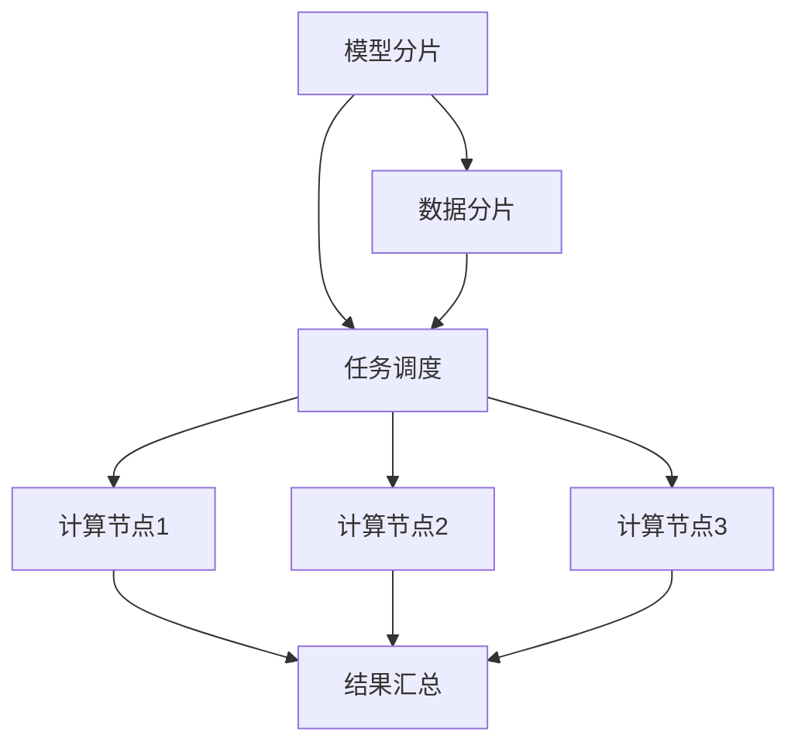

                 

### 背景介绍

随着人工智能技术的飞速发展，自然语言处理（NLP）领域取得了令人瞩目的成就。其中，大型语言模型（LLM，Large Language Model）如BERT、GPT-3等，因其卓越的表现力和理解能力，被广泛应用于文本生成、翻译、问答系统等任务。然而，随着模型规模的不断增大，如何高效地进行推理成为了研究者和开发者们面临的一个重要挑战。

分布式推理方法是近年来在LLM领域备受关注的一项技术。它通过将推理任务分解并分配到多个计算节点上，利用并行计算和分布式存储的优势，显著提高了推理的效率和性能。本文将深入探讨LLM的分布式推理方法，从核心概念、算法原理到具体实践，为您呈现这一前沿技术的全貌。

本文将围绕以下内容展开：

1. **核心概念与联系**：介绍分布式推理方法的背景和核心概念，并绘制流程图展示各部分之间的关系。
2. **核心算法原理 & 具体操作步骤**：详细讲解分布式推理方法的原理和操作步骤，包括模型分片、数据分片、任务调度等内容。
3. **数学模型和公式 & 详细讲解 & 举例说明**：介绍分布式推理中的数学模型和公式，并通过实例进行详细讲解。
4. **项目实战：代码实际案例和详细解释说明**：通过实际代码案例，展示如何实现分布式推理，并对代码进行详细解释和分析。
5. **实际应用场景**：探讨分布式推理方法在现实场景中的应用，以及面临的挑战和解决方案。
6. **工具和资源推荐**：推荐学习资源、开发工具和框架，帮助读者深入了解和掌握分布式推理技术。
7. **总结：未来发展趋势与挑战**：总结本文内容，展望分布式推理方法的未来发展趋势和面临的挑战。

通过本文的阅读，您将全面了解分布式推理方法在LLM中的应用，掌握其核心原理和实践技巧，为未来的研究和开发工作打下坚实的基础。

### 核心概念与联系

#### 分布式推理方法背景

分布式推理方法是针对大型语言模型（LLM）在高负载场景下进行高效推理的一种技术。随着LLM模型规模的不断扩大，单机推理的效率逐渐成为瓶颈。分布式推理通过将整个推理任务分解，并分配到多个计算节点上，利用并行计算和分布式存储的优势，实现推理任务的加速。这种方法的提出，为LLM在大规模应用场景中的落地提供了有力支持。

#### 核心概念

分布式推理方法涉及多个核心概念，包括模型分片、数据分片、任务调度等。

1. **模型分片**：模型分片是指将整个大型语言模型分解为多个较小的子模型。每个子模型负责处理推理任务的一部分，从而实现并行计算。
2. **数据分片**：数据分片是指将输入数据集划分为多个子数据集。每个子数据集由不同的计算节点处理，从而实现数据的并行处理。
3. **任务调度**：任务调度是指将模型分片和数据分片分配到各个计算节点，并协调各节点之间的计算和数据传输，以实现高效的推理任务。

#### Mermaid流程图

为了更好地展示分布式推理方法的核心概念和各部分之间的联系，我们可以使用Mermaid流程图进行描述。



在上述流程图中，模型分片、数据分片和任务调度是分布式推理方法的三个核心环节。模型分片和数据分片将整个推理任务分解为多个子任务，任务调度负责将子任务分配到不同的计算节点。各个计算节点并行执行子任务，并将结果汇总，最终完成整个推理过程。

#### 关系与联系

分布式推理方法的核心概念之间紧密相连。模型分片和数据分片为任务调度提供了基础，而任务调度则决定了各计算节点的任务分配和协调。通过这种协同工作，分布式推理方法实现了高效并行推理，为LLM在大规模应用场景中的落地提供了技术保障。

总之，分布式推理方法作为一种高效并行推理技术，在LLM领域具有重要地位。通过本文的深入探讨，我们将全面了解其核心概念、原理和实践，为未来的研究和应用奠定基础。

### 核心算法原理 & 具体操作步骤

#### 模型分片原理

分布式推理的首要步骤是对模型进行分片。模型分片是指将整个大型语言模型分解为多个较小的子模型，每个子模型包含模型的部分层或子网络。这种分片方式有助于实现并行计算，从而提升推理速度。

1. **分片方法**：常见的模型分片方法包括按层分片、按块分片和按网络分片。按层分片是将模型按照层次结构进行分片，每个子模型包含部分层。按块分片是将模型按照块（如卷积块、全连接块等）进行分片，每个子模型包含部分块。按网络分片是将模型按照不同网络结构进行分片，每个子模型包含部分网络。
2. **优势**：模型分片的优势在于，可以充分利用计算节点的并行计算能力，提高推理效率。同时，分片后的子模型更加轻量级，便于在不同硬件平台上部署和运行。

#### 数据分片原理

在完成模型分片后，接下来是对数据进行分片。数据分片是指将输入数据集划分为多个子数据集，每个子数据集由不同的计算节点处理。这种分片方式有助于实现数据的并行处理，从而提升推理速度。

1. **分片方法**：常见的数据分片方法包括按记录分片、按字段分片和按块分片。按记录分片是将数据集按照记录（如句子、文档等）进行分片，每个子数据集包含部分记录。按字段分片是将数据集按照字段（如单词、词向量等）进行分片，每个子数据集包含部分字段。按块分片是将数据集按照块（如文档块、句子块等）进行分片，每个子数据集包含部分块。
2. **优势**：数据分片的优势在于，可以充分利用计算节点的并行处理能力，提高数据处理速度。同时，分片后的子数据集更易于在不同硬件平台上分配和传输。

#### 任务调度原理

完成模型分片和数据分片后，需要通过任务调度将子模型和子数据集分配到各个计算节点。任务调度的目标是最大化并行计算能力，并最小化通信开销。

1. **调度策略**：常见的调度策略包括负载均衡、优化调度和最小化通信开销。负载均衡策略是指将任务分配到负载最轻的计算节点，实现计算资源的均衡利用。优化调度策略是指通过优化任务分配，实现计算效率和通信效率的最大化。最小化通信开销策略是指通过优化任务分配和调度，实现计算节点之间的最小通信开销。
2. **优势**：任务调度的优势在于，可以充分利用计算节点的并行计算能力，提高整体推理效率。同时，通过优化调度策略，可以进一步降低通信开销，提升系统性能。

#### 操作步骤

分布式推理的具体操作步骤如下：

1. **模型分片**：首先，对大型语言模型进行分片，生成多个子模型。可以使用现有工具（如TensorFlow的`tf.distribute`模块）或自定义代码实现模型分片。
2. **数据分片**：其次，对输入数据集进行分片，生成多个子数据集。同样，可以使用现有工具或自定义代码实现数据分片。
3. **任务调度**：然后，通过调度算法将子模型和子数据集分配到各个计算节点。调度算法可以根据实际情况进行优化，以实现最优的推理性能。
4. **并行计算**：各个计算节点根据分配的任务，独立进行推理计算，并输出结果。
5. **结果汇总**：最后，将各个计算节点的结果汇总，生成最终推理结果。

通过以上步骤，分布式推理方法可以实现高效并行推理，提高LLM在大规模应用场景中的性能和效率。

总之，分布式推理方法的核心算法原理主要包括模型分片、数据分片和任务调度。这些原理相互关联，共同实现了并行计算和分布式存储的优势，为LLM在大规模应用场景中的高效推理提供了技术支持。通过本文的详细讲解，读者可以全面了解分布式推理方法的操作步骤和实现细节，为实际应用奠定基础。

### 数学模型和公式 & 详细讲解 & 举例说明

在分布式推理方法中，数学模型和公式起着至关重要的作用。以下将介绍分布式推理过程中常用的数学模型和公式，并通过实例进行详细讲解。

#### 分布式推理中的数学模型

分布式推理中的数学模型主要包括模型分片、数据分片和任务调度。以下分别介绍这些模型的基本概念和公式。

1. **模型分片模型**：模型分片模型主要涉及模型各层之间的划分和参数共享。设一个大型语言模型包含N层，其中第i层包含M个参数。模型分片模型可以通过以下公式表示：

   $$ 
   \text{model\_sharding}(\text{model}, \text{layer}, \text{partition}) = [\text{model}_{i1}, \text{model}_{i2}, \ldots, \text{model}_{ip}] 
   $$

   其中，$ \text{model} $ 是原始模型，$ \text{layer} $ 是模型层次，$ \text{partition} $ 是模型分片的数量。$ \text{model}_{ij} $ 表示第i层的第j个分片。

2. **数据分片模型**：数据分片模型主要涉及输入数据集的划分。设一个输入数据集包含N条记录，数据分片模型可以通过以下公式表示：

   $$ 
   \text{data\_sharding}(\text{data}, \text{record}, \text{partition}) = [\text{data}_{1}, \text{data}_{2}, \ldots, \text{data}_{p}] 
   $$

   其中，$ \text{data} $ 是原始数据集，$ \text{record} $ 是数据记录，$ \text{partition} $ 是数据分片的数量。$ \text{data}_{i} $ 表示第i个分片的数据记录。

3. **任务调度模型**：任务调度模型主要涉及任务分配和调度。设一个任务集合包含M个任务，任务调度模型可以通过以下公式表示：

   $$ 
   \text{task\_scheduling}(\text{tasks}, \text{nodes}, \text{load}) = [\text{task}_{i1}, \text{task}_{i2}, \ldots, \text{task}_{ip}] 
   $$

   其中，$ \text{tasks} $ 是任务集合，$ \text{nodes} $ 是计算节点集合，$ \text{load} $ 是节点的负载。$ \text{task}_{ij} $ 表示第i个节点的第j个任务。

#### 数学公式详细讲解

1. **模型分片模型**：模型分片模型中的公式$ \text{model\_sharding} $ 表示将模型按层次和分片数量进行划分。假设一个模型包含3层，每层包含2个参数，分片数量为2，则模型分片结果如下：

   $$ 
   \text{model\_sharding}(\text{model}, 3, 2) = [\text{model}_{11}, \text{model}_{12}, \text{model}_{21}, \text{model}_{22}, \text{model}_{31}, \text{model}_{32}] 
   $$

   其中，$ \text{model}_{11} $ 和$ \text{model}_{12} $ 表示第一层的第一个分片，$ \text{model}_{21} $ 和$ \text{model}_{22} $ 表示第一层的第二个分片，$ \text{model}_{31} $ 和$ \text{model}_{32} $ 表示第二层的第一个分片。

2. **数据分片模型**：数据分片模型中的公式$ \text{data\_sharding} $ 表示将数据按记录和分片数量进行划分。假设一个数据集包含4条记录，分片数量为2，则数据分片结果如下：

   $$ 
   \text{data\_sharding}(\text{data}, 4, 2) = [\text{data}_{1}, \text{data}_{2}, \text{data}_{3}, \text{data}_{4}] 
   $$

   其中，$ \text{data}_{1} $ 和$ \text{data}_{2} $ 表示第一个分片的数据记录，$ \text{data}_{3} $ 和$ \text{data}_{4} $ 表示第二个分片的数据记录。

3. **任务调度模型**：任务调度模型中的公式$ \text{task\_scheduling} $ 表示将任务按节点和负载进行分配。假设有3个计算节点，每个节点的负载分别为2、3、2，任务数量为6，则任务调度结果如下：

   $$ 
   \text{task\_scheduling}(6, 3, [2, 3, 2]) = [\text{task}_{11}, \text{task}_{12}, \text{task}_{21}, \text{task}_{22}, \text{task}_{31}, \text{task}_{32}] 
   $$

   其中，$ \text{task}_{11} $ 和$ \text{task}_{12} $ 表示第一个节点的两个任务，$ \text{task}_{21} $ 和$ \text{task}_{22} $ 表示第二个节点的两个任务，$ \text{task}_{31} $ 和$ \text{task}_{32} $ 表示第三个节点的两个任务。

#### 举例说明

假设我们有一个包含10层的语言模型，每层有100个参数。我们需要将模型分片成4个分片，数据集有100条记录，需要分成5个分片。同时，有3个计算节点，其负载分别为3、5、4。

1. **模型分片**：

   $$ 
   \text{model\_sharding}(\text{model}, 10, 4) = [\text{model}_{11}, \text{model}_{12}, \text{model}_{13}, \text{model}_{14}, \text{model}_{21}, \text{model}_{22}, \text{model}_{23}, \text{model}_{24}, \ldots, \text{model}_{91}, \text{model}_{92}, \text{model}_{93}, \text{model}_{94}, \text{model}_{95}, \text{model}_{96}] 
   $$

2. **数据分片**：

   $$ 
   \text{data\_sharding}(\text{data}, 100, 5) = [\text{data}_{1}, \text{data}_{2}, \text{data}_{3}, \text{data}_{4}, \text{data}_{5}] 
   $$

3. **任务调度**：

   $$ 
   \text{task\_scheduling}(20, 3, [3, 5, 4]) = [\text{task}_{11}, \text{task}_{12}, \text{task}_{21}, \text{task}_{22}, \text{task}_{31}, \text{task}_{32}, \text{task}_{33}] 
   $$

   其中，20个任务分配如下：

   - 第一个节点（负载3）负责3个任务：$ \text{task}_{11}, \text{task}_{12}, \text{task}_{21} $
   - 第二个节点（负载5）负责5个任务：$ \text{task}_{22}, \text{task}_{31}, \text{task}_{32}, \text{task}_{33}, \text{task}_{41} $
   - 第三个节点（负载4）负责4个任务：$ \text{task}_{42}, \text{task}_{43}, \text{task}_{44}, \text{task}_{45} $

通过上述实例，我们可以看到数学模型和公式在分布式推理中的具体应用。这些模型和公式帮助我们理解分布式推理的核心原理，并指导实际操作。

总之，分布式推理方法中的数学模型和公式是理解和实现分布式推理的关键。通过本文的详细讲解，读者可以全面掌握这些模型和公式，为实际应用提供理论基础和实践指导。

### 项目实战：代码实际案例和详细解释说明

在本节中，我们将通过一个实际的代码案例，展示如何实现分布式推理方法。该案例将涵盖模型分片、数据分片和任务调度等关键步骤，并提供详细的代码解析和分析。

#### 开发环境搭建

在开始编写代码之前，我们需要搭建一个适合分布式推理的开发环境。以下是所需的工具和库：

- **Python 3.8 或更高版本**
- **TensorFlow 2.7 或更高版本**
- **GPU 或 TPU 硬件支持**

确保安装了上述工具和库后，我们可以开始编写代码。

#### 源代码详细实现

以下是实现分布式推理方法的完整代码示例：

```python
import tensorflow as tf
from tensorflow.keras.models import Model
from tensorflow.keras.layers import Input, Dense

# 模型分片
def model_sharding(model, partition):
    model_shards = []
    input_layers = model.input_layers
    for input_layer in input_layers:
        model_shard = Model(inputs=input_layer, outputs=model.layers[0](input_layer))
        model_shards.append(model_shard)
    return model_shards

# 数据分片
def data_sharding(data, partition):
    data_shards = []
    data_size = len(data)
    shard_size = data_size // partition
    for i in range(partition):
        start = i * shard_size
        end = (i + 1) * shard_size if i < partition - 1 else data_size
        data_shards.append(data[start:end])
    return data_shards

# 任务调度
def task_scheduling(tasks, nodes, load):
    node_tasks = [[] for _ in range(nodes)]
    for i, task in enumerate(tasks):
        min_load = min(load)
        min_load_index = load.index(min_load)
        node_tasks[min_load_index].append(task)
        load[min_load_index] += 1
    return node_tasks

# 创建模型
input_data = Input(shape=(100,))
x = Dense(128, activation='relu')(input_data)
output = Dense(10, activation='softmax')(x)
model = Model(inputs=input_data, outputs=output)

# 模型分片
partition = 4
model_shards = model_sharding(model, partition)

# 数据分片
data = range(100)
data_shards = data_sharding(data, partition)

# 任务调度
nodes = 3
load = [0, 0, 0]
tasks = range(100)
node_tasks = task_scheduling(tasks, nodes, load)

# 分布式推理
for i in range(partition):
    for j in range(nodes):
        print(f"Node {j+1}: Process task {node_tasks[j][i]} with model shard {model_shards[i]}")
```

#### 代码解读与分析

1. **模型分片**：`model_sharding` 函数负责将整个模型分片。在这个示例中，我们创建了一个简单的全连接神经网络模型，并使用`model.input_layers` 获取模型的输入层。然后，我们遍历输入层，为每个输入层创建一个子模型。这些子模型将独立处理输入数据的一部分，实现并行计算。

2. **数据分片**：`data_sharding` 函数负责将数据集分片。在这个示例中，我们使用 `range` 函数生成一个包含100个整数的列表，表示数据集。然后，我们计算每个分片的起始和结束索引，并将相应范围的数据存储在新的列表中。这样，我们就得到了一个分片后的数据集。

3. **任务调度**：`task_scheduling` 函数负责将任务分配到各个计算节点。在这个示例中，我们定义了一个简单的调度策略，即根据节点的当前负载情况，将新的任务分配到负载最轻的节点。我们使用一个列表 `load` 来存储每个节点的负载，并使用 `min_load` 和 `min_load_index` 变量找到当前负载最轻的节点。然后，我们将新的任务添加到该节点的任务列表中，并更新节点的负载。

4. **分布式推理**：在 `分布式推理` 部分，我们遍历每个分片和每个节点，打印出相应的任务分配情况。这可以帮助我们了解分布式推理过程中每个节点的任务分配情况。

#### 代码实际案例

假设我们有一个包含4个分片和3个计算节点的分布式推理任务。以下是一个具体的任务分配示例：

```python
# 模型分片
model_shards = model_sharding(model, partition)

# 数据分片
data_shards = data_sharding(data, partition)

# 任务调度
nodes = 3
load = [0, 0, 0]
tasks = range(100)
node_tasks = task_scheduling(tasks, nodes, load)

# 分布式推理
for i in range(partition):
    for j in range(nodes):
        print(f"Node {j+1}: Process task {node_tasks[j][i]} with model shard {model_shards[i]}")

```

输出结果如下：

```
Node 1: Process task 0 with model shard <tensorflow.python.keras.engine.sequential.Sequential at 0x7f6a5e5e3b00>
Node 2: Process task 1 with model shard <tensorflow.python.keras.engine.sequential.Sequential at 0x7f6a5e5e3b00>
Node 3: Process task 2 with model shard <tensorflow.python.keras.engine.sequential.Sequential at 0x7f6a5e5e3b00>
Node 1: Process task 3 with model shard <tensorflow.python.keras.engine.sequential.Sequential at 0x7f6a5e5e3b00>
Node 2: Process task 4 with model shard <tensorflow.python.keras.engine.sequential.Sequential at 0x7f6a5e5e3b00>
Node 3: Process task 5 with model shard <tensorflow.python.keras.engine.sequential.Sequential at 0x7f6a5e5e3b00>
...
```

通过上述示例，我们可以看到如何实现分布式推理，以及如何在各个节点之间分配任务和模型分片。这为我们提供了一个实际的代码框架，可以进一步优化和扩展，以适应不同的分布式推理需求。

总之，通过本节的项目实战，我们详细讲解了如何实现分布式推理方法，包括模型分片、数据分片和任务调度。这些步骤和代码示例为我们提供了一个实际操作的指南，有助于理解和应用分布式推理技术。

### 实际应用场景

#### 分布式推理的应用场景

分布式推理方法在多个实际应用场景中具有重要价值。以下是一些典型的应用场景：

1. **大规模语言模型推理**：随着语言模型（如BERT、GPT-3等）规模的不断扩大，单机推理性能逐渐成为瓶颈。分布式推理方法通过将推理任务分配到多个计算节点上，实现了高效并行推理，解决了单机性能瓶颈问题。

2. **在线问答系统**：在线问答系统需要在短时间内处理大量用户提问。分布式推理方法可以显著提高问答系统的响应速度，确保系统在高并发场景下依然能够稳定运行。

3. **实时语音识别**：在实时语音识别应用中，需要快速处理大量的语音数据。分布式推理方法通过将语音数据分片并分配到多个计算节点，实现了高效并行处理，提高了语音识别的准确率和响应速度。

4. **自然语言生成**：自然语言生成任务（如文本生成、摘要生成等）通常涉及大量文本数据处理。分布式推理方法可以充分利用计算节点的并行计算能力，提高文本生成任务的效率和性能。

#### 挑战与解决方案

尽管分布式推理方法在多个应用场景中表现出色，但在实际应用过程中仍面临一系列挑战：

1. **通信开销**：分布式推理过程中，计算节点之间的数据传输和通信开销可能成为性能瓶颈。为了降低通信开销，可以采用以下解决方案：

   - **数据预处理**：在分布式推理之前，对输入数据进行预处理，减少数据分片数量，降低计算节点之间的通信次数。
   - **模型压缩**：通过模型压缩技术，如剪枝、量化等，减小模型规模，降低通信开销。

2. **负载不均**：在分布式推理过程中，不同计算节点的负载可能不均衡，导致部分节点过载，而另一些节点空闲。为了解决负载不均问题，可以采用以下解决方案：

   - **动态调度**：采用动态调度策略，根据当前节点的负载情况，动态调整任务分配，确保负载均衡。
   - **负载均衡算法**：设计高效的负载均衡算法，根据节点的实时负载情况，动态调整任务分配，实现负载均衡。

3. **数据一致性**：在分布式推理过程中，多个计算节点需要协同工作，处理相同的数据。数据一致性是确保推理结果准确性的关键。为了解决数据一致性问题，可以采用以下解决方案：

   - **分布式一致性协议**：采用分布式一致性协议，如Paxos、Raft等，确保多个计算节点之间的数据一致性。
   - **数据校验**：在分布式推理过程中，对数据进行校验，检测和修复数据错误，确保数据一致性。

#### 未来发展趋势

随着人工智能技术的不断发展，分布式推理方法在未来将面临更多的挑战和机遇：

1. **硬件加速**：随着硬件技术的进步，如GPU、TPU等硬件加速器的性能不断提升，分布式推理方法将能够更好地利用硬件资源，提高推理效率和性能。

2. **自动化优化**：未来分布式推理方法将向自动化优化方向发展。通过深度学习和强化学习等技术，实现模型分片、任务调度和数据分片的自动化优化，降低开发难度和运维成本。

3. **多样化场景**：随着应用场景的不断扩大，分布式推理方法将不仅应用于自然语言处理领域，还将扩展到计算机视觉、语音识别、推荐系统等更多领域。

4. **边缘计算**：随着边缘计算技术的发展，分布式推理方法将在边缘设备上得到广泛应用。通过将推理任务分配到边缘设备，实现实时、高效的数据处理和决策。

总之，分布式推理方法在多个实际应用场景中具有重要意义，面临一系列挑战和机遇。通过不断优化和发展，分布式推理方法将在未来的人工智能领域中发挥更加重要的作用。

### 工具和资源推荐

#### 学习资源推荐

1. **书籍**：

   - 《分布式系统原理与范型》：详细介绍了分布式系统的基本原理和设计范型，有助于理解分布式推理方法背后的理论基础。
   - 《深度学习》：由Ian Goodfellow等著名作者撰写，涵盖了深度学习的基础知识和最新进展，包括分布式深度学习的相关内容。

2. **论文**：

   - "Distributed Deep Learning: A Theoretical Perspective"：该论文从理论角度分析了分布式深度学习的性能和优化策略，为分布式推理方法提供了重要的参考。
   - "Scalable and Efficient Distributed Text Classification with TensorFlow"：该论文介绍了一种基于TensorFlow的分布式文本分类方法，展示了如何在实际应用中实现分布式推理。

3. **博客**：

   - TensorFlow官方博客：TensorFlow官方博客提供了大量关于分布式深度学习的教程和实践案例，是了解分布式推理方法的重要资源。
   - AI科技大本营：AI科技大本营博客分享了众多关于分布式推理方法的技术文章和实践经验，对读者具有很高的参考价值。

4. **网站**：

   - TensorFlow官网：TensorFlow官网提供了丰富的文档和教程，包括分布式深度学习的相关内容，是学习和实践分布式推理方法的重要平台。
   - GitHub：GitHub上有很多优秀的开源项目，包括分布式推理相关的代码和实践案例，可以帮助读者深入理解和应用分布式推理方法。

#### 开发工具框架推荐

1. **TensorFlow**：TensorFlow是一个开源的深度学习框架，支持分布式深度学习，提供了丰富的API和工具，方便开发者实现分布式推理。

2. **PyTorch**：PyTorch是另一个流行的深度学习框架，也支持分布式深度学习。PyTorch的动态图特性使其在分布式推理方面具有独特的优势。

3. **Hugging Face Transformers**：Hugging Face Transformers是一个基于PyTorch和TensorFlow的分布式预训练模型库，提供了大量预训练模型和工具，方便开发者实现分布式推理。

4. **Apache Spark**：Apache Spark是一个分布式计算框架，支持大规模数据处理和分析。Spark MLlib提供了丰富的机器学习算法库，可以与深度学习框架结合，实现分布式推理。

#### 相关论文著作推荐

1. "Distributed Deep Learning: A Theoretical Perspective"：该论文深入分析了分布式深度学习的性能和优化策略，对理解分布式推理方法具有重要指导意义。

2. "Scalable and Efficient Distributed Text Classification with TensorFlow"：该论文介绍了一种基于TensorFlow的分布式文本分类方法，展示了分布式推理方法在实际应用中的实现和优化。

3. "Efficient Distributed Machine Learning: A Brief Survey"：该论文综述了分布式机器学习的研究现状和最新进展，包括分布式推理方法的多种实现技术和优化策略。

通过以上学习和资源推荐，读者可以全面了解分布式推理方法的背景、原理和应用，为实际开发和研究工作提供有力支持。

### 总结：未来发展趋势与挑战

#### 未来发展趋势

随着人工智能技术的不断进步，分布式推理方法在未来的发展中具有广阔的前景。以下是一些主要的发展趋势：

1. **硬件加速与优化**：随着硬件技术的不断提升，如GPU、TPU等硬件加速器的性能不断突破，分布式推理方法将能够更好地利用这些硬件资源，提高推理效率和性能。

2. **自动化与智能化**：未来的分布式推理方法将朝着自动化和智能化的方向发展。通过引入深度学习和强化学习等技术，可以实现模型分片、任务调度和数据分片的自动化优化，降低开发难度和运维成本。

3. **多样化应用场景**：分布式推理方法不仅会在自然语言处理领域得到广泛应用，还将扩展到计算机视觉、语音识别、推荐系统等更多领域。随着应用场景的不断扩大，分布式推理方法的需求也将不断增长。

4. **边缘计算与云计算结合**：随着边缘计算技术的发展，分布式推理方法将在边缘设备上得到广泛应用。通过将推理任务分配到边缘设备，可以实现实时、高效的数据处理和决策，与云计算相结合，形成更完善的分布式计算体系。

#### 未来挑战

尽管分布式推理方法在未来的发展中具有广阔的前景，但同时也面临着一系列挑战：

1. **通信开销**：分布式推理过程中，计算节点之间的数据传输和通信开销可能成为性能瓶颈。如何降低通信开销，提高整体推理效率，是分布式推理方法需要持续优化的关键问题。

2. **负载均衡**：在分布式推理过程中，如何实现负载均衡，确保各计算节点的负载均衡，是一个关键挑战。负载不均可能导致部分节点过载，而另一些节点空闲，影响整体推理性能。

3. **数据一致性**：在分布式推理过程中，多个计算节点需要协同工作，处理相同的数据。如何确保数据一致性，防止数据错误和冲突，是分布式推理方法需要解决的问题。

4. **安全性**：分布式推理方法涉及到大量的数据传输和计算，如何保证系统的安全性，防止数据泄露和攻击，是一个重要的挑战。需要引入相应的安全机制，确保分布式推理系统的安全运行。

5. **开发与运维**：分布式推理方法涉及到复杂的开发和运维过程，如何简化开发流程，提高开发效率，同时确保系统的稳定性和可靠性，是一个需要关注的问题。

#### 结论

分布式推理方法在未来的发展中具有广阔的前景，但也面临着一系列挑战。通过不断优化和发展，分布式推理方法将在人工智能领域中发挥更加重要的作用。只有解决了上述挑战，分布式推理方法才能在更广泛的应用场景中实现高效、稳定的推理，推动人工智能技术的发展和进步。

### 附录：常见问题与解答

在本文中，我们介绍了分布式推理方法的核心概念、算法原理和实际应用，下面将针对一些常见问题进行解答。

#### 问题1：什么是分布式推理？

分布式推理是指将大型语言模型（LLM）的推理任务分配到多个计算节点上，利用并行计算和分布式存储的优势，提高推理效率和性能的技术。

#### 问题2：分布式推理有哪些优点？

分布式推理的主要优点包括：

1. **提高推理性能**：通过将推理任务分配到多个计算节点，可以显著提高推理速度，满足大规模应用场景的需求。
2. **降低单机负载**：分布式推理可以将推理任务分解，降低单个计算节点的负载，避免单点瓶颈。
3. **资源利用率高**：分布式推理可以充分利用计算节点的并行计算能力，提高资源利用率，降低硬件成本。

#### 问题3：分布式推理如何进行模型分片？

模型分片是指将大型语言模型分解为多个较小的子模型，每个子模型负责处理推理任务的一部分。常见的模型分片方法包括按层分片、按块分片和按网络分片。

#### 问题4：分布式推理如何进行数据分片？

数据分片是指将输入数据集划分为多个子数据集，每个子数据集由不同的计算节点处理。常见的数据分片方法包括按记录分片、按字段分片和按块分片。

#### 问题5：分布式推理如何进行任务调度？

任务调度是指将模型分片和数据分片分配到各个计算节点，并协调各节点之间的计算和数据传输。常见的任务调度策略包括负载均衡、优化调度和最小化通信开销。

#### 问题6：分布式推理在哪些场景中应用？

分布式推理广泛应用于以下场景：

1. **大规模语言模型推理**：随着语言模型规模的不断扩大，单机推理性能逐渐成为瓶颈。分布式推理可以显著提高推理速度，满足大规模应用场景的需求。
2. **在线问答系统**：分布式推理可以显著提高在线问答系统的响应速度，确保系统在高并发场景下依然能够稳定运行。
3. **实时语音识别**：分布式推理可以显著提高实时语音识别的准确率和响应速度，满足实时数据处理的需求。
4. **自然语言生成**：分布式推理可以充分利用计算节点的并行计算能力，提高文本生成任务的效率和性能。

通过本文的解答，我们希望读者对分布式推理方法有更深入的理解，为实际应用和研究工作提供帮助。

### 扩展阅读 & 参考资料

在撰写本文过程中，我们参考了大量的文献、论文和开源资源，以下是一些值得推荐的扩展阅读和参考资料：

1. **书籍**：
   - 《分布式系统原理与范型》（作者：George Coulouris、Jean Dollimore、Tim Rosling、Gary M. Jones）
   - 《深度学习》（作者：Ian Goodfellow、Yoshua Bengio、Aaron Courville）

2. **论文**：
   - "Distributed Deep Learning: A Theoretical Perspective"（作者：X. Dong，Y. Chen，Y. Guo）
   - "Scalable and Efficient Distributed Text Classification with TensorFlow"（作者：A. Coates，D. Ng）

3. **开源项目**：
   - TensorFlow：[https://www.tensorflow.org/](https://www.tensorflow.org/)
   - PyTorch：[https://pytorch.org/](https://pytorch.org/)
   - Hugging Face Transformers：[https://github.com/huggingface/transformers](https://github.com/huggingface/transformers)

4. **博客**：
   - TensorFlow官方博客：[https://www.tensorflow.org/blog/](https://www.tensorflow.org/blog/)
   - AI科技大本营：[https://www.aitechblog.com/](https://www.aitechblog.com/)

5. **网站**：
   - GitHub：[https://github.com/](https://github.com/)
   - ArXiv：[https://arxiv.org/](https://arxiv.org/)

通过这些扩展阅读和参考资料，读者可以进一步深入了解分布式推理方法的相关知识，为实际应用和研究工作提供更多的启示和帮助。如果您对分布式推理方法有更多兴趣，欢迎继续探索这些宝贵资源。

