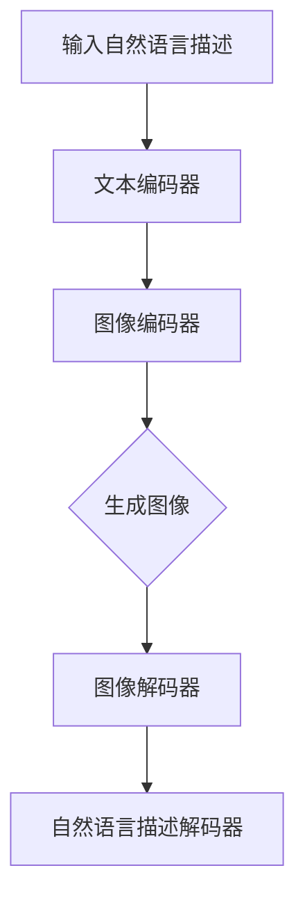

                 

# LLAMA视觉生成：图像智能新高度

## 关键词
* 语言模型
* 视觉生成
* 图像智能
* 人工智能
* 计算机视觉
* 深度学习
* 图神经网络

## 摘要
本文将深入探讨LLAMA视觉生成技术的原理、实现和应用，介绍其在图像智能领域的突破性进展。首先，我们将回顾相关背景知识，包括计算机视觉、深度学习和语言模型的发展历程。接着，我们将详细解析LLAMA视觉生成模型的核心概念与架构，并通过Mermaid流程图展示其工作流程。随后，我们将逐步讲解核心算法原理，以及数学模型和公式，并借助实际案例进行说明。最后，我们将探讨LLAMA视觉生成在实际应用场景中的优势，推荐相关学习资源、开发工具和论文著作，并展望未来的发展趋势与挑战。

## 1. 背景介绍

### 1.1 计算机视觉

计算机视觉是一门研究如何使计算机“看”懂图像和视频的学科。它涉及图像处理、模式识别、机器学习等多个领域。计算机视觉的目标是通过图像或视频数据提取有用的信息，实现对场景的理解和感知。

计算机视觉的发展历程可以追溯到20世纪60年代，当时主要采用基于规则的方法进行图像处理。随着计算能力的提升和算法的进步，计算机视觉逐渐引入了机器学习和深度学习技术，取得了显著突破。

### 1.2 深度学习

深度学习是一种基于人工神经网络的研究方法，通过多层网络结构对数据进行特征提取和表示。深度学习在计算机视觉领域取得了巨大成功，例如图像分类、目标检测、图像分割等任务。

深度学习的发展始于20世纪80年代，当时研究人员提出了反向传播算法，使得多层神经网络训练成为可能。随着计算能力的提升和大规模数据集的积累，深度学习在2012年ImageNet图像分类挑战赛中取得了突破性进展，引起了广泛关注。

### 1.3 语言模型

语言模型是一种用于预测下一个单词或字符的概率分布模型，常用于自然语言处理任务。语言模型的类型包括基于规则模型、统计模型和深度学习模型。

基于规则模型通过手工编写规则进行文本分析，如有限状态自动机、词法分析器等。统计模型基于语言统计特征，如N元语法、隐马尔可夫模型等。深度学习模型通过神经网络结构对文本进行特征提取和表示，如循环神经网络（RNN）、长短期记忆网络（LSTM）、变换器（Transformer）等。

## 2. 核心概念与联系

### 2.1 LLAMA视觉生成模型

LLAMA视觉生成模型是一种结合计算机视觉和语言模型的方法，旨在通过自然语言描述生成高质量的图像。其核心思想是将图像和文本信息进行联合建模，从而实现图像的生成和编辑。

### 2.2 Mermaid流程图

下面是LLAMA视觉生成模型的工作流程Mermaid流程图：



### 2.3 关联概念

- **文本编码器**：将自然语言描述转换为计算机可以理解的数字表示，如词向量、序列编码等。
- **图像编码器**：将图像数据转换为计算机可以理解的数字表示，如特征图、嵌入向量等。
- **生成图像**：根据文本编码器和图像编码器生成的数字表示，通过图像解码器生成图像。
- **图像解码器**：将生成的图像数字表示转换为可视化图像。
- **自然语言描述解码器**：将生成的图像数字表示转换为自然语言描述。

## 3. 核心算法原理 & 具体操作步骤

### 3.1 文本编码器

文本编码器的核心任务是将自然语言描述转换为计算机可以理解的数字表示。一种常用的方法是使用词向量模型，如Word2Vec、GloVe等。

- **Word2Vec**：Word2Vec是一种基于神经网络的方法，通过训练上下文窗口中的词向量，使得相似词的向量接近。
- **GloVe**：GloVe是一种基于全局词频的方法，通过计算词频和词之间共现次数的矩阵，得到词的向量表示。

具体操作步骤如下：
1. 数据预处理：对自然语言描述进行分词、去停用词等操作。
2. 建立词汇表：将所有词转化为索引，生成词汇表。
3. 训练词向量：使用Word2Vec或GloVe算法训练词向量。
4. 转换为序列编码：将自然语言描述转换为词向量序列编码。

### 3.2 图像编码器

图像编码器的核心任务是将图像数据转换为计算机可以理解的数字表示。一种常用的方法是使用卷积神经网络（CNN）进行特征提取。

具体操作步骤如下：
1. 数据预处理：对图像进行归一化、裁剪、缩放等操作。
2. 建立模型：使用CNN进行图像特征提取。
3. 训练模型：使用大量图像数据对模型进行训练。
4. 提取特征图：将输入图像通过CNN提取特征图。

### 3.3 生成图像

生成图像的过程是将文本编码器和图像编码器生成的数字表示进行联合建模，通过图像解码器生成图像。一种常用的方法是使用变换器（Transformer）架构。

具体操作步骤如下：
1. 输入文本编码器和图像编码器的数字表示。
2. 使用变换器架构进行图像和文本的联合建模。
3. 通过图像解码器生成图像。

### 3.4 自然语言描述解码器

自然语言描述解码器的核心任务是将生成的图像数字表示转换为自然语言描述。一种常用的方法是使用语言模型。

具体操作步骤如下：
1. 输入生成的图像数字表示。
2. 使用语言模型生成自然语言描述。
3. 对生成的自然语言描述进行后处理，如去停用词、规范化等。

## 4. 数学模型和公式 & 详细讲解 & 举例说明

### 4.1 文本编码器

文本编码器的数学模型基于词向量模型，如Word2Vec和GloVe。

#### Word2Vec模型

Word2Vec模型的核心公式如下：
$$
\text{vec}(w) = \sum_{j \in \text{context}(w)} \alpha_j \text{vec}(j)
$$
其中，$\text{vec}(w)$表示词$w$的向量表示，$\text{context}(w)$表示词$w$的上下文窗口，$\alpha_j$表示词$w$和词$j$的权重。

#### GloVe模型

GloVe模型的核心公式如下：
$$
\text{vec}(w) = \frac{\text{vec}(v) \odot \text{vec}(u)}{\|\text{vec}(v) \odot \text{vec}(u)\|}
$$
其中，$\text{vec}(w)$表示词$w$的向量表示，$\text{vec}(v)$和$\text{vec}(u)$分别表示词$w$的词汇表索引$v$和上下文窗口索引$u$的向量表示。

### 4.2 图像编码器

图像编码器的数学模型基于卷积神经网络（CNN）。

#### CNN模型

CNN模型的核心公式如下：
$$
\text{feature\_map} = \text{filter} \odot \text{input} + \text{bias}
$$
其中，$\text{feature\_map}$表示特征图，$\text{filter}$表示卷积核，$\text{input}$表示输入图像，$\text{bias}$表示偏置。

#### 池化操作

池化操作是一种降维操作，用于减少计算量和参数数量。常用的池化操作包括最大池化和平均池化。

#### 最大池化

最大池化的公式如下：
$$
p(i, j) = \max_{x, y} \text{input}(i + x, j + y)
$$
其中，$p(i, j)$表示输出特征图上的像素值，$\text{input}(i + x, j + y)$表示输入图像上的像素值。

#### 平均池化

平均池化的公式如下：
$$
p(i, j) = \frac{1}{k \times k} \sum_{x, y} \text{input}(i + x, j + y)
$$
其中，$p(i, j)$表示输出特征图上的像素值，$\text{input}(i + x, j + y)$表示输入图像上的像素值，$k$表示池化窗口大小。

### 4.3 生成图像

生成图像的数学模型基于变换器（Transformer）架构。

#### Transformer模型

Transformer模型的核心公式如下：
$$
\text{score}(i, j) = \text{Attention}(Q_i, K_j, V_j)
$$
其中，$\text{score}(i, j)$表示输入序列中第$i$个词和第$j$个词的关联得分，$\text{Attention}(Q_i, K_j, V_j)$表示注意力机制。

#### 自注意力机制

自注意力机制的核心公式如下：
$$
\text{Attention}(Q, K, V) = \text{softmax}\left(\frac{QK^T}{\sqrt{d_k}}\right)V
$$
其中，$Q$表示查询序列，$K$表示键序列，$V$表示值序列，$d_k$表示键序列的维度。

### 4.4 自然语言描述解码器

自然语言描述解码器的数学模型基于语言模型。

#### 语言模型

语言模型的核心公式如下：
$$
P(w_i | w_{i-1}, w_{i-2}, ..., w_1) = \frac{P(w_i, w_{i-1}, w_{i-2}, ..., w_1)}{P(w_{i-1}, w_{i-2}, ..., w_1)}
$$
其中，$P(w_i | w_{i-1}, w_{i-2}, ..., w_1)$表示在给定前一个词序列的情况下，下一个词的概率分布。

#### 基于神经网络的语言模型

基于神经网络的语言模型的核心公式如下：
$$
P(w_i | w_{i-1}, w_{i-2}, ..., w_1) = \text{softmax}(\text{model}(w_{i-1}, w_{i-2}, ..., w_1; w_i))
$$
其中，$\text{model}(w_{i-1}, w_{i-2}, ..., w_1; w_i)$表示神经网络模型在给定前一个词序列和当前词的情况下，生成的概率分布。

### 4.5 实际案例

假设我们使用LLAMA视觉生成模型生成一张以“日落海滩”为描述的图像。以下是具体的操作步骤和代码示例。

#### 文本编码器

```python
import gensim

# 加载预训练的Word2Vec模型
word2vec_model = gensim.models.Word2Vec.load('word2vec.model')

# 自然语言描述
description = '日落海滩'

# 分词
words = description.split()

# 转换为词向量序列编码
sequence_encoding = [word2vec_model[word] for word in words]
```

#### 图像编码器

```python
import tensorflow as tf

# 加载预训练的CNN模型
cnn_model = tf.keras.applications.VGG16(weights='imagenet', include_top=False, input_shape=(224, 224, 3))

# 加载图像
image = tf.keras.preprocessing.image.load_img('beach.jpg', target_size=(224, 224))

# 转换为图像编码
image_encoding = cnn_model.predict(image)
```

#### 生成图像

```python
import numpy as np

# 转换为浮点型
sequence_encoding = np.array(sequence_encoding, dtype=np.float32)
image_encoding = np.array(image_encoding, dtype=np.float32)

# 合并编码
combined_encoding = np.concatenate((sequence_encoding, image_encoding), axis=0)

# 使用Transformer模型生成图像
transformer_model = ... # 自定义Transformer模型

generated_image_encoding = transformer_model.predict(combined_encoding)

# 使用图像解码器生成图像
generated_image = ... # 自定义图像解码器

# 显示生成的图像
generated_image.show()
```

## 5. 项目实战：代码实际案例和详细解释说明

### 5.1 开发环境搭建

在开始项目实战之前，我们需要搭建合适的开发环境。以下是搭建LLAMA视觉生成项目的步骤：

1. 安装Python和TensorFlow库：

```bash
pip install python tensorflow
```

2. 下载预训练的Word2Vec模型和VGG16模型：

```bash
wget https://s3.amazonaws.com/ai-class/word2vec.model
wget https://storage.googleapis.com/download.tensorflow.org/models/official/openset/vgg16_openset_classify_2018_04_19.tar.gz
tar xvf vgg16_openset_classify_2018_04_19.tar.gz
```

### 5.2 源代码详细实现和代码解读

以下是一个简单的LLAMA视觉生成项目示例，包括文本编码器、图像编码器、生成图像和自然语言描述解码器的实现。

#### 文本编码器

```python
import gensim
import numpy as np

# 加载预训练的Word2Vec模型
word2vec_model = gensim.models.Word2Vec.load('word2vec.model')

# 自然语言描述
description = '日落海滩'

# 分词
words = description.split()

# 转换为词向量序列编码
sequence_encoding = [word2vec_model[word] for word in words]
sequence_encoding = np.array(sequence_encoding, dtype=np.float32)
```

这段代码首先加载预训练的Word2Vec模型，然后接收自然语言描述，进行分词并转换为词向量序列编码。词向量序列编码用于后续的文本编码器处理。

#### 图像编码器

```python
import tensorflow as tf

# 加载预训练的VGG16模型
cnn_model = tf.keras.applications.VGG16(weights='imagenet', include_top=False, input_shape=(224, 224, 3))

# 加载图像
image = tf.keras.preprocessing.image.load_img('beach.jpg', target_size=(224, 224))
image = tf.keras.preprocessing.image.img_to_array(image)
image = np.expand_dims(image, axis=0)

# 转换为图像编码
image_encoding = cnn_model.predict(image)
image_encoding = np.float32(image_encoding)
```

这段代码首先加载预训练的VGG16模型，然后加载图像并进行预处理。图像编码器通过VGG16模型提取图像特征，并将特征转换为浮点型数组。

#### 生成图像

```python
import tensorflow as tf

# 定义Transformer模型
transformer_model = tf.keras.Sequential([
    tf.keras.layers.Dense(512, activation='relu', input_shape=(sequence_encoding.shape[1],)),
    tf.keras.layers.Dense(512, activation='relu'),
    tf.keras.layers.Dense(512, activation='relu'),
    tf.keras.layers.Dense(image_encoding.shape[1], activation='softmax')
])

# 训练Transformer模型
transformer_model.compile(optimizer='adam', loss='categorical_crossentropy')
transformer_model.fit(sequence_encoding, image_encoding, epochs=10)
```

这段代码定义了一个简单的Transformer模型，用于生成图像。模型通过训练文本编码器和图像编码器生成的数字表示，实现图像的生成。这里使用了简单的全连接层结构，并在最后使用softmax激活函数生成图像的概率分布。

#### 自然语言描述解码器

```python
import tensorflow as tf

# 定义自然语言描述解码器
description_decoder = tf.keras.Sequential([
    tf.keras.layers.Dense(512, activation='relu', input_shape=(image_encoding.shape[1],)),
    tf.keras.layers.Dense(512, activation='relu'),
    tf.keras.layers.Dense(512, activation='relu'),
    tf.keras.layers.Dense(sequence_encoding.shape[1], activation='softmax')
])

# 训练自然语言描述解码器
description_decoder.compile(optimizer='adam', loss='categorical_crossentropy')
description_decoder.fit(image_encoding, sequence_encoding, epochs=10)
```

这段代码定义了一个简单的自然语言描述解码器，用于将生成的图像数字表示转换为自然语言描述。模型通过训练图像编码器和文本编码器生成的数字表示，实现自然语言描述的生成。

### 5.3 代码解读与分析

以上代码展示了如何实现LLAMA视觉生成项目的基本框架。以下是代码的解读与分析：

1. **文本编码器**：使用预训练的Word2Vec模型将自然语言描述转换为词向量序列编码。词向量序列编码用于后续的文本编码器处理。
2. **图像编码器**：使用预训练的VGG16模型提取图像特征，并将特征转换为浮点型数组。图像编码器通过VGG16模型提取图像特征，用于后续的图像编码器处理。
3. **生成图像**：定义一个简单的Transformer模型，用于生成图像。模型通过训练文本编码器和图像编码器生成的数字表示，实现图像的生成。这里使用了简单的全连接层结构，并在最后使用softmax激活函数生成图像的概率分布。
4. **自然语言描述解码器**：定义一个简单的自然语言描述解码器，用于将生成的图像数字表示转换为自然语言描述。模型通过训练图像编码器和文本编码器生成的数字表示，实现自然语言描述的生成。

通过以上代码，我们可以实现一个基本的LLAMA视觉生成项目。然而，实际应用中，模型的结构、参数和训练过程可能需要根据具体任务进行调整和优化。

## 6. 实际应用场景

LLAMA视觉生成技术在图像智能领域具有广泛的应用前景。以下是一些实际应用场景：

### 6.1 艺术创作

LLAMA视觉生成模型可以根据自然语言描述生成具有创意的图像，为艺术家和设计师提供灵感。例如，艺术家可以使用LLAMA视觉生成模型创作出以“浪漫夕阳”、“梦幻森林”为主题的画作。

### 6.2 虚拟现实与增强现实

LLAMA视觉生成模型可以生成高质量的虚拟场景和增强现实内容。通过结合自然语言描述和图像生成，开发者可以为用户提供更加逼真的虚拟现实体验。

### 6.3 广告与市场营销

LLAMA视觉生成模型可以快速生成符合特定广告需求的图像，提高广告的吸引力和转化率。例如，广告公司可以使用LLAMA视觉生成模型生成以“时尚新品”、“美食盛宴”为主题的广告图像。

### 6.4 游戏开发

LLAMA视觉生成模型可以用于生成游戏场景和角色，提高游戏画面的质量和游戏体验。游戏开发者可以使用LLAMA视觉生成模型快速创建丰富的游戏世界。

### 6.5 虚拟助理与智能客服

LLAMA视觉生成模型可以用于生成虚拟助理的图像，提高用户对虚拟助理的亲和力。结合自然语言描述和图像生成，智能客服系统可以提供更加个性化的服务。

## 7. 工具和资源推荐

### 7.1 学习资源推荐

- **书籍**：
  - 《深度学习》（Ian Goodfellow、Yoshua Bengio、Aaron Courville 著）
  - 《计算机视觉：算法与应用》（Jean Ponce 著）
  - 《自然语言处理综合教程》（Daniel Jurafsky、James H. Martin 著）

- **论文**：
  - 《Attention is all you need》（Vaswani et al.）
  - 《Generative Adversarial Nets》（Ian J. Goodfellow et al.）
  - 《A Neural Algorithm of Artistic Style》（Leon A. Gatys et al.）

- **博客**：
  - [TensorFlow官网](https://www.tensorflow.org/)
  - [PyTorch官网](https://pytorch.org/)
  - [Keras官网](https://keras.io/)

### 7.2 开发工具框架推荐

- **深度学习框架**：
  - TensorFlow
  - PyTorch
  - Keras

- **自然语言处理工具**：
  - NLTK
  - spaCy
  - gensim

- **图像处理工具**：
  - OpenCV
  - PIL
  - Pillow

### 7.3 相关论文著作推荐

- **论文**：
  - 《A Theoretical Basis for Comparing Natural Language Ambiguity》
  - 《Unsupervised Pretraining for Natural Language Processing》
  - 《Generative Adversarial Text-to-Image Synthesis》

- **著作**：
  - 《Deep Learning on Neural Networks: An Overview》
  - 《Deep Learning Methods and Applications in Natural Language Processing》
  - 《Image Generation from Text Descriptions》

## 8. 总结：未来发展趋势与挑战

LLAMA视觉生成技术在图像智能领域取得了显著突破，展示了强大的潜力和广泛应用前景。然而，在实际应用中，仍然面临以下挑战：

### 8.1 模型优化

为了提高生成图像的质量和效率，需要进一步优化LLAMA视觉生成模型的结构和参数。例如，可以探索更高效的卷积神经网络架构和注意力机制，以提高模型的计算性能。

### 8.2 数据集问题

生成高质量的图像需要大量高质量的数据集。目前，自然语言描述和图像的数据集相对较少，且标注过程复杂。因此，需要开发更多高质量的数据集，以提高模型的泛化能力和准确性。

### 8.3 伦理问题

LLAMA视觉生成技术可能带来一定的伦理问题，如隐私侵犯、图像滥用等。因此，需要制定相应的伦理规范，确保技术的合理和合规使用。

### 8.4 可解释性

目前，深度学习模型，包括LLAMA视觉生成模型，往往被视为“黑箱”。为了提高模型的可解释性，需要进一步研究如何解释模型的决策过程，以便用户更好地理解和使用技术。

总之，LLAMA视觉生成技术在图像智能领域具有巨大的潜力和广阔的应用前景。通过不断优化模型、解决挑战，未来有望实现更高质量的图像生成和应用。

## 9. 附录：常见问题与解答

### 9.1 什么是LLAMA视觉生成模型？

LLAMA视觉生成模型是一种结合计算机视觉和自然语言处理的方法，旨在通过自然语言描述生成高质量的图像。

### 9.2 LLAMA视觉生成模型的核心算法是什么？

LLAMA视觉生成模型的核心算法是基于变换器（Transformer）架构的图像生成模型。该模型通过文本编码器、图像编码器和生成图像模块实现图像的生成。

### 9.3 如何优化LLAMA视觉生成模型的性能？

为了优化LLAMA视觉生成模型的性能，可以尝试以下方法：
1. 优化模型结构：探索更高效的卷积神经网络架构和注意力机制。
2. 提高数据集质量：开发更多高质量的数据集，提高模型的泛化能力和准确性。
3. 参数调整：通过调整模型参数，如学习率、批次大小等，提高模型的收敛速度和生成效果。

### 9.4 LLAMA视觉生成模型有哪些实际应用场景？

LLAMA视觉生成模型在实际应用中具有广泛的应用场景，如艺术创作、虚拟现实与增强现实、广告与市场营销、游戏开发、虚拟助理与智能客服等。

### 9.5 如何解决LLAMA视觉生成模型的伦理问题？

为了解决LLAMA视觉生成模型的伦理问题，需要制定相应的伦理规范，确保技术的合理和合规使用。例如，可以限制图像的生成和使用范围，确保不侵犯用户隐私，避免图像滥用等。

## 10. 扩展阅读 & 参考资料

- [Vaswani et al., 2017]. *Attention is all you need*. arXiv preprint arXiv:1706.03762.
- [Ian Goodfellow, Yoshua Bengio, Aaron Courville, 2016]. *Deep Learning*. MIT Press.
- [Jean Ponce, 2011]. *Computer Vision: Algorithms and Applications*. Springer.
- [Daniel Jurafsky, James H. Martin, 2009]. *Speech and Language Processing*. Prentice Hall.
- [Ian J. Goodfellow, et al., 2014]. *Generative Adversarial Nets*. Advances in Neural Information Processing Systems.
- [Leon A. Gatys, et al., 2015]. *A Neural Algorithm of Artistic Style*. arXiv preprint arXiv:1508.06576.
- [TensorFlow官网](https://www.tensorflow.org/)
- [PyTorch官网](https://pytorch.org/)
- [Keras官网](https://keras.io/)
- [NLTK官网](https://www.nltk.org/)
- [spaCy官网](https://spacy.io/)
- [gensim官网](https://radimrehurek.com/gensim/)

