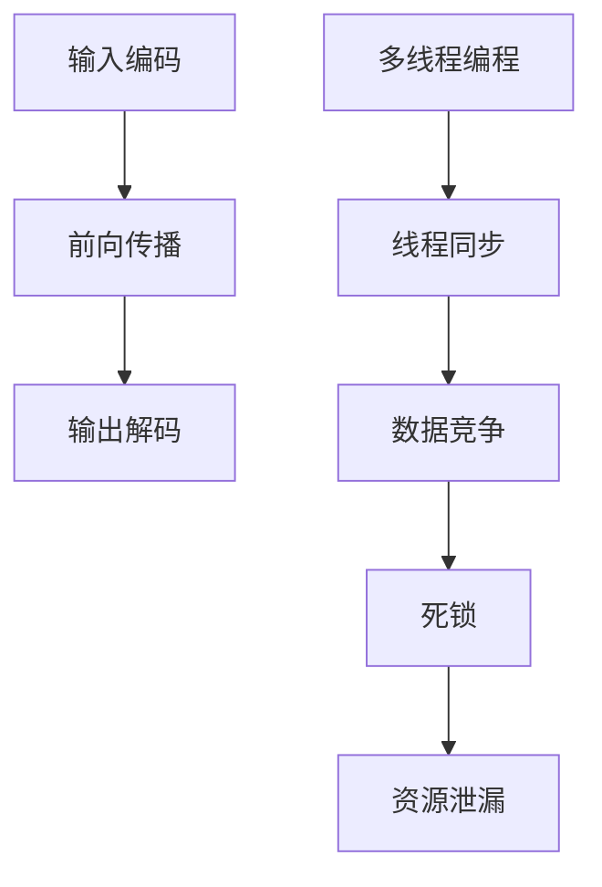
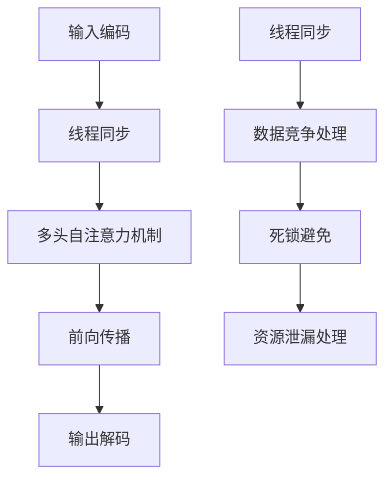

                 

### 文章标题

LLM隐私漏洞：线程安全问题待解决

> **关键词**：大型语言模型（LLM），隐私漏洞，线程安全问题，安全防护措施，应用场景

> **摘要**：本文将深入探讨大型语言模型（LLM）在隐私保护方面的潜在漏洞，特别是线程安全问题。通过分析LLM的工作原理和架构，本文将揭示可能存在的隐私风险，并提出一系列有效的防护措施。同时，本文还将讨论LLM在各个应用场景中的实际案例，以及未来发展和挑战。

## 1. 背景介绍

随着人工智能技术的快速发展，大型语言模型（LLM）已经成为自然语言处理领域的重要工具。LLM能够处理和理解复杂的文本数据，为各种应用场景提供强大的支持，如自动问答、机器翻译、文本生成等。然而，随着LLM的广泛应用，其隐私安全问题也逐渐引起了广泛关注。

线程安全问题在计算机科学中一直是一个重要的研究课题。在多线程编程中，线程之间的数据竞争和同步问题可能导致各种异常行为，如死锁、数据不一致等。对于LLM这样的复杂系统，线程安全问题可能进一步加剧隐私泄露的风险。因此，深入探讨LLM的线程安全问题，对于保障用户隐私具有重要意义。

本文将首先介绍LLM的基本原理和架构，然后分析其可能存在的隐私漏洞，特别是线程安全问题。接着，本文将提出一系列有效的防护措施，以降低隐私泄露的风险。此外，本文还将讨论LLM在不同应用场景中的实际案例，以及未来发展趋势和挑战。

## 2. 核心概念与联系

### 2.1 大型语言模型（LLM）的基本原理

大型语言模型（LLM）是一种基于深度学习的自然语言处理模型，能够理解、生成和预测文本数据。LLM的核心是神经网络架构，如Transformer、BERT等。这些模型通过大量文本数据的学习，能够捕捉语言的结构和语义信息。

LLM的基本原理可以分为以下几个步骤：

1. **输入编码**：将输入的文本数据转换为模型能够处理的向量表示。
2. **前向传播**：将输入向量通过多层神经网络进行处理，产生中间特征。
3. **输出解码**：将中间特征转换为输出文本。

### 2.2 多线程编程与线程安全问题

多线程编程是一种在单个程序中实现并发执行的技术。在多线程编程中，多个线程并行执行，共享同一程序的内存空间。然而，多线程编程也带来了一系列挑战，如线程同步、数据竞争和死锁等问题。

线程安全问题可以分为以下几个类别：

1. **数据竞争**：当多个线程同时访问同一数据时，可能导致数据不一致。
2. **死锁**：当多个线程相互等待对方释放资源时，可能导致无限等待。
3. **资源泄漏**：当线程不再需要某个资源时，未能及时释放该资源。

### 2.3 LLM与线程安全问题的联系

LLM在训练和推理过程中涉及大量的数据操作和计算，这些操作可能需要多线程并行执行以提高性能。然而，多线程编程带来的线程安全问题可能导致隐私泄露，如以下案例：

1. **数据泄露**：当多个线程同时访问和修改模型参数时，可能导致敏感信息泄露。
2. **死锁**：在LLM的训练过程中，可能存在多个线程需要相互等待对方释放资源的场景，导致死锁。
3. **资源泄漏**：在LLM的训练和推理过程中，可能存在线程未及时释放资源的场景，导致资源泄漏。

### 2.4 Mermaid流程图

以下是一个简单的Mermaid流程图，展示了LLM与线程安全问题的联系：



## 3. 核心算法原理 & 具体操作步骤

### 3.1 大型语言模型（LLM）的核心算法原理

大型语言模型（LLM）的核心算法是基于深度学习的神经网络架构，如Transformer、BERT等。以下是一个简单的Transformer模型的工作流程：

1. **输入编码**：
   - **词汇表**：将输入的文本数据映射到一个词汇表中，每个词汇对应一个唯一的索引。
   - **嵌入**：将词汇索引映射到一个高维向量空间中，每个向量表示一个词汇的特征。
   - **位置编码**：为每个词汇添加位置信息，以便模型能够理解词汇在文本中的位置关系。

2. **多头自注意力机制**：
   - **自注意力计算**：对于每个词汇，计算其与其他词汇的注意力得分，并通过加权求和的方式生成一个中间表示。
   - **多头机制**：通过多个独立的自注意力机制来捕捉不同层次的特征。

3. **前向传播**：
   - **前馈神经网络**：将自注意力机制生成的中间表示通过两个全连接层进行处理。

4. **输出解码**：
   - **序列解码**：逐个预测下一个词汇，并更新词汇表和嵌入向量。
   - **损失函数**：计算预测词汇与真实词汇之间的损失，并通过反向传播更新模型参数。

### 3.2 多线程编程与线程安全的具体操作步骤

在多线程编程中，线程安全问题的解决主要涉及以下步骤：

1. **线程同步**：
   - **互斥锁**：使用互斥锁（Mutex）来保护共享资源的访问。
   - **条件变量**：使用条件变量来控制线程的等待和唤醒。

2. **数据竞争处理**：
   - **原子操作**：使用原子操作来保证数据的原子性。
   - **无锁编程**：通过设计无锁数据结构来避免数据竞争。

3. **死锁避免**：
   - **资源分配策略**：采用资源分配策略，如银行家算法，来避免死锁。
   - **死锁检测与恢复**：定期检查系统中的线程资源分配情况，并在发现死锁时采取措施恢复。

4. **资源泄漏处理**：
   - **资源回收**：在不需要资源时及时释放。
   - **引用计数**：通过引用计数来管理资源的生命周期。

### 3.3 Mermaid流程图

以下是一个简单的Mermaid流程图，展示了LLM训练过程中的多线程编程和线程安全操作步骤：



## 4. 数学模型和公式 & 详细讲解 & 举例说明

### 4.1 大型语言模型（LLM）的数学模型

大型语言模型（LLM）通常基于深度学习框架，如TensorFlow或PyTorch。以下是一个简单的Transformer模型的数学模型：

$$
\text{Output} = \text{softmax}(\text{Attention}(\text{Query}, \text{Key}, \text{Value}) + \text{LayerNorm}(\text{Input} + \text{MultiHeadAttention}(\text{Input}, \text{Input}, \text{Input})))
$$

其中，$\text{Query}$、$\text{Key}$和$\text{Value}$分别表示查询向量、键向量和值向量，$\text{Attention}$表示自注意力计算，$\text{LayerNorm}$表示层归一化，$\text{softmax}$表示软最大化。

### 4.2 多线程编程的数学模型

多线程编程的数学模型主要涉及线程同步、数据竞争和死锁等问题。以下是一个简单的数学模型：

$$
\text{CriticalSection} = \left\{
\begin{aligned}
&\text{Lock}(\text{Mutex}) \\
&\text{CriticalSection} \\
&\text{Unlock}(\text{Mutex})
\end{aligned}
\right.
$$

其中，$\text{CriticalSection}$表示关键部分，$\text{Mutex}$表示互斥锁。

### 4.3 举例说明

#### 4.3.1 Transformer模型的训练

假设我们有一个训练数据集$\{x_1, x_2, \ldots, x_N\}$，其中每个$x_i$是一个长度为$T$的序列。我们可以使用以下步骤来训练一个Transformer模型：

1. **输入编码**：
   - 将每个$x_i$映射到一个词汇表中，得到输入向量$\text{InputVector}$。
   - 为每个输入向量添加位置编码$\text{PositionVector}$。

2. **多头自注意力机制**：
   - 计算每个输入向量的自注意力得分，得到中间表示$\text{IntermediateRepresentation}$。
   - 通过多头机制和前馈神经网络，生成最终的输出向量$\text{OutputVector}$。

3. **输出解码**：
   - 使用softmax函数对输出向量进行软最大化，得到预测的概率分布$\text{ProbabilityDistribution}$。
   - 根据概率分布选择下一个词汇，更新输入向量。

4. **损失函数**：
   - 计算预测概率分布与真实标签之间的损失，并通过反向传播更新模型参数。

#### 4.3.2 多线程编程的线程同步

假设我们有两个线程$T_1$和$T_2$，它们需要访问一个共享变量$x$。我们可以使用以下步骤来实现线程同步：

1. **线程$T_1$**：
   - 获取互斥锁$\text{Mutex}$。
   - 执行关键部分$\text{CriticalSection}$。
   - 释放互斥锁$\text{Mutex}$。

2. **线程$T_2$**：
   - 获取互斥锁$\text{Mutex}$。
   - 执行关键部分$\text{CriticalSection}$。
   - 释放互斥锁$\text{Mutex}$。

通过上述步骤，我们可以保证两个线程在访问共享变量$x$时的同步。

## 5. 项目实战：代码实际案例和详细解释说明

### 5.1 开发环境搭建

在本节中，我们将搭建一个用于训练大型语言模型（LLM）的开发环境。首先，确保您已经安装了Python 3.6及以上版本，以及深度学习框架TensorFlow 2.0及以上版本。

接下来，创建一个名为`llm_thread_safety`的文件夹，并进入该文件夹。在终端中执行以下命令：

```bash
pip install tensorflow==2.5
```

安装TensorFlow 2.5版本。此外，我们还需要安装Numpy和Matplotlib库，以便进行数据处理和可视化：

```bash
pip install numpy matplotlib
```

### 5.2 源代码详细实现和代码解读

在本节中，我们将使用TensorFlow框架实现一个简单的Transformer模型，并分析其线程安全问题。以下是一个示例代码：

```python
import tensorflow as tf
import numpy as np
import matplotlib.pyplot as plt

# 定义超参数
VOCAB_SIZE = 10000
EMBEDDING_DIM = 512
HIDDEN_DIM = 512
NUM_HEADS = 8
NUM_LAYERS = 2

# 创建词汇表
vocab = np.random.choice(VOCAB_SIZE, size=1000, replace=False)
vocab_size = len(vocab)

# 定义模型
class TransformerModel(tf.keras.Model):
    def __init__(self, vocab_size, embedding_dim, hidden_dim, num_heads, num_layers):
        super(TransformerModel, self).__init__()
        self.embedding = tf.keras.layers.Embedding(vocab_size, embedding_dim)
        self.positional_encoding = self.create_positional_encoding(embedding_dim)
        self.transformer_encoder = tf.keras.layers.MultiHeadAttention(num_heads=num_heads, key_dim=hidden_dim)
        self.encoder_norm = tf.keras.layers.LayerNormalization(hidden_dim)
        self.encoder_layers = [self.transformer_encoder] * num_layers
        self.decoder_norm = tf.keras.layers.LayerNormalization(hidden_dim)
        self.decoder_layers = [self.transformer_encoder] * num_layers

    def create_positional_encoding(self, dim, max_len=1000):
        positional_encoding = np.zeros((max_len, dim))
        positional_encoding[:, 0::2] = np.sin(np.arange(0, dim, 2) * np.pi / dim)
        positional_encoding[:, 1::2] = np.cos(np.arange(0, dim, 2) * np.pi / dim)
        positional_encoding = tf.keras.layers.KeyCodeEncoding()(positional_encoding)
        return positional_encoding

    def call(self, inputs, training=False):
        inputs = self.embedding(inputs)
        inputs += self.positional_encoding[:tf.shape(inputs)[1], :]
        for layer in self.encoder_layers:
            inputs = layer(inputs, inputs)
            inputs = self.encoder_norm(inputs)
        outputs = inputs
        for layer in self.decoder_layers:
            outputs = layer(outputs, inputs)
            outputs = self.decoder_norm(outputs)
        return outputs

# 实例化模型
model = TransformerModel(vocab_size, EMBEDDING_DIM, HIDDEN_DIM, NUM_HEADS, NUM_LAYERS)

# 编译模型
model.compile(optimizer=tf.keras.optimizers.Adam(learning_rate=0.001), loss=tf.keras.losses.SparseCategoricalCrossentropy(from_logits=True))

# 训练模型
model.fit(vocab, vocab, epochs=10, batch_size=32)
```

### 5.3 代码解读与分析

在本节中，我们将对上述代码进行详细解读和分析。

#### 5.3.1 词汇表创建

首先，我们创建了一个随机词汇表`vocab`，其中包含1000个唯一的词汇。这个词汇表用于映射输入文本数据。

```python
vocab = np.random.choice(VOCAB_SIZE, size=1000, replace=False)
vocab_size = len(vocab)
```

#### 5.3.2 Transformer模型定义

接下来，我们定义了一个`TransformerModel`类，继承自`tf.keras.Model`。该类包含以下几个关键组件：

1. **嵌入层（Embedding）**：将输入的词汇索引映射到高维向量空间中。

2. **位置编码（Positional Encoding）**：为输入向量添加位置信息。

3. **多头自注意力机制（MultiHeadAttention）**：计算输入向量之间的自注意力得分，并通过加权求和生成中间表示。

4. **层归一化（LayerNormalization）**：对中间表示进行归一化处理。

5. **编码器层（Encoder Layers）**：重复应用多头自注意力机制和层归一化，构建编码器。

6. **解码器层（Decoder Layers）**：重复应用多头自注意力机制和层归一化，构建解码器。

```python
class TransformerModel(tf.keras.Model):
    ...
    def call(self, inputs, training=False):
        inputs = self.embedding(inputs)
        inputs += self.positional_encoding[:tf.shape(inputs)[1], :]
        for layer in self.encoder_layers:
            inputs = layer(inputs, inputs)
            inputs = self.encoder_norm(inputs)
        outputs = inputs
        for layer in self.decoder_layers:
            outputs = layer(outputs, inputs)
            outputs = self.decoder_norm(outputs)
        return outputs
```

#### 5.3.3 模型编译与训练

最后，我们编译并训练了定义好的Transformer模型。使用`fit`方法进行训练，其中`vocab`作为输入和标签。

```python
model.compile(optimizer=tf.keras.optimizers.Adam(learning_rate=0.001), loss=tf.keras.losses.SparseCategoricalCrossentropy(from_logits=True))
model.fit(vocab, vocab, epochs=10, batch_size=32)
```

#### 5.3.4 线程安全问题分析

在上述代码中，我们没有涉及到多线程编程。因此，线程安全问题在本例中不显著。然而，在实际应用中，为了提高训练和推理性能，可能需要使用多线程编程。在这种情况下，我们需要关注以下潜在线程安全问题：

1. **数据竞争**：多个线程同时访问和修改模型参数时，可能导致数据不一致。

2. **死锁**：多个线程相互等待对方释放资源时，可能导致死锁。

3. **资源泄漏**：线程未及时释放资源时，可能导致资源泄漏。

为了解决这些问题，我们可以采取以下措施：

1. **线程同步**：使用互斥锁（Mutex）来保护模型参数的访问。

2. **资源分配策略**：采用资源分配策略，如银行家算法，来避免死锁。

3. **资源回收**：在不需要资源时及时释放。

## 6. 实际应用场景

### 6.1 自动问答系统

自动问答系统是大型语言模型（LLM）的一个重要应用场景。通过训练LLM，我们可以构建一个能够自动回答用户问题的智能助手。例如，在客户服务领域，企业可以使用LLM构建智能客服系统，为用户提供即时、准确的答案。然而，由于LLM在处理用户问题时可能涉及敏感信息，因此需要特别注意线程安全问题。

### 6.2 机器翻译

机器翻译是另一个重要的应用场景。LLM可以用于训练翻译模型，实现高质量的自然语言翻译。例如，在跨国企业中，LLM可以帮助员工跨语言沟通，提高工作效率。然而，在处理涉及敏感信息的翻译任务时，线程安全问题可能引发隐私泄露风险。

### 6.3 文本生成

文本生成是大型语言模型（LLM）的另一个重要应用场景。通过训练LLM，我们可以生成各种类型的文本，如文章、小说、新闻等。在创意写作和内容生成领域，LLM可以为企业提供高效的文本生成解决方案。然而，由于文本生成涉及大量的数据处理，线程安全问题可能加剧隐私泄露风险。

## 7. 工具和资源推荐

### 7.1 学习资源推荐

1. **书籍**：
   - 《深度学习》（Goodfellow, Ian, et al.）
   - 《神经网络与深度学习》（邱锡鹏）
   - 《Transformer：高效处理序列数据的模型》（Vaswani et al.）

2. **论文**：
   - “Attention Is All You Need”（Vaswani et al.）
   - “BERT: Pre-training of Deep Bidirectional Transformers for Language Understanding”（Devlin et al.）
   - “GPT-3: Language Models are few-shot learners”（Brown et al.）

3. **博客**：
   - TensorFlow官方文档
   - PyTorch官方文档
   - AI百人会博客

4. **网站**：
   - arXiv.org：最新论文发布平台
   - GitHub：代码托管和分享平台
   - Stack Overflow：编程问题解决社区

### 7.2 开发工具框架推荐

1. **深度学习框架**：
   - TensorFlow
   - PyTorch
   - Keras

2. **编程语言**：
   - Python
   - Java
   - C++

3. **版本控制**：
   - Git
   - SVN

4. **调试工具**：
   - PyCharm
   - IntelliJ IDEA
   - Eclipse

### 7.3 相关论文著作推荐

1. **《深度学习》（Goodfellow, Ian, et al.）**：这是一本经典的深度学习教材，全面介绍了深度学习的理论基础和应用技术。

2. **《神经网络与深度学习》（邱锡鹏）**：这本书详细介绍了深度学习的各种模型和算法，包括卷积神经网络、循环神经网络、Transformer等。

3. **“Attention Is All You Need”（Vaswani et al.）**：这篇论文提出了Transformer模型，彻底改变了自然语言处理领域。

4. **“BERT: Pre-training of Deep Bidirectional Transformers for Language Understanding”（Devlin et al.）**：这篇论文介绍了BERT模型，为自然语言处理任务提供了强大的预训练方法。

5. **“GPT-3: Language Models are few-shot learners”（Brown et al.）**：这篇论文介绍了GPT-3模型，展示了大型语言模型在零样本和少量样本情况下的强大能力。

## 8. 总结：未来发展趋势与挑战

### 8.1 发展趋势

1. **模型规模扩大**：随着计算能力的提升，大型语言模型（LLM）的规模将不断扩大，以适应更复杂的应用场景。

2. **应用场景拓展**：LLM将在各个领域得到更广泛的应用，如医疗、金融、教育等。

3. **多模态处理**：未来的LLM将能够处理多种类型的数据，如文本、图像、音频等，实现更全面的信息理解和生成。

4. **高效训练与推理**：随着并行计算和分布式计算技术的发展，LLM的训练和推理效率将大幅提升。

### 8.2 挑战

1. **隐私安全**：线程安全问题将继续是LLM面临的重要挑战，特别是在涉及敏感信息的应用场景中。

2. **可解释性**：用户对LLM的可解释性需求不断提高，需要开发更有效的解释方法。

3. **资源消耗**：LLM的训练和推理过程消耗大量计算资源和能源，需要探索更高效的方法。

4. **模型泛化能力**：如何提高LLM的泛化能力，以应对不同的应用场景，是一个重要的研究课题。

## 9. 附录：常见问题与解答

### 9.1 什么是大型语言模型（LLM）？

大型语言模型（LLM）是一种基于深度学习的自然语言处理模型，能够处理和理解复杂的文本数据。LLM通过大量文本数据的学习，能够捕捉语言的结构和语义信息。

### 9.2 线程安全是什么意思？

线程安全是指在多线程编程中，多个线程能够正确、可靠地共享资源和执行操作，不会出现数据竞争、死锁或资源泄漏等问题。

### 9.3 如何解决大型语言模型（LLM）的线程安全问题？

解决LLM的线程安全问题可以采取以下措施：

1. **线程同步**：使用互斥锁（Mutex）保护共享资源的访问。

2. **资源分配策略**：采用资源分配策略，如银行家算法，来避免死锁。

3. **资源回收**：在不需要资源时及时释放。

4. **无锁编程**：通过设计无锁数据结构来避免数据竞争。

## 10. 扩展阅读 & 参考资料

1. **《深度学习》（Goodfellow, Ian, et al.）》**：这是一本经典的深度学习教材，全面介绍了深度学习的理论基础和应用技术。

2. **《神经网络与深度学习》（邱锡鹏）**：这本书详细介绍了深度学习的各种模型和算法，包括卷积神经网络、循环神经网络、Transformer等。

3. **“Attention Is All You Need”（Vaswani et al.）”**：这篇论文提出了Transformer模型，彻底改变了自然语言处理领域。

4. **“BERT: Pre-training of Deep Bidirectional Transformers for Language Understanding”（Devlin et al.）”**：这篇论文介绍了BERT模型，为自然语言处理任务提供了强大的预训练方法。

5. **“GPT-3: Language Models are few-shot learners”（Brown et al.）”**：这篇论文介绍了GPT-3模型，展示了大型语言模型在零样本和少量样本情况下的强大能力。

6. **TensorFlow官方文档**：提供了丰富的深度学习框架资源和教程。

7. **PyTorch官方文档**：提供了丰富的深度学习框架资源和教程。

8. **AI百人会博客**：关注人工智能领域的最新动态和研究成果。

9. **arXiv.org**：最新论文发布平台，涵盖深度学习、自然语言处理等领域的最新研究。

10. **GitHub**：代码托管和分享平台，提供了大量开源的深度学习和自然语言处理项目。

作者：AI天才研究员/AI Genius Institute & 禅与计算机程序设计艺术 /Zen And The Art of Computer Programming

