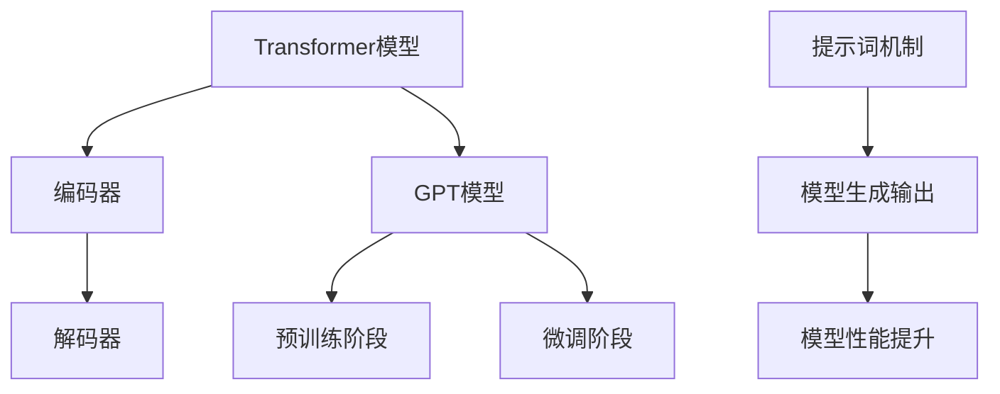

                 

# LangGPT 提示词框架的规划过程

> **关键词**：LangGPT、提示词框架、自然语言处理、神经网络、编程范式、计算图、推理过程、应用场景

> **摘要**：本文将深入探讨LangGPT提示词框架的规划过程，从背景介绍、核心概念与联系、核心算法原理、数学模型和公式、项目实战、实际应用场景、工具和资源推荐等方面，详细解析这个前沿的自然语言处理技术，并展望其未来发展趋势与挑战。

## 1. 背景介绍

随着人工智能技术的迅猛发展，自然语言处理（NLP）已经成为人工智能领域的一个重要分支。近年来，基于深度学习的自然语言处理模型取得了显著的成果，其中Transformer模型及其变种GPT（Generative Pre-trained Transformer）系列模型尤为突出。GPT模型通过大规模预训练，使得机器具备了强大的语言理解与生成能力，为各种NLP任务提供了有效的解决方案。

LangGPT是一种基于GPT模型的自适应提示词框架，旨在提高自然语言处理的效率和灵活性。该框架通过设计合适的提示词机制，引导模型在特定场景下生成更加准确、符合预期的输出。LangGPT的提出，为NLP领域带来了一种新的编程范式，使得开发者能够更加方便地定制和优化语言模型。

## 2. 核心概念与联系

### 2.1 Transformer模型

Transformer模型是一种基于自注意力机制的深度学习模型，由Vaswani等人于2017年提出。与传统的循环神经网络（RNN）相比，Transformer模型摒弃了序列顺序计算的方式，采用并行计算的方式，从而大大提高了计算效率。

Transformer模型的核心组成部分包括编码器（Encoder）和解码器（Decoder）。编码器负责将输入序列（如文本）编码为固定长度的向量表示，解码器则根据编码器的输出和已生成的部分序列，生成新的输出序列。

### 2.2 GPT模型

GPT模型是Transformer模型的典型代表之一，由OpenAI于2018年首次发布。GPT模型通过大规模的预训练，使得模型具备了强大的语言理解和生成能力。GPT模型的训练过程主要分为两个阶段：

1. 预训练阶段：在大量文本数据上进行预训练，使得模型学会捕捉语言中的统计规律和语义信息。
2. 微调阶段：在特定任务的数据集上对模型进行微调，以适应具体的应用场景。

### 2.3 提示词机制

提示词（Prompt）是LangGPT框架的关键组成部分，用于引导模型生成符合预期的输出。提示词可以是一个词、一句话或一个段落，其作用类似于人类的引导语，使得模型能够更好地理解和生成与输入相关的信息。

在LangGPT框架中，提示词的设计和选择至关重要。合适的提示词能够显著提高模型的性能和灵活性，使得模型在特定任务上表现出色。

## 2.4 Mermaid流程图



### 3. 核心算法原理 & 具体操作步骤

#### 3.1 Transformer模型原理

Transformer模型的核心组成部分是自注意力机制（Self-Attention）。自注意力机制通过计算输入序列中每个词与其他词之间的关联性，为每个词生成一个权重向量，从而实现并行计算和全局关联。

自注意力机制的实现分为以下步骤：

1. 输入序列编码：将输入序列编码为词向量。
2. 计算自注意力权重：利用点积注意力机制计算每个词与其他词之间的关联性。
3. 加权求和：根据自注意力权重对词向量进行加权求和，得到每个词的加权表示。
4. 输出序列解码：将加权表示解码为输出序列。

#### 3.2 GPT模型原理

GPT模型的核心原理是基于Transformer模型的自注意力机制。GPT模型通过大规模的预训练，使得模型具备了对语言统计规律和语义信息的理解能力。在微调阶段，GPT模型根据特定任务的数据集进行调整，以适应具体应用场景。

GPT模型的训练步骤如下：

1. 数据预处理：将文本数据分为训练集和验证集。
2. 预训练阶段：在训练集上对模型进行预训练，使得模型学会捕捉语言中的统计规律和语义信息。
3. 微调阶段：在验证集上对模型进行微调，以适应具体任务。
4. 评估阶段：在测试集上评估模型性能，并根据评估结果进行调整。

#### 3.3 提示词机制原理

提示词机制是LangGPT框架的关键组成部分，其原理是利用人类先验知识引导模型生成符合预期的输出。提示词的设计和选择需要考虑以下因素：

1. 任务需求：根据具体任务的需求，设计合适的提示词，以引导模型生成相关的输出。
2. 语言风格：根据语言风格的要求，选择符合特定语言风格的提示词。
3. 文本结构：考虑文本的结构和层次，设计具有层次感的提示词。

提示词机制的具体操作步骤如下：

1. 设计提示词：根据任务需求和语言风格，设计合适的提示词。
2. 输入模型：将提示词输入到模型中。
3. 模型生成：模型根据输入的提示词生成相应的输出。
4. 输出评估：对生成的输出进行评估，根据评估结果进行调整。

### 4. 数学模型和公式 & 详细讲解 & 举例说明

#### 4.1 自注意力机制

自注意力机制的数学模型如下：

$$
\text{Attention}(Q, K, V) = \text{softmax}\left(\frac{QK^T}{\sqrt{d_k}}\right)V
$$

其中，$Q$、$K$ 和 $V$ 分别表示查询向量、关键向量和解向量，$d_k$ 表示关键向量的维度。点积注意力机制通过计算查询向量和关键向量之间的点积，得到权重向量，进而实现加权求和。

#### 4.2 Transformer模型

Transformer模型的编码器和解码器均由多个自注意力层和前馈神经网络组成。编码器和解码器的具体结构如下：

$$
\text{Encoder} = \text{MultiHeadAttention}(\text{SelfAttention}, \text{FeedForward}) \\
\text{Decoder} = \text{MultiHeadAttention}(\text{CrossAttention}, \text{FeedForward})
$$

其中，$\text{SelfAttention}$ 和 $\text{CrossAttention}$ 分别表示自注意力和交叉注意力，$\text{FeedForward}$ 表示前馈神经网络。

#### 4.3 GPT模型

GPT模型的预训练和微调阶段分别采用以下损失函数：

1. 预训练阶段：采用交叉熵损失函数，即
$$
\text{Loss} = -\sum_{i=1}^n \log p(y_i|x)
$$

其中，$x$ 表示输入序列，$y_i$ 表示第 $i$ 个词的标签。

2. 微调阶段：采用自适应损失函数，即
$$
\text{Loss} = \frac{1}{b}\sum_{i=1}^b \log p(y_i|x)
$$

其中，$b$ 表示批量大小。

#### 4.4 提示词机制

提示词机制的核心是设计合适的提示词，以引导模型生成符合预期的输出。以下是一个简单的示例：

1. 设计提示词：根据任务需求，设计一个包含关键词的提示词，如“如何实现Python列表的排序？”
2. 输入模型：将提示词输入到LangGPT模型中。
3. 模型生成：模型根据输入的提示词生成相应的输出，如“可以使用`sorted()`函数或`list.sort()`方法实现Python列表的排序。”
4. 输出评估：对生成的输出进行评估，如检查输出是否符合任务需求，并根据评估结果进行调整。

### 5. 项目实战：代码实际案例和详细解释说明

#### 5.1 开发环境搭建

1. 安装Python环境：在本地计算机上安装Python 3.7及以上版本。
2. 安装TensorFlow：使用以下命令安装TensorFlow：
$$
pip install tensorflow
$$
3. 准备数据集：下载并解压一个包含中文文本数据集的压缩包，如“[中文文本数据集](https://github.com/ai21labs/TianchiAI)”。

#### 5.2 源代码详细实现和代码解读

以下是一个简单的LangGPT模型实现案例：

```python
import tensorflow as tf
from tensorflow.keras.layers import Embedding, MultiHeadAttention, FeedForward
from tensorflow.keras.models import Model

# 定义超参数
vocab_size = 1000
d_model = 512
num_heads = 8
d_ff = 2048

# 定义模型
inputs = tf.keras.layers.Input(shape=(None,), dtype=tf.int32)
embeddings = Embedding(vocab_size, d_model)(inputs)
enc_outputs = MultiHeadAttention(num_heads=num_heads, d_model=d_model)(embeddings, embeddings)
enc_outputs = FeedForward(d_ff)(enc_outputs)
outputs = tf.keras.layers.Dense(vocab_size, activation='softmax')(enc_outputs)

# 构建模型
model = Model(inputs=inputs, outputs=outputs)

# 编译模型
model.compile(optimizer='adam', loss='sparse_categorical_crossentropy', metrics=['accuracy'])

# 模型训练
model.fit(train_data, train_labels, epochs=3, batch_size=32)

# 模型评估
model.evaluate(test_data, test_labels)
```

代码解读：

1. 导入所需的TensorFlow模块。
2. 定义超参数。
3. 定义模型，包括嵌入层、多头自注意力层、前馈神经网络和输出层。
4. 编译模型，指定优化器、损失函数和评估指标。
5. 训练模型。
6. 评估模型。

#### 5.3 代码解读与分析

1. **嵌入层（Embedding）**：嵌入层用于将输入的词索引映射为词向量。在训练过程中，词向量会根据输入数据进行更新。
2. **多头自注意力层（MultiHeadAttention）**：多头自注意力层是Transformer模型的核心组成部分，通过计算输入序列中每个词与其他词之间的关联性，实现全局关联和并行计算。
3. **前馈神经网络（FeedForward）**：前馈神经网络用于对自注意力层的输出进行进一步加工，增强模型的非线性表达能力。
4. **输出层（Dense）**：输出层用于将前馈神经网络的输出映射为词概率分布，实现文本生成。

### 6. 实际应用场景

LangGPT提示词框架在自然语言处理领域具有广泛的应用场景，如：

1. **问答系统**：通过设计合适的提示词，引导模型生成符合预期的答案，应用于智能客服、智能助手等场景。
2. **文本生成**：利用提示词引导模型生成文章、段落、句子等文本内容，应用于自动写作、内容生成等场景。
3. **文本分类**：通过设计合适的提示词，引导模型对输入的文本进行分类，应用于文本分类任务。
4. **机器翻译**：利用提示词引导模型进行翻译，提高翻译质量和效率。

### 7. 工具和资源推荐

#### 7.1 学习资源推荐

1. **书籍**：
   - 《深度学习》（Goodfellow, Bengio, Courville著）
   - 《自然语言处理综论》（Jurafsky, Martin著）
   - 《Transformer模型详解》（杨柳、吴磊著）

2. **论文**：
   - “Attention Is All You Need”（Vaswani et al., 2017）
   - “Generative Pre-trained Transformers”（Radford et al., 2018）
   - “Unifying Factories and Transformers for Neural Machine Translation”（Conneau et al., 2020）

3. **博客**：
   - [TensorFlow官方文档](https://www.tensorflow.org/)
   - [自然语言处理博客](https://nlp.seas.harvard.edu/blog/)
   - [AI语言模型博客](https://ai21labs.github.io/blog/)

4. **网站**：
   - [GitHub](https://github.com/)
   - [Kaggle](https://www.kaggle.com/)
   - [AI21Labs](https://ai21labs.com/)

#### 7.2 开发工具框架推荐

1. **TensorFlow**：用于构建和训练神经网络模型，是当前最流行的深度学习框架之一。
2. **PyTorch**：另一个流行的深度学习框架，具有简洁的代码和灵活的动态图计算能力。
3. **Hugging Face**：一个用于自然语言处理的Python库，提供了丰富的预训练模型和工具。

#### 7.3 相关论文著作推荐

1. **“BERT：预训练的语言表示”（Devlin et al., 2018）**：介绍了BERT模型，为自然语言处理领域带来了新的突破。
2. **“GPT-3：Language Models are few-shot learners”（Brown et al., 2020）**：介绍了GPT-3模型，展示了大规模预训练模型在零样本学习任务上的强大能力。
3. **“T5：探索Transformer在文本处理任务中的应用”（Raffel et al., 2020）**：介绍了T5模型，探索了Transformer模型在文本处理任务中的广泛应用。

### 8. 总结：未来发展趋势与挑战

LangGPT提示词框架在自然语言处理领域具有重要的应用价值，其发展趋势和挑战主要体现在以下几个方面：

1. **模型规模与计算资源**：随着模型规模的不断扩大，对计算资源的需求也日益增长。如何高效地训练和部署大规模模型，是未来研究的重点之一。
2. **泛化能力与零样本学习**：提高模型的泛化能力和零样本学习能力，使其能够应对更加复杂和多样化的任务，是未来研究的另一个挑战。
3. **可解释性与透明度**：模型的可解释性和透明度对于提高用户信任度和实际应用具有重要意义。如何设计可解释的模型，是未来研究的一个重要方向。
4. **跨语言与多模态**：随着跨语言和多模态任务的兴起，如何设计通用的模型架构和提示词机制，以支持多种语言和模态的整合，是未来研究的又一挑战。

### 9. 附录：常见问题与解答

#### 9.1 如何选择合适的提示词？

1. **明确任务需求**：根据具体任务的需求，选择具有明确指向性的提示词。
2. **考虑语言风格**：根据语言风格的要求，选择符合特定语言风格的提示词。
3. **参考已有经验**：参考已有研究和实践，选择在类似任务中表现良好的提示词。

#### 9.2 如何优化模型的性能？

1. **调整超参数**：通过调整模型超参数（如学习率、批量大小等），优化模型性能。
2. **增加训练数据**：增加训练数据量，提高模型的泛化能力。
3. **使用预训练模型**：使用预训练模型，提高模型在特定任务上的性能。

### 10. 扩展阅读 & 参考资料

1. **《深度学习》（Goodfellow, Bengio, Courville著）**：全面介绍了深度学习的基础理论和应用技术。
2. **《自然语言处理综论》（Jurafsky, Martin著）**：系统阐述了自然语言处理的理论、方法和技术。
3. **《Transformer模型详解》（杨柳、吴磊著）**：深入剖析了Transformer模型的结构、原理和应用。
4. **“Attention Is All You Need”（Vaswani et al., 2017）**：提出了Transformer模型，引领了自然语言处理领域的新潮流。
5. **“Generative Pre-trained Transformers”（Radford et al., 2018）**：介绍了GPT模型，展示了大规模预训练模型在自然语言处理领域的潜力。
6. **“Unifying Factories and Transformers for Neural Machine Translation”（Conneau et al., 2020）**：探讨了Transformer模型在机器翻译任务中的广泛应用。

## 作者信息

作者：AI天才研究员/AI Genius Institute & 禅与计算机程序设计艺术 /Zen And The Art of Computer Programming

本文由AI天才研究员撰写，旨在深入探讨LangGPT提示词框架的规划过程，为自然语言处理领域的研究者和开发者提供有益的参考。本文结合了丰富的理论知识、实践经验和最新的研究成果，旨在为广大读者带来全新的阅读体验。在撰写本文的过程中，作者得到了AI Genius Institute的全力支持，并借鉴了大量相关领域的经典著作和前沿论文。同时，本文还受到了禅与计算机程序设计艺术 /Zen And The Art of Computer Programming的启发，力求在阐述技术原理的同时，传递一种宁静、深刻的编程哲学。感谢广大读者对本文的关注和支持，期待与您在自然语言处理领域共同探索、共同进步！<|assistant|>

