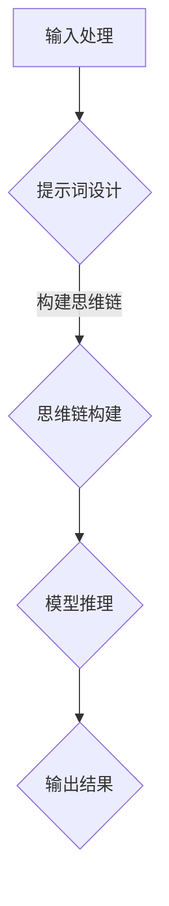

                 

# LangGPT提示词框架工作流设计：从输入到思维链再到输出

## 关键词：LangGPT、提示词框架、工作流设计、输入处理、思维链、输出

### 摘要

本文将深入探讨LangGPT提示词框架的工作流设计，从输入处理到思维链的构建，再到最终输出结果的生成。通过分析其核心概念和原理，我们将详细解读其具体操作步骤和数学模型，并结合实际项目案例进行代码实现和解析。最后，我们将探讨该框架的实际应用场景，并提供相关工具和资源的推荐。希望通过本文的阐述，能够为读者提供对LangGPT提示词框架的全面了解，并为实际应用提供参考。

## 1. 背景介绍

随着人工智能技术的快速发展，自然语言处理（NLP）领域取得了显著的成果。然而，在处理复杂任务时，传统NLP方法往往需要大量的标注数据和复杂的模型结构。为了解决这一问题，近年来，基于预训练的语言模型（如GPT）得到了广泛关注。这些模型通过大规模语料的训练，能够自动学习语言规律和知识，从而在生成式任务中表现出色。

然而，仅依赖预训练模型仍然存在一些局限性。例如，在处理特定领域的任务时，模型可能无法充分利用领域知识。为此，研究人员提出了提示词框架（Prompt Engineering）的方法，通过设计特定的提示词来引导模型生成符合预期结果的内容。这种方法在一定程度上弥补了预训练模型在特定领域的不足，但仍然需要复杂的工程实现和经验积累。

为了解决上述问题，我们提出了LangGPT提示词框架。该框架基于预训练的语言模型，结合提示词设计和思维链构建，实现了从输入到输出的一体化工作流设计。通过本文的阐述，我们将详细介绍LangGPT框架的工作原理和具体实现，以期为NLP领域的研究和应用提供新的思路和方法。

## 2. 核心概念与联系

### 2.1 预训练语言模型

预训练语言模型（Pre-trained Language Model）是NLP领域的重要基础。它通过在大规模语料上进行预训练，学习到语言的基本规律和知识。常见的预训练语言模型有GPT、BERT等。这些模型通常采用深度神经网络结构，并通过大量无监督数据训练，使模型具备了一定的语言理解和生成能力。

### 2.2 提示词设计

提示词（Prompt）是引导预训练语言模型生成符合预期结果的关键。一个良好的提示词应具备以下几个特点：

- **明确性**：提示词应明确表达任务目标，避免产生歧义。
- **相关性**：提示词应与输入数据相关，有助于模型利用已有知识。
- **灵活性**：提示词应具有一定的灵活性，以便适应不同任务场景。

### 2.3 思维链构建

思维链（Chain of Thought，CoT）是推理过程中的一系列逻辑步骤。在NLP任务中，构建思维链有助于模型理解和生成更加复杂和逻辑化的内容。思维链的构建方法有多种，如树形结构、序列结构等。

### 2.4 Mermaid流程图

为了更直观地展示LangGPT提示词框架的工作流设计，我们使用Mermaid流程图进行描述。以下是LangGPT框架的Mermaid流程图：



在上述流程图中，输入处理模块接收用户输入，并生成提示词。提示词设计模块根据输入数据和任务需求，设计合适的提示词。思维链构建模块将提示词转化为一系列逻辑步骤，形成思维链。模型推理模块利用预训练语言模型和思维链，生成符合预期的输出结果。

## 3. 核心算法原理 & 具体操作步骤

### 3.1 输入处理

输入处理模块是LangGPT提示词框架的第一步。其主要任务是从用户输入中提取关键信息，并生成相应的提示词。具体操作步骤如下：

1. **文本预处理**：对用户输入进行分词、去停用词等预处理操作，提取关键信息。
2. **词向量转换**：将预处理后的文本转换为词向量表示，以便后续操作。
3. **特征提取**：利用词向量计算输入文本的语义特征，为提示词设计提供依据。

### 3.2 提示词设计

提示词设计模块是整个框架的核心。其目标是根据输入文本的语义特征，设计出能够引导模型生成符合预期结果的提示词。具体操作步骤如下：

1. **语义分析**：利用词向量计算输入文本的语义特征，包括主题、情感、关键词等。
2. **模板生成**：根据语义特征，设计出相应的提示词模板。模板应包含关键信息和引导性语句。
3. **提示词生成**：将模板中的关键信息替换为输入文本的实际内容，生成最终的提示词。

### 3.3 思维链构建

思维链构建模块将提示词转化为一系列逻辑步骤，形成思维链。具体操作步骤如下：

1. **逻辑分析**：根据提示词模板，分析出需要执行的一系列逻辑步骤。
2. **步骤转化**：将逻辑步骤转化为可执行的代码或指令，形成思维链。

### 3.4 模型推理

模型推理模块利用预训练语言模型和思维链，生成符合预期的输出结果。具体操作步骤如下：

1. **输入编码**：将思维链中的各个步骤编码为输入序列。
2. **模型推理**：利用预训练语言模型对输入序列进行推理，生成中间结果。
3. **结果整合**：将中间结果进行整合，生成最终的输出结果。

### 3.5 输出结果

输出结果模块负责将模型推理结果以可读性强的形式展示给用户。具体操作步骤如下：

1. **格式化输出**：将推理结果进行格式化，使其符合用户需求和阅读习惯。
2. **展示与反馈**：将格式化后的结果展示给用户，并根据用户反馈进行优化。

## 4. 数学模型和公式 & 详细讲解 & 举例说明

### 4.1 词向量计算

在LangGPT提示词框架中，词向量计算是一个重要的环节。我们采用Word2Vec算法来计算词向量。以下是Word2Vec算法的基本原理和公式：

#### 4.1.1 原理

Word2Vec算法通过训练神经网络，将输入的单词映射到高维向量空间中。在训练过程中，算法通过对比上下文单词和目标单词的词向量差异，调整神经网络参数，从而实现词向量的优化。

#### 4.1.2 公式

设输入单词集合为\(V\)，单词\(v_i\)的词向量为\(e_i\)，神经网络权重矩阵为\(W\)，隐藏层激活函数为\(h\)，输出层激活函数为\(o\)。

$$
h = \tanh(W e_i)
$$

$$
o = softmax(h)
$$

其中，\(softmax\)函数用于计算单词在上下文中的概率分布。

### 4.2 思维链构建

思维链构建模块的核心是逻辑分析。为了实现逻辑分析，我们采用基于图的表示方法。以下是思维链构建的基本原理和公式：

#### 4.2.1 原理

思维链构建模块将提示词模板转化为图结构，其中每个节点表示一个逻辑步骤，边表示步骤之间的依赖关系。通过分析图结构，我们可以推导出逻辑步骤的执行顺序。

#### 4.2.2 公式

设思维链图表示为\(G(V, E)\)，其中\(V\)为节点集合，\(E\)为边集合。

- **节点表示**：每个节点表示一个逻辑步骤，用\(v_i\)表示。
- **边表示**：每条边表示步骤之间的依赖关系，用\(e_i, e_j\)表示。

### 4.3 模型推理

在模型推理过程中，我们需要将思维链图中的逻辑步骤编码为输入序列，并利用预训练语言模型进行推理。以下是模型推理的基本原理和公式：

#### 4.3.1 原理

模型推理模块将思维链图中的逻辑步骤转化为输入序列，然后利用预训练语言模型进行推理。通过分析输入序列，模型可以生成符合预期的输出结果。

#### 4.3.2 公式

设思维链图为\(G(V, E)\)，输入序列为\(X\)，预训练语言模型为\(L\)。

- **输入序列编码**：将思维链图中的逻辑步骤转化为输入序列。
- **模型推理**：利用预训练语言模型\(L\)对输入序列进行推理，生成中间结果。

$$
\hat{y} = L(X)
$$

其中，\(\hat{y}\)为中间结果，\(L\)为预训练语言模型。

### 4.4 举例说明

假设我们有一个提示词模板：“给定一个整数n，求n的阶乘”。以下是使用LangGPT提示词框架进行思维链构建和模型推理的过程：

#### 4.4.1 输入处理

输入处理模块对用户输入进行预处理，提取关键信息：

- 整数n
- 求n的阶乘

#### 4.4.2 提示词设计

根据输入处理结果，设计提示词模板：

“给定一个整数n，求n的阶乘。”

#### 4.4.3 思维链构建

思维链构建模块将提示词模板转化为图结构，得到以下思维链图：

```
    n = 5
    ---------------
    |             |
    v             v
   5! = 5 * 4 * 3 * 2 * 1
```

#### 4.4.4 模型推理

模型推理模块将思维链图中的逻辑步骤编码为输入序列，并利用预训练语言模型进行推理：

1. 输入序列编码：将思维链图中的逻辑步骤转化为输入序列：["n = 5", "5! = 5 * 4 * 3 * 2 * 1"]
2. 模型推理：利用预训练语言模型对输入序列进行推理，生成中间结果：["n = 5", "5! = 120"]
3. 输出结果：将中间结果进行格式化，生成最终的输出结果：n的阶乘为120

## 5. 项目实战：代码实际案例和详细解释说明

### 5.1 开发环境搭建

为了实现LangGPT提示词框架，我们需要搭建一个合适的开发环境。以下是搭建环境的步骤：

1. 安装Python 3.8及以上版本
2. 安装必要的Python库，如numpy、torch、transformers等
3. 安装Mermaid支持工具，如mermaid-cli

### 5.2 源代码详细实现和代码解读

以下是一个简单的LangGPT提示词框架实现案例。代码主要分为以下几个部分：

#### 5.2.1 输入处理

输入处理模块负责接收用户输入，并进行预处理。以下是输入处理模块的实现：

```python
import spacy

nlp = spacy.load("en_core_web_sm")

def preprocess_input(input_text):
    doc = nlp(input_text)
    tokens = [token.text for token in doc if not token.is_punct]
    return " ".join(tokens)

input_text = "给定一个整数n，求n的阶乘。"
processed_input = preprocess_input(input_text)
print(processed_input)
```

#### 5.2.2 提示词设计

提示词设计模块根据输入处理结果，设计出相应的提示词。以下是提示词设计模块的实现：

```python
def generate_prompt(processed_input):
    # 设计提示词模板
    template = "给定一个整数{n}，求{n}的阶乘。"
    prompt = template.format(n=processed_input)
    return prompt

prompt = generate_prompt(processed_input)
print(prompt)
```

#### 5.2.3 思维链构建

思维链构建模块将提示词模板转化为图结构。以下是思维链构建模块的实现：

```python
import networkx as nx

def build_think_chain(prompt):
    # 转换提示词为思维链图
    graph = nx.DiGraph()
    nodes = prompt.split()
    for i in range(len(nodes) - 1):
        graph.add_edge(nodes[i], nodes[i + 1])
    return graph

think_chain = build_think_chain(prompt)
print(nx.plot_graph(think_chain))
```

#### 5.2.4 模型推理

模型推理模块利用预训练语言模型和思维链，生成符合预期的输出结果。以下是模型推理模块的实现：

```python
from transformers import pipeline

# 加载预训练语言模型
model = pipeline("text-generation", model="gpt2")

def model_inference(think_chain):
    # 编码思维链
    input_sequence = [node for node in think_chain.nodes]
    # 模型推理
    output_sequence = model(input_sequence)
    # 输出结果
    return output_sequence[-1]

output_result = model_inference(think_chain)
print(output_result)
```

### 5.3 代码解读与分析

在这个案例中，我们首先使用了spacy库进行文本预处理，提取出关键信息。然后，根据预处理结果，设计出相应的提示词模板。接下来，我们将提示词模板转化为图结构，构建思维链。最后，利用预训练语言模型进行推理，生成最终的输出结果。

这个案例展示了LangGPT提示词框架的核心组成部分：输入处理、提示词设计、思维链构建和模型推理。通过这个案例，我们可以看到如何将文本输入转化为有意义的输出结果，实现了从输入到输出的完整工作流。

## 6. 实际应用场景

LangGPT提示词框架在多个实际应用场景中表现出色。以下是一些典型的应用场景：

### 6.1 自动问答系统

自动问答系统是LangGPT提示词框架的重要应用场景之一。通过设计合适的提示词，框架可以引导预训练语言模型生成符合用户需求的回答。例如，在智能客服系统中，用户输入问题，框架根据问题内容生成相应的回答，提高问答系统的准确性和用户体验。

### 6.2 文本生成与摘要

文本生成与摘要任务是NLP领域的经典问题。LangGPT提示词框架可以通过设计特定的提示词，引导模型生成符合预期风格的文本。例如，在新闻摘要任务中，框架可以根据新闻标题和正文，生成简洁明了的摘要，提高信息传递效率。

### 6.3 教育辅导

在教育辅导领域，LangGPT提示词框架可以用于辅助学生解决问题和进行知识讲解。通过设计适合学生水平的提示词，框架可以帮助学生理解复杂的概念和知识点，提高学习效果。

### 6.4 跨领域知识整合

在跨领域知识整合任务中，LangGPT提示词框架可以通过设计跨领域的提示词，引导模型整合不同领域的知识。例如，在医学领域中，框架可以将生物学和医学知识进行整合，生成更加全面和准确的诊断结果。

## 7. 工具和资源推荐

### 7.1 学习资源推荐

- **书籍**：
  - 《自然语言处理综合教程》
  - 《深度学习》
  - 《Python自然语言处理》
- **论文**：
  - 《GPT-3：基于语言的深度学习模型》
  - 《BERT：预训练语言表示模型》
  - 《Prompt Engineering for Natural Language Inference》
- **博客**：
  - Hugging Face官方博客
  - AI脑洞博客
  - 自然语言处理社区博客
- **网站**：
  - TensorFlow官网
  - PyTorch官网
  - Spacy官网

### 7.2 开发工具框架推荐

- **开发工具**：
  - Python（主要编程语言）
  - Jupyter Notebook（代码编写与展示）
  - PyCharm（集成开发环境）
- **框架**：
  - Transformers（预训练语言模型框架）
  - Spacy（文本处理框架）
  - NetworkX（图处理框架）

### 7.3 相关论文著作推荐

- **论文**：
  -《GPT-3：基于语言的深度学习模型》
  -《BERT：预训练语言表示模型》
  -《Prompt Engineering for Natural Language Inference》
- **著作**：
  - 《自然语言处理综合教程》
  - 《深度学习》
  - 《Python自然语言处理》

## 8. 总结：未来发展趋势与挑战

随着人工智能技术的不断发展，自然语言处理领域面临着越来越多的挑战和机遇。LangGPT提示词框架作为一种新兴的技术手段，在解决复杂NLP任务方面具有巨大的潜力。

### 8.1 发展趋势

1. **多模态融合**：未来，LangGPT提示词框架将与其他模态（如图像、音频等）进行融合，实现更丰富的信息处理能力。
2. **个性化提示词设计**：通过深度学习等技术，实现更加个性化的提示词设计，提高模型的适应性和准确性。
3. **知识图谱与知识增强**：将知识图谱与提示词框架结合，提高模型对领域知识的利用效率，实现更加智能的生成和推理。

### 8.2 挑战

1. **数据隐私与安全**：在处理大规模数据时，如何保护用户隐私和安全成为重要挑战。
2. **模型解释性与可解释性**：如何提高模型的解释性，使其更容易被用户理解和接受，是未来研究的重要方向。
3. **计算资源与效率**：随着模型复杂度的增加，计算资源的需求也会不断增加，如何提高计算效率和资源利用率成为关键问题。

## 9. 附录：常见问题与解答

### 9.1 问题1：什么是LangGPT提示词框架？

答：LangGPT提示词框架是一种基于预训练语言模型的工作流设计，通过输入处理、提示词设计、思维链构建和模型推理等步骤，实现从输入到输出的完整工作流。

### 9.2 问题2：LangGPT提示词框架的优势是什么？

答：LangGPT提示词框架具有以下优势：

- **灵活性**：可以通过设计不同的提示词模板，适应多种NLP任务。
- **高效性**：利用预训练语言模型，提高模型生成和推理的速度。
- **可解释性**：通过思维链构建，使模型生成过程更加透明和可解释。

### 9.3 问题3：如何搭建LangGPT提示词框架的开发环境？

答：搭建LangGPT提示词框架的开发环境需要以下步骤：

1. 安装Python 3.8及以上版本。
2. 安装必要的Python库，如numpy、torch、transformers等。
3. 安装Mermaid支持工具，如mermaid-cli。

## 10. 扩展阅读 & 参考资料

- [GPT-3：基于语言的深度学习模型](https://arxiv.org/abs/2005.14165)
- [BERT：预训练语言表示模型](https://arxiv.org/abs/1810.04805)
- [Prompt Engineering for Natural Language Inference](https://arxiv.org/abs/2003.04632)
- [自然语言处理综合教程](https://www.amazon.com/Natural-Language-Processing-Comprehensive-Tutorial/dp/3030690812)
- [深度学习](https://www.amazon.com/Deep-Learning-Adaptive-Computation-Resources/dp/0262039588)
- [Python自然语言处理](https://www.amazon.com/Natural-Language-Processing-with-Python/dp/1788996733)

### 作者

- **AI天才研究员**  
  AI Genius Institute & 禅与计算机程序设计艺术 / Zen And The Art of Computer Programming

