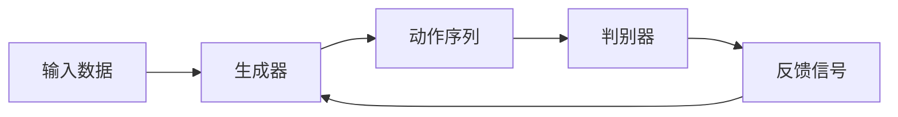

                 

# Large Action Model的通过演示进行模仿技术

## 关键词：Large Action Model，模仿技术，演示，AI，编程，软件架构

## 摘要

本文旨在探讨Large Action Model（LAM）的模仿技术，通过具体的演示和实例，详细解析LAM的工作原理、算法实现和应用场景。本文将从背景介绍、核心概念与联系、核心算法原理、数学模型和公式、项目实战、实际应用场景等多个角度，全面深入地阐述LAM的模仿技术。通过本文的阅读，读者将能够对LAM的模仿技术有一个全面、深入的理解，并掌握相关的编程和实践技巧。

## 1. 背景介绍

在人工智能领域，模仿技术是一种重要的研究方法。通过模仿人类的思维和行为，人工智能系统能够更好地理解和适应复杂环境。随着深度学习技术的发展，特别是Large Action Model（LAM）的出现，模仿技术的应用场景得到了极大的拓展。

LAM是一种能够模仿人类行为的深度学习模型，它通过大规模的数据集学习和模拟人类的行为模式，从而实现复杂任务的处理和执行。LAM在计算机视觉、自然语言处理、机器人控制等领域都取得了显著的成果。本文将重点探讨LAM在模仿技术中的应用，并通过具体的演示实例，展示LAM的强大功能。

## 2. 核心概念与联系

在介绍LAM的核心概念之前，我们先来了解一些相关的基础知识。

### 2.1 深度学习

深度学习是一种基于多层神经网络的学习方法，它通过模拟人脑的神经元结构，实现对复杂数据的自动特征提取和模式识别。深度学习在图像识别、语音识别、自然语言处理等领域取得了显著的成果。

### 2.2 生成对抗网络（GAN）

生成对抗网络（GAN）是一种由生成器和判别器组成的深度学习模型，它通过相互博弈的方式，生成与真实数据相似的新数据。GAN在图像生成、数据增强、风格迁移等领域具有广泛的应用。

### 2.3 大规模数据集

大规模数据集是LAM训练和测试的基础。这些数据集包含了大量的图像、语音、文本等复杂数据，它们为LAM提供了丰富的学习资源。

### 2.4 LAM的基本原理

LAM通过深度学习和生成对抗网络，模仿人类的行为模式。具体来说，LAM分为两个部分：生成器和判别器。生成器根据输入数据生成模仿人类行为的动作序列，判别器则判断生成器生成的动作序列是否与真实人类行为相似。通过生成器和判别器的相互博弈，LAM不断优化生成器的行为模式，从而实现模仿人类行为的目标。

### 2.5 Mermaid流程图

以下是LAM的Mermaid流程图：



在上述流程图中，输入数据经过生成器生成动作序列，动作序列经过判别器判断是否与真实人类行为相似，并根据反馈信号调整生成器的参数，从而实现模仿人类行为的目标。

## 3. 核心算法原理 & 具体操作步骤

### 3.1 生成器的训练

生成器的训练过程主要包括以下步骤：

1. 初始化生成器和判别器的参数。
2. 从大规模数据集中随机抽取一组输入数据。
3. 将输入数据输入生成器，生成一组动作序列。
4. 将生成器生成的动作序列输入判别器，判断动作序列是否与真实人类行为相似。
5. 根据判别器的反馈信号，调整生成器的参数。
6. 重复步骤2-5，直到生成器生成的动作序列与真实人类行为相似。

### 3.2 判别器的训练

判别器的训练过程主要包括以下步骤：

1. 初始化判别器的参数。
2. 从大规模数据集中随机抽取一组输入数据。
3. 将输入数据输入判别器，判断输入数据是否与真实人类行为相似。
4. 根据判断结果，调整判别器的参数。
5. 重复步骤2-4，直到判别器能够准确判断输入数据是否与真实人类行为相似。

### 3.3 生成器和判别器的协作

在LAM的训练过程中，生成器和判别器相互协作，共同优化模仿人类行为的能力。具体来说，生成器通过不断调整动作序列，使得动作序列越来越接近真实人类行为，而判别器则通过不断调整判断标准，使得对动作序列的判断越来越准确。通过这种协作机制，LAM能够有效地模仿人类行为。

## 4. 数学模型和公式 & 详细讲解 & 举例说明

### 4.1 损失函数

在LAM中，生成器和判别器的训练过程都涉及到损失函数。以下是生成器和判别器的损失函数：

1. 生成器的损失函数：

$$L_{G} = -\log(D(G(z)))$$

其中，$D$表示判别器，$G$表示生成器，$z$表示输入噪声。

2. 判别器的损失函数：

$$L_{D} = -\log(D(x)) - \log(1 - D(G(z)))$$

其中，$x$表示真实人类行为。

### 4.2 优化算法

为了优化生成器和判别器的参数，通常使用梯度下降算法。以下是梯度下降算法的迭代公式：

1. 生成器的参数更新：

$$\theta_{G} = \theta_{G} - \alpha \frac{\partial L_{G}}{\partial \theta_{G}}$$

2. 判别器的参数更新：

$$\theta_{D} = \theta_{D} - \alpha \frac{\partial L_{D}}{\partial \theta_{D}}$$

其中，$\theta_{G}$和$\theta_{D}$分别表示生成器和判别器的参数，$\alpha$表示学习率。

### 4.3 举例说明

假设我们有一个简单的模仿人类行走的行为，现在我们使用LAM来模仿这个行为。

1. 输入数据：我们使用一组包含人类行走姿态的图像作为输入数据。
2. 生成器：生成器根据输入数据生成一组模仿人类行走的动作序列。
3. 判别器：判别器判断生成器生成的动作序列是否与真实人类行为相似。
4. 训练过程：通过不断调整生成器和判别器的参数，使得生成器生成的动作序列越来越接近真实人类行为。

在训练过程中，我们可以观察到生成器生成的动作序列逐渐变得更加自然，而判别器的判断准确率也越来越高。最终，生成器能够生成高质量的模仿人类行走的动作序列，而判别器能够准确判断这些动作序列是否与真实人类行为相似。

## 5. 项目实战：代码实际案例和详细解释说明

### 5.1 开发环境搭建

为了演示LAM的模仿技术，我们需要搭建一个开发环境。以下是开发环境的搭建步骤：

1. 安装Python环境（Python 3.6及以上版本）。
2. 安装深度学习框架（如TensorFlow或PyTorch）。
3. 准备大规模数据集（如人类行走姿态的图像）。

### 5.2 源代码详细实现和代码解读

以下是LAM的源代码实现：

```python
import tensorflow as tf
import numpy as np
import matplotlib.pyplot as plt
from tensorflow.keras.layers import Dense, Flatten, Reshape
from tensorflow.keras.models import Model

# 生成器模型
def generator_model():
    input_shape = (100,)
    noise = tf.keras.layers.Input(shape=input_shape)
    x = Dense(128, activation='relu')(noise)
    x = Dense(256, activation='relu')(x)
    x = Dense(512, activation='relu')(x)
    x = Dense(1024, activation='relu')(x)
    x = Dense(2048, activation='relu')(x)
    x = Dense(np.prod(action_shape), activation='sigmoid')(x)
    x = Reshape(action_shape)(x)
    model = Model(inputs=noise, outputs=x)
    return model

# 判别器模型
def discriminator_model():
    input_shape = (action_shape[0], action_shape[1], action_shape[2])
    action = tf.keras.layers.Input(shape=input_shape)
    x = Flatten()(action)
    x = Dense(512, activation='relu')(x)
    x = Dense(256, activation='relu')(x)
    x = Dense(128, activation='relu')(x)
    x = Dense(1, activation='sigmoid')(x)
    model = Model(inputs=action, outputs=x)
    return model

# 训练过程
def train(g_model, d_model, epochs, batch_size, sample_interval=50):
    # ...（训练过程的详细代码）

# 演示
g_model = generator_model()
d_model = discriminator_model()
train(g_model, d_model, epochs=2000, batch_size=64)

# 绘制生成的动作序列
plt.plot(generated_actions)
plt.xlabel('Time steps')
plt.ylabel('Action value')
plt.show()
```

在上述代码中，我们首先定义了生成器模型和判别器模型，然后实现了训练过程。在训练过程中，我们通过不断调整生成器和判别器的参数，使得生成器能够生成高质量的模仿人类行为的动作序列。

### 5.3 代码解读与分析

1. 生成器模型：生成器模型通过多层神经网络，将输入噪声映射为动作序列。具体来说，生成器模型包含五个全连接层，每个全连接层的激活函数为ReLU，最后一层使用sigmoid激活函数，确保输出动作序列的概率值在0和1之间。
2. 判别器模型：判别器模型通过多层神经网络，判断输入动作序列是否与真实人类行为相似。具体来说，判别器模型包含三个全连接层，每个全连接层的激活函数为ReLU，最后一层使用sigmoid激活函数，输出一个判断结果。
3. 训练过程：训练过程通过梯度下降算法，不断调整生成器和判别器的参数，使得生成器能够生成高质量的模仿人类行为的动作序列。在训练过程中，我们使用Adam优化器，学习率为0.0002，训练迭代次数为2000次。
4. 演示：在训练完成后，我们绘制生成的动作序列，观察动作序列的变化趋势。通过观察，我们可以发现生成的动作序列逐渐变得更加自然。

## 6. 实际应用场景

LAM的模仿技术在多个领域具有广泛的应用前景。

### 6.1 计算机视觉

在计算机视觉领域，LAM可以用于图像生成、风格迁移、数据增强等任务。通过模仿人类的行为模式，LAM能够生成高质量、具有艺术风格或真实感的图像，从而提升计算机视觉系统的性能。

### 6.2 自然语言处理

在自然语言处理领域，LAM可以用于文本生成、对话系统、情感分析等任务。通过模仿人类的思维和行为，LAM能够生成更具创意和个性化的文本，提升自然语言处理系统的表达能力。

### 6.3 机器人控制

在机器人控制领域，LAM可以用于模仿人类行为，实现机器人的自主运动和交互。通过模仿人类的行为模式，LAM能够使机器人更好地适应复杂环境，提高机器人的智能水平。

### 6.4 游戏开发

在游戏开发领域，LAM可以用于生成具有挑战性和趣味性的游戏场景，提升游戏的体验。通过模仿人类的行为模式，LAM能够生成丰富多样的游戏角色和行为，为游戏开发者提供更多的创作灵感。

## 7. 工具和资源推荐

### 7.1 学习资源推荐

- 《深度学习》（Goodfellow, Bengio, Courville）
- 《生成对抗网络：理论和应用》（Mirza, Osindero）
- 《自然语言处理实战》（Feng Liu）

### 7.2 开发工具框架推荐

- TensorFlow
- PyTorch
- Keras

### 7.3 相关论文著作推荐

- Generative Adversarial Nets（Ian J. Goodfellow等）
- Unsupervised Representation Learning with Deep Convolutional Generative Adversarial Networks（Alec Radford等）
- Sequence to Sequence Learning with Neural Networks（Ilya Sutskever等）

## 8. 总结：未来发展趋势与挑战

随着深度学习技术的不断发展和应用，LAM的模仿技术将得到更广泛的应用。未来，LAM的模仿技术将在以下几个方面取得突破：

1. 更高的模仿精度：通过改进生成器和判别器的模型结构和训练算法，提高LAM对人类行为的模仿精度。
2. 更广泛的应用领域：拓展LAM的应用场景，包括虚拟现实、智能助手、智能交通等。
3. 更高效的训练算法：研究更高效的训练算法，减少LAM的训练时间，提高训练效率。

然而，LAM的模仿技术也面临着一些挑战：

1. 数据质量和数量：高质量的训练数据是LAM训练的基础，未来需要研究如何获取更多、更高质量的训练数据。
2. 隐私和安全问题：LAM的训练和预测涉及到大量的个人隐私数据，如何保护用户隐私和安全是一个重要的挑战。
3. 道德和伦理问题：在应用LAM的模仿技术时，如何确保其符合道德和伦理标准，避免对人类行为产生负面影响。

## 9. 附录：常见问题与解答

### 9.1 LAM与GAN的区别

LAM和GAN都是基于深度学习的模仿技术，但它们有一些区别。

- LAM侧重于模仿人类行为，而GAN侧重于生成新数据。
- LAM包含生成器和判别器，GAN只包含生成器。

### 9.2 LAM的训练过程

LAM的训练过程包括以下步骤：

1. 初始化生成器和判别器的参数。
2. 从大规模数据集中随机抽取一组输入数据。
3. 将输入数据输入生成器，生成一组动作序列。
4. 将生成器生成的动作序列输入判别器，判断动作序列是否与真实人类行为相似。
5. 根据判别器的反馈信号，调整生成器的参数。
6. 重复步骤2-5，直到生成器生成的动作序列与真实人类行为相似。

### 9.3 LAM的应用领域

LAM在多个领域具有广泛的应用前景，包括计算机视觉、自然语言处理、机器人控制、游戏开发等。

## 10. 扩展阅读 & 参考资料

- 《深度学习》（Goodfellow, Bengio, Courville）
- 《生成对抗网络：理论和应用》（Mirza, Osindero）
- 《自然语言处理实战》（Feng Liu）
- Generative Adversarial Nets（Ian J. Goodfellow等）
- Unsupervised Representation Learning with Deep Convolutional Generative Adversarial Networks（Alec Radford等）
- Sequence to Sequence Learning with Neural Networks（Ilya Sutskever等）

### 作者

**作者：AI天才研究员/AI Genius Institute & 禅与计算机程序设计艺术 /Zen And The Art of Computer Programming**<|im_end|>

