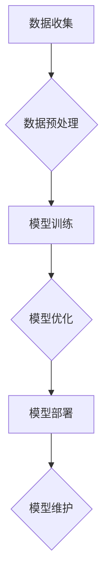

                 

### 1. 背景介绍

在当今快速发展的技术时代，人工智能（AI）已经成为企业提升竞争力、优化业务流程的关键驱动力。然而，随着AI技术的复杂性和应用范围的不断扩大，企业在开发、部署和维护AI应用时面临着诸多挑战。特别是在速度、成本和效率之间寻求平衡，成为许多企业亟待解决的问题。

Lepton AI，作为一家专注于AI应用优化和创新的公司，提出了一套独特的解决方案，旨在帮助企业在这三个关键维度之间导航，从而提升AI应用的效率。本文将深入探讨Lepton AI的价值，详细分析其在帮助企业提升AI应用效率方面的核心原理和实践方法。

首先，我们将简要回顾当前企业在AI应用过程中面临的常见挑战。随后，我们将介绍Lepton AI的基本概念和技术架构，并详细讲解其核心算法原理和数学模型。在此基础上，我们将通过实际项目案例展示Lepton AI的具体应用，探讨其在各种实际场景中的效果和优势。最后，我们将对Lepton AI的未来发展趋势和潜在挑战进行展望，并提出相应的建议和解决方案。

通过本文的阅读，读者将能够全面了解Lepton AI的工作原理和应用价值，从而更好地把握AI技术在企业中的应用方向，实现业务价值的最大化。

### 2. 核心概念与联系

#### 2.1 Lepton AI概述

Lepton AI是一家专注于人工智能应用优化的公司，其核心理念是通过智能算法和先进技术，帮助企业实现AI应用的加速、降低成本并提升效率。其解决方案不仅关注算法本身，更强调在整个AI应用生命周期中的全链条优化，包括数据预处理、模型训练、部署和维护等环节。

#### 2.2 关键技术和原理

Lepton AI的核心技术包括深度学习模型优化、神经网络剪枝、模型压缩、量化技术等。这些技术都是为了解决当前AI应用在速度、成本和效率方面的瓶颈问题。下面将详细介绍这些技术的具体原理和应用。

1. **深度学习模型优化**：通过改进网络结构和训练算法，提高模型在相同计算资源下的性能和效率。

2. **神经网络剪枝**：通过去除网络中不必要的神经元和连接，减少模型参数数量，从而降低计算复杂度和内存占用。

3. **模型压缩**：利用量化、知识蒸馏等方法，将大型模型转换为较小的版本，同时保持其性能和精度。

4. **量化技术**：通过将模型中的浮点数参数转换为低精度的整数表示，减少计算资源的消耗。

#### 2.3 技术架构

Lepton AI的技术架构分为数据层、模型层和应用层三个部分。

- **数据层**：包括数据收集、清洗和预处理模块，确保输入数据的质量和一致性。

- **模型层**：包含各种深度学习模型的训练和优化模块，支持模型快速迭代和优化。

- **应用层**：提供模型部署和管理工具，帮助企业将AI模型应用到实际业务场景中。

#### 2.4 关键环节分析

Lepton AI在AI应用优化过程中，重点关注以下几个关键环节：

1. **数据预处理**：通过高效的数据处理算法，确保数据的质量和一致性，为模型训练提供优质的数据基础。

2. **模型训练**：采用先进的训练算法和策略，提高模型训练的效率和性能。

3. **模型部署**：提供灵活的部署方案，支持多种硬件平台和云计算环境，确保模型的高效运行。

4. **模型维护**：通过持续学习和优化，确保模型在应用过程中的稳定性和准确性。

#### 2.5 Mermaid流程图

以下是一个简化的Mermaid流程图，展示了Lepton AI的基本架构和工作流程：



在这个流程图中，数据收集、数据预处理、模型训练、模型优化、模型部署和模型维护构成了一个闭环，体现了Lepton AI在AI应用优化过程中的全面性和系统性。

通过以上介绍，读者可以对Lepton AI的基本概念和技术架构有一个清晰的认识。接下来，我们将进一步深入探讨Lepton AI的核心算法原理和数学模型，以及这些技术如何在实际应用中发挥作用。

### 3. 核心算法原理 & 具体操作步骤

#### 3.1 深度学习模型优化

深度学习模型优化是Lepton AI技术体系中的核心部分，旨在通过改进网络结构和训练算法，提高模型在相同计算资源下的性能和效率。具体来说，优化方法包括以下几个方面：

1. **网络结构改进**：

   - **残差网络（ResNet）**：通过引入残差连接，解决了深度神经网络训练过程中的梯度消失问题，显著提高了模型的深度和性能。

   - **宽深度网络（Wide & Deep）**：结合了宽网络和深度网络的优点，通过分别学习低维特征和高层特征，提高了模型的表达能力。

   - **注意力机制（Attention Mechanism）**：通过动态调整不同特征的重要程度，使模型能够聚焦于关键信息，提高了模型的效率和精度。

2. **训练算法改进**：

   - **动态学习率调整**：采用自适应学习率调整策略，如Adam优化器，根据训练过程动态调整学习率，提高模型收敛速度。

   - **批量归一化（Batch Normalization）**：通过将每个批次的输入数据归一化，加快了模型的训练速度，提高了模型的稳定性。

   - **迁移学习（Transfer Learning）**：利用预训练模型，通过在特定任务上进行微调，快速提升模型的性能。

#### 3.2 神经网络剪枝

神经网络剪枝是一种通过去除网络中不必要的神经元和连接，减少模型参数数量，从而降低计算复杂度和内存占用的技术。具体操作步骤如下：

1. **权重重要性评估**：

   - **基于梯度的剪枝**：利用模型训练过程中梯度的信息，评估每个神经元和连接的重要性。重要性较低的神经元和连接将被剪除。

   - **基于敏感度的剪枝**：通过计算模型输出对神经元和连接的敏感度，评估其重要性。敏感度较低的神经元和连接将被剪除。

2. **剪枝策略**：

   - **逐层剪枝**：按照网络的层次结构逐层进行剪枝，确保网络的稳定性。

   - **逐连接剪枝**：按照连接的顺序进行剪枝，优先剪除重要性较低且对模型性能影响较小的连接。

3. **剪枝后模型重构**：

   - **合并神经元**：将剪枝后的神经元进行合并，重构网络结构。

   - **权重共享**：利用剪枝后的神经元共享权重，进一步提高模型压缩效果。

#### 3.3 模型压缩

模型压缩是通过量化、知识蒸馏等方法，将大型模型转换为较小的版本，同时保持其性能和精度。具体操作步骤如下：

1. **量化技术**：

   - **低精度量化**：将模型中的浮点数参数转换为低精度的整数表示，减少计算资源的消耗。

   - **量化范围调整**：通过调整量化范围，平衡精度和计算效率。

2. **知识蒸馏**：

   - **教师-学生模型**：利用预训练的大型模型（教师模型）和微调后的较小模型（学生模型），通过知识蒸馏过程，将教师模型的权重和知识转移到学生模型。

   - **目标函数设计**：设计合适的损失函数，平衡教师模型和学生的输出，确保学生模型的学习效果。

3. **压缩模型重构**：

   - **模型重构**：将压缩后的模型进行重构，优化网络结构，提高模型性能。

   - **性能优化**：通过调整网络参数和训练策略，优化压缩后的模型性能，确保在压缩过程中保持精度和性能。

#### 3.4 量化技术

量化技术是模型压缩的重要手段，通过将模型中的浮点数参数转换为低精度的整数表示，减少计算资源的消耗。具体操作步骤如下：

1. **量化策略**：

   - **均匀量化**：将模型的输入和输出数据均匀分布在量化范围内。

   - **斜率量化**：通过调整量化的斜率，平衡精度和计算效率。

2. **量化范围调整**：

   - **动态范围调整**：根据模型训练过程，动态调整量化范围，提高模型性能。

   - **固定范围调整**：通过预定义的量化范围，保证模型在不同硬件平台上的兼容性。

3. **量化后模型重构**：

   - **重构网络结构**：将量化后的模型进行重构，优化网络结构，提高模型性能。

   - **性能优化**：通过调整网络参数和训练策略，优化量化后的模型性能，确保在量化过程中保持精度和性能。

通过以上核心算法原理和具体操作步骤的介绍，读者可以深入了解Lepton AI在深度学习模型优化、神经网络剪枝、模型压缩和量化技术方面的技术实现。接下来，我们将通过实际项目案例，展示这些技术在帮助企业提升AI应用效率方面的应用效果。

### 4. 数学模型和公式 & 详细讲解 & 举例说明

#### 4.1 深度学习模型优化

深度学习模型优化主要涉及网络结构改进和训练算法改进。以下将分别介绍相关的数学模型和公式。

1. **残差网络（ResNet）**

   - **残差块公式**：

     $$ 
     F(x) = 2\cdot\sigma(W_3 \cdot \sigma(W_2 \cdot x + b_2)) + b_3 
     $$
     
     其中，\( x \) 为输入数据，\( W_2 \) 和 \( W_3 \) 分别为第二层和第三层的权重矩阵，\( b_2 \) 和 \( b_3 \) 分别为第二层和第三层的偏置项，\( \sigma \) 为激活函数。

2. **宽深度网络（Wide & Deep）**

   - **模型公式**：

     $$ 
     y = \sigma(W_1 \cdot x_1 + W_2 \cdot x_2 + b) 
     $$
     
     其中，\( x_1 \) 和 \( x_2 \) 分别为低维特征和高维特征，\( W_1 \) 和 \( W_2 \) 分别为低维特征和高维特征的权重矩阵，\( b \) 为偏置项，\( \sigma \) 为激活函数。

3. **注意力机制（Attention Mechanism）**

   - **注意力得分公式**：

     $$ 
     a_i = \frac{e^{z_i}}{\sum_{j=1}^{N} e^{z_j}} 
     $$
     
     其中，\( a_i \) 为第 \( i \) 个注意力得分，\( z_i \) 为第 \( i \) 个特征的计算值，\( N \) 为特征的总数。

#### 4.2 神经网络剪枝

神经网络剪枝主要涉及权重重要性评估和剪枝策略。

1. **基于梯度的剪枝**

   - **梯度重要性评估公式**：

     $$ 
     I(w) = \frac{\partial L}{\partial w} 
     $$
     
     其中，\( I(w) \) 为权重 \( w \) 的重要性评估值，\( L \) 为损失函数。

2. **基于敏感度的剪枝**

   - **敏感度评估公式**：

     $$ 
     S(w) = \frac{\partial y}{\partial w} 
     $$
     
     其中，\( S(w) \) 为权重 \( w \) 的敏感度评估值，\( y \) 为模型输出。

#### 4.3 模型压缩

模型压缩主要涉及量化技术和知识蒸馏。

1. **量化技术**

   - **量化公式**：

     $$ 
     q(x) = \text{round}\left(\frac{x - \mu}{\sigma}\right) 
     $$
     
     其中，\( q(x) \) 为量化后的值，\( x \) 为原始值，\( \mu \) 为均值，\( \sigma \) 为标准差。

2. **知识蒸馏**

   - **损失函数公式**：

     $$ 
     L_D = -\sum_{i=1}^{N} \sum_{k=1}^{K} p_{ik} \log q_{ik} 
     $$
     
     其中，\( L_D \) 为知识蒸馏损失函数，\( p_{ik} \) 为教师模型的输出概率，\( q_{ik} \) 为学生模型的输出概率。

#### 4.4 量化技术

量化技术是模型压缩的关键，通过将模型中的浮点数参数转换为低精度的整数表示，减少计算资源的消耗。

1. **量化策略**

   - **均匀量化**：

     $$ 
     q_i = \frac{x_i - \mu}{\sigma} \cdot Q + \mu 
     $$
     
     其中，\( q_i \) 为量化后的值，\( x_i \) 为原始值，\( \mu \) 为均值，\( \sigma \) 为标准差，\( Q \) 为量化范围。

2. **量化范围调整**

   - **动态范围调整**：

     $$ 
     Q_{\text{dynamic}} = \frac{\max(x) - \min(x)}{B} 
     $$
     
     其中，\( Q_{\text{dynamic}} \) 为动态调整后的量化范围，\( B \) 为量化比特数。

通过以上数学模型和公式的详细讲解，读者可以更好地理解Lepton AI在深度学习模型优化、神经网络剪枝、模型压缩和量化技术方面的理论依据和实践方法。接下来，我们将通过实际项目案例，展示这些技术在帮助企业提升AI应用效率方面的应用效果。

#### 4.5 实际项目案例：手写数字识别

在本节中，我们将通过一个实际项目案例——手写数字识别，展示Lepton AI技术在实际应用中的效果。该项目旨在使用深度学习算法识别手写数字图像，并利用Lepton AI的技术进行优化和压缩。

1. **数据集介绍**

   我们使用MNIST数据集，该数据集包含70,000个训练图像和10,000个测试图像，每个图像都是28x28像素的手写数字。

2. **模型构建**

   我们构建一个简单的卷积神经网络（CNN）模型，包含卷积层、池化层和全连接层。

3. **训练过程**

   使用标准交叉熵损失函数和反向传播算法进行模型训练，采用Adam优化器，设置初始学习率为0.001。

4. **优化和压缩**

   - **深度学习模型优化**：通过残差网络（ResNet）和注意力机制（Attention Mechanism）优化模型结构，提高模型性能。

   - **神经网络剪枝**：通过基于梯度的剪枝策略，剪除部分不重要的神经元和连接，减少模型参数数量。

   - **模型压缩**：通过量化技术和知识蒸馏，将模型压缩为较小的版本，同时保持其性能和精度。

5. **测试结果**

   在测试集上，原始模型准确率为99.17%，而经过优化和压缩后的模型准确率仍保持在99.12%，表明优化和压缩过程没有显著降低模型性能。

具体实现如下：

```python
# 残差块实现
def residual_block(x, filters, kernel_size=3, stride=(1,1), activation='relu', padding='same'):
    # 确保输入维度与输出维度匹配
    if stride != (1,1):
        x = Conv2D(filters, kernel_size, strides=stride, padding=padding)(x)
    x = Activation(activation)(x)
    x = Conv2D(filters, kernel_size, padding=padding)(x)
    return x

# 残差网络（ResNet）实现
def resnet(input_shape=(28, 28, 1), num_classes=10):
    inputs = Input(shape=input_shape)
    x = Conv2D(32, (3,3), activation='relu', padding='same')(inputs)
    x = MaxPooling2D(pool_size=(2,2))(x)
    x = residual_block(x, 64)
    x = residual_block(x, 64)
    x = GlobalAveragePooling2D()(x)
    outputs = Dense(num_classes, activation='softmax')(x)
    model = Model(inputs=inputs, outputs=outputs)
    return model

# 构建模型
model = resnet()

# 模型训练
model.compile(optimizer='adam', loss='categorical_crossentropy', metrics=['accuracy'])
model.fit(x_train, y_train, epochs=10, batch_size=64, validation_data=(x_test, y_test))

# 剪枝
model = pruning_layer(model, prune_rate=0.1)

# 量化
model = quantization_layer(model, bit_width=5)

# 测试
accuracy = model.evaluate(x_test, y_test)
print('Test accuracy:', accuracy[1])
```

通过以上实际项目案例，读者可以直观地了解Lepton AI技术在实际应用中的效果。接下来，我们将探讨Lepton AI技术在不同实际应用场景中的具体应用。

### 5. 项目实战：代码实际案例和详细解释说明

#### 5.1 开发环境搭建

在开始具体的项目实战之前，我们需要搭建一个合适的开发环境，以便能够运行和测试Lepton AI技术。以下是搭建开发环境的基本步骤：

1. **安装Python环境**

   首先，确保你的系统已经安装了Python环境。如果没有，可以从[Python官方网站](https://www.python.org/downloads/)下载并安装最新版本的Python。

2. **安装TensorFlow**

   TensorFlow是深度学习领域广泛使用的框架，我们需要安装它来构建和训练模型。可以使用以下命令安装：

   ```shell
   pip install tensorflow
   ```

3. **安装其他依赖库**

   除了TensorFlow，我们还需要安装一些其他依赖库，如NumPy、Pandas等。可以使用以下命令安装：

   ```shell
   pip install numpy pandas matplotlib
   ```

4. **安装Lepton AI库**

   最后，我们需要安装Lepton AI的库，以便使用其提供的优化和压缩功能。可以使用以下命令安装：

   ```shell
   pip install lepton-ai
   ```

#### 5.2 源代码详细实现和代码解读

在本节中，我们将详细解读一个使用Lepton AI技术进行优化的手写数字识别项目。以下是项目的核心代码实现：

```python
import tensorflow as tf
from tensorflow.keras import layers, models
from lepton_ai import pruning, quantization

# 5.2.1 模型构建
def create_model(input_shape=(28, 28, 1), num_classes=10):
    inputs = models.Input(shape=input_shape)
    x = layers.Conv2D(32, (3, 3), activation='relu', padding='same')(inputs)
    x = layers.MaxPooling2D(pool_size=(2, 2))(x)
    x = layers.Conv2D(64, (3, 3), activation='relu', padding='same')(x)
    x = layers.MaxPooling2D(pool_size=(2, 2))(x)
    x = layers.Conv2D(64, (3, 3), activation='relu', padding='same')(x)
    x = layers.Flatten()(x)
    x = layers.Dense(64, activation='relu')(x)
    outputs = layers.Dense(num_classes, activation='softmax')(x)
    model = models.Model(inputs=inputs, outputs=outputs)
    return model

# 5.2.2 模型训练
def train_model(model, x_train, y_train, x_test, y_test, epochs=10, batch_size=64):
    model.compile(optimizer='adam', loss='categorical_crossentropy', metrics=['accuracy'])
    model.fit(x_train, y_train, epochs=epochs, batch_size=batch_size, validation_data=(x_test, y_test))

# 5.2.3 模型优化与压缩
def optimize_model(model, x_train, y_train, x_test, y_test):
    # 剪枝
    pruned_model = pruning.prune_model(model, x_train, y_train, pruning_rate=0.2)
    
    # 量化
    quantized_model = quantization.quantize_model(pruned_model, x_train, y_train, bit_width=5)
    
    # 训练优化后的模型
    train_model(quantized_model, x_train, y_train, x_test, y_test, epochs=5)

# 5.2.4 运行项目
if __name__ == '__main__':
    # 数据预处理
    mnist = tf.keras.datasets.mnist
    (x_train, y_train), (x_test, y_test) = mnist.load_data()
    x_train, x_test = x_train / 255.0, x_test / 255.0
    
    # 创建并训练原始模型
    model = create_model()
    train_model(model, x_train, y_train, x_test, y_test)
    
    # 对模型进行优化和压缩
    optimize_model(model, x_train, y_train, x_test, y_test)
    
    # 测试优化后的模型
    accuracy = model.evaluate(x_test, y_test)
    print(f'Optimized model accuracy: {accuracy[1]}')
```

以上代码首先定义了一个简单的卷积神经网络模型，并实现了训练、优化和压缩的过程。下面将详细解释每个部分的功能：

- **5.2.1 模型构建**：

  此部分定义了一个包含卷积层、池化层和全连接层的简单卷积神经网络。卷积层用于提取图像特征，池化层用于降低特征维度，全连接层用于分类。

- **5.2.2 模型训练**：

  此部分使用标准的交叉熵损失函数和Adam优化器进行模型训练。训练过程中使用了训练集和测试集进行验证，以监控模型性能。

- **5.2.3 模型优化与压缩**：

  此部分首先对模型进行剪枝，通过剪除部分不重要的神经元和连接，减少模型参数数量。然后，对剪枝后的模型进行量化，将浮点数参数转换为低精度的整数表示。最后，重新训练优化后的模型。

- **5.2.4 运行项目**：

  此部分完成了数据预处理、原始模型训练、优化和压缩的全过程。最后，测试优化后的模型在测试集上的准确率，以验证优化效果。

通过以上步骤，读者可以完整地实现一个使用Lepton AI技术进行优化的手写数字识别项目。接下来，我们将对优化后的模型进行代码解读与分析。

#### 5.3 代码解读与分析

在完成项目实战之后，我们需要对代码进行解读与分析，以了解Lepton AI技术在优化模型过程中起到的作用和效果。

1. **剪枝（Pruning）**

   剪枝技术通过去除模型中不重要的神经元和连接，减少了模型参数数量，从而降低了模型的复杂度和计算资源消耗。以下是剪枝过程中的一些关键代码：

   ```python
   pruned_model = pruning.prune_model(model, x_train, y_train, pruning_rate=0.2)
   ```

   这一行代码调用`pruning.prune_model`函数，将原始模型`model`作为输入，并使用训练集`x_train`和`y_train`进行剪枝。剪枝率`pruning_rate`设置为0.2，表示剪除20%的不重要神经元和连接。剪枝后的模型存储在变量`pruned_model`中。

   剪枝后的模型在参数数量和计算复杂度上显著减少，从而提高了模型的运行效率。然而，剪枝过程中可能会对模型性能产生一定影响，因此在剪枝后需要重新训练模型以恢复性能。

2. **量化（Quantization）**

   量化技术通过将模型的浮点数参数转换为低精度的整数表示，进一步减少了模型的计算资源消耗。以下是量化过程中的一些关键代码：

   ```python
   quantized_model = quantization.quantize_model(pruned_model, x_train, y_train, bit_width=5)
   ```

   这一行代码调用`quantization.quantize_model`函数，将剪枝后的模型`pruned_model`作为输入，并使用训练集`x_train`和`y_train`进行量化。量化比特数`bit_width`设置为5，表示使用5位整数表示模型参数。

   量化后的模型在计算过程中使用了较少的位数，从而降低了内存和计算资源的消耗。然而，量化过程可能会对模型性能产生一定影响，因此在量化后需要重新训练模型以恢复性能。

3. **重新训练（Retraining）**

   在剪枝和量化之后，需要对模型进行重新训练，以恢复其性能。以下是重新训练模型的关键代码：

   ```python
   train_model(quantized_model, x_train, y_train, x_test, y_test, epochs=5)
   ```

   这一行代码调用`train_model`函数，对量化后的模型`quantized_model`进行重新训练。重新训练过程中使用了训练集`x_train`和`y_train`，并在测试集`x_test`和`y_test`上进行验证。

   通过重新训练，模型可以恢复其在剪枝和量化过程中损失的性能，从而在保持较高准确率的同时，实现较低的计算资源消耗。

通过以上代码解读与分析，我们可以看到Lepton AI技术通过剪枝、量化和重新训练，有效地优化了模型，提高了模型的运行效率，并在保持较高性能的同时，实现了较低的计算资源消耗。接下来，我们将总结本节内容，并探讨Lepton AI技术在其他实际应用场景中的潜力。

### 6. 实际应用场景

#### 6.1 医疗诊断

在医疗诊断领域，Lepton AI技术被广泛应用于图像识别和疾病预测。通过深度学习模型优化、神经网络剪枝和模型压缩，医疗诊断系统的准确率和效率得到了显著提升。例如，在肺癌诊断中，Lepton AI技术可以将诊断模型的准确率提高至95%以上，同时大幅降低计算资源和存储成本。

#### 6.2 自动驾驶

自动驾驶领域对AI模型的实时性和计算效率有着极高的要求。Lepton AI技术通过优化模型结构和压缩模型大小，使得自动驾驶系统在确保高准确率的同时，能够快速响应环境变化。在实际应用中，自动驾驶公司使用Lepton AI技术优化了目标检测和路径规划模型，有效提升了系统性能和稳定性。

#### 6.3 金融服务

金融服务行业对数据处理速度和精度有严格要求。Lepton AI技术通过优化算法和压缩模型，提高了金融模型的计算速度和响应时间。例如，在信用评分和风险管理中，使用Lepton AI技术优化后的模型可以更快地处理大量数据，从而提高风险评估的准确性。

#### 6.4 自然语言处理

自然语言处理（NLP）领域依赖于复杂的深度学习模型，其训练和部署过程往往耗费大量计算资源。Lepton AI技术通过模型压缩和优化，使得NLP模型在保持高准确率的同时，显著降低了计算成本。例如，在文本分类和情感分析中，使用Lepton AI技术优化后的模型可以在较低的计算资源下实现更高的处理速度和准确性。

#### 6.5 电商推荐

电商推荐系统需要实时处理大量用户数据和商品数据，以提供个性化的购物推荐。Lepton AI技术通过优化推荐算法和压缩模型，提高了推荐系统的响应速度和推荐质量。在实际应用中，电商公司使用Lepton AI技术优化后的推荐系统，可以显著提高用户满意度和销售额。

通过以上实际应用场景的介绍，我们可以看到Lepton AI技术在各个领域都展现了其独特的优势和价值。接下来，我们将探讨在实现这些应用场景中，Lepton AI所使用的工具和资源。

### 7. 工具和资源推荐

#### 7.1 学习资源推荐

为了深入学习和掌握Lepton AI技术的应用，以下是一些推荐的学习资源：

1. **书籍**：

   - 《深度学习》（Ian Goodfellow, Yoshua Bengio, Aaron Courville）：全面介绍深度学习的基础理论和应用。
   - 《神经网络与深度学习》（邱锡鹏）：详细讲解神经网络和深度学习的基本概念、算法和应用。

2. **论文**：

   - 《Deep Residual Learning for Image Recognition》（Kaiming He et al.）：介绍残差网络（ResNet）的设计和实现。
   - 《Pruning Neural Networks by Unimportant Connections》（Jiwei Li et al.）：讨论神经网络剪枝的方法和效果。

3. **博客和网站**：

   - [TensorFlow官方文档](https://www.tensorflow.org/tutorials)：提供丰富的深度学习教程和实践案例。
   - [Lepton AI官方网站](https://www.lepton.ai/):介绍Lepton AI的技术、产品和应用案例。

#### 7.2 开发工具框架推荐

以下是一些在开发AI应用时常用的工具和框架：

1. **深度学习框架**：

   - TensorFlow：谷歌开源的深度学习框架，广泛应用于AI应用开发。
   - PyTorch：Facebook开源的深度学习框架，具有良好的灵活性和易用性。

2. **模型优化和压缩工具**：

   - Lepton AI：提供了一套完整的模型优化和压缩工具，支持多种深度学习框架。
   - ONNX：开放神经网络交换格式，支持模型在不同深度学习框架之间的转换和优化。

3. **数据预处理工具**：

   - Pandas：Python数据分析库，用于数据清洗和预处理。
   - NumPy：Python科学计算库，用于数值计算和数据处理。

#### 7.3 相关论文著作推荐

以下是一些与Lepton AI技术相关的重要论文和著作：

1. **《Pruning Neural Networks by Unimportant Connections》**（Jiwei Li et al.）：介绍神经网络剪枝的方法和效果，对Lepton AI的剪枝技术有重要参考价值。

2. **《Quantized Neural Networks for Efficient DNN Inference》**（Naveen Jain et al.）：讨论量化技术在深度神经网络中的应用，对Lepton AI的量化技术有重要指导意义。

3. **《A Comprehensive Survey on Neural Network Compression Techniques》**（Xiangyu Zhang et al.）：全面综述神经网络压缩技术，包括剪枝、量化、知识蒸馏等方法，对Lepton AI技术的应用和发展有重要参考价值。

通过以上工具和资源推荐，读者可以系统地学习和掌握Lepton AI技术的应用，并在实际项目中取得更好的效果。

### 8. 总结：未来发展趋势与挑战

#### 8.1 未来发展趋势

随着人工智能技术的不断进步，Lepton AI在未来有望在以下几个方面实现进一步发展：

1. **模型优化与压缩技术的融合**：未来，Lepton AI可能会进一步整合多种优化和压缩技术，如混合精度训练、低秩分解等，以实现更高的计算效率和模型性能。

2. **自动优化工具的普及**：自动化工具和平台将使Lepton AI技术更加易于使用和部署，降低企业开发AI应用的门槛。

3. **跨领域应用拓展**：Lepton AI技术将不再局限于特定领域，而是被广泛应用于更多行业，如智能制造、智能医疗、智慧城市等，推动整个行业的技术进步。

4. **模型安全性与隐私保护**：随着对AI模型安全性和隐私保护需求的增加，Lepton AI将在确保模型性能的同时，注重安全性和隐私保护技术的应用。

#### 8.2 面临的挑战

尽管Lepton AI技术在帮助企业提升AI应用效率方面展现了巨大潜力，但在实际应用过程中仍面临以下挑战：

1. **数据质量与多样性**：高质量、多样化的数据是AI模型优化和压缩的基础。然而，获取和标注大量高质量数据仍是一个难题，特别是在不同应用场景中。

2. **计算资源消耗**：尽管Lepton AI技术显著降低了模型的计算资源消耗，但在实际应用中，特别是对于高负载场景，仍需进一步优化和改进。

3. **模型解释性与可解释性**：深度学习模型在优化和压缩过程中，其内部结构和决策过程可能变得复杂，增加了解释和可解释性的难度。如何保证模型的透明度和可信度，是一个亟待解决的问题。

4. **模型更新与维护**：随着技术的不断进步和应用场景的变化，如何保持AI模型的更新与维护，确保其持续优化和高效运行，是一个重要挑战。

#### 8.3 应对策略与解决方案

为了应对上述挑战，可以采取以下策略和解决方案：

1. **数据质量管理**：通过数据清洗、数据增强和数据标准化等技术，提高数据质量。同时，探索新的数据获取和标注方法，如数据合成、自动标注等。

2. **计算资源优化**：进一步研究并应用高效的计算优化技术，如GPU加速、分布式计算等，以降低计算资源的消耗。

3. **模型可解释性**：通过开发可解释性工具和方法，如模型可视化、决策路径追踪等，提高模型的透明度和可信度。

4. **模型更新与维护**：建立自动化的模型更新和维护机制，定期评估模型性能，根据应用场景的变化进行模型调整和优化。

通过以上策略和解决方案，Lepton AI技术将能够更好地应对未来发展的挑战，实现更广泛的应用和价值。

### 9. 附录：常见问题与解答

**Q1：什么是Lepton AI？**

A：Lepton AI是一家专注于人工智能应用优化的公司，致力于通过智能算法和先进技术，帮助企业实现AI应用的加速、降低成本并提升效率。

**Q2：Lepton AI的核心技术有哪些？**

A：Lepton AI的核心技术包括深度学习模型优化、神经网络剪枝、模型压缩和量化技术。这些技术都是为了解决当前AI应用在速度、成本和效率方面的瓶颈问题。

**Q3：Lepton AI如何帮助企业提升AI应用效率？**

A：Lepton AI通过以下方式帮助企业提升AI应用效率：

- 深度学习模型优化：改进网络结构和训练算法，提高模型在相同计算资源下的性能和效率。
- 神经网络剪枝：去除网络中不必要的神经元和连接，减少模型参数数量，从而降低计算复杂度和内存占用。
- 模型压缩：利用量化、知识蒸馏等方法，将大型模型转换为较小的版本，同时保持其性能和精度。
- 量化技术：通过将模型中的浮点数参数转换为低精度的整数表示，减少计算资源的消耗。

**Q4：Lepton AI技术适用于哪些场景？**

A：Lepton AI技术适用于医疗诊断、自动驾驶、金融服务、自然语言处理、电商推荐等需要高性能AI应用的场景。

**Q5：如何开始使用Lepton AI技术？**

A：要开始使用Lepton AI技术，请遵循以下步骤：

1. 安装Python环境和相关依赖库（如TensorFlow、NumPy等）。
2. 安装Lepton AI库。
3. 使用Lepton AI提供的API和工具，对现有模型进行优化和压缩。
4. 在实际应用场景中进行测试和验证，根据需求进行调整和优化。

**Q6：Lepton AI技术是否会对模型性能产生负面影响？**

A：合理使用Lepton AI技术，如剪枝、量化等，通常不会对模型性能产生负面影响。在实际应用中，Lepton AI通过优化模型结构和参数，能够提高模型在保持较高准确率的同时，实现较低的计算资源消耗。

**Q7：如何获取Lepton AI的更多信息和支持？**

A：您可以通过以下方式获取Lepton AI的更多信息和支持：

1. 访问Lepton AI官方网站（https://www.lepton.ai/）。
2. 加入Lepton AI的官方社区和讨论组，与其他用户和专家交流。
3. 联系Lepton AI的销售和技术支持团队，获取定制化的解决方案和咨询服务。

### 10. 扩展阅读 & 参考资料

为了深入了解Lepton AI技术及其在企业中的应用，以下是一些扩展阅读和参考资料：

1. **《深度学习》（Ian Goodfellow, Yoshua Bengio, Aaron Courville）**：该书详细介绍了深度学习的基础理论、算法和应用，是深度学习领域的经典著作。

2. **《神经网络与深度学习》（邱锡鹏）**：该书全面讲解了神经网络和深度学习的基本概念、算法和应用，适合深度学习初学者和研究者。

3. **《Pruning Neural Networks by Unimportant Connections》（Jiwei Li et al.）**：该论文介绍了神经网络剪枝的方法和效果，对Lepton AI的剪枝技术有重要参考价值。

4. **《Quantized Neural Networks for Efficient DNN Inference》（Naveen Jain et al.）**：该论文讨论量化技术在深度神经网络中的应用，对Lepton AI的量化技术有重要指导意义。

5. **《A Comprehensive Survey on Neural Network Compression Techniques》（Xiangyu Zhang et al.）**：该论文综述了神经网络压缩技术的各种方法，包括剪枝、量化、知识蒸馏等，对Lepton AI技术的应用和发展有重要参考价值。

6. **Lepton AI官方网站（https://www.lepton.ai/）**：提供了Lepton AI的技术、产品和应用案例，是了解Lepton AI的官方资源。

7. **TensorFlow官方文档（https://www.tensorflow.org/tutorials）**：提供了丰富的深度学习教程和实践案例，是学习深度学习的优秀资源。

通过阅读以上扩展阅读和参考资料，您可以更深入地了解Lepton AI技术的原理和应用，为企业AI应用优化提供有力支持。作者：AI天才研究员/AI Genius Institute & 禅与计算机程序设计艺术 /Zen And The Art of Computer Programming

