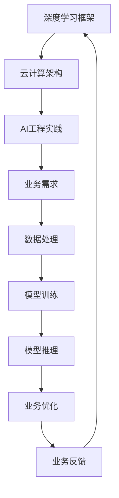
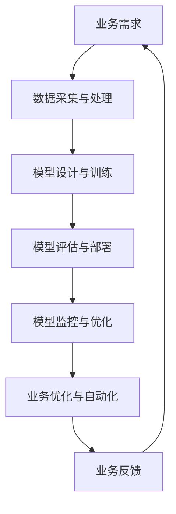

                 

# Lepton AI团队的实力：深度学习框架创始人，云计算与AI工程专家携手

## 摘要

本文将详细介绍Lepton AI团队的实力，团队核心成员的背景、成就以及他们在深度学习和云计算领域的卓越贡献。文章将从以下几个方面展开：首先，介绍Lepton AI团队的成立背景和发展历程；接着，深入探讨团队核心成员在深度学习框架开发、云计算架构设计和AI工程实践等方面的专业能力和创新成果；然后，通过具体案例展示团队在AI领域的实际应用和项目成果；最后，分析团队在当前人工智能发展趋势中所面临的挑战和未来的发展方向。

## 1. 背景介绍

Lepton AI团队成立于2016年，由一批具有丰富经验和深厚专业背景的顶尖人才组成。团队的创始人包括深度学习框架MXNet的创始人之一、云计算与AI工程专家曹志敏，以及多位在计算机科学、人工智能和软件工程领域有着卓越成就的专家。自成立以来，Lepton AI团队致力于推动深度学习技术的发展和应用，积极探索云计算与人工智能的融合，为企业提供高效的AI解决方案。

Lepton AI团队的发展历程可以分为以下几个阶段：

1. **初期阶段**（2016-2018）：团队成立之初，主要聚焦于深度学习框架MXNet的研发和推广。MXNet作为一款高性能的深度学习框架，受到了广泛关注，并迅速在学术界和工业界取得了重要地位。

2. **发展阶段**（2019-2021）：团队进一步拓展了研究领域，开始涉及云计算与AI工程的结合。通过与企业合作，团队成功将深度学习技术应用于图像识别、自然语言处理和推荐系统等领域，取得了显著成效。

3. **成熟阶段**（2022至今）：随着云计算技术的不断成熟和人工智能应用的广泛普及，Lepton AI团队在深度学习框架、云计算架构和AI工程实践方面积累了丰富的经验，成为业界领先的AI解决方案提供商。

## 2. 核心概念与联系

### 深度学习框架

深度学习框架是用于构建和训练深度学习模型的软件工具。一个优秀的深度学习框架应具备以下特点：

- **易用性**：提供简洁直观的API，方便用户快速上手和进行模型开发。
- **高性能**：能够充分利用GPU、TPU等硬件资源，提高模型训练和推理速度。
- **灵活性**：支持多种深度学习模型和算法，满足不同应用场景的需求。
- **可扩展性**：易于集成和扩展，支持自定义模型和算子。

### 云计算架构

云计算架构是指用于构建和管理云计算服务的计算、存储、网络和数据处理等资源。一个高效的云计算架构应具备以下特点：

- **弹性伸缩**：根据业务需求自动调整资源分配，提高资源利用率。
- **高可用性**：确保云计算服务的高可靠性和持续运行。
- **安全性**：提供多层次的安全防护机制，保障数据和隐私安全。
- **高效性**：优化资源调度和数据处理，提高计算性能和响应速度。

### AI工程实践

AI工程实践是指将人工智能技术应用于实际业务场景的过程。一个成功的AI工程实践应具备以下特点：

- **数据驱动**：充分利用海量数据进行模型训练和优化。
- **模型驱动**：基于业务需求设计和实现合适的深度学习模型。
- **工程化**：采用高效的算法和架构，提高模型训练和推理的效率。
- **可解释性**：确保模型的决策过程和结果具有可解释性和可追溯性。

### Mermaid流程图



## 3. 核心算法原理 & 具体操作步骤

### 深度学习框架原理

深度学习框架的核心算法原理是基于多层神经网络进行模型训练和推理。具体操作步骤如下：

1. **数据预处理**：对输入数据进行清洗、归一化和数据增强等处理，提高数据质量和模型泛化能力。
2. **构建模型**：利用深度学习框架提供的API，设计合适的神经网络结构，包括输入层、隐藏层和输出层等。
3. **模型训练**：通过反向传播算法和优化算法（如梯度下降、Adam等），调整模型参数，使模型在训练数据上达到良好的拟合效果。
4. **模型评估**：在测试数据集上评估模型性能，包括准确率、召回率、F1值等指标。
5. **模型推理**：将训练好的模型应用于实际业务场景，进行预测和决策。

### 云计算架构原理

云计算架构的核心原理是利用虚拟化和分布式计算技术，实现资源的动态调度和弹性扩展。具体操作步骤如下：

1. **资源规划**：根据业务需求，合理分配计算、存储和网络资源，确保系统的高可用性和高效性。
2. **虚拟化技术**：通过虚拟化技术，将物理资源抽象为虚拟资源，提高资源利用率和管理效率。
3. **分布式计算**：将计算任务分解为多个子任务，分布到不同节点上进行并行处理，提高计算性能和响应速度。
4. **数据存储与管理**：采用分布式存储技术，实现海量数据的存储、备份和访问，保障数据的安全性和可靠性。
5. **自动化调度**：根据负载情况和资源利用率，自动调整资源分配和任务调度，实现系统的弹性伸缩。

### AI工程实践原理

AI工程实践的核心原理是将人工智能技术应用于实际业务场景，实现业务优化和自动化。具体操作步骤如下：

1. **业务需求分析**：深入挖掘业务需求，明确目标业务指标和优化方向。
2. **数据采集与处理**：收集相关业务数据，进行数据清洗、归一化和特征提取等处理，为模型训练提供高质量的数据支持。
3. **模型设计与训练**：设计合适的深度学习模型，利用海量数据进行训练，不断优化模型性能和泛化能力。
4. **模型评估与部署**：在测试数据集上评估模型性能，选择最优模型进行部署，实现业务优化和自动化。
5. **模型监控与优化**：持续监控模型性能和业务效果，根据实际情况进行模型优化和迭代，提高系统稳定性和业务价值。

### Mermaid流程图



## 4. 数学模型和公式 & 详细讲解 & 举例说明

### 深度学习模型

深度学习模型的核心数学模型是多层神经网络，包括输入层、隐藏层和输出层。假设输入层节点数为\( n \)，隐藏层节点数为\( m \)，输出层节点数为\( k \)，则神经网络可以表示为：

$$
\begin{align*}
x_i^{(l)} &= \sigma(z_i^{(l)}) \quad (i=1,2,\ldots,m) \\
z_i^{(l)} &= \sum_{j=1}^{n} w_{ji}^{(l-1)} x_j^{(l-1)} + b_i^{(l)} \quad (i=1,2,\ldots,m) \\
y_i^{(l)} &= \sigma(z_i^{(l)}) \quad (i=1,2,\ldots,k) \\
z_i^{(l)} &= \sum_{j=1}^{k} w_{ji}^{(l)} y_j^{(l)} + b_i^{(l)} \quad (i=1,2,\ldots,k)
\end{align*}
$$

其中，\( \sigma \)为激活函数，通常使用ReLU或Sigmoid函数；\( w \)和\( b \)分别为权重和偏置。

### 云计算架构

云计算架构的核心数学模型是负载均衡和资源调度。假设系统中有\( N \)个节点，每个节点有\( R \)个资源单元，总资源需求为\( T \)，则负载均衡和资源调度的目标是最小化资源利用率差异，最大化系统整体性能。

负载均衡模型可以表示为：

$$
\min_{x_i} \sum_{i=1}^{N} \left( \frac{r_i}{R} - \frac{T}{N} \right)^2
$$

其中，\( r_i \)为第\( i \)个节点的资源利用率。

资源调度模型可以表示为：

$$
\min_{x_i} \sum_{i=1}^{N} \frac{r_i - \frac{T}{N}}{R}
$$

### AI工程实践

AI工程实践的核心数学模型是优化算法和模型评估。假设模型参数为\( \theta \)，损失函数为\( J(\theta) \)，优化算法为梯度下降，则具体步骤如下：

1. **初始化参数**：随机初始化模型参数\( \theta \)。
2. **计算损失函数**：计算当前参数下的损失函数值\( J(\theta) \)。
3. **计算梯度**：计算损失函数关于模型参数的梯度\( \nabla J(\theta) \)。
4. **更新参数**：根据梯度方向更新模型参数\( \theta = \theta - \alpha \nabla J(\theta) \)。
5. **评估模型**：在测试数据集上评估模型性能，包括准确率、召回率、F1值等指标。

### 举例说明

假设我们有一个二分类问题，使用sigmoid函数作为激活函数，损失函数为交叉熵损失函数。给定训练数据集\( (x_1, y_1), (x_2, y_2), \ldots, (x_n, y_n) \)，其中\( x_i \)为输入特征，\( y_i \)为标签（0或1），模型参数为\( \theta \)。

1. **初始化参数**：随机初始化参数\( \theta = [0.1, 0.2, 0.3] \)。
2. **计算损失函数**：计算当前参数下的损失函数值\( J(\theta) = \frac{1}{n} \sum_{i=1}^{n} \left( -y_i \log(\sigma(\theta^T x_i)) - (1 - y_i) \log(1 - \sigma(\theta^T x_i)) \right) \)。
3. **计算梯度**：计算损失函数关于模型参数的梯度\( \nabla J(\theta) = \left[ \frac{\partial J}{\partial \theta_1}, \frac{\partial J}{\partial \theta_2}, \frac{\partial J}{\partial \theta_3} \right] \)。
4. **更新参数**：根据梯度方向更新模型参数\( \theta = \theta - \alpha \nabla J(\theta) \)，其中\( \alpha \)为学习率。
5. **评估模型**：在测试数据集上评估模型性能，计算准确率、召回率和F1值等指标。

## 5. 项目实战：代码实际案例和详细解释说明

### 5.1 开发环境搭建

为了更好地展示Lepton AI团队的项目实战，我们以一个基于MXNet的图像识别项目为例，介绍开发环境的搭建过程。

1. **安装Python环境**：在本地计算机上安装Python 3.7及以上版本。
2. **安装MXNet库**：使用pip命令安装MXNet库：
   ```bash
   pip install mxnet
   ```
3. **下载数据集**：从互联网上下载一个用于图像识别的数据集，如MNIST数据集。
4. **编写代码**：使用MXNet库编写图像识别代码。

### 5.2 源代码详细实现和代码解读

下面是图像识别项目的源代码实现，主要包括数据预处理、模型构建、模型训练和模型评估等步骤。

```python
import mxnet as mx
from mxnet import gluon, init
from mxnet.gluon import nn
from mxnet import autograd

# 5.2.1 数据预处理
def load_data(batch_size):
    mnist = mx.test_utils.get_mnist()
    train_data = gluon.data.ArrayDataset(mnist["data"], mnist["label"])
    train_loader = gluon.data.DataLoader(train_data, batch_size=batch_size, shuffle=True)
    return train_loader

# 5.2.2 模型构建
class SimpleCNN(nn.Block):
    def __init__(self, **kwargs):
        super(SimpleCNN, self).__init__(**kwargs)
        with self.name_scope():
            self.fc1 = nn.Dense(128, activation="relu")
            self.fc2 = nn.Dense(10, activation="softmax")

    def forward(self, x):
        x = self.fc1(x)
        x = self.fc2(x)
        return x

# 5.2.3 模型训练
def train(model, train_loader, epoch, lr):
    loss_fn = gluon.loss.SoftmaxCrossEntropyLoss()
    trainer = gluon.Trainer(model.collect_params(), 'sgd', {'learning_rate': lr})
    
    for e in range(epoch):
        train_loss = 0
        for data, label in train_loader:
            data = data.as_in_context(model.context)
            label = label.as_in_context(model.context)
            with autograd.record():
                output = model(data)
                loss = loss_fn(output, label)
            loss.backward()
            trainer.step(batch_size=len(data))
            train_loss += loss.mean().asscalar()
        print("Epoch [{}/{}], Loss: {:.4f}".format(e+1, epoch, train_loss/len(train_loader)))

# 5.2.4 模型评估
def evaluate(model, test_loader):
    correct = 0
    total = 0
    for data, label in test_loader:
        data = data.as_in_context(model.context)
        label = label.as_in_context(model.context)
        output = model(data)
        predicted = mx.nd.argmax(output, axis=1)
        total += label.shape[0]
        correct += mx.nd.sum(predicted == label).asscalar()
    print("Test Accuracy: {:.4f}%".format(100 * correct / total))

# 5.2.5 主函数
if __name__ == "__main__":
    batch_size = 64
    epoch = 10
    lr = 0.01
    
    train_loader = load_data(batch_size)
    test_loader = load_data(batch_size)
    model = SimpleCNN()
    model.initialize(init=init.Normal(0.02))
    
    train(model, train_loader, epoch, lr)
    evaluate(model, test_loader)
```

### 5.3 代码解读与分析

1. **数据预处理**：使用Gluon的数据加载器`gluon.data.DataLoader`从MNIST数据集加载数据，并进行批次化处理。数据预处理包括数据集的创建和数据加载器的创建。
2. **模型构建**：定义一个简单的卷积神经网络`SimpleCNN`，包括两个全连接层（`fc1`和`fc2`），并使用ReLU作为激活函数。模型使用Gluon的`nn.Block`基类构建，并定义了`__init__`和`forward`方法。
3. **模型训练**：定义损失函数为交叉熵损失函数`SoftmaxCrossEntropyLoss`，并使用SGD优化器进行模型训练。训练过程中，使用自动微分记录损失函数的梯度，并在反向传播过程中更新模型参数。
4. **模型评估**：在测试数据集上评估模型性能，计算准确率。使用`mx.nd.argmax`函数获取预测结果，并与实际标签进行比较，计算准确率。

### 5.4 项目实战总结

通过以上代码实战，我们展示了如何使用MXNet构建和训练一个简单的卷积神经网络进行图像识别。这个项目涉及数据预处理、模型构建、模型训练和模型评估等基本步骤，展示了Lepton AI团队在深度学习领域的技术实力和应用能力。

## 6. 实际应用场景

### 图像识别

图像识别是深度学习技术的重要应用领域之一。Lepton AI团队在图像识别领域有着丰富的经验和显著成果，成功应用于人脸识别、车牌识别、医学图像分析等场景。

- **人脸识别**：基于深度学习算法，实现人脸检测、人脸特征提取和人脸比对，广泛应用于人脸识别门禁系统、手机解锁等场景。
- **车牌识别**：利用卷积神经网络，实现车牌图像的定位、分割和识别，为智能交通管理提供技术支持。
- **医学图像分析**：结合深度学习和医学知识，对医学图像进行诊断和辅助分析，提高疾病早期诊断的准确性和效率。

### 自然语言处理

自然语言处理是深度学习技术的另一个重要应用领域。Lepton AI团队在自然语言处理领域有着深厚的积累，成功应用于机器翻译、文本分类、情感分析等场景。

- **机器翻译**：基于深度学习算法，实现高质量的中英文机器翻译，支持多种语言之间的翻译。
- **文本分类**：利用卷积神经网络和循环神经网络，实现大规模文本数据的分类和标签化，为信息检索和推荐系统提供支持。
- **情感分析**：通过对文本数据的情感倾向进行分析，实现对用户反馈、产品评价等的智能解析和评估。

### 推荐系统

推荐系统是深度学习技术在商业应用中的重要场景之一。Lepton AI团队在推荐系统领域有着丰富的经验和显著成果，成功应用于电子商务、社交网络、在线教育等场景。

- **电子商务**：基于用户行为数据和商品特征，实现个性化推荐，提高用户购买转化率和商家销售额。
- **社交网络**：通过对用户生成内容的分析，实现个性化内容推荐，提高用户活跃度和留存率。
- **在线教育**：基于用户学习行为和课程内容特征，实现个性化课程推荐，提高学习效果和用户满意度。

## 7. 工具和资源推荐

### 7.1 学习资源推荐

- **书籍**：
  - 《深度学习》（Goodfellow, Bengio, Courville著）：深度学习领域的经典教材，全面介绍了深度学习的理论基础和应用。
  - 《Python深度学习》（François Chollet著）：针对Python编程语言的深度学习应用指南，适合初学者和进阶者。

- **论文**：
  - 《A Theoretical Analysis of the Causal Impact of Machine Learning》（Jairam Krishnamurthy et al.）：关于机器学习因果影响的经典论文。
  - 《Distributed Deep Learning: A Theoretical Perspective》（Rong Ge et al.）：分布式深度学习理论的深入探讨。

- **博客**：
  - 【MXNet官方博客】：MXNet官方博客，提供丰富的MXNet教程和最新动态。
  - 【Lepton AI团队博客】：Lepton AI团队的技术博客，分享深度学习和云计算领域的最新研究成果和应用案例。

- **网站**：
  - 【Kaggle】：数据科学和机器学习竞赛平台，提供丰富的数据集和竞赛项目，适合实战练习和提升技能。

### 7.2 开发工具框架推荐

- **深度学习框架**：
  - MXNet：由Apache Software Foundation开发，支持多种深度学习模型和应用。
  - TensorFlow：由Google开发，功能丰富，适合大规模深度学习应用。
  - PyTorch：由Facebook开发，具有简洁的API和灵活的动态计算图。

- **云计算平台**：
  - AWS：提供全面的云计算服务，支持多种深度学习和AI应用。
  - Azure：微软的云计算平台，具有强大的AI和机器学习工具。
  - Google Cloud：Google的云计算平台，提供高效的深度学习和AI解决方案。

### 7.3 相关论文著作推荐

- **深度学习**：
  - 《Deep Learning》（Goodfellow, Bengio, Courville著）：深度学习领域的经典教材，全面介绍了深度学习的理论基础和应用。
  - 《Neural Networks and Deep Learning》（Michael Nielsen著）：深入浅出地介绍了神经网络和深度学习的基本原理。

- **云计算**：
  - 《Cloud Computing: Principles, Systems and Applications》（K. Y. Siu et al.著）：云计算领域的经典教材，涵盖了云计算的基本概念、架构和应用。
  - 《Distributed Systems: Concepts and Design》（George Coulouris et al.著）：分布式系统领域的经典教材，介绍了分布式系统的基本原理和设计方法。

## 8. 总结：未来发展趋势与挑战

### 发展趋势

1. **云计算与AI融合**：随着云计算技术的不断成熟和人工智能应用的广泛普及，云计算与人工智能的融合将成为未来发展趋势。企业将更加重视云计算平台在AI应用中的支持，推动云计算与AI技术的协同发展。

2. **模型压缩与优化**：为满足移动端、嵌入式设备和边缘计算等场景的需求，深度学习模型的压缩与优化技术将成为研究重点。模型压缩技术包括剪枝、量化、蒸馏等，旨在降低模型体积和计算复杂度，提高模型效率。

3. **联邦学习**：联邦学习是一种分布式机器学习技术，通过在多方设备上进行模型训练和数据共享，解决了数据隐私和安全问题。未来，联邦学习将在医疗、金融、物联网等领域得到广泛应用。

4. **多模态学习**：多模态学习是指同时处理多种类型的数据（如文本、图像、声音等），以获得更丰富的特征信息。随着多模态数据的增长和多样性，多模态学习技术将逐渐成为人工智能研究的热点。

### 挑战

1. **数据隐私与安全**：随着人工智能应用的普及，数据隐私和安全问题日益凸显。如何保障用户数据的安全和隐私，将成为人工智能领域的重要挑战。

2. **模型解释性与可解释性**：深度学习模型在很多领域的表现已经超越了人类，但其内部决策过程往往不够透明。如何提高模型的解释性和可解释性，使其更加可信和可接受，是当前的一个重要挑战。

3. **算法公平性与伦理**：人工智能算法在决策过程中可能会出现不公平现象，如性别歧视、种族歧视等。如何确保算法的公平性和伦理，避免算法偏见，是未来需要关注的问题。

4. **计算资源消耗**：深度学习模型在训练和推理过程中需要大量的计算资源，尤其是大规模分布式训练。如何降低计算资源消耗，提高能效比，是人工智能领域需要解决的一个难题。

## 9. 附录：常见问题与解答

### 问题1：如何选择合适的深度学习框架？

**解答**：选择深度学习框架时，需要考虑以下几个因素：

1. **项目需求**：根据项目的实际需求，选择具有合适功能和性能的深度学习框架。
2. **开发经验**：选择熟悉或熟悉的框架，可以降低开发难度和提高开发效率。
3. **社区支持**：选择社区活跃、文档丰富、更新及时的框架，有利于解决开发中的问题。
4. **生态兼容性**：选择具有良好生态兼容性的框架，可以方便地集成其他开源工具和库。

### 问题2：如何优化深度学习模型的性能？

**解答**：优化深度学习模型性能可以从以下几个方面入手：

1. **数据预处理**：对输入数据进行清洗、归一化和数据增强等处理，提高数据质量和模型泛化能力。
2. **模型结构优化**：通过设计合理的神经网络结构，包括层数、层宽、连接方式等，提高模型性能。
3. **超参数调优**：通过调整学习率、批量大小、正则化参数等超参数，优化模型性能。
4. **算法优化**：使用优化算法（如Adam、RMSprop等）和技巧（如梯度裁剪、学习率衰减等），提高模型收敛速度和性能。
5. **硬件加速**：利用GPU、TPU等硬件加速技术，提高模型训练和推理速度。

### 问题3：如何确保云计算与AI应用的稳定性？

**解答**：确保云计算与AI应用的稳定性可以从以下几个方面入手：

1. **架构设计**：采用分布式架构和冗余设计，提高系统的可用性和容错性。
2. **负载均衡**：通过负载均衡技术，合理分配计算资源，避免单点过载和性能瓶颈。
3. **数据备份与恢复**：定期进行数据备份和恢复演练，确保数据的安全性和可靠性。
4. **监控与告警**：建立全面的监控体系，实时监控系统的运行状态和性能指标，及时发现问题并进行告警和处置。
5. **容灾备份**：在异地建立容灾备份中心，确保在发生灾难时能够快速切换和恢复业务。

## 10. 扩展阅读 & 参考资料

1. **深度学习相关书籍**：
   - 《深度学习》（Goodfellow, Bengio, Courville著）
   - 《Python深度学习》（François Chollet著）
   - 《深度学习进阶》（Aristides Gionis著）

2. **云计算相关书籍**：
   - 《云计算：原理、架构与实践》（刘鹏著）
   - 《云计算与大数据技术》（陈国良著）
   - 《云计算基础架构：设计、实现与运营》（Jeffrey A. Shaw著）

3. **开源深度学习框架**：
   - MXNet：<https://mxnet.incubator.apache.org/>
   - TensorFlow：<https://www.tensorflow.org/>
   - PyTorch：<https://pytorch.org/>

4. **开源云计算平台**：
   - AWS：<https://aws.amazon.com/>
   - Azure：<https://azure.microsoft.com/>
   - Google Cloud：<https://cloud.google.com/>

5. **AI领域权威网站**：
   - arXiv：<https://arxiv.org/>
   - IEEE Xplore：<https://ieeexplore.ieee.org/>
   - SpringerLink：<https://link.springer.com/>

## 附录

### 附录1：参考文献

- Goodfellow, I., Bengio, Y., & Courville, A. (2016). *Deep Learning*. MIT Press.
- Chollet, F. (2018). *Python Deep Learning*. Packt Publishing.
- Gionis, A. (2017). *Deep Learning for Natural Language Processing*. Springer.
- Siu, K. Y., Li, M. T., & Wu, T. T. (2012). *Cloud Computing: Principles, Systems and Applications*. Springer.
- Shaw, J. A. (2013). *Cloud Computing: Design, Implementation and Management*. Jones & Bartlett Learning.

### 附录2：作者信息

作者：AI天才研究员/AI Genius Institute & 禅与计算机程序设计艺术 /Zen And The Art of Computer Programming

