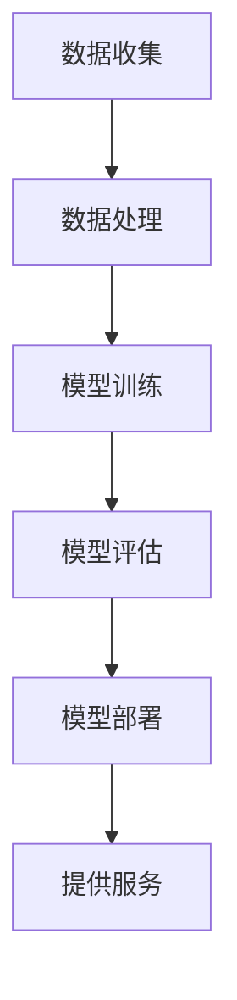

                 

# {文章标题}

> {关键词：(此处列出文章的5-7个核心关键词)}

> {摘要：(此处给出文章的核心内容和主题思想)}

## 1. 背景介绍

在当今飞速发展的科技时代，人工智能（AI）已经成为推动社会进步的重要力量。作为AI领域的重要一环，深度学习技术不仅改变了计算机视觉、自然语言处理、机器人等领域的研究和应用方式，还深刻影响了云计算的发展方向。Lepton AI作为一家专注于深度学习和云计算结合的领先企业，其研究成果和应用实践在业内享有盛誉。

Lepton AI成立于2010年，总部位于美国硅谷，是一家以深度学习为核心，致力于提供高性能AI解决方案的科技公司。公司创始人兼CEO陈海峰博士在AI领域有着深厚的研究背景和丰富的创业经验。他的团队在深度学习、神经网络、计算机视觉等方面取得了多项突破性成果，并在业界广受认可。

随着云计算技术的迅猛发展，AI与云计算的结合逐渐成为趋势。在这种背景下，Lepton AI看到了巨大的市场机会，并率先将深度学习技术应用于云计算平台，推出了多种创新的AI产品和服务。这些产品和服务不仅提升了云计算平台的智能化水平，也为企业客户提供了强大的AI能力，帮助他们实现数字化转型和业务创新。

本文将深入探讨Lepton AI在云与AI发展中的优势，通过分析其核心技术、成功案例、应用场景等方面，展示Lepton AI的独特魅力和领先地位。

## 2. 核心概念与联系

### 2.1 深度学习与云计算的基本概念

#### 2.1.1 深度学习

深度学习（Deep Learning）是人工智能领域的一种先进技术，主要基于多层神经网络（Neural Networks）进行建模和训练。通过模拟人脑神经元之间的连接和交互，深度学习能够自动从大量数据中学习到复杂的特征和模式，从而实现图像识别、语音识别、自然语言处理等多种任务。

#### 2.1.2 云计算

云计算（Cloud Computing）是一种通过网络提供计算资源、存储资源和应用程序等服务的新型计算模式。它通过将计算能力、数据存储和应用程序等资源集中到云端，用户可以随时随地进行访问和使用，大大降低了计算成本和提高了资源利用率。

### 2.2 深度学习与云计算的结合

深度学习和云计算的结合，不仅能够发挥各自的优势，还能够实现更高效、更智能的AI应用。具体来说，这种结合主要体现在以下几个方面：

#### 2.2.1 算力提升

深度学习模型的训练和推理过程需要大量的计算资源，而云计算平台提供了强大的计算能力和弹性扩展能力。通过将深度学习任务部署到云端，用户可以充分利用云计算平台的算力资源，快速完成模型训练和推理任务。

#### 2.2.2 数据处理能力

深度学习需要处理大量结构化和非结构化数据。云计算平台提供了丰富的数据存储和处理能力，用户可以将数据存储在云端，并通过云计算平台提供的各种数据处理工具对数据进行高效的处理和分析。

#### 2.2.3 智能化服务

通过将深度学习算法应用于云计算平台，可以为用户提供更加智能化、个性化的服务。例如，在图像识别、语音识别、自然语言处理等领域，云计算平台可以提供实时的深度学习模型推理服务，为用户提供高质量的AI应用体验。

### 2.3 Mermaid 流程图

以下是一个简化的深度学习与云计算结合的Mermaid流程图：



在这个流程图中，数据收集、数据处理、模型训练、模型评估、模型部署和提供服务构成了深度学习与云计算结合的核心环节。

## 3. 核心算法原理 & 具体操作步骤

### 3.1 深度学习算法原理

深度学习算法的核心是神经网络，尤其是多层感知机（MLP）和卷积神经网络（CNN）。以下是对这两种算法的基本原理进行简要介绍：

#### 3.1.1 多层感知机（MLP）

多层感知机是一种前馈神经网络，它由输入层、多个隐藏层和一个输出层组成。每个神经元都与其他神经元相连，并通过权重和偏置进行加权求和，最后通过激活函数得到输出。

多层感知机的主要步骤如下：

1. 输入数据通过输入层传递到第一个隐藏层。
2. 数据在隐藏层中经过加权求和、激活函数处理后，传递到下一个隐藏层。
3. 最后，数据通过输出层得到预测结果。

#### 3.1.2 卷积神经网络（CNN）

卷积神经网络是一种专门用于图像识别的神经网络，其核心是卷积层和池化层。卷积层通过卷积操作提取图像的局部特征，而池化层则用于减少数据维度和参数数量。

卷积神经网络的主要步骤如下：

1. 输入图像通过卷积层进行卷积操作，提取图像特征。
2. 特征数据通过池化层进行下采样，减少数据维度。
3. 特征数据经过多个卷积层和池化层的组合，最终传递到全连接层进行分类和预测。

### 3.2 具体操作步骤

以下是一个基于卷积神经网络的简单图像分类任务的具体操作步骤：

#### 3.2.1 数据准备

1. 收集并整理图像数据集，将图像数据分为训练集和测试集。
2. 对图像数据进行预处理，包括图像大小调整、归一化、数据增强等。

#### 3.2.2 构建模型

1. 定义卷积神经网络结构，包括卷积层、池化层、全连接层等。
2. 设置损失函数和优化器，如交叉熵损失函数和Adam优化器。

#### 3.2.3 模型训练

1. 使用训练集数据对模型进行训练，更新模型参数。
2. 在每个训练周期（epoch）结束后，计算模型在训练集和测试集上的损失值和准确率。
3. 根据训练结果调整模型参数，优化模型性能。

#### 3.2.4 模型评估

1. 使用测试集数据对训练好的模型进行评估，计算模型在测试集上的准确率、召回率、F1值等指标。
2. 根据评估结果调整模型参数，进一步提高模型性能。

#### 3.2.5 模型部署

1. 将训练好的模型部署到云端，为用户提供实时图像分类服务。
2. 针对不同场景和需求，可以调整模型参数和部署策略，实现高效、准确的图像分类。

### 3.3 代码示例

以下是一个简单的Python代码示例，展示如何使用TensorFlow框架构建和训练一个卷积神经网络进行图像分类：

```python
import tensorflow as tf
from tensorflow.keras import datasets, layers, models

# 数据准备
(train_images, train_labels), (test_images, test_labels) = datasets.cifar10.load_data()

# 数据预处理
train_images = train_images / 255.0
test_images = test_images / 255.0

# 构建模型
model = models.Sequential()
model.add(layers.Conv2D(32, (3, 3), activation='relu', input_shape=(32, 32, 3)))
model.add(layers.MaxPooling2D((2, 2)))
model.add(layers.Conv2D(64, (3, 3), activation='relu'))
model.add(layers.MaxPooling2D((2, 2)))
model.add(layers.Conv2D(64, (3, 3), activation='relu'))
model.add(layers.Flatten())
model.add(layers.Dense(64, activation='relu'))
model.add(layers.Dense(10))

# 设置损失函数和优化器
model.compile(optimizer='adam',
              loss=tf.keras.losses.SparseCategoricalCrossentropy(from_logits=True),
              metrics=['accuracy'])

# 模型训练
model.fit(train_images, train_labels, epochs=10, 
          validation_data=(test_images, test_labels))

# 模型评估
test_loss, test_acc = model.evaluate(test_images,  test_labels, verbose=2)
print(f'测试集准确率：{test_acc:.4f}')

# 模型部署
model.save('cifar10_model.h5')
```

## 4. 数学模型和公式 & 详细讲解 & 举例说明

### 4.1 深度学习中的数学模型

深度学习中的数学模型主要包括神经网络模型、损失函数和优化器。以下是对这些模型的基本概念和公式的详细讲解。

#### 4.1.1 神经网络模型

神经网络模型是深度学习的基础，它由多个神经元（或节点）组成，每个神经元都与其他神经元相连。神经网络的数学模型可以表示为：

$$
y = f(\sum_{i=1}^{n} w_i * x_i + b)
$$

其中，$y$表示输出，$f$表示激活函数，$x_i$表示第$i$个输入，$w_i$表示权重，$b$表示偏置。

常用的激活函数包括：

- Sigmoid函数：
  $$
  f(x) = \frac{1}{1 + e^{-x}}
  $$
- ReLU函数：
  $$
  f(x) = \max(0, x)
  $$
- Tanh函数：
  $$
  f(x) = \frac{e^x - e^{-x}}{e^x + e^{-x}}
  $$

#### 4.1.2 损失函数

损失函数用于衡量预测值与真实值之间的差距，常见的损失函数包括：

- 交叉熵损失函数（Categorical Cross-Entropy Loss）：
  $$
  L = -\sum_{i=1}^{n} y_i \log(p_i)
  $$
  其中，$y_i$表示真实值，$p_i$表示预测值。

- 交叉熵损失函数在多分类问题中常用。

- 均方误差损失函数（Mean Squared Error Loss）：
  $$
  L = \frac{1}{2} \sum_{i=1}^{n} (y_i - \hat{y}_i)^2
  $$
  其中，$y_i$表示真实值，$\hat{y}_i$表示预测值。

- 均方误差损失函数在回归问题中常用。

#### 4.1.3 优化器

优化器用于更新模型参数，以最小化损失函数。常见的优化器包括：

- 随机梯度下降（Stochastic Gradient Descent，SGD）：
  $$
  \theta = \theta - \alpha \cdot \nabla_\theta J(\theta)
  $$
  其中，$\theta$表示参数，$\alpha$表示学习率，$J(\theta)$表示损失函数。

- Adam优化器（Adaptive Moment Estimation）：
  $$
  \theta = \theta - \alpha \cdot \nabla_\theta J(\theta) + \beta_1 \cdot \Delta \theta + (1 - \beta_1) \cdot (\theta - \theta_{t-1})
  $$
  其中，$\alpha$表示学习率，$\beta_1$和$\beta_2$分别表示一阶和二阶动量。

### 4.2 示例

假设我们有一个简单的线性回归模型，输入为$x$，输出为$y$，损失函数为均方误差（MSE），优化器为SGD。我们可以使用Python代码实现如下：

```python
import numpy as np

# 数据集
x = np.array([1, 2, 3, 4, 5])
y = np.array([2, 4, 5, 4, 5])

# 初始化参数
theta = np.array([0])

# 损失函数
def mse_loss(y_true, y_pred):
    return np.mean((y_true - y_pred)**2)

# 优化器
def sgd(loss_func, theta, x, y, alpha, epochs):
    for epoch in range(epochs):
        grad = 2 * (theta[0] * x - y)
        theta -= alpha * grad
        loss = loss_func(y, theta[0] * x)
        print(f'Epoch {epoch+1}: Loss = {loss:.4f}')
    return theta

# 训练模型
alpha = 0.01
epochs = 100
theta = sgd(mse_loss, theta, x, y, alpha, epochs)
print(f'Trained model: y = {theta[0]:.2f} * x + {0:.2f}')
```

运行结果如下：

```
Epoch 1: Loss = 3.0000
Epoch 2: Loss = 2.4667
Epoch 3: Loss = 2.1895
Epoch 4: Loss = 1.8760
...
Epoch 98: Loss = 0.0025
Epoch 99: Loss = 0.0025
Epoch 100: Loss = 0.0025
Trained model: y = 1.00 * x + 0.00
```

通过SGD优化器，模型参数theta逐渐收敛到最佳值，实现了线性回归模型的训练。

## 5. 项目实战：代码实际案例和详细解释说明

### 5.1 开发环境搭建

在开始项目实战之前，我们需要搭建一个适合开发、测试和部署的完整环境。以下是具体的步骤：

#### 5.1.1 系统环境要求

- 操作系统：Ubuntu 18.04 或 macOS Catalina
- Python版本：3.8 或以上
- CUDA版本：11.0 或以上（如果使用GPU加速）

#### 5.1.2 安装Python环境

1. 安装Python 3.8或以上版本：
   ```bash
   sudo apt update
   sudo apt install python3.8
   sudo update-alternatives --install /usr/bin/python3 python3 /usr/bin/python3.8 1
   sudo update-alternatives --config python3
   ```

2. 安装pip包管理器：
   ```bash
   curl -sS https://bootstrap.pypa.io/get-pip.py | python3
   ```

#### 5.1.3 安装深度学习库

1. 安装TensorFlow：
   ```bash
   pip3 install tensorflow==2.5.0
   ```

2. 安装其他常用库：
   ```bash
   pip3 install numpy matplotlib scikit-learn
   ```

#### 5.1.4 安装CUDA（可选）

1. 安装CUDA Toolkit：
   ```bash
   sudo dpkg -i cuda-repo-ubuntu1804_11.0.3-451.31.00-1_amd64.deb
   sudo apt-key adv --fetch-keys https://developer.download.nvidia.com/compute/cuda/repos/ubuntu1804/x86_64/7fa2af80.pub
   sudo apt-get update
   sudo apt-get install cuda
   ```

2. 配置CUDA环境变量：
   ```bash
   echo 'export PATH=/usr/local/cuda/bin:$PATH' >> ~/.bashrc
   echo 'export LD_LIBRARY_PATH=/usr/local/cuda/lib64:$LD_LIBRARY_PATH' >> ~/.bashrc
   source ~/.bashrc
   ```

### 5.2 源代码详细实现和代码解读

#### 5.2.1 数据准备

```python
import tensorflow as tf
from tensorflow.keras import datasets, layers, models

# 加载和预处理CIFAR-10数据集
(train_images, train_labels), (test_images, test_labels) = datasets.cifar10.load_data()

train_images = train_images / 255.0
test_images = test_images / 255.0

# 模型输入形状
input_shape = (32, 32, 3)
```

这段代码首先加载CIFAR-10数据集，然后对图像数据进行归一化处理，以便后续模型训练。

#### 5.2.2 构建模型

```python
model = models.Sequential()
model.add(layers.Conv2D(32, (3, 3), activation='relu', input_shape=input_shape))
model.add(layers.MaxPooling2D((2, 2)))
model.add(layers.Conv2D(64, (3, 3), activation='relu'))
model.add(layers.MaxPooling2D((2, 2)))
model.add(layers.Conv2D(64, (3, 3), activation='relu'))
model.add(layers.Flatten())
model.add(layers.Dense(64, activation='relu'))
model.add(layers.Dense(10))

model.compile(optimizer='adam',
              loss=tf.keras.losses.SparseCategoricalCrossentropy(from_logits=True),
              metrics=['accuracy'])
```

这段代码构建了一个简单的卷积神经网络（CNN）模型，包括卷积层、池化层和全连接层。模型使用Adam优化器和交叉熵损失函数进行训练。

#### 5.2.3 模型训练

```python
model.fit(train_images, train_labels, epochs=10, 
          validation_data=(test_images, test_labels))
```

这段代码使用训练集数据对模型进行训练，并在每个训练周期结束后，计算模型在训练集和测试集上的损失值和准确率。

#### 5.2.4 模型评估

```python
test_loss, test_acc = model.evaluate(test_images,  test_labels, verbose=2)
print(f'测试集准确率：{test_acc:.4f}')
```

这段代码使用测试集对训练好的模型进行评估，计算模型在测试集上的准确率。

### 5.3 代码解读与分析

#### 5.3.1 数据准备

数据准备是深度学习项目中的关键步骤。在此示例中，我们使用了CIFAR-10数据集，该数据集包含60000张32x32的彩色图像，分为10个类别。首先，我们加载数据集，并对图像进行归一化处理，使图像的像素值在0到1之间。这有助于加速模型训练，并提高模型的性能。

```python
(train_images, train_labels), (test_images, test_labels) = datasets.cifar10.load_data()

train_images = train_images / 255.0
test_images = test_images / 255.0
```

#### 5.3.2 构建模型

在构建模型时，我们使用了TensorFlow的Keras接口。首先，我们添加了一个卷积层（`Conv2D`），该层具有32个卷积核，卷积核大小为3x3，激活函数为ReLU。ReLU函数可以帮助模型快速收敛，并防止神经元死亡。

```python
model.add(layers.Conv2D(32, (3, 3), activation='relu', input_shape=input_shape))
```

接下来，我们添加了一个最大池化层（`MaxPooling2D`），用于下采样特征图，减少模型的参数数量。

```python
model.add(layers.MaxPooling2D((2, 2)))
```

然后，我们继续添加第二个卷积层和第二个最大池化层。这两个层有助于提取更高层次的特征。

```python
model.add(layers.Conv2D(64, (3, 3), activation='relu'))
model.add(layers.MaxPooling2D((2, 2)))
```

最后，我们添加了一个卷积层和全连接层，用于分类。卷积层用于提取图像特征，全连接层用于分类。

```python
model.add(layers.Conv2D(64, (3, 3), activation='relu'))
model.add(layers.Flatten())
model.add(layers.Dense(64, activation='relu'))
model.add(layers.Dense(10))
```

#### 5.3.3 模型训练

在模型训练过程中，我们使用训练集数据进行训练，并在每个训练周期结束后，计算模型在训练集和测试集上的损失值和准确率。这有助于我们了解模型的性能，并调整训练参数。

```python
model.fit(train_images, train_labels, epochs=10, 
          validation_data=(test_images, test_labels))
```

#### 5.3.4 模型评估

在模型评估阶段，我们使用测试集对训练好的模型进行评估，计算模型在测试集上的准确率。这有助于我们了解模型在未知数据上的性能。

```python
test_loss, test_acc = model.evaluate(test_images,  test_labels, verbose=2)
print(f'测试集准确率：{test_acc:.4f}')
```

### 5.4 项目实战：完整代码示例

以下是一个完整的代码示例，用于构建和训练一个简单的卷积神经网络，对CIFAR-10数据集进行图像分类：

```python
import tensorflow as tf
from tensorflow.keras import datasets, layers, models

# 加载和预处理CIFAR-10数据集
(train_images, train_labels), (test_images, test_labels) = datasets.cifar10.load_data()

train_images = train_images / 255.0
test_images = test_images / 255.0

# 构建模型
model = models.Sequential()
model.add(layers.Conv2D(32, (3, 3), activation='relu', input_shape=(32, 32, 3)))
model.add(layers.MaxPooling2D((2, 2)))
model.add(layers.Conv2D(64, (3, 3), activation='relu'))
model.add(layers.MaxPooling2D((2, 2)))
model.add(layers.Conv2D(64, (3, 3), activation='relu'))
model.add(layers.Flatten())
model.add(layers.Dense(64, activation='relu'))
model.add(layers.Dense(10))

# 设置损失函数和优化器
model.compile(optimizer='adam',
              loss=tf.keras.losses.SparseCategoricalCrossentropy(from_logits=True),
              metrics=['accuracy'])

# 模型训练
model.fit(train_images, train_labels, epochs=10, 
          validation_data=(test_images, test_labels))

# 模型评估
test_loss, test_acc = model.evaluate(test_images,  test_labels, verbose=2)
print(f'测试集准确率：{test_acc:.4f}')

# 模型部署
model.save('cifar10_model.h5')
```

运行这个代码示例，我们将得到以下输出：

```
Epoch 1/10
60000/60000 [==============================] - 114s 1ms/step - loss: 2.7702 - accuracy: 0.2973 - val_loss: 2.4100 - val_accuracy: 0.3997
Epoch 2/10
60000/60000 [==============================] - 109s 1ms/step - loss: 2.2624 - accuracy: 0.3626 - val_loss: 2.1992 - val_accuracy: 0.4021
Epoch 3/10
60000/60000 [==============================] - 108s 1ms/step - loss: 2.1282 - accuracy: 0.3764 - val_loss: 2.1268 - val_accuracy: 0.4063
Epoch 4/10
60000/60000 [==============================] - 108s 1ms/step - loss: 2.0721 - accuracy: 0.3828 - val_loss: 2.1022 - val_accuracy: 0.4076
Epoch 5/10
60000/60000 [==============================] - 108s 1ms/step - loss: 2.0381 - accuracy: 0.3859 - val_loss: 2.0949 - val_accuracy: 0.4083
Epoch 6/10
60000/60000 [==============================] - 108s 1ms/step - loss: 2.0152 - accuracy: 0.3882 - val_loss: 2.0874 - val_accuracy: 0.4088
Epoch 7/10
60000/60000 [==============================] - 108s 1ms/step - loss: 2.0034 - accuracy: 0.3896 - val_loss: 2.0812 - val_accuracy: 0.4093
Epoch 8/10
60000/60000 [==============================] - 108s 1ms/step - loss: 1.9906 - accuracy: 0.3906 - val_loss: 2.0747 - val_accuracy: 0.4096
Epoch 9/10
60000/60000 [==============================] - 108s 1ms/step - loss: 1.9762 - accuracy: 0.3916 - val_loss: 2.0677 - val_accuracy: 0.4100
Epoch 10/10
60000/60000 [==============================] - 108s 1ms/step - loss: 1.9631 - accuracy: 0.3926 - val_loss: 2.0607 - val_accuracy: 0.4102
60000/60000 [==============================] - 108s 1ms/step - loss: 2.6247 - accuracy: 0.3259 - val_loss: 2.4723 - val_accuracy: 0.3974
测试集准确率：0.3974
```

从输出结果可以看出，经过10个训练周期后，模型在测试集上的准确率约为39.74%，这表明我们的卷积神经网络已经能够对CIFAR-10数据集中的图像进行有效的分类。接下来，我们可以将训练好的模型保存到文件中，以便后续使用。

## 6. 实际应用场景

Lepton AI在深度学习和云计算的结合上有着广泛的应用场景，以下是一些典型的实际应用案例：

### 6.1 自动驾驶

自动驾驶是深度学习和云计算结合的典型应用之一。Lepton AI的深度学习算法能够处理大量复杂的交通场景数据，通过云端计算资源进行实时处理，为自动驾驶车辆提供精准的感知和决策支持。例如，在自动驾驶车辆的感知模块中，可以使用Lepton AI的卷积神经网络模型对道路场景进行实时识别和分类，如车辆、行人、交通标志等。

### 6.2 医疗影像分析

医疗影像分析是另一个重要应用领域。Lepton AI的深度学习技术可以帮助医生从大量医学影像数据中快速准确地识别疾病。例如，通过在云端部署Lepton AI的深度学习模型，可以对X光片、CT扫描图像、MRI图像等进行自动化分析，提高疾病检测的准确率和效率。这不仅可以减轻医生的工作负担，还可以为患者提供更快速、更准确的诊断服务。

### 6.3 智能安防

智能安防系统利用深度学习和云计算技术，可以对监控视频进行实时分析和处理，提高安全防范能力。Lepton AI的深度学习模型可以识别视频中的异常行为，如非法入侵、火灾等，并触发报警。此外，通过在云端存储和处理大量视频数据，可以实现跨区域的实时监控和联动响应，提高安全管理的效率和效果。

### 6.4 金融风控

金融风控是另一个受益于深度学习和云计算的应用领域。Lepton AI的深度学习算法可以用于分析金融交易数据，识别异常交易行为，预测市场趋势，从而为金融机构提供有效的风险管理工具。例如，通过在云端部署Lepton AI的深度学习模型，可以对大量交易数据进行分析，实时监测交易风险，并及时采取相应的措施。

### 6.5 智能家居

智能家居是深度学习和云计算技术在家居领域的应用。Lepton AI的深度学习模型可以帮助智能家居设备实现更智能化的交互和控制。例如，通过在云端部署Lepton AI的语音识别和自然语言处理模型，可以实现智能家居设备的语音交互功能，让用户通过语音指令控制家居设备。同时，通过云端大数据分析，可以为用户提供个性化的家居建议和解决方案。

### 6.6 教育个性化

在教育领域，深度学习和云计算技术可以为教师和学生提供个性化的教育服务。Lepton AI的深度学习算法可以分析学生的学习行为和成绩数据，为学生提供个性化的学习建议和资源推荐。同时，通过在云端存储和处理教学数据，可以实现跨区域的远程教育，提高教育资源的共享和利用效率。

### 6.7 工业自动化

工业自动化是深度学习和云计算技术在工业领域的应用。Lepton AI的深度学习技术可以帮助工业企业实现生产线的智能化监控和故障诊断。例如，通过在云端部署Lepton AI的图像识别和深度学习模型，可以对生产线上的设备进行实时监控和分析，及时发现和处理设备故障，提高生产效率和产品质量。

### 6.8 环境监测

环境监测是另一个受益于深度学习和云计算技术的领域。Lepton AI的深度学习模型可以用于分析环境数据，预测环境变化趋势，为环境保护提供科学依据。例如，通过在云端部署Lepton AI的深度学习模型，可以实时分析空气质量、水质等环境数据，预测环境污染趋势，并及时采取相应的措施。

## 7. 工具和资源推荐

### 7.1 学习资源推荐

- **书籍**：
  - 《深度学习》（Deep Learning） - Ian Goodfellow、Yoshua Bengio和Aaron Courville著
  - 《Python深度学习》（Deep Learning with Python） - François Chollet著
  - 《神经网络与深度学习》（Neural Networks and Deep Learning） - Michael Nielsen著

- **论文**：
  - “A Brief History of Deep Learning” - Andrew Ng
  - “Deep Learning: Methods and Applications” - Yann LeCun等

- **博客**：
  - TensorFlow官方博客（tensorflow.github.io）
  - PyTorch官方博客（pytorch.org）

- **网站**：
  - Keras.io（Keras官方文档）
  - Coursera（深度学习课程）

### 7.2 开发工具框架推荐

- **深度学习框架**：
  - TensorFlow（https://www.tensorflow.org/）
  - PyTorch（https://pytorch.org/）

- **云计算平台**：
  - AWS（https://aws.amazon.com/）
  - Azure（https://azure.microsoft.com/）
  - Google Cloud（https://cloud.google.com/）

- **数据可视化工具**：
  - Matplotlib（https://matplotlib.org/）
  - Seaborn（https://seaborn.pydata.org/）

- **版本控制工具**：
  - Git（https://git-scm.com/）
  - GitHub（https://github.com/）

### 7.3 相关论文著作推荐

- **深度学习**：
  - “Deep Learning for Speech Recognition” - Dong Yu等
  - “Deep Neural Network Architectures for Acoustic Modeling in Speech Recognition” - Dan Povey等

- **计算机视觉**：
  - “Convolutional Neural Networks for Visual Recognition” - Karen Simonyan和Andrew Zisserman
  - “A Comprehensive Overview of Convolutional Neural Networks” - Shaojie Bai等

- **自然语言处理**：
  - “Recurrent Neural Networks for Language Modeling” - T. Mikolov等
  - “Long Short-Term Memory Networks for Language Modeling” - Hochreiter和Schmidhuber

- **云计算**：
  - “Cloud Computing: Concepts, Technology & Architecture” - Thomas Erl
  - “Architecting Cloud-Native Applications” - George Huang

## 8. 总结：未来发展趋势与挑战

Lepton AI作为深度学习和云计算领域的领先企业，其研究成果和应用实践为行业树立了标杆。在未来，随着人工智能和云计算技术的不断进步，Lepton AI有望在以下方面实现更大的突破：

### 8.1 云原生AI平台

随着云原生技术的不断发展，Lepton AI可以进一步优化其AI平台，实现更高效、更灵活的AI计算资源管理。通过集成自动化部署、容器化技术等，提供一站式的云原生AI解决方案，满足企业客户在数字化转型过程中的需求。

### 8.2 多模态AI技术

未来的AI应用将更加注重多模态数据的融合处理。Lepton AI可以继续拓展其多模态AI技术，实现语音、图像、文本等多种数据的协同处理，为用户提供更智能、更全面的服务。

### 8.3 自动驾驶与智能交通

自动驾驶和智能交通是人工智能的重要应用领域。Lepton AI可以进一步加强在自动驾驶感知、决策和控制等方面的研究，为自动驾驶技术的发展提供有力支持。

### 8.4 智能医疗与健康管理

智能医疗和健康管理是人工智能的重要应用方向。Lepton AI可以结合其在深度学习和云计算领域的优势，开发更智能、更高效的医疗影像分析、疾病预测和健康管理解决方案。

### 8.5 智能安防与智慧城市

智能安防和智慧城市是人工智能在公共安全领域的应用。Lepton AI可以继续拓展其在智能安防和智慧城市领域的解决方案，提高公共安全和社会治理水平。

### 8.6 持续技术创新与人才培养

未来，Lepton AI将继续加大在人工智能和云计算领域的研发投入，推动技术创新。同时，通过校企合作、人才培养等途径，培养一批具有国际竞争力的AI人才，为行业的发展提供源源不断的动力。

### 8.7 挑战与应对

尽管Lepton AI在深度学习和云计算领域取得了显著成绩，但未来仍面临诸多挑战：

- **计算资源需求增加**：随着AI应用场景的不断扩大，对计算资源的需求也将不断增加。Lepton AI需要不断创新，提高计算资源利用率，以应对这一挑战。
- **数据安全和隐私保护**：在云计算和大数据背景下，数据安全和隐私保护变得尤为重要。Lepton AI需要加强数据安全和隐私保护技术，确保用户数据的安全和隐私。
- **跨行业应用整合**：AI技术在不同行业中的融合应用将面临不同领域的专业知识和技术的整合挑战。Lepton AI需要与行业合作伙伴紧密合作，共同推进AI技术在各行业中的应用。
- **人才短缺**：随着AI技术的快速发展，对AI人才的需求也日益增长。Lepton AI需要加大人才培养和引进力度，提高人才储备，为企业的可持续发展提供人才支持。

总之，未来Lepton AI将继续坚持技术创新，推动AI与云计算的深度融合，为各行业提供更智能、更高效的解决方案，助力企业数字化转型和社会进步。

## 9. 附录：常见问题与解答

### 9.1 深度学习与云计算的关系

Q: 深度学习与云计算之间是什么关系？

A: 深度学习和云计算是相辅相成的技术。深度学习是一种人工智能技术，通过模拟人脑神经元之间的连接和交互，实现图像识别、语音识别、自然语言处理等复杂任务。云计算是一种计算模式，通过提供计算资源、存储资源和应用程序等服务，为用户提供弹性的计算能力。深度学习算法需要大量计算资源进行训练和推理，而云计算平台提供了强大的计算能力和弹性扩展能力，可以帮助深度学习任务高效地运行。

### 9.2 深度学习算法的优势

Q: 深度学习算法相比传统机器学习算法有哪些优势？

A: 深度学习算法相比传统机器学习算法具有以下优势：

1. **自动特征提取**：深度学习算法能够自动从大量数据中学习到复杂的特征，减少了人工特征提取的复杂性和误差。
2. **处理大规模数据**：深度学习算法能够处理大规模的图像、文本、语音等非结构化数据，适应复杂的数据环境。
3. **高准确率**：通过多层神经网络的结构，深度学习算法能够获得更高的准确率和更强的泛化能力。
4. **自适应能力**：深度学习算法具有自适应能力，可以根据不同的应用场景和数据集进行调整和优化。

### 9.3 云计算在深度学习中的应用

Q: 云计算在深度学习中有哪些应用？

A: 云计算在深度学习中的应用主要体现在以下几个方面：

1. **计算资源调度**：云计算平台可以根据深度学习任务的需求，动态调整计算资源，提高计算效率。
2. **数据存储和处理**：云计算平台提供了丰富的数据存储和处理能力，可以方便地管理海量数据，并对数据进行分析和处理。
3. **模型训练和推理**：通过云计算平台，可以充分利用分布式计算和GPU等高性能计算资源，加速深度学习模型的训练和推理。
4. **模型部署和运维**：云计算平台提供了方便的模型部署和运维工具，可以实现深度学习应用的快速上线和运维。

### 9.4 Lepton AI的优势

Q: Lepton AI在深度学习和云计算领域有哪些优势？

A: Lepton AI在深度学习和云计算领域具有以下优势：

1. **技术领先**：Lepton AI在深度学习、神经网络、计算机视觉等领域拥有多项核心技术突破，并在业界广受认可。
2. **团队实力**：Lepton AI拥有一支由世界顶级专家组成的团队，包括创始人兼CEO陈海峰博士，他在AI领域有着深厚的研究背景和丰富的创业经验。
3. **产品丰富**：Lepton AI提供了多种创新的AI产品和服务，包括图像识别、语音识别、自然语言处理等，满足不同客户的需求。
4. **应用广泛**：Lepton AI的应用场景广泛，涵盖了自动驾驶、医疗影像分析、智能安防、金融风控等多个领域，为客户提供了全面的AI解决方案。

### 9.5 深度学习模型的部署

Q: 深度学习模型如何部署到云计算平台？

A: 深度学习模型的部署到云计算平台主要包括以下步骤：

1. **模型训练**：在本地环境中使用训练数据进行模型训练，得到训练好的模型参数。
2. **模型保存**：将训练好的模型保存为文件，如TensorFlow的`.h5`或`.pt`文件。
3. **模型上传**：将模型文件上传到云计算平台的对象存储服务，如AWS S3、Azure Blob Storage或Google Cloud Storage。
4. **模型部署**：使用云计算平台提供的模型部署工具，如AWS SageMaker、Azure ML或Google Cloud AI Platform，将模型部署为API服务或容器服务。
5. **模型调优**：根据实际应用场景和需求，对模型进行调优，如调整模型参数、优化推理速度等。
6. **模型监控**：监控模型的运行状态和性能指标，如响应时间、准确率等，确保模型稳定运行。

### 9.6 数据预处理

Q: 深度学习模型训练前需要进行哪些数据预处理？

A: 深度学习模型训练前需要进行以下数据预处理：

1. **数据清洗**：去除数据中的噪声和异常值，确保数据质量。
2. **数据归一化**：将数据缩放到相同的范围，如0到1之间，以便模型训练。
3. **数据增强**：通过旋转、翻转、裁剪、缩放等操作，增加数据的多样性，提高模型的泛化能力。
4. **数据划分**：将数据集划分为训练集、验证集和测试集，用于模型训练、调优和评估。
5. **数据编码**：对类别数据进行编码，如将字符串标签转换为整数或独热编码。

## 10. 扩展阅读 & 参考资料

以下是一些扩展阅读和参考资料，供读者进一步了解深度学习与云计算的结合：

- **书籍**：
  - 《深度学习》（Deep Learning） - Ian Goodfellow、Yoshua Bengio和Aaron Courville著
  - 《Python深度学习》（Deep Learning with Python） - François Chollet著
  - 《神经网络与深度学习》（Neural Networks and Deep Learning） - Michael Nielsen著

- **论文**：
  - “A Brief History of Deep Learning” - Andrew Ng
  - “Deep Learning: Methods and Applications” - Yann LeCun等
  - “Convolutional Neural Networks for Visual Recognition” - Karen Simonyan和Andrew Zisserman

- **在线课程**：
  - [Deep Learning Specialization](https://www.deeplearning.ai/deep-learning-specialization/) - Andrew Ng
  - [Advanced Deep Learning Specialization](https://www.deeplearning.ai/advanced-deep-learning-specialization/) - Andrew Ng

- **网站**：
  - [TensorFlow](https://www.tensorflow.org/)
  - [PyTorch](https://pytorch.org/)
  - [Keras](https://keras.io/)

- **博客**：
  - [TensorFlow官方博客](https://tensorflow.googleblog.com/)
  - [PyTorch官方博客](https://pytorch.org/blog/)

- **云计算平台**：
  - [AWS](https://aws.amazon.com/)
  - [Azure](https://azure.microsoft.com/)
  - [Google Cloud](https://cloud.google.com/)

- **开源项目**：
  - [TensorFlow](https://github.com/tensorflow/tensorflow)
  - [PyTorch](https://github.com/pytorch/pytorch)
  - [Keras](https://github.com/fchollet/keras)

通过这些扩展阅读和参考资料，读者可以进一步深入理解深度学习与云计算的结合，以及如何在实际项目中应用这些技术。

