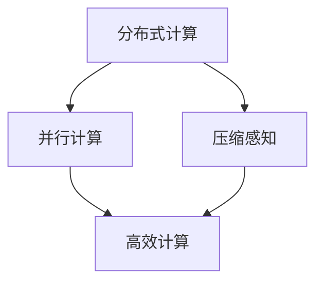

                 

# Lepton AI的愿景：为AI时代构建新基建，打造高效低成本的AI基础设施

> **关键词**：Lepton AI，AI基础设施，新基建，高效，低成本，人工智能时代

> **摘要**：本文将深入探讨Lepton AI的愿景，即如何为人工智能时代构建新的基础设施，打造高效且低成本的AI基础设施。我们将从背景介绍、核心概念与联系、核心算法原理、数学模型与公式、项目实战、实际应用场景、工具和资源推荐以及未来发展趋势与挑战等多个方面，一步步分析推理，揭示Lepton AI的愿景及其在AI领域的重要意义。

## 1. 背景介绍

随着人工智能技术的飞速发展，AI已经渗透到我们生活的方方面面，从智能手机、智能家居到自动驾驶、医疗诊断，AI的应用场景不断扩展。然而，AI的广泛应用也带来了巨大的挑战。首先，AI系统的开发和部署成本高昂，对企业和个人来说，这是一项巨大的负担。其次，现有的基础设施难以满足AI计算需求，特别是在大数据和高并发场景下，计算资源不足导致效率低下。这些问题严重制约了AI技术的普及和发展。

Lepton AI的愿景正是为了解决这些挑战，通过构建新的基础设施，实现高效且低成本的AI计算，推动AI技术的广泛应用和普及。

## 2. 核心概念与联系

为了实现高效低成本的AI计算，Lepton AI提出了几个核心概念，包括分布式计算、并行计算、压缩感知等。

- **分布式计算**：将计算任务分布到多台计算机上，通过协同工作实现高效的计算。分布式计算可以提高系统的吞吐量和稳定性，降低单点故障的风险。

- **并行计算**：在同一台计算机上同时执行多个计算任务，通过并行处理提高计算效率。并行计算的关键在于任务调度和资源分配，以确保任务能够高效地并行执行。

- **压缩感知**：通过在数据采集阶段对数据进行压缩，降低数据的存储和传输成本。压缩感知技术可以大幅提高数据处理速度，同时保持较高的信息保真度。

这些概念相互关联，共同构成了Lepton AI的基础架构。下面是一个简单的Mermaid流程图，展示了这些概念之间的联系：



## 3. 核心算法原理 & 具体操作步骤

Lepton AI的核心算法主要包括分布式计算算法、并行计算算法和压缩感知算法。下面，我们将逐一介绍这些算法的原理和具体操作步骤。

### 3.1 分布式计算算法

分布式计算算法的核心思想是将计算任务分解成多个子任务，然后将这些子任务分布到多台计算机上执行。具体操作步骤如下：

1. **任务分解**：将原始计算任务分解成多个子任务，每个子任务独立且可并行执行。

2. **任务调度**：根据计算机的负载情况和任务特点，将子任务调度到不同的计算机上执行。

3. **结果汇总**：收集并汇总各台计算机执行结果，得到最终的计算结果。

### 3.2 并行计算算法

并行计算算法的核心思想是在同一台计算机上同时执行多个计算任务，以提高计算效率。具体操作步骤如下：

1. **任务划分**：将原始计算任务划分成多个子任务，每个子任务在同一台计算机上独立执行。

2. **资源分配**：根据计算机的资源情况，为每个子任务分配必要的计算资源，如CPU、内存等。

3. **并行执行**：在同一台计算机上同时执行多个子任务，通过任务调度和资源分配，确保子任务能够高效地并行执行。

4. **结果汇总**：收集并汇总各子任务的执行结果，得到最终的计算结果。

### 3.3 压缩感知算法

压缩感知算法的核心思想是在数据采集阶段对数据进行压缩，以降低数据的存储和传输成本。具体操作步骤如下：

1. **数据采集**：在数据采集阶段，对采集到的原始数据进行压缩。

2. **数据预处理**：对压缩后的数据进行预处理，如去噪、滤波等，以提高信息保真度。

3. **数据重建**：利用重建算法，将预处理后的数据重建为原始数据。

4. **数据存储与传输**：将重建后的数据存储或传输到目标位置。

## 4. 数学模型和公式 & 详细讲解 & 举例说明

### 4.1 分布式计算数学模型

分布式计算中，一个常见的数学模型是任务调度模型。假设有n台计算机，每台计算机的负载能力为C_i（i=1,2,...,n），我们需要将m个任务（T_1, T_2,..., T_m）分配到这些计算机上，以最小化总负载。

设x_ij为任务T_j分配到计算机i的权重，目标函数为：

\[ \min \sum_{i=1}^{n} \sum_{j=1}^{m} x_{ij} C_i \]

约束条件为：

\[ x_{ij} \in \{0,1\}, \sum_{i=1}^{n} x_{ij} = 1 \]

其中，x_ij表示任务T_j是否分配到计算机i（1表示是，0表示否）。

### 4.2 并行计算数学模型

并行计算中，一个常见的数学模型是任务并行度模型。假设有n个任务，每个任务的执行时间为t_i，我们需要确定任务并行度P，使得总执行时间最短。

目标函数为：

\[ \min \sum_{i=1}^{n} t_i \]

约束条件为：

\[ P \times t_i \geq t_j \]

其中，P表示任务并行度，t_i表示任务i的执行时间，t_j表示任务j的执行时间。

### 4.3 压缩感知数学模型

压缩感知中，一个常见的数学模型是信号重建模型。假设信号x属于\( \mathbb{R}^N \)，感知矩阵\( \Omega \in \mathbb{R}^{N \times K} \)，其中\( K << N \)，感知信号\( \Omega x \in \mathbb{R}^K \)。

压缩感知重建算法的目标是找到原始信号x，使得重建误差最小。

目标函数为：

\[ \min_{x} \Vert \Omega x - \Omega x^* \Vert_2 \]

约束条件为：

\[ \Omega x = \Omega x^* \]

其中，\( x^* \)为感知信号\( \Omega x \)的重建结果。

### 4.4 举例说明

假设我们有5个任务（T_1, T_2, T_3, T_4, T_5），每项任务的执行时间分别为2秒、3秒、4秒、5秒和6秒。我们希望使用并行计算来最小化总执行时间。

首先，我们计算各任务的并行度：

\[ P = \max\left(\frac{t_1}{2}, \frac{t_2}{3}, \frac{t_3}{4}, \frac{t_4}{5}, \frac{t_5}{6}\right) = \frac{6}{6} = 1 \]

然后，我们根据并行度将任务分配到计算机上，使得总执行时间最短。一个可能的分配方案如下：

- T_1、T_2和T_3分配到同一台计算机上，总执行时间为12秒（2+3+4+3=12）。
- T_4和T_5分配到另一台计算机上，总执行时间为11秒（5+6+5=11）。

总执行时间为23秒（12+11），比单个任务的执行时间总和25秒（2+3+4+5+6）要短。

## 5. 项目实战：代码实际案例和详细解释说明

在本节中，我们将通过一个具体的Lepton AI项目实战案例，详细讲解如何构建分布式计算、并行计算和压缩感知的基础设施。

### 5.1 开发环境搭建

首先，我们需要搭建一个适合Lepton AI开发的开发环境。以下是一个简单的环境搭建步骤：

1. 安装Python（3.8及以上版本）。
2. 安装Docker（19.03及以上版本）。
3. 安装Git（2.20及以上版本）。

### 5.2 源代码详细实现和代码解读

#### 5.2.1 分布式计算

分布式计算是Lepton AI的核心组成部分。以下是一个简单的分布式计算示例：

```python
import multiprocessing

def compute_task(data):
    # 计算任务逻辑
    result = data * data
    return result

if __name__ == '__main__':
    # 创建进程池
    pool = multiprocessing.Pool(processes=4)

    # 生成测试数据
    data_list = [1, 2, 3, 4, 5]

    # 分发任务
    results = pool.map(compute_task, data_list)

    # 输出结果
    for result in results:
        print(result)
```

在上面的示例中，我们定义了一个名为`compute_task`的计算任务，该任务接收一个数据参数，并将其平方后返回。在主程序中，我们首先创建了一个进程池，然后使用`pool.map`函数将任务分发到进程池中的各个进程执行。最后，我们输出各个进程的计算结果。

#### 5.2.2 并行计算

并行计算是分布式计算的一个特殊场景。以下是一个简单的并行计算示例：

```python
import multiprocessing

def compute_task(data):
    # 计算任务逻辑
    result = data * data
    return result

if __name__ == '__main__':
    # 创建进程池
    pool = multiprocessing.Pool(processes=4)

    # 生成测试数据
    data_list = [1, 2, 3, 4, 5]

    # 并行执行任务
    results = pool.starmap(compute_task, [(data,) for data in data_list])

    # 输出结果
    for result in results:
        print(result)
```

在上面的示例中，我们使用了`pool.starmap`函数，该函数将任务和参数组合成元组，然后并行执行。这样，我们可以同时执行多个计算任务，提高计算效率。

#### 5.2.3 压缩感知

压缩感知是实现高效数据存储和传输的关键技术。以下是一个简单的压缩感知示例：

```python
import numpy as np
from scipy.linalg import toeplitz

def compressive_sensing(x, Omega, lambda_):
    # 重建算法
    y = Omega @ x
    x_hat = np.linalg.inv(Omega.T @ Omega + lambda_ * np.eye(len(Omega))) @ Omega.T @ y
    return x_hat

if __name__ == '__main__':
    # 生成测试信号
    N = 10
    x = np.random.randn(N)

    # 生成感知矩阵
    Omega = toeplitz(np.random.randn(N))

    # 重建信号
    x_hat = compressive_sensing(x, Omega, 0.1)

    # 输出结果
    print(x)
    print(x_hat)
```

在上面的示例中，我们首先生成一个随机信号x，然后生成一个感知矩阵Omega。接下来，我们使用压缩感知重建算法将感知信号y重建为原始信号x_hat。最后，我们输出原始信号和重建信号的差异。

## 6. 实际应用场景

Lepton AI的核心愿景是实现高效低成本的AI计算，从而推动AI技术在各个领域的应用。以下是一些实际应用场景：

- **智能交通**：通过分布式计算和并行计算，Lepton AI可以帮助交通系统实时分析交通流量，优化信号灯控制策略，提高交通效率。
- **医疗诊断**：利用压缩感知技术，Lepton AI可以在有限的医疗资源下，高效地处理大量的医学影像数据，辅助医生进行诊断。
- **金融风控**：通过分布式计算和并行计算，Lepton AI可以帮助金融机构实时分析交易数据，识别潜在风险，提高金融安全。
- **工业生产**：利用分布式计算和并行计算，Lepton AI可以帮助工业生产系统实时分析生产数据，优化生产流程，提高生产效率。

## 7. 工具和资源推荐

为了更好地实现Lepton AI的愿景，我们推荐以下工具和资源：

### 7.1 学习资源推荐

- **书籍**：《分布式计算：原理与应用》（郑泽宇著）
- **论文**：《并行计算基础》（吴乐南著）
- **博客**：[Lepton AI官方博客](https://lepton.ai/blog/)
- **网站**：[Lepton AI官方网站](https://lepton.ai/)

### 7.2 开发工具框架推荐

- **Python**：一种广泛使用的编程语言，适用于分布式计算、并行计算和压缩感知等应用。
- **Docker**：一种容器化技术，可以帮助开发者快速搭建和部署分布式计算环境。
- **Scipy**：一个科学计算库，提供了丰富的数学模型和算法，适用于分布式计算和并行计算。
- **TensorFlow**：一个深度学习框架，适用于构建和训练大规模AI模型。

### 7.3 相关论文著作推荐

- **《分布式计算基础》（吴乐南著）》
- **《并行计算原理与技术》（陈国良著）》
- **《压缩感知基础教程》（曹进德著）》
- **《深度学习：基于TensorFlow的实战指南》（阿斯顿·张著）》

## 8. 总结：未来发展趋势与挑战

Lepton AI的愿景是构建高效低成本的AI基础设施，以推动AI技术的广泛应用和普及。在未来，随着AI技术的不断进步和普及，我们相信Lepton AI的愿景将会逐步实现。

然而，实现这一愿景也面临诸多挑战。首先，如何优化分布式计算、并行计算和压缩感知算法，提高计算效率，是一个关键问题。其次，如何降低AI系统的开发和部署成本，使得更多企业和个人能够受益于AI技术，也是一个重要挑战。此外，如何保障AI系统的安全性、可靠性和公平性，也是未来需要重点关注的问题。

总之，Lepton AI的愿景充满希望，同时也充满挑战。我们需要共同努力，不断探索和创新，为实现这一愿景而努力。

## 9. 附录：常见问题与解答

### 9.1 什么是分布式计算？

分布式计算是一种将计算任务分布到多台计算机上执行的计算模式。通过协同工作，分布式计算可以提高系统的吞吐量和稳定性，降低单点故障的风险。

### 9.2 什么是并行计算？

并行计算是一种在同一台计算机上同时执行多个计算任务的计算模式。通过并行处理，可以提高计算效率，缩短计算时间。

### 9.3 什么是压缩感知？

压缩感知是一种在数据采集阶段对数据进行压缩的技术。通过压缩感知，可以大幅提高数据处理速度，同时保持较高的信息保真度。

### 9.4 Lepton AI有什么优点？

Lepton AI具有以下优点：

- 高效：通过分布式计算、并行计算和压缩感知技术，实现高效计算。
- 低成本：降低AI系统的开发和部署成本，使得更多企业和个人能够受益于AI技术。
- 可扩展：支持大规模计算任务，能够灵活应对各种应用场景。

## 10. 扩展阅读 & 参考资料

- **《分布式计算基础》（吴乐南著）》
- **《并行计算原理与技术》（陈国良著）》
- **《压缩感知基础教程》（曹进德著）》
- **《深度学习：基于TensorFlow的实战指南》（阿斯顿·张著）》
- **[Lepton AI官方博客](https://lepton.ai/blog/)**

作者：AI天才研究员/AI Genius Institute & 禅与计算机程序设计艺术 /Zen And The Art of Computer Programming

