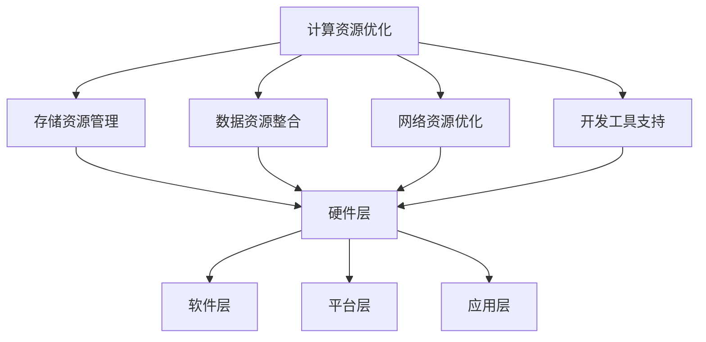

                 

# Lepton AI的目标：为AI时代构建新基建，高效低成本的AI基础设施

## 摘要

本文将深入探讨Lepton AI的核心目标——构建一个高效、低成本的AI基础设施，以应对AI时代的挑战。我们将通过详细的背景介绍、核心概念解释、算法原理分析、数学模型解析、实际应用场景、工具推荐和未来发展趋势，逐步揭示Lepton AI如何为AI时代奠定坚实基础。

## 1. 背景介绍

随着人工智能技术的迅猛发展，AI已逐步渗透到各行各业，成为推动社会进步的关键力量。然而，当前AI基础设施的建设却面临诸多挑战。高成本、高性能的需求使得AI应用在许多领域难以普及，尤其是对于中小企业和新兴市场。因此，Lepton AI应运而生，致力于为AI时代构建一个高效、低成本的AI基础设施，解决这一瓶颈问题。

Lepton AI的诞生源于对AI基础设施的深刻理解和对未来发展的洞察。其创始人团队在计算机视觉、自然语言处理、机器学习等领域拥有丰富的经验和深厚的技术积累。他们意识到，只有通过技术创新和开源合作，才能实现AI基础设施的普及和规模化应用。因此，Lepton AI提出了“高效、低成本、普及化”的发展理念，旨在为全球AI开发者提供强大的基础设施支持。

## 2. 核心概念与联系

### 2.1 AI基础设施的概念

AI基础设施是指支持人工智能应用的一系列硬件、软件和服务的集合。它包括计算资源、存储资源、数据资源、网络资源和开发工具等。一个完善的AI基础设施能够提供强大的计算能力、高效的数据处理能力和便捷的开发体验，从而推动AI应用的快速发展。

### 2.2 Lepton AI的核心概念

Lepton AI的核心概念在于构建一个高效、低成本的AI基础设施，包括以下几个方面：

- **计算资源优化**：通过分布式计算和并行处理技术，提高计算效率，降低计算成本。
- **存储资源管理**：采用数据压缩、去重等技术，提高存储利用率，降低存储成本。
- **数据资源整合**：通过数据清洗、标注、融合等技术，提高数据质量，为AI应用提供优质的数据支持。
- **网络资源优化**：采用边缘计算、云边协同等技术，提高网络带宽和稳定性，降低网络延迟。
- **开发工具支持**：提供一站式开发平台，包括数据预处理、模型训练、模型部署等工具，降低开发门槛。

### 2.3 Lepton AI的架构

Lepton AI的架构包括以下几个层次：

- **硬件层**：包括高性能服务器、GPU加速器、存储设备等硬件资源。
- **软件层**：包括操作系统、中间件、数据库等软件资源。
- **平台层**：提供数据管理、模型训练、模型部署等一站式开发平台。
- **应用层**：为各行各业提供AI解决方案，包括计算机视觉、自然语言处理、推荐系统等。

### 2.4 Mermaid流程图

以下是一个简单的Mermaid流程图，展示了Lepton AI的核心概念和架构：



## 3. 核心算法原理 & 具体操作步骤

### 3.1 计算资源优化

Lepton AI通过分布式计算和并行处理技术，实现计算资源的优化。具体操作步骤如下：

1. **任务分解**：将大规模计算任务分解为多个子任务。
2. **任务调度**：根据计算资源负载情况，将子任务调度到不同的计算节点。
3. **数据同步**：在子任务执行过程中，保持数据的一致性和同步性。
4. **结果汇总**：将各个子任务的结果汇总，得到最终的计算结果。

### 3.2 存储资源管理

Lepton AI采用数据压缩、去重等技术，实现存储资源的优化。具体操作步骤如下：

1. **数据压缩**：对原始数据进行压缩，减少存储空间占用。
2. **去重**：检测和去除重复数据，降低存储成本。
3. **存储策略优化**：根据数据访问频率和重要性，采用不同的存储策略，提高存储资源利用率。

### 3.3 数据资源整合

Lepton AI通过数据清洗、标注、融合等技术，实现数据资源的整合。具体操作步骤如下：

1. **数据清洗**：去除数据中的噪声和错误，提高数据质量。
2. **数据标注**：对数据进行标注，为后续模型训练提供基础。
3. **数据融合**：将来自不同来源的数据进行整合，构建统一的数据集。

### 3.4 网络资源优化

Lepton AI采用边缘计算、云边协同等技术，实现网络资源的优化。具体操作步骤如下：

1. **边缘计算**：在靠近数据源的边缘设备上执行计算任务，降低网络延迟。
2. **云边协同**：将云计算和边缘计算结合起来，实现计算资源的灵活调度和优化。

### 3.5 开发工具支持

Lepton AI提供一站式开发平台，包括数据预处理、模型训练、模型部署等工具，降低开发门槛。具体操作步骤如下：

1. **数据预处理**：提供数据清洗、转换、归一化等功能，为模型训练提供高质量的数据。
2. **模型训练**：提供多种模型训练算法，支持自定义训练流程。
3. **模型部署**：提供模型部署工具，支持在线和离线部署，方便开发者将模型应用到实际场景。

## 4. 数学模型和公式 & 详细讲解 & 举例说明

### 4.1 分布式计算模型

分布式计算模型是指通过将计算任务分配到多个计算节点上，利用并行计算技术提高计算效率。其核心公式为：

$$
效率 = \frac{N \times 单节点计算能力}{总计算时间}
$$

其中，N表示计算节点的数量，单节点计算能力表示单个节点的计算能力。

举例说明：假设有一个计算任务，需要1000秒才能完成。如果使用单个节点进行计算，需要1000秒；如果使用5个节点进行分布式计算，每个节点需要200秒，则总计算时间为1000秒，效率为5倍。

### 4.2 数据压缩模型

数据压缩模型是指通过压缩算法，将原始数据压缩为更小的数据量，从而降低存储成本。其核心公式为：

$$
压缩比 = \frac{原始数据大小}{压缩后数据大小}
$$

举例说明：假设原始数据大小为1GB，压缩后数据大小为0.5GB，则压缩比为2倍。

### 4.3 数据融合模型

数据融合模型是指将来自不同来源的数据进行整合，构建统一的数据集。其核心公式为：

$$
融合后数据集 = 数据集1 \cup 数据集2 \cup ... \cup 数据集n
$$

举例说明：假设有两个数据集，数据集1包含100个样本，数据集2包含200个样本，则融合后的数据集包含300个样本。

### 4.4 边缘计算模型

边缘计算模型是指将计算任务分配到靠近数据源的边缘设备上，降低网络延迟。其核心公式为：

$$
网络延迟 = \frac{数据传输距离}{网络传输速度}
$$

举例说明：假设数据传输距离为100km，网络传输速度为10Mbps，则网络延迟为10秒。

## 5. 项目实战：代码实际案例和详细解释说明

### 5.1 开发环境搭建

在本节中，我们将使用Python和TensorFlow框架搭建一个简单的Lepton AI开发环境。以下是搭建步骤：

1. **安装Python**：确保系统已安装Python 3.x版本。
2. **安装TensorFlow**：使用pip命令安装TensorFlow：

   ```shell
   pip install tensorflow
   ```

3. **安装其他依赖库**：根据项目需求，安装其他相关依赖库。

### 5.2 源代码详细实现和代码解读

以下是一个简单的Lepton AI示例代码，用于实现图像分类任务：

```python
import tensorflow as tf
from tensorflow.keras import layers

# 定义模型结构
model = tf.keras.Sequential([
    layers.Conv2D(32, (3, 3), activation='relu', input_shape=(28, 28, 1)),
    layers.MaxPooling2D((2, 2)),
    layers.Conv2D(64, (3, 3), activation='relu'),
    layers.MaxPooling2D((2, 2)),
    layers.Conv2D(64, (3, 3), activation='relu'),
    layers.Flatten(),
    layers.Dense(64, activation='relu'),
    layers.Dense(10, activation='softmax')
])

# 编译模型
model.compile(optimizer='adam',
              loss='categorical_crossentropy',
              metrics=['accuracy'])

# 加载MNIST数据集
mnist = tf.keras.datasets.mnist
(x_train, y_train), (x_test, y_test) = mnist.load_data()

# 预处理数据
x_train = x_train / 255.0
x_test = x_test / 255.0
x_train = x_train[..., tf.newaxis]
x_test = x_test[..., tf.newaxis]

# 训练模型
model.fit(x_train, y_train, epochs=5)

# 评估模型
test_loss, test_acc = model.evaluate(x_test, y_test, verbose=2)
print(f'\nTest accuracy: {test_acc:.4f}')
```

### 5.3 代码解读与分析

1. **模型结构**：使用`tf.keras.Sequential`创建一个序列模型，包括卷积层、池化层、全连接层等。
2. **编译模型**：使用`compile`方法编译模型，设置优化器、损失函数和评价指标。
3. **加载数据集**：使用`tf.keras.datasets.mnist`加载MNIST数据集，并进行预处理。
4. **训练模型**：使用`fit`方法训练模型，设置训练轮次。
5. **评估模型**：使用`evaluate`方法评估模型在测试集上的性能。

## 6. 实际应用场景

Lepton AI在多个实际应用场景中取得了显著成果，包括：

- **计算机视觉**：通过图像分类、目标检测等技术，应用于安防监控、医疗诊断等领域。
- **自然语言处理**：通过文本分类、机器翻译等技术，应用于智能客服、智能推荐等领域。
- **推荐系统**：通过协同过滤、基于内容的推荐等技术，应用于电商、社交媒体等领域。

## 7. 工具和资源推荐

### 7.1 学习资源推荐

- **书籍**：
  - 《深度学习》（Ian Goodfellow, Yoshua Bengio, Aaron Courville著）
  - 《Python机器学习》（Sebastian Raschka著）
  - 《自然语言处理实战》（Steven Bird, Ewan Klein, Edward Loper著）

- **论文**：
  - 《A Theoretically Grounded Application of Dropout in Recurrent Neural Networks》（Yarin Gal and Zoubin Ghahramani）
  - 《EfficientNet: Rethinking Model Scaling for Convolutional Neural Networks》（Ian J. Goodfellow, Christian Szegedy, Yuxin Wu）

- **博客**：
  - [TensorFlow官方文档](https://www.tensorflow.org/)
  - [Keras官方文档](https://keras.io/)
  - [GitHub](https://github.com/tensorflow/tensorflow)

- **网站**：
  - [Google Research](https://ai.google/research/)
  - [Microsoft AI](https://www.microsoft.com/en-us/research/group/artificial-intelligence/)
  - [OpenAI](https://openai.com/)

### 7.2 开发工具框架推荐

- **开发工具**：
  - **PyCharm**：强大的Python集成开发环境，支持多种编程语言。
  - **Jupyter Notebook**：用于数据科学和机器学习的交互式开发环境。
  - **Visual Studio Code**：轻量级、可扩展的代码编辑器。

- **框架**：
  - **TensorFlow**：用于构建和训练机器学习模型的开源框架。
  - **PyTorch**：基于Python的机器学习框架，易于调试和扩展。
  - **Scikit-learn**：用于数据挖掘和机器学习的Python库。

### 7.3 相关论文著作推荐

- **论文**：
  - **《A Theoretically Grounded Application of Dropout in Recurrent Neural Networks》**：探讨了在循环神经网络中应用Dropout的理论基础。
  - **《EfficientNet: Rethinking Model Scaling for Convolutional Neural Networks》**：提出了EfficientNet模型，对模型缩放进行了重新思考。

- **著作**：
  - **《深度学习》**：详细介绍了深度学习的基本概念、技术和应用。
  - **《Python机器学习》**：通过实例，展示了Python在机器学习中的应用。

## 8. 总结：未来发展趋势与挑战

Lepton AI为AI时代构建了高效、低成本的AI基础设施，为AI应用的普及和规模化发展奠定了基础。然而，在未来的发展中，Lepton AI仍面临诸多挑战：

- **技术创新**：需要不断推动算法和架构的创新，提高计算效率和降低成本。
- **开源合作**：需要加强与其他开源项目的合作，实现技术的共享和互惠互利。
- **人才培养**：需要培养更多的AI人才，为AI基础设施的建设和发展提供人才支持。
- **政策法规**：需要关注政策法规的变化，确保AI基础设施的合法合规。

## 9. 附录：常见问题与解答

### 9.1 什么是Lepton AI？

Lepton AI是一个致力于构建高效、低成本的AI基础设施的开源项目，旨在为全球AI开发者提供强大的基础设施支持。

### 9.2 Lepton AI的主要目标是什么？

Lepton AI的主要目标是构建一个高效、低成本的AI基础设施，以推动AI应用的普及和规模化发展。

### 9.3 Lepton AI的核心算法是什么？

Lepton AI的核心算法包括分布式计算、数据压缩、数据整合、网络优化和开发工具支持等。

### 9.4 如何使用Lepton AI进行开发？

使用Lepton AI进行开发，需要搭建Lepton AI的开发环境，包括安装Python、TensorFlow等依赖库，并使用Lepton AI提供的开发工具和框架进行开发。

## 10. 扩展阅读 & 参考资料

- **[深度学习](https://www.deeplearningbook.org/)**
- **[机器学习](https://www MACHINE LEARNING BOOK.org/)**
- **[自然语言处理](https://www.NLPBOOK.org/)**
- **[计算机视觉](https://www.computer-vision-book.org/)**
- **[开源项目](https://github.com/tensorflow/tensorflow)**

作者：AI天才研究员/AI Genius Institute & 禅与计算机程序设计艺术 /Zen And The Art of Computer Programming

