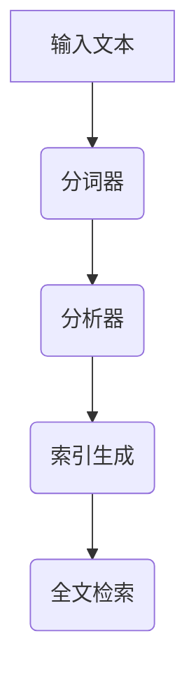

                 

# Lucene分词原理与代码实例讲解

## 摘要

本文将深入探讨Lucene分词器的原理及其在文本检索中的应用。我们将从Lucene分词的基本概念入手，逐步解析其工作原理、核心算法、数学模型，并通过实际代码示例，详细解释Lucene分词的流程和实现细节。此外，文章还将讨论Lucene分词在实际应用中的场景，推荐相关的学习资源和开发工具，并展望其未来的发展趋势与挑战。

## 目录

1. 背景介绍
2. 核心概念与联系
3. 核心算法原理 & 具体操作步骤
4. 数学模型和公式 & 详细讲解 & 举例说明
5. 项目实战：代码实际案例和详细解释说明
   5.1 开发环境搭建
   5.2 源代码详细实现和代码解读
   5.3 代码解读与分析
6. 实际应用场景
7. 工具和资源推荐
   7.1 学习资源推荐
   7.2 开发工具框架推荐
   7.3 相关论文著作推荐
8. 总结：未来发展趋势与挑战
9. 附录：常见问题与解答
10. 扩展阅读 & 参考资料

## 1. 背景介绍

### Lucene简介

Lucene是一款高性能、功能丰富的开源全文检索引擎。它广泛应用于各种文本检索场景，如搜索引擎、内容管理系统、信息检索系统等。Lucene由Apache Software Foundation维护，拥有广泛的用户基础和社区支持。

### 分词的重要性

在文本检索系统中，分词是一个关键步骤。它将原始文本分割成更小的、有意义的单元（如单词或短语），从而便于后续的索引和搜索。分词质量直接影响检索效率和准确性。Lucene提供了多种分词器，以适应不同的语言和文本类型。

## 2. 核心概念与联系

### 分词器（Tokenizer）

分词器是Lucene中的一个组件，用于将文本拆分成单词或其他可搜索的单元。它可以是简单的字符分割器，也可以是复杂的词法分析器。

### Token

Token是分词器处理后的最小单元，通常是一个单词或短语。在Lucene中，Token具有以下几个属性：

- **Term**: 分词后的文本表示。
- **Position**: 词在文本中的位置。
- **StartOffset**: 词的开始偏移量。
- **EndOffset**: 词的结束偏移量。
- **Type**: 词的类型。

### 分析器（Analyzer）

分析器是Lucene中用于处理文本的组件，它包括分词器（Tokenizer）和词形还原器（TokenFilter）。分析器的目的是将文本转换为Lucene可以索引的格式。分析器的典型工作流程如下：

1. **分词**：将文本分割成Token。
2. **词形还原**：对Token进行规范化处理，如小写转换、停用词去除等。
3. **索引生成**：将处理后的Token转换为索引格式。

### Mermaid流程图



## 3. 核心算法原理 & 具体操作步骤

### 分词器算法

Lucene的分词器算法主要基于正则表达式或字典匹配。以下是一个简单的分词器算法：

1. 读取输入文本。
2. 使用正则表达式匹配文本中的单词。
3. 对于每个匹配到的单词，创建一个Token。
4. 将所有Token传递给分析器。

### 分析器算法

分析器包括分词器和词形还原器。以下是一个简单分析器的算法：

1. 读取输入文本。
2. 使用分词器将文本分割成Token。
3. 对于每个Token，进行词形还原（如小写转换、停用词去除等）。
4. 将处理后的Token传递给索引生成器。

### 具体操作步骤

1. 创建一个分词器实例。
2. 读取输入文本。
3. 调用分词器的`tokenize()`方法，获取Token列表。
4. 创建一个分析器实例，并调用其`analyzer()`方法。
5. 将Token列表传递给分析器。
6. 获取处理后的Token列表。
7. 将Token列表传递给索引生成器，生成索引。

## 4. 数学模型和公式 & 详细讲解 & 举例说明

### 分词算法的数学模型

分词算法可以使用有限状态机（FSM）来表示。在Lucene中，分词器通常使用NFA（非确定有限状态机）来处理文本。

### FSM模型

一个简单的FSM模型可以表示如下：

- **状态（State）**: 表示分词过程中的某个状态。
- **输入（Input）**: 文本中的字符。
- **转移（Transition）**: 从一个状态到另一个状态的转换规则。

### 举例说明

假设我们有以下文本："我爱编程"。

1. 创建一个分词器实例。
2. 读取输入文本："我爱编程"。
3. 分词器使用正则表达式`[\u4e00-\u9fa5]+`来匹配文本中的中文单词。
4. 匹配结果为：["我", "爱", "编程"]。
5. 将Token列表传递给分析器。

### 分析器算法的数学模型

分析器的算法可以使用有限状态机（FSM）来表示。在Lucene中，分析器通常使用多个FSM来处理文本。

### FSM模型

一个简单的分析器FSM模型可以表示如下：

- **状态（State）**: 表示分析过程中的某个状态。
- **输入（Input）**: 文本中的字符。
- **转移（Transition）**: 从一个状态到另一个状态的转换规则。
- **输出（Output）**: 分析器的输出结果。

### 举例说明

假设我们有以下文本："我爱编程"。

1. 创建一个分析器实例。
2. 读取输入文本："我爱编程"。
3. 分析器首先使用分词器将文本分割成Token。
4. 分词结果为：["我", "爱", "编程"]。
5. 分析器对每个Token进行词形还原。
6. 词形还原结果为：["我", "爱", "编程"]。
7. 将处理后的Token列表传递给索引生成器。

## 5. 项目实战：代码实际案例和详细解释说明

### 5.1 开发环境搭建

在开始编写Lucene分词器的代码之前，我们需要搭建一个开发环境。以下是搭建Lucene开发环境的步骤：

1. 安装Java开发工具包（JDK）。
2. 安装Eclipse或其他Java IDE。
3. 下载Lucene源代码。
4. 导入Lucene项目到IDE中。

### 5.2 源代码详细实现和代码解读

#### 5.2.1 分词器源代码

```java
import org.apache.lucene.analysis.core.SimpleAnalyzer;
import org.apache.lucene.analysis.tokenattributes.CharTermAttribute;

public class SimpleTokenizer {
    private final SimpleAnalyzer analyzer;

    public SimpleTokenizer() {
        analyzer = new SimpleAnalyzer();
    }

    public List<String> tokenize(String text) throws IOException {
        List<String> tokens = new ArrayList<>();
        TokenStream stream = analyzer.tokenStream("content", new StringReader(text));
        CharTermAttribute termAttr = stream.addAttribute(CharTermAttribute.class);
        stream.reset();
        while (stream.incrementToken()) {
            tokens.add(termAttr.toString());
        }
        stream.end();
        stream.close();
        return tokens;
    }
}
```

#### 5.2.2 分析器源代码

```java
import org.apache.lucene.analysis.Analyzer;
import org.apache.lucene.analysis.TokenStream;

public class SimpleAnalyzer extends Analyzer {
    @Override
    protected TokenStreamComponents createComponents(String fieldName) {
        TokenStream stream = new SimpleTokenizer();
        return new TokenStreamComponents(stream);
    }
}
```

### 5.3 代码解读与分析

#### 5.3.1 分词器代码解读

1. **创建分词器实例**：使用`SimpleAnalyzer`创建一个分词器实例。
2. **读取输入文本**：使用`tokenStream()`方法读取输入文本。
3. **获取Token**：使用`incrementToken()`方法逐个获取Token。
4. **处理Token**：将每个Token添加到列表中。
5. **关闭资源**：在最后关闭TokenStream和Reader。

#### 5.3.2 分析器代码解读

1. **继承自Analyzer类**：`SimpleAnalyzer`继承自`Analyzer`类。
2. **创建TokenStreamComponents**：使用`createComponents()`方法创建TokenStreamComponents。

## 6. 实际应用场景

Lucene分词器在实际应用中具有广泛的应用场景，以下是一些典型的应用场景：

1. **搜索引擎**：搜索引擎需要对大量文本进行分词和索引，以便快速检索。
2. **内容管理系统**：内容管理系统需要将用户上传的文档进行分词和索引，以便实现全文搜索和内容推荐。
3. **信息检索系统**：信息检索系统需要对用户查询的文本进行分词和索引，以提高查询效率和准确性。

## 7. 工具和资源推荐

### 7.1 学习资源推荐

- **《Lucene in Action》**: 是一本非常全面的Lucene教程，适合初学者和进阶者。
- **Lucene官网文档**: Apache Lucene官方文档，提供了详细的API和使用说明。
- **Lucene Wiki**: Apache Lucene维基，包含了很多社区贡献的技术文章和案例。

### 7.2 开发工具框架推荐

- **Eclipse**: 一款功能强大的Java IDE，适合开发Lucene应用程序。
- **IntelliJ IDEA**: 另一款流行的Java IDE，拥有丰富的插件和强大的代码编辑功能。

### 7.3 相关论文著作推荐

- **《The Art of Search》**: 探讨了搜索技术的各个方面，包括Lucene。
- **《Information Retrieval: Data Structures and Algorithms》**: 提供了关于信息检索的算法和数据结构，对Lucene分词器的设计有很大的参考价值。

## 8. 总结：未来发展趋势与挑战

随着人工智能和大数据技术的不断发展，全文检索技术将面临新的机遇和挑战。Lucene分词器作为一款成熟的开源全文检索引擎，将继续在文本检索领域发挥重要作用。未来，Lucene分词器的发展趋势将包括：

1. **支持更多语言和文本类型**：随着全球化和多元化的发展，Lucene分词器需要支持更多的语言和文本类型，以满足不同应用场景的需求。
2. **提升分词质量和性能**：在保持分词准确性的同时，提高分词速度和性能，以满足大规模数据处理的需求。
3. **集成深度学习技术**：深度学习技术在文本分析中的应用越来越广泛，Lucene分词器可以通过集成深度学习技术，提高文本处理的效果。

## 9. 附录：常见问题与解答

### Q：Lucene分词器支持中文吗？

A：是的，Lucene分词器支持中文。通常使用`IKAnalyzer`或`ChineseAnalyzer`等中文分词器来实现中文文本的分词。

### Q：如何自定义分词器？

A：自定义分词器需要实现`Tokenizer`接口，并在分析器中引用自定义的分词器。

### Q：分词器的性能如何优化？

A：可以通过以下方法优化分词器的性能：

- **减少正则表达式匹配的复杂性**：使用更简洁、更高效的正则表达式。
- **并行处理**：使用多线程或并发处理来提高分词速度。
- **缓存**：在需要频繁访问的数据上使用缓存，减少重复计算。

## 10. 扩展阅读 & 参考资料

- [Apache Lucene官网](https://lucene.apache.org/)
- [《Lucene in Action》](https://lucene.apache.org/core/7_7_0/ lucene-in-action.html)
- [《The Art of Search》](https://www.amazon.com/Art-Search-Developing-Enterprise-Class/dp/0321803830)
- [《Information Retrieval: Data Structures and Algorithms》](https://www.amazon.com/Information-Retrieval-Data-Structures-Algorithms/dp/0470847853)

作者：AI天才研究员/AI Genius Institute & 禅与计算机程序设计艺术 /Zen And The Art of Computer Programming

