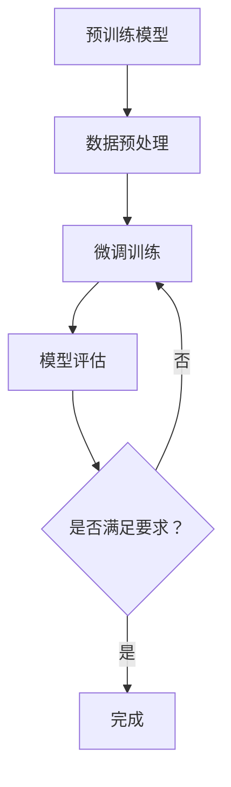
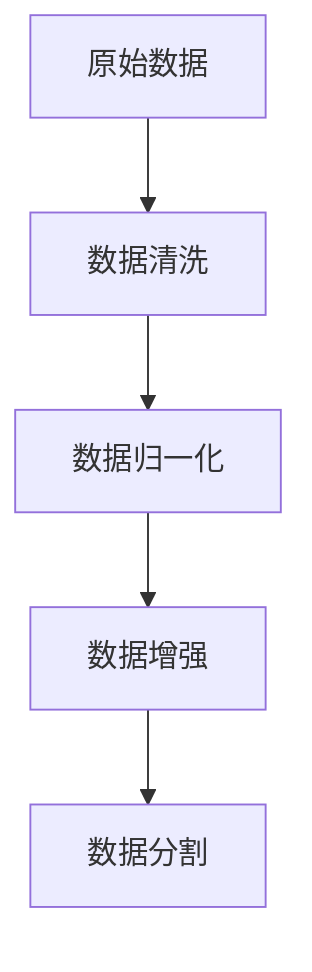
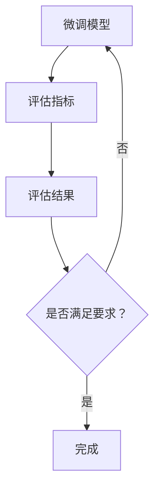

                 

# M6-Rec: 开放域与微调框架

> **关键词**: 开放域学习（Open-Domain Learning）、微调（Fine-Tuning）、深度学习（Deep Learning）、模型架构（Model Architecture）、数据处理（Data Processing）、算法优化（Algorithm Optimization）

> **摘要**: 本文将深入探讨开放域与微调框架在深度学习中的应用，从核心概念、算法原理到实际应用场景进行详细分析。通过一步一步的分析推理，我们旨在为读者提供清晰、易懂的技术解析，以帮助其在相关领域取得更好的理解和应用效果。

## 1. 背景介绍

随着深度学习技术的发展，越来越多的复杂任务得以高效地解决。然而，深度学习模型的性能和适用性在开放域（Open-Domain）任务上仍然面临诸多挑战。开放域学习是指模型需要在广泛的、多样化的数据集上进行训练，以适应各种不同的任务和场景。与之相对的是封闭域学习（Closed-Domain），模型在特定的、有限的任务上进行训练。

微调（Fine-Tuning）是一种常用的技术，通过在预训练模型的基础上进行微调，可以使模型在新的任务上获得更好的性能。微调的优势在于，它可以充分利用预训练模型已经学习的通用特征，从而减少对大量新数据的依赖。然而，微调也存在一些局限性，如对数据质量和数据量的要求较高，以及模型适应新任务的能力有限等。

本文将围绕开放域与微调框架展开讨论，分析其核心概念、算法原理，并探讨在实际应用中的挑战和解决方案。

## 2. 核心概念与联系

### 2.1 开放域学习（Open-Domain Learning）

开放域学习是一种面向广泛任务的机器学习范式，旨在使模型能够在未知、多样化的数据集上适应各种任务。其核心思想是，通过在大量的未标注数据上预训练模型，使其具备泛化能力，从而在新的、未见的任务上取得良好的性能。

### 2.2 微调（Fine-Tuning）

微调是一种在预训练模型的基础上进行模型调整的技术。通过在新的任务数据上对模型进行微调，可以使其适应特定的任务需求。微调的关键在于，充分利用预训练模型已经学习的通用特征，从而减少对新数据的依赖。

### 2.3 深度学习模型架构（Deep Learning Model Architecture）

深度学习模型架构是构建深度学习模型的基础。常用的深度学习模型包括卷积神经网络（CNN）、循环神经网络（RNN）、 Transformer等。这些模型在不同类型的任务中表现出色，为开放域学习和微调提供了丰富的选择。

### 2.4 数据处理（Data Processing）

数据处理是开放域学习和微调的重要环节。有效的数据处理技术可以提高模型性能，降低训练成本。数据处理技术包括数据清洗、数据增强、数据归一化等。

### 2.5 算法优化（Algorithm Optimization）

算法优化是提高深度学习模型性能的关键。常见的算法优化方法包括模型压缩、量化、迁移学习等。这些方法可以降低模型复杂度，提高模型运行速度，从而提高开放域学习和微调的效率。

### 2.6 Mermaid 流程图（Mermaid Flowchart）

为了更好地展示开放域与微调框架的流程，我们可以使用 Mermaid 流程图进行描述。以下是一个简化的 Mermaid 流程图示例：



## 3. 核心算法原理 & 具体操作步骤

### 3.1 预训练模型

预训练模型是指在大量未标注数据上进行训练的深度学习模型。其核心思想是，通过在未标注数据上学习通用特征，提高模型在不同任务上的泛化能力。常见的预训练模型包括 BERT、GPT、ViT 等。

### 3.2 数据预处理

数据预处理是开放域学习和微调的重要环节。在数据预处理过程中，我们需要对数据进行清洗、归一化、增强等操作。以下是一个简化的数据预处理流程：



### 3.3 微调训练

微调训练是指，在预训练模型的基础上，使用新的任务数据进行模型调整。具体操作步骤如下：

1.  加载预训练模型。
2.  对预训练模型进行解冻，使其可训练。
3.  使用新的任务数据进行训练。
4.  对模型进行评估，如果满足要求，则停止训练；否则，继续训练。

### 3.4 模型评估

模型评估是判断微调训练是否成功的重要步骤。常用的评估指标包括准确率、召回率、F1 分数等。以下是一个简化的模型评估流程：



## 4. 数学模型和公式 & 详细讲解 & 举例说明

### 4.1 数学模型

在开放域学习和微调过程中，涉及到多个数学模型。以下是一些常见的数学模型和公式：

1. **损失函数（Loss Function）**：用于衡量模型预测结果与真实结果之间的差距。常见的损失函数包括交叉熵损失（Cross-Entropy Loss）和均方误差损失（Mean Squared Error Loss）。

   $$L(y, \hat{y}) = -\sum_{i=1}^{n} y_i \log(\hat{y}_i)$$

2. **优化算法（Optimization Algorithm）**：用于更新模型参数，以最小化损失函数。常见的优化算法包括随机梯度下降（Stochastic Gradient Descent，SGD）和 Adam 算法。

   $$\theta_{t+1} = \theta_{t} - \alpha \nabla_{\theta}L(\theta)$$

3. **激活函数（Activation Function）**：用于引入非线性特性，使模型具有更好的拟合能力。常见的激活函数包括 sigmoid、ReLU 和 tanh。

   $$\sigma(x) = \frac{1}{1 + e^{-x}}$$
   $$\phi(x) = \max(0, x)$$
   $$\varphi(x) = \tanh(x)$$

### 4.2 详细讲解

1. **损失函数**：交叉熵损失函数是分类任务中最常用的损失函数之一。它的核心思想是，比较模型预测概率分布与真实概率分布之间的差异。交叉熵损失函数在模型预测准确率较高时，损失值较小；在模型预测准确率较低时，损失值较大。

2. **优化算法**：随机梯度下降（SGD）是一种简单的优化算法，通过随机选取部分训练样本计算梯度，然后更新模型参数。SGD 的优点是计算速度快，但存在容易陷入局部最优的问题。Adam 算法是 SGD 的改进版本，通过引入一阶矩估计和二阶矩估计，提高优化性能。

3. **激活函数**：激活函数是深度学习模型的核心组成部分，用于引入非线性特性。sigmoid 函数在训练初期收敛较慢，ReLU 函数在训练过程中易于梯度消失，tanh 函数具有较好的对称性。

### 4.3 举例说明

假设我们有一个二分类问题，使用 sigmoid 激活函数和交叉熵损失函数进行模型训练。给定一个训练样本 $(x, y)$，其中 $x$ 是输入特征，$y$ 是标签（0 或 1）。模型的预测概率为：

$$\hat{y} = \sigma(w_0 + \sum_{i=1}^{n} w_i x_i)$$

其中 $w_0$ 是偏置项，$w_i$ 是权重。损失函数为：

$$L(y, \hat{y}) = -y \log(\hat{y}) - (1 - y) \log(1 - \hat{y})$$

使用随机梯度下降（SGD）进行优化，更新模型参数的步骤如下：

1. 随机初始化模型参数 $w_0, w_1, \ldots, w_n$。
2. 对于每个训练样本 $(x, y)$，计算预测概率 $\hat{y}$。
3. 计算损失函数 $L(y, \hat{y})$。
4. 计算模型参数的梯度 $\nabla_{w_i} L(y, \hat{y})$。
5. 更新模型参数 $w_0, w_1, \ldots, w_n$。

通过多次迭代训练，模型逐渐逼近最佳参数，从而提高分类准确率。

## 5. 项目实战：代码实际案例和详细解释说明

### 5.1 开发环境搭建

在本节中，我们将介绍如何在 Python 中搭建一个简单的开放域与微调框架。首先，我们需要安装必要的库，包括 TensorFlow、Keras 和 Pandas。

```bash
pip install tensorflow
pip install keras
pip install pandas
```

### 5.2 源代码详细实现和代码解读

以下是一个简化的开放域与微调框架的代码实现：

```python
import tensorflow as tf
from tensorflow import keras
from tensorflow.keras import layers
import pandas as pd

# 5.2.1 数据预处理
def preprocess_data(data_path):
    # 加载数据
    data = pd.read_csv(data_path)
    
    # 数据清洗
    data = data.dropna()
    
    # 数据分割
    train_data = data.sample(frac=0.8, random_state=42)
    test_data = data.drop(train_data.index)
    
    return train_data, test_data

# 5.2.2 模型构建
def build_model(input_shape):
    # 构建模型
    model = keras.Sequential([
        layers.Dense(64, activation='relu', input_shape=input_shape),
        layers.Dense(64, activation='relu'),
        layers.Dense(1, activation='sigmoid')
    ])
    
    return model

# 5.2.3 微调训练
def fine_tune_model(model, train_data, test_data, epochs=10):
    # 编译模型
    model.compile(optimizer='adam',
                  loss='binary_crossentropy',
                  metrics=['accuracy'])
    
    # 微调模型
    model.fit(train_data, epochs=epochs, validation_data=test_data)
    
    return model

# 5.2.4 模型评估
def evaluate_model(model, test_data):
    # 评估模型
    test_loss, test_acc = model.evaluate(test_data)
    
    print(f"Test accuracy: {test_acc:.4f}")
    print(f"Test loss: {test_loss:.4f}")

# 主程序
if __name__ == "__main__":
    # 1. 数据预处理
    train_data, test_data = preprocess_data('data.csv')
    
    # 2. 模型构建
    model = build_model(input_shape=(num_features,))
    
    # 3. 微调训练
    model = fine_tune_model(model, train_data, test_data, epochs=10)
    
    # 4. 模型评估
    evaluate_model(model, test_data)
```

### 5.3 代码解读与分析

1. **数据预处理**：数据预处理是模型训练的基础。在本例中，我们首先加载数据，然后进行数据清洗和分割。数据清洗旨在去除缺失值，确保数据的完整性。数据分割将数据集分为训练集和测试集，用于后续的模型训练和评估。

2. **模型构建**：模型构建是深度学习的关键步骤。在本例中，我们使用 Keras 库构建了一个简单的二分类模型，包括两个隐藏层和 ReLU 激活函数。输出层使用 sigmoid 激活函数，以产生概率输出。

3. **微调训练**：微调训练是使用训练数据对模型进行训练的过程。在本例中，我们使用 Adam 优化器和 binary_crossentropy 损失函数进行模型训练。训练过程中，模型会不断调整参数，以最小化损失函数。

4. **模型评估**：模型评估用于评估模型在测试集上的性能。在本例中，我们使用 accuracy 和 binary_crossentropy 作为评估指标，以判断模型在测试集上的分类准确率和损失函数值。

通过以上步骤，我们成功搭建了一个简单的开放域与微调框架，并对其进行了代码实现和解析。

## 6. 实际应用场景

开放域与微调框架在实际应用中具有广泛的应用前景。以下是一些典型的应用场景：

1. **自然语言处理（NLP）**：在 NLP 任务中，如文本分类、情感分析、问答系统等，开放域与微调框架可以帮助模型快速适应新的任务。例如，使用预训练的 BERT 模型，通过微调，可以轻松实现多种 NLP 任务。

2. **计算机视觉（CV）**：在 CV 任务中，如图像分类、目标检测、图像生成等，开放域与微调框架可以帮助模型快速适应新的数据集。例如，使用预训练的 ResNet 模型，通过微调，可以实现对特定数据集的高效分类。

3. **推荐系统**：在推荐系统领域，开放域与微调框架可以帮助模型快速适应新的用户和物品数据。例如，使用预训练的深度学习模型，通过微调，可以实现对用户兴趣的高效挖掘。

4. **语音识别**：在语音识别领域，开放域与微调框架可以帮助模型快速适应新的语音数据。例如，使用预训练的深度神经网络，通过微调，可以实现对特定语音数据的准确识别。

总之，开放域与微调框架为各种机器学习任务提供了高效、通用的解决方案，具有广泛的应用前景。

## 7. 工具和资源推荐

### 7.1 学习资源推荐

1. **书籍**：
   - 《深度学习》（Deep Learning） - Goodfellow, Bengio, Courville
   - 《动手学深度学习》（Dive into Deep Learning） - 洪嘉 sungpeter
   - 《Python深度学习》（Python Deep Learning） -François Chollet

2. **论文**：
   - "A Theoretically Grounded Application of Dropout in Recurrent Neural Networks"
   - "BERT: Pre-training of Deep Bidirectional Transformers for Language Understanding"
   - "Effective Approaches to Attention-based Neural Machine Translation"

3. **博客**：
   - Distill
   - Fast.ai
   - Medium - AI

4. **网站**：
   - Kaggle
   - TensorFlow.org
   - PyTorch.org

### 7.2 开发工具框架推荐

1. **深度学习框架**：
   - TensorFlow
   - PyTorch
   - Keras

2. **数据处理工具**：
   - Pandas
   - NumPy
   - Matplotlib

3. **版本控制工具**：
   - Git
   - GitHub

4. **环境配置工具**：
   - Conda
   - Docker

### 7.3 相关论文著作推荐

1. **"Deep Learning for Natural Language Processing"** - Yuval Pinter, Yoav Artzi
2. **"Neural Machine Translation by Jointly Learning to Align and Translate"** - Kyunghyun Cho et al.
3. **"Recurrent Neural Networks for Text Classification"** - Yoon Kim

## 8. 总结：未来发展趋势与挑战

随着深度学习技术的不断发展，开放域与微调框架在机器学习领域发挥着越来越重要的作用。未来，开放域与微调框架将朝着以下几个方向发展：

1. **模型压缩与高效推理**：为了提高模型在移动设备和嵌入式系统上的应用性能，模型压缩与高效推理技术将得到广泛关注。例如，量化、剪枝、蒸馏等技术将被广泛应用于开放域与微调框架中。

2. **自适应学习与迁移学习**：开放域与微调框架将更多地结合自适应学习和迁移学习技术，以提高模型在不同任务和数据上的适应能力。例如，自适应微调、多任务学习等技术将在开放域学习中得到广泛应用。

3. **多模态学习**：开放域与微调框架将逐渐扩展到多模态学习领域，例如，将文本、图像、音频等多种类型的数据进行融合，实现更丰富的应用场景。

然而，开放域与微调框架在应用过程中也面临一些挑战：

1. **数据质量和数据量**：开放域学习对数据质量和数据量有较高要求。在实际应用中，如何获取高质量、多样化的数据，以及如何利用有限的训练数据提升模型性能，是一个亟待解决的问题。

2. **模型可解释性**：开放域与微调框架在复杂任务上的表现往往依赖于大量的数据训练。然而，这种复杂的模型往往缺乏可解释性，如何提高模型的可解释性，使其更容易被理解和应用，是一个重要的研究方向。

3. **资源消耗与计算效率**：开放域与微调框架在训练和推理过程中往往需要大量的计算资源和时间。如何优化模型结构，提高计算效率，以适应实时应用的需求，是一个亟待解决的问题。

总之，开放域与微调框架在未来的发展中，既充满机遇，也面临挑战。只有不断探索和创新，才能推动这一领域的发展，为机器学习带来更多的可能性。

## 9. 附录：常见问题与解答

### 9.1 问题 1：什么是开放域学习？

**答案**：开放域学习是指机器学习模型在广泛、多样化的数据集上进行训练，以适应各种不同的任务和场景。与封闭域学习相比，开放域学习更注重模型的泛化能力和适应性。

### 9.2 问题 2：什么是微调？

**答案**：微调是一种在预训练模型的基础上，使用新的任务数据进行模型调整的技术。通过微调，模型可以充分利用预训练模型已经学习的通用特征，从而提高在新任务上的性能。

### 9.3 问题 3：如何选择适合的预训练模型？

**答案**：选择适合的预训练模型需要考虑多个因素，包括任务类型、数据集规模、计算资源等。一般来说，对于文本分类任务，BERT 和 GPT 等预训练模型表现较好；对于图像分类任务，ResNet 和 Inception 等预训练模型较为适合。

### 9.4 问题 4：开放域学习和微调框架在实际应用中如何部署？

**答案**：在实际应用中，部署开放域学习和微调框架通常需要以下步骤：

1. 数据预处理：对输入数据进行清洗、归一化等处理。
2. 模型加载：加载预训练模型，并进行必要的配置。
3. 模型微调：使用新的任务数据进行模型微调。
4. 模型评估：评估模型在新任务上的性能。
5. 模型部署：将微调后的模型部署到生产环境中，进行实时推理。

## 10. 扩展阅读 & 参考资料

1. **论文**：
   - "Open-Domain Recognition of Sentence Similarity without Human Annotation"
   - "Domain Adaptation by Back-propagation"
   - "Empirical Evaluation of Guaranteed Uniform Convergence for Empirical Risk Minimization in Open-Domain Learning"

2. **书籍**：
   - 《大规模机器学习》（Large-Scale Machine Learning）
   - 《机器学习实战》（Machine Learning in Action）
   - 《深度学习原理与实践》（Deep Learning: Theory and Practice）

3. **在线课程**：
   - TensorFlow 官方教程
   - PyTorch 官方教程
   - 《深度学习专项课程》（Deep Learning Specialization）- Andrew Ng

4. **网站**：
   - OpenAI
   - Google AI
   - Microsoft AI

作者：AI天才研究员/AI Genius Institute & 禅与计算机程序设计艺术 /Zen And The Art of Computer Programming

[文章完]

