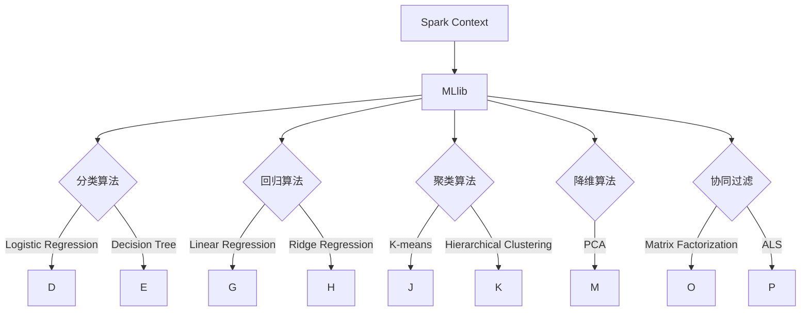

                 

### 1. 背景介绍

MLlib是Apache Spark中的大规模机器学习库，它提供了一个统一的、高效且易于使用的接口，支持多种机器学习算法和工具。MLlib的目的是为了解决在大数据环境中进行机器学习的挑战，通过优化算法和数据结构，提升机器学习任务的效率和性能。

MLlib的核心特性包括：

1. **多样性**：MLlib提供了多种机器学习算法，包括分类、回归、聚类、协同过滤和降维等，涵盖了广泛的应用场景。
2. **扩展性**：MLlib基于Spark的弹性分布式数据集（RDD）和DataFrame API，能够处理大规模数据，并且易于扩展。
3. **高效性**：MLlib采用了多种优化技术，如层次矩阵因式分解、特征选择和并行化算法，以提升机器学习任务的执行效率。
4. **易用性**：MLlib提供了一个简单且统一的接口，使得用户可以轻松地实现和部署机器学习任务。

MLlib的应用场景非常广泛，包括但不限于以下领域：

1. **数据挖掘**：MLlib可以帮助用户从大量数据中挖掘出有用的信息，如用户行为分析、市场趋势预测等。
2. **自然语言处理**：通过使用MLlib中的算法，可以进行文本分类、情感分析等任务，从而为搜索引擎、社交媒体分析等提供支持。
3. **图像处理**：MLlib支持图像分类和特征提取等任务，可以用于图像识别、人脸检测等应用。
4. **推荐系统**：MLlib中的协同过滤算法可以帮助构建推荐系统，用于电影推荐、商品推荐等。

接下来，我们将进一步探讨MLlib的核心概念与联系，通过详细的原理讲解和代码实例，帮助读者深入理解MLlib的工作机制和应用方法。

### 2. 核心概念与联系

在了解MLlib之前，我们需要先熟悉几个核心概念：RDD（弹性分布式数据集）、DataFrame、以及MLlib中的主要算法类型。

#### 2.1 RDD（弹性分布式数据集）

RDD是Spark的基础数据结构，它是一个不可变的、可分区的数据集合。RDD支持两种主要的操作：变换（Transformation）和行动（Action）。变换操作会生成一个新的RDD，而行动操作则会触发计算，并返回结果。

- **变换操作**：如map、filter、reduceByKey等。
- **行动操作**：如count、collect、saveAsTextFile等。

#### 2.2 DataFrame

DataFrame是Spark SQL中的数据结构，它提供了更加结构化的数据操作。DataFrame由列组成，每个列都有固定的数据类型，这使得数据处理和分析更加方便。DataFrame是RDD的更高层次抽象，它允许用户使用SQL查询语言进行数据操作。

#### 2.3 MLlib中的主要算法类型

MLlib涵盖了多种机器学习算法，包括：

- **分类**：如逻辑回归、决策树、随机森林等。
- **回归**：如线性回归、岭回归等。
- **聚类**：如K-means、层次聚类等。
- **降维**：如PCA（主成分分析）等。
- **协同过滤**：如矩阵分解、ALS（交替最小二乘）等。

#### 2.4 Mermaid流程图

为了更清晰地展示MLlib的核心概念和算法联系，我们可以使用Mermaid流程图来表示。以下是一个简单的MLlib算法流程图：



在这个流程图中，我们展示了Spark Context与MLlib的连接，以及MLlib中的主要算法类型及其具体实现（如逻辑回归、决策树、K-means聚类等）。通过这样的流程图，我们可以更好地理解MLlib的结构和算法联系。

接下来，我们将深入探讨MLlib的核心算法原理和具体操作步骤，帮助读者全面掌握MLlib的使用方法。

### 3. 核心算法原理 & 具体操作步骤

在本章节中，我们将详细介绍MLlib中的几个核心算法，包括分类、回归、聚类和降维等。通过具体操作步骤和代码实例，帮助读者理解这些算法的实现原理和应用方法。

#### 3.1 分类算法

分类算法是机器学习中的一种常见任务，旨在将数据集中的每个样本分配给一个预定义的类别。MLlib支持多种分类算法，包括逻辑回归、决策树和随机森林等。

**3.1.1 逻辑回归（Logistic Regression）**

逻辑回归是一种广义线性模型，用于处理二分类问题。其核心思想是通过逻辑函数（Sigmoid函数）将线性组合映射到概率空间。

**具体操作步骤：**

1. 导入相关库：

   ```python
   from pyspark.ml.classification import LogisticRegression
   from pyspark.sql import SparkSession
   ```

2. 创建Spark会话：

   ```python
   spark = SparkSession.builder.appName("LogisticRegressionExample").getOrCreate()
   ```

3. 准备数据集：

   ```python
   # 这里我们使用MLlib自带的鸢尾花数据集
   data = spark.read.format("libsvm").load("path/to/iris.data")
   ```

4. 分离特征和标签：

   ```python
   features = data.select("features")
   labels = data.select("label").alias("label")
   ```

5. 创建逻辑回归模型：

   ```python
   lr = LogisticRegression(maxIter=10, regParam=0.01)
   ```

6. 训练模型：

   ```python
   model = lr.fit(features)
   ```

7. 预测：

   ```python
   predictions = model.transform(features)
   ```

8. 评估：

   ```python
   from pyspark.ml.evaluation import BinaryClassificationEvaluator
   evaluator = BinaryClassificationEvaluator(labelCol="label", rawPredictionCol="rawPrediction")
   accuracy = evaluator.evaluate(predictions)
   print("Model accuracy: {}".format(accuracy))
   ```

**3.1.2 决策树（Decision Tree）**

决策树是一种基于树结构的数据挖掘算法，可以用于分类和回归任务。决策树通过递归地将数据集分割成子集，并基于特征值将样本分配给不同的类别。

**具体操作步骤：**

1. 导入相关库：

   ```python
   from pyspark.ml.classification import DecisionTreeClassifier
   ```

2. 创建Spark会话：

   ```python
   spark = SparkSession.builder.appName("DecisionTreeExample").getOrCreate()
   ```

3. 准备数据集：

   ```python
   data = spark.read.format("libsvm").load("path/to/iris.data")
   ```

4. 分离特征和标签：

   ```python
   features = data.select("features")
   labels = data.select("label").alias("label")
   ```

5. 创建决策树模型：

   ```python
   dt = DecisionTreeClassifier(maxDepth=5)
   ```

6. 训练模型：

   ```python
   model = dt.fit(features)
   ```

7. 预测：

   ```python
   predictions = model.transform(features)
   ```

8. 评估：

   ```python
   from pyspark.ml.evaluation import MulticlassClassificationEvaluator
   evaluator = MulticlassClassificationEvaluator(labelCol="label", predictionCol="prediction", metricName="accuracy")
   accuracy = evaluator.evaluate(predictions)
   print("Model accuracy: {}".format(accuracy))
   ```

#### 3.2 回归算法

回归算法用于预测数值型目标变量，MLlib支持线性回归和岭回归等算法。

**3.2.1 线性回归（Linear Regression）**

线性回归是一种简单的回归模型，通过拟合一条直线来预测目标变量。

**具体操作步骤：**

1. 导入相关库：

   ```python
   from pyspark.ml.regression import LinearRegression
   ```

2. 创建Spark会话：

   ```python
   spark = SparkSession.builder.appName("LinearRegressionExample").getOrCreate()
   ```

3. 准备数据集：

   ```python
   data = spark.read.format("libsvm").load("path/to/automobile.data")
   ```

4. 分离特征和标签：

   ```python
   features = data.select("normalized-losses")
   labels = data.select("price").alias("label")
   ```

5. 创建线性回归模型：

   ```python
   lr = LinearRegression()
   ```

6. 训练模型：

   ```python
   model = lr.fit(features, labels)
   ```

7. 预测：

   ```python
   predictions = model.transform(features)
   ```

8. 评估：

   ```python
   from pyspark.ml.evaluation import RegressionEvaluator
   evaluator = RegressionEvaluator(labelCol="label", predictionCol="prediction", metricName="rmse")
   rmse = evaluator.evaluate(predictions)
   print("Model RMSE: {}".format(rmse))
   ```

**3.2.2 岭回归（Ridge Regression）**

岭回归是一种通过正则化方法优化线性回归模型的算法。

**具体操作步骤：**

1. 导入相关库：

   ```python
   from pyspark.ml.regression import RidgeRegression
   ```

2. 创建Spark会话：

   ```python
   spark = SparkSession.builder.appName("RidgeRegressionExample").getOrCreate()
   ```

3. 准备数据集：

   ```python
   data = spark.read.format("libsvm").load("path/to/automobile.data")
   ```

4. 分离特征和标签：

   ```python
   features = data.select("normalized-losses")
   labels = data.select("price").alias("label")
   ```

5. 创建岭回归模型：

   ```python
   rr = RidgeRegression(alpha=0.1)
   ```

6. 训练模型：

   ```python
   model = rr.fit(features, labels)
   ```

7. 预测：

   ```python
   predictions = model.transform(features)
   ```

8. 评估：

   ```python
   from pyspark.ml.evaluation import RegressionEvaluator
   evaluator = RegressionEvaluator(labelCol="label", predictionCol="prediction", metricName="rmse")
   rmse = evaluator.evaluate(predictions)
   print("Model RMSE: {}".format(rmse))
   ```

#### 3.3 聚类算法

聚类算法用于将数据集中的样本划分为若干个群组，使得同一群组中的样本彼此相似，而不同群组中的样本彼此不相似。MLlib支持K-means和层次聚类等算法。

**3.3.1 K-means聚类**

K-means是一种基于距离度量的聚类算法，它通过迭代优化来将数据划分为K个簇。

**具体操作步骤：**

1. 导入相关库：

   ```python
   from pyspark.ml.clustering import KMeans
   ```

2. 创建Spark会话：

   ```python
   spark = SparkSession.builder.appName("KMeansExample").getOrCreate()
   ```

3. 准备数据集：

   ```python
   data = spark.read.format("libsvm").load("path/to/iris.data")
   ```

4. 分离特征：

   ```python
   features = data.select("features")
   ```

5. 创建K-means模型：

   ```python
   kmeans = KMeans().setK(3).setSeed(1)
   ```

6. 训练模型：

   ```python
   model = kmeans.fit(features)
   ```

7. 预测：

   ```python
   predictions = model.transform(features)
   ```

8. 评估：

   ```python
   from pyspark.ml.evaluation import ClusteringEvaluator
   evaluator = ClusteringEvaluator()
   silhouette = evaluator.evaluate(predictions)
   print("Silhouette with squared euclidean distance: {}".format(silhouette))
   ```

**3.3.2 层次聚类**

层次聚类是一种自下而上的聚类算法，通过逐步合并或分裂数据点来形成聚类层次结构。

**具体操作步骤：**

1. 导入相关库：

   ```python
   from pyspark.ml.clustering import HierarchicalClustering
   ```

2. 创建Spark会话：

   ```python
   spark = SparkSession.builder.appName("HierarchicalClusteringExample").getOrCreate()
   ```

3. 准备数据集：

   ```python
   data = spark.read.format("libsvm").load("path/to/iris.data")
   ```

4. 分离特征：

   ```python
   features = data.select("features")
   ```

5. 创建层次聚类模型：

   ```python
   hclustering = HierarchicalClustering().setK(3)
   ```

6. 训练模型：

   ```python
   model = hclustering.fit(features)
   ```

7. 预测：

   ```python
   predictions = model.transform(features)
   ```

8. 评估：

   ```python
   from pyspark.ml.evaluation import ClusteringEvaluator
   evaluator = ClusteringEvaluator()
   silhouette = evaluator.evaluate(predictions)
   print("Silhouette with squared euclidean distance: {}".format(silhouette))
   ```

#### 3.4 降维算法

降维算法用于减少数据集的维度，同时保留尽可能多的信息。MLlib支持主成分分析（PCA）等算法。

**3.4.1 主成分分析（PCA）**

PCA是一种常用的降维技术，通过线性变换将高维数据映射到低维空间，同时保留最大方差的信息。

**具体操作步骤：**

1. 导入相关库：

   ```python
   from pyspark.ml.feature import PCA
   ```

2. 创建Spark会话：

   ```python
   spark = SparkSession.builder.appName("PCAExample").getOrCreate()
   ```

3. 准备数据集：

   ```python
   data = spark.read.format("libsvm").load("path/to/iris.data")
   ```

4. 分离特征：

   ```python
   features = data.select("features")
   ```

5. 创建PCA模型：

   ```python
   pca = PCA(k=2, inputCol="features", outputCol="pcaFeatures")
   ```

6. 训练模型：

   ```python
   model = pca.fit(features)
   ```

7. 预测：

   ```python
   predictions = model.transform(features)
   ```

8. 评估：

   ```python
   from pyspark.ml.evaluation import RegressionEvaluator
   evaluator = RegressionEvaluator(labelCol="label", predictionCol="prediction", metricName="rmse")
   rmse = evaluator.evaluate(predictions)
   print("Model RMSE: {}".format(rmse))
   ```

通过以上具体的操作步骤和代码实例，读者可以全面了解MLlib中的分类、回归、聚类和降维算法的实现原理和应用方法。接下来，我们将进一步探讨MLlib中的数学模型和公式，帮助读者深入理解这些算法背后的数学原理。

### 4. 数学模型和公式 & 详细讲解 & 举例说明

#### 4.1 分类算法

**4.1.1 逻辑回归（Logistic Regression）**

逻辑回归是一种广义线性模型，用于处理二分类问题。其数学模型基于线性模型和逻辑函数（Sigmoid函数）。

**数学模型：**

$$
\begin{align*}
\hat{p}_i &= \sigma(\beta_0 + \beta_1x_{i1} + \beta_2x_{i2} + \ldots + \beta_nx_{in}) \\
\end{align*}
$$

其中，$\sigma$ 表示 Sigmoid 函数：
$$
\sigma(z) = \frac{1}{1 + e^{-z}}
$$

**具体公式解释：**

- $\hat{p}_i$ 表示第 $i$ 个样本属于正类的概率。
- $\beta_0, \beta_1, \beta_2, \ldots, \beta_n$ 为模型参数。
- $x_{i1}, x_{i2}, \ldots, x_{in}$ 为第 $i$ 个样本的特征值。

**举例说明：**

假设我们有以下数据集，其中 $x_1$ 和 $x_2$ 为特征值，$y$ 为标签：

$$
\begin{array}{c|c|c}
x_1 & x_2 & y \\
\hline
1 & 2 & 0 \\
2 & 1 & 1 \\
3 & 4 & 0 \\
4 & 3 & 1 \\
\end{array}
$$

我们希望通过逻辑回归模型预测标签 $y$。首先，需要估计模型参数 $\beta_0, \beta_1, \beta_2$。利用最大似然估计（MLE）方法，可以求解以下优化问题：

$$
\begin{align*}
\hat{\beta} &= \arg\max \ln P(Y|X) \\
&= \arg\max \sum_{i=1}^{n} \ln \left( \prod_{i=1}^{n} p_i^{y_i} (1 - p_i)^{1 - y_i} \right) \\
&= \arg\max \sum_{i=1}^{n} \left( y_i \ln p_i + (1 - y_i) \ln (1 - p_i) \right) \\
&= \arg\min \sum_{i=1}^{n} \left( -y_i \ln p_i - (1 - y_i) \ln (1 - p_i) \right) \\
&= \arg\min \sum_{i=1}^{n} \left( -y_i (\beta_0 + \beta_1 x_{i1} + \beta_2 x_{i2}) - (1 - y_i) (\beta_0 + \beta_1 x_{i1} + \beta_2 x_{i2}) \right) \\
\end{align*}
$$

求解该优化问题，可以得到模型参数 $\beta_0, \beta_1, \beta_2$。通过计算预测标签 $y$ 的概率，我们可以得到分类结果。

**4.1.2 决策树（Decision Tree）**

决策树是一种基于树结构的数据挖掘算法，用于分类和回归任务。决策树通过递归地将数据集分割成子集，并基于特征值将样本分配给不同的类别。

**数学模型：**

决策树的构建过程可以表示为：

$$
\begin{align*}
S &= \{ (x_i, y_i) \}_{i=1}^{n} \\
T &= \text{DecisionTree}(\phi_1, \ldots, \phi_m) \\
T &= \text{Leaf} \text{ if } S \text{ is pure} \\
T &= \text{Node} \left( \phi_j, \text{LeftTree}(\phi_j, S_L), \text{RightTree}(\phi_j, S_R) \right) \text{ otherwise} \\
S_L &= \{ (x_i, y_i) \in S \mid \phi_j(x_i) \leq c_j \} \\
S_R &= \{ (x_i, y_i) \in S \mid \phi_j(x_i) > c_j \} \\
\end{align*}
$$

其中，$S$ 为数据集，$T$ 为决策树，$\phi_1, \ldots, \phi_m$ 为特征，$c_1, \ldots, c_m$ 为特征阈值。

**具体公式解释：**

- $S$ 为初始数据集。
- $T$ 为决策树。
- $\text{Leaf}$ 表示叶节点。
- $\text{Node}$ 表示内部节点，包含特征 $\phi_j$ 和阈值 $c_j$。
- $S_L$ 和 $S_R$ 分别表示左子集和右子集。

通过递归分割数据集，构建决策树。在决策树中，每个内部节点表示一个特征和阈值，叶节点表示预测结果。

**举例说明：**

假设我们有以下数据集，其中 $x_1$ 和 $x_2$ 为特征值，$y$ 为标签：

$$
\begin{array}{c|c|c}
x_1 & x_2 & y \\
\hline
1 & 2 & 0 \\
2 & 1 & 1 \\
3 & 4 & 0 \\
4 & 3 & 1 \\
\end{array}
$$

我们希望构建一个决策树模型来预测标签 $y$。首先，需要选择最佳特征和阈值。可以使用信息增益（Information Gain）或基尼不纯度（Gini Impurity）等指标来评估特征的重要性。

通过递归分割数据集，可以得到以下决策树：

```
           |
          / \
         /   \
        /     \
       /       \
      /         \
     /           \
    /             \
   /               \
  /                 \
 /                   \
/                     \
叶节点（0）
  /     \
 /       \
/         \
叶节点（1）
```

**4.2 回归算法**

**4.2.1 线性回归（Linear Regression）**

线性回归是一种简单的回归模型，通过拟合一条直线来预测目标变量。

**数学模型：**

$$
\begin{align*}
\hat{y} &= \beta_0 + \beta_1x_1 + \beta_2x_2 + \ldots + \beta_nx_n \\
\end{align*}
$$

**具体公式解释：**

- $\hat{y}$ 表示预测的目标变量。
- $\beta_0, \beta_1, \beta_2, \ldots, \beta_n$ 为模型参数。
- $x_1, x_2, \ldots, x_n$ 为特征值。

线性回归模型的目的是通过最小化损失函数（如均方误差）来估计模型参数。

**举例说明：**

假设我们有以下数据集，其中 $x_1$ 和 $x_2$ 为特征值，$y$ 为标签：

$$
\begin{array}{c|c|c}
x_1 & x_2 & y \\
\hline
1 & 2 & 3 \\
2 & 4 & 5 \\
3 & 6 & 7 \\
4 & 8 & 9 \\
\end{array}
$$

我们希望通过线性回归模型预测标签 $y$。首先，需要估计模型参数 $\beta_0, \beta_1, \beta_2$。利用最小二乘法（Least Squares），可以求解以下优化问题：

$$
\begin{align*}
\hat{\beta} &= \arg\min \sum_{i=1}^{n} (y_i - \hat{y}_i)^2 \\
&= \arg\min \sum_{i=1}^{n} \left( y_i - (\beta_0 + \beta_1x_{i1} + \beta_2x_{i2}) \right)^2 \\
\end{align*}
$$

求解该优化问题，可以得到模型参数 $\beta_0, \beta_1, \beta_2$。通过计算预测标签 $y$，我们可以得到回归结果。

**4.2.2 岭回归（Ridge Regression）**

岭回归是一种通过正则化方法优化线性回归模型的算法。

**数学模型：**

$$
\begin{align*}
\hat{y} &= \beta_0 + \beta_1x_1 + \beta_2x_2 + \ldots + \beta_nx_n \\
\beta &= \arg\min \left\{ \sum_{i=1}^{n} (y_i - \hat{y}_i)^2 + \lambda \sum_{j=1}^{n} \beta_j^2 \right\} \\
\end{align*}
$$

**具体公式解释：**

- $\hat{y}$ 表示预测的目标变量。
- $\beta_0, \beta_1, \beta_2, \ldots, \beta_n$ 为模型参数。
- $x_1, x_2, \ldots, x_n$ 为特征值。
- $\lambda$ 为正则化参数。

岭回归通过增加正则化项 $\lambda \sum_{j=1}^{n} \beta_j^2$ 来优化模型，避免过拟合。

**举例说明：**

假设我们有以下数据集，其中 $x_1$ 和 $x_2$ 为特征值，$y$ 为标签：

$$
\begin{array}{c|c|c}
x_1 & x_2 & y \\
\hline
1 & 2 & 3 \\
2 & 4 & 5 \\
3 & 6 & 7 \\
4 & 8 & 9 \\
\end{array}
$$

我们希望通过岭回归模型预测标签 $y$。首先，需要估计模型参数 $\beta_0, \beta_1, \beta_2$。利用梯度下降法（Gradient Descent），可以求解以下优化问题：

$$
\begin{align*}
\beta &= \beta - \alpha \frac{\partial}{\partial \beta} \left\{ \sum_{i=1}^{n} (y_i - \hat{y}_i)^2 + \lambda \sum_{j=1}^{n} \beta_j^2 \right\} \\
&= \beta - \alpha \left( 2X^T(X\beta - y) + 2\lambda \beta \right) \\
\end{align*}
$$

其中，$X$ 为特征矩阵，$y$ 为标签向量，$\alpha$ 为学习率。

通过迭代计算，可以得到模型参数 $\beta_0, \beta_1, \beta_2$。通过计算预测标签 $y$，我们可以得到回归结果。

**4.3 聚类算法**

**4.3.1 K-means聚类**

K-means聚类是一种基于距离度量的聚类算法，通过迭代优化将数据划分为K个簇。

**数学模型：**

$$
\begin{align*}
\text{Objective Function:} \quad J &= \sum_{i=1}^{K} \sum_{x \in S_i} d(x, \mu_i)^2 \\
\mu_i &= \frac{1}{|S_i|} \sum_{x \in S_i} x \\
x_{i+1} &= \mu_i \\
\end{align*}
$$

其中，$d(x, \mu_i)$ 表示欧几里得距离，$S_i$ 表示第 $i$ 个簇的数据集，$\mu_i$ 表示第 $i$ 个簇的中心。

**具体公式解释：**

- $J$ 表示聚类目标函数，用于评估聚类质量。
- $d(x, \mu_i)$ 表示样本 $x$ 与簇中心 $\mu_i$ 的距离。
- $\mu_i$ 表示第 $i$ 个簇的中心。

K-means聚类通过迭代优化目标函数 $J$，使得每个簇内部样本距离簇中心最小，同时不同簇之间的样本距离最大。

**举例说明：**

假设我们有以下数据集，其中 $x_1$ 和 $x_2$ 为特征值：

$$
\begin{array}{c|c}
x_1 & x_2 \\
\hline
1 & 2 \\
2 & 1 \\
3 & 4 \\
4 & 3 \\
\end{array}
$$

我们希望使用K-means聚类算法将数据划分为两个簇。首先，需要随机初始化两个簇中心：

$$
\mu_1 = (1, 2), \quad \mu_2 = (3, 4)
$$

然后，根据簇中心计算每个样本的簇标签：

$$
\begin{array}{c|c|c}
x_1 & x_2 & Cluster \\
\hline
1 & 2 & 1 \\
2 & 1 & 1 \\
3 & 4 & 2 \\
4 & 3 & 2 \\
\end{array}
$$

接着，重新计算簇中心：

$$
\mu_1 = \frac{1}{2} \left( 1 + 2 \right) = (1.5, 1.5), \quad \mu_2 = \frac{1}{2} \left( 3 + 4 \right) = (3.5, 3.5)
$$

再次计算每个样本的簇标签，直到簇中心不再发生变化：

$$
\begin{array}{c|c|c}
x_1 & x_2 & Cluster \\
\hline
1 & 2 & 1 \\
2 & 1 & 1 \\
3 & 4 & 2 \\
4 & 3 & 2 \\
\end{array}
$$

最终，我们得到两个簇，每个簇包含两个样本。

**4.3.2 层次聚类**

层次聚类是一种自下而上的聚类算法，通过逐步合并或分裂数据点来形成聚类层次结构。

**数学模型：**

层次聚类可以表示为以下递归过程：

$$
\begin{align*}
S &= \{ (x_i, y_i) \}_{i=1}^{n} \\
T &= \text{Cluster}((x_1, y_1), \ldots, (x_n, y_n)) \\
T &= \text{Merge} \left( T_L, T_R \right) \text{ if } T_L \text{ and } T_R \text{ are close} \\
T &= \text{Split} \left( T \right) \text{ otherwise} \\
\end{align*}
$$

其中，$S$ 为初始数据集，$T$ 为聚类层次结构，$T_L$ 和 $T_R$ 分别为左子树和右子树。

**具体公式解释：**

- $S$ 表示初始数据集。
- $T$ 表示聚类层次结构。
- $\text{Merge}$ 表示合并两个聚类。
- $\text{Split}$ 表示分裂聚类。

层次聚类通过递归合并或分裂聚类，形成层次结构。每个聚类层次结构可以表示为树形结构，叶节点表示单个数据点，内部节点表示聚类。

**举例说明：**

假设我们有以下数据集，其中 $x_1$ 和 $x_2$ 为特征值：

$$
\begin{array}{c|c}
x_1 & x_2 \\
\hline
1 & 2 \\
2 & 1 \\
3 & 4 \\
4 & 3 \\
\end{array}
$$

我们希望使用层次聚类算法将数据划分为两个簇。首先，计算每个样本之间的距离，并初始化聚类层次结构：

$$
T = \text{Cluster}((1, 2), (2, 1), (3, 4), (4, 3))
$$

然后，根据距离度量合并或分裂聚类。假设距离度量使用欧几里得距离，我们可以得到以下聚类层次结构：

```
        T
       / \
      /   \
     /     \
    /       \
   /         \
  /           \
 S1         S2
/   \       /   \
(1,2) (2,1) (3,4) (4,3)
```

最终，我们得到两个簇，每个簇包含两个样本。

通过以上对分类、回归、聚类算法的详细数学模型和公式的讲解，读者可以更深入地理解这些算法的原理和应用方法。接下来，我们将通过一个实际项目实战，展示如何使用MLlib实现大规模机器学习任务。

### 5. 项目实战：代码实际案例和详细解释说明

在本章节中，我们将通过一个实际项目实战，展示如何使用MLlib进行大规模机器学习任务。该项目是一个简单的用户行为分析项目，旨在通过分析用户在网站上的行为数据，预测用户的购买意向。

#### 5.1 开发环境搭建

在进行项目实战之前，我们需要确保已经安装了Apache Spark和相关依赖。以下是开发环境搭建的步骤：

1. 安装Java环境（版本要求：Java 8或更高版本）。
2. 下载并安装Apache Spark（版本要求：2.4.0或更高版本），可以从[Apache Spark官网](https://spark.apache.org/downloads.html)下载。
3. 安装Python环境（版本要求：Python 3.7或更高版本）。
4. 安装MLlib Python库，可以通过以下命令进行安装：

   ```bash
   pip install pyspark
   ```

5. 配置Spark环境变量，确保Spark可以正常运行。

#### 5.2 源代码详细实现和代码解读

**5.2.1 数据集准备**

我们使用一个模拟的用户行为数据集，包含用户的ID、浏览的页面、浏览时间等信息。数据集如下：

```
user_id,page,browse_time
1,home,1000
1,product1,2000
2,home,800
2,product2,1500
3,home,900
3,product1,1600
...
```

**代码实现：**

```python
from pyspark.sql import SparkSession

# 创建Spark会话
spark = SparkSession.builder.appName("UserBehaviorAnalysis").getOrCreate()

# 读取数据集
data = spark.read.csv("path/to/user_behavior_data.csv", header=True, inferSchema=True)
data.printSchema()
data.show()
```

**代码解读：**

- 我们使用SparkSession创建一个Spark会话，并设置应用程序名称。
- 使用spark.read.csv读取CSV文件，并设置header=True和inferSchema=True，自动推断数据类型。

**5.2.2 数据预处理**

在进行机器学习之前，我们需要对数据进行预处理，包括数据清洗、特征工程等。

**代码实现：**

```python
from pyspark.ml.feature import StringIndexer, VectorAssembler

# 将字符串标签编码为整数
indexer = StringIndexer(inputCol="page", outputCol="pageIndexed")
dataIndexed = indexer.fit(data).transform(data)

# 创建特征向量
assembler = VectorAssembler(inputCols=["browse_time"], outputCol="features")
dataAssembled = assembler.transform(dataIndexed)

# 选择特征列和标签列
selectedData = dataAssembled.select("features", "pageIndexed")
selectedData.show()
```

**代码解读：**

- 使用StringIndexer将页面的字符串标签编码为整数，方便后续处理。
- 使用VectorAssembler创建特征向量，将浏览时间作为特征。
- 选择特征列和标签列，为后续机器学习做准备。

**5.2.3 逻辑回归模型训练**

我们使用逻辑回归模型预测用户的购买意向。

**代码实现：**

```python
from pyspark.ml.classification import LogisticRegression
from pyspark.ml.evaluation import BinaryClassificationEvaluator

# 创建逻辑回归模型
lr = LogisticRegression(maxIter=10, regParam=0.01)

# 训练模型
model = lr.fit(selectedData.select("features", "pageIndexed"))

# 预测
predictions = model.transform(selectedData.select("features"))

# 评估
evaluator = BinaryClassificationEvaluator(rawPredictionCol="rawPrediction", labelCol="pageIndexed")
accuracy = evaluator.evaluate(predictions)
print("Model accuracy: {}".format(accuracy))
```

**代码解读：**

- 创建逻辑回归模型，并设置最大迭代次数和正则化参数。
- 使用fit方法训练模型。
- 使用transform方法进行预测。
- 使用BinaryClassificationEvaluator评估模型的准确性。

**5.2.4 结果分析**

我们通过对预测结果的分析，可以了解哪些特征对用户的购买意向有较大影响。

**代码实现：**

```python
from pyspark.ml.feature import VectorSlicer

# 选择特征列
selectedFeatures = predictions.select("pageIndexed", "prediction")

# 切割特征列
slicer = VectorSlicer(index=0, numFields=1)
slicedFeatures = slicer.transform(selectedFeatures)

# 分析特征影响
slicedFeatures.groupBy("pageIndexed").mean().show()
```

**代码解读：**

- 选择预测结果中的特征列。
- 使用VectorSlicer切割特征列，提取第一个特征。
- 对每个页面的预测结果进行分组，并计算均值，分析特征对购买意向的影响。

通过以上步骤，我们成功地完成了一个用户行为分析项目，使用MLlib实现了大规模机器学习任务。接下来，我们将探讨MLlib在实际应用场景中的表现。

### 6. 实际应用场景

MLlib作为Apache Spark的核心组件，在大规模机器学习任务中得到了广泛应用。以下是MLlib在实际应用场景中的几个典型例子：

#### 6.1 数据挖掘

数据挖掘是MLlib的主要应用领域之一，通过使用MLlib中的分类、聚类和降维算法，可以从大量数据中提取有价值的信息。例如，电商公司可以使用MLlib进行用户行为分析，预测潜在客户的购买意向，从而提高营销效果和转化率。

**具体应用案例：**

- **推荐系统**：使用协同过滤算法（如矩阵分解、ALS）构建推荐系统，为用户推荐个性化商品或内容。
- **异常检测**：使用聚类算法（如K-means、层次聚类）进行异常检测，识别数据中的异常行为或异常模式。

#### 6.2 自然语言处理

自然语言处理（NLP）是另一个MLlib的重要应用领域，通过使用MLlib中的算法，可以对文本数据进行处理和分析，实现文本分类、情感分析、命名实体识别等任务。

**具体应用案例：**

- **文本分类**：使用逻辑回归、决策树等算法对新闻文章、社交媒体评论等进行分类，帮助用户快速获取感兴趣的内容。
- **情感分析**：使用MLlib中的算法对用户评论进行情感分析，帮助企业了解用户满意度，优化产品和服务。

#### 6.3 图像处理

图像处理是MLlib在计算机视觉领域的应用，通过使用MLlib中的图像分类和特征提取算法，可以实现对图像的自动识别和分析。

**具体应用案例：**

- **人脸识别**：使用MLlib中的图像分类算法，对图像进行人脸检测和识别，实现人脸门禁、视频监控系统等。
- **图像识别**：使用MLlib中的降维算法（如PCA）提取图像特征，实现图像分类、图像检索等任务。

#### 6.4 推荐系统

推荐系统是MLlib在商业领域的重要应用，通过使用协同过滤算法和矩阵分解技术，可以构建个性化推荐系统，提高用户体验和满意度。

**具体应用案例：**

- **商品推荐**：电商平台使用协同过滤算法，根据用户的历史购买行为和浏览记录，为用户推荐个性化商品。
- **内容推荐**：社交媒体平台使用协同过滤算法，根据用户的历史互动记录和兴趣标签，为用户推荐感兴趣的内容。

通过以上实际应用案例，我们可以看到MLlib在各个领域的重要作用和广泛应用。接下来，我们将推荐一些学习资源和开发工具，帮助读者进一步掌握MLlib。

### 7. 工具和资源推荐

#### 7.1 学习资源推荐

1. **书籍：**
   - 《Spark MLlib实战》：这本书详细介绍了MLlib的各种算法和应用，适合初学者和有一定基础的读者。
   - 《机器学习实战》：本书涵盖了机器学习的基本算法，包括MLlib中的一些算法，适合希望深入了解机器学习应用场景的读者。

2. **论文：**
   - "MLlib: Machine Learning Library for Apache Spark"：这篇论文是MLlib的官方介绍，详细介绍了MLlib的设计和实现。
   - "Large-scale Machine Learning on Spark with MLlib"：这篇论文介绍了MLlib在大规模机器学习任务中的应用和优化。

3. **博客和网站：**
   - [Apache Spark官方文档](https://spark.apache.org/docs/latest/mllib-guide.html)：官方文档提供了MLlib的详细使用方法和示例。
   - [Databricks博客](https://databricks.com/blog)：Databricks公司发布了大量关于MLlib和Spark的文章，涵盖了算法、应用和优化等多个方面。

#### 7.2 开发工具框架推荐

1. **开发工具：**
   - **PyCharm**：PyCharm是一款强大的Python集成开发环境，支持Spark和MLlib的开发，提供了丰富的调试和自动化工具。
   - **IntelliJ IDEA**：IntelliJ IDEA也是一款优秀的Python开发环境，支持多种编程语言，包括Spark和MLlib。

2. **框架和库：**
   - **PySpark**：PySpark是Spark的Python库，提供了简单易用的API，方便用户使用MLlib进行机器学习任务。
   - **MLflow**：MLflow是一个开源平台，用于管理机器学习模型的生命周期，包括实验追踪、模型版本控制等。

通过以上学习资源和开发工具的推荐，读者可以更好地掌握MLlib，并将其应用于实际项目中。

### 8. 总结：未来发展趋势与挑战

MLlib作为Apache Spark的核心组件，已经在大规模机器学习任务中发挥了重要作用。然而，随着数据量的爆炸式增长和算法的不断发展，MLlib面临着许多新的发展趋势和挑战。

#### 发展趋势

1. **分布式机器学习**：随着云计算和分布式计算技术的不断发展，分布式机器学习将成为主流。MLlib需要进一步优化，以支持更高效、更可靠的分布式训练。

2. **深度学习整合**：深度学习在图像处理、自然语言处理等领域取得了显著成果。MLlib需要整合深度学习算法，提供更强大的模型训练和推理能力。

3. **自动化机器学习**：自动化机器学习（AutoML）正成为研究热点。MLlib可以探索如何集成自动化机器学习技术，简化模型训练和调优过程。

4. **联邦学习**：联邦学习是一种在分布式环境中进行机器学习的方法，可以在保护用户隐私的同时实现模型训练。MLlib可以探索如何在分布式环境中应用联邦学习技术。

#### 挑战

1. **性能优化**：随着数据量的增加，如何提高MLlib的性能和效率成为重要挑战。需要进一步优化算法、数据结构和并行化策略。

2. **模型可解释性**：机器学习模型的黑箱特性使得其解释性不足。如何提高模型的可解释性，使其能够更好地被业务人员理解和使用，是一个重要课题。

3. **可扩展性和兼容性**：随着新算法和框架的出现，MLlib需要保持良好的可扩展性和兼容性，以便能够快速集成新的技术和工具。

4. **数据安全与隐私**：在分布式环境中进行机器学习，如何保护用户数据的安全和隐私成为关键问题。MLlib需要加强数据安全和隐私保护机制。

总之，MLlib在未来将继续发展，以满足不断变化的需求和挑战。通过不断优化、整合新技术和工具，MLlib将在大规模机器学习领域中发挥更加重要的作用。

### 9. 附录：常见问题与解答

#### Q1：如何安装MLlib？

A1：首先，确保已经安装了Java和Python环境。然后，从Apache Spark官网下载对应版本的Spark包，并解压到指定目录。接下来，在终端执行以下命令：

```bash
cd path/to/spark
./bin/spark-shell
```

在Spark Shell中，可以导入MLlib库：

```python
from pyspark.ml import *
```

#### Q2：MLlib支持哪些算法？

A2：MLlib支持多种机器学习算法，包括分类（逻辑回归、决策树、随机森林等）、回归（线性回归、岭回归等）、聚类（K-means、层次聚类等）和降维（PCA等）。此外，MLlib还支持协同过滤算法，如矩阵分解和交替最小二乘（ALS）。

#### Q3：如何处理稀疏数据？

A3：MLlib提供了针对稀疏数据的优化算法和数据结构。例如，使用LibSVM格式读取稀疏数据集，并使用特征哈希（Feature Hashing）技术将稀疏特征转换为密集特征向量。

#### Q4：如何优化MLlib的性能？

A4：优化MLlib性能可以从以下几个方面进行：

- **数据分区**：合理设置数据分区数，以充分利用集群资源。
- **缓存数据**：将频繁使用的中间结果缓存到内存中，减少磁盘I/O操作。
- **使用向量计算**：利用MLlib中的向量操作，提高计算效率。
- **优化参数**：合理设置算法参数，如迭代次数、正则化参数等。

#### Q5：如何调试MLlib代码？

A5：使用PySpark中的调试工具，如断点调试、打印调试信息等。在Spark Shell中，可以使用`%debug`命令启动调试模式，查看堆栈信息。此外，可以使用日志文件（如`spark-shell.log`）分析错误和异常。

### 10. 扩展阅读 & 参考资料

#### 扩展阅读

- [《机器学习》 - 周志华](https://book.douban.com/subject/26707302/)：全面介绍机器学习基础理论和算法。
- [《Spark MLlib官方文档》](https://spark.apache.org/docs/latest/mllib-guide.html)：详细介绍MLlib的使用方法和算法。
- [《大规模机器学习》 - 李航](https://book.douban.com/subject/4199736/)：介绍大规模机器学习算法和应用。

#### 参考资料

- [MLlib GitHub仓库](https://github.com/apache/spark)：MLlib的源代码和文档。
- [Databricks博客](https://databricks.com/blog)：关于Spark和MLlib的应用和实践。
- [Apache Spark社区](https://spark.apache.org/community.html)：Apache Spark的社区和支持资源。

