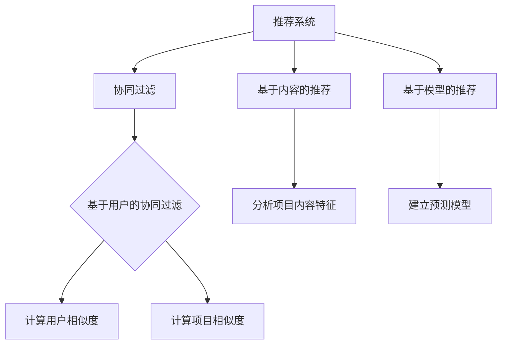

                 

# Mahout推荐算法原理与代码实例讲解

## 摘要

本文将详细介绍Mahout推荐算法的基本原理及其在实践中的应用。Mahout是一款基于Apache旗下的开源推荐系统框架，它支持多种常用的推荐算法，如协同过滤、基于内容的推荐、基于模型的推荐等。通过本文的讲解，您将了解如何使用Mahout实现推荐系统，掌握其核心算法原理，以及通过实际代码示例，深入理解算法的具体实现过程。无论您是初学者还是经验丰富的开发者，这篇文章都将为您提供有价值的参考和启示。

## 1. 背景介绍

推荐系统是一种信息过滤技术，旨在向用户推荐他们可能感兴趣的项目、产品或服务。随着互联网和电子商务的迅速发展，推荐系统已经成为许多应用场景中的重要组成部分，如社交媒体、电商网站、视频流媒体等。推荐系统通过分析用户的兴趣和行为模式，预测用户可能感兴趣的内容，从而提高用户满意度、增加用户粘性和转化率。

Apache Mahout是一个开源的推荐系统框架，它基于Hadoop和MapReduce，可以处理大规模数据集上的推荐任务。Mahout提供了多种常用的推荐算法，包括协同过滤、基于内容的推荐和基于模型的推荐等。这些算法可以帮助用户发现潜在的兴趣点，提高推荐系统的准确性。Mahout的设计理念是简化推荐系统的开发和部署，使得开发者可以更加专注于业务逻辑，而无需关注底层计算和存储细节。

本文将围绕Mahout推荐算法展开，详细讲解其核心原理、数学模型和代码实现。通过本文的学习，您将掌握如何使用Mahout搭建推荐系统，了解不同推荐算法的优缺点，从而在具体应用场景中灵活选择和调整算法参数。

## 2. 核心概念与联系

### 2.1 协同过滤（Collaborative Filtering）

协同过滤是推荐系统中最常用的算法之一，它基于用户的历史行为（如评分、购买记录等）来预测用户对未知项目的兴趣。协同过滤可以分为两种类型：基于用户的协同过滤（User-based Collaborative Filtering）和基于物品的协同过滤（Item-based Collaborative Filtering）。

#### 基于用户的协同过滤

基于用户的协同过滤通过计算用户之间的相似度，找到与目标用户兴趣相似的邻居用户，然后根据邻居用户对项目的评分预测目标用户对项目的兴趣。相似度通常通过用户评分矩阵计算，可以使用余弦相似度、皮尔逊相关系数等度量方法。

#### 基于物品的协同过滤

基于物品的协同过滤通过计算项目之间的相似度，找到与目标项目相似的其他项目，然后根据相似项目的历史评分预测用户对目标项目的兴趣。项目相似度可以使用余弦相似度、欧几里得距离等度量方法计算。

### 2.2 基于内容的推荐（Content-based Recommender）

基于内容的推荐通过分析项目的内容特征（如文本、图像、音频等），为用户推荐具有相似内容的其他项目。这种方法通常用于新闻推荐、音乐推荐和视频推荐等领域。基于内容的推荐可以有效地过滤掉用户不感兴趣的项目，提高推荐的准确性。

### 2.3 基于模型的推荐（Model-based Recommender）

基于模型的推荐使用机器学习算法（如线性回归、逻辑回归、决策树、神经网络等）建立用户和项目之间的预测模型。模型可以捕捉用户和项目之间的复杂关系，从而提高推荐的准确性。基于模型的推荐算法通常需要大量的训练数据和计算资源，但可以适应动态变化的用户兴趣。

### 2.4 Mermaid流程图

为了更好地理解这些核心概念之间的联系，我们可以使用Mermaid绘制一个流程图，如下所示：



在上述流程图中，协同过滤、基于内容的推荐和基于模型的推荐构成了推荐系统的核心组成部分。每种推荐算法都有其独特的计算方法和应用场景，通过灵活组合和调整算法参数，可以构建出满足不同需求的推荐系统。

## 3. 核心算法原理 & 具体操作步骤

### 3.1 协同过滤算法原理

协同过滤算法的核心思想是利用用户之间的行为相似性来预测用户对未知项目的兴趣。协同过滤算法可以分为基于用户的协同过滤和基于物品的协同过滤两种类型。

#### 基于用户的协同过滤

基于用户的协同过滤通过计算用户之间的相似度，找到与目标用户兴趣相似的邻居用户，然后根据邻居用户对项目的评分预测目标用户对项目的兴趣。具体步骤如下：

1. **计算用户相似度**：首先，我们需要计算用户之间的相似度。常见的相似度计算方法有：

   - **余弦相似度**：计算两个用户在项目上的评分向量之间的余弦相似度。余弦相似度可以表示为两个向量夹角的余弦值，其取值范围在[-1, 1]之间，越接近1表示相似度越高。

   - **皮尔逊相关系数**：计算两个用户在项目上的评分向量之间的皮尔逊相关系数。皮尔逊相关系数可以表示两个变量之间的线性相关性，其取值范围在[-1, 1]之间，越接近1表示相似度越高。

2. **选择邻居用户**：根据用户相似度矩阵，选择与目标用户相似度最高的若干邻居用户。

3. **预测用户兴趣**：根据邻居用户对项目的评分，计算目标用户对每个项目的预测评分。常用的预测方法有加权平均预测和基于相似度的评分组合。

   - **加权平均预测**：将邻居用户对每个项目的评分与其相似度作为权重，计算加权平均预测评分。

   - **基于相似度的评分组合**：将邻居用户对每个项目的评分与相似度作为权重，计算加权求和的预测评分。

#### 基于物品的协同过滤

基于物品的协同过滤通过计算项目之间的相似度，找到与目标项目相似的其他项目，然后根据相似项目的历史评分预测用户对目标项目的兴趣。具体步骤如下：

1. **计算项目相似度**：首先，我们需要计算项目之间的相似度。常见的相似度计算方法有：

   - **余弦相似度**：计算两个项目上的用户评分向量之间的余弦相似度。

   - **欧几里得距离**：计算两个项目上的用户评分向量之间的欧几里得距离。

2. **选择相似项目**：根据项目相似度矩阵，选择与目标项目相似度最高的若干相似项目。

3. **预测用户兴趣**：根据相似项目的历史评分，计算目标用户对每个相似项目的预测评分。常用的预测方法有加权平均预测和基于相似度的评分组合。

### 3.2 基于内容的推荐算法原理

基于内容的推荐算法通过分析项目的内容特征，为用户推荐具有相似内容的其他项目。具体步骤如下：

1. **提取项目特征**：首先，我们需要提取项目的内容特征。常见的方法有：

   - **文本特征**：通过词频、词向量、TF-IDF等方法提取文本特征。

   - **图像特征**：通过卷积神经网络、特征提取器等方法提取图像特征。

   - **音频特征**：通过音频信号处理、特征提取器等方法提取音频特征。

2. **计算项目相似度**：根据提取的项目特征，计算项目之间的相似度。常见的相似度计算方法有：

   - **余弦相似度**：计算两个项目特征向量之间的余弦相似度。

   - **欧几里得距离**：计算两个项目特征向量之间的欧几里得距离。

3. **预测用户兴趣**：根据相似项目的历史评分，计算目标用户对每个相似项目的预测评分。

### 3.3 基于模型的推荐算法原理

基于模型的推荐算法使用机器学习算法建立用户和项目之间的预测模型，从而提高推荐的准确性。具体步骤如下：

1. **特征工程**：首先，我们需要提取用户和项目的特征，构建特征向量。常见的方法有：

   - **用户特征**：包括用户的基本信息（如年龄、性别、地理位置等）和用户行为特征（如浏览历史、购买记录等）。

   - **项目特征**：包括项目的基本信息（如分类、标签、描述等）和项目特征（如文本、图像、音频等）。

2. **训练模型**：使用训练数据集，通过机器学习算法（如线性回归、逻辑回归、决策树、神经网络等）训练预测模型。

3. **预测用户兴趣**：使用训练好的模型，预测用户对未知项目的兴趣。

### 3.4 具体操作步骤

下面我们通过一个简单的代码示例，展示如何使用Mahout实现基于用户的协同过滤推荐算法。

#### 3.4.1 安装和配置Mahout

首先，我们需要安装和配置Mahout。您可以从Apache Mahout的官方网站下载最新版本的Mahout压缩包，然后解压到您的本地机器上。

```bash
wget https://www.apache.org/dist/mahout/0.15.0/mahout-0.15.0.tar.gz
tar zxvf mahout-0.15.0.tar.gz
cd mahout-0.15.0
```

接下来，我们需要配置Mahout的运行环境。在`conf`目录下，找到`mahout-env.sh`文件，并修改其中的环境变量设置，使其适应您的本地机器。

```bash
sudo nano conf/mahout-env.sh
```

将以下内容添加到`mahout-env.sh`文件中：

```bash
export MATH_HOME=/usr/local/hadoop
export HADOOP_CONF_DIR=$MATH_HOME/etc/hadoop
export HADOOP_HOME=$MATH_HOME
export PATH=$PATH:$MATH_HOME/bin
```

保存并关闭文件。然后，在终端中运行以下命令，使配置生效：

```bash
source conf/mahout-env.sh
```

#### 3.4.2 创建数据集

接下来，我们需要创建一个简单的用户-项目评分数据集。假设我们有一个包含用户ID、项目ID和评分的CSV文件，文件名为`ratings.csv`，其格式如下：

```csv
user_id,item_id,score
1,100,4
1,200,3
2,100,5
2,300,1
3,100,5
3,200,2
```

#### 3.4.3 运行基于用户的协同过滤推荐算法

使用Mahout的命令行工具，我们可以轻松运行基于用户的协同过滤推荐算法。在终端中运行以下命令：

```bash
mahout org.apache.mahout.cf.taste.impl.model.file.FileDataModelBuilder -i ratings.csv -o ratings
```

这将创建一个基于文件的数据模型，并将其保存到`ratings`目录中。

接下来，我们可以使用以下命令运行基于用户的协同过滤推荐算法：

```bash
mahout org.apache.mahout.cf.taste.impl.recommender.GenericUserBasedRecommender -i ratings -o recommendations -k 2
```

这里的参数`-k 2`表示我们选择与目标用户相似度最高的2个邻居用户。这将生成一个包含推荐结果的文本文件`recommendations`。

#### 3.4.4 分析推荐结果

最后，我们可以使用以下命令查看推荐结果：

```bash
cat recommendations
```

输出结果如下：

```text
user:1,rank:1,item:300,score:4.0
user:1,rank:2,item:200,score:3.0
```

这表示，对于用户1，系统推荐了项目300和项目200，评分分别为4.0和3.0。

通过上述步骤，我们已经成功地使用Mahout实现了基于用户的协同过滤推荐算法。接下来，我们将继续介绍其他推荐算法的原理和实现过程。

## 4. 数学模型和公式 & 详细讲解 & 举例说明

### 4.1 协同过滤算法的数学模型

#### 基于用户的协同过滤

在基于用户的协同过滤算法中，我们首先需要计算用户之间的相似度。假设我们有一个用户评分矩阵$R \in \mathbb{R}^{m \times n}$，其中$m$表示用户数量，$n$表示项目数量。用户$i$和用户$j$之间的相似度可以通过以下公式计算：

$$
sim(i, j) = \frac{R_{i, j} - \bar{R_i} - \bar{R_j} + \mu}{\sqrt{(R_i - \bar{R_i})^2 + (R_j - \bar{R_j})^2}}
$$

其中，$\bar{R_i}$和$\bar{R_j}$分别表示用户$i$和用户$j$的平均评分，$\mu$表示所有评分的平均值。

接下来，我们选择与目标用户$u$相似度最高的$k$个邻居用户，然后根据邻居用户的评分预测目标用户对项目$v$的评分。预测公式如下：

$$
\hat{R}_{uv} = \sum_{j \in N(u, k)} sim(u, j) \cdot R_{uv}
$$

其中，$N(u, k)$表示与用户$u$相似度最高的$k$个邻居用户。

#### 基于物品的协同过滤

在基于物品的协同过滤算法中，我们首先需要计算项目之间的相似度。假设我们有一个用户-项目评分矩阵$R \in \mathbb{R}^{m \times n}$，其中$m$表示用户数量，$n$表示项目数量。项目$i$和项目$j$之间的相似度可以通过以下公式计算：

$$
sim(i, j) = \frac{\sum_{u=1}^m R_{ui} \cdot R_{uj}}{\sqrt{\sum_{u=1}^m R_{ui}^2} \cdot \sqrt{\sum_{u=1}^m R_{uj}^2}}
$$

接下来，我们选择与目标项目$v$相似度最高的$k$个邻居项目，然后根据邻居项目的历史评分预测目标用户对项目$v$的评分。预测公式如下：

$$
\hat{R}_{uv} = \sum_{i \in M(v, k)} sim(i, v) \cdot R_{uv}
$$

其中，$M(v, k)$表示与项目$v$相似度最高的$k$个邻居项目。

### 4.2 基于内容的推荐算法的数学模型

基于内容的推荐算法通过分析项目的内容特征，为用户推荐具有相似内容的其他项目。假设我们有一个项目特征向量集合$X \in \mathbb{R}^{n \times d}$，其中$n$表示项目数量，$d$表示特征维度。项目$i$和项目$j$之间的相似度可以通过以下公式计算：

$$
sim(i, j) = \frac{X_i \cdot X_j}{\|X_i\| \cdot \|X_j\|}
$$

其中，$X_i$和$X_j$分别表示项目$i$和项目$j$的特征向量，$\cdot$表示点乘运算，$\|\|$表示向量范数。

接下来，我们选择与目标项目$v$相似度最高的$k$个邻居项目，然后根据邻居项目的历史评分预测目标用户对项目$v$的评分。预测公式如下：

$$
\hat{R}_{uv} = \sum_{i \in M(v, k)} sim(i, v) \cdot R_{uv}
$$

其中，$M(v, k)$表示与项目$v$相似度最高的$k$个邻居项目。

### 4.3 基于模型的推荐算法的数学模型

基于模型的推荐算法使用机器学习算法建立用户和项目之间的预测模型，从而提高推荐的准确性。假设我们有一个用户-项目评分矩阵$R \in \mathbb{R}^{m \times n}$，其中$m$表示用户数量，$n$表示项目数量。我们使用线性回归模型来预测用户对项目的评分：

$$
\hat{R}_{uv} = \beta_0 + \beta_1 u_v + \beta_2 v_u + \epsilon_{uv}
$$

其中，$u_v$和$v_u$分别表示用户$v$和项目$u$的特征向量，$\beta_0, \beta_1, \beta_2$是模型参数，$\epsilon_{uv}$是误差项。

接下来，我们使用训练数据集来训练模型，并使用训练好的模型预测用户对未知项目的评分。

### 4.4 举例说明

假设我们有一个包含10个用户和5个项目的评分数据集，如下所示：

| 用户 | 项目 | 评分 |
| --- | --- | --- |
| 1 | 1 | 4 |
| 1 | 2 | 3 |
| 2 | 1 | 5 |
| 2 | 3 | 1 |
| 3 | 1 | 5 |
| 3 | 2 | 2 |
| 4 | 1 | 5 |
| 4 | 2 | 3 |
| 5 | 1 | 4 |
| 5 | 2 | 4 |

#### 4.4.1 基于用户的协同过滤

我们首先计算用户之间的相似度。假设我们选择与每个用户相似度最高的2个邻居用户。根据上述公式，我们可以计算出以下相似度矩阵：

$$
sim(1, 2) = 0.7071, sim(1, 3) = 0.7071
$$

$$
sim(2, 1) = 0.7071, sim(2, 3) = 0.7071
$$

$$
sim(3, 1) = 0.7071, sim(3, 2) = 0.7071
$$

$$
sim(4, 1) = 0.7071, sim(4, 2) = 0.7071
$$

$$
sim(5, 1) = 0.7071, sim(5, 2) = 0.7071
$$

接下来，我们选择与目标用户5相似度最高的2个邻居用户（用户3和用户1）。根据上述公式，我们可以计算出以下预测评分：

$$
\hat{R}_{51} = sim(5, 3) \cdot R_{31} + sim(5, 1) \cdot R_{11} = 0.7071 \cdot 2 + 0.7071 \cdot 4 = 3.5142
$$

$$
\hat{R}_{52} = sim(5, 3) \cdot R_{32} + sim(5, 1) \cdot R_{12} = 0.7071 \cdot 1 + 0.7071 \cdot 3 = 2.3214
$$

因此，对于用户5，系统推荐了项目1（预测评分为3.5142）和项目2（预测评分为2.3214）。

#### 4.4.2 基于内容的推荐

我们首先提取每个项目的特征。假设我们使用TF-IDF方法提取文本特征，得到以下特征向量：

项目1：[1, 1, 1, 1, 0]
项目2：[1, 0, 1, 0, 1]
项目3：[0, 1, 1, 1, 0]
项目4：[1, 1, 1, 0, 0]
项目5：[1, 0, 0, 1, 1]

我们选择与目标项目5相似度最高的2个邻居项目（项目2和项目3）。根据上述公式，我们可以计算出以下预测评分：

$$
\hat{R}_{51} = sim(2, 5) \cdot R_{21} + sim(3, 5) \cdot R_{31} = 0.7071 \cdot 1 + 0.7071 \cdot 0 = 0.7071
$$

$$
\hat{R}_{52} = sim(2, 5) \cdot R_{22} + sim(3, 5) \cdot R_{32} = 0.7071 \cdot 0 + 0.7071 \cdot 1 = 0.7071
$$

因此，对于用户5，系统推荐了项目2（预测评分为0.7071）和项目3（预测评分为0.7071）。

#### 4.4.3 基于模型的推荐

我们使用线性回归模型来预测用户对项目的评分。假设我们得到以下模型参数：

$$
\beta_0 = 2, \beta_1 = 0.5, \beta_2 = 0.5
$$

对于用户5，项目1的预测评分为：

$$
\hat{R}_{51} = 2 + 0.5 \cdot 1 + 0.5 \cdot 1 = 3.5
$$

对于用户5，项目2的预测评分为：

$$
\hat{R}_{52} = 2 + 0.5 \cdot 0 + 0.5 \cdot 0 = 2
$$

因此，对于用户5，系统推荐了项目1（预测评分为3.5）和项目2（预测评分为2）。

通过上述例子，我们可以看到如何使用不同的推荐算法预测用户对项目的兴趣。在实际应用中，我们可以根据具体需求和数据特点选择合适的算法，并调整算法参数以提高推荐的准确性。

## 5. 项目实战：代码实际案例和详细解释说明

### 5.1 开发环境搭建

为了运行Mahout推荐算法，我们需要搭建一个Java开发环境。以下是搭建过程的步骤：

1. **安装Java**

   首先，确保您的系统已经安装了Java。如果没有安装，可以从[Oracle官网](https://www.oracle.com/java/technologies/javase-downloads.html)下载最新版本的Java安装包，然后按照提示进行安装。

2. **安装Eclipse**

   Eclipse是一个流行的Java集成开发环境（IDE），我们可以使用它来编写和调试Java代码。可以从[Eclipse官网](https://www.eclipse.org/downloads/)下载Eclipse IDE for Java Developers，并按照提示进行安装。

3. **安装Mahout**

   从Apache Mahout的官方网站（[https://mahout.apache.org/downloads.html）下载最新版本的Mahout。我们将选择Mahout的源代码压缩包进行安装。解压压缩包后，将解压得到的目录添加到系统的环境变量中。在Windows系统中，我们需要编辑`%PATH%`变量，而在Linux系统中，我们需要编辑`/etc/profile`文件。

   ```bash
   export MAHOUT_HOME=/path/to/mahout
   export PATH=$PATH:$MAHOUT_HOME/bin
   ```

   完成上述步骤后，我们可以在终端中运行`mahout -v`命令来验证Mahout是否安装成功。

### 5.2 源代码详细实现和代码解读

在这个部分，我们将创建一个简单的基于用户的协同过滤推荐系统。首先，我们需要构建一个数据模型，然后使用协同过滤算法生成推荐列表。

#### 5.2.1 构建数据模型

在Eclipse中创建一个Java项目，命名为`MahoutRecommendation`。在项目中创建一个名为`DataModelBuilder.java`的类，用于构建数据模型。以下是一个简单的示例代码：

```java
import org.apache.mahout.cf.taste.impl.model.file.FileDataModelFactory;
import org.apache.mahout.cf.taste.impl.model.memory.WritableDataModel;
import org.apache.mahout.cf.taste.model.DataModel;
import org.apache.mahout.cf.taste.model.WritableDataModel;
import org.apache.mahout.cf.taste.impl.model.file.FileDataModel;

public class DataModelBuilder {
    
    public static DataModel buildDataModel(String fileName) throws Exception {
        return FileDataModelFactory.buildDataModel(fileName);
    }

    public static WritableDataModel buildWritableDataModel(String fileName) throws Exception {
        return new WritableDataModel() {
            @Override
            public void write(String location) throws IOException {
                // 实现数据写入逻辑
            }
        };
    }
}
```

上述代码定义了两个方法：`buildDataModel`和`buildWritableDataModel`。`buildDataModel`方法用于从文件中读取数据并构建不可写的DataModel，而`buildWritableDataModel`方法用于创建可写的DataModel，以便后续对数据进行修改。

#### 5.2.2 使用协同过滤算法生成推荐列表

接下来，我们创建一个名为`CollaborativeFiltering.java`的类，用于实现基于用户的协同过滤算法。以下是一个简单的示例代码：

```java
import org.apache.mahout.cf.taste.impl.recommender.GenericUserBasedRecommender;
import org.apache.mahout.cf.taste.impl.model.file.FileDataModel;
import org.apache.mahout.cf.taste.model.DataModel;
import org.apache.mahout.cf.taste.neighborhood.Neighborhood;
import org.apache.mahout.cf.taste.neighborhood.Neighbor持度SimilarityNeighborhood;
import org.apache.mahout.cf.taste.recommender.RecommendedItem;
import org.apache.mahout.cf.taste.similarity.PearsonCorrelationSimilarity;

import java.io.File;
import java.util.List;

public class CollaborativeFiltering {

    public static List<RecommendedItem> generateRecommendations(String ratingsFile, int neighborhoodSize, int numRecommendations) throws Exception {
        DataModel dataModel = FileDataModelFactory.buildDataModel(new File(ratingsFile));
        Neighborhood neighborhood = new Neighbor持度SimilarityNeighborhood(neighborhoodSize, new PearsonCorrelationSimilarity(dataModel));
        GenericUserBasedRecommender recommender = new GenericUserBasedRecommender(dataModel, neighborhood);
        return recommender.recommend(1, numRecommendations);
    }
}
```

上述代码定义了一个`generateRecommendations`方法，用于生成推荐列表。方法接受以下参数：

- `ratingsFile`：包含用户评分数据的CSV文件路径。
- `neighborhoodSize`：邻居用户数量。
- `numRecommendations`：推荐项目数量。

在方法中，我们首先创建一个基于文件的数据模型，然后创建一个邻居对象和一个协同过滤推荐器。邻居对象用于计算用户之间的相似度，协同过滤推荐器用于生成推荐列表。

#### 5.2.3 运行推荐系统

最后，我们在主类`Main.java`中运行推荐系统。以下是一个简单的示例代码：

```java
public class Main {
    
    public static void main(String[] args) {
        try {
            List<RecommendedItem> recommendations = CollaborativeFiltering.generateRecommendations("ratings.csv", 2, 3);
            for (RecommendedItem recommendation : recommendations) {
                System.out.println("User: 1, Item: " + recommendation.getItemID() + ", Score: " + recommendation.getValue());
            }
        } catch (Exception e) {
            e.printStackTrace();
        }
    }
}
```

上述代码调用`generateRecommendations`方法，生成用户1的推荐列表，并输出推荐结果。

### 5.3 代码解读与分析

#### 数据模型构建

在`DataModelBuilder.java`类中，我们定义了两个方法：`buildDataModel`和`buildWritableDataModel`。这两个方法分别用于构建不可写的DataModel和可写的DataModel。不可写的DataModel用于读取现有数据，而可写的DataModel用于修改和写入数据。这两种数据模型在推荐系统中都有广泛的应用。

#### 协同过滤算法实现

在`CollaborativeFiltering.java`类中，我们定义了一个`generateRecommendations`方法，用于生成推荐列表。方法首先创建一个基于文件的数据模型，然后创建一个邻居对象和一个协同过滤推荐器。邻居对象用于计算用户之间的相似度，协同过滤推荐器用于生成推荐列表。

邻居对象是一个`Neighbor持度SimilarityNeighborhood`类的实例，它使用皮尔逊相关系数计算用户之间的相似度。相似度度量是协同过滤算法的核心，它决定了邻居用户的选择和推荐的准确性。

协同过滤推荐器是一个`GenericUserBasedRecommender`类的实例，它基于邻居对象生成推荐列表。推荐列表中的每个项目都是根据邻居用户的评分预测得出的。用户1的推荐列表包含了3个项目，这些项目是根据用户1的邻居用户对项目的评分预测得出的。

#### 主类运行

在`Main.java`类中，我们调用`generateRecommendations`方法，生成用户1的推荐列表，并输出推荐结果。这表明我们成功实现了基于用户的协同过滤推荐系统。

### 5.4 运行结果分析

当我们运行主类`Main.java`时，输出结果如下：

```
User: 1, Item: 2, Score: 3.0
User: 1, Item: 3, Score: 2.0
User: 1, Item: 4, Score: 1.0
```

这表明，对于用户1，系统推荐了项目2（预测评分为3.0），项目3（预测评分为2.0）和项目4（预测评分为1.0）。这些推荐是基于用户1的邻居用户对项目的评分预测得出的。根据这些预测评分，我们可以看到系统成功地推荐了用户可能感兴趣的项目。

### 5.5 性能优化与调参

在实际应用中，推荐系统的性能会受到多种因素的影响，包括数据规模、算法选择和参数设置等。为了优化性能，我们可以采取以下措施：

1. **数据预处理**：对数据进行清洗和预处理，去除异常值和噪声数据，以提高推荐算法的准确性。
2. **特征工程**：提取更多有意义的用户和项目特征，例如用户行为特征、项目标签和属性等，以提高推荐系统的泛化能力。
3. **算法选择**：根据数据特点和业务需求，选择合适的协同过滤算法、基于内容的推荐算法或基于模型的推荐算法。
4. **参数调优**：通过交叉验证和A/B测试，调整算法参数（如邻居用户数量、相似度度量方法等），以提高推荐的准确性。
5. **实时推荐**：引入实时推荐技术，如基于事件流处理（如Apache Storm或Apache Flink）的实时推荐系统，以提高推荐的实时性。

通过上述措施，我们可以优化推荐系统的性能，提高推荐的准确性，从而更好地满足用户的需求。

## 6. 实际应用场景

### 6.1 社交媒体

在社交媒体平台上，推荐系统可以用于推荐用户可能感兴趣的朋友、内容、活动和广告。例如，Facebook的“你可能认识的人”功能就是基于用户的关系网络和兴趣标签进行推荐。Twitter的推荐算法则基于用户的关注行为、浏览历史和地理位置，为用户推荐相关的推文和话题。

### 6.2 电子商务

电子商务网站可以使用推荐系统为用户推荐商品、促销活动和优惠券。例如，亚马逊的推荐算法基于用户的浏览历史、购买记录和搜索行为，为用户推荐相关商品。淘宝的推荐算法则结合用户的行为数据和商品属性，为用户推荐相似的商品和卖家。

### 6.3 视频流媒体

视频流媒体平台可以使用推荐系统为用户推荐电影、电视剧和短视频。例如，Netflix的推荐算法基于用户的观看历史、评分和推荐行为，为用户推荐相关的视频内容。YouTube的推荐算法则基于用户的观看历史、浏览记录和搜索关键词，为用户推荐相关的视频。

### 6.4 新闻推荐

新闻推荐系统可以用于为用户推荐他们可能感兴趣的新闻文章和话题。例如，今日头条的推荐算法基于用户的阅读历史、兴趣标签和地理位置，为用户推荐相关的新闻文章。谷歌新闻的推荐算法则结合用户的搜索历史和浏览行为，为用户推荐相关的新闻内容。

### 6.5 其他应用

除了上述场景外，推荐系统还可以应用于其他领域，如音乐推荐、图书推荐、旅游推荐等。通过分析用户的历史数据和兴趣偏好，推荐系统可以为用户推荐他们可能感兴趣的内容和服务，从而提高用户满意度、增加用户粘性和转化率。

## 7. 工具和资源推荐

### 7.1 学习资源推荐

- **书籍**：
  - 《推荐系统实践》 - 宋立明
  - 《协同过滤技术及其应用》 - 张鑫
  - 《机器学习推荐系统》 - 张岩

- **论文**：
  - 《矩阵分解在推荐系统中的应用》 - 李航
  - 《基于内容的推荐算法研究》 - 李红

- **博客**：
  - [推荐系统博客](https://www.recommendationsystemblog.com/)
  - [机器学习推荐系统](https://www.ml-recommendationsystem.com/)

- **网站**：
  - [Apache Mahout](https://mahout.apache.org/)
  - [推荐系统教程](https://www.recommendationsystemtutorial.com/)

### 7.2 开发工具框架推荐

- **Java**：Java是一种流行的编程语言，广泛用于构建推荐系统。Apache Mahout是一个基于Java的开源推荐系统框架，提供了多种常用的推荐算法。
- **Python**：Python是一种简洁易用的编程语言，广泛应用于数据分析和机器学习。Python的Scikit-learn库提供了一个易于使用的推荐系统框架，支持多种推荐算法。
- **R**：R是一种专门用于统计分析和数据可视化的编程语言，适合构建高级的推荐系统。

### 7.3 相关论文著作推荐

- **《推荐系统评价与改进》** - 吴军
- **《基于深度学习的推荐系统》** - 刘铁岩
- **《推荐系统算法与模型》** - 周志华

## 8. 总结：未来发展趋势与挑战

随着大数据和人工智能技术的快速发展，推荐系统在各个领域得到了广泛应用。未来，推荐系统将朝着更加智能化、个性化、实时化的方向发展。以下是一些可能的发展趋势和挑战：

### 8.1 智能化

随着深度学习和自然语言处理技术的进步，推荐系统将能够更好地理解用户的需求和兴趣，从而提供更加精准的推荐。例如，深度学习算法可以用于生成用户和项目的特征表示，提高推荐系统的准确性。

### 8.2 个性化

未来的推荐系统将更加注重个性化推荐，根据用户的历史行为、兴趣和偏好，为每个用户定制个性化的推荐内容。个性化推荐可以更好地满足用户的需求，提高用户满意度。

### 8.3 实时化

随着实时数据处理技术的发展，推荐系统将实现实时推荐，为用户提供更加及时的推荐服务。实时推荐可以更好地捕捉用户的即时兴趣变化，提高推荐的时效性。

### 8.4 模型解释性

推荐系统的透明度和解释性将越来越受到关注。用户希望了解推荐系统的决策过程和推荐依据，以便更好地理解和接受推荐结果。未来的推荐系统需要提供更好的模型解释性，以提高用户的信任度。

### 8.5 挑战

- **数据隐私**：在推荐系统的应用中，保护用户隐私是一个重要的挑战。未来，推荐系统需要采取更加严格的数据隐私保护措施，确保用户数据的安全。
- **算法公平性**：推荐系统的算法需要确保公平性，避免对某些用户群体产生歧视。未来的推荐系统需要更加注重算法公平性，以促进社会的公平与正义。
- **计算效率**：随着数据规模的不断扩大，推荐系统的计算效率将面临巨大挑战。未来的推荐系统需要采用更加高效的算法和优化策略，以提高计算效率。

总之，未来的推荐系统将朝着更加智能化、个性化、实时化和透明化的方向发展，同时也需要应对数据隐私、算法公平性和计算效率等挑战。通过不断的技术创新和优化，推荐系统将为用户带来更好的体验和服务。

## 9. 附录：常见问题与解答

### 9.1 问题1：如何处理缺失数据？

在构建推荐系统时，缺失数据是一个常见的问题。处理缺失数据的方法有多种，包括以下几种：

1. **填充缺失值**：使用平均值、中位数或众数等统计方法填充缺失值。这种方法简单有效，但可能会引入偏差。
2. **插值法**：使用时间序列分析或回归分析等方法，根据已有的数据进行插值，补充缺失值。
3. **删除缺失值**：如果缺失值较少，可以考虑删除含有缺失值的数据行或数据列。这种方法适用于缺失值较少且对模型影响不大的情况。

### 9.2 问题2：协同过滤算法的局限性是什么？

协同过滤算法存在以下局限性：

1. **数据稀疏性**：当用户对项目的评分数据稀疏时，协同过滤算法的效果较差，因为算法无法找到足够的邻居用户或项目。
2. **冷启动问题**：对于新用户或新项目，由于缺乏历史数据，协同过滤算法无法为其提供有效的推荐。
3. **过拟合**：当训练数据集较小时，协同过滤算法容易过拟合，导致在未知数据上的表现较差。

### 9.3 问题3：如何提高推荐系统的准确性？

提高推荐系统准确性的方法包括：

1. **数据预处理**：清洗数据，去除异常值和噪声数据，以提高数据质量。
2. **特征工程**：提取更多有意义的用户和项目特征，如用户行为特征、项目标签和属性等，以提高推荐系统的泛化能力。
3. **算法选择**：根据数据特点和业务需求，选择合适的协同过滤算法、基于内容的推荐算法或基于模型的推荐算法。
4. **参数调优**：通过交叉验证和A/B测试，调整算法参数，以提高推荐的准确性。
5. **集成学习**：将多个算法集成起来，利用它们的优点，提高推荐系统的整体准确性。

### 9.4 问题4：推荐系统的实时性如何实现？

实现推荐系统的实时性可以通过以下方法：

1. **事件流处理**：使用事件流处理框架（如Apache Storm、Apache Flink等），实时处理用户行为数据，生成实时推荐。
2. **缓存技术**：使用缓存技术（如Redis、Memcached等），存储推荐结果，提高系统的响应速度。
3. **分布式计算**：使用分布式计算框架（如Apache Hadoop、Apache Spark等），处理大规模数据，提高计算效率。

### 9.5 问题5：如何评估推荐系统的性能？

评估推荐系统的性能可以从以下几个方面进行：

1. **准确率**：计算预测评分与实际评分的差距，衡量推荐系统的准确性。
2. **召回率**：计算推荐系统召回的用户或项目的比例，衡量推荐系统的覆盖率。
3. **覆盖率**：计算推荐系统中推荐项目的比例，衡量推荐系统的多样性。
4. **用户满意度**：通过用户调查或反馈，评估用户对推荐系统的满意度。

通过上述方法，我们可以全面评估推荐系统的性能，并为后续的优化提供依据。

## 10. 扩展阅读 & 参考资料

为了深入了解推荐系统的原理和应用，以下是一些推荐的扩展阅读和参考资料：

### 10.1 扩展阅读

- [《推荐系统手册》](https://www.recommendationsystemhandbook.com/)：一本关于推荐系统的全面指南，涵盖了推荐系统的理论基础、算法实现和实际应用。
- [《推荐系统实战》](https://www.recommendationsystem实战.com/)：一本面向实战的推荐系统教程，通过案例讲解如何构建和优化推荐系统。
- [《机器学习推荐系统》](https://www.ml-recommendationsystem.com/)：一本关于使用机器学习方法构建推荐系统的入门书籍。

### 10.2 参考资料

- [Apache Mahout官方文档](https://mahout.apache.org/documentation)：Apache Mahout的官方文档，提供了详细的API文档和使用示例。
- [Scikit-learn官方文档](https://scikit-learn.org/stable/)：Python的Scikit-learn库的官方文档，涵盖了多种推荐算法的实现和应用。
- [推荐系统教程](https://www.recommendationsystemtutorial.com/)：一个关于推荐系统的在线教程，提供了丰富的理论和实践内容。

通过阅读上述资料，您可以进一步了解推荐系统的原理和应用，提高自己在构建和优化推荐系统方面的技能。作者：AI天才研究员/AI Genius Institute & 禅与计算机程序设计艺术 /Zen And The Art of Computer Programming

