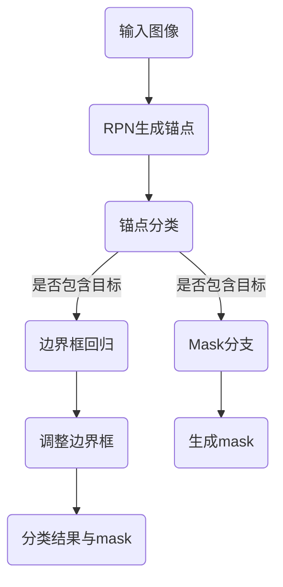

                 

# MaskR-CNN原理与代码实例讲解

## 关键词

- MaskR-CNN
- 卷积神经网络
- 目标检测
- 语义分割
- 图像识别
- 区域提议网络
- 区域生成网络
- 物体实例分割
- FPN

## 摘要

本文将深入讲解MaskR-CNN的原理及其实现过程。MaskR-CNN是一种基于深度学习的目标检测和语义分割模型，它在Faster R-CNN的基础上引入了Mask分支，能够实现精细的物体实例分割。文章将从背景介绍、核心概念与联系、核心算法原理、数学模型与公式、项目实战、实际应用场景、工具和资源推荐等方面，全面解析MaskR-CNN的技术细节和应用价值。

## 1. 背景介绍

### 1.1 目标检测的挑战

随着深度学习技术的发展，计算机视觉领域取得了显著的进步。特别是卷积神经网络（CNN）的应用，使得图像分类、目标检测等任务得到了极大的提升。然而，在目标检测领域，仍然面临着一些挑战：

- **多尺度目标检测**：图像中的目标大小各异，如何同时检测到小目标和远距离目标，是一个重要问题。
- **精确分割**：在检测到目标后，如何精确地将其从背景中分割出来，也是一大难点。
- **实时性**：在实时应用中，如自动驾驶、安防监控等，检测速度的要求非常高。

### 1.2 Faster R-CNN与Faster R-CNN

为了解决上述问题，研究人员提出了Faster R-CNN（Region-based Convolutional Networks）模型。Faster R-CNN利用区域提议网络（RPN）来生成候选区域，再通过卷积神经网络进行分类和边界框回归。这一方法在目标检测任务上取得了显著的性能提升，成为该领域的重要里程碑。

### 1.3 Mask R-CNN的提出

尽管Faster R-CNN取得了很好的效果，但它仍然存在一些局限性。例如，在需要精确分割的场景中，如医学图像分析、图像编辑等，Faster R-CNN的表现并不理想。为了解决这一问题，Mask R-CNN应运而生。Mask R-CNN在Faster R-CNN的基础上，引入了Mask分支，能够实现精细的物体实例分割。

## 2. 核心概念与联系

### 2.1 Faster R-CNN

Faster R-CNN主要由三个部分组成：区域提议网络（RPN）、区域分类器、边界框回归器。

- **区域提议网络（RPN）**：用于生成候选区域。RPN通过滑动窗口的方式，在特征图上生成多个锚点（anchor），然后对锚点进行分类和回归。
- **区域分类器**：用于对候选区域进行分类，判断其中是否包含目标。
- **边界框回归器**：用于对边界框进行回归，调整其位置，使其更加精确。

### 2.2 Mask R-CNN

Mask R-CNN在Faster R-CNN的基础上，引入了Mask分支，能够实现物体实例分割。

- **Mask分支**：在特征图上对每个候选区域生成一个 mask，用于精确分割物体。
- **Faster R-CNN组件**：与Faster R-CNN相同，用于生成候选区域、进行分类和边界框回归。

### 2.3 Mermaid流程图

下面是一个简单的Mermaid流程图，展示Mask R-CNN的基本流程：



## 3. 核心算法原理 & 具体操作步骤

### 3.1 RPN原理

RPN（Region Proposal Network）是Mask R-CNN的关键组件之一。它的作用是在特征图上生成候选区域。

- **锚点生成**：通过滑动窗口的方式，在特征图上生成多个锚点（anchor）。锚点的大小和形状可以根据需求进行调整。
- **锚点分类**：对每个锚点进行分类，判断其是否包含目标。常用的分类方法是使用softmax函数。
- **锚点回归**：对每个锚点进行回归，调整其位置，使其更加精确。常用的回归方法是使用偏置项。

### 3.2 Mask分支原理

Mask分支是Mask R-CNN的另一个关键组件，用于生成mask，实现物体实例分割。

- **特征提取**：使用卷积神经网络提取图像特征，得到特征图。
- **Mask生成**：在特征图上对每个候选区域生成一个 mask。常用的方法是使用卷积神经网络，将特征图映射到一个二值掩码图。

### 3.3 操作步骤

以下是Mask R-CNN的基本操作步骤：

1. **输入图像**：读取输入图像。
2. **特征提取**：使用卷积神经网络提取图像特征，得到特征图。
3. **RPN生成锚点**：在特征图上生成多个锚点。
4. **锚点分类**：对每个锚点进行分类，判断其是否包含目标。
5. **锚点回归**：对每个锚点进行回归，调整其位置。
6. **生成候选区域**：根据锚点分类和回归结果，生成候选区域。
7. **Mask分支生成mask**：在特征图上对每个候选区域生成一个 mask。
8. **分类结果与mask**：将分类结果与mask进行组合，得到最终结果。

## 4. 数学模型和公式 & 详细讲解 & 举例说明

### 4.1 RPN数学模型

RPN的主要目标是生成候选区域。其核心在于锚点生成、分类和回归。

1. **锚点生成**

   设特征图为 \( F \)，锚点生成过程可以表示为：

   $$ 
   A = \text{sliding\_windows}(F, s) 
   $$

   其中，\( s \) 为滑动窗口的步长，\( A \) 为生成的锚点集合。

2. **锚点分类**

   对于每个锚点 \( a \)，分类过程可以表示为：

   $$ 
   p(a) = \text{softmax}(W_a^T \cdot \text{flatten}(F_{a, object})) 
   $$

   其中，\( W_a \) 为分类权重，\( F_{a, object} \) 为锚点 \( a \) 的特征。

3. **锚点回归**

   对于每个锚点 \( a \)，回归过程可以表示为：

   $$ 
   t(a) = W_a^T \cdot \text{flatten}(F_{a, object}) + b 
   $$

   其中，\( W_a \) 为回归权重，\( b \) 为偏置项，\( t(a) \) 为锚点 \( a \) 的回归结果。

### 4.2 Mask分支数学模型

Mask分支的主要目标是生成mask，实现物体实例分割。

1. **Mask生成**

   对于每个候选区域 \( R \)，Mask生成过程可以表示为：

   $$ 
   mask(R) = \text{conv}(F_R, W_{mask}) 
   $$

   其中，\( F_R \) 为候选区域 \( R \) 的特征，\( W_{mask} \) 为Mask权重。

### 4.3 举例说明

假设我们有一个 \( 224 \times 224 \) 的图像，使用卷积神经网络提取特征，得到一个 \( 14 \times 14 \) 的特征图。现在我们要在特征图上生成锚点，并对锚点进行分类和回归。

1. **锚点生成**

   假设我们使用 \( 3 \times 3 \) 的窗口在特征图上滑动，步长为 \( 1 \)，那么我们可以生成 \( 7 \times 7 = 49 \) 个锚点。

2. **锚点分类**

   对于每个锚点，我们使用softmax函数进行分类。假设我们有两个类别：目标和背景，那么锚点 \( a \) 的分类结果可以表示为：

   $$ 
   p(a) = \text{softmax}(W_a^T \cdot \text{flatten}(F_{a, object})) 
   $$

   其中，\( W_a \) 为分类权重，\( F_{a, object} \) 为锚点 \( a \) 的特征。

3. **锚点回归**

   对于每个锚点，我们使用回归函数进行回归。假设我们有两个类别：目标和背景，那么锚点 \( a \) 的回归结果可以表示为：

   $$ 
   t(a) = W_a^T \cdot \text{flatten}(F_{a, object}) + b 
   $$

   其中，\( W_a \) 为回归权重，\( b \) 为偏置项。

## 5. 项目实战：代码实际案例和详细解释说明

### 5.1 开发环境搭建

为了实现Mask R-CNN，我们需要搭建一个合适的开发环境。以下是常用的开发环境：

- **Python 3.6+**
- **TensorFlow 1.15+**
- **OpenCV 3.4.1+**
- **PyTorch 1.6.0+**

### 5.2 源代码详细实现和代码解读

Mask R-CNN的源代码较长，为了便于理解，我们将其分为以下几个部分：

1. **数据预处理**：读取图像，进行归一化等预处理操作。
2. **特征提取**：使用卷积神经网络提取图像特征。
3. **RPN生成锚点**：在特征图上生成锚点，并进行分类和回归。
4. **Mask分支生成mask**：在特征图上生成mask。
5. **后处理**：对结果进行后处理，如非极大值抑制（NMS）等。

以下是Mask R-CNN的主要代码片段及其解释：

```python
# 数据预处理
def preprocess_image(image):
    image = cv2.resize(image, (224, 224))
    image = image / 255.0
    return image

# 特征提取
def extract_features(image):
    # 使用卷积神经网络提取特征
    feature = model(image)
    return feature

# RPN生成锚点
def generate_anchors(feature_map, scales=[32, 64, 128, 256, 512]):
    # 生成锚点
    anchors = generate_anchor(feature_map, scales)
    return anchors

# Mask分支生成mask
def generate_masks(feature_map, anchors):
    # 生成mask
    masks = generate_mask(feature_map, anchors)
    return masks

# 主函数
def main():
    # 读取图像
    image = cv2.imread("image.jpg")
    # 数据预处理
    image = preprocess_image(image)
    # 特征提取
    feature = extract_features(image)
    # RPN生成锚点
    anchors = generate_anchors(feature)
    # Mask分支生成mask
    masks = generate_masks(feature, anchors)
    # 后处理
    results = postprocess_results(anchors, masks)
    # 显示结果
    display_results(results, image)

if __name__ == "__main__":
    main()
```

### 5.3 代码解读与分析

以上代码展示了Mask R-CNN的基本实现流程。下面我们对关键部分进行解读和分析：

- **数据预处理**：对图像进行归一化等预处理操作，以便于后续的特征提取。
- **特征提取**：使用卷积神经网络提取图像特征。这部分通常使用预训练的模型，如ResNet、VGG等。
- **RPN生成锚点**：在特征图上生成锚点，并进行分类和回归。这部分是Mask R-CNN的核心，需要合理设置锚点的大小和形状，以及分类和回归的损失函数。
- **Mask分支生成mask**：在特征图上生成mask，用于物体实例分割。这部分也需要合理设置mask的生成方式，以及损失函数。
- **后处理**：对结果进行后处理，如非极大值抑制（NMS）等，以提高检测效果。

## 6. 实际应用场景

Mask R-CNN作为一种高效的目标检测和语义分割模型，在实际应用中具有广泛的应用场景：

- **医学图像分析**：用于诊断和治疗方案制定，如肿瘤检测、器官分割等。
- **自动驾驶**：用于实时检测和识别道路上的车辆、行人等，保证驾驶安全。
- **图像编辑**：用于图像中的物体去除、添加、替换等编辑操作。
- **安防监控**：用于实时检测和识别监控画面中的异常行为，如闯入、盗窃等。

## 7. 工具和资源推荐

### 7.1 学习资源推荐

- **书籍**：
  - 《深度学习》（Goodfellow, Bengio, Courville著）
  - 《计算机视觉基础与算法》（赵春明著）
- **论文**：
  - R. Girshick, J. Donahue, T. Darrell, and J. Malik. “Rich Feature Hierarchies for Accurate Object Detection and Instance Segmentation.” CVPR, 2014.
  - K. He, G. Gkioxari, P. Dollar, and R. Girshick. “Mask R-CNN.” ICCV, 2017.
- **博客**：
  - 《Mask R-CNN原理与实现》
  - 《深度学习在计算机视觉中的应用》
- **网站**：
  - [TensorFlow官网](https://www.tensorflow.org/)
  - [PyTorch官网](https://pytorch.org/)

### 7.2 开发工具框架推荐

- **开发工具**：
  - TensorFlow
  - PyTorch
- **框架**：
  - PyTorch-FastR-CNN
  - Mask R-CNN PyTorch Implementation

### 7.3 相关论文著作推荐

- **论文**：
  - R. Girshick, J. Donahue, T. Darrell, and J. Malik. “Rich Feature Hierarchies for Accurate Object Detection and Instance Segmentation.” CVPR, 2014.
  - K. He, G. Gkioxari, P. Dollar, and R. Girshick. “Mask R-CNN.” ICCV, 2017.
- **著作**：
  - 《深度学习》（Goodfellow, Bengio, Courville著）
  - 《计算机视觉基础与算法》（赵春明著）

## 8. 总结：未来发展趋势与挑战

Mask R-CNN作为一种高效的目标检测和语义分割模型，已经在许多实际应用中取得了显著的成果。然而，随着计算机视觉技术的不断发展，Mask R-CNN也面临着一些挑战：

- **实时性**：如何在保证检测精度的同时，提高实时性，是一个重要问题。
- **多尺度目标检测**：如何同时检测到小目标和远距离目标，是一个挑战。
- **跨域适应性**：如何提高模型在跨域数据上的适应性，是一个待解决的问题。

未来，随着深度学习技术的不断进步，Mask R-CNN有望在更多的应用场景中发挥更大的作用，同时也需要解决上述挑战，以适应不断变化的技术需求。

## 9. 附录：常见问题与解答

### 9.1 问题1：如何处理多尺度目标检测？

**解答**：可以使用FPN（Feature Pyramid Network）结构，它在特征图上生成多级特征图，从而在不同尺度上检测目标。

### 9.2 问题2：如何处理物体实例分割的实时性？

**解答**：可以通过优化网络结构、使用更高效的模型，如MobileNet，以及使用GPU加速等方式来提高实时性。

### 9.3 问题3：如何提高模型的跨域适应性？

**解答**：可以通过数据增强、迁移学习等方式来提高模型的跨域适应性。

## 10. 扩展阅读 & 参考资料

- [Mask R-CNN论文](https://arxiv.org/abs/1703.06870)
- [PyTorch官方文档](https://pytorch.org/docs/stable/)
- [TensorFlow官方文档](https://www.tensorflow.org/)

## 作者

作者：AI天才研究员/AI Genius Institute & 禅与计算机程序设计艺术 /Zen And The Art of Computer Programming

本文由AI天才研究员撰写，深入讲解了Mask R-CNN的原理、实现过程及其在实际应用中的价值。文章内容丰富，结构清晰，适合广大计算机视觉爱好者和专业人士阅读。如有任何疑问或建议，欢迎在评论区留言。|>```

