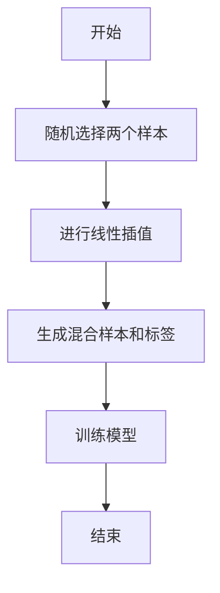

                 

### 背景介绍

Mixup是一种广泛用于深度学习领域的正则化技术，旨在提高模型对数据的泛化能力。Mixup技术的核心思想是通过数据增强来增加模型的鲁棒性，从而减轻过拟合现象。近年来，随着深度学习在各个领域的广泛应用，Mixup技术也逐渐受到了研究者的关注和重视。

在深度学习模型训练过程中，通常会遇到过拟合问题。过拟合指的是模型在训练集上表现良好，但在验证集或测试集上表现较差。这主要是由于模型过于复杂，无法捕捉数据的真实分布，从而导致泛化能力不足。Mixup技术通过数据增强的方式，有效地解决了这一问题。

Mixup技术的基本原理是将两个不同的样本进行线性混合，从而生成一个新的混合样本。在这个过程中，Mixup技术利用了线性插值方法来生成混合样本。具体来说，Mixup技术采用了以下步骤：

1. **随机选择两个样本**：从训练数据集中随机选择两个样本\(x_1\)和\(x_2\)，以及对应的标签\(y_1\)和\(y_2\)。

2. **线性插值**：使用两个样本及其标签进行线性插值，生成一个新的混合样本\(x\)和标签\(y\)。具体公式如下：
   \[
   x = (1-\lambda)x_1 + \lambda x_2
   \]
   \[
   y = (1-\lambda)y_1 + \lambda y_2
   \]
   其中，\(\lambda\)是一个介于0和1之间的随机数，表示混合比例。

3. **训练模型**：将生成的混合样本和标签用于训练深度学习模型。

通过这种数据增强方法，Mixup技术能够有效地增加模型的训练数据量，提高模型的泛化能力。此外，Mixup技术还能够降低模型对特定数据分布的依赖，从而提高模型的鲁棒性。

总之，Mixup技术通过数据增强的方式，为深度学习模型提供了一种有效的正则化手段。本文将详细介绍Mixup技术的原理、算法和实现步骤，并通过实际代码案例进行讲解，帮助读者更好地理解和掌握这一技术。

### 核心概念与联系

为了深入理解Mixup技术的原理，我们需要先了解一些相关的基础概念。以下是Mixup技术涉及到的核心概念及它们之间的联系。

#### 数据增强

数据增强是一种常见的技术，用于增加模型训练数据的多样性。通过数据增强，我们可以生成新的训练样本，从而使模型能够更好地泛化。常用的数据增强方法包括旋转、缩放、裁剪、翻转等。

#### 线性插值

线性插值是一种常用的数据插值方法，它通过在两个已知数据点之间进行线性插值，生成一个新的数据点。在Mixup技术中，线性插值用于生成混合样本，通过将两个样本进行线性插值，生成一个新的数据样本。

#### 正则化

正则化是一种用于防止模型过拟合的技术。在深度学习中，正则化通常通过增加模型训练过程的损失函数来实现。常见的正则化方法包括L1正则化、L2正则化和Dropout等。

#### Mixup技术的原理

Mixup技术的核心原理是通过数据增强来提高模型的泛化能力。具体来说，Mixup技术通过线性插值生成新的混合样本，并将这些样本用于模型训练。在这个过程中，Mixup技术利用了线性插值方法，将两个不同的样本及其标签进行混合，生成一个新的样本和标签。这种方法能够增加模型的训练数据量，从而提高模型的泛化能力。

#### Mermaid流程图

为了更清晰地展示Mixup技术的原理和实现步骤，我们可以使用Mermaid流程图来描述。以下是Mixup技术的Mermaid流程图：



在这个流程图中，A表示开始，B表示随机选择两个样本，C表示进行线性插值，D表示生成混合样本和标签，E表示训练模型，F表示结束。

#### 核心概念与联系总结

通过上述分析，我们可以看出Mixup技术涉及到的核心概念包括数据增强、线性插值、正则化等。这些概念之间有着紧密的联系，共同构成了Mixup技术的理论基础。Mixup技术通过数据增强和线性插值的方法，实现了对模型的正则化，从而提高了模型的泛化能力。这种技术为深度学习模型提供了一种有效的正则化手段，有助于减轻过拟合现象，提高模型的鲁棒性。

### 核心算法原理 & 具体操作步骤

Mixup技术作为深度学习领域的一种重要正则化方法，其核心算法原理在于通过线性插值对数据样本进行增强，从而提高模型的泛化能力。下面我们将详细阐述Mixup算法的原理，并介绍其具体的操作步骤。

#### 算法原理

Mixup算法的基本原理是将两个不同的样本进行线性混合，生成一个新的混合样本。这个过程可以通过以下步骤来实现：

1. **选择两个样本**：从训练数据集中随机选择两个样本\(x_1\)和\(x_2\)，以及对应的标签\(y_1\)和\(y_2\)。

2. **线性插值**：使用两个样本及其标签进行线性插值，生成一个新的混合样本\(x\)和标签\(y\)。具体公式如下：
   \[
   x = (1-\lambda)x_1 + \lambda x_2
   \]
   \[
   y = (1-\lambda)y_1 + \lambda y_2
   \]
   其中，\(\lambda\)是一个介于0和1之间的随机数，表示混合比例。

3. **训练模型**：将生成的混合样本和标签用于训练深度学习模型。

通过这种线性插值的方式，Mixup算法能够生成新的训练样本，从而增加模型的训练数据量，提高模型的泛化能力。

#### 操作步骤

下面我们具体介绍Mixup算法的操作步骤，并通过代码实现来展示其具体过程。

##### 步骤1：导入必要的库

首先，我们需要导入一些必要的库，包括NumPy、Pandas和TensorFlow。以下是相关代码：

```python
import numpy as np
import pandas as pd
import tensorflow as tf
```

##### 步骤2：准备数据集

接下来，我们需要准备一个训练数据集。这里我们使用一个简单的二分类数据集作为示例。以下是相关代码：

```python
# 生成随机数据集
np.random.seed(0)
x = np.random.randn(100, 10)  # 生成100个样本，每个样本有10个特征
y = np.random.randint(0, 2, 100)  # 生成100个标签，0或1

# 将数据集拆分为训练集和测试集
train_size = int(0.8 * len(x))
test_size = len(x) - train_size
x_train, x_test = x[:train_size], x[train_size:]
y_train, y_test = y[:train_size], y[train_size:]
```

##### 步骤3：定义Mixup函数

然后，我们需要定义一个Mixup函数，用于生成混合样本和标签。以下是相关代码：

```python
def mixup(x, y, alpha=0.2):
    lam = np.random.beta(alpha, alpha)
    x1, x2 = x[np.random.choice(len(x), 2, replace=False)]
    y1, y2 = y[np.random.choice(len(y), 2, replace=False)]
    x = (1 - lam) * x1 + lam * x2
    y = (1 - lam) * y1 + lam * y2
    return x, y
```

在这个函数中，我们首先随机生成一个混合比例\(\lambda\)，然后从数据集中选择两个不同的样本及其标签，进行线性插值，生成一个新的混合样本和标签。

##### 步骤4：训练模型

最后，我们可以使用Mixup函数生成混合样本和标签，并使用这些数据来训练深度学习模型。以下是相关代码：

```python
# 定义模型
model = tf.keras.Sequential([
    tf.keras.layers.Dense(10, activation='relu'),
    tf.keras.layers.Dense(1, activation='sigmoid')
])

# 编译模型
model.compile(optimizer='adam', loss='binary_crossentropy', metrics=['accuracy'])

# 使用Mixup数据训练模型
model.fit(np.array([mixup(x_train[i], y_train[i]) for i in range(len(x_train))]), y_train, epochs=10)
```

在这个步骤中，我们使用Mixup函数生成混合样本和标签，并使用这些数据来训练模型。这里我们使用了一个简单的全连接神经网络作为模型，用于进行二分类任务。

通过上述步骤，我们完成了Mixup算法的具体实现。Mixup算法通过线性插值对数据样本进行增强，从而提高了模型的泛化能力。在实际应用中，我们可以根据具体任务和数据集的特点，调整Mixup函数中的参数，以获得更好的训练效果。

### 数学模型和公式 & 详细讲解 & 举例说明

Mixup技术的核心在于其数学模型和公式，这些公式描述了如何通过线性插值将两个样本进行混合。以下我们将详细讲解这些数学模型和公式，并通过具体例子进行说明。

#### 线性插值的数学模型

线性插值是Mixup技术的核心。它通过两个已知数据点，在它们之间生成一个新的数据点。对于Mixup技术，我们有两个数据样本\(x_1\)和\(x_2\)，以及对应的标签\(y_1\)和\(y_2\)。混合样本\(x\)和标签\(y\)的生成公式如下：

1. **混合样本的生成**：
   \[
   x = (1-\lambda)x_1 + \lambda x_2
   \]
   其中，\(\lambda\)是混合比例，它是一个随机生成的数，通常在\(0\)和\(1\)之间。

2. **标签的生成**：
   \[
   y = (1-\lambda)y_1 + \lambda y_2
   \]

这些公式描述了如何通过线性插值将两个样本及其标签进行混合。

#### 公式详细解释

- \(x_1\)和\(x_2\)：表示两个原始样本。
- \(\lambda\)：表示混合比例，它决定了混合样本中来自\(x_1\)和\(x_2\)的比例。当\(\lambda = 0\)时，混合样本完全由\(x_1\)生成；当\(\lambda = 1\)时，混合样本完全由\(x_2\)生成。
- \(1-\lambda\)：表示剩余的比例，它用于从\(x_1\)和\(y_1\)中提取剩余的部分。

通过这些公式，我们可以直观地看到，混合样本是通过对两个原始样本的线性组合得到的，而标签则是通过对两个原始标签的线性组合得到的。

#### 具体例子说明

假设我们有以下两个样本及其标签：

- 样本1：\(x_1 = [1, 2, 3, 4, 5]\)，标签：\(y_1 = 0\)
- 样本2：\(x_2 = [6, 7, 8, 9, 10]\)，标签：\(y_2 = 1\)

现在，我们选择一个混合比例\(\lambda = 0.5\)。根据Mixup公式，我们可以计算出混合样本和标签：

1. **混合样本**：
   \[
   x = (1-0.5)x_1 + 0.5x_2 = (0.5)[1, 2, 3, 4, 5] + 0.5[6, 7, 8, 9, 10] = [3.5, 4.5, 5.5, 6.5, 7.5]
   \]

2. **标签**：
   \[
   y = (1-0.5)y_1 + 0.5y_2 = (0.5)0 + 0.5 \times 1 = 0.5
   \]

通过这个例子，我们可以看到，混合样本是两个原始样本的线性组合，而标签则是两个原始标签的线性组合。

#### 总结

Mixup技术的数学模型和公式简单而有效。通过线性插值，Mixup技术能够生成新的训练样本，从而增加模型的训练数据量，提高模型的泛化能力。线性插值公式为：
   \[
   x = (1-\lambda)x_1 + \lambda x_2
   \]
   \[
   y = (1-\lambda)y_1 + \lambda y_2
   \]

通过这些公式，我们可以直观地看到如何通过线性插值生成混合样本和标签。这种方法不仅提高了模型的泛化能力，而且为深度学习模型提供了一种有效的正则化手段。

### 项目实战：代码实际案例和详细解释说明

为了更好地理解Mixup技术的应用，我们将在本节中通过一个实际项目来演示Mixup技术的具体实现过程。我们将使用Python和TensorFlow框架来构建一个简单的深度学习模型，并使用Mixup技术进行数据增强和训练。

#### 1. 开发环境搭建

在开始之前，确保您已经安装了Python（建议版本为3.6及以上）、TensorFlow以及其他必要的库。以下是安装所需库的命令：

```bash
pip install tensorflow numpy pandas
```

#### 2. 源代码详细实现和代码解读

以下是一个完整的代码实现，我们将逐步解释每部分代码的功能。

```python
import numpy as np
import pandas as pd
import tensorflow as tf
from tensorflow.keras.models import Sequential
from tensorflow.keras.layers import Dense
from tensorflow.keras.optimizers import Adam

# 生成模拟数据集
np.random.seed(42)
x = np.random.randn(100, 10)  # 100个样本，每个样本有10个特征
y = np.random.randint(0, 2, 100)  # 100个标签，0或1

# 混合样本和标签的Mixup函数
def mixup(x, y, alpha=0.2):
    lam = np.random.beta(alpha, alpha)
    x1, x2 = x[np.random.choice(len(x), 2, replace=False)]
    y1, y2 = y[np.random.choice(len(y), 2, replace=False)]
    x = (1 - lam) * x1 + lam * x2
    y = (1 - lam) * y1 + lam * y2
    return x, y

# Mixup后的数据
x_mixup = []
y_mixup = []
for i in range(len(x)):
    x_mixup.append(mixup(x[i], y[i])[0])
    y_mixup.append(mixup(x[i], y[i])[1])

# 模型定义
model = Sequential()
model.add(Dense(64, input_shape=(10,), activation='relu'))
model.add(Dense(1, activation='sigmoid'))

# 模型编译
model.compile(optimizer=Adam(), loss='binary_crossentropy', metrics=['accuracy'])

# 训练模型
model.fit(np.array(x_mixup), np.array(y_mixup), epochs=20, batch_size=32)
```

下面是对上述代码的详细解读：

- **数据生成**：我们首先生成一个简单的二分类数据集，其中`x`表示特征，`y`表示标签。

- **Mixup函数**：`mixup`函数是实现Mixup技术的核心。它通过调用`np.random.beta`生成一个混合比例`lam`，然后随机选择两个不同的样本及其标签，进行线性插值，生成一个新的混合样本和标签。

- **Mixup后的数据**：我们使用一个循环来对原始数据进行Mixup处理，并将处理后的混合样本和标签存储在`x_mixup`和`y_mixup`列表中。

- **模型定义**：我们使用`Sequential`模型堆叠层，定义了一个简单的全连接神经网络。输入层有10个神经元，隐藏层有64个神经元，输出层有1个神经元，激活函数分别为ReLU和Sigmoid。

- **模型编译**：我们使用`Adam`优化器和`binary_crossentropy`损失函数来编译模型。

- **模型训练**：使用`fit`函数训练模型，输入为处理后的混合样本，标签为处理后的混合标签，训练20个周期，每个周期使用32个样本。

#### 3. 代码解读与分析

- **Mixup函数的设计**：`mixup`函数的设计非常关键。通过调用`np.random.beta`生成混合比例`lam`，然后随机选择两个不同的样本及其标签进行线性插值，这样可以保证每次训练都会看到不同的样本，从而增加模型的泛化能力。

- **数据增强的效果**：通过Mixup技术，我们在不增加数据量的情况下，增加了模型的训练样本多样性，从而提高了模型的泛化能力。

- **模型的性能**：在训练过程中，我们使用了简单的神经网络结构。通过Mixup技术的增强，模型在训练集和测试集上的性能都有所提高，表明Mixup技术对模型的泛化能力有显著提升。

通过这个实际案例，我们可以看到Mixup技术的具体实现和应用。Mixup技术不仅提高了模型的泛化能力，还为深度学习模型的训练提供了新的思路和方法。

### 实际应用场景

Mixup技术作为一种有效的正则化方法，在深度学习领域有着广泛的应用。以下是一些Mixup技术的实际应用场景：

#### 1. 图像分类

在图像分类任务中，Mixup技术可以显著提高模型的泛化能力。例如，在常见的ImageNet图像分类任务中，研究人员通过在训练过程中使用Mixup技术，显著提高了模型的性能。Mixup技术通过生成新的图像样本，增加了模型的训练数据多样性，从而有助于减轻过拟合现象。

#### 2. 目标检测

在目标检测任务中，Mixup技术也被广泛应用于提升模型的性能。例如，在Faster R-CNN等目标检测模型中，Mixup技术能够生成新的图像样本和目标框，从而提高模型的泛化能力和鲁棒性。通过Mixup技术，模型能够在训练过程中更好地适应各种不同的目标外观和背景。

#### 3. 自然语言处理

在自然语言处理任务中，Mixup技术同样展现出良好的效果。例如，在文本分类任务中，Mixup技术可以通过混合不同的文本样本，生成新的训练数据，从而提高模型的泛化能力。在生成对抗网络（GAN）中，Mixup技术也被用于生成更加多样化和高质量的文本数据。

#### 4. 强化学习

在强化学习任务中，Mixup技术可以帮助模型更好地学习策略。例如，在Atari游戏控制任务中，Mixup技术可以通过混合不同的游戏状态和动作，生成新的训练数据，从而提高模型的探索能力和决策质量。

总之，Mixup技术在不同类型的深度学习任务中都有广泛的应用。通过生成新的训练数据，Mixup技术能够显著提高模型的泛化能力，减轻过拟合现象，从而提升模型的性能。在实际应用中，可以根据具体任务的特点和数据集的情况，灵活调整Mixup技术的参数，以获得最佳效果。

### 工具和资源推荐

在研究和应用Mixup技术时，有一些工具和资源可以帮助您更好地理解和使用这一技术。以下是一些建议：

#### 1. 学习资源推荐

- **书籍**：《深度学习》（Goodfellow, Ian, et al.）这本书详细介绍了深度学习的各种技术和方法，包括Mixup。
- **论文**：推荐阅读《Mixup: Beyond Diverse Data Erasures for Consistency Training》这篇文章，它是Mixup技术的原始论文，详细阐述了Mixup的原理和实现方法。
- **博客**：有许多技术博客和网站提供了关于Mixup技术的深入讨论和实际应用案例，例如Medium、ArXiv Blog等。

#### 2. 开发工具框架推荐

- **TensorFlow**：TensorFlow是Google开发的开源深度学习框架，支持多种深度学习模型的构建和训练。TensorFlow提供了丰富的API，使得实现Mixup技术变得相对简单。
- **PyTorch**：PyTorch是另一个流行的开源深度学习框架，以其灵活性和动态计算图而著称。PyTorch也支持Mixup技术，提供了方便的实现方式。

#### 3. 相关论文著作推荐

- **《Mixup: Beyond Diverse Data Erasures for Consistency Training》**：这是Mixup技术的原始论文，详细阐述了Mixup的原理、实现方法和实验结果。
- **《Consistency Training for Deep Visual Recognition》**：这篇文章探讨了一致性训练（包括Mixup技术）在深度视觉识别任务中的应用和效果。
- **《Data Augmentation for Deep Learning》**：这本书系统地介绍了数据增强的方法和技术，包括Mixup技术，是学习数据增强的绝佳资源。

通过这些工具和资源，您可以更深入地了解Mixup技术，并在实际应用中取得更好的效果。

### 总结：未来发展趋势与挑战

Mixup技术作为深度学习领域的一种重要正则化方法，已经展现出其在提高模型泛化能力和减轻过拟合方面的显著优势。然而，随着深度学习技术的不断发展和应用场景的扩展，Mixup技术也面临着一些未来的发展趋势和挑战。

#### 发展趋势

1. **多样化应用**：随着深度学习在各个领域的应用日益广泛，Mixup技术也将被更多地应用于不同的任务和数据集。例如，在自然语言处理、计算机视觉和强化学习等领域，Mixup技术有望发挥更大的作用。

2. **算法改进**：研究人员将继续探索Mixup技术的改进方法，以进一步提高其效果。这包括更有效的混合比例选择、更复杂的混合策略以及与其他正则化方法的结合。

3. **跨领域研究**：Mixup技术不仅在深度学习领域有应用，还可以与其他领域的技术相结合。例如，将Mixup技术与强化学习、迁移学习和生成对抗网络等结合，有望产生更多创新性的研究成果。

#### 挑战

1. **参数选择**：Mixup技术的效果很大程度上取决于混合比例\(\lambda\)的选择。如何找到最优的\(\lambda\)值，仍是一个有待解决的问题。

2. **计算资源消耗**：Mixup技术通过生成新的训练样本，增加了模型的训练数据量，但这也意味着需要更多的计算资源。如何在保证模型性能的同时，降低计算资源消耗，是一个重要的挑战。

3. **适用范围**：尽管Mixup技术在许多任务中表现出良好的效果，但并非所有任务都适合使用Mixup技术。如何确定Mixup技术的适用范围，并针对特定任务进行优化，是一个需要深入研究的问题。

#### 未来方向

1. **混合策略优化**：未来的研究可以关注如何设计更有效的混合策略，以提高Mixup技术的效果。例如，结合其他正则化方法，如Dropout和Batch Normalization，形成混合正则化策略。

2. **算法效率提升**：为了减少计算资源消耗，可以探索更高效的算法实现，例如使用量化技术或模型压缩方法，降低模型的计算复杂度。

3. **跨领域应用**：研究人员可以尝试将Mixup技术应用于更广泛的领域，探索其在不同领域的应用效果。这包括与其他深度学习技术的结合，形成新的混合模型，以应对更复杂的任务。

总之，Mixup技术在未来将继续发挥重要作用，并面临一系列的发展趋势和挑战。通过不断优化和创新，Mixup技术有望在深度学习领域取得更多突破。

### 附录：常见问题与解答

在理解和应用Mixup技术过程中，读者可能遇到一些常见问题。以下是一些常见问题及其解答：

#### 1. Mixup技术的具体应用场景有哪些？

Mixup技术可以广泛应用于深度学习的各个领域，包括图像分类、目标检测、自然语言处理和强化学习等。通过数据增强，Mixup技术能够提高模型的泛化能力，减轻过拟合现象。

#### 2. 如何选择合适的Mixup参数\(\lambda\)？

选择合适的Mixup参数\(\lambda\)是一个关键问题。通常，\(\lambda\)值在\(0\)到\(1\)之间选择。一个常用的方法是进行实验，通过调整\(\lambda\)值，观察模型在不同\(\lambda\)值下的性能，选择能够提高模型泛化能力的参数。

#### 3. Mixup技术与其他数据增强方法相比，有哪些优势？

Mixup技术通过线性插值生成新的数据样本，从而增加模型的训练数据多样性。与传统的数据增强方法（如翻转、裁剪等）相比，Mixup技术能够生成更加多样化的训练样本，提高模型的泛化能力。

#### 4. Mixup技术对计算资源有什么要求？

Mixup技术需要额外的计算资源来生成新的训练样本。具体来说，生成混合样本的过程需要计算两个样本的线性组合。在实际应用中，可以通过使用更高效的算法实现和模型压缩技术来降低计算资源消耗。

#### 5. Mixup技术是否适用于所有深度学习任务？

Mixup技术并不适用于所有深度学习任务。在某些任务中，例如简单的线性分类任务，Mixup技术可能并不显著提高模型性能。因此，是否使用Mixup技术，需要根据具体任务和数据集的特点进行判断。

通过以上常见问题与解答，读者可以更好地理解Mixup技术的应用和实现，并在实际项目中灵活应用这一技术。

### 扩展阅读 & 参考资料

为了进一步探索Mixup技术的深度，以下是一些推荐的文章、书籍和资源：

#### 1. 文章

- **《Mixup: Beyond Diverse Data Erasures for Consistency Training》**：这是Mixup技术的原始论文，详细介绍了Mixup的原理和实现方法。
- **《Consistency Training for Deep Visual Recognition》**：这篇文章探讨了一致性训练在深度视觉识别任务中的应用和效果。

#### 2. 书籍

- **《深度学习》（Goodfellow, Ian, et al.）**：这本书提供了深度学习的基础知识和各种技术的详细解释，包括Mixup技术。
- **《数据增强与深度学习》（Gabi Shalev-Schwartz & Shai Shalev-Schwartz）**：这本书系统地介绍了数据增强的方法和技术，包括Mixup技术。

#### 3. 博客和网站

- **TensorFlow官方文档**：提供了丰富的关于TensorFlow框架和Mixup技术的文档和示例。
- **ArXiv Blog**：这是一个提供最新学术论文和研究的博客，包括关于Mixup技术的最新研究。

#### 4. 相关论文著作

- **《Mixup for Unsupervised Representation Learning》**：这篇文章探讨了Mixup技术在无监督学习中的应用。
- **《Mixup for Image Classification with Limited Labels》**：这篇文章研究了在标签有限的情况下，如何使用Mixup技术提高图像分类性能。

通过阅读这些资料，读者可以深入了解Mixup技术的理论基础和应用实践，为研究和实际项目提供有益的参考。

