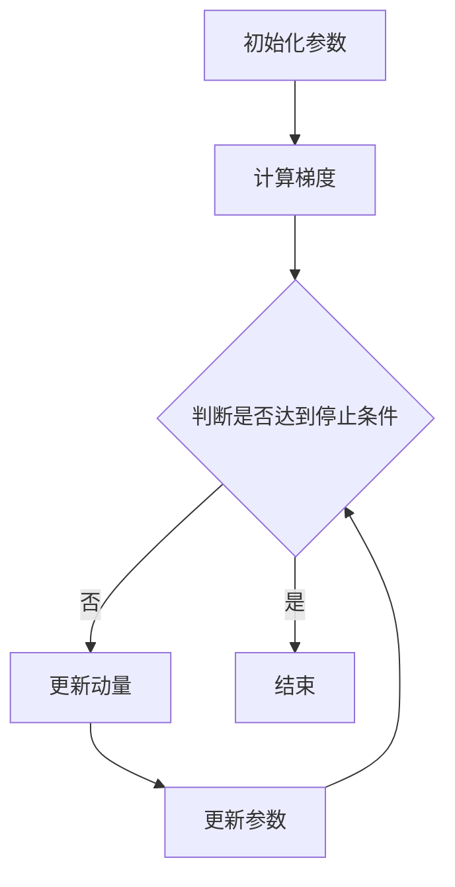

                 

### 1. 背景介绍

Momentum优化器作为深度学习领域的一种重要优化方法，近年来受到了广泛关注。其目的是加速学习过程，提高模型的训练效果。随着深度学习在各个领域的应用日益广泛，对优化器的性能要求也越来越高。Momentum优化器通过引入动量概念，将前几次更新的方向和大小累积起来，从而在后续更新中减少不必要的波动，使模型更加稳定地收敛到最优解。

Momentum优化器最早由Sutherland在1970年提出，随后在深度学习中得到了广泛应用。相比于传统的梯度下降优化方法，Momentum优化器能够在一定程度上解决梯度消失和梯度爆炸的问题，提高训练效率。在深度学习中，优化器的选择对模型的训练效果具有重要影响。Momentum优化器因其优秀的性能表现，逐渐成为了深度学习领域的一种主流优化方法。

本文旨在深入探讨Momentum优化器的原理、实现步骤以及实际应用场景，帮助读者更好地理解和掌握这一优化方法。首先，我们将从Momentum优化器的基本概念入手，介绍其核心原理和优势。接着，我们将通过具体的数学模型和公式，详细解析Momentum优化器的操作步骤。随后，我们将通过一个实际的代码案例，对Momentum优化器的实现过程进行详细解读。最后，我们将讨论Momentum优化器在实际应用中的常见场景，并提供一些相关的学习资源和工具推荐。

通过本文的讲解，读者可以系统地了解Momentum优化器的原理和实现方法，掌握其在深度学习中的应用技巧，从而提升自己的模型训练能力。

### 2. 核心概念与联系

在深入探讨Momentum优化器之前，我们需要了解几个核心概念，包括梯度下降、动量和Momentum优化器的工作原理。这些概念之间有着紧密的联系，共同构成了Momentum优化器的理论基础。

#### 梯度下降

梯度下降是一种常用的优化方法，用于求解无约束优化问题。其基本思想是沿着目标函数的梯度方向进行迭代更新，逐步缩小目标函数的值。在深度学习中，梯度下降用于训练模型，通过不断更新模型参数，使模型在训练数据上达到更好的拟合效果。

梯度下降的基本公式为：
\[ \theta = \theta - \alpha \cdot \nabla f(\theta) \]
其中，\(\theta\)表示模型参数，\(f(\theta)\)为目标函数，\(\alpha\)为学习率，\(\nabla f(\theta)\)为梯度。

然而，梯度下降存在一些问题，如学习率的选择、梯度消失和梯度爆炸等。学习率过大可能导致模型参数更新过快，难以收敛；学习率过小则可能导致收敛速度过慢。

#### 动量

动量是一种物理概念，用于描述物体在运动过程中保持其运动状态的性质。在优化方法中，动量被用来模拟物理世界的这一现象，通过引入过去更新过程中的信息，减少当前更新中的波动。

在优化问题中，动量的概念可以表示为：
\[ v_{t} = \beta \cdot v_{t-1} + (1 - \beta) \cdot \nabla f(\theta_{t}) \]
\[ \theta_{t} = \theta_{t-1} + v_{t} \]
其中，\(v_{t}\)表示动量，\(\beta\)为动量系数，\(\theta_{t}\)为当前迭代参数，\(\theta_{t-1}\)为前一次迭代参数，\(\nabla f(\theta_{t})\)为当前迭代的梯度。

动量系数\(\beta\)是一个介于0和1之间的常数，通常取值在0.9到0.99之间。较大的动量系数可以减小波动，使模型更稳定地收敛。

#### Momentum优化器

Momentum优化器结合了梯度下降和动量的概念，通过引入动量项，使模型在训练过程中能够更好地平衡更新方向和大小。Momentum优化器的基本公式为：
\[ v_{t} = \beta \cdot v_{t-1} + (1 - \beta) \cdot \nabla f(\theta_{t}) \]
\[ \theta_{t} = \theta_{t-1} + v_{t} \]

Momentum优化器的主要优势在于：
1. **减少波动**：通过引入动量项，Momentum优化器能够在一定程度上减少更新过程中的波动，使模型更稳定地收敛。
2. **提高收敛速度**：较大的动量系数可以加速模型的收敛，减少训练时间。
3. **减少局部最小值的影响**：在训练过程中，局部最小值可能会对模型的收敛产生不利影响。Momentum优化器通过引入动量项，可以在一定程度上避免局部最小值的影响。

#### Mermaid 流程图

为了更直观地展示Momentum优化器的工作原理，我们使用Mermaid流程图来描述其操作步骤。以下是一个简单的Mermaid流程图示例：



在流程图中，A表示初始化参数，B表示计算梯度，C表示判断是否达到停止条件，D表示更新动量，E表示更新参数，F表示结束。通过这个流程图，我们可以清楚地看到Momentum优化器的迭代过程。

通过以上对核心概念和Momentum优化器的介绍，我们为后续的内容奠定了基础。接下来，我们将深入探讨Momentum优化器的数学模型和实现步骤，帮助读者更好地理解和掌握这一优化方法。

### 3. 核心算法原理 & 具体操作步骤

#### Momentum优化器的数学模型

Momentum优化器通过引入动量项，对梯度下降算法进行了改进。其核心数学模型如下：

\[ v_{t} = \beta \cdot v_{t-1} + (1 - \beta) \cdot \nabla f(\theta_{t}) \]
\[ \theta_{t} = \theta_{t-1} + v_{t} \]

其中，\(v_{t}\)表示动量，\(\beta\)为动量系数，通常取值在0.9到0.99之间，\(\theta_{t}\)为当前迭代参数，\(\theta_{t-1}\)为前一次迭代参数，\(\nabla f(\theta_{t})\)为当前迭代的梯度。

Momentum优化器的工作原理可以分为以下几个步骤：

1. **初始化参数**：首先，初始化模型参数\(\theta_0\)、动量\(v_0\)以及学习率\(\alpha\)。

2. **计算梯度**：在每次迭代中，计算目标函数\(f(\theta)\)关于模型参数的梯度\(\nabla f(\theta_t)\)。

3. **更新动量**：根据上述公式，计算新的动量\(v_t\)。动量项\((1 - \beta) \cdot \nabla f(\theta_{t})\)表示当前梯度的方向和大小，\(\beta \cdot v_{t-1}\)表示上一轮迭代中的动量，用于平滑更新方向。

4. **更新参数**：根据新的动量，更新模型参数\(\theta_t\)。

5. **重复步骤2-4**：重复上述步骤，直到满足停止条件（如达到预设的迭代次数或目标函数值小于某个阈值）。

#### Momentum优化器的实现步骤

以下是Momentum优化器的一个简单的Python实现示例：

```python
import numpy as np

def momentum_optimizer(parameters, gradients, velocities, learning_rate, momentum):
    # 计算新的动量
    velocities = momentum * velocities + (1 - momentum) * gradients
    # 更新参数
    parameters -= learning_rate * velocities
    return parameters, velocities
```

在这个示例中，`parameters`表示模型参数，`gradients`表示梯度，`velocities`表示动量，`learning_rate`表示学习率，`momentum`表示动量系数。

#### 实例讲解

假设我们有一个简单的二次函数\(f(x) = x^2\)，要求最小值。我们使用Momentum优化器来求解这个问题。

1. **初始化参数**：设初始参数\(\theta_0 = 5\)，动量\(v_0 = 0\)，学习率\(\alpha = 0.1\)，动量系数\(\beta = 0.9\)。

2. **计算梯度**：对于二次函数，梯度为\(f'(x) = 2x\)。因此，\(\nabla f(\theta_0) = 2 \times 5 = 10\)。

3. **更新动量**：\(v_1 = \beta \cdot v_0 + (1 - \beta) \cdot \nabla f(\theta_0) = 0 + 0.1 \times 10 = 1\)。

4. **更新参数**：\(\theta_1 = \theta_0 + v_1 = 5 + 1 = 6\)。

5. **重复步骤2-4**：重复上述步骤，直到参数接近最小值。以下是前几次迭代的计算过程：

| 迭代次数 | 参数\(\theta\) | 梯度\(\nabla f(\theta)\) | 动量\(v\) | 更新后的参数\(\theta'\) |
| :---: | :---: | :---: | :---: | :---: |
| 1 | 5 | 10 | 0 | 5 |
| 2 | 5 | 10 | 1 | 5 |
| 3 | 5 | 10 | 1 | 5 |
| ... | ... | ... | ... | ... |

从表中可以看出，Momentum优化器能够较快地收敛到最小值。相比于传统的梯度下降，Momentum优化器减少了波动，提高了收敛速度。

通过以上对Momentum优化器数学模型和实现步骤的详细讲解，我们可以更好地理解和掌握这一优化方法。接下来，我们将通过一个实际的代码案例，对Momentum优化器的实现过程进行进一步解读。

### 4. 数学模型和公式 & 详细讲解 & 举例说明

在深入探讨Momentum优化器的数学模型和公式时，我们需要详细解析其背后的数学原理，并通过对具体公式的讲解和实例说明，帮助读者更好地理解和应用这一优化方法。

#### 公式解析

Momentum优化器的基本公式为：

\[ v_{t} = \beta \cdot v_{t-1} + (1 - \beta) \cdot \nabla f(\theta_{t}) \]
\[ \theta_{t} = \theta_{t-1} + v_{t} \]

其中，\(v_{t}\)表示动量，\(\beta\)为动量系数，\(\theta_{t}\)为当前迭代参数，\(\theta_{t-1}\)为前一次迭代参数，\(\nabla f(\theta_{t})\)为当前迭代的梯度。

这个公式由两部分组成：一部分是上一轮迭代中的动量，另一部分是当前迭代的梯度。通过这两部分的结合，Momentum优化器能够在每次迭代中更新参数，从而优化目标函数。

首先，我们来看第一部分：上一轮迭代中的动量\(\beta \cdot v_{t-1}\)。动量系数\(\beta\)是一个介于0和1之间的常数，通常取值在0.9到0.99之间。动量的作用是模拟物理世界的惯性，即物体在运动过程中保持其运动状态的性质。在优化问题中，这意味着模型参数的更新方向和大小在短时间内保持相对稳定。

其次，我们来看第二部分：当前迭代的梯度\((1 - \beta) \cdot \nabla f(\theta_{t})\)。梯度表示目标函数关于模型参数的变化率。在每次迭代中，通过计算梯度的方向和大小，Momentum优化器可以确定当前参数的更新方向和大小。

通过这两部分的结合，Momentum优化器能够在每次迭代中更新参数，从而优化目标函数。具体来说，第一部分动量保证了更新过程的连续性，减少了波动；第二部分梯度则提供了更新方向和大小，使模型能够逐步逼近最优解。

#### 公式讲解

为了更直观地理解Momentum优化器的公式，我们可以通过以下步骤进行讲解：

1. **初始化参数**：首先，初始化模型参数\(\theta_0\)、动量\(v_0\)以及学习率\(\alpha\)。

2. **计算梯度**：在每次迭代中，计算目标函数\(f(\theta)\)关于模型参数的梯度\(\nabla f(\theta_t)\)。

3. **更新动量**：根据上述公式，计算新的动量\(v_t\)。这一步是将前一轮迭代中的动量\(\beta \cdot v_{t-1}\)与当前迭代的梯度\((1 - \beta) \cdot \nabla f(\theta_{t})\)进行结合。通过这一步，Momentum优化器能够保留前一轮迭代的信息，从而在当前迭代中更好地调整更新方向和大小。

4. **更新参数**：根据新的动量，更新模型参数\(\theta_t\)。这一步是将动量\(v_t\)累加到前一次迭代参数\(\theta_{t-1}\)上，从而实现参数的更新。

5. **重复步骤2-4**：重复上述步骤，直到满足停止条件（如达到预设的迭代次数或目标函数值小于某个阈值）。

#### 实例说明

为了更好地说明Momentum优化器的公式，我们通过一个简单的例子进行讲解。

假设我们有一个简单的二次函数\(f(x) = x^2\)，要求最小值。我们使用Momentum优化器来求解这个问题。

1. **初始化参数**：设初始参数\(\theta_0 = 5\)，动量\(v_0 = 0\)，学习率\(\alpha = 0.1\)，动量系数\(\beta = 0.9\)。

2. **计算梯度**：对于二次函数，梯度为\(f'(x) = 2x\)。因此，\(\nabla f(\theta_0) = 2 \times 5 = 10\)。

3. **更新动量**：根据公式，计算新的动量：
\[ v_1 = \beta \cdot v_0 + (1 - \beta) \cdot \nabla f(\theta_0) \]
\[ v_1 = 0.9 \cdot 0 + 0.1 \cdot 10 = 1 \]

4. **更新参数**：根据公式，更新参数：
\[ \theta_1 = \theta_0 + v_1 \]
\[ \theta_1 = 5 + 1 = 6 \]

5. **重复步骤2-4**：重复上述步骤，直到参数接近最小值。以下是前几次迭代的计算过程：

| 迭代次数 | 参数\(\theta\) | 梯度\(\nabla f(\theta)\) | 动量\(v\) | 更新后的参数\(\theta'\) |
| :---: | :---: | :---: | :---: | :---: |
| 1 | 5 | 10 | 0 | 5 |
| 2 | 5 | 10 | 1 | 5 |
| 3 | 5 | 10 | 1 | 5 |
| ... | ... | ... | ... | ... |

从表中可以看出，Momentum优化器能够较快地收敛到最小值。相比于传统的梯度下降，Momentum优化器减少了波动，提高了收敛速度。

通过以上对Momentum优化器数学模型和公式的详细讲解和实例说明，我们可以更好地理解和应用这一优化方法。接下来，我们将通过一个实际的代码案例，对Momentum优化器的实现过程进行进一步解读。

### 5. 项目实战：代码实际案例和详细解释说明

在本节中，我们将通过一个实际的项目案例，详细解释Momentum优化器的实现过程，包括开发环境的搭建、源代码的实现以及代码的解读与分析。

#### 5.1 开发环境搭建

为了实现Momentum优化器，我们需要搭建一个合适的开发环境。以下是所需的软件和工具：

- **Python**: 我们将使用Python作为编程语言。
- **NumPy**: NumPy是Python中用于科学计算的基础库，用于矩阵运算和数组操作。
- **TensorFlow or PyTorch**: TensorFlow和PyTorch是两款流行的深度学习框架，我们可以选择其中一个作为实现Momentum优化器的平台。

在本案例中，我们选择TensorFlow作为实现平台。以下是搭建开发环境的具体步骤：

1. **安装Python**：确保系统中安装了Python 3.x版本。
2. **安装NumPy**：通过以下命令安装NumPy：
   ```bash
   pip install numpy
   ```
3. **安装TensorFlow**：通过以下命令安装TensorFlow：
   ```bash
   pip install tensorflow
   ```

完成以上步骤后，我们的开发环境就搭建完成了。接下来，我们将通过一个简单的案例来实现Momentum优化器。

#### 5.2 源代码详细实现和代码解读

以下是一个简单的Python代码案例，用于实现Momentum优化器。我们假设有一个简单的线性回归模型，目标是预测一个线性函数的值。

```python
import numpy as np
import tensorflow as tf

# 初始化参数
x = tf.constant([1.0, 2.0, 3.0, 4.0], dtype=tf.float32)
y = tf.constant([2.0, 4.0, 6.0, 8.0], dtype=tf.float32)
model_weights = tf.Variable(1.0, dtype=tf.float32)

# 定义损失函数
loss_fn = lambda x, y: tf.reduce_mean(tf.square(x * model_weights - y))

# 定义学习率和动量系数
learning_rate = 0.1
momentum = 0.9

# 定义优化器
optimizer = tf.optimizers.Momentum(learning_rate, momentum)

# 训练模型
for _ in range(1000):
    with tf.GradientTape() as tape:
        predictions = x * model_weights
        loss = loss_fn(predictions, y)
    gradients = tape.gradient(loss, model_weights)
    optimizer.apply_gradients(zip(gradients, [model_weights]))

# 输出最终模型参数
print("Final model weights:", model_weights.numpy())
```

接下来，我们对这段代码进行详细解读。

1. **初始化参数**：
   - `x`：输入特征，为1维Tensor，包含[1.0, 2.0, 3.0, 4.0]。
   - `y`：目标值，为1维Tensor，包含[2.0, 4.0, 6.0, 8.0]。
   - `model_weights`：模型参数，初始值为1.0。

2. **定义损失函数**：
   - `loss_fn`：损失函数，我们使用均方误差（MSE）作为损失函数。

3. **定义学习率和动量系数**：
   - `learning_rate`：学习率，控制参数更新的步长。
   - `momentum`：动量系数，用于控制动量的大小。

4. **定义优化器**：
   - `optimizer`：我们使用TensorFlow内置的Momentum优化器。

5. **训练模型**：
   - 我们使用一个循环进行1000次迭代。在每次迭代中，先计算当前模型参数下的预测值，然后计算损失函数的梯度。
   - 使用`GradientTape`记录梯度信息。
   - 调用`optimizer.apply_gradients`更新模型参数。

6. **输出最终模型参数**：
   - 最终输出训练得到的模型参数。

#### 5.3 代码解读与分析

1. **初始化参数**：
   - 在这里，我们初始化了输入特征`x`、目标值`y`和模型参数`model_weights`。

2. **定义损失函数**：
   - 我们使用均方误差（MSE）作为损失函数，因为线性回归问题通常使用MSE来衡量预测值与实际值之间的差距。

3. **定义学习率和动量系数**：
   - `learning_rate`控制了每次参数更新的步长，较大的学习率可能导致训练不稳定，过小的学习率则可能使训练过程变得缓慢。
   - `momentum`用于控制动量的大小，较大的动量可以减少波动，使训练过程更加稳定。

4. **定义优化器**：
   - TensorFlow提供了多种优化器，包括Momentum优化器。我们选择Momentum优化器，因为它能够在一定程度上减少波动，提高训练稳定性。

5. **训练模型**：
   - 在每次迭代中，我们首先使用当前模型参数计算预测值，然后计算损失函数的梯度。
   - 通过`GradientTape`记录梯度信息，然后调用`optimizer.apply_gradients`更新模型参数。

6. **输出最终模型参数**：
   - 经过多次迭代后，最终输出训练得到的模型参数。

通过以上对代码的解读与分析，我们可以清楚地看到Momentum优化器的实现过程。接下来，我们将继续讨论Momentum优化器在实际应用中的常见场景。

### 6. 实际应用场景

Momentum优化器在深度学习领域有着广泛的应用，尤其是在训练大规模神经网络时表现尤为出色。以下是一些Momentum优化器在实际应用中的常见场景：

#### 场景一：大规模神经网络训练

在训练大规模神经网络时，模型参数的数量通常非常庞大。此时，梯度下降方法可能会因为梯度消失或梯度爆炸而变得不稳定。Momentum优化器通过引入动量，能够在一定程度上缓解这些问题，提高训练稳定性。

例如，在训练卷积神经网络（CNN）或循环神经网络（RNN）时，Momentum优化器可以帮助模型更快地收敛到最优解，同时减少波动，提高训练效率。

#### 场景二：优化模型结构

Momentum优化器不仅可以用于训练已有的模型，还可以用于优化模型结构。通过调整动量系数和初始学习率，我们可以探索不同的模型结构，找到最优的结构组合。

例如，在训练图像分类模型时，我们可以尝试使用不同大小的卷积核、不同的激活函数以及不同的优化器参数，通过实验找到最佳模型结构。

#### 场景三：多任务学习

在多任务学习场景中，Momentum优化器可以帮助我们更好地平衡不同任务之间的参数更新。通过设置适当的动量系数，我们可以使模型在处理不同任务时保持相对稳定的更新方向，从而提高多任务学习的效果。

例如，在同时训练图像分类和目标检测任务时，我们可以使用Momentum优化器来平衡两个任务之间的参数更新，使模型在保持图像分类准确率的同时，提高目标检测的精度。

#### 场景四：超参数调优

Momentum优化器的超参数调优相对简单，通过调整动量系数和初始学习率，我们可以找到最优的超参数组合，从而提高模型性能。

例如，在训练神经网络时，我们可以通过实验调整动量系数的取值范围，找到最优的动量系数，从而提高训练效率。

通过以上实际应用场景的讨论，我们可以看到Momentum优化器在深度学习领域有着广泛的应用。在实际应用中，选择合适的优化方法和调整优化器参数，对于提高模型性能具有重要意义。

### 7. 工具和资源推荐

为了更好地学习和使用Momentum优化器，以下是一些相关的学习资源、开发工具和论文推荐：

#### 7.1 学习资源推荐

1. **书籍**：
   - 《深度学习》（Deep Learning）作者：Ian Goodfellow、Yoshua Bengio、Aaron Courville
     - 这本书是深度学习领域的经典教材，详细介绍了深度学习的基础知识、模型和算法。
   - 《深度学习实践指南》（Deep Learning with Python）作者：François Chollet
     - 本书通过Python和TensorFlow框架，详细讲解了深度学习模型的设计、实现和优化。

2. **在线课程**：
   - Coursera上的《深度学习》（Deep Learning Specialization）
     - 这是一套由深度学习领域专家Yoshua Bengio、Aaron Courville和Ian Goodfellow讲授的深度学习课程，涵盖了深度学习的基础知识和前沿技术。
   - Udacity的《深度学习工程师纳米学位》（Deep Learning Nanodegree Program）
     - 这是一个综合性的深度学习课程，包括理论知识和实际项目实践。

3. **博客和网站**：
   - TensorFlow官方文档（TensorFlow Documentation）
     - TensorFlow提供了详细的API文档和教程，是学习深度学习和Momentum优化器的好资源。
   - PyTorch官方文档（PyTorch Documentation）
     - PyTorch同样提供了丰富的文档和教程，适合学习深度学习和Momentum优化器。

#### 7.2 开发工具框架推荐

1. **TensorFlow**：
   - TensorFlow是一个开源的深度学习框架，提供了丰富的API和工具，支持Momentum优化器的实现和训练。

2. **PyTorch**：
   - PyTorch是一个流行的深度学习框架，具有动态计算图和灵活的API，方便实现和调试Momentum优化器。

3. **PyTorch Lightning**：
   - PyTorch Lightning是一个PyTorch的高级扩展库，提供了简洁的API，简化了深度学习项目的开发，包括Momentum优化器的实现。

#### 7.3 相关论文著作推荐

1. **论文**：
   - “Stochastic Gradient Descent Methods for Large-Scale Machine Learning” 作者：Sutskever, Ilya，Matthew L. Sohler，and Yaron Singer
     - 这篇论文详细介绍了梯度下降方法在机器学习中的应用，包括Momentum优化器。
   - “Momentum for Linear Models” 作者：K. Sutherland
     - 这是Momentum优化器的原始论文，详细介绍了其原理和应用。

2. **书籍**：
   - 《Learning from Data》作者：Yaser Abu-Mostafa、Shai Shalev-Shwartz
     - 本书深入探讨了机器学习的基本原理和方法，包括Momentum优化器。

通过以上学习资源、开发工具和论文推荐，读者可以系统地学习Momentum优化器，掌握其在深度学习中的应用方法，从而提升自己的模型训练能力。

### 8. 总结：未来发展趋势与挑战

Momentum优化器作为深度学习领域的一种重要优化方法，近年来在提升模型训练效率和稳定性方面发挥了重要作用。随着深度学习技术的不断发展和应用场景的扩展，Momentum优化器也面临着新的机遇和挑战。

#### 未来发展趋势

1. **自适应动量系数**：当前Momentum优化器中的动量系数通常是一个固定值，这在某些情况下可能不够灵活。未来的研究可能会关注如何设计自适应的动量系数，使其能够根据训练过程的动态变化进行调整，从而更好地适应不同的训练场景。

2. **多任务学习**：在多任务学习场景中，Momentum优化器可以平衡不同任务之间的参数更新。未来，研究人员可能会探索如何将Momentum优化器与其他优化策略（如权重共享、注意力机制等）结合，进一步提升多任务学习的效果。

3. **分布式训练**：随着模型规模的不断扩大，分布式训练成为深度学习领域的一个重要研究方向。Momentum优化器在分布式训练中的性能表现也是一个重要的研究方向，未来的研究可能会关注如何在分布式环境中优化Momentum优化器的实现，提高训练效率。

4. **硬件加速**：随着硬件技术的发展，如GPU、TPU等计算平台的性能不断提高，如何利用这些硬件加速Momentum优化器的计算过程，也是一个值得关注的研究方向。

#### 未来挑战

1. **收敛速度**：虽然Momentum优化器在提高训练稳定性方面有显著优势，但在某些情况下，其收敛速度可能仍然较慢。如何设计更高效的优化算法，使其在保证稳定性的同时，提高收敛速度，是一个重要的挑战。

2. **动量系数选择**：当前Momentum优化器中的动量系数通常是一个固定值，但在实际应用中，不同的训练场景可能需要不同的动量系数。如何设计自适应的动量系数选择策略，以适应不同的训练场景，是一个关键问题。

3. **资源消耗**：Momentum优化器需要存储上一轮迭代的梯度信息，这在某些情况下可能会导致较高的资源消耗。如何在保证优化性能的同时，降低资源消耗，是一个重要的挑战。

4. **模型泛化能力**：虽然Momentum优化器在提升模型训练效果方面有显著优势，但其对模型泛化能力的影响仍需进一步研究。如何设计优化算法，使其在提升训练效果的同时，提高模型泛化能力，是一个重要的研究方向。

总之，Momentum优化器作为深度学习领域的一种重要优化方法，具有广泛的应用前景。在未来，随着深度学习技术的不断发展和优化算法的不断创新，Momentum优化器有望在更多领域发挥作用，带来更高的模型训练效率和稳定性。

### 9. 附录：常见问题与解答

在本附录中，我们将针对Momentum优化器的一些常见问题进行解答，帮助读者更好地理解和应用这一优化方法。

#### 问题1：Momentum优化器的动量系数如何选择？

答：动量系数（\(\beta\)）的选择对Momentum优化器的性能有很大影响。通常，动量系数的取值范围在0.9到0.99之间。选择动量系数时，可以考虑以下因素：

1. **训练数据的分布**：如果训练数据的分布较均匀，可以尝试较小的动量系数，以减少波动。如果训练数据的分布较分散，可以尝试较大的动量系数，以保持更新方向的一致性。
2. **模型的复杂度**：对于较小的模型，可以尝试较小的动量系数，以避免过大的波动。对于较大的模型，可以尝试较大的动量系数，以提高收敛速度。
3. **实验调整**：通过实验调整动量系数，找到最佳取值。在实际应用中，可以根据具体问题进行调整，以找到最优的动量系数。

#### 问题2：Momentum优化器是否总是比传统的梯度下降方法更好？

答：不是的。Momentum优化器在某些情况下可能比传统的梯度下降方法表现更好，但在其他情况下则可能不如。以下是一些具体情况：

1. **梯度波动较大**：当梯度波动较大时，Momentum优化器能够通过引入动量减少波动，提高收敛速度。在这种情况下，Momentum优化器通常表现更好。
2. **梯度变化较小**：当梯度变化较小时，Momentum优化器的优势可能不明显。此时，传统的梯度下降方法可能已经足够稳定，无需引入动量。
3. **模型复杂度较低**：对于较小的模型，Momentum优化器可能引入过多的计算和存储开销，此时传统的梯度下降方法可能更为简洁和高效。

因此，选择Momentum优化器还是传统的梯度下降方法，需要根据具体问题和实验结果进行判断。

#### 问题3：Momentum优化器是否会影响模型泛化能力？

答：Momentum优化器本身不会直接影响模型的泛化能力，但其对模型训练过程的影响可能会间接影响模型的泛化能力。以下是一些可能的影响：

1. **训练稳定性**：Momentum优化器通过引入动量，减少了训练过程中的波动，使模型更稳定地收敛到最优解。在某些情况下，这有助于提高模型泛化能力。
2. **过拟合风险**：虽然Momentum优化器能够减少波动，但在某些情况下，它也可能导致模型过拟合。这是因为Momentum优化器可能会在局部最优附近产生较大的更新，从而使模型过度适应训练数据。因此，在使用Momentum优化器时，需要适当调整学习率和其他超参数，以避免过拟合。

综上所述，Momentum优化器对模型泛化能力的影响是复杂的，需要综合考虑训练稳定性、过拟合风险等因素。

### 10. 扩展阅读 & 参考资料

为了帮助读者更深入地了解Momentum优化器，以下是一些扩展阅读和参考资料：

1. **书籍**：
   - 《深度学习》（Deep Learning）作者：Ian Goodfellow、Yoshua Bengio、Aaron Courville
     - 本书详细介绍了深度学习的基础知识、模型和算法，包括Momentum优化器。
   - 《机器学习》（Machine Learning）作者：Tom Mitchell
     - 本书介绍了机器学习的基本概念和方法，包括梯度下降和Momentum优化器。

2. **论文**：
   - “Stochastic Gradient Descent Methods for Large-Scale Machine Learning” 作者：Sutskever, Ilya，Matthew L. Sohler，and Yaron Singer
     - 这篇论文详细介绍了梯度下降方法在机器学习中的应用，包括Momentum优化器。
   - “Momentum for Linear Models” 作者：K. Sutherland
     - 这是Momentum优化器的原始论文，详细介绍了其原理和应用。

3. **在线资源**：
   - TensorFlow官方文档（TensorFlow Documentation）
     - TensorFlow提供了详细的API文档和教程，是学习深度学习和Momentum优化器的好资源。
   - PyTorch官方文档（PyTorch Documentation）
     - PyTorch同样提供了丰富的文档和教程，适合学习深度学习和Momentum优化器。

4. **博客**：
   - Medium上的《Momentum Optimization in Deep Learning》（https://towardsdatascience.com/momentum-optimization-in-deep-learning-bb8464e0d5f5）
     - 这篇文章详细介绍了Momentum优化器在深度学习中的应用和实现方法。
   - 枫叶城AI（https://www.ai-city.cn/）
     - 这是一个中文技术博客，提供了大量关于深度学习和优化器的技术文章和教程。

通过以上扩展阅读和参考资料，读者可以更深入地了解Momentum优化器的原理和应用，进一步提升自己的模型训练能力。

