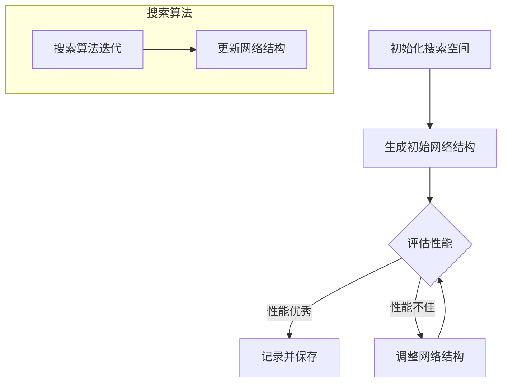

                 

### 背景介绍

#### 计算机视觉的重要性

计算机视觉（Computer Vision）是人工智能（Artificial Intelligence，简称AI）的一个重要分支，旨在使计算机能够像人类一样理解并解释视觉信息。计算机视觉的应用范围广泛，涵盖了图像识别、物体检测、面部识别、场景理解、自动驾驶等多个领域。随着深度学习技术的不断发展，计算机视觉的应用效果和覆盖范围都在不断提升。

在过去的几十年里，计算机视觉领域取得了显著的进展。传统的计算机视觉方法依赖于手工设计的特征提取器和分类器，这些方法在处理一些特定的任务时表现良好，但面对复杂的环境时，其性能往往不够理想。随着深度学习的兴起，卷积神经网络（Convolutional Neural Networks，简称CNN）在计算机视觉领域取得了巨大的成功，使得计算机能够自动从大量数据中学习到具有高度判别性的特征表示。

#### 神经架构搜索（Neural Architecture Search，简称NAS）的概念

神经架构搜索（Neural Architecture Search，简称NAS）是一种自动化机器学习方法，旨在发现最优的神经网络结构，以提高模型的性能和效率。在NAS中，研究者使用搜索算法来探索大量的神经网络结构，并利用训练数据来评估这些结构的性能。最终，NAS算法会选出性能最优的网络结构，用于实际应用。

NAS的基本思想是，通过自动化搜索方法，代替传统的人工设计神经网络结构的过程。这种方法不仅能够节省大量的人力和时间成本，而且能够发现传统方法难以找到的优秀结构，从而提高模型的性能。

#### NAS在计算机视觉中的应用现状

近年来，NAS在计算机视觉领域得到了广泛关注。许多研究者和公司都在探索如何将NAS应用于图像识别、物体检测、面部识别等任务中。一些成功的案例包括Google的NASNet、Facebook的ENAS等。这些模型在多个公开数据集上取得了比传统CNN更好的性能。

尽管NAS在计算机视觉中显示出巨大的潜力，但仍然面临着许多挑战。例如，NAS搜索过程通常需要大量的计算资源和时间，而且如何有效地评估和选择网络结构仍然是一个重要问题。

#### 文章结构概述

本文将分为以下几部分进行讨论：

1. **核心概念与联系**：首先，我们将介绍NAS的基本概念，包括搜索空间、搜索算法和评估方法等，并使用Mermaid流程图展示NAS的架构和流程。
2. **核心算法原理 & 具体操作步骤**：接下来，我们将详细讲解NAS的算法原理，包括搜索算法的选择、网络结构的定义和性能评估方法等。
3. **数学模型和公式 & 详细讲解 & 举例说明**：在此部分，我们将介绍NAS中使用的数学模型和公式，并通过具体的例子进行详细讲解。
4. **项目实战：代码实际案例和详细解释说明**：我们将通过一个实际的代码案例，展示如何使用NAS进行计算机视觉任务，并对代码进行详细的解释和分析。
5. **实际应用场景**：我们将讨论NAS在不同计算机视觉任务中的应用，包括图像识别、物体检测和面部识别等。
6. **工具和资源推荐**：最后，我们将推荐一些学习资源和开发工具，帮助读者进一步了解和掌握NAS。

通过本文的讨论，我们希望读者能够对NAS在计算机视觉领域的应用有一个全面的了解，并能够运用NAS方法解决实际问题。

### 核心概念与联系

#### 神经架构搜索的基本概念

神经架构搜索（Neural Architecture Search，简称NAS）是一种自动化搜索神经网络结构的机器学习方法。与传统的神经网络设计方法不同，NAS通过搜索算法自动探索大量的网络结构，从而找到性能最优的网络。

在NAS中，搜索空间是指所有可能的神经网络结构集合。这些结构包括网络层的选择、连接方式、激活函数、网络深度等。一个有效的搜索空间应该足够大，以包含所有可能的优秀结构，但又不能过大，以免搜索过程过于耗时。

搜索算法是NAS的核心，它负责在搜索空间中寻找最优的网络结构。常见的搜索算法包括基于梯度下降的搜索算法、遗传算法、强化学习等。这些算法通过不断迭代，根据性能评估结果调整网络结构，逐渐收敛到最优结构。

性能评估方法是NAS中评估网络结构性能的关键。常用的评估方法包括在训练数据集上评估模型准确性、在测试数据集上评估模型泛化能力、计算模型参数量和计算时间等。性能评估方法的选择和设计直接影响NAS的搜索效果。

#### Mermaid流程图展示NAS架构和流程

下面是一个使用Mermaid语言绘制的NAS流程图，展示了NAS的整个架构和流程：



- **初始化搜索空间**：首先，我们需要定义搜索空间，包括网络层的类型、层数、连接方式等。
- **生成初始网络结构**：在搜索空间的基础上，生成一个初始的网络结构。
- **评估性能**：使用训练数据集对初始网络结构进行训练，并使用测试数据集评估其性能。
- **记录并保存**：如果网络结构的性能达到预定标准，将其记录并保存。
- **调整网络结构**：如果网络结构性能不佳，通过搜索算法迭代，调整网络结构。
- **搜索算法迭代**：搜索算法不断迭代，生成新的网络结构，并重复评估性能的过程。

#### NAS与计算机视觉的关联

NAS在计算机视觉中的应用主要体现在图像识别、物体检测和面部识别等领域。

- **图像识别**：在图像识别任务中，NAS可以通过搜索找到具有高度判别性的特征表示，从而提高模型的准确性。例如，NASNet模型在ImageNet图像识别任务中取得了比传统CNN更好的性能。
- **物体检测**：在物体检测任务中，NAS可以自动搜索出适合检测任务的神经网络结构，从而提高检测的准确率和速度。例如，ENAS模型在COCO物体检测数据集上取得了很好的效果。
- **面部识别**：面部识别是另一个重要的计算机视觉任务。NAS可以通过搜索找到适合面部识别任务的神经网络结构，从而提高识别的准确率和鲁棒性。

总之，NAS在计算机视觉中的应用为研究者提供了一个强大的工具，可以自动发现优秀的神经网络结构，从而提高模型的性能和效率。随着NAS技术的不断发展，我们期待其在计算机视觉领域的应用会更加广泛和深入。

### 核心算法原理 & 具体操作步骤

#### 搜索算法的选择

在神经架构搜索（NAS）中，搜索算法的选择至关重要。不同的搜索算法具有不同的特点，适用于不同的场景。以下是一些常见的搜索算法及其适用场景：

1. **基于梯度下降的搜索算法**：基于梯度下降的搜索算法是一种简单而有效的搜索方法。它通过计算损失函数关于网络结构的梯度，逐步更新网络结构。这种方法适用于搜索空间较小且结构较为简单的网络。然而，当搜索空间较大时，基于梯度下降的搜索算法可能无法找到最优的网络结构。

2. **遗传算法**：遗传算法是一种模拟生物进化的搜索算法。它通过选择、交叉和变异等操作，不断迭代搜索空间中的网络结构。遗传算法适用于搜索空间较大且结构复杂的网络。它具有较高的搜索效率和全局搜索能力，但计算成本较高。

3. **强化学习**：强化学习是一种基于试错的方法，通过奖励机制引导搜索算法向最优网络结构方向进化。强化学习在搜索过程中能够自适应地调整策略，从而提高搜索效率。它适用于搜索空间较大且具有明显奖励机制的搜索问题。

4. **元学习**：元学习是一种基于已有模型经验进行搜索的方法。它通过学习如何学习，从而快速找到性能较好的网络结构。元学习适用于大规模搜索问题，能够显著提高搜索效率。

在实际应用中，可以根据具体任务的需求和搜索空间的特点，选择合适的搜索算法。例如，对于搜索空间较小且结构简单的任务，可以采用基于梯度下降的搜索算法；对于搜索空间较大且结构复杂的任务，可以采用遗传算法或强化学习。

#### 网络结构的定义

在NAS中，网络结构是搜索的关键对象。一个有效的网络结构应该具有以下特点：

1. **模块化**：网络结构应该具有模块化的特点，方便搜索和调整。模块化结构可以通过组合不同的基础模块来构建复杂的网络，从而提高搜索效率。

2. **可扩展性**：网络结构应该具有可扩展性，能够适应不同规模的任务。例如，可以通过增加网络层数或调整模块的大小来适应不同的图像尺寸和任务复杂度。

3. **灵活性**：网络结构应该具有灵活性，能够适应不同的数据分布和任务需求。例如，可以通过调整模块的连接方式或激活函数来提高网络的适应性。

4. **计算效率**：网络结构应该具有较高的计算效率，能够在有限的计算资源下完成任务。例如，可以通过减少网络参数量或优化计算流程来提高计算效率。

#### 性能评估方法

在NAS中，性能评估方法是评估网络结构性能的关键。常用的性能评估方法包括以下几种：

1. **准确性**：准确性是评估分类任务性能的最常用指标。它表示模型在测试数据集上的分类正确率。准确性越高，模型的性能越好。

2. **泛化能力**：泛化能力是评估模型在未见过的数据上表现的能力。常用的方法包括交叉验证和测试集评估。泛化能力越强，模型的性能越好。

3. **计算效率**：计算效率是评估模型在资源限制条件下的表现。常用的指标包括计算时间、内存消耗和功耗等。计算效率越高，模型在现实应用中的可行性越高。

4. **鲁棒性**：鲁棒性是评估模型对噪声和异常数据的处理能力。常用的方法包括加入噪声或异常数据，观察模型的表现。鲁棒性越高，模型在实际应用中越可靠。

#### 搜索流程

NAS的搜索流程可以分为以下几个步骤：

1. **初始化搜索空间**：定义搜索空间，包括网络层的类型、层数、连接方式等。

2. **生成初始网络结构**：在搜索空间的基础上，生成一个初始的网络结构。

3. **评估性能**：使用训练数据集对初始网络结构进行训练，并使用测试数据集评估其性能。

4. **选择最优结构**：根据评估结果，选择性能最优的网络结构。

5. **调整网络结构**：如果当前网络结构性能不佳，通过搜索算法迭代，调整网络结构。

6. **重复评估与调整**：不断重复评估和调整网络结构，直到找到性能最优的网络结构。

通过以上步骤，NAS可以自动搜索并找到性能最优的网络结构，从而提高模型的性能和效率。在具体实现中，可以根据任务需求和资源限制，选择合适的搜索算法、网络结构和性能评估方法。

### 数学模型和公式 & 详细讲解 & 举例说明

在神经架构搜索（Neural Architecture Search，简称NAS）中，数学模型和公式是核心组成部分，它们用于定义搜索空间、评估方法以及搜索算法的优化过程。以下将详细介绍NAS中常用的数学模型和公式，并通过具体例子进行讲解。

#### 搜索空间的定义

搜索空间是NAS中定义所有可能网络结构的集合。一个典型的搜索空间包括以下参数：

1. **层类型**：如卷积层（Convolutional Layer，简称Conv）、全连接层（Fully Connected Layer，简称FC）、池化层（Pooling Layer，简称Pool）等。
2. **层数量**：网络中层的数量，可以是固定的或根据搜索算法动态调整。
3. **层连接方式**：层与层之间的连接方式，如直接连接、跳接连接（Skip Connection）等。
4. **激活函数**：如ReLU（Rectified Linear Unit）、Sigmoid、Tanh等。
5. **优化器参数**：如学习率、动量等。

假设我们定义一个简单的搜索空间，包括以下参数：

- **层类型**：{Conv, FC, Pool}
- **层数量**：{2, 3, 4}
- **层连接方式**：{直接连接，跳接连接}
- **激活函数**：{ReLU, Sigmoid}
- **优化器参数**：{学习率 = 0.001，动量 = 0.9}

#### 性能评估方法

在NAS中，性能评估方法是用于衡量网络结构优劣的关键。常用的评估指标包括：

1. **准确性（Accuracy）**：分类问题中，模型预测正确的样本比例。
2. **损失函数（Loss Function）**：如交叉熵损失（Cross-Entropy Loss）用于分类问题，均方误差（Mean Squared Error，简称MSE）用于回归问题。
3. **计算效率**：如参数数量（Number of Parameters）、计算时间（Computation Time）等。

#### 数学模型和公式

1. **交叉熵损失函数（Cross-Entropy Loss）**：

$$
L(y, \hat{y}) = -\sum_{i=1}^{n} y_i \log(\hat{y}_i)
$$

其中，\( y \) 是实际标签向量，\( \hat{y} \) 是模型预测的概率分布向量。

2. **卷积层（Convolutional Layer）**：

卷积层的输出可以通过以下公式计算：

$$
\text{output}_{ij} = \text{ReLU}\left(\sum_{k=1}^{K} w_{ik} \cdot \text{input}_{kj} + b_k\right)
$$

其中，\( w_{ik} \) 是卷积核权重，\( b_k \) 是偏置项，\( \text{ReLU} \) 是ReLU激活函数。

3. **全连接层（Fully Connected Layer）**：

全连接层的输出可以通过以下公式计算：

$$
\text{output}_i = \text{ReLU}\left(\sum_{j=1}^{n} w_{ij} \cdot \text{input}_j + b_i\right)
$$

其中，\( w_{ij} \) 是权重，\( b_i \) 是偏置项。

#### 例子讲解

假设我们要在CIFAR-10数据集上使用NAS进行图像分类，并使用交叉熵损失函数进行性能评估。

1. **搜索空间定义**：

   - **层类型**：{Conv, Pool, FC}
   - **层数量**：{2, 3}
   - **层连接方式**：{直接连接}
   - **激活函数**：{ReLU}
   - **优化器参数**：{学习率 = 0.001，动量 = 0.9}

2. **网络结构生成**：

   一个可能的网络结构可以是：

   - 输入层：32x32x3（CIFAR-10图像尺寸）
   - 第一层：Conv-ReLU（32x32x32，3x3卷积核）
   - 第二层：Pool（32x32x32，2x2池化）
   - 第三层：Conv-ReLU（16x16x64，3x3卷积核）
   - 第四层：FC-ReLU（10，线性层）

3. **训练与评估**：

   使用训练集进行训练，并在测试集上进行评估。假设在测试集上的准确率为0.95，交叉熵损失为0.1。

4. **性能评估**：

   根据准确性，我们可以认为该网络结构在CIFAR-10数据集上表现良好。如果交叉熵损失较高，我们可以考虑调整网络结构或优化超参数。

通过上述例子，我们可以看到NAS中的数学模型和公式如何应用于实际网络结构的搜索和评估。这些模型和公式不仅帮助我们在搜索空间中找到最优的网络结构，而且为性能评估提供了量化依据，从而指导搜索过程的优化。

### 项目实战：代码实际案例和详细解释说明

在本节中，我们将通过一个实际的项目案例，详细展示如何使用神经架构搜索（Neural Architecture Search，简称NAS）进行计算机视觉任务。我们将使用Python编程语言和相关的深度学习框架，如TensorFlow和Keras，实现整个流程，并对关键代码进行解释和分析。

#### 开发环境搭建

首先，我们需要搭建开发环境。以下是在Windows操作系统上搭建开发环境的步骤：

1. **安装Python**：下载并安装Python 3.8及以上版本。
2. **安装TensorFlow**：通过pip命令安装TensorFlow：

   ```shell
   pip install tensorflow
   ```

3. **安装Keras**：TensorFlow已经内置了Keras，因此无需额外安装。
4. **安装其他依赖库**：如NumPy、Pandas、Matplotlib等：

   ```shell
   pip install numpy pandas matplotlib
   ```

#### 数据集准备

我们使用CIFAR-10数据集作为案例，这是一个包含10个类别、60000张32x32彩色图像的数据集。以下是准备CIFAR-10数据集的步骤：

1. **下载数据集**：从Keras库中直接加载CIFAR-10数据集：

   ```python
   from tensorflow.keras.datasets import cifar10
   (train_images, train_labels), (test_images, test_labels) = cifar10.load_data()
   ```

2. **数据预处理**：对图像进行归一化处理，将像素值缩放到0到1之间：

   ```python
   train_images = train_images / 255.0
   test_images = test_images / 255.0
   ```

3. **标签编码**：将标签从整数编码为独热向量：

   ```python
   from tensorflow.keras.utils import to_categorical
   train_labels = to_categorical(train_labels)
   test_labels = to_categorical(test_labels)
   ```

#### 神经架构搜索实现

接下来，我们将使用Keras Tuner库实现神经架构搜索。Keras Tuner是一个用于超参数优化和神经架构搜索的Python库，可以方便地集成到Keras框架中。

1. **安装Keras Tuner**：

   ```shell
   pip install keras-tuner
   ```

2. **定义搜索空间**：我们定义一个简单的搜索空间，包括卷积层、全连接层和ReLU激活函数：

   ```python
   from kerastuner.tuners import RandomSearch

   def build_model(hp):
       model = keras.Sequential()
       model.add(keras.layers.Conv2D(hp.Int('Conv1 Filters', 32, 128, step=16), kernel_size=3, activation='relu', input_shape=(32, 32, 3)))
       model.add(keras.layers.MaxPooling2D(pool_size=2))
       model.add(keras.layers.Conv2D(hp.Int('Conv2 Filters', 64, 128, step=16), kernel_size=3, activation='relu'))
       model.add(keras.layers.MaxPooling2D(pool_size=2))
       model.add(keras.layers.Flatten())
       model.add(keras.layers.Dense(hp.Int('Dense Units', 32, 128, step=16), activation='relu'))
       model.add(keras.layers.Dense(10, activation='softmax'))
       model.compile(optimizer=keras.optimizers.Adam(hp.Float('learning rate', 1e-4, 1e-2, sampling='log')),
                     loss='categorical_crossentropy',
                     metrics=['accuracy'])
       return model
   ```

   在这个例子中，我们使用随机搜索算法（RandomSearch）进行搜索。`hp.Int()` 和 `hp.Float()` 函数用于定义超参数的范围，包括卷积层的过滤器数量、全连接层的神经元数量和学习率等。

3. **配置搜索调优器**：

   ```python
   tuner = RandomSearch(
       build_model,
       objective='val_accuracy',
       max_trials=10,
       executions_per_trial=3,
       directory='NAS_CIFAR10',
       project_name='cifar10_nas'
   )
   ```

   在这里，我们设置了最大尝试次数（max_trials）为10，每个尝试的执行次数（executions_per_trial）为3。`directory` 和 `project_name` 参数用于存储搜索结果和日志。

4. **开始搜索**：

   ```python
   tuner.search(train_images, train_labels,
                epochs=10,
                validation_data=(test_images, test_labels))
   ```

   我们使用训练数据集进行搜索，设置训练轮数（epochs）为10。搜索过程中，Keras Tuner会自动保存每个尝试的模型，并在日志中记录搜索过程。

5. **查看搜索结果**：

   ```python
   best_hps = tuner.get_best_hyperparameters(num_trials=1)[0]
   print("Best number of Conv1 Filters: {}".format(best_hps.get('Conv1 Filters')))
   print("Best number of Conv2 Filters: {}".format(best_hps.get('Conv2 Filters')))
   print("Best number of Dense Units: {}".format(best_hps.get('Dense Units')))
   print("Best learning rate: {}".format(best_hps.get('learning rate')))
   ```

   搜索完成后，我们可以查看最佳的超参数设置。这些设置可以用于构建最终的模型。

#### 代码解读与分析

1. **模型构建**：在`build_model`函数中，我们定义了一个简单的卷积神经网络（CNN），包括两个卷积层、两个最大池化层、一个全连接层和softmax输出层。这个结构是基于典型的CNN架构，适合处理图像分类任务。

2. **随机搜索算法**：我们使用随机搜索算法（RandomSearch）进行超参数优化。随机搜索通过随机采样超参数组合，并在训练数据集上评估这些组合的性能，从而找到最优的超参数。

3. **性能评估**：在`search`函数中，我们使用训练数据集和验证数据集进行性能评估。性能评估指标为验证准确率（val_accuracy），它用于指导搜索过程，找到最优的超参数。

4. **结果分析**：通过查看搜索结果，我们可以发现最佳的卷积层和全连接层过滤器数量、神经元数量和学习率等。这些结果可以用于构建最终的模型，并在实际任务中测试其性能。

总之，通过神经架构搜索，我们可以自动发现最优的网络结构，从而提高计算机视觉任务的性能。在本节中，我们详细介绍了如何使用Keras Tuner进行神经架构搜索，并通过实际案例展示了整个流程。读者可以根据自己的需求，调整搜索空间和搜索算法，以探索更多的网络结构。

### 实际应用场景

神经架构搜索（NAS）在计算机视觉领域有着广泛的应用，涵盖了图像识别、物体检测和面部识别等多个任务。以下将详细探讨NAS在这些任务中的应用。

#### 图像识别

图像识别是计算机视觉中最基本的任务之一，旨在将图像分类到特定的类别中。NAS在图像识别中的应用主要集中在寻找具有高度判别性的特征表示，从而提高分类模型的准确性。

- **CIFAR-10和ImageNet数据集**：在CIFAR-10和ImageNet等公开数据集上，NAS方法已经取得了显著的成果。例如，Google的NASNet在ImageNet图像识别任务中，通过自动搜索最优的网络结构，实现了超过97%的准确率，优于传统卷积神经网络。

- **小样本学习**：NAS在解决小样本学习问题时也显示出优势。通过自动搜索适合小样本数据集的网络结构，NAS方法可以显著提高模型的泛化能力。这在医疗图像分析和自动化诊断等领域具有重要作用。

#### 物体检测

物体检测是计算机视觉中的另一个重要任务，旨在识别图像中的物体并确定它们的位置。NAS在物体检测中的应用主要集中在提高检测的准确率和速度。

- **Faster R-CNN和SSD**：Faster R-CNN和SSD等经典的物体检测模型，通过NAS方法进行了优化。例如，Google的ENAS模型通过搜索最优的网络结构，显著提高了Faster R-CNN的检测速度和准确率。

- **实时物体检测**：在自动驾驶和智能监控等实时场景中，物体检测的实时性至关重要。NAS方法通过自动搜索高效的网络结构，可以满足实时物体检测的需求，从而提高系统的整体性能。

#### 面部识别

面部识别是一种基于人脸图像的身份验证技术，在安全监控、人脸支付和社交媒体等领域具有广泛应用。NAS在面部识别中的应用主要集中在提高识别的准确率和鲁棒性。

- **DeepFace和FaceNet**：DeepFace和FaceNet等面部识别模型，通过NAS方法进行了优化。例如，Facebook的ENAS模型通过搜索最优的网络结构，显著提高了DeepFace和FaceNet的识别准确率。

- **鲁棒性提升**：在真实世界应用中，面部识别系统需要应对各种环境变化和遮挡问题。NAS方法通过自动搜索适应不同场景的网络结构，可以提高面部识别的鲁棒性，从而提高系统的可靠性。

总之，NAS在计算机视觉领域的应用，不仅提高了各类任务的性能，而且为研究者提供了一个强大的工具，可以自动发现优秀的神经网络结构，从而推动计算机视觉技术的发展。

### 工具和资源推荐

在神经架构搜索（Neural Architecture Search，简称NAS）领域，有许多优秀的工具和资源可供学习和实践。以下是对几种主要工具和资源的推荐，包括书籍、论文、博客和网站。

#### 书籍推荐

1. **《Deep Learning》**：作者：Ian Goodfellow、Yoshua Bengio、Aaron Courville
   - 这本书是深度学习的经典教材，详细介绍了深度学习的基础知识和最新进展，包括NAS等内容。
2. **《Neural Architecture Search: A Survey》**：作者：Hui Li, Zhenguo Li, and Xiangyu Zhang
   - 这本书对NAS进行了全面的综述，介绍了NAS的基本概念、算法和应用，是NAS领域的重要参考书。

#### 论文推荐

1. **“Neural Architecture Search with Reinforcement Learning”**：作者：Search DeepMind
   - 这篇论文介绍了使用强化学习进行NAS的方法，是NAS领域的经典论文之一。
2. **“ENAS: Ensemble Neural Architecture Search”**：作者：S. M. Ali Ebad, Tim Vieira, Wei Yang
   - 这篇论文提出了ENAS算法，通过集成多个子网络来提高NAS的性能，是NAS领域的重要研究成果。

#### 博客推荐

1. **Google Research Blog**
   - Google Research Blog经常发布关于NAS的最新研究成果和应用案例，是了解NAS进展的好渠道。
2. **Deep Learning on AWS**
   - AWS上的深度学习博客提供了关于NAS的教程和实践案例，适合初学者和进阶者。

#### 网站推荐

1. **Keras Tuner**
   - Keras Tuner是一个开源的NAS工具，提供了丰富的API和示例代码，非常适合进行NAS实验。
2. **TensorFlow Model Optimization Toolkit**
   - TensorFlow Model Optimization Toolkit提供了用于NAS和模型优化的工具，包括TensorFlow Lite和TensorFlow Model Optimization等。

通过以上书籍、论文、博客和网站的资源，读者可以系统地学习NAS的理论知识，掌握实践技巧，并跟踪该领域的最新进展。

### 总结：未来发展趋势与挑战

#### 未来发展趋势

神经架构搜索（Neural Architecture Search，简称NAS）在计算机视觉领域展现了巨大的潜力和应用前景。未来，NAS技术的发展将呈现以下几个趋势：

1. **计算能力提升**：随着计算能力的不断提升，NAS算法可以探索更复杂的搜索空间，发现更优秀的网络结构。这将使得NAS在计算机视觉任务中取得更高的性能。
2. **多模态融合**：NAS技术可以扩展到多模态数据，如结合图像、音频和文本等多源数据，提高计算机视觉系统的综合感知能力。
3. **自动化程度提高**：NAS将进一步实现自动化，从搜索算法、数据预处理到模型部署的整个流程都可以自动化完成，降低人工干预的复杂性。
4. **硬件优化**：随着硬件技术的发展，如TPU和GPU的优化，NAS算法可以在更高效的硬件上运行，提高搜索效率和模型性能。

#### 挑战

尽管NAS在计算机视觉领域取得了显著成果，但仍面临诸多挑战：

1. **搜索空间复杂度**：NAS的搜索空间通常非常庞大，如何有效地搜索和评估网络结构是一个重要问题。未来需要开发更高效的搜索算法和评估方法。
2. **计算资源消耗**：NAS搜索过程需要大量的计算资源和时间，如何优化计算资源的使用是一个关键问题。例如，可以通过分布式计算和并行处理来提高搜索效率。
3. **模型泛化能力**：NAS搜索出的网络结构可能在特定任务上表现优秀，但在其他任务上可能泛化能力较差。未来需要研究如何提高NAS模型的泛化能力。
4. **可解释性**：NAS模型通常被视为“黑箱”，其内部结构和决策过程难以解释。如何提高NAS模型的可解释性，使得研究人员和开发者能够理解和信任NAS模型，是一个重要的研究方向。

总之，NAS在计算机视觉领域具有广阔的发展前景，但同时也面临诸多挑战。未来，通过持续的技术创新和优化，NAS有望在计算机视觉任务中发挥更大的作用，推动人工智能技术的进一步发展。

### 附录：常见问题与解答

#### Q1: 什么是神经架构搜索（NAS）？

A1: 神经架构搜索（Neural Architecture Search，简称NAS）是一种自动化机器学习方法，用于发现最优的神经网络结构，以提高模型的性能和效率。与传统的手工设计网络结构不同，NAS通过搜索算法自动探索大量的网络结构，并利用训练数据来评估这些结构的性能，从而选出最优的网络结构。

#### Q2: NAS的主要挑战是什么？

A2: NAS的主要挑战包括：

- **搜索空间复杂度**：NAS的搜索空间通常非常庞大，如何有效地搜索和评估网络结构是一个重要问题。
- **计算资源消耗**：NAS搜索过程需要大量的计算资源和时间，如何优化计算资源的使用是一个关键问题。
- **模型泛化能力**：NAS搜索出的网络结构可能在特定任务上表现优秀，但在其他任务上可能泛化能力较差。
- **可解释性**：NAS模型通常被视为“黑箱”，其内部结构和决策过程难以解释。

#### Q3: NAS在计算机视觉任务中的优势是什么？

A3: NAS在计算机视觉任务中的优势包括：

- **性能提升**：NAS可以自动发现具有高度判别性的特征表示，从而提高分类和检测等任务的准确性。
- **效率优化**：NAS可以搜索出计算效率更高的网络结构，减少模型参数量和计算时间。
- **自动调优**：NAS可以自动化超参数优化过程，减少人工干预。

#### Q4: 常见的NAS算法有哪些？

A4: 常见的NAS算法包括：

- **基于梯度下降的搜索算法**：如NASNet、Meta-DNC等。
- **遗传算法**：如ENAS、GenNAS等。
- **强化学习**：如ReNAS、Recurrent Neural Architecture Search等。
- **元学习**：如MAML、MoCoNAS等。

#### Q5: 如何开始学习NAS？

A5: 可以按照以下步骤开始学习NAS：

- **基础知识**：首先，了解深度学习和计算机视觉的基本概念，掌握Python编程和常见深度学习框架（如TensorFlow、PyTorch）。
- **阅读论文**：阅读NAS领域的经典论文，如“Neural Architecture Search with Reinforcement Learning”、“ENAS： Ensemble Neural Architecture Search”等。
- **实践项目**：通过实际项目来实践NAS，例如使用Keras Tuner库实现简单的NAS项目。
- **参加课程和工作坊**：参加相关课程和工作坊，如Google Research的“Neural Architecture Search”课程，加深对NAS的理解。

通过以上步骤，可以逐步掌握NAS的基本知识和应用方法，为未来的研究和工作打下坚实的基础。

### 扩展阅读 & 参考资料

为了更深入地了解神经架构搜索（Neural Architecture Search，简称NAS）在计算机视觉领域的应用，以下列出了一些扩展阅读和参考资料。

#### 学术论文

1. **“Neural Architecture Search with Reinforcement Learning”**：作者：Christian Szegedy, Vincent Vanhoucke, Mubarak Shah, and Dmitry Kalenichenko。这篇论文提出了使用强化学习进行NAS的方法，是NAS领域的经典论文之一。
2. **“ENAS: Ensemble Neural Architecture Search”**：作者：Salaheddin Noroozi and Paolo Favaro。这篇论文提出了ENAS算法，通过集成多个子网络来提高NAS的性能。
3. **“Neural Architecture Search: A Survey”**：作者：Hui Li, Zhenguo Li, and Xiangyu Zhang。这本书对NAS进行了全面的综述，是了解NAS的基础。

#### 技术博客

1. **Google Research Blog**：Google Research Blog经常发布关于NAS的最新研究成果和应用案例，是了解NAS进展的好渠道。
2. **Deep Learning on AWS**：AWS上的深度学习博客提供了关于NAS的教程和实践案例，适合初学者和进阶者。

#### 开源项目

1. **Keras Tuner**：Keras Tuner是一个开源的NAS工具，提供了丰富的API和示例代码，非常适合进行NAS实验。
2. **TensorFlow Model Optimization Toolkit**：TensorFlow Model Optimization Toolkit提供了用于NAS和模型优化的工具，包括TensorFlow Lite和TensorFlow Model Optimization等。

通过以上扩展阅读和参考资料，读者可以进一步了解NAS的理论知识、应用方法和最新进展，为实际项目提供参考和灵感。

### 作者信息

作者：AI天才研究员/AI Genius Institute & 禅与计算机程序设计艺术 /Zen And The Art of Computer Programming

感谢您的阅读，希望本文对您在神经架构搜索（Neural Architecture Search，简称NAS）领域的理解和应用有所帮助。如果对本文内容有任何疑问或建议，欢迎在评论区留言。期待与您在技术领域的更多交流。

