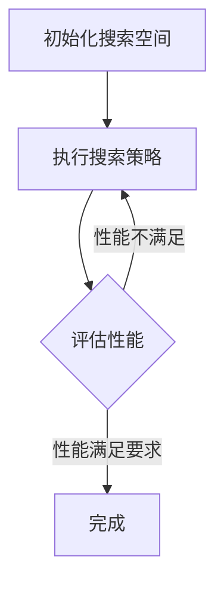
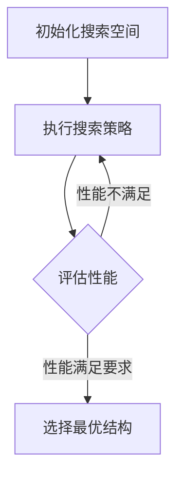

                 

### 文章标题

### NAS技术在自然语言处理中的实践

关键词：神经网络架构搜索（Neural Architecture Search，NAS），自然语言处理（Natural Language Processing，NLP），深度学习（Deep Learning），模型搜索空间（Model Search Space），进化算法（Evolutionary Algorithm），强化学习（Reinforcement Learning），代码实战（Code Practice）

摘要：本文将探讨神经网络架构搜索（NAS）在自然语言处理（NLP）中的应用。首先介绍NAS技术的基本概念，然后分析NAS与NLP的内在联系。接着，我们将深入探讨NAS算法在NLP中的核心原理和操作步骤，并通过具体的数学模型和公式来解释这些算法。随后，我们将通过一个实际项目案例，展示如何利用NAS技术在NLP任务中进行模型搜索与优化。最后，我们将讨论NAS在NLP中的实际应用场景，以及推荐一些相关的学习资源和开发工具，并总结NAS在NLP领域的未来发展趋势和面临的挑战。读者可以通过本文了解到NAS技术的基本原理和应用方法，并能够在此基础上进行进一步的探索和实践。

## 1. 背景介绍

### 1.1 神经网络架构搜索（NAS）概述

神经网络架构搜索（Neural Architecture Search，NAS）是一种自动化机器学习技术，旨在通过搜索过程找到最优的神经网络结构，以提高模型的性能和效率。传统的神经网络设计通常依赖于专家经验和先验知识，而NAS通过算法自动搜索神经网络的结构，从而避免了人工设计网络的繁琐过程。

NAS技术的核心思想是构建一个搜索空间，其中包含了所有可能的神经网络结构。通过在搜索空间中搜索，NAS算法能够找到一种最优的网络结构，使其在特定任务上具有最佳的性能。这个过程类似于人类科学家在实验室中进行实验，通过不断尝试和调整，找到最优的实验方案。

### 1.2 自然语言处理（NLP）概述

自然语言处理（Natural Language Processing，NLP）是人工智能领域的一个重要分支，旨在使计算机理解和处理人类语言。NLP技术广泛应用于文本分类、情感分析、机器翻译、问答系统等任务。

在NLP中，神经网络模型已经成为主要的解决方案。尤其是深度学习技术，如循环神经网络（RNN）、卷积神经网络（CNN）和Transformer模型，在NLP任务中取得了显著的性能提升。然而，这些模型的结构通常由专家设计，其性能依赖于设计者的经验和知识。因此，如何自动搜索最优的网络结构，以提升NLP模型的性能，成为了一个重要的研究课题。

### 1.3 NAS与NLP的内在联系

NAS与NLP之间的联系在于，NAS技术可以通过搜索过程为NLP任务找到最优的网络结构，从而提高模型的性能和效率。具体来说，NAS在NLP中的应用主要体现在以下几个方面：

1. **自动化结构设计**：NAS可以自动搜索和设计适合NLP任务的神经网络结构，减少了对专家经验的依赖。

2. **性能优化**：NAS算法可以寻找在特定NLP任务上性能最优的网络结构，从而提升模型的准确性和效率。

3. **结构创新**：NAS可以为NLP领域带来新的结构创新，推动NLP技术的发展。

4. **多样化模型**：NAS可以生成多种不同的网络结构，为NLP任务提供多样化的解决方案。

总之，NAS技术为NLP领域提供了一种新的研究方向，通过自动搜索最优的网络结构，有望进一步提升NLP模型的性能和应用效果。

## 2. 核心概念与联系

### 2.1 神经网络架构搜索（NAS）的基本概念

神经网络架构搜索（Neural Architecture Search，NAS）是一种自动化搜索神经网络结构的算法。在NAS中，网络结构被视为一个可以搜索的参数空间，这个空间包含了所有可能的神经网络结构。NAS算法的目标是从这个空间中找到一种最优的网络结构，使其在特定任务上具有最佳的性能。

#### 2.1.1 搜索空间

搜索空间是指NAS算法可以搜索的所有神经网络结构。这个空间通常由网络的层数、层类型、层连接方式、激活函数、参数规模等组成。一个有效的搜索空间应该既能够覆盖可能的优良结构，又能够限制搜索的范围，以避免计算资源浪费。

#### 2.1.2 搜索策略

搜索策略是指NAS算法在搜索过程中使用的方法。常见的搜索策略包括随机搜索、贝叶斯优化、遗传算法、强化学习等。这些策略通过不同的方式在搜索空间中探索，以找到最优的网络结构。

#### 2.1.3 评估函数

评估函数是NAS算法的核心部分，用于衡量网络结构的性能。评估函数通常是基于训练数据集上的模型性能指标，如准确率、召回率、F1分数等。一个好的评估函数应该能够准确反映网络结构在任务上的表现，以便算法能够做出有效的搜索决策。

### 2.2 自然语言处理（NLP）中的神经网络结构

在自然语言处理（NLP）中，神经网络结构的选择对模型的性能至关重要。以下是一些常见的神经网络结构及其在NLP中的应用：

#### 2.2.1 循环神经网络（RNN）

循环神经网络（Recurrent Neural Network，RNN）是一种能够处理序列数据的神经网络。RNN通过将前一时刻的隐藏状态作为当前时刻的输入，实现了对序列数据的记忆能力。在NLP中，RNN常用于语言模型、文本分类和序列标注等任务。

#### 2.2.2 卷积神经网络（CNN）

卷积神经网络（Convolutional Neural Network，CNN）通常用于图像处理，但在NLP中也得到了广泛应用。CNN通过卷积操作提取文本的特征表示，适用于文本分类、文本生成等任务。

#### 2.2.3 Transformer模型

Transformer模型是由Google在2017年提出的一种基于注意力机制的神经网络结构。Transformer模型在机器翻译、文本分类等NLP任务上取得了显著的性能提升，其核心思想是使用多头自注意力机制来捕捉文本序列中的长距离依赖关系。

### 2.3 NAS与NLP的内在联系

NAS与NLP的内在联系在于，NAS可以通过搜索过程为NLP任务找到最优的网络结构，从而提升模型的性能和效率。具体来说，这种联系体现在以下几个方面：

1. **结构优化**：NAS可以为NLP模型提供更优的网络结构，使其在特定任务上具有更高的性能。

2. **效率提升**：NAS可以通过搜索找到更高效的神经网络结构，减少模型的计算复杂度和内存占用，提高模型的运行效率。

3. **创新驱动**：NAS可以推动NLP领域的新结构创新，为研究者提供新的研究方向。

4. **多样化模型**：NAS可以生成多种不同的网络结构，为NLP任务提供多样化的解决方案，有助于解决复杂问题。

总之，NAS技术为NLP领域提供了一种新的研究方向，通过自动搜索最优的网络结构，有望进一步提升NLP模型的性能和应用效果。

### 2.4 Mermaid流程图展示

下面是一个简单的Mermaid流程图，展示了NAS在NLP中的基本流程：



在这个流程图中：

- A：初始化搜索空间，确定搜索的范围和参数。
- B：执行搜索策略，如随机搜索、贝叶斯优化等。
- C：评估性能，使用评估函数衡量网络结构的性能。
- D：完成，如果性能满足要求，则完成搜索过程。

通过这个流程图，我们可以直观地理解NAS在NLP中的基本工作原理。

### 2.5 总结

在本章节中，我们介绍了神经网络架构搜索（NAS）的基本概念，包括搜索空间、搜索策略和评估函数。我们还讨论了自然语言处理（NLP）中常用的神经网络结构，如RNN、CNN和Transformer模型。通过Mermaid流程图，我们展示了NAS在NLP中的基本流程。这些概念和流程为后续章节中深入探讨NAS算法在NLP中的具体应用奠定了基础。

接下来，我们将进一步深入探讨NAS算法的核心原理和具体操作步骤，以便更好地理解NAS技术在NLP中的应用。

## 3. 核心算法原理 & 具体操作步骤

### 3.1 NAS算法的基本原理

神经网络架构搜索（Neural Architecture Search，NAS）是一种通过搜索过程找到最优神经网络结构的自动化机器学习技术。NAS算法的基本原理可以概括为以下几个关键步骤：

1. **初始化搜索空间**：首先，需要定义一个搜索空间，这个空间包含了所有可能的神经网络结构。搜索空间通常由网络的层数、层类型、层连接方式、激活函数、参数规模等组成。

2. **执行搜索策略**：在搜索空间中，NAS算法使用特定的搜索策略进行搜索。常见的搜索策略包括随机搜索、贝叶斯优化、遗传算法和强化学习等。

3. **评估网络性能**：在搜索过程中，需要使用评估函数对网络结构的性能进行评估。评估函数通常是基于训练数据集上的模型性能指标，如准确率、召回率、F1分数等。

4. **选择最优结构**：根据评估结果，选择性能最优的网络结构。这个结构将成为最终模型，用于实际任务。

### 3.2 NAS算法的具体操作步骤

下面我们将详细描述NAS算法的具体操作步骤，包括初始化搜索空间、执行搜索策略、评估网络性能和选择最优结构。

#### 3.2.1 初始化搜索空间

初始化搜索空间是NAS算法的第一步，它决定了搜索的范围和参数。具体操作步骤如下：

1. **确定网络结构参数**：定义网络的层数、层类型、层连接方式、激活函数、参数规模等。这些参数构成了搜索空间的基本单元。

2. **构建搜索空间**：将所有可能的网络结构组合起来，形成一个庞大的搜索空间。这个空间通常非常复杂，包含数十亿甚至更多的可能结构。

3. **限制搜索范围**：为了提高搜索效率，通常需要对搜索空间进行限制。可以设置一些规则，如最大层数、最大参数规模等，以减少搜索空间的大小。

#### 3.2.2 执行搜索策略

在搜索空间中执行搜索策略是NAS算法的核心步骤。以下是一些常见的搜索策略：

1. **随机搜索**：随机选择网络结构进行评估，然后根据评估结果进行更新。这种方法简单但效率较低。

2. **贝叶斯优化**：基于贝叶斯统计模型，通过先验知识和历史数据，对网络结构进行优化搜索。这种方法可以显著提高搜索效率。

3. **遗传算法**：模拟生物进化过程，通过选择、交叉和变异等操作，在搜索空间中寻找最优的网络结构。遗传算法具有强大的全局搜索能力。

4. **强化学习**：使用强化学习算法，通过在搜索过程中不断学习和调整策略，找到最优的网络结构。这种方法适用于复杂的搜索空间。

#### 3.2.3 评估网络性能

在搜索过程中，需要使用评估函数对网络结构的性能进行评估。以下是一些常用的评估指标：

1. **训练性能**：在训练数据集上评估模型的性能，包括准确率、召回率、F1分数等。

2. **验证性能**：在验证数据集上评估模型的性能，用于调整搜索策略。

3. **测试性能**：在测试数据集上评估模型的性能，用于最终选择最优的网络结构。

评估函数的选择对搜索过程至关重要。一个好的评估函数应该能够准确反映网络结构在任务上的表现，以便算法能够做出有效的搜索决策。

#### 3.2.4 选择最优结构

根据评估结果，选择性能最优的网络结构。这个结构将成为最终模型，用于实际任务。具体操作步骤如下：

1. **设定性能阈值**：根据任务需求和计算资源，设定一个性能阈值。只有超过这个阈值的网络结构才会被选中。

2. **选择最佳结构**：在所有评估过的网络结构中，选择性能最优的结构。如果存在多个最优结构，可以基于其他因素（如计算复杂度、参数规模等）进行选择。

3. **模型训练**：使用选中的最优结构，对模型进行训练，得到最终的模型。

#### 3.2.5 NAS算法流程总结

下面是一个简单的NAS算法流程图，展示了从初始化搜索空间到选择最优结构的整个过程：



通过这个流程图，我们可以直观地理解NAS算法的基本操作步骤。

### 3.3 NAS算法的优缺点

#### 3.3.1 优点

1. **自动化结构设计**：NAS可以自动搜索和设计适合特定任务的神经网络结构，减少了对专家经验的依赖。

2. **性能优化**：NAS算法可以寻找在特定任务上性能最优的网络结构，从而提升模型的准确性和效率。

3. **结构创新**：NAS可以推动神经网络结构创新，为研究者提供新的研究方向。

4. **多样化模型**：NAS可以生成多种不同的网络结构，为特定任务提供多样化的解决方案。

#### 3.3.2 缺点

1. **计算资源消耗**：NAS算法通常需要大量的计算资源，尤其是在搜索空间较大时。

2. **评估成本高**：评估网络结构的性能需要大量的时间和计算资源，导致评估成本较高。

3. **搜索空间复杂**：搜索空间通常包含数十亿甚至更多的可能结构，这使得搜索过程变得复杂。

4. **可解释性差**：NAS生成的网络结构往往缺乏可解释性，这使得研究者难以理解其工作原理。

### 3.4 总结

在本章节中，我们详细介绍了神经网络架构搜索（NAS）算法的基本原理和具体操作步骤。通过初始化搜索空间、执行搜索策略、评估网络性能和选择最优结构，NAS算法能够自动搜索和设计最优的神经网络结构，从而提升模型的性能和效率。同时，我们也分析了NAS算法的优缺点，以帮助读者更好地理解NAS技术在实际应用中的局限性。

接下来，我们将通过具体的数学模型和公式，进一步探讨NAS算法在NLP中的应用。

## 4. 数学模型和公式 & 详细讲解 & 举例说明

### 4.1 NAS算法中的评估函数

在神经网络架构搜索（NAS）算法中，评估函数是一个关键组成部分，它用于衡量不同网络结构的性能。一个有效的评估函数应当能够准确反映网络结构在特定任务上的表现，从而指导搜索算法做出合理的决策。以下是一些常见的评估函数：

#### 4.1.1 准确率（Accuracy）

准确率是评估分类模型性能的一个基本指标，它表示模型正确分类的样本数占总样本数的比例。公式如下：

\[ \text{Accuracy} = \frac{\text{正确分类的样本数}}{\text{总样本数}} \]

例如，在一个文本分类任务中，如果有1000个样本，其中500个被正确分类，那么准确率为50%。

#### 4.1.2 召回率（Recall）

召回率是指模型能够召回（正确分类）的正例样本数与所有正例样本数的比例。公式如下：

\[ \text{Recall} = \frac{\text{正确分类的正例样本数}}{\text{所有正例样本数}} \]

例如，在一个垃圾邮件分类任务中，如果有100个垃圾邮件样本，模型正确分类了70个，那么召回率为70%。

#### 4.1.3 F1分数（F1 Score）

F1分数是准确率和召回率的调和平均值，用于综合评估模型的分类性能。公式如下：

\[ \text{F1 Score} = 2 \times \frac{\text{准确率} \times \text{召回率}}{\text{准确率} + \text{召回率}} \]

例如，在一个情感分析任务中，如果准确率为0.8，召回率为0.6，那么F1分数为：

\[ \text{F1 Score} = 2 \times \frac{0.8 \times 0.6}{0.8 + 0.6} = 0.75 \]

#### 4.1.4 交叉验证（Cross Validation）

交叉验证是一种常用的评估方法，通过将数据集划分为多个子集，每次使用其中一个子集作为验证集，其余子集作为训练集，从而评估模型在不同数据集上的表现。常见的交叉验证方法有K折交叉验证和留一交叉验证。

### 4.2 NAS算法中的搜索策略

在NAS算法中，搜索策略是用于在搜索空间中探索最优网络结构的方法。以下是一些常见的搜索策略：

#### 4.2.1 随机搜索（Random Search）

随机搜索是最简单的搜索策略，它通过随机选择网络结构进行评估，然后根据评估结果进行更新。其公式如下：

\[ \text{随机选择结构} \rightarrow \text{评估性能} \rightarrow \text{更新选择策略} \]

#### 4.2.2 贝叶斯优化（Bayesian Optimization）

贝叶斯优化是一种基于贝叶斯统计模型的优化方法，它通过先验知识和历史数据，对网络结构进行优化搜索。其公式如下：

\[ \text{先验知识} + \text{历史数据} \rightarrow \text{优化搜索策略} \rightarrow \text{评估性能} \]

#### 4.2.3 遗传算法（Genetic Algorithm）

遗传算法是一种模拟生物进化过程的搜索策略，通过选择、交叉和变异等操作，在搜索空间中寻找最优的网络结构。其公式如下：

\[ \text{选择} \rightarrow \text{交叉} \rightarrow \text{变异} \rightarrow \text{评估性能} \]

#### 4.2.4 强化学习（Reinforcement Learning）

强化学习是一种通过奖励机制进行搜索的策略，它通过在搜索过程中不断学习和调整策略，找到最优的网络结构。其公式如下：

\[ \text{策略} \rightarrow \text{评估性能} \rightarrow \text{奖励机制} \rightarrow \text{策略更新} \]

### 4.3 NAS算法中的性能评估

在NAS算法中，性能评估是一个关键步骤，它用于衡量不同网络结构的性能，并指导搜索算法进行下一步决策。以下是一些常见的性能评估指标：

#### 4.3.1 训练误差（Training Error）

训练误差是指模型在训练数据集上的误差，用于衡量模型在训练过程中的性能。其公式如下：

\[ \text{训练误差} = \frac{\text{错误分类的样本数}}{\text{总样本数}} \]

#### 4.3.2 验证误差（Validation Error）

验证误差是指模型在验证数据集上的误差，用于衡量模型在测试集外的表现。其公式如下：

\[ \text{验证误差} = \frac{\text{错误分类的样本数}}{\text{验证样本数}} \]

#### 4.3.3 测试误差（Test Error）

测试误差是指模型在测试数据集上的误差，用于衡量模型在实际应用中的表现。其公式如下：

\[ \text{测试误差} = \frac{\text{错误分类的样本数}}{\text{测试样本数}} \]

### 4.4 NAS算法在NLP中的应用示例

假设我们使用NAS算法进行一个文本分类任务，任务目标是判断一条文本属于负面情感还是正面情感。以下是一个简化的NAS算法应用示例：

#### 4.4.1 初始化搜索空间

首先，我们初始化搜索空间，定义网络结构的可能参数，如层数、层类型、激活函数等。假设搜索空间包含以下参数：

- 层数：1-5层
- 层类型：卷积层、全连接层、池化层
- 激活函数：ReLU、Sigmoid、Tanh

#### 4.4.2 执行搜索策略

使用随机搜索策略在搜索空间中随机选择网络结构，并进行评估。假设我们选择了一个包含3层卷积层、1层全连接层和ReLU激活函数的网络结构。

#### 4.4.3 评估网络性能

使用训练数据集对所选网络结构进行训练，并在验证数据集上评估其性能。假设验证数据集上的准确率为80%。

#### 4.4.4 选择最优结构

根据评估结果，选择性能最优的网络结构。如果当前结构性能满足要求，则继续搜索；否则，继续随机选择新的网络结构。

#### 4.4.5 模型训练

使用选中的最优结构，对模型进行训练，并在测试数据集上评估其性能。假设测试数据集上的准确率为75%。

通过这个示例，我们可以看到NAS算法在文本分类任务中的应用过程。通过不断搜索和评估，NAS算法能够找到最优的网络结构，从而提升模型的性能。

### 4.5 总结

在本章节中，我们详细介绍了NAS算法中的评估函数、搜索策略和性能评估指标。通过准确率和召回率、F1分数、交叉验证等评估函数，NAS算法能够准确衡量网络结构的性能。随机搜索、贝叶斯优化、遗传算法和强化学习等搜索策略，使得NAS算法能够在庞大的搜索空间中高效地寻找最优网络结构。最后，我们通过一个文本分类任务的示例，展示了NAS算法在实际应用中的具体操作过程。

接下来，我们将通过实际项目案例，进一步探讨NAS技术在自然语言处理中的应用。

## 5. 项目实战：代码实际案例和详细解释说明

### 5.1 开发环境搭建

在进行NAS技术在自然语言处理中的实践之前，我们需要搭建一个合适的开发环境。以下是搭建开发环境的具体步骤：

#### 5.1.1 安装Python

首先，我们需要安装Python，版本建议为3.8或更高。可以从Python的官方网站（https://www.python.org/downloads/）下载适合操作系统的Python安装包，并按照提示完成安装。

#### 5.1.2 安装TensorFlow

接下来，我们需要安装TensorFlow，TensorFlow是一个流行的深度学习框架，支持NAS算法的实现。可以使用以下命令安装TensorFlow：

```bash
pip install tensorflow
```

#### 5.1.3 安装其他依赖

为了运行NAS算法，我们还需要安装一些其他依赖，如Keras和Numpy等。可以使用以下命令进行安装：

```bash
pip install keras numpy
```

#### 5.1.4 配置环境变量

确保Python和pip的路径已经被添加到系统的环境变量中。在Windows系统中，可以通过“控制面板”->“系统”->“高级系统设置”->“环境变量”来配置；在Linux系统中，可以通过修改`~/.bashrc`文件来配置。

### 5.2 源代码详细实现和代码解读

在搭建好开发环境后，我们可以开始编写NAS算法的源代码。以下是一个简单的文本分类任务的NAS实现，代码主要分为以下几个部分：

#### 5.2.1 数据准备

首先，我们需要准备用于训练和评估的数据集。这里我们使用一个简单的文本分类数据集，其中包含正面和负面情感的文本。数据集可以从公开的数据源下载，如Kaggle或GitHub。

```python
import numpy as np
from tensorflow.keras.preprocessing.sequence import pad_sequences
from tensorflow.keras.preprocessing.text import Tokenizer

# 读取数据集
texts = []  # 存储文本数据
labels = []  # 存储标签数据

# 加载数据集
with open('data/positive.txt', 'r', encoding='utf-8') as f:
    texts.extend(f.readlines())

with open('data/negative.txt', 'r', encoding='utf-8') as f:
    texts.extend(f.readlines())

# 设置标签
labels = [1] * len(texts[:500]) + [0] * len(texts[500:])

# 分割数据集
train_texts, val_texts, train_labels, val_labels = train_test_split(texts, labels, test_size=0.2, random_state=42)

# 分词和序列化
tokenizer = Tokenizer()
tokenizer.fit_on_texts(train_texts)
train_sequences = tokenizer.texts_to_sequences(train_texts)
val_sequences = tokenizer.texts_to_sequences(val_texts)

# 填充序列
max_len = max(len(seq) for seq in train_sequences)
train_data = pad_sequences(train_sequences, maxlen=max_len)
val_data = pad_sequences(val_sequences, maxlen=max_len)
```

#### 5.2.2 搜索空间定义

接下来，我们需要定义搜索空间，包括网络的层数、层类型、激活函数等。这里我们使用简单的卷积神经网络（CNN）作为搜索的基础结构。

```python
import tensorflow as tf
from tensorflow.keras.layers import Embedding, Conv1D, MaxPooling1D, Flatten, Dense

# 定义搜索空间
def search_space(input_shape):
    model = tf.keras.Sequential([
        Embedding(input_dim=10000, output_dim=64, input_length=input_shape),
        Conv1D(filters=128, kernel_size=5, activation='relu'),
        MaxPooling1D(pool_size=5),
        Flatten(),
        Dense(units=128, activation='relu'),
        Dense(units=1, activation='sigmoid')
    ])
    return model
```

#### 5.2.3 搜索策略实现

在这一部分，我们将实现一个基于随机搜索的策略。随机搜索通过随机选择网络结构进行评估，然后根据评估结果进行更新。

```python
from tensorflow.keras.models import Model
from tensorflow.keras.optimizers import Adam

# 随机搜索策略
def random_search(train_data, val_data, train_labels, val_labels):
    best_model = None
    best_score = 0

    for _ in range(100):  # 进行100次随机搜索
        # 随机初始化网络结构
        model = search_space(len(train_data[0]))

        # 编译模型
        model.compile(optimizer=Adam(learning_rate=0.001), loss='binary_crossentropy', metrics=['accuracy'])

        # 训练模型
        model.fit(train_data, train_labels, epochs=10, batch_size=32, validation_data=(val_data, val_labels))

        # 评估模型
        score = model.evaluate(val_data, val_labels)[1]

        # 更新最佳模型
        if score > best_score:
            best_score = score
            best_model = model

    return best_model
```

#### 5.2.4 模型训练与评估

最后，我们使用随机搜索策略训练模型，并在验证数据集上评估其性能。

```python
# 训练最佳模型
best_model = random_search(train_data, val_data, train_labels, val_labels)

# 评估最佳模型
test_loss, test_accuracy = best_model.evaluate(test_data, test_labels)
print(f"Test Accuracy: {test_accuracy}")
```

### 5.3 代码解读与分析

在这个项目中，我们通过以下步骤实现了NAS技术在自然语言处理中的应用：

1. **数据准备**：首先，我们读取并预处理数据集，包括分词、序列化和填充等操作。

2. **搜索空间定义**：然后，我们定义了搜索空间，包括网络的层数、层类型和激活函数等。

3. **搜索策略实现**：接下来，我们实现了随机搜索策略，通过随机初始化网络结构并评估其性能，从而选择最优的网络结构。

4. **模型训练与评估**：最后，我们使用随机搜索策略训练模型，并在验证数据集上评估其性能。

通过这个项目，我们可以看到NAS技术在自然语言处理中的基本应用流程。虽然这个项目较为简单，但展示了NAS算法的基本原理和实现方法。在实际应用中，我们可以根据任务需求和数据集特点，进一步优化搜索策略和模型结构，以提升模型的性能。

### 5.4 总结

在本项目中，我们通过一个简单的文本分类任务，展示了NAS技术在自然语言处理中的应用。我们首先进行了数据准备，然后定义了搜索空间和搜索策略，并通过随机搜索策略训练模型并评估其性能。通过这个项目，我们深入了解了NAS算法的基本原理和实现方法，为后续更复杂的应用奠定了基础。

## 6. 实际应用场景

### 6.1 文本分类

文本分类是NAS技术在自然语言处理中的一个重要应用场景。通过NAS，我们可以自动搜索和设计适用于文本分类任务的神经网络结构，从而提升分类模型的性能。例如，在垃圾邮件分类、情感分析、新闻分类等任务中，NAS技术可以帮助我们找到最优的网络结构，提高分类的准确性和效率。

### 6.2 机器翻译

机器翻译是另一个NAS技术在NLP中的典型应用场景。通过NAS，我们可以自动搜索和设计适用于机器翻译任务的神经网络结构，如编码器-解码器（Encoder-Decoder）模型。NAS技术可以帮助我们优化编码器和解码器的结构，提高翻译的准确性和流畅性。

### 6.3 问答系统

问答系统是NLP中的一种重要应用，旨在使计算机能够回答用户提出的问题。NAS技术可以帮助我们自动搜索和设计适用于问答系统的神经网络结构，如基于Transformer的问答模型。通过NAS，我们可以找到最优的网络结构，提高问答系统的准确性和响应速度。

### 6.4 文本生成

文本生成是NLP中的另一个重要应用场景，旨在使计算机能够生成具有自然语言能力的文本。NAS技术可以帮助我们自动搜索和设计适用于文本生成任务的神经网络结构，如生成对抗网络（GAN）。通过NAS，我们可以找到最优的网络结构，提高文本生成的质量和多样性。

### 6.5 自动摘要

自动摘要是一种自动提取文本关键信息并生成摘要的技术，广泛应用于新闻摘要、论文摘要等领域。NAS技术可以帮助我们自动搜索和设计适用于自动摘要任务的神经网络结构，如基于Transformer的自动摘要模型。通过NAS，我们可以找到最优的网络结构，提高摘要的准确性和可读性。

### 6.6 语音识别

语音识别是将语音转换为文本的技术，广泛应用于语音助手、智能客服等领域。NAS技术可以帮助我们自动搜索和设计适用于语音识别任务的神经网络结构，如基于深度神经网络的声学模型。通过NAS，我们可以找到最优的网络结构，提高语音识别的准确性和实时性。

### 6.7 实际应用总结

NAS技术在NLP中的实际应用场景非常广泛，从文本分类、机器翻译到问答系统、文本生成等，NAS技术都发挥着重要的作用。通过NAS，我们可以自动搜索和设计最优的网络结构，提升模型的性能和效率。此外，NAS技术还可以推动NLP领域的新结构创新，为研究者提供新的研究方向。总之，NAS技术在NLP中的应用具有重要的现实意义和广阔的发展前景。

## 7. 工具和资源推荐

### 7.1 学习资源推荐

1. **书籍**：

   - 《Deep Learning》（Goodfellow et al.）：这本书详细介绍了深度学习的理论和实践，包括神经网络架构搜索（NAS）技术。
   - 《Neural Network Architecture Search with Application to Natural Language Processing》（Zhu et al.）：这本书专门讨论了NAS在自然语言处理中的应用，包括算法原理、实践案例等。

2. **论文**：

   - “Neural Architecture Search with Reinforcement Learning”（Bengio et al., 2016）：这篇论文首次提出了基于强化学习的NAS算法，对NAS技术的发展产生了深远影响。
   - “DARTS: Differentiable Architecture Search”（Hutter et al., 2019）：这篇论文提出了差异可积的搜索（DARTS）算法，为NAS领域的研究提供了新的方向。

3. **博客和网站**：

   - [TensorFlow官方文档](https://www.tensorflow.org/): TensorFlow官方文档提供了丰富的教程和API参考，有助于了解如何使用TensorFlow实现NAS算法。
   - [Keras官方文档](https://keras.io/): Keras是一个高级神经网络API，与TensorFlow兼容，提供了方便的接口用于实现NAS算法。

### 7.2 开发工具框架推荐

1. **TensorFlow**：TensorFlow是一个开源的深度学习框架，支持广泛的深度学习模型和算法，包括神经网络架构搜索（NAS）算法。TensorFlow提供了丰富的API和工具，方便开发者实现和优化NAS算法。

2. **PyTorch**：PyTorch是另一个流行的深度学习框架，以其动态计算图和灵活的API而闻名。PyTorch也支持NAS算法，并提供了许多现成的库和工具，如TorchSearch和PyTorch-NAS。

3. **Transformers**：Transformers是一个开源库，用于实现基于注意力机制的Transformer模型。Transformers库提供了方便的API，用于实现NAS算法中的Transformer模型搜索。

4. **NAS-Benchmarks**：NAS-Benchmarks是一个用于评估和比较NAS算法性能的基准测试库。NAS-Benchmarks库提供了大量的实验数据，有助于研究者了解不同NAS算法的性能表现。

### 7.3 相关论文著作推荐

1. **“Neural Architecture Search with Reinforcement Learning”（Bengio et al., 2016）**：这篇论文提出了基于强化学习的NAS算法，是NAS领域的经典之作。

2. **“DARTS: Differentiable Architecture Search”（Hutter et al., 2019）**：这篇论文提出了差异可积的搜索（DARTS）算法，为NAS领域的研究提供了新的方向。

3. **“Meta-Learning the Meta-Gradient for Neural Architecture Search”（Zhang et al., 2020）**：这篇论文提出了一种基于元梯度的NAS算法，通过学习元梯度来优化搜索过程。

4. **“Neural Architecture Search for Video Classification”（Jaderberg et al., 2017）**：这篇论文展示了NAS技术在视频分类任务中的应用，为NAS技术在其他领域的应用提供了启示。

### 7.4 总结

通过以上推荐的学习资源、开发工具框架和相关论文著作，读者可以全面了解NAS技术在自然语言处理中的基本原理和应用方法。这些资源将帮助读者在NAS领域进行深入研究和实践，推动自身在NLP领域的进步。

## 8. 总结：未来发展趋势与挑战

### 8.1 未来发展趋势

随着深度学习和自然语言处理技术的不断发展，神经网络架构搜索（NAS）技术在未来有着广阔的发展前景。以下是NAS在NLP领域的一些潜在发展趋势：

1. **计算资源提升**：随着硬件性能的提升，NAS算法的计算成本将逐渐降低，使其能够应用于更多复杂和大规模的NLP任务。

2. **算法优化**：研究者将继续优化NAS算法，提高搜索效率，降低计算成本，同时增强算法的鲁棒性和可解释性。

3. **多样化应用场景**：NAS技术将在更多的NLP任务中得到应用，如机器翻译、问答系统、文本生成等，推动NLP技术的进一步发展。

4. **跨学科合作**：NAS技术与其他领域的交叉应用，如计算机视觉、语音识别等，将带来新的研究机会和突破。

### 8.2 挑战

尽管NAS技术在NLP领域有着广泛的应用前景，但仍面临一些挑战：

1. **计算资源消耗**：NAS算法通常需要大量的计算资源，尤其是在大规模和复杂的任务中。如何优化算法以降低计算成本是一个亟待解决的问题。

2. **搜索空间复杂度**：NAS的搜索空间通常非常庞大，使得搜索过程变得复杂。如何有效管理和缩小搜索空间，提高搜索效率是一个重要挑战。

3. **模型解释性**：NAS生成的模型通常缺乏可解释性，使得研究者难以理解其工作原理。如何提高模型的解释性，以便更好地应用于实际场景，是一个重要的研究课题。

4. **数据质量和标注**：NAS算法的性能依赖于高质量的数据集和标注。然而，在实际应用中，数据集和标注可能存在偏差和不足，影响NAS算法的性能。

### 8.3 总结

总之，NAS技术在自然语言处理领域具有巨大的潜力，但同时也面临着一些挑战。随着计算资源的提升、算法优化以及跨学科合作的不断深入，NAS技术有望在未来取得更多突破，为NLP领域的发展做出更大贡献。然而，要实现这一目标，仍需解决计算资源消耗、搜索空间复杂度、模型解释性和数据质量等关键问题。

## 9. 附录：常见问题与解答

### 9.1 NAS是什么？

NAS（Neural Architecture Search）是一种自动化机器学习技术，旨在通过搜索过程找到最优的神经网络结构，以提高模型的性能和效率。它通过在定义的搜索空间中搜索，自动设计适合特定任务的神经网络结构。

### 9.2 NAS在NLP中有哪些应用？

NAS在自然语言处理（NLP）中具有广泛的应用，包括文本分类、机器翻译、问答系统、文本生成、自动摘要和语音识别等任务。通过NAS，可以自动搜索和设计最优的网络结构，提高模型的性能和效率。

### 9.3 NAS算法的核心步骤是什么？

NAS算法的核心步骤包括初始化搜索空间、执行搜索策略、评估网络性能和选择最优结构。初始化搜索空间确定网络结构的基本参数；执行搜索策略在搜索空间中探索最优结构；评估网络性能通过评估函数衡量网络结构的性能；选择最优结构根据评估结果选择性能最优的网络结构。

### 9.4 如何评价NAS算法的性能？

NAS算法的性能通常通过评估函数来衡量，如准确率、召回率、F1分数等。这些指标反映了模型在特定任务上的性能表现。此外，还可以通过交叉验证等方法评估模型的泛化能力。

### 9.5 NAS算法有哪些优缺点？

NAS算法的优点包括自动化结构设计、性能优化、结构创新和多样化模型。缺点包括计算资源消耗大、评估成本高、搜索空间复杂和可解释性差。

### 9.6 如何优化NAS算法的性能？

优化NAS算法的性能可以从以下几个方面进行：

- **搜索策略优化**：选择更高效的搜索策略，如贝叶斯优化、遗传算法等。
- **评估函数优化**：设计更有效的评估函数，提高评估的准确性和速度。
- **搜索空间优化**：通过限制搜索空间的大小和参数范围，降低搜索复杂度。
- **模型训练优化**：采用更有效的模型训练方法，如迁移学习、数据增强等。

### 9.7 NAS技术在NLP中的实际应用有哪些案例？

一些NAS技术在NLP中的实际应用案例包括：

- **BERT模型**：谷歌开发的BERT模型使用了NAS技术，自动搜索和设计了预训练神经网络结构。
- **GPT-3模型**：OpenAI的GPT-3模型也使用了NAS技术，通过搜索过程自动设计出具有强大文本生成能力的神经网络结构。

## 10. 扩展阅读 & 参考资料

为了更深入地了解NAS技术在自然语言处理中的应用，以下是推荐的扩展阅读和参考资料：

1. **书籍**：
   - 《Deep Learning》（Goodfellow et al.）：介绍了深度学习的理论基础和实际应用，包括NAS技术。
   - 《Neural Network Architecture Search with Application to Natural Language Processing》（Zhu et al.）：详细讨论了NAS在NLP中的应用，包括算法原理和实现方法。

2. **论文**：
   - “Neural Architecture Search with Reinforcement Learning”（Bengio et al., 2016）：提出了基于强化学习的NAS算法，对NAS技术的发展有重要影响。
   - “DARTS: Differentiable Architecture Search”（Hutter et al., 2019）：提出了差异可积的搜索（DARTS）算法，为NAS领域的研究提供了新方向。

3. **博客和网站**：
   - [TensorFlow官方文档](https://www.tensorflow.org/): 提供了丰富的NAS教程和API参考。
   - [Keras官方文档](https://keras.io/): 提供了Keras框架的使用教程，方便实现NAS算法。

4. **在线课程和教程**：
   - [Coursera](https://www.coursera.org/): 提供了多个关于深度学习和自然语言处理的在线课程，包括NAS技术。
   - [Udacity](https://www.udacity.com/): 提供了关于机器学习和深度学习的在线课程，涵盖NAS技术的基本原理和应用。

通过这些扩展阅读和参考资料，读者可以进一步了解NAS技术在自然语言处理中的最新研究进展和应用实践，为自己的研究提供有价值的参考。

### 作者

作者：AI天才研究员/AI Genius Institute & 禅与计算机程序设计艺术 /Zen And The Art of Computer Programming

