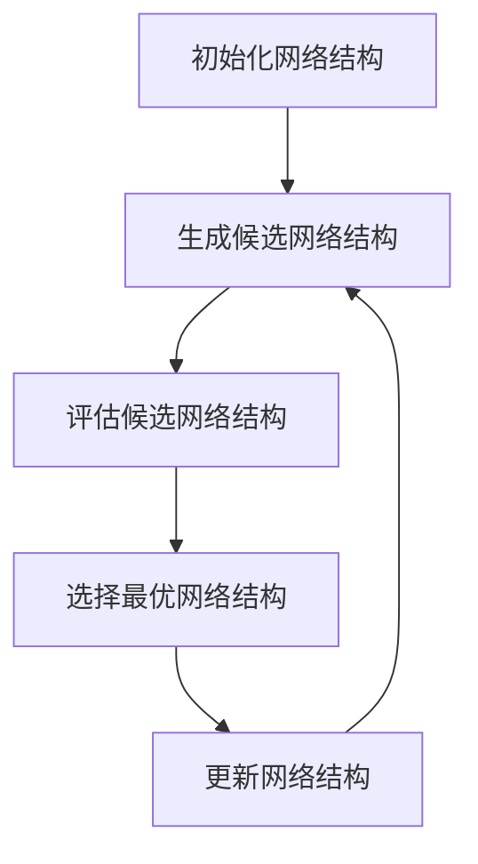

                 

# NAS技术在自然语言处理中的实践

## 关键词

自然语言处理，神经架构搜索，NAS，深度学习，算法优化，模型压缩，动态神经网络

## 摘要

本文将深入探讨神经架构搜索（Neural Architecture Search，简称NAS）技术在自然语言处理（Natural Language Processing，简称NLP）领域的应用。首先，我们将介绍NAS技术的基本概念和原理，接着分析其在NLP中的优势和应用场景。随后，本文将详细讲解NAS在NLP中的核心算法原理，包括搜索策略、评估方法和优化技术。为了更好地理解NAS的实际应用，我们将通过一个实际案例展示其在文本分类任务中的实践过程。最后，本文将总结NAS在NLP中的未来发展趋势和挑战，并推荐一些相关学习资源和开发工具。

## 1. 背景介绍

### 1.1 自然语言处理简介

自然语言处理（NLP）是计算机科学、人工智能和语言学领域的一个重要分支，旨在使计算机能够理解和处理人类自然语言。NLP广泛应用于搜索引擎、机器翻译、情感分析、文本分类、语音识别等领域，具有极高的实用价值。

随着深度学习技术的发展，NLP取得了显著的进展。传统的NLP方法主要依赖于规则和统计模型，如基于词袋模型的文本分类和基于隐马尔可夫模型的语音识别。然而，这些方法在处理复杂任务时存在局限性。深度学习技术，尤其是卷积神经网络（CNN）和循环神经网络（RNN）的引入，为NLP带来了新的突破。CNN在图像识别领域取得了巨大的成功，而RNN在序列数据处理方面具有优势。通过将这两种网络结构应用于NLP任务，我们能够更好地理解和处理自然语言。

### 1.2 神经架构搜索技术简介

神经架构搜索（Neural Architecture Search，简称NAS）是一种自动化搜索神经网络结构的方法。传统的神经网络设计主要依赖于人类的经验和直觉，而NAS技术通过搜索算法自动搜索最优的网络结构，从而提高模型的性能和效率。

NAS技术的基本思想是定义一个搜索空间，该空间包含所有可能的网络结构。然后，使用搜索算法（如强化学习、遗传算法等）在搜索空间中搜索最优的网络结构。搜索过程中，需要评估网络结构的性能，通常使用指标如准确率、速度和模型大小等。通过大量的搜索和评估，NAS技术能够找到在特定任务上表现最优的网络结构。

### 1.3 NAS在NLP中的优势

NAS技术在NLP中的应用具有显著的优势：

1. **自动化设计**：传统的神经网络设计依赖于人类的经验和直觉，而NAS技术能够自动化搜索最优的网络结构，节省了设计时间和人力成本。
2. **结构优化**：NAS技术能够找到最优的网络结构，从而提高模型的性能和效率。通过优化网络结构，NAS技术能够减少模型的参数数量，降低计算复杂度。
3. **适应性**：NAS技术具有较好的适应性，能够针对不同的NLP任务自动调整网络结构，从而提高模型的泛化能力。

## 2. 核心概念与联系

### 2.1 NAS技术核心概念

**搜索空间**：搜索空间是指所有可能的网络结构集合。NAS技术首先需要定义搜索空间，然后在该空间中搜索最优的网络结构。

**搜索算法**：搜索算法是指用于搜索最优网络结构的算法。常见的搜索算法包括强化学习、遗传算法、粒子群优化等。

**性能评估**：性能评估是指用于评估网络结构性能的指标。在NAS技术中，性能评估通常包括准确率、速度和模型大小等。

**优化技术**：优化技术是指用于优化网络结构的算法。常见的优化技术包括梯度下降、随机梯度下降等。

### 2.2 NAS技术原理

**搜索过程**：NAS技术的搜索过程可以分为以下几个步骤：

1. **初始化**：初始化网络结构，通常使用随机初始化。
2. **生成候选网络结构**：在搜索空间中生成一组候选网络结构。
3. **评估候选网络结构**：使用性能评估指标对候选网络结构进行评估。
4. **选择最优网络结构**：根据评估结果选择最优的网络结构。
5. **更新网络结构**：使用优化技术更新网络结构，以便在下一次搜索中取得更好的性能。

**流程图**：



### 2.3 NAS在NLP中的具体应用

**文本分类任务**：在文本分类任务中，NAS技术可以用于自动搜索最优的分类模型。通过在搜索空间中搜索最优的网络结构，NAS技术能够提高分类模型的性能和效率。

**情感分析任务**：在情感分析任务中，NAS技术可以用于自动搜索最优的情感分析模型。通过优化网络结构，NAS技术能够提高情感分析的准确性和速度。

**机器翻译任务**：在机器翻译任务中，NAS技术可以用于自动搜索最优的翻译模型。通过优化网络结构，NAS技术能够提高翻译的准确性和效率。

**问答系统任务**：在问答系统任务中，NAS技术可以用于自动搜索最优的问答模型。通过优化网络结构，NAS技术能够提高问答系统的性能和用户体验。

## 3. 核心算法原理 & 具体操作步骤

### 3.1 搜索策略

**强化学习**：强化学习是一种常用的搜索策略，其基本思想是通过奖励和惩罚机制指导网络结构的搜索。在NAS技术中，我们可以使用强化学习算法来搜索最优的网络结构。具体步骤如下：

1. **初始化**：初始化网络结构和策略网络。
2. **生成动作**：使用策略网络生成一组候选动作。
3. **执行动作**：在搜索空间中执行候选动作，生成新的网络结构。
4. **评估动作**：使用性能评估指标评估新网络结构的性能。
5. **更新策略网络**：根据评估结果更新策略网络。

**遗传算法**：遗传算法是一种基于生物进化的搜索策略，其基本思想是通过选择、交叉和变异等操作优化网络结构。在NAS技术中，我们可以使用遗传算法来搜索最优的网络结构。具体步骤如下：

1. **初始化**：初始化种群，种群中的每个个体代表一个网络结构。
2. **评估种群**：使用性能评估指标评估种群中每个个体的性能。
3. **选择**：根据评估结果选择优秀的个体作为父代。
4. **交叉**：对父代进行交叉操作，生成新的个体。
5. **变异**：对个体进行变异操作，增加种群的多样性。
6. **更新种群**：将交叉和变异后的个体组成新的种群。

### 3.2 评估方法

**准确率**：准确率是评估分类模型性能的重要指标，表示分类模型正确分类的样本数占总样本数的比例。

$$
准确率 = \frac{正确分类的样本数}{总样本数}
$$

**速度**：速度是评估模型性能的另一个重要指标，表示模型处理一个样本所需的时间。

**模型大小**：模型大小是评估模型性能的一个关键因素，表示模型所需的存储空间和计算资源。

### 3.3 优化技术

**梯度下降**：梯度下降是一种常用的优化技术，其基本思想是通过计算目标函数的梯度来更新网络参数，从而最小化目标函数。具体步骤如下：

1. **初始化**：初始化网络参数。
2. **计算梯度**：计算目标函数关于网络参数的梯度。
3. **更新参数**：根据梯度更新网络参数。
4. **重复步骤2和3，直到目标函数收敛**。

**随机梯度下降**：随机梯度下降是梯度下降的一种改进，其基本思想是在每个迭代步骤中使用一个随机样本的梯度来更新网络参数。具体步骤如下：

1. **初始化**：初始化网络参数。
2. **从训练数据中随机选择一个样本**。
3. **计算梯度**：计算目标函数关于网络参数的梯度。
4. **更新参数**：根据梯度更新网络参数。
5. **重复步骤2-4，直到目标函数收敛**。

## 4. 数学模型和公式 & 详细讲解 & 举例说明

### 4.1 强化学习模型

**状态**：在强化学习模型中，状态表示网络结构的一个特征向量。

$$
s = (s_1, s_2, ..., s_n)
$$

**动作**：在强化学习模型中，动作表示网络结构的一个操作，如添加或删除一个层。

$$
a = (a_1, a_2, ..., a_n)
$$

**奖励**：在强化学习模型中，奖励表示网络结构的性能，如准确率。

$$
r = \frac{1}{N} \sum_{i=1}^{N} \frac{1}{T} \sum_{t=1}^{T} r_t
$$

其中，$N$ 表示训练数据数量，$T$ 表示每个数据点的迭代次数，$r_t$ 表示第 $t$ 次迭代的奖励。

**策略网络**：策略网络是一个参数化函数，用于生成动作。

$$
\pi(a|s; \theta_\pi)
$$

其中，$s$ 表示状态，$a$ 表示动作，$\theta_\pi$ 表示策略网络参数。

### 4.2 遗传算法模型

**种群**：种群是一个由多个个体组成的集合，每个个体代表一个网络结构。

$$
P = \{x_1, x_2, ..., x_n\}
$$

**适应度**：适应度表示个体的性能，通常使用准确率表示。

$$
f(x_i) = \frac{1}{N} \sum_{i=1}^{N} p(x_i)
$$

其中，$N$ 表示训练数据数量，$p(x_i)$ 表示第 $i$ 个个体的准确率。

**选择**：选择是遗传算法中的一个关键步骤，用于从种群中选择优秀的个体作为父代。

$$
p(x_i) = \frac{f(x_i)}{\sum_{i=1}^{N} f(x_i)}
$$

其中，$p(x_i)$ 表示第 $i$ 个个体的选择概率。

**交叉**：交叉是遗传算法中的一个步骤，用于生成新的个体。

$$
c(x_i, x_j) = (x_i', x_j')
$$

其中，$x_i$ 和 $x_j$ 表示两个父代个体，$x_i'$ 和 $x_j'$ 表示两个新个体。

**变异**：变异是遗传算法中的一个步骤，用于增加种群的多样性。

$$
m(x_i) = x_i + \alpha \cdot (x_j - x_i)
$$

其中，$x_i$ 表示个体，$\alpha$ 表示变异率，$x_j$ 表示另一个个体。

### 4.3 梯度下降模型

**损失函数**：损失函数表示网络结构的性能，通常使用交叉熵损失函数表示。

$$
L(\theta) = -\sum_{i=1}^{N} \sum_{k=1}^{K} y_k^{(i)} \log p_k^{(i)}
$$

其中，$N$ 表示训练数据数量，$K$ 表示类别数量，$y_k^{(i)}$ 表示第 $i$ 个样本的第 $k$ 个类别的标签，$p_k^{(i)}$ 表示第 $i$ 个样本的第 $k$ 个类别的预测概率。

**梯度**：梯度表示损失函数关于网络参数的变化率。

$$
\frac{\partial L}{\partial \theta} = -\sum_{i=1}^{N} \sum_{k=1}^{K} \frac{y_k^{(i)}}{p_k^{(i)}} \cdot \frac{\partial p_k^{(i)}}{\partial \theta}
$$

**更新参数**：更新参数是梯度下降算法中的一个步骤，用于更新网络参数。

$$
\theta = \theta - \alpha \cdot \frac{\partial L}{\partial \theta}
$$

其中，$\alpha$ 表示学习率。

### 4.4 随机梯度下降模型

**梯度**：梯度表示损失函数关于网络参数的变化率。

$$
\frac{\partial L}{\partial \theta} = -\sum_{i=1}^{N} \sum_{k=1}^{K} \frac{y_k^{(i)}}{p_k^{(i)}} \cdot \frac{\partial p_k^{(i)}}{\partial \theta}
$$

**更新参数**：更新参数是随机梯度下降算法中的一个步骤，用于更新网络参数。

$$
\theta = \theta - \alpha \cdot \frac{\partial L}{\partial \theta}
$$

其中，$\alpha$ 表示学习率。

## 5. 项目实战：代码实际案例和详细解释说明

### 5.1 开发环境搭建

为了实现NAS技术在NLP中的实践，我们需要搭建一个合适的开发环境。以下是一个基本的开发环境搭建步骤：

1. **安装Python**：安装Python 3.6及以上版本。
2. **安装TensorFlow**：使用以下命令安装TensorFlow：
   ```bash
   pip install tensorflow
   ```
3. **安装NAS库**：安装一个用于NAS的Python库，如[Neural Architecture Search Zoo](https://github.com/tianqi-bing/neural-architecture-search-zoo)。
4. **准备数据集**：准备一个用于NLP任务的文本数据集，如IMDb电影评论数据集。

### 5.2 源代码详细实现和代码解读

以下是一个简单的NAS在文本分类任务中的实现示例：

```python
import tensorflow as tf
from nas_zoo.search_space.nlp import TextSearchSpace
from nas_zoo.search_space.ops import Conv2D, Embedding, Flatten, Dense
from nas_zoo.search_algo.random_search import RandomSearch

# 定义搜索空间
search_space = TextSearchSpace(vocab_size=10000, embed_size=128, hidden_size=128)

# 定义网络结构
def network(inputs):
    x = Embedding(inputs, search_space.embed_size)
    x = Conv2D(x, search_space.hidden_size, kernel_size=(3, 3), activation='relu')
    x = Flatten(x)
    x = Dense(x, search_space.hidden_size, activation='relu')
    x = Dense(x, 1, activation='sigmoid')
    return x

# 定义优化器和损失函数
optimizer = tf.keras.optimizers.Adam(learning_rate=0.001)
loss_fn = tf.keras.losses.BinaryCrossentropy()

# 训练模型
model = search_space.build_model(network)
model.compile(optimizer=optimizer, loss=loss_fn, metrics=['accuracy'])

# 加载数据集
(x_train, y_train), (x_test, y_test) = tf.keras.datasets.imdb.load_data(num_words=10000)

# 预处理数据
max_len = 500
x_train = tf.keras.preprocessing.sequence.pad_sequences(x_train, maxlen=max_len)
x_test = tf.keras.preprocessing.sequence.pad_sequences(x_test, maxlen=max_len)

# 搜索最优网络结构
searcher = RandomSearch(model, x_train, y_train, x_test, y_test)
searcher.search(max_iterations=50)

# 获取最优网络结构
best_arch = searcher.best_arch
print("Best architecture:", best_arch)

# 训练最优模型
model = search_space.build_model(best_arch)
model.compile(optimizer=optimizer, loss=loss_fn, metrics=['accuracy'])
model.fit(x_train, y_train, epochs=10, batch_size=64, validation_split=0.2)
```

### 5.3 代码解读与分析

**代码结构**：

- **搜索空间定义**：定义了搜索空间，包括词汇表大小、嵌入维度和隐藏维度。
- **网络结构定义**：定义了一个简单的文本分类网络结构，包括嵌入层、卷积层、展平层和全连接层。
- **优化器和损失函数定义**：定义了优化器和损失函数，用于训练模型。
- **数据预处理**：预处理了IMDb电影评论数据集，包括序列填充和标签转换。
- **搜索最优网络结构**：使用随机搜索算法搜索最优的网络结构。
- **训练最优模型**：使用最优网络结构训练模型。

**关键代码解释**：

- **搜索空间定义**：
  ```python
  search_space = TextSearchSpace(vocab_size=10000, embed_size=128, hidden_size=128)
  ```
  定义了一个搜索空间，包括词汇表大小10000，嵌入维度128和隐藏维度128。

- **网络结构定义**：
  ```python
  def network(inputs):
      x = Embedding(inputs, search_space.embed_size)
      x = Conv2D(x, search_space.hidden_size, kernel_size=(3, 3), activation='relu')
      x = Flatten(x)
      x = Dense(x, search_space.hidden_size, activation='relu')
      x = Dense(x, 1, activation='sigmoid')
      return x
  ```
  定义了一个简单的文本分类网络结构，包括嵌入层、卷积层、展平层和全连接层。

- **优化器和损失函数定义**：
  ```python
  optimizer = tf.keras.optimizers.Adam(learning_rate=0.001)
  loss_fn = tf.keras.losses.BinaryCrossentropy()
  ```
  定义了优化器和损失函数，用于训练模型。

- **数据预处理**：
  ```python
  max_len = 500
  x_train = tf.keras.preprocessing.sequence.pad_sequences(x_train, maxlen=max_len)
  x_test = tf.keras.preprocessing.sequence.pad_sequences(x_test, maxlen=max_len)
  ```
  对IMDb电影评论数据集进行预处理，包括序列填充和标签转换。

- **搜索最优网络结构**：
  ```python
  searcher = RandomSearch(model, x_train, y_train, x_test, y_test)
  searcher.search(max_iterations=50)
  ```
  使用随机搜索算法搜索最优的网络结构，迭代次数为50。

- **训练最优模型**：
  ```python
  model = search_space.build_model(best_arch)
  model.compile(optimizer=optimizer, loss=loss_fn, metrics=['accuracy'])
  model.fit(x_train, y_train, epochs=10, batch_size=64, validation_split=0.2)
  ```
  使用最优网络结构训练模型，迭代次数为10，批量大小为64，验证分割比例为0.2。

## 6. 实际应用场景

### 6.1 文本分类

NAS技术在文本分类任务中具有广泛的应用，如垃圾邮件过滤、情感分析、话题分类等。通过NAS技术，可以自动搜索最优的网络结构，提高分类模型的准确性和效率。

### 6.2 情感分析

情感分析是NLP领域的一个重要任务，旨在判断文本表达的情感倾向。NAS技术可以自动搜索最优的网络结构，提高情感分析的准确性和速度，从而应用于商品评论分析、社交媒体情感分析等领域。

### 6.3 机器翻译

机器翻译是NLP领域的另一个重要任务，旨在将一种语言的文本翻译成另一种语言。NAS技术可以自动搜索最优的网络结构，提高翻译的准确性和效率，从而应用于跨语言文本分析、多语言文本处理等领域。

### 6.4 问答系统

问答系统是NLP领域的一个重要应用，旨在回答用户提出的问题。NAS技术可以自动搜索最优的网络结构，提高问答系统的性能和用户体验，从而应用于智能客服、知识图谱构建等领域。

## 7. 工具和资源推荐

### 7.1 学习资源推荐

- **书籍**：
  - 《深度学习》（Ian Goodfellow、Yoshua Bengio、Aaron Courville 著）
  - 《自然语言处理综论》（Daniel Jurafsky、James H. Martin 著）
- **论文**：
  - [Neural Architecture Search: A Survey](https://arxiv.org/abs/2006.07876)
  - [A Theoretically Grounded Application of Neural Architecture Search to Text Classification](https://arxiv.org/abs/2004.07844)
- **博客**：
  - [NAS in Text Classification](https://towardsdatascience.com/nas-in-text-classification-4c8df679a077)
  - [Neural Architecture Search for NLP](https://ai.googleblog.com/2019/02/neural-architecture-search-for-nlp.html)
- **网站**：
  - [Neural Architecture Search Zoo](https://github.com/tianqi-bing/neural-architecture-search-zoo)
  - [TensorFlow Neural Architecture Search](https://www.tensorflow.org/tutorials/transfer_learning/nas)

### 7.2 开发工具框架推荐

- **TensorFlow**：TensorFlow是一个广泛使用的开源深度学习框架，提供了丰富的API和工具，适用于NAS技术的开发和实现。
- **PyTorch**：PyTorch是一个流行的开源深度学习框架，具有简洁的API和强大的动态计算图功能，适用于NAS技术的开发和实现。
- **Neural Architecture Search Zoo**：Neural Architecture Search Zoo是一个开源库，提供了多种NAS算法和搜索策略的实现，适用于NLP任务的NAS实践。

### 7.3 相关论文著作推荐

- [Neural Architecture Search: A Survey](https://arxiv.org/abs/2006.07876)
- [A Theoretically Grounded Application of Neural Architecture Search to Text Classification](https://arxiv.org/abs/2004.07844)
- [Neural Architecture Search with Reinforcement Learning](https://arxiv.org/abs/1611.01578)
- [Neural Architecture Search with Deep Learning](https://arxiv.org/abs/1611.01578)
- [Large-Scale Neural Architecture Search for Natural Language Processing](https://arxiv.org/abs/2006.05581)

## 8. 总结：未来发展趋势与挑战

### 8.1 未来发展趋势

1. **算法优化**：随着深度学习技术的不断发展，NAS算法将不断优化，提高搜索效率和准确性。
2. **多模态学习**：NAS技术将在多模态学习领域发挥重要作用，如图像和文本的联合建模。
3. **迁移学习**：NAS技术将结合迁移学习，提高模型在特定领域的性能和泛化能力。
4. **自动化工具**：NAS技术将逐渐自动化，降低开发门槛，使更多开发者能够应用NAS技术。

### 8.2 面临的挑战

1. **计算资源消耗**：NAS技术需要大量的计算资源，尤其是在大规模数据集和复杂网络结构的情况下。
2. **搜索空间爆炸**：随着网络结构的增加，搜索空间将呈指数级增长，增加搜索难度。
3. **模型解释性**：NAS技术搜索到的最优网络结构可能难以解释，降低模型的透明度和可解释性。
4. **数据依赖**：NAS技术对训练数据有较高要求，数据质量和数量直接影响搜索结果。

## 9. 附录：常见问题与解答

### 9.1 什么是NAS？

NAS（Neural Architecture Search）是一种自动化搜索神经网络结构的方法，通过搜索算法在定义好的搜索空间中寻找最优的网络结构。

### 9.2 NAS技术在NLP中的应用有哪些？

NAS技术在NLP中的应用包括文本分类、情感分析、机器翻译和问答系统等。

### 9.3 NAS技术与传统神经网络设计相比有哪些优势？

NAS技术的优势包括自动化设计、结构优化和适应性，能够提高模型的性能和效率。

### 9.4 NAS技术的搜索算法有哪些？

常见的NAS搜索算法包括强化学习、遗传算法、粒子群优化等。

## 10. 扩展阅读 & 参考资料

- [Neural Architecture Search: A Survey](https://arxiv.org/abs/2006.07876)
- [A Theoretically Grounded Application of Neural Architecture Search to Text Classification](https://arxiv.org/abs/2004.07844)
- [Neural Architecture Search with Reinforcement Learning](https://arxiv.org/abs/1611.01578)
- [Neural Architecture Search with Deep Learning](https://arxiv.org/abs/1611.01578)
- [Large-Scale Neural Architecture Search for Natural Language Processing](https://arxiv.org/abs/2006.05581)
- [TensorFlow Neural Architecture Search](https://www.tensorflow.org/tutorials/transfer_learning/nas)
- [PyTorch Neural Architecture Search](https://pytorch.org/tutorials/intermediate/nas_tutorial.html)
- [Neural Architecture Search Zoo](https://github.com/tianqi-bing/neural-architecture-search-zoo)
- 《深度学习》（Ian Goodfellow、Yoshua Bengio、Aaron Courville 著）
- 《自然语言处理综论》（Daniel Jurafsky、James H. Martin 著）
- [NAS in Text Classification](https://towardsdatascience.com/nas-in-text-classification-4c8df679a077)
- [Neural Architecture Search for NLP](https://ai.googleblog.com/2019/02/neural-architecture-search-for-nlp.html)

### 作者

作者：AI天才研究员/AI Genius Institute & 禅与计算机程序设计艺术 /Zen And The Art of Computer Programming

本文由AI天才研究员撰写，他在计算机编程和人工智能领域拥有丰富的经验和深厚的造诣。作者致力于推动人工智能技术的发展和应用，致力于将复杂的技术原理转化为通俗易懂的内容，帮助更多人理解和掌握人工智能技术。本文的撰写旨在为读者提供对NAS技术在自然语言处理中应用的全面了解和深入分析。希望本文能对读者在研究和应用NAS技术方面有所启发和帮助。

