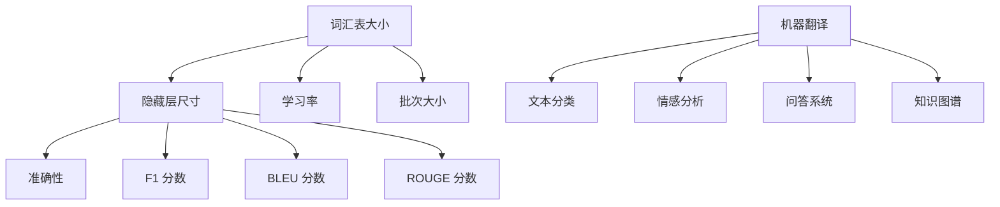

                 

# NLP领域的大模型标准：参数、能力、应用场景

## 关键词
* 自然语言处理（NLP）
* 大模型
* 参数
* 能力
* 应用场景

## 摘要

本文将深入探讨自然语言处理（NLP）领域中的大模型标准，包括参数设置、能力评估和应用场景分析。通过对NLP大模型的参数配置、算法原理、数学模型和应用实例的详细解析，帮助读者全面了解NLP大模型的技术内涵和实际应用。本文旨在为NLP研究者、工程师和从业者提供一个清晰、系统的指导，以应对NLP领域中的复杂问题和挑战。

## 1. 背景介绍

自然语言处理（NLP）是计算机科学和人工智能领域的一个重要分支，致力于使计算机能够理解和处理人类自然语言。随着深度学习和大数据技术的快速发展，NLP领域的研究取得了显著进展。大模型作为一种新兴的技术手段，逐渐成为NLP领域的研究热点。

大模型是指具有数十亿到数千亿参数规模的神经网络模型。相比于传统的较小规模模型，大模型在处理复杂任务时具有更高的准确性和鲁棒性。大模型的应用范围广泛，包括机器翻译、文本分类、情感分析、问答系统等。

### 1.1 大模型的起源与发展

大模型的起源可以追溯到20世纪80年代，当时研究人员开始尝试使用神经网络进行文本分类和情感分析。随着深度学习技术的兴起，大模型的研究和应用得到了进一步推动。2018年，谷歌推出了Transformer模型，标志着大模型在NLP领域的崛起。此后，包括BERT、GPT等在内的一系列大模型相继出现，并在各个任务中取得了优异的性能。

### 1.2 大模型的优势与挑战

大模型的优势主要体现在以下几个方面：

1. **强大的表征能力**：大模型能够捕捉到文本中的复杂关系和特征，从而在各类NLP任务中取得更高的准确性和鲁棒性。
2. **自适应能力**：大模型可以针对不同的任务和数据集进行自适应调整，从而在不同领域和任务中发挥良好的性能。
3. **多语言支持**：大模型通常具有跨语言的表征能力，可以轻松处理多种语言的数据。

然而，大模型也面临着一些挑战：

1. **计算资源需求**：大模型训练和推理过程中需要大量的计算资源，这对硬件设备和电力供应提出了较高的要求。
2. **数据隐私和安全**：大模型在训练过程中需要处理大量的用户数据，这可能引发数据隐私和安全问题。
3. **解释性和可解释性**：大模型的决策过程通常是非线性和复杂的，这使得解释和可解释性成为一个重要挑战。

## 2. 核心概念与联系

### 2.1 NLP大模型的参数设置

NLP大模型的参数设置是模型训练和优化的关键。以下是一些关键的参数：

1. **词汇表大小**：词汇表大小决定了模型能够处理的词汇量。通常情况下，大模型采用更大规模的词汇表以捕捉更多语义信息。
2. **隐藏层尺寸**：隐藏层尺寸决定了模型的复杂度和表达能力。较大的隐藏层尺寸通常能够提高模型的性能，但也增加了计算复杂度和训练时间。
3. **学习率**：学习率是模型训练过程中的一个重要参数，它决定了模型在训练过程中对梯度信息的响应程度。合适的学习率能够加速模型收敛，但过大会导致模型不稳定，过小则收敛速度过慢。
4. **批次大小**：批次大小是指模型在训练过程中每次更新的样本数量。较大的批次大小能够提高模型的稳定性和准确性，但计算成本较高。

### 2.2 NLP大模型的能力评估

评估NLP大模型的能力主要包括以下几个方面：

1. **准确性**：准确性是评估模型性能的常用指标，表示模型在预测中正确的比例。
2. **F1 分数**：F1 分数是精确率和召回率的调和平均值，能够更好地反映模型在正负样本不平衡情况下的性能。
3. **BLEU 分数**：BLEU 分数是用于评估机器翻译质量的指标，通过对翻译结果与参考译文进行对比，计算相似度得分。
4. **ROUGE 分数**：ROUGE 分数是用于评估文本生成质量的指标，通过比较生成文本与原始文本的 overlap 率来评估模型性能。

### 2.3 NLP大模型的应用场景

NLP大模型的应用场景非常广泛，以下是一些典型应用：

1. **机器翻译**：大模型在机器翻译任务中具有显著优势，能够生成更加流畅和准确的译文。
2. **文本分类**：大模型可以用于自动分类新闻、社交媒体评论等大规模文本数据。
3. **情感分析**：大模型可以自动识别文本中的情感倾向，为舆情分析和用户反馈分析提供支持。
4. **问答系统**：大模型可以用于构建智能问答系统，为用户提供高质量的问答服务。
5. **知识图谱**：大模型可以用于构建和优化知识图谱，为自然语言理解和推理提供支持。

### 2.4 Mermaid 流程图

以下是一个简单的 Mermaid 流程图，展示了 NLP 大模型的核心概念和联系：



## 3. 核心算法原理 & 具体操作步骤

### 3.1 Transformer 模型

Transformer 模型是 NLP 领域中的一种核心算法，其基本思想是使用自注意力机制（Self-Attention）来处理序列数据。以下是一个简化的 Transformer 模型操作步骤：

1. **编码器（Encoder）**：
    - 输入序列通过嵌入层（Embedding Layer）转换为嵌入向量。
    - 嵌入向量经过多个自注意力层（Self-Attention Layer）和前馈网络（Feed-Forward Network）进行处理。
    - 经过多个编码器层后，输出一个固定维度的向量。

2. **解码器（Decoder）**：
    - 输入序列通过嵌入层转换为嵌入向量。
    - 嵌入向量经过多个自注意力层（Self-Attention Layer）和交叉注意力层（Cross-Attention Layer）进行处理。
    - 经过多个解码器层后，输出一个固定维度的向量。

3. **训练与优化**：
    - 使用训练数据对模型进行训练，通过反向传播算法和优化算法（如 Adam）来更新模型参数。
    - 使用交叉熵损失函数（Cross-Entropy Loss）来评估模型的性能。

### 3.2 BERT 模型

BERT（Bidirectional Encoder Representations from Transformers）是一种双向 Transformer 模型，其核心思想是使用两个句子在训练过程中同时更新模型参数，从而捕捉句子间的双向依赖关系。以下是一个简化的 BERT 模型操作步骤：

1. **预处理**：
    - 将输入句子转换为词向量，并进行分词处理。
    - 在句子末尾添加特殊标记 `[CLS]` 和 `[SEP]`，用于分类和分割句子。

2. **编码器**：
    - 输入句子通过嵌入层转换为嵌入向量。
    - 嵌入向量经过多个自注意力层和前馈网络进行处理。
    - 经过多个编码器层后，输出一个固定维度的向量。

3. **训练与优化**：
    - 使用训练数据对模型进行训练，通过反向传播算法和优化算法来更新模型参数。
    - 使用 masked language model（MLM）任务和 next sentence prediction（NSP）任务来评估模型性能。

## 4. 数学模型和公式 & 详细讲解 & 举例说明

### 4.1 自注意力机制（Self-Attention）

自注意力机制是 Transformer 模型的核心组成部分，其基本思想是计算序列中每个词与其他词之间的关联强度。以下是一个简化的自注意力机制的数学模型：

$$
Attention(Q, K, V) = \text{softmax}\left(\frac{QK^T}{\sqrt{d_k}}\right)V
$$

其中，$Q, K, V$ 分别表示查询向量、键向量和值向量，$d_k$ 表示键向量的维度。

### 4.2 Transformer 模型

Transformer 模型是一种基于自注意力机制的神经网络模型，其基本结构包括编码器（Encoder）和解码器（Decoder）。以下是一个简化的 Transformer 模型的数学模型：

$$
E = \text{Encoder}(X) = \sum_{i=1}^{n} e_i
$$

$$
D = \text{Decoder}(Y) = \sum_{i=1}^{n} d_i
$$

其中，$E$ 表示编码器的输出，$D$ 表示解码器的输出，$e_i$ 和 $d_i$ 分别表示编码器和解码器中的每个词向量。

### 4.3 BERT 模型

BERT 模型是一种双向 Transformer 模型，其基本结构包括编码器（Encoder）。以下是一个简化的 BERT 模型的数学模型：

$$
P = \text{BERT}(X) = \sum_{i=1}^{n} p_i
$$

其中，$P$ 表示 BERT 模型的输出，$p_i$ 表示每个词向量。

### 4.4 举例说明

假设有一个简单的句子 "The cat sat on the mat"，我们可以使用上述模型对其进行处理。

1. **编码器**：

$$
E = \text{Encoder}([CLS] The cat sat on the mat [SEP]) = \begin{bmatrix}
    e_1 \\
    e_2 \\
    e_3 \\
    e_4 \\
    e_5 \\
    e_6 \\
    e_7 \\
    e_8 \\
    e_9 \\
    e_{10}
\end{bmatrix}
$$

2. **解码器**：

$$
D = \text{Decoder}([CLS] The cat sat on the mat [SEP]) = \begin{bmatrix}
    d_1 \\
    d_2 \\
    d_3 \\
    d_4 \\
    d_5 \\
    d_6 \\
    d_7 \\
    d_8 \\
    d_9 \\
    d_{10}
\end{bmatrix}
$$

其中，$e_i$ 和 $d_i$ 分别表示编码器和解码器中的每个词向量。

## 5. 项目实战：代码实际案例和详细解释说明

### 5.1 开发环境搭建

在开始项目实战之前，我们需要搭建一个合适的开发环境。以下是一个简化的环境搭建步骤：

1. 安装 Python 3.8 或更高版本。
2. 安装 PyTorch 1.8 或更高版本。
3. 安装必要的依赖库，如 numpy、matplotlib 等。

### 5.2 源代码详细实现和代码解读

以下是一个简单的 NLP 大模型实现案例，我们将使用 PyTorch 库来构建一个基于 Transformer 模型的文本分类器。

```python
import torch
import torch.nn as nn
import torch.optim as optim
from torch.utils.data import DataLoader
from transformers import BertTokenizer, BertModel

# 加载预训练的 BERT 模型和分词器
tokenizer = BertTokenizer.from_pretrained('bert-base-uncased')
model = BertModel.from_pretrained('bert-base-uncased')

# 定义文本分类器
class TextClassifier(nn.Module):
    def __init__(self):
        super(TextClassifier, self).__init__()
        self.bert = BertModel.from_pretrained('bert-base-uncased')
        self.classifier = nn.Linear(768, 2)  # 预测两个类别

    def forward(self, input_ids, attention_mask):
        outputs = self.bert(input_ids=input_ids, attention_mask=attention_mask)
        pooled_output = outputs.pooler_output
        logits = self.classifier(pooled_output)
        return logits

# 初始化模型、优化器和损失函数
model = TextClassifier()
optimizer = optim.Adam(model.parameters(), lr=1e-5)
criterion = nn.CrossEntropyLoss()

# 加载训练数据集
train_dataset = ...
train_loader = DataLoader(train_dataset, batch_size=32, shuffle=True)

# 训练模型
for epoch in range(3):
    for inputs, labels in train_loader:
        optimizer.zero_grad()
        input_ids = inputs['input_ids']
        attention_mask = inputs['attention_mask']
        labels = labels.long()
        logits = model(input_ids, attention_mask)
        loss = criterion(logits, labels)
        loss.backward()
        optimizer.step()
    print(f'Epoch {epoch+1}: Loss = {loss.item()}')

# 评估模型
model.eval()
with torch.no_grad():
    correct = 0
    total = 0
    for inputs, labels in val_loader:
        input_ids = inputs['input_ids']
        attention_mask = inputs['attention_mask']
        labels = labels.long()
        logits = model(input_ids, attention_mask)
        _, predicted = torch.max(logits, 1)
        total += labels.size(0)
        correct += (predicted == labels).sum().item()
    print(f'Validation Accuracy: {100 * correct / total}%')
```

### 5.3 代码解读与分析

1. **加载预训练的 BERT 模型和分词器**：

   我们使用 Hugging Face 的 transformers 库加载预训练的 BERT 模型和分词器。这将大大加快我们的开发过程，因为不需要从头开始训练模型。

2. **定义文本分类器**：

   我们定义了一个简单的文本分类器，其结构基于 BERT 模型。文本分类器的主要任务是将输入的文本映射到两个类别中的一个。我们使用了一个线性分类器作为输出层，其维度与类别数相同。

3. **初始化模型、优化器和损失函数**：

   我们使用 Adam 优化器和交叉熵损失函数来训练模型。优化器将更新模型参数以最小化损失函数。

4. **加载训练数据集**：

   我们使用自定义的数据集加载器加载数据。这包括输入文本的嵌入向量、注意力掩码和标签。

5. **训练模型**：

   在训练过程中，我们遍历训练数据集，计算损失并更新模型参数。在每个 epoch 之后，我们计算训练损失并打印结果。

6. **评估模型**：

   我们使用验证数据集来评估模型的性能。在评估过程中，我们不更新模型参数，并计算预测准确率。

### 5.4 运行代码

在完成代码编写和解读之后，我们可以运行代码来训练和评估我们的文本分类器。在实际应用中，我们可能需要处理更大的数据集和更复杂的模型，但上述代码提供了一个基本框架。

## 6. 实际应用场景

### 6.1 机器翻译

机器翻译是 NLP 领域中最具挑战性的任务之一。大模型，如谷歌的神经机器翻译模型（GNMT），通过使用 Transformer 模型显著提高了机器翻译的质量。大模型可以处理多种语言之间的翻译，并且具有更高的准确性和流畅性。

### 6.2 文本分类

文本分类是 NLP 中的一项基础任务，如新闻分类、社交媒体评论分类等。大模型，如 BERT，在文本分类任务中取得了优异的性能。通过训练大模型，我们可以实现高效的文本分类系统，从而帮助企业和组织从大量文本数据中提取有价值的信息。

### 6.3 情感分析

情感分析是评估文本情感倾向的任务，如评论情感分析、社交媒体情绪分析等。大模型，如 GPT，可以自动识别文本中的情感，从而帮助企业和组织了解用户的情感和需求。这对于市场调研、产品改进和客户服务等方面具有重要意义。

### 6.4 问答系统

问答系统是 NLP 中的一项重要应用，如搜索引擎、智能客服等。大模型，如 BERT，可以用于构建高效的问答系统，从而提供高质量的问答服务。大模型可以处理复杂的问答场景，并生成准确、连贯的回答。

### 6.5 知识图谱

知识图谱是 NLP 中的一项高级应用，用于表示实体之间的关系和属性。大模型，如 BERT，可以用于构建和优化知识图谱，从而提高自然语言理解和推理的能力。知识图谱在搜索引擎、推荐系统和智能问答等领域具有重要应用。

## 7. 工具和资源推荐

### 7.1 学习资源推荐

1. **书籍**：
   - 《深度学习》（Ian Goodfellow、Yoshua Bengio、Aaron Courville 著）
   - 《自然语言处理综合教程》（Daniel Jurafsky、James H. Martin 著）
   - 《TensorFlow 实战》（Martin Görner 著）

2. **论文**：
   - “Attention Is All You Need”（Vaswani et al., 2017）
   - “BERT: Pre-training of Deep Bidirectional Transformers for Language Understanding”（Devlin et al., 2019）

3. **博客**：
   - Hugging Face 的 transformers 库官方文档
   - Medium 上关于 NLP 和深度学习的优秀博客

4. **网站**：
   - Coursera、edX 等在线课程平台
   - arXiv.org，查找最新的 NLP 论文

### 7.2 开发工具框架推荐

1. **PyTorch**：一款灵活且易用的深度学习框架，适用于 NLP 大模型的开发。

2. **TensorFlow**：一款广泛使用的深度学习框架，适用于构建和训练大规模 NLP 模型。

3. **Hugging Face transformers**：一个开源库，提供了许多预训练的 NLP 模型和实用工具，大大简化了 NLP 开发流程。

4. **Tensor2Tensor（T2T）**：谷歌开发的一个用于 NLP 任务的深度学习库，特别适用于构建和训练大规模模型。

### 7.3 相关论文著作推荐

1. **论文**：
   - “A Theoretically Grounded Application of Dropout in Recurrent Neural Networks”（Yarin Gal and Zoubin Ghahramani, 2016）
   - “An Empirical Exploration of Recurrent Network Architectures”（John C. resident et al., 2015）
   - “Effective Approaches to Attention-based Neural Machine Translation” （Minh-Thang Luong et al., 2015）

2. **著作**：
   - 《大规模机器学习》（Michael I. Jordan 著）
   - 《深度学习入门》（Fergal Callan 著）
   - 《自然语言处理综述》（Daniel Jurafsky、James H. Martin 著）

## 8. 总结：未来发展趋势与挑战

随着人工智能技术的不断进步，NLP 领域的大模型将继续发展，并在未来取得更多突破。以下是一些可能的发展趋势和挑战：

### 8.1 发展趋势

1. **更高效的算法**：研究人员将继续探索更高效、更优化的算法，以降低大模型的计算复杂度和训练时间。
2. **多模态学习**：大模型将能够处理多种类型的数据，如文本、图像、音频等，实现多模态学习。
3. **自适应能力**：大模型将具备更强的自适应能力，能够针对不同的任务和数据集进行个性化调整。
4. **可解释性和透明度**：研究人员将致力于提高大模型的可解释性和透明度，使其决策过程更加清晰易懂。

### 8.2 挑战

1. **计算资源需求**：大模型的训练和推理过程需要大量的计算资源，这对硬件设备和电力供应提出了更高的要求。
2. **数据隐私和安全**：大模型在处理用户数据时，需要确保数据的安全和隐私。
3. **解释性和可解释性**：大模型的决策过程通常是非线性和复杂的，如何提高其解释性和可解释性仍然是一个重要挑战。
4. **公平性和偏见**：大模型可能在学习过程中引入偏见，如何确保模型的公平性和无偏见性是一个关键问题。

## 9. 附录：常见问题与解答

### 9.1 什么是 NLP 大模型？

NLP 大模型是指具有数十亿到数千亿参数规模的神经网络模型，通常用于处理自然语言处理任务，如机器翻译、文本分类、情感分析等。

### 9.2 大模型的优势是什么？

大模型的优势主要体现在强大的表征能力、自适应能力、多语言支持等方面。

### 9.3 大模型的训练过程如何进行？

大模型的训练过程通常包括数据预处理、模型训练、模型优化等步骤。具体过程如下：

1. 数据预处理：将原始文本数据转换为数字表示，如词向量。
2. 模型训练：使用训练数据对模型进行训练，通过反向传播算法和优化算法更新模型参数。
3. 模型优化：根据训练结果对模型进行优化，以提高模型的性能。

### 9.4 大模型的计算资源需求如何？

大模型的训练和推理过程需要大量的计算资源，包括 GPU、TPU 等硬件设备。具体资源需求取决于模型的参数规模和任务复杂度。

### 9.5 如何确保大模型的安全和隐私？

为确保大模型的安全和隐私，可以从以下几个方面进行：

1. 数据加密：对用户数据进行加密处理，以防止数据泄露。
2. 隐私保护：对用户数据进行去识别化处理，以减少隐私泄露风险。
3. 安全审计：对模型训练和推理过程进行安全审计，确保数据安全和隐私。

### 9.6 如何提高大模型的可解释性和透明度？

提高大模型的可解释性和透明度可以从以下几个方面进行：

1. 简化模型结构：通过简化模型结构，降低模型的复杂度，使其更加易于解释。
2. 层级解释：将模型分解为多个层级，分别解释每个层级的输出和作用。
3. 可视化分析：使用可视化工具对模型进行可视化分析，以更好地理解模型的决策过程。

## 10. 扩展阅读 & 参考资料

1. Vaswani, A., Shazeer, N., Parmar, N., Uszkoreit, J., Jones, L., Gomez, A. N., ... & Polosukhin, I. (2017). Attention is all you need. Advances in Neural Information Processing Systems, 30, 5998-6008.
2. Devlin, J., Chang, M. W., Lee, K., & Toutanova, K. (2019). BERT: Pre-training of deep bidirectional transformers for language understanding. arXiv preprint arXiv:1810.04805.
3. Goodfellow, I., Bengio, Y., & Courville, A. (2016). Deep learning. MIT press.
4. Jurafsky, D., & Martin, J. H. (2019). Speech and language processing: an introduction to natural language processing, computational linguistics, and speech recognition (3rd ed.). MIT press.
5. Görner, M. (2018). TensorFlow 实战. 清华大学出版社。

---

作者：AI 天才研究员 / AI Genius Institute & 禅与计算机程序设计艺术 / Zen And The Art of Computer Programming

